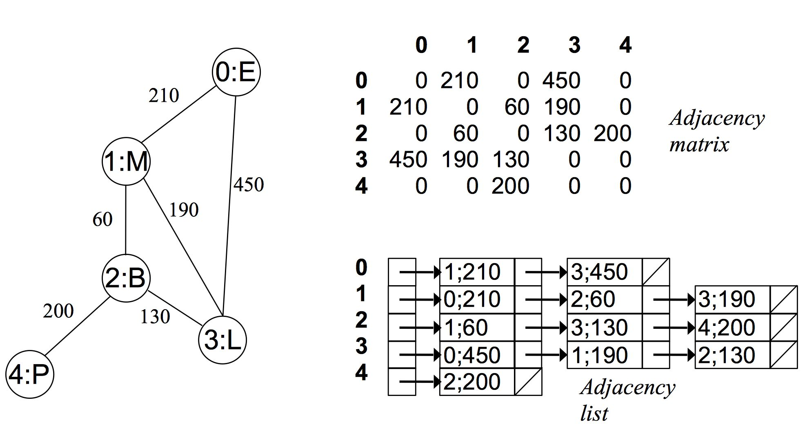
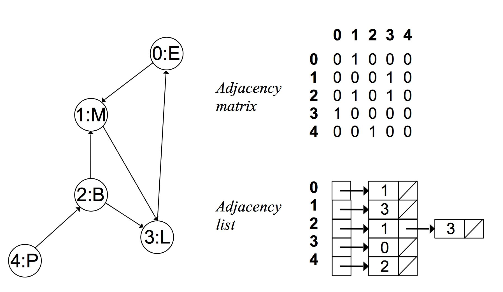

<style>
details {
    border: 1px solid #aaa;
    border-radius: 4px;
    padding: .5em .5em 0;
}
summary {
    font-weight: bold;
    margin: -.5em -.5em 0;
    padding: .5em;
}
details[open] {
    padding: .5em;
}
details[open] summary {
    border-bottom: 1px solid #aaa;
    margin-bottom: .5em;
}
</style>

<details><summary>目录</summary><p>

- [图论](#图论)
  - [图论介绍](#图论介绍)
  - [图的表示](#图的表示)
  - [图的遍历](#图的遍历)
  - [广度优先搜索](#广度优先搜索)
  - [深度优先搜索](#深度优先搜索)
- [最短路径算法](#最短路径算法)
  - [无权图](#无权图)
  - [有权图](#有权图)
    - [迪杰斯特拉算法 Dijkstra](#迪杰斯特拉算法-dijkstra)
    - [佛洛伊德算法 Floyd](#佛洛伊德算法-floyd)
- [最小生成树](#最小生成树)
- [网络流建模](#网络流建模)
- [搜索算法](#搜索算法)
  - [回溯](#回溯)
  - [递归](#递归)
  - [剪枝](#剪枝)
- [其他](#其他)
  - [二分查找](#二分查找)
- [参考](#参考)
</p></details><p></p>

# 图论

## 图论介绍

图论(Graph Theory)是数学的一个分支。它以图(Graph)为研究对象。
图论中的图是由若干给定的点及连接两点的线所构成的图形，
这种图形通常用来描述某些事物之间的某种特定关系，用点代表事物，
用连接两点的线表示相应两个事物间具有这种关系

图论是一种表示“多对多”的关系，图是由顶点和边组成的(可以无边，但至少包含一个顶点)：

* 一组顶点：通常用 V(vertex) 表示顶点集合
* 一组边：通常用 E(edge) 表示边的集合

图可以分为有向图和无向图，在图中：

* `$(v, w)$` 表示无向边，即 `$v$` 和 `$w$` 是互通的
* `$<v, w>$` 表示有向边，该边始于 `$v$`，终于 `$w$`

图可以分为有权图和无权图：

* 有权图：每条边具有一定的权重(weight)，通常是一个数字
* 无权图：每条边均没有权重，也可以理解为权为 1

图又可以分为连通图和非连通图：

* 连通图：所有的点都有路径相连
* 非连通图：存在某两个点没有路径相连

图中的顶点有度的概念：

* 度(degree)：所有与它连接点的个数之和
* 入度(in degree)：存在于有向图中，所有接入该点的边数之和
* 出度(out degree)：存在于有向图中，所有接出该点的边数之和

图的类型：

* 无向无权连通图
* 无向无权非联通图
* 无向有权连通图
* 无向有权非联通图
* 有向无权联通图
* 有向无权非连通图
* 有向有权连通图
* 有向有权非连通图

## 图的表示

图在程序中的表示一般有两种方式：

1. 邻接矩阵
    - 在 `$n$` 个顶点的图需要有一个 `$n \times n$` 大小的矩阵
    - 在一个无权图中，矩阵坐标中每个位置值为 1 代表两个点是相连的，0 表示两点是不相连的
    - 在一个有权图中，矩阵坐标中每个位置值代表该两点之间的权重，0 表示该两点不相连
    - 在无向图中，邻接矩阵关于对角线相等
2. 邻接链表
    - 对于每个点，存储着一个链表，用来指向所有与该点直接相连的点
    - 对于有权图来说，链表中元素值对应着权重

邻接矩阵与邻接链表示例：

* 无向无权图：

    

* 无向有权图中：

    

* 有向无权图：

    

邻接矩阵和链表对比：

* 邻接矩阵由于没有相连的边也占有空间，因此存在浪费空间的问题，
  而邻接链表则比较合理地利用空间
* 邻接链表比较耗时，牺牲很大的时间来查找，因此比较耗时，
  而邻接矩阵法相比邻接链表法来说，时间复杂度低

## 图的遍历

图的遍历就是要找出图中所有的点，一般有两种方法

* 深度优先搜索遍历(Depth First Search, DFS)
* 广度优先搜索遍历(Breadth First Search, BFS)

相当于在漆黑的夜里，你只能看清你站的位置和你前面的路，但你不知道每条路能够通向哪里。
搜索的任务就是，给出初始位置和目标位置，要求找到一条到达目标的路径

* 深度优先就是，从初始点出发，不断向前走，如果碰到死路了，就往回走一步，
  尝试另一条路，直到发现了目标位置。这种不撞南墙不回头的方法，
  即使成功也不一定找到一条好路，但好处是需要记住的位置比较少
* 广度优先就是，从初始点出发，把所有可能的路径都走一遍，如果里面没有目标位置，
  则尝试把所有两步能够到的位置都走一遍，看有没有目标位置；
  如果还不行，则尝试所有三步可以到的位置。这种方法，一定可以找到一条最短路径，
  但需要记忆的内容实在很多，要量力而行

## 广度优先搜索

广度优先搜索，可以被形象地描述为 "浅尝辄止"，它也需要一个队列以保持遍历过的顶点顺序，
以便按出队的顺序再去访问这些顶点的邻接顶点

实现思路：

1. 顶点 v 入队列
2. 当队列非空时则继续执行，否则算法结束
3. 出队列取得队头顶点 v；访问顶点 v 并标记顶点 v 已被访问
4. 查找顶点 v 的第一个邻接顶点 col
5. 若 v 的邻接顶点 col 未被访问过的，则 col 继续
6. 查找顶点 v 的另一个新的邻接顶点 col，转到步骤 5 入队列，
   直到顶点 v 的所有未被访问过的邻接点处理完。
   转到步骤 2 
   
要理解深度优先和广度优先搜索，首先要理解搜索步，一个完整的搜索步包括两个处理

1. 获得当前位置上，有几条路可供选择
2. 根据选择策略，选择其中一条路，并走到下个位置

## 深度优先搜索

基本思路：深度优先遍历图的方法是，从图中某顶点 `$v$` 出发

1. 访问顶点 v
2. 从 v 的未被访问的邻接点中选取一个顶点 w，从 w 出发进行深度优先遍历
3. 重复上述两步，直至图中所有和 v 有路径相通的顶点都被访问到


# 最短路径算法

## 无权图


## 有权图

在有权图中，常见的最短路径算法有

* 迪杰斯特拉(Dijkstra)算法
* 佛洛伊德(Floyd)算法

### 迪杰斯特拉算法 Dijkstra

单源最短路径

### 佛洛伊德算法 Floyd


# 最小生成树

# 网络流建模


# 搜索算法

## 回溯

## 递归

## 剪枝


# 其他

## 二分查找

二分查找简介: 

* 二分查找是一种算法, 其输入是一个有序的元素列表. 如果要查找的元素包含在列表中, 二分查找返回其位置; 否则返回 `null`.
    - 一般而言, 对于包含 `$n$` 个元素的列表, 用二分查找最多需要 `$log_2 n$` 步, 而简单查找最多需要 `$n` 步

二分查找实现: 

```python
# -*- coding: utf-8 -*-

def binary_search(List, item):
    # low 和 high 用于跟踪要在其中查找的列表部分
    low = 0
    high = len(List) - 1

    while low <= high:
        mid = (low + high) // 2
        guess = List[mid]
        if guess == item:
            return mid
        elif guess > item:
            high = mid - 1
        else:
            low = mid + 1
    
    return None


if __name__ == "__main__":
    my_list = [1, 3, 5, 7, 9]
    result1 = binary_search(my_list, 3)
    print(result1)

    result2 = binary_search(my_list, -1)
    print(result2)
```

# 参考

* [动画讲编程](https://www.zhihu.com/zvideo/1363902580368814081)

