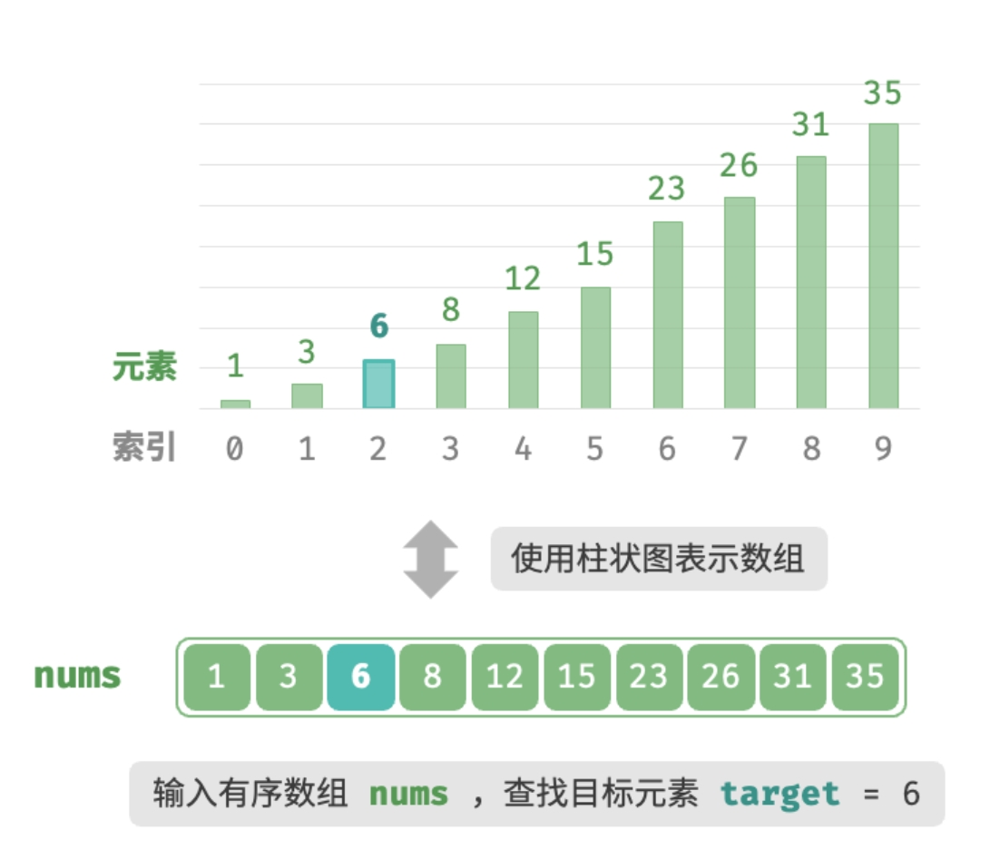
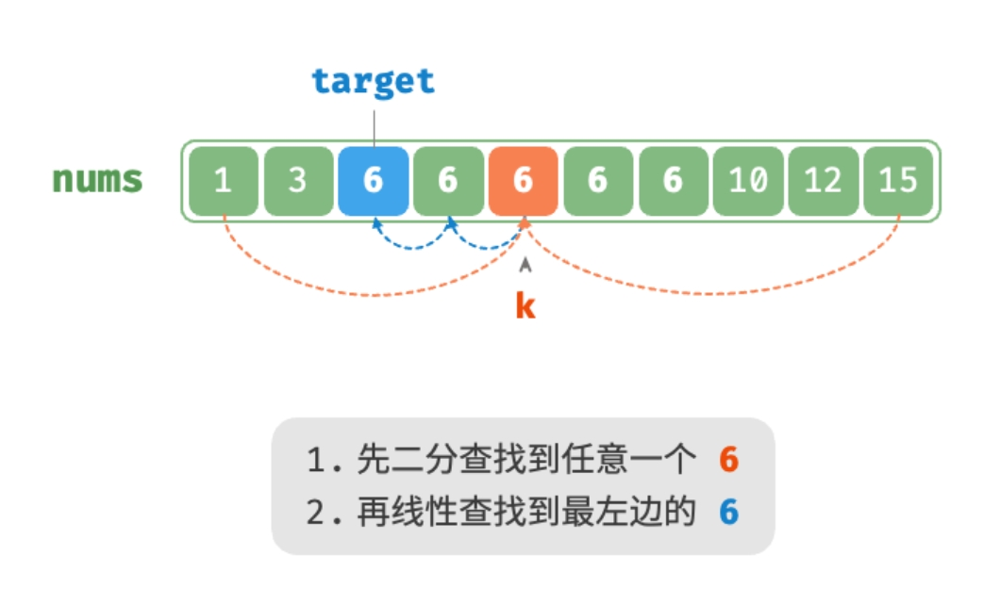

<style>
details {
    border: 1px solid #aaa;
    border-radius: 4px;
    padding: .5em .5em 0;
}
summary {
    font-weight: bold;
    margin: -.5em -.5em 0;
    padding: .5em;
}
details[open] {
    padding: .5em;
}
details[open] summary {
    border-bottom: 1px solid #aaa;
    margin-bottom: .5em;
}
img {
    pointer-events: none;
}
</style>

<details><summary>目录</summary><p>

- [二分查找](#二分查找)
    - [问题](#问题)
    - [双闭区间二分查找](#双闭区间二分查找)
        - [算法](#算法)
        - [实现](#实现)
    - [左闭右开区间二分法](#左闭右开区间二分法)
        - [算法](#算法-1)
        - [实现](#实现-1)
    - [优点与局限性](#优点与局限性)
- [二分查找插入点](#二分查找插入点)
    - [无重复元素的情况](#无重复元素的情况)
        - [问题](#问题-1)
        - [算法](#算法-2)
        - [实现-双闭区间](#实现-双闭区间)
        - [实现-左闭右开区间](#实现-左闭右开区间)
    - [存在重复元素的情况](#存在重复元素的情况)
        - [问题](#问题-2)
        - [算法](#算法-3)
        - [实现-双闭区间](#实现-双闭区间-1)
        - [实现-左闭右开区间](#实现-左闭右开区间-1)
- [二分查找边界](#二分查找边界)
- [哈希优化策略](#哈希优化策略)
- [重识搜索算法](#重识搜索算法)
- [TODO-搜索算法](#todo-搜索算法)
    - [回溯](#回溯)
    - [递归](#递归)
    - [剪枝](#剪枝)
- [参考](#参考)
</p></details><p></p>

# 二分查找

二分查找（binary search）是一种基于分治策略的高效搜索算法。
它利用数据的有序性，每轮缩小一般搜索范围，直至找到目标元素或搜索区间为空为止。
二分查找算法的输入是一个有序的元素列表，如果要查找的元素包含在列表中，
二分查找返回其位置；否则返回 `null`。

一般而言, 对于包含 `$n$` 个元素的列表, 用二分查找最多需要 `$log_2 n$` 步, 
而简单查找最多需要 `$n$` 步。

## 问题

> 给定一个长度为 `$n$` 的数组 `nums` ，元素按从小到大的顺序排列且不重复。
> 请查找并返回元素 `target` 在该数组中的索引。若数组不包含该元素，则返回 `$-1$`。
> 

## 双闭区间二分查找

### 算法

先初始化指针 `$i=0$` 和 `$j = n-1$`，分别指向数组首元素和尾元素，代表搜索区间 `$[0, n-1]$`。
请注意，中括号表示闭区间，其包含边界值本身。接下来，循环执行以下两步：

1. 计算中点索引 `$m = \lfloor(i + j) / 2\rfloor$`，
   其中 `$\lfloor$` 与 `$\rfloor$` 表示向下取整操作。
2. 判断 `nums[m]` 和 `target` 的大小关系，分为以下三种情况。
    - 当 `nums[m] < target` 时，说明 `target` 在区间 `$[m+1, j]$` 中，因此执行 `$i = m+1$`。
    - 当 `nums[m] > target` 时，说明 `target` 在区间 `$[i, m-1]$`中，因此执行 `$j = m-1$`。
    - 当 `nums[m] = target` 时，说明找到 `target` ，因此返回索引 `$m$`。


若数组不包含目标元素，搜索区间最终会缩小为空，此时返回 `$-1$`。
值得注意的是，由于 `$i$` 和 `$j$` 都是 `int` 类型，因此 `$i+j$` 可能会超出 `int` 类型的取值范围。
为了避免大数越界，我们通常采用公式 `$m = \lfloor i + (j-i) / 2\rfloor$` 来计算中点。

### 实现

```python
def binary_search(nums: List[int], target: int) -> int:
    """
    二分查找（双闭区间）
    """
    # 初始化双闭区间 [0, n-1]，即 low, high 分别指向数组首尾元素
    low, high = 0, len(nums) - 1
    # 循环，当搜索区间为空时跳出(当 low>high 时为空)
    while low <= high:
        # 理论上 Python 的数字可以无限大(取决于内存大小)，无须考虑大数越界问题
        mid = (low + high) // 2  # 计算中点索引 m
        if nums[m] < target:
            low = m + 1  # 此情况说明 target 在区间[m+1,high]中
        elif nums[m] > target:
            high = mid - 1  # 此情况说明 target 在区间[low,m-1]中
        else:
            return mid  # 找到目标元素，返回其索引
    
    return -1  # 未找到目标元素，返回 -1


if __name__ == "__main__":
    my_list = [1, 3, 5, 7, 9]
    result1 = binary_search(my_list, 3)
    print(result1)

    result2 = binary_search(my_list, -1)
    print(result2)
```

* 时间复杂度为 `$O(log n)$`：在二分循环中，区间每轮缩小一半，因此循环次数为 `$log_{2}n$`。
* 空间复杂度为 `$O(1)$`：指针 `$i$` 和 `$j$` 使用常数大小空间。

## 左闭右开区间二分法

### 算法

除了上述双闭区间外，常见的区间表示还有 “左闭右开” 区间，定义为 `$[0, n)$`，
即左边界包含自身，右边界不包含自身。在该表示下，区间 `$[i, j)$` 在 `$i = j$` 时为空。

在两种区间表示下，二分查找算法的初始化、循环条件和缩小区间操作皆有所不同。
由于“双闭区间”表示中的左右边界都被定义为闭区间，
因此通过指针 `$i$` 和指针 `$j$` 缩小区间的操作也是对称的。
这样更不容易出错，因此一般建议采用“双闭区间”的写法。


### 实现

```python
def binary_search_lcro(nums: list[int], target: int) -> int:
    """
    二分查找（左闭右开区间）
    """
    # 初始化双闭区间 [0, n)，即 low, high 分别指向数组首尾元素
    low, high = 0, len(nums)
    # 循环，当搜索区间为空时跳出(当 low>high 时为空)
    while low < high:
        mid = (low + high) // 2  # 计算中点索引 m
        if nums[m] < target:
            low = m + 1  # 此情况说明 target 在区间[m+1,high)中
        elif nums[m] > target:
            high = mid  # 此情况说明 target 在区间[low,m)中
        else:
            return mid  # 找到目标元素，返回其索引
    
    return -1  # 未找到目标元素，返回 -1


if __name__ == "__main__":
    my_list = [1, 3, 5, 7, 9]
    result1 = binary_search_lcro(my_list, 3)
    print(result1)

    result2 = binary_search_lcro(my_list, -1)
    print(result2)
```

## 优点与局限性

二分查找在时间和空间方面都有较好的性能：

* 二分查找的时间效率高。在大数据量下，对数阶的时间复杂度具有显著优势。
  例如，当数据大小 `$n = 2^{20}$` 时，线性查找需要 `$2^{20}=1048576$` 轮循环，
  而二分查找仅需 `$log_{2}2^{20}=20$` 轮循环。
* 二分查找无须额外空间。相较于需要借助额外空间的搜索算法（例如哈希查找），
  二分查找更加节省空间。

然而，二分查找并非适用于所有情况，主要有以下原因。

* <span style='border-bottom:1.5px dashed red;'>二分查找仅适用于有序数据</span>。
  若输入数据无序，为了使用二分查找而专门进行排序，得不偿失。
  因为排序算法的时间复杂度通常为 `$O(n log n)$`，比线性查找和二分查找都更高。
  对于频繁插入元素的场景，为保持数组有序性，需要将元素插入到特定位置，时间复杂度为 `$O(n)$`，
  也是非常昂贵的。
* <span style='border-bottom:1.5px dashed red;'>二分查找仅适用于数组</span>。
  二分查找需要跳跃式（非连续地）访问元素，而在链表中执行跳跃式访问的效率较低，
  因此不适合应用在链表或基于链表实现的数据结构。
* 小数据量下，线性查找性能更佳。在线性查找中，每轮只需 1 次判断操作；而在二分查找中，
  需要 1 次加法、1 次除法、1 ~ 3 次判断操作、1 次加法（减法），共 4 ~ 6 个单元操作；
  因此，当数据量 `$n$` 较小时，线性查找反而比二分查找更快。

# 二分查找插入点

二分查找不仅可以搜索目标元素，还可以解决许多变种问题，比如搜索目标元素的插入位置。

## 无重复元素的情况

### 问题

> 给定一个长度为 `$n$` 的有序数组 `nums` 和一个元素 `targe`，数组不存在重复元素。
> 现将 `target` 插入数组 `nums` 中，并保持其有序性。若数组中已存在元素 `target`，
> 则插入到其左方。请返回插入后 `target` 在数组中的索引。
> 

### 算法

如果想复用上一节的二分查找代码，则需要回答以下两个问题。

1. 问题一：当数组中包含 `target` 时，插入点的索引是否是该元素的索引？
    - 题目要求将 `target` 插入到相等元素的左边，这意味着新插入的 `target` 替换了原来 `target` 的位置。
      也就是说，当数组包含 `target` 时，插入点的索引就是该 `target` 的索引。
2. 问题二：当数组中不存在 `target` 时，插入点是哪个元素的索引？
    - 进一步思考二分查找过程：当 `nums[m] < target` 时 `$i$` 移动，
      这意味着指针 `$i$` 在向大于等于 `target` 的元素靠近。同理，
      指针 `$j$` 始终在向小于等于 `target` 的元素靠近。
      因此二分结束时一定有：`$i$` 指向首个大于 target 的元素，
      `$j$` 指向首个小于 `target` 的元素。易得当数组不包含 `target` 时，
      插入索引为 `$i$`。

### 实现-双闭区间

```python
def binary_search_insertion_simple(nums: list[int], target: int) -> int:
    """
    二分查找插入点（无重复点）
    """
    i, j = 0, len(nums) - 1  # 初始化双闭区间
    while i <= j:
        m = (i + j) // 2  # 计算中点索引 m
        if nums[m] < target:
            i = m + 1  # target 在区间 [m+1,j] 中
        elif nums[m] > target:
            j = m - 1  # target 在区间 [i,m-1] 中
        else:
            return m  # 找到 targe, 返回插入点 m
    # 未找到 target，返回插入点 i
    return i
```

### 实现-左闭右开区间

```python

```

## 存在重复元素的情况

### 问题

> 给定一个长度为 `$n$` 的有序数组 `nums` 和一个元素 `targe`，数组存在重复元素。
> 现将 `target` 插入数组 `nums` 中，并保持其有序性。若数组中已存在元素 `target`，
> 则插入到其左方。请返回插入后 `target` 在数组中的索引。
> 

### 算法

假设数组中存在多个 `target`，则普通二分查找只能返回其中一个 `target` 的索引，
而无法确定该元素的左边和右边还有多少 `target`。

题目要求将目标元素插入到最左边，所以我们需要查找数组中最左一个 `target` 的索引。
初步考虑通过下图所示的步骤实现：



1. 执行二分查找，得到任意一个 `target` 的索引，记为 `$k$`；
2. 从索引 `$k$` 开始，向左进行线性遍历，当找到最左边的 `target` 时返回。

此方法虽然可用，但其包含线性查找，因此时间复杂度为 `$O(n)$`。
当数组中存在很多重复的 `target` 时，该方法效率很低。

现考虑拓展二分查找代码，如下图所示，整体流程保持不变，美伦

### 实现-双闭区间

```python
def binary_search_insertion(nums: list[int], target: int) -> int:
    """
    二分查找插入点（存在重复元素）
    """
    i, j = 0, len(nums) - 1  # 初始化双闭区间 [0, n-1]
    while i <= j:
        m = (i + j) // 2
        if nums[m] < target:
            i = m + 1  # target 在区间 [m+i, j] 中
        elif nums[m] > target:
            j = m - 1  # target 在区间 [i, m-1] 中
        else:
            j = m - 1  # 首个小于 target 的元素在区间 [i, m-1] 中
    # 返回插入点 i
    return i
```

### 实现-左闭右开区间

```python

```

# 二分查找边界


# 哈希优化策略

# 重识搜索算法


# TODO-搜索算法

## 回溯

## 递归

## 剪枝


# 参考

* [动画讲编程](https://www.zhihu.com/zvideo/1363902580368814081)

