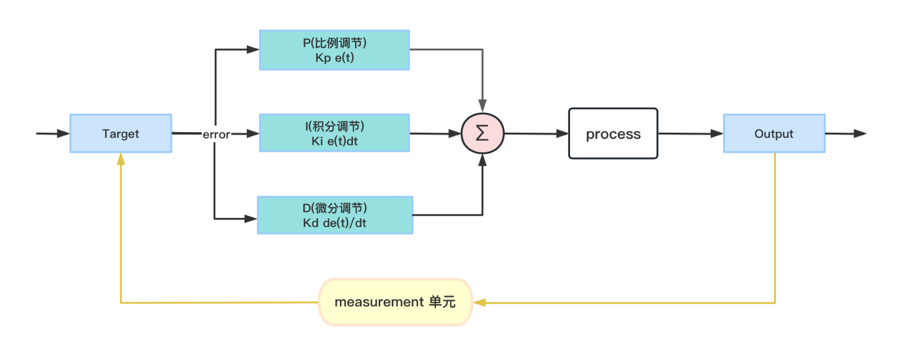

<style>
details {
    border: 1px solid #aaa;
    border-radius: 4px;
    padding: .5em .5em 0;
}
summary {
    font-weight: bold;
    margin: -.5em -.5em 0;
    padding: .5em;
}
details[open] {
    padding: .5em;
}
details[open] summary {
    border-bottom: 1px solid #aaa;
    margin-bottom: .5em;
}
img {
    pointer-events: none;
}
</style>

<details><summary>目录</summary><p>

- [PID 算法简介](#pid-算法简介)
    - [PID 算法应用](#pid-算法应用)
    - [PID 算法原理](#pid-算法原理)
- [比例控制算法](#比例控制算法)
    - [比例控制](#比例控制)
    - [稳态误差](#稳态误差)
- [积分控制算法](#积分控制算法)
- [微分控制算法](#微分控制算法)
- [PID Python 实例](#pid-python-实例)
- [PID 调试的一些经验](#pid-调试的一些经验)
- [参考](#参考)
</p></details><p></p>

# PID 算法简介

## PID 算法应用

PID 控制算法应该是非常广泛的控制算法，小到控制一个元件的温度，大到控制无人机的飞行姿态和飞行速度等等，
都可以使用 PID 控制，能够很好地保证系统的稳定性

具体来说，PID 算法可以用来控制温度、压强、流量、化学成分、速度等，
还有汽车的定速巡航、伺服驱动器中的速度位置控制、冷却系统的温度、液压系统的压力等

## PID 算法原理

PID(Proportion Integration Differentiation)其实就是指比例(Proportion)、积分(Integration)、微分(Differentiation)控制



PID 的基本原理是，当得到系统的输出后，讲输出和输入的差值作为偏差，再将这个偏差信号经过比例、积分、
微分三种运算方式叠加后以一定的方式加入到输入中，从而控制最终的结果，达到想要的输出值

假设某时刻偏差为 `$e(t)$`，则 PID 数学公式表示：

`$$u(t) = K_{p}\Bigg(e(t) + \frac{1}{T_{i}}\int e(t) dt + T_{d}\frac{d e(t)}{dt}\Bigg)$$`

其中：

* `$K_{p}$` 为比例系数
* `$T_{i}$` 积分时间
* `$T_{d}$` 微分时间

其中括号内的：

* 第一项是比例项
* 第二项是积分项
* 第三项是微分项

很多情况下，比如要在计算机上实现，仅仅需要在离散的时候使用，则控制可以化为：

`$$\begin{align}
u(k) 
&= K_{p}e(k) + \frac{K_{p}T}{T_{i}}\sum_{n=0}^{k}e(n)+\frac{K_{p}T_{d}}{T}\Big(e(k) - e(k-1)\Big) \\
&= K_{p}e(k) + K_{i}\sum_{n=0}^{k}e(n) + K_{d}\Big(e(k) - e(k-1)\Big)
\end{align}$$`

其中

* `$K_{p}$` 比例系数
    - 增大比例系数使系统反应灵敏，调节速度加快，并且可以减小稳态误差。但是比例系数过大会使超调量增大，
      振荡次数增加，调节时间加长，动态性能变坏，比例系数太大甚至会使闭环系统不稳定
    - 比例控制不能消除稳态误差
* `$K_{i}$` 积分系数
    - 使系统消除稳态误差，提高无差度
    - 积分控制的作用是，只要系统有误差存在，积分调节就进行，积分控制器就不断地积累，
      输出控制量，直至无差，积分调节停止，积分调节输出一常值。因而，只要有足够的时间，积分控制将能完全消除误差，
      使系统误差为零，从而消除稳态误差
    - 积分作用的强弱取决于积分时间常数 `$T_{i}$`，`$T_{i}$` 越小，积分作用就越强，
      积分作用太强会使系统超调加大，甚至使系统出现振荡，反之 `$T_{i}$` 大则积分作用弱。加入积分调节可使系统稳定性下降，动态响应变慢
* `$K_{d}$` 微分系数
    - 微分控制可以减小超调量，克服振荡，使系统的稳定性提高，同时加快系统的动态响应速度，减小调整时间，从而改善系统的动态性能
    - 微分的控制作用跟偏差的变化的速度有关，微分控制能够预测偏差，产生超前的校正作用，有助于减少超调

可以看出，某一个偏差的 PID 值只跟相邻的三个偏差相关。每一项前面都有系数，这些系数都是需要实验中去尝试然后确定的。
比例、微分、积分每个项前面都有一个系数，且离散化的公式，很适合编程实现

讲到这里，PID 的原理和方法就说完了，剩下的就是实践了。在真正的工程实践中，最难的是如果确定三个项的系数，
这就需要大量的实验以及经验来决定了。通过不断的尝试和正确的思考，就能选取合适的系数，实现优良的控制器

# 比例控制算法

## 比例控制

先说 PID 中最简单的比例控制，抛开其他两个不谈。还是用一个经典的例子吧。
假设有一个水缸，最终的控制目的是要保证水缸里的水位永远的维持在 1 米的高度。
假设初始时刻，水缸里的水位是 0.2 米，那么当前时刻的水位和目标水位之间是存在一个误差的 error，
且 error 为 0.8。这个时候，假设旁边站着一个人，这个人通过往缸里加水的方式来控制水位

如果单纯的用比例控制算法，就是指加入的水量 `$u$` 和误差 error 是成正比的。即

`$$u = K_{p} \times error$$`

假设 `$K_{p}$` 取 0.5：

* 那么 `$t=1$` 时(表示第 1 次加水，也就是第一次对系统施加控制)，
  那么 `$u=0.5 \times 0.8=0.4$`，所以这一次加入的水量会使水位在 0.2 的基础上上升 0.4，
  达到 0.6
* 接着，`$t=2$` 时刻(第 2 次施加控制)，当前水位是 0.6，所以 error 是 0.4。
  `$u=0.5 \times 0.4=0.2$`，会使水位再次上升 0.2，达到 0.8。

如此这么循环下去，就是比例控制算法的运行方法。可以看到，最终水位会达到我们需要的 1 米

## 稳态误差

但是，单单的比例控制存在着一些不足，其中一点就是：稳态误差

上述的例子，根据 `$K_{p}$` 取值不同，系统最后都会达到 1 米，只不过 `$K_{p}$` 大了到达的快，
`$K_{p}$` 小了到达的慢一些，不会有稳态误差

但是，考虑另外一种情况，假设这个水缸在加水的过程中，存在漏水的情况，假设每次加水的过程，
都会漏掉 0.1 米高度的水。仍然假设 `$K_{p}$` 取 0.5，
那么会存在着某种情况，假设经过几次加水，水缸中的水位到 0.8 时，水位将不会再变换。
因为，水位为 0.8，则误差 `$error=0.2$`. 所以每次往水缸中加水的量为 `$u=0.5 \times 0.2=0.1$`。
同时，每次加水，缸里又会流出去 0.1 米的水，加入的水和流出的水相抵消，水位将不再变化。
也就是说，目标是 1 米，但是最后系统达到 0.8 米的水位就不再变化了，且系统已经达到稳定。
由此产生的误差就是稳态误差了

在实际情况中，这种类似水缸漏水的情况往往更加常见，比如控制汽车运动，
摩擦阻力就相当于是“漏水”，控制机械臂、无人机的飞行，
各类阻力和消耗都可以理解为本例中的“漏水”。
所以，单独的比例控制，在很多时候并不能满足要求

# 积分控制算法

还是用上面的例子，如果仅仅用比例，可以发现存在稳态误差，最后的水位就卡在 0.8 了。
于是，在控制中，再引入一个分量，该分量和误差的积分是正比关系。
所以，比例 + 积分控制算法为：

`$$u(t)=K_{p} \times e(t) + K_{i} \times \int e(t) dt$$`

还是用上面的例子来说明，第一次的误差 error 是 0.8，第二次的误差是 0.4，至此，
误差的积分(离散情况下积分其实就是做累加)，`$\int e(t) dt = 0.8 + 0.4 = 1.2$`。
这个时候的控制量，除了比例的那一部分，还有一部分就是一个系数 `$K_{i}$` 乘以这个积分项

由于这个积分项会将前面若干次的误差进行累计，所以可以很好的消除稳态误差。
假设在仅有比例项的情况下，系统卡在稳态误差了，即上例中的 0.8，由于加入了积分项的存在，
会让输入增大，从而使得水缸的水位可以大于 0.8，渐渐到达目标的 1.0。这就是积分项的作用

# 微分控制算法

换一个例子，考虑刹车情况。平稳的驾驶车辆，当发现前面有红灯时，
为了使得行车平稳，基本上提前几十米就放松油门并踩刹车了。
当车辆离停车线非常近的时候，则使劲踩刹车，使车辆停下来。
整个过程可以看做一个加入微分的控制策略

微分，说白了在离散情况下，就是 error 的差值，就是 `$t$` 时刻和 `$t-1$` 时刻 error 的差，即 

`$$u(t) = K_{d} \times \big(e(t) - e(t-1)\big)$$`

可以看到，在刹车过程中，因为 error 是越来越小的，所以这个微分控制项一定是负数，
在控制中加入一个负数项，他存在的作用就是为了防止汽车由于刹车不及时而闯过了线。
从常识上可以理解，越是靠近停车线，越是应该注意踩刹车，不能让车过线，所以这个微分项的作用，
就可以理解为刹车，当车离停车线很近并且车速还很快时，
这个微分项的绝对值(实际上是一个负数)就会很大，从而表示应该用力踩刹车才能让车停下来

切换到上面给水缸加水的例子，就是当发现水缸里的水快要接近 1 的时候，加入微分项，
可以防止给水缸里的水加到超过 1 米的高度，说白了就是减少控制过程中的震荡

# PID Python 实例

```python
# -*- coding: utf-8 -*-

# ***************************************************
# * File        : pid.py
# * Author      : Zhefeng Wang
# * Email       : wangzhefengr@163.com
# * Date        : 2023-06-07
# * Version     : 0.1.060722
# * Description : description
# * Link        : link
# * Requirement : 相关模块版本需求(例如: numpy >= 2.1.0)
# ***************************************************

# python libraries
import os
import sys
ROOT = os.getcwd()
if str(ROOT) not in sys.path:
    sys.path.append(str(ROOT))
import time

import matplotlib.pyplot as plt
import numpy as np
# from scipy.interpolate import spline
from scipy.interpolate import make_interp_spline


# global variable
LOGGING_LABEL = __file__.split('/')[-1][:-3]


class PID:
    
    def __init__(self, P, I, D) -> None:
        # PID 系数
        self.Kp = P
        self.Ki = I
        self.Kd = D
        # 时间变量
        self.sample_time = 0.0  # TODO
        self.current_time = time.time()  # 当前时刻时间戳
        self.last_time = self.current_time  # 上次算法更新时刻时间戳
        # 重置
        self.clear()
    
    def clear(self):
        self.setpoint = 0.0  # 设定目标值
        self.P_term = 0.0  # P
        self.I_term = 0.0  # I
        self.D_term = 0.0  # D
        self.last_error = 0.0  # 上一时刻的误差
        self.output = 0.0  # 输出
    
    def update(self, feedback_value):
        # 时间差
        self.current_time = time.time()  # 当前时间
        delta_time = self.current_time - self.last_time

        # 误差差分
        error = self.setpoint - feedback_value  # 当前时刻误差
        delta_error = error - self.last_error
        
        # PID
        if delta_time >= self.sample_time:
            # PID 各项计算
            self.P_term = self.Kp * error  # 比例项
            self.I_term += error * delta_time  # 积分项
            self.D_term = delta_error / delta_time if delta_time > 0.0 else 0.0  # 微分项

            # 更新 last_time
            self.last_time = self.current_time
            # 更新 last error
            self.last_error = error
            # 更新输出
            self.output = self.P_term + (self.Ki * self.I_term) + (self.Kd * self.D_term)
        
    def set_sample_time(self, sample_time):
        self.sample_time = sample_time
 
    @staticmethod
    def visual(time_list, feedback_list, setpoint_list, END):
        print(f"time_list: {time_list}")
        print(f"setpoint_list: {setpoint_list}")
        fig = plt.figure()
        time_smooth = np.linspace(min(time_list), max(time_list), 300)
        print(f"time_smooth: {time_smooth}")
        feedback_smooth = make_interp_spline(time_list, feedback_list)(time_smooth)
        print(f"feedback_smooth: {feedback_smooth}")
        plt.plot(time_list, setpoint_list, 'r')  # 绘制设定目标曲线
        plt.plot(time_smooth, feedback_smooth, 'b-')  # 设定
        plt.xlim((0, END))
        plt.ylim((min(feedback_list) - 0.5, max(feedback_list) + 0.5))
        plt.xlabel('time (s)')
        plt.ylabel('PID (PV)')
        plt.title('PID test', fontsize = 15)
        plt.grid(True)
        plt.show()


def test_pid(P, I , D, END):
    # 实例化 PID 类
    pid = PID(P, I, D)
    
    # 设置参数
    pid.setpoint = 1.1  # 设置目标值
    pid.set_sample_time(sample_time = 0.01)  # 设置采样间隔时间
    time_list = list(range(1, END))
    feedback = 0.5  # 设置初始反馈值
    
    feedback_list = []  # 反馈值
    setpoint_list = []  # 设定值
    for i in time_list:
        # PID 更新
        pid.update(feedback_value = feedback)
        feedback += pid.output  # 更新反馈值
        time.sleep(0.01)
        feedback_list.append(feedback)
        setpoint_list.append(pid.setpoint)
    # 画图
    pid.visual(time_list, feedback_list, setpoint_list, END)    


# 测试代码 main 函数
def main():
    test_pid(P = 1.2, I = 1, D = 0.001, END = 20)
    
if __name__ == "__main__":
    main()
```

# PID 调试的一些经验

PID 调试的一般原则：

* 在输出不震荡时，增大比例增益
* 在输出不震荡时，减少积分时间常数
* 在输出不震荡时，增大微分时间常数

PID 调节口诀：

* 参数整定找最佳，从小到大顺序查
* 先是比例后积分，最后再把微分加
* 曲线振荡很频繁，比例度盘要放大
* 曲线漂浮绕大湾，比例度盘往小扳
* 曲线偏离回复慢，积分时间往下降
* 曲线波动周期长，积分时间再加长
* 曲线振荡频率快，先把微分降下来
* 动差大来波动慢，微分时间应加长
* 理想曲线两个波，前高后低四比一
* 一看二调多分析，调节质量不会低

# 参考

* [PID控制算法原理(抛弃公式，从本质上真正理解PID控制)](https://zhuanlan.zhihu.com/p/39573490)
* [串讲：控制理论：PID控制（经典控制理论）](https://zhuanlan.zhihu.com/p/147800110)
* [PID控制算法原理](https://cloud.tencent.com/developer/article/1456305)
