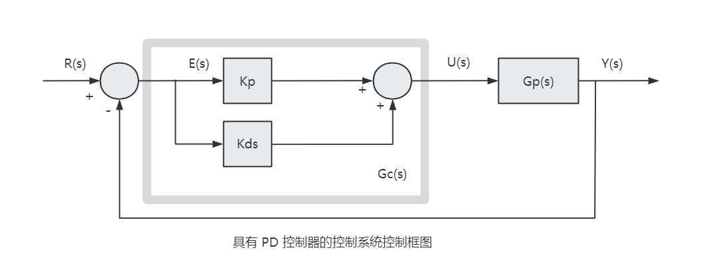

目录

- [控制系统简介](#控制系统简介)
    - [什么是控制系统](#什么是控制系统)
    - [控制系统的基本组成部分](#控制系统的基本组成部分)
    - [控制系统的应用](#控制系统的应用)
        - [汽车转向控制](#汽车转向控制)
        - [汽车怠速控制](#汽车怠速控制)
    - [控制系统的分类](#控制系统的分类)
        - [开环控制系统-无反馈系统](#开环控制系统-无反馈系统)
        - [闭环控制系统-反馈控制系统](#闭环控制系统-反馈控制系统)
        - [反馈控制系统的类型](#反馈控制系统的类型)
        - [线性系统与非线性系统](#线性系统与非线性系统)
        - [时不变与时变系统](#时不变与时变系统)
        - [连续控制系统](#连续控制系统)
        - [离散控制系统](#离散控制系统)
- [控制框图和信号流图](#控制框图和信号流图)
    - [控制框图](#控制框图)
        - [控制系统中典型元件的控制框图建模](#控制系统中典型元件的控制框图建模)
        - [比较器](#比较器)
        - [方框](#方框)
        - [反馈](#反馈)
    - [信号流图](#信号流图)
- [控制系统设计](#控制系统设计)
    - [控制系统设计简介](#控制系统设计简介)
        - [设计要求](#设计要求)
        - [控制器结构](#控制器结构)
        - [设计的基本原则](#设计的基本原则)
    - [PD 控制器的设计](#pd-控制器的设计)
        - [PD 控制的时域分析](#pd-控制的时域分析)
        - [PD 控制的频域分析](#pd-控制的频域分析)
        - [PD 控制的作用总结](#pd-控制的作用总结)
    - [PI 控制器的设计](#pi-控制器的设计)
    - [PID 控制器的设计](#pid-控制器的设计)
- [参考](#参考)

# 控制系统简介

* 什么是控制系统
* 控制系统的基本组成部分
* 控制系统应用示例
* 控制系统的分类
* 绝大多数控制系统均具有反馈

## 什么是控制系统

为了实现某些特定“目标”，通常需要引入能够执行某种控制策略的控制系统。

## 控制系统的基本组成部分

控制系统的基本组成部分包括：

1. 控制目标
2. 控制系统（元件）
3. 结果或输出

上述三部分之间的基本关系如下图所示，此控制框图提供了一种图形化的方法来描述控制系统的元件如何进行交互。
在这种情况下，**控制目标**可由**输入**（或者称为激励信号 `$u$`）和**输出**（或者称为被控变量 `$y$`）确定。
一般而言，控制系统的目标在于通过输入，经由控制元件，以某种预先设定的方式来控制输出。

## 控制系统的应用

控制系统的应用领域包括：

* 过程控制
    - 实现工业环境下的自动化和批量生产
* 机床
* 机器人系统
* 运输系统
* 微机电系统
* 芯片实验室
* 生物力学和生物医学

### 汽车转向控制

汽车转向控制系统为上图控制系统的简单例子。

考虑汽车转向系统，被控变量或输出 `$y$` 是两个前轮的方向；激励信号或输入 `$u$` 为方向盘的方向。
转向机构和整车动力系统组成了这样的控制系统或者类似的过程。

如果控制汽车的速度是目的，那么施加在加速器上的压力就是激励信号，车辆速度就是被控变量。

总体来说，可以认为简化的汽车控制系统有两个输入（方向盘和加速器）和两个输出（方向和速度）。
这里的两个控制量和两个输出量是相互独立的，但是有些系统中的控制量之间是相互关联的。
具有超过一个输入和一个输出的系统被称为**多变量系统**。

### 汽车怠速控制

以汽车发动机的怠速控制为例，这个控制系统的目标是：在发动机上施加诸如传动、电力辅助转向、空调等负载的情况下，
维持发动机以较低的速度空转，以降低损耗。如果没有怠速控制，任何突加于发动机的负载都会造成发动机速度陡降，
甚至导致发动机熄火。因此，怠速控制系统的主要目的在于：在发动机上施加负载时，消除或尽量减少转速下降；
使发动机怠速稳定在期望值上。

下图是怠速控制系统框图。这里节气阀调节角 `$\alpha$` 和负载转矩 `$T_{L}$`
（使用空调、电力辅助、转向或电力制动产生的转矩）是输入，发动机转速 `$\omega$` 是输出，
发动机则是被控过程或系统。

## 控制系统的分类

### 开环控制系统-无反馈系统

开环控制系统通常由两个部分组成：控制器与被控过程。参考输入 `$r$` 被用于控制器，其输出为激励信号 `$u$`；
激励信号作用于被控过程上，使被控变量 `$y$` 达到预先设定值。

比较简单的情况下，根据系统特性，控制器可能是放大器、机械连接或者是其他控制元件；
在复杂的情况下，控制器可能是计算机，如微处理器等。

由于开环控制系统具有简单经济的特点，其常被用于很多不重要的应用中。

### 闭环控制系统-反馈控制系统

开环控制系统缺少从输出到输入的反馈，这种反馈可以提供更精确、更具适应性的控制。
为了获得更精确的控制，被控信号 `$y$` 经反馈后与参考输入比较，输入与输出的差值经比例放大得到执行信号，
并送给系统以纠正误差。具有至少一条上述反馈路径的系统称为闭环控制系统。

下图是一个闭环怠速控制系统（调节器系统）框图，该系统的目标在于维持系统输出在预先设定的固定值上。
参考输入 `$\omega_{r}$` 设定为期望的怠速。发动机的怠速对应于参考值 `$\omega_{r}$`，
任意偏差（如转矩 `$T_{L}$`）都会被速度变换器和误差传感器检测到。
控制器根据偏差产生一个信号来调整节气阀调节角 `$\alpha$` 以消除误差。

### 反馈控制系统的类型

反馈控制系统可以有多种分类方法，如何分类取决于分类的目的。

按照分析和设计的方法，反馈控制系统可以分为：

* 线性与非线性系统
* 时变与时不变系统

按照系统中信号的种类，可以分为：

* 连续与离散系统
* 调制与非调制系统

控制系统还常根据系统的主要目的来分类：

* 位置控制系统
* 速度控制系统

另外，控制系统的类型是由开环传递函数确定的。总之，根据系统的一些特征有很多种分类方法。

### 线性系统与非线性系统

**线性系统：**

严格来说，线性系统实际上并不存在，因为实际的物理系统总是具有一定程度的非线性。
线性反馈控制系统被作为一种理想化模型而提出。
当控制系统内**信号的幅值**被限制在**系统各部件呈现线性特征的范围内**时，
此系统就可以被认为是线性的。

**非线性系统：**

当信号幅值超过不见线性运行区域时，根据非线性的程度，
系统就可能被认为是非线性的了。例如，

* 控制系统中常用的放大器在输入信号较大时呈现饱和特性；
* 电动机电磁场往往也具有饱和特性。

控制系统中其他常见的非线性现象包括：

* 啮合齿轮之间的齿隙和死区
* 弹簧的非线性特性
* 两移动组件之间的非线性摩擦力或力矩
* ...

控制系统中常利用非线性特性来改善系统性能或提供更高效的控制。例如，为了实现最短时间控制，
许多导弹和太空船的控制系统里常使用开关型（bang-bang 或继电）控制器。其中，
典型的例子是装在导弹和飞船侧面的喷管，它们产生反作用力矩提供提供姿态控制。这些喷管往往以全开或全关的方式工作，
它们能在一定时间里喷出固定量的气体来控制弹（船）体姿态。

对于线性系统，有许多解析的和图形的方法可以用于分析与设计。至于非线性系统，则往往难以用数学方法处理，
也没有适用于各种非线性系统的通用方法。在设计控制器的开始阶段，可以基于线性模型设计不考虑系统的非线性，
然后采用计算机仿真，把设计好的控制器用于非线性模型加以评估或重新设计。

> 力矩：

### 时不变与时变系统

如果系统参数在系统运行过程中相对于时间是不变的，那么称此系统为时不变系统。

实际上，多数物理系统都包含一些参数随时间波动或变化的部件。比如在电动机刚启动以及温度升高时，
电动机的绕线电阻会发生变化。时变系统的另一个例子是制导导弹控制系统，
飞行中导弹的质量会随着其携带的燃料的不断消耗而减少。

尽管**不具有非线性的时变系统**仍然是线性系统，但是这类系统的分析和设计往往比**线性时不变系统**困难得多。

### 连续控制系统

连续系统是指各部分信号是连续时间变量 `$t$` 的函数的系统。

连续系统中的信号可以进一步分为交流信号和直流信号。与电子工程中的交直流定义不同，
交流和直流控制系统在控制系统中具有特殊意义。

* 交流控制系统通常是指系统信号已根据某种调制模式调制过。
* 直流控制系统只是意味着信号没有经过调制，但仍然有符合传统定义的交流信号。

实际上，并非所有的系统都严格符合直流或交流系统的定义。系统可能混用交流和直流原件，
同时在系统不同部分使用调制器和解调器来匹配信号。

### 离散控制系统

区别于连续系统，离散控制系统中一点或多点信号是以脉冲序列或数字编码的形式出现的。
通常离散控制系统又分为采样控制系统和数字控制系统。
采样控制系统指一大类使用脉冲信号的离散系统。数字控制系统中使用数字计算机或者控制器，
因此信号是数字编码的，例如二进制码。

一般情况下，采样系统每隔一定的时间获取一次数据或信息。例如，控制系统的误差信号只能由脉冲提供，
在两个相邻的脉冲之间的时间间隔里，系统是收不到误差信号的。严格来讲，采样数据系统属于交流系统，
因为信号是脉冲调制的。

TODO

> TODO 脉冲：

# 控制框图和信号流图

控制框图可以作为建模控制系统的图形表达和潜在的数学公式。控制框图是控制系统学习中的一个热点，
因为它能让人更好地理解动态系统的组成和互连。信号流图也可以用作控制系统模型的可用图形表达。
信号流图也可作为控制框图的另一种表示。

## 控制框图

**控制框图建模**和**传递函数模型**描述了整个系统的因果（输入-输出）关系。

例如，已知教室里的加热系统的简化控制图如下所示，通过设置期望温度，也称为**输入**，
可以打开锅炉为房间提供热量，实际的室温也称为**输出**，
通过恒温器内的**传感器**测量，恒温器内的简单电路将实际室温与期望室温进行比较（**比较器**）。
如果室温低于期望温度，将产生误差电压，误差电压作为开关打开气体阀门从而打开锅炉（或**执行器**）。
打开教室的门窗会造成热量损失，这自然会干扰加热过程（**扰动**）。
房间的温度是由输出传感器不断监测的，测量输出并将它与输入进行比较以建立误差信号的过程称为**反馈**。
注意，这里的误差电压使锅炉打开，当误差达到零时锅炉最终关闭。
本例中，控制框图只是简单地展示了系统组成部分之间的相互作用，并没有给出数学细节。
如果系统所有元件的数学关系和函数关系已知，则控制框图可以作为系统分析或者计算求解的工具。

一般来说，控制框图可以为线性系统和非线性系统建模。对于非线性系统，控制框图的变量是时域的，
而对于线性系统，则采用拉普拉斯变换变量。因此在这种情况下，假设系统所有元件为线性模型，
系统动态在拉普拉斯域中通过传递函数表示为：

`$$\frac{Ti(s)}{To(s)}$$`

其中：

* `$Ti(s)$` 是期望室温的拉普拉斯形式
* `$To(s)$` 为实际室温

### 控制系统中典型元件的控制框图建模

大多数控制系统框图中的典型元件如下：

* 比较器
* 表示单个元件传递函数的方框，包括：
    - 输入信号变换器
    - 输出传感器
    - 执行器
    - 控制器
    - 对象（被控变量的元件）
* 输入或参考信号
* 输出信号
* 扰动信号
* 反馈回路

上图展示了这些元件互连的结构。可以比较上面两个图，为每个系统找到控制术语。
因此，每个方框代表控制系统的一个元件，每个元件可以由一个或多个方程建模。
通常情况下，这些方程是在拉普拉斯域的（因为采用传递函数易于操作），
但也可以用时间表示。一旦完全构造出系统的控制框图，就可以研究单个元件或这个系统的行为。

### 比较器

### 方框

### 反馈

## 信号流图

# 控制系统设计

## 控制系统设计简介

> * 基于时域和频域的方法设计
> * 在控制系统中，实用不同的控制器，比如：比例控制器、微分控制器、积分控制器、前馈控制器、反馈控制器

以下图所示控制框图表示的受控过程为例，控制系统设计主要涉及以下三个步骤：

1. 确定系统应该做什么以及如何做（设计要求）
2. 根据控制器或校正器在受控系统中的连接方式，确定其结构配置
3. 确定控制器的参数，使得系统达到设计目标

### 设计要求

### 控制器结构

通常来说，线性受控过程的动态行为可以用上图所示控制框图表示。
控制系统的设计目标是在一定的时间间隔内通过控制输入信号 `$u(t)$` 
使得输出向量 `$y(t)$` 表示的受控变量满足期望要求。

控制系统中的大多数常规设计方法依赖于所谓的固定结构设计：
设计者一开始就决定了整个设计系统的基本结构，
以及控制器相对于受控过程的位置。然后设计问题变成了控制器元件的设计。
由于大多数控制行为涉及对系统性能特征的修正或校正，所以一般使用固定结构的设计也称为校正。

几个常用的带有校正控制器的控制系统结构以及简单描述如下：

* 串联（级联）校正
    - 在受控过程中串联一个控制器，这种结构被称为串联或级联校正

* 反馈校正
    - 这种将控制器放在负反馈回路中的设计称为反馈校正

* 状态反馈校正
    - 系统的状态变量经定常增益得到控制信号，这被称为状态反馈。状态反馈的缺点是，对于高阶系统来说，
      状态变量较多，为了进行状态反馈就需要较多的传感器来检测状态变量，这样在实际应用时造价高且不可行。
      即使对于低阶系统，并不是所有的变量都可以直接可测，因此可能需要用观测器或估计器根据测得的输出变量来估计状态变量。

* 串联反馈校正
    - 由一个串联控制器和一个反馈控制器组成的串联反馈校正。

* 前馈校正
    - 下图所示的都是前馈校正。
      在第一个图中，前馈控制器 `$G_{cf}(s)$` 在前向通道中与控制器 `$G_{c}(s)$` 和受控过程组成的闭环系统串联在一起。
      在第二个图中，前馈控制器 `$G_{cf}(s)$` 与前向通道平行，而不在控制系统回路中，
      这样就不会影响原系统特征方程的特征根。可以选择 `$G_{cf}(s)$` 的零极点来增加或抵消系统闭环传递函数的零极点。

### 设计的基本原则

## PD 控制器的设计

之前讨论的所有控制系统中的控制器都是常数增益为 `$K$` 的放大器，
控制器输出的控制信号只与控制器的输入程简单的系数比例关系，这类控制方式称为**比例控制**。

直观上讲，除了比例运算外，我们也应该能够使用输入信号的微分或积分运算，
因此，更为一般的连续控制器应该包括**加法器（加法或减法）**、**放大器**、
**衰减器**、**微分器**和**积分器**等元件。
设计者的任务就是要确定采用其中的哪些元件，用多大的比例，以及如何把它们连接在一起。
例如，在实际应用中最常用的一类控制器就是 PID 控制器，三个字母分别表示比例（Proportional）、
积分（Integral）、微分（Derivative），在 PID 控制器中微分和积分部分都有各自的性能含义。
要想应用这些部分，就必须理解它们的基本特性。为此，首先我们考虑 PD 控制。

任意一个二阶反馈控制系统的控制框图如下图所示：

其传递函数为：

`$$G_{P}(s)=\frac{\omega_{n}^{2}}{s(s+2\xi \omega_{n})}$$`

采用比例-微分(PD)控制的串联控制器的传递函数为：

`$$G_{c}(s) = K_{P}+K_{D} s$$`

因此，系统的控制信号为：

`$$u(t) = K_{P}e(t)+K_{D}\frac{d e(t)}{d t}$$`

其中：

* `$K_{P}$` 是比例系数
* `$K_{D}$` 是微分系数

用图 6-1 中的元件，可以得到 PD 控制器的两种电路实现，如下图所示。

### PD 控制的时域分析

### PD 控制的频域分析

### PD 控制的作用总结

虽然 PD 控制器对有轻微振荡或初始不稳定的系统不适用，
但正确设计的 PD 控制器可能通过以下几个方面影响控制系统的性能：

1. 改善阻尼，减小最大超调量
2. 缩短上升时间和调节时间
3. 增加 BW
4. 改善 GM、PM 和 `$M_{r}$`
5. 可能放大高频噪声
6. 在电路实现中可能需要相当大的电容

## PI 控制器的设计

PD 控制器可以改进控制系统的阻尼和上升时间，但其代价是更高的带宽和谐振频率，
且 PD 控制不影响稳态误差，除非稳态误差是随时间变化的，而对跃阶输入而言，
PD 控制下系统的稳态误差通常是不变的。因此，PD 控制器在许多情况下不能满足系统的校正要求。

## PID 控制器的设计

# 参考

* [自动控制系统]()
