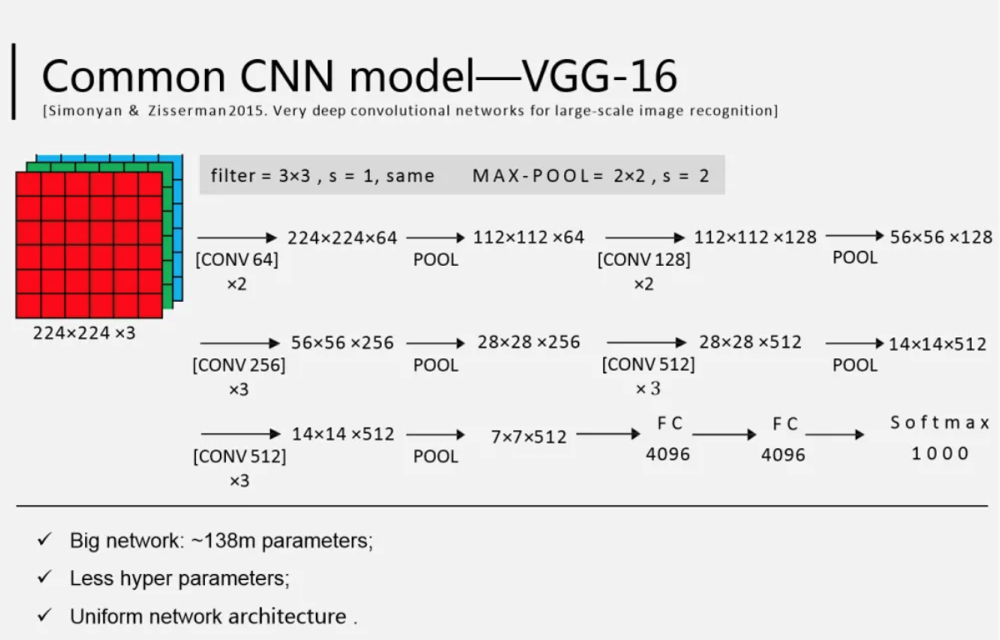
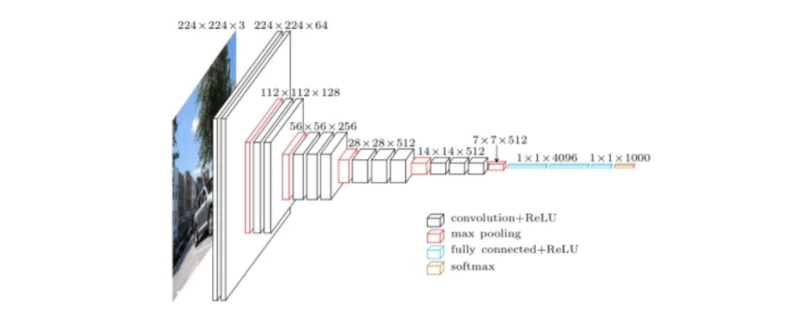

目录

- [VGG-Net 简介](#vgg-net-简介)
- [VGG-16 网络结构](#vgg-16-网络结构)
- [VGG-19 网络结构](#vgg-19-网络结构)
- [参考](#参考)

# VGG-Net 简介

> VGG16，VGG19

由于不断的积累实践和日益强大的计算能力，使得研究人员敢于将神经网络的结构推向更深层。
在 2014 年提出的 VGG-Net 中，首次将卷积网络结构拓展至 16 和 19 层，也就是著名的 VGG16 和 VGG19。

VGG 架构由牛津大学视觉几何小组的 Karen Simonyan 和 Andrew Zisserman 于 2014 年开发，
因此命名为 VGG。该模型比当时的过去模型显示出显着的改进 - 特别是 2014 年 Imagenet 挑战赛，也称为 ILSVRC。

相较于此前的 LeNet-5 和 AlexNet 的 `$5 \times 5$` 卷积和 `$11 \times 11$` 卷积，VGGNet
结构中大量使用 `$3 \times 3$` 的卷积核和 `$2 \times 2$` 的池化核。
VGG-Net 的网络虽然开始加深但其结构并不复杂，但作者的实践却证明了卷积网络深度的重要性。
深度卷积网络能够提取图像低层次、中层次和高层次的特征，因而网络结构需要的一定的深度来提取图像不同层次的特征。

VGG网络架构：

* 输入是 224x224 图像
* 卷积核形状为(3,3)，最大池化窗口形状为(2,2)
* 每个卷积层的通道数 64 -> 128 -> 256 -> 512 -> 512
* VGG16 有 16 个隐藏层（13 个卷积层和 3 个全连接层）
* VGG19 有 19 个隐藏层（16 个卷积层和 3 个全连接层）

网络比较：

* VGG（16 或 19 层）比当时其他 SOTA 网络相对更深。 ILSVRC 2012 的获胜模型 AlexNet 只有 8 层。
* 使用 ReLU 激活的多个小型 (3X3) 感受野滤波器而不是一个大型（7X7 或 11X11）滤波器可以更好地学习复杂特征。
  较小的滤波器也意味着每层参数较少，并且在两者之间引入了额外的非线性。
* 多尺度训练和推理。每张图像都经过多轮不同尺度的训练，以确保在不同尺寸下捕获相似的特征。
* VGG 网络的一致性和简单性使其更容易扩展或修改以进行未来的改进。

# VGG-16 网络结构

VGG 的网络结构非常规整，2-2-3-3-3 的卷积结构也非常利于编程实现。卷积层的滤波器数量的变化也存在明显的规律，
由 64 到 128 再到 256 和 512，每一次卷积都是像素成规律的减少和通道数成规律的增加。
VGG-16 在当年的 ILSVRC 以 32% 的 top5 错误率取得了当年大赛的第二名。这么厉害的网络为什么是第二名？
因为当年有比 VGG 更厉害的网络，也就是致敬 LeNet-5 的 GoogLeNet。

# VGG-19 网络结构

# 参考

* [Very Deep Convolutional Networks for Large-Scale Image Recognition](https://arxiv.org/pdf/1409.1556.pdf?ref=blog.paperspace.com)
