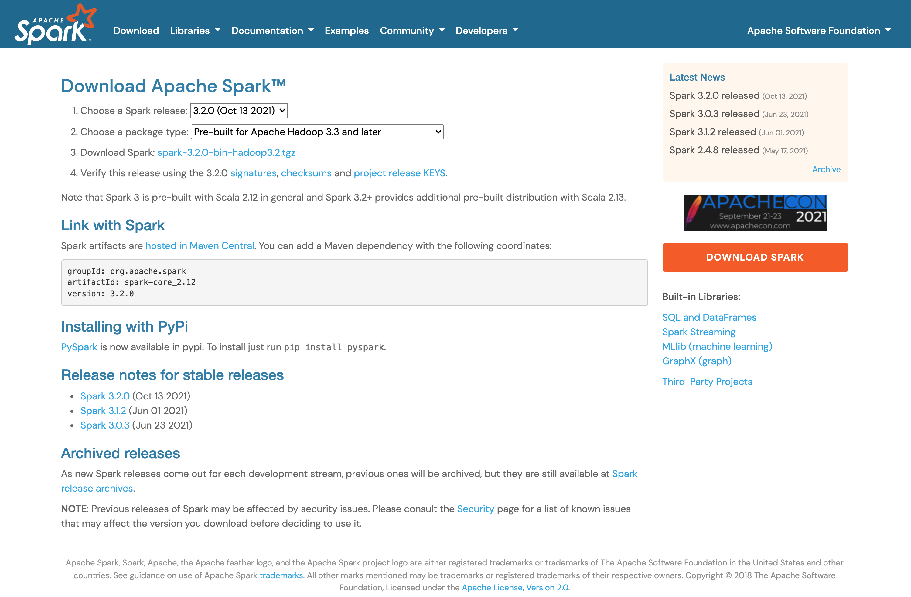

<style>
details {
    border: 1px solid #aaa;
    border-radius: 4px;
    padding: .5em .5em 0;
}

summary {
    font-weight: bold;
    margin: -.5em -.5em 0;
    padding: .5em;
}

details[open] {
    padding: .5em;
}

details[open] summary {
    border-bottom: 1px solid #aaa;
    margin-bottom: .5em;
}
</style>

<details><summary>目录</summary><p>

- [安装 Spark](#安装-spark)
- [安装 PySpark](#安装-pyspark)
  - [PyPI](#pypi)
    - [普通安装](#普通安装)
    - [支持 Spark SQL](#支持-spark-sql)
    - [pandas API on Spark](#pandas-api-on-spark)
  - [针对特定的 Hadoop 版本](#针对特定的-hadoop-版本)
    - [查看 Hadoop 版本](#查看-hadoop-版本)
    - [安装 pyspark](#安装-pyspark-1)
  - [Conda](#conda)
  - [手工安装](#手工安装)
  - [pyspark 依赖库](#pyspark-依赖库)
    - [py4j](#py4j)
    - [Note](#note)
  - [云端环境](#云端环境)
- [PySpark 使用示例](#pyspark-使用示例)
- [ERROR](#error)
  - [pyspark 版本问题](#pyspark-版本问题)
- [PySpark 资料](#pyspark-资料)
- [TODO](#todo)
</p></details><p></p>

# 安装 Spark

* 官方安装文档
    - https://spark.apache.org/downloads.html
    

# 安装 PySpark

PySpark 包含在 Apache Spark 网站上提供的 Spark 官方版本中。
对于 Python 用户，PySpark 还提供 pip 从 PyPI 安装。
这通常用于本地使用或作为客户端连接到集群，而不是设置集群本身

## PyPI

### 普通安装

```bash
$ pip install pyspark
$ pip install findspark
```


### 支持 Spark SQL

```bash
$ pip install "spark[sql]"
```

### pandas API on Spark

```bash
$ pip install "pyspark[pandas_on_spark]" plotly
```

## 针对特定的 Hadoop 版本

* Spark 默认使用 Hadoop 3.3 和 Hive 2.3
* `PYSPARK_HADOOP_VERSION` 可选值:
    - `without`: Spark pre-built with user-provided Apache Hadoop
    - `2`: Spark pre-built for Apache Hadoop 2.7
    - `3`: Spark pre-built for Apache Hadoop 3.3 and later (default)

### 查看 Hadoop 版本

```bash
$ ls /usr/local/Celler/hadoop
drwxr-xr-x  11 zfwang  admin   352B Jan 21  2022 3.3.1
```

### 安装 pyspark

```bash
# 设置 Hadoop 版本
$ PYSPARK_HADOOP_VERSION=3 pip install pyspark

# 设置镜像及 Hadoop 版本加速下载
$ PYSPARK_RELEASE_MIRROR=http://mirror.apache-kr.org PYSPARK_HADOOP_VERSION=2 pip install

# 跟踪安装和下载状态
$ PYSPARK_HADOOP_VERSION=2 pip install pyspark -v
```

## Conda

```bash
$ conda create -n pyspark_env
$ conda activate pyspark_env
$ conda install -c conda-forgge pyspark
```

## 手工安装

PySpark 包含在Apache Spark 网站上提供的发行版中。
可以从该站点下载所需的发行版。之后，将 tar 文件解压到要安装 Spark 的目录下

```bash
$ tar xzvf spark-3.3.0-bin-hadoop3.tgz
$ cd /usr/local/spark-3.3.0-bin-hadoop3
$ export SPARK_HOME=`pwd`
$ export PYTHONPATH==$(ZIPS=("$SPARK_HOME"/python/lib/*.zip); IFS=:; echo "${ZIPS[*]}"):$PYTHONPATH
```

## pyspark 依赖库

| Package | Minimum supported version | Note |
| ------- | ------------------------- | ---- |
| pandas | 1.0.5 | Optional for Spark SQL |
| NumPy | 1.7| Required for MLlib DataFrame-based API |
| pyarrow | 1.0.0 | Optional for Spark SQL |
| Py4J | 0.10.9.5 | Required |
| pandas | 1.0.5 | Required for pandas API on Spark |
| pyarrow | 1.0.0 | Required for pandas API on Spark |
| Numpy | 1.14 | Required for pandas API on Spark |

### py4j
* `py4j`: https://www.py4j.org/


### Note

* Note that PySpark requires Java 8 or later with `JAVA_HOME` properly set. 
  If using JDK 11, set `-Dio.netty.tryReflectionSetAccessible=true`
* Note for AArch64 (ARM64) users: `PyArrow` is required by PySpark SQL, 
  but `PyArrow` support for AArch64 is introduced in `PyArrow` 4.0.0. 
  If PySpark installation fails on AArch64 due to `PyArrow` installation errors, 
  you can install `PyArrow` >= 4.0.0 as below:

```bash
$ pip install "pyarrow>=4.0.0" --prefer-binary
```

## 云端环境

- [kesci](https://www.kesci.com/home/project)
    - 可以直接在 notebook 中运行 pyspark

# PySpark 使用示例

```python
import pyspark
from pyspark import SparkContext, SparkConf
from pyspark.sql import SparkSession
import findspark

# 指定 spark_home，指定 Python 路径
spark_home = "/Users/zfwang/.pyenv/versions/3.7.10/envs/pyspark/lib/python3.7/site-packages/pyspark"
python_path = "/Users/zfwang/.pyenv/versions/3.7.10/envs/pyspark/bin/python"
findspark.init(spark_home, python_path)

conf = SparkConf().setAppName("test").setMaster("local[4]")
sc = SparkContext(conf = conf)

print("spark version:", pyspark.__version__)
rdd = sc.parallelize(["hello", "spark"])
print(rdd.reduce(lambda x,y: x + '' + y))
```

# ERROR

## pyspark 版本问题

- 报错信息：

```
py4j.protocol.Py4JError: org.apache.spark.api.python.PythonUtils.getEncryptionEnabled does not exist in the JVM
```

- 解决方法：

```bash
$ pip install pyspark=="2.4.7"
```

# PySpark 资料

- 官方文档 https://spark.apache.org/docs/latest/api/python/index.html

# TODO

- 通过 Docker 构建集群环境
- 构建 Python 包

