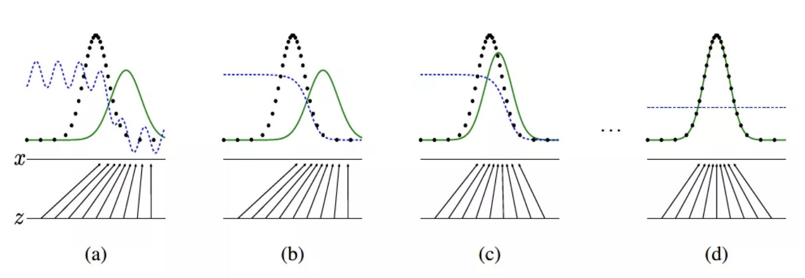
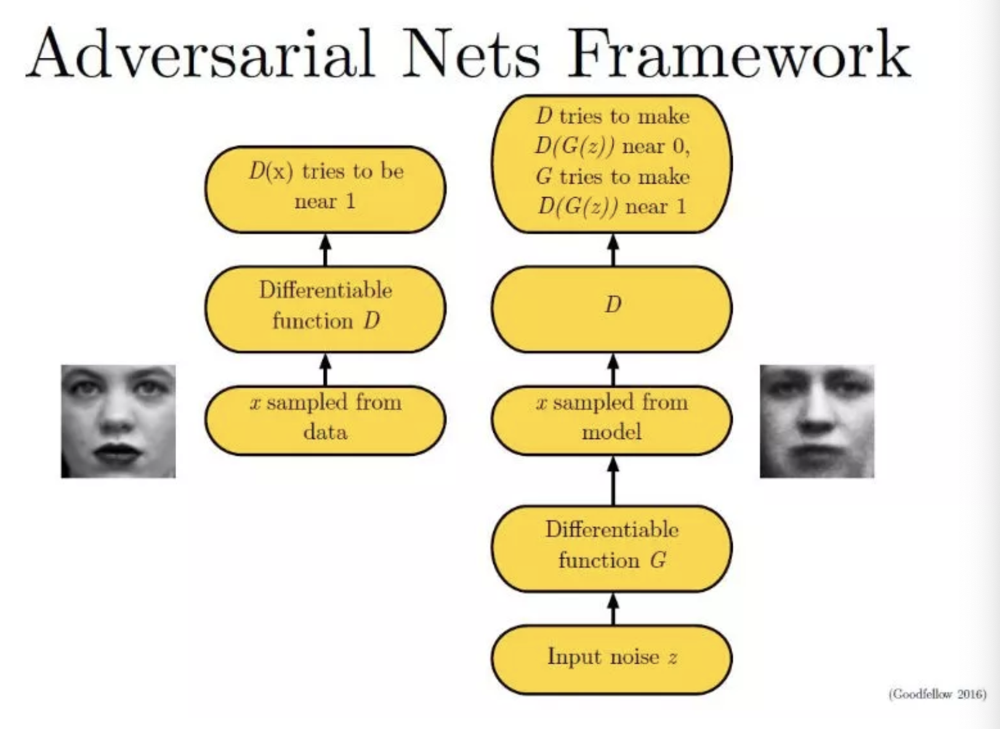

# GAN

GAN(Generative Adversarial Networks)，即生成式对抗网络。是一种典型的无监督学习方法。
在 GAN 出现之前，一般是用 AE(AutoEncoder) 的方法来做图像生成的，但是得到的图像比较模糊，
效果始终都不理想。直到 2014 年，Goodfellow 在 NIP2014 会议上首次提出了 GAN，
使得 GAN 第一次进入了人们的眼帘并大放异彩，到目前为止 GAN 的变种已经超过 400 种，
并且 CVPR2018 收录的论文中有三分之一的主题和 GAN 有关，可见 GAN 仍然是当今一大热门研究方向

GAN 的应用场景非常广泛，主要有以下几个方面：

* 图像、音频生成
* 图像翻译。从真实场景的图像到漫画风格的图像、风景画与油画间的风格互换等等
* 图像修复。比如图像去噪、去除图像中的马赛克等
* 图像超分辨率重建。卫星、遥感以及医学图像中用得比较多，大大提升后续的处理精度

# DCGAN

# InfoGAN

# WGAN

# WGAN_GP

5.GAN 生成式对抗网络介绍
-------------------------

生成式对抗网络 (Generative Adversial Networks, GAN)
自从问世以来就颇受瞩目, 相对于变分自编码器
(AutoEncoder), 生成式对抗网络也可以学习图像的潜在空间表征, 它可以生成与真实图像在统计上几乎无法区分的合成图像.

开创 GAN 的论文是 Ian Goodfellow 的 `Generative Adversarial
Network](http://papers.nips.cc/paper/5423-generative-adversarial-nets.pdf>`__.

5.1 GAN 的核心思想和基本原理
~~~~~~~~~~~~~~~~~~~~~~~~~~~~

GAN
的核心思想就在于两个部分:\ **伪造网络**\ 和\ **鉴定网络**\ 。两者互相对抗, 共同演进, 在此过程中大家的水平都越来越高, 伪造者网络生成的图像就足以达到以假乱真的水平。基于这个思想, 下面解释
GAN 的原理于细节。

GAN 的基本原理就在于两个网络:G(Generator) 和
D(Discriminator), 分别是\ **生成器**\ 和\ **判别器**\ 。

- 生成器网络以一个随机向量作为输入, 并将其解码生成一张图像

- 判别器将一张真实或者合成的图像作为输入, 并预测该图像是来自于真实数据还是合成的图像

在训练过程中, 生成网络 G 的目标就是尽量生成真实的图片去欺骗判别网络
D。而判别器网络 D 的目标就是尽量把 G
生成的图片和真实图片分别开来。这样, G 和 D
就构成了一个动态的“博弈过程”。

在理想状态下下, 博弈的结果就是 G 可以生成足以以假乱真的图片
G(z), 而此时的 D 难以判定生成的图像到底是真是假, 最后得到
`$D(G(z)) = 0.5`
的结果。这块的理解跟博弈论中零和博弈非常类似, 可以说 GAN
借鉴了博弈论中相关思想和方法.

- Random vector from the laten space

- => `Generator(decoder)$`

   - => Generated(decoded) image => Mix of real and fake images

- => `Discriminator`

   - => "Real","Fake" => Training feedback

- => `Generator(decoder)$`

.. figure:: https://mmbiz.qpic.cn/mmbiz_jpg/1y1ObuUF34wcuGRRr6cNeuuyNJqWjOsib8Z1pjqBpPUGPiaEick22bCBOw1s8nZeaY2UZPhK7qQ1G7RLq0Q9Drdfg/640?wx_fmt=jpeg&tp=webp&wxfrom=5&wx_lazy=1&wx_co=1
   :alt: 

`$\min_{G}\max_{D}V(D, G) = E_{x \sim P_{data}(x)}[logD(x)] + E_{z \sim p_{z}(z)}[log(1 - D(G(z)))]`

下图是真实数据和生成数据所代表的的两个分布在 GAN 训练中的演化过程:

   :alt: 

GAN 在训练过程中, 同时更新判别分布 (D, 蓝色虚线) 使 D
能区分数据真实分布px (黑色虚线) 中的样本和生成分布pg (G, 绿色实线)
中的样本。下面的黑色箭头表示生成模型 x=G(z)
如何将分布pg作用在转换后的样本上。可以看到, 在经过若干次训练之后, 判别分布接近某个稳定点, 此时真实分布等于生成分布, 即pdata=pg。判别器将无法区分训练数据分布和生成数据分布, 即D(x)=1/2

   :alt: 

生成器和判别器的优化算法都是随机梯度下降。但有个细节需要注意:第一步我们训练D, D是希望V(G,
D)越大越好, 所以这里是梯度上升(ascending)。第二步训练G时, V(G,
D)越小越好, 所以到这里则是梯度下降(descending)。整个训练是一个动态的交替过程。

   :alt: 

上面我们已经知道了极小化极大的二人博弈问题的全局最优结果为pg=pdata, 在给定任意生成器G的情况下, 考虑最优判别器D。给定任意生成器G, 判别器D
的训练标准为最大化目标函数 `$V(G, D)$`

   :alt: 

可以看到, 对于任意不为零的 `$(a, b)$` , 函数
`$y=alog(y)+blog(1-y)$` 在 `$[0,1]` 中的 `$a/a+b$`
处达到最大值.

5.2 DCGAN 深度卷积对抗网络
~~~~~~~~~~~~~~~~~~~~~~~~~~

自从GoodFellow提出GAN以后, GAN就存在着训练困难、生成器和判别器的loss无法指示训练进程、生成样本缺乏多样性等问题。为了解决这些问题, 后来的研究者不断推陈出新, 以至于现在有着各种各样的GAN变体和升级网络。比如
LSGAN, WGAN, WGAN-GP, DRAGAN, CGAN, infoGAN, 
ACGAN, EBGAN, BEGAN, DCGAN以及最近号称史上最强图像生成网络的BigGAN等等。本节仅选取其中的DCGAN——深度卷积对抗网络进行简单讲解并利用keras进行实现, 所谓
DCGAN, 顾名思义就是生成器和判别器都是深度卷积神经网络的 GAN.

DCGAN 的原始论文为 `UNSUPERVISED REPRESENTATION LEARNING WITH DEEP
CONVOLUTIONAL GENERATIVE ADVERSARIAL
NETWORKS](https://arxiv.org/pdf/1511.06434.pdf>`__.

搭建一个稳健的 DCGAN 的要点在于:

- 所有的 pooling
   层使用\ **步幅卷积(判别网络)**\ 和\ **微步幅卷积(生成网络)**\ 进行替换

- 在生成网络和判别网络上使用\ **批处理规范化**

- 对于更深的架构\ **移除全连接隐藏层**

- 在生成网路的所有层上使用 ReLU 激活函数, 除了输出层使用 Tanh 激活函数

- 在判别网络的所有层上使用 LeakReLU 激活函数

   :alt: 

5.3 Keras 搭建一个 DCGAN
~~~~~~~~~~~~~~~~~~~~~~~~

.. code:: python

   import os
   import numpy as np
   import keras
   from keras.datasets import cifar10
   from keras.preprocessing import image
   from keras.layers import Dense, Conv2D, LeakyReLU, Dropout, Input
   from keras.layers import Reshape, Conv2DTranspose, Flatten
   from keras.models import Model
   from keras import optimizers, losses, metrics
   import warnings
   warnings.filterwarnings("ignore")

   # ======================================
   # Parameter
   # ======================================
   # 潜变量维度
   laten_dim = 32

   # 输入像素维度
   height = 32
   width = 32
   channels = 3

   epochs = 10000
   batch_size = 20
   save_dir = "./image"
   start = 0

   # ======================================
   # Data
   # ======================================
   (x_train, y_train), (_, _) = cifar10.load_data()
   # 指定青蛙图像(编号为6)
   x_train = x_train[y_train.flatten() == 6]
   x_train = x_train.reshape((x_train.shape[0],) + (height, width, channels))
   x_train = x_train.astype("float32") 
   x_train /= 255

   # ======================================
   # Model 
   # ======================================
   # 搭建生成器网络
   generator_input = Input(shape = (laten_dim,))
   x = Dense(128 * 16 * 16)(generator_input)
   x = LeakyReLU()(x)
   x = Reshape((16, 16, 128))(x)
   x = Conv2D(256, 5, padding = "same")(x)
   x = LeakyReLU()(x)
   x = Conv2DTranspose(256, 4, strides = 2, padding = "same")(x)
   x = LeakyReLU()(x)
   x = Conv2D(256, 5, padding = "same")(x)
   x = LeakyReLU()(x)
   x = Conv2D(256, 5, padding = "same")(x)
   x = LeakyReLU()(x)
   x = Conv2D(channels, 7, activation = "tanh", padding = "same")(x)
   generator = Model(generator_input, x)
   generator.summary()

   # 搭建判别器网路
   discriminator_input = Input(shape = (height, width, channels))
   x = Conv2D(128, 3)(discriminator_input)
   x = LeakyReLU()(x)
   x = Conv2D(128, 4, strides = 2)(x)
   x = LeakyReLU()(x)
   x = Conv2D(128, 4, strides = 2)(x)
   x = LeakyReLU()(x)
   x = Conv2D(128, 4, strides = 2)(x)
   x = LeakyReLU()(x)
   x = Flatten()(x)
   x = Dropout(0.4)(x)
   x = Dense(1, activation = "sigmoid")(x)
   discriminator = Model(discriminator_input, x)
   discriminator.summary()
   discriminator_optimizer = optimizers.RMSprop(lr = 0.008,
                                                clipvalue = 1.0,
                                                decay = 1e-8)
   # 将判别器参数设置为不可训练
   discriminator.trainable = False
   gan_input = Input(shape = (laten_dim,))
   gan_output = discriminator(generator(gan_input))
   # 搭建对抗网络
   gan = Model(gan_input, gan_output)

   # ======================================
   # Model compile
   # ======================================
   gan_optimizer = optimizers.RMSprop(lr = 0.0004,
                                      clipvalue = 1.0,
                                      decay = 1e-8)
   gan.compile(optimizers = gan_optimizer,
               loss = "binary_crossentropy")

   # ======================================
   # Model training
   # ======================================
   for step in range(epochs):
       # 潜在空间随机采样, 解码生成虚拟图像
       random_laten_vectors = np.random.normal(size = (batch_size, laten_dim)) # 20, 32
       generated_images = generator.predict(random_laten_vectors)
       stop = start + batch_size                                               # 0 + 32
       real_images = x_train[start:stop]                                       # x_train[0:0+32]

       # 将虚假图像和真实图像混合
       combined_images = np.concatenate([generated_images, real_images])
       labels = np.concatenate([np.ones((batch_size, 1)), np.zeros((batch_size, 1))])

       # 向标签中添加随机噪声
       labels += 0.05 * np.random.random(labels.shape)
       # 训练判别器
       d_loss = discriminator.train_on_batch(combined_images, labels)
       # 潜在空间随机采样
       random_laten_vectors = np.random.normal(size = (batch_size, laten_dim))
       # 合并标签, 以假乱真
       misleading_targets = np.zeros((batch_size, 1))
       # 通过GAN模型来训练生成器模型, 冻结判别器模型权重
       a_loss = gan.train_on_batch(random_laten_vectors, misleading_targets)
       start += batch_size
       if start > len(x_train) - batch_size:
           start = 0

       # 每100步绘图并保存
       if step % 100 == 0:
           gan.save_weights("gan.h5")
           print("discriminator loss:", d_loss)
           print("adversarial loss:", a_loss)
           img = image.array_to_img(generated_images[0] * 255., scale = False)
           img.save(os.path.join(save_dir, "generated_forg" + str(step) + ".png)"))
           img = image.array_to_img(real_images[0] * 255., scale = False)
           img.save(os.path.join(save_dir, "real_forg" + str(step) + ".png)"))

