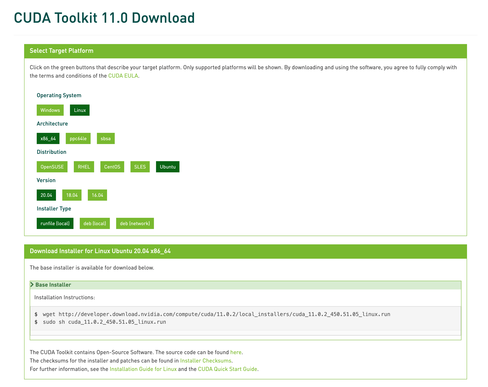

<style>
details {
    border: 1px solid #aaa;
    border-radius: 4px;
    padding: .5em .5em 0;
}
summary {
    font-weight: bold;
    margin: -.5em -.5em 0;
    padding: .5em;
}
details[open] {
    padding: .5em;
}
details[open] summary {
    border-bottom: 1px solid #aaa;
    margin-bottom: .5em;
}
</style>

<details><summary>目录</summary><p>

- [安装 Ubuntu 20.04](#安装-ubuntu-2004)
- [安装 Nvidia 显卡驱动](#安装-nvidia-显卡驱动)
- [安装 CUDA](#安装-cuda)
  - [CUDA 介绍](#cuda-介绍)
  - [CUDA 安装](#cuda-安装)
- [安装 cuDNN](#安装-cudnn)
- [安装 Conda 环境](#安装-conda-环境)
- [安装 Nvidia-Docker](#安装-nvidia-docker)
- [测试](#测试)
  - [TensorFlow](#tensorflow)
    - [TensorFlow GPU 支持](#tensorflow-gpu-支持)
- [Windows 设置](#windows-设置)
  - [PyTorch](#pytorch)
- [NVIDIA Xavier](#nvidia-xavier)
  - [简介](#简介)
    - [参考文章](#参考文章)
  - [研究](#研究)
</p></details><p></p>
   
> 系统: Ubuntu 20.04

# 安装 Ubuntu 20.04

- test

# 安装 Nvidia 显卡驱动

最简单的方式是通过系统的软件与更新来安装:

1. 进入系统的图形桌面，打开 ``Software & Updates`` 软件，可以看到标签栏有一个 ``Additional Drivers``:
      - NVIDIA Corporation: Unknown
          - Using NVIDIA dirver metapackage from nvidia-driver-455(proprietary, tested)
          - Using X.Org x server -- Nouveau display driver from xserver-xorg-video-nouveau(open source)
      - 选择第一个安装 Nvidia 官方驱动(第二个是开源驱动)即可，根据网络情况稍等大概十分钟，安装完重启服务器。
2. 重启完之后更新一下软件

```bash
sudo apt update
sudo apt upgrade
```

这里会连带 Nvidia 的驱动一起神级一遍，更新到最新的驱动；
更新完可能会出现 nvidia-smi 命令报错，再重启一遍就解决了

# 安装 CUDA

## CUDA 介绍

NVIDIA® CUDA® 工具包提供了开发环境，可供创建经 GPU 加速的高性能应用。
借助 CUDA 工具包，可以在经 GPU 加速的嵌入式系统、台式工作站、企业数据中心、
基于云的平台和 HPC 超级计算机中开发、优化和部署应用。
此工具包中包含多个 GPU 加速库、多种调试和优化工具、
一个 C/C++ 编译器以及一个用于在主要架构(包括 x86、Arm 和 POWER)
上构建和部署应用的运行时库。

借助多 GPU 配置中用于分布式计算的多项内置功能，
科学家和研究人员能够开发出可从单个 GPU 工作站扩展到配置数千个 GPU 的云端设施的应用。

## CUDA 安装

1. 如果之前安装了旧版本的 CUDA 和 cudnn 的话，需要先卸载后再安装, 卸载 CUDA:

```bash
# sudo apt-get remove --purge nvidia
```

然后重新安装显卡驱动，安装好了之后开始安装 CUDA

2. 下载 CUDA 安装包--CUDA Toolkit 11.0 Download|NVIDIA Developer
    - https://developer.nvidia.com/cuda-11.0-download-archive



3. 安装 CUDA

```bash
chmod +x cuda_11.0.2_450.51.05_linux.run
sudo sh ./cuda_11.0.2_450.51.05_linux.run
```

4. 配置 UDA 环境变量

```bash
vim ~/.bashrc
# or
vim ~/.zsh

export CUDA_HOME=/usr/local/cuda-11.0
export LD_LIBRARY_PATH=${CUDA_HOME}/lib64
export PATH=${CUDA_HOME}/bin/${PATH}
```

```bash
source ~/.bashrc
```

5. 查看安装的版本信息

```bash
nvcc -V
```

可以编译一个程序测试安装是否成功，执行以下几条命令:

```bash
cd ~/Softwares/cuda/NVIDIA_CUDA-11.0_Samples/1_Utilities/deviceQuery
make
./deviceQuery
```

参考链接:

   - https://mp.weixin.qq.com/s/TsETgLLNWRskYbmh2wdiLg
   - https://developer.nvidia.com/zh-cn/CUDA-toolkit
   - https://developer.nvidia.com/zh-cn/CUDA-downloads
   - https://docs.nvidia.com/CUDA/CUDA-quick-start-guide/index.html
   - https://docs.nvidia.com/CUDA/CUDA-installation-guide-linux/

# 安装 cuDNN

1. 下载 cuDNN 安装包--cuDNN Download|NVIDIA Developer
    - https://developer.nvidia.com/rdp/cudnn-download
    - 选择与 CUDA 版本对应的 cuDNN 版本
2. 安装 cuDNN

    ```bash
    tar -xzvf cudnn-11.0-linux-x64-v8.0.5.39.tag
    sudo cp cuda/lib64/* /usr/local/cuda-11.0/lib64/
    sudo cp cuda/include/* /usr/local/cuda-11.0/include/
    ```
    
3. 查看 cuDNN 的版本信息

    ```bash
    $ cat /usr/local/cuda/include/cudnn_version.h | grep CUDNN_MAJOR -A 2
    ```

# 安装 Conda 环境

不同的训练框架和版本可能会需要不同的python版本相对应，而且有的包比如numpy也对版本有要求，
所以比较优雅的方法是给每个配置建立一个虚拟的python环境，在需要的时候可以随时切换，
而不需要的时候也能删除不浪费磁盘资源，那在这方面conda是做得最好的。

1. 下载 Anaconda/MiniConda 安装包--Anaconda|Individdual Edition
    - https://www.anaconda.com/products/individual
2. 安装 Conda

```bash
chmod +x Anaconda3-2020.11-Linux-x86_64.sh
./Anaconda3-2020.11-Linux-x86_64.sh
```

# 安装 Nvidia-Docker

# 测试

1. 本地 Conda 环境

```bash
conda create --name python_38-pytorch_1.7.0 python=3.8

conda activate python_38-pytorch_1.7.0

which pip
```

2. 安装 PyTorch

```bash
pip install torch==1.7.0+cu110 torchvision==0.8.1+cu110 torchaudio===0.7.0 -f https://download.pytorch.org/whl/torch_stable.html
```

## TensorFlow

   - https://tensorflow.google.cn/install/gpu

### TensorFlow GPU 支持


> 注意:对于 Ubuntu 和 Windows，需要安装支持 CUDA® 的显卡，才能实现 GPU 支持

TensorFlow GPU 支持需要各种驱动程序和库。为了简化安装并避免库冲突，
建议使用支持 GPU 的 TensorFlow Docker 镜像(仅限 Linux)。
此设置需要  NVIDIA® GPU 驱动程序

1. pip 软件包
   - https://tensorflow.google.cn/install/pip
2. 硬件要求

支持以下带有 GPU 的设备:

- CUDA® 架构为 3.5、3.7、5.2、6.0、6.1、7.0 或更高的 NVIDIA® GPU 卡。
  请参阅支持 CUDA® 的 GPU 卡列表。
- 在配备 NVIDIA® Ampere GPU（CUDA 架构 8.0）或更高版本的系统上，
  内核已从 PTX 经过了 JIT 编译，因此 TensorFlow 的启动时间可能需要 30 多分钟。
  通过使用 “export CUDA_CACHE_MAXSIZE=2147483648” 增加默认 JIT 缓存大小，
  即可将此系统开销限制为仅在首次启动时发生（有关详细信息，请参阅 JIT 缓存）
- 对于 CUDA® 架构不受支持的 GPU，或为了避免从 PTX 进行 JIT 编译，
  亦或是为了使用不同版本的 NVIDIA® 库，请参阅在 Linux 下从源代码编译指南
- 软件包不包含 PTX 代码，但最新支持的 CUDA® 架构除外；因此，如果设置了 CUDA_FORCE_PTX_JIT=1，
  TensorFlow 将无法在旧版 GPU 上加载。(有关详细信息，请参阅应用兼容性)

1. 软件要求

   必须在系统中安装以下 NVIDIA® 软件:

      - NVIDIA® GPU 驱动程序:CUDA® 10.1 需要 418.x 或更高版本。
      - CUDA® 工具包:TensorFlow 支持 CUDA® 10.1（TensorFlow 2.1.0 及更高版本）
      - CUDA® 工具包附带的 CUPTI。
      - cuDNN SDK 7.6
      - （可选）TensorRT 6.0，可缩短用某些模型进行推断的延迟时间并提高吞吐量。

2. Linux 设置

   - 要在 Ubuntu 上安装所需的 NVIDIA 软件，最简单的方法是使用下面的 apt 指令。
     但是，如果从源代码构建 TensorFlow，请手动安装上述软件要求中列出的软件，并
     考虑以 -devel TensorFlow Docker 映像作为基础。
   - 安装 CUDA® 工具包附带的 CUPTI，并将其安装目录附加到 $LD_LIBRARY_PATH 环境变量中:

    ```bash
    $ export LD_LIBRARY_PATH=$LD_LIBRARY_PATH:/usr/local/cuda/extras/CUPTI/lib64
    ```

   - 使用 apt 安装 CUDA

      - Ubuntu 16.04、Ubuntu 18.04 
      - CUDA® 10（TensorFlow 1.13.0 及更高版本），这些说明可能适用于其他 Debian 系发行版
      - Ubuntu 20.04(CUDA 10.1, 11.1)
      - Ubuntu 18.04(CUDA 10.1) 

         ```bash
        # Add NVIDIA package repositories
        $ wget https://developer.download.nvidia.com/compute/cuda/repos/ubuntu1804/x86_64/cuda-repo-ubuntu1804_10.1.243-1_amd64.deb
        $ sudo apt-key adv --fetch-keys https://developer.download.nvidia.com/compute/cuda/repos/ubuntu1804/x86_64/7fa2af80.pub
        $ sudo dpkg -i cuda-repo-ubuntu1804_10.1.243-1_amd64.deb
        $ sudo apt-get update
        $ wget http://developer.download.nvidia.com/compute/machine-learning/repos/ubuntu1804/x86_64/nvidia-machine-learning-repo-ubuntu1804_1.0.0-1_amd64.deb
        $ sudo apt install ./nvidia-machine-learning-repo-ubuntu1804_1.0.0-1_amd64.deb
        $ sudo apt-get update

        # Install NVIDIA driver
        $ sudo apt-get install --no-install-recommends nvidia-driver-450
        # Reboot. Check that GPUs are visible using the command: nvidia-smi

        # Install development and runtime libraries (~4GB)
        $ sudo apt-get install --no-install-recommends \
            cuda-10-1 \
            libcudnn7=7.6.5.32-1+cuda10.1  \
            libcudnn7-dev=7.6.5.32-1+cuda10.1

        # Install TensorRT. Requires that libcudnn7 is installed above.
        $ sudo apt-get install -y --no-install-recommends libnvinfer6=6.0.1-1+cuda10.1 \
            libnvinfer-dev=6.0.1-1+cuda10.1 \
            libnvinfer-plugin6=6.0.1-1+cuda10.1
        ```
      
- Ubuntu 16.04(CUDA 10.1)

```bash
# Add NVIDIA package repositories
# Add HTTPS support for apt-key
$ sudo apt-get install gnupg-curl
$ wget https://developer.download.nvidia.com/compute/cuda/repos/ubuntu1604/x86_64/cuda-repo-ubuntu1604_10.1.243-1_amd64.deb
$ sudo apt-key adv --fetch-keys https://developer.download.nvidia.com/compute/cuda/repos/ubuntu1604/x86_64/7fa2af80.pub
$ sudo dpkg -i cuda-repo-ubuntu1604_10.1.243-1_amd64.deb
$ sudo apt-get update
$ wget http://developer.download.nvidia.com/compute/machine-learning/repos/ubuntu1604/x86_64/nvidia-machine-learning-repo-ubuntu1604_1.0.0-1_amd64.deb
$ sudo apt install ./nvidia-machine-learning-repo-ubuntu1604_1.0.0-1_amd64.deb
$ sudo apt-get update

# Install NVIDIA driver
# Issue with driver install requires creating /usr/lib/nvidia
$ sudo mkdir /usr/lib/nvidia
$ sudo apt-get install --no-install-recommends nvidia-418
# Reboot. Check that GPUs are visible using the command: nvidia-smi

# Install development and runtime libraries (~4GB)
$ sudo apt-get install --no-install-recommends \
cuda-10-1 \
libcudnn7=7.6.4.38-1+cuda10.1  \
libcudnn7-dev=7.6.4.38-1+cuda10.1


# Install TensorRT. Requires that libcudnn7 is installed above.
$ sudo apt-get install -y --no-install-recommends \
libnvinfer6=6.0.1-1+cuda10.1 \
libnvinfer-dev=6.0.1-1+cuda10.1 \
libnvinfer-plugin6=6.0.1-1+cuda10.1
```

# Windows 设置

- 根据硬件、软件要求，参考 [适用于Windows 的 CUDA 安装指南](https://docs.nvidia.com/cuda/cuda-installation-guide-microsoft-windows/) 进行安装
- 确保安装的 NVIDIA 软件包版本一致，如果没有 `cuDNN64_7.dll` 文件，TensorFlow 将无法加载，如需使用其他版本，
  需要使用源码构建: [在 Windows 下从源代码构建](https://tensorflow.google.cn/install/source_windows)
- 将 CUDA®、CUPTI 和 cuDNN 安装目录添加到 `%PATH%` 环境变量中。
    - 例如，如果 CUDA® 工具包安装到 `C:\\Program Files\\NVIDIA GPU Computing Toolkit\\CUDA\\v10.1`，
      并且 cuDNN 安装到 `C:\\tools\cuda`，请更新 `%PATH%` 以匹配路径:

```bash
C:\> SET PATH=C:\Program Files\NVIDIA GPU Computing Toolkit\CUDA\v10.1\bin;%PATH%
C:\> SET PATH=C:\Program Files\NVIDIA GPU Computing Toolkit\CUDA\v10.1\extras\CUPTI\lib64;%PATH%
C:\> SET PATH=C:\Program Files\NVIDIA GPU Computing Toolkit\CUDA\v10.1\include;%PATH%
C:\> SET PATH=C:\tools\cuda\bin;%PATH%
```

## PyTorch

- PyTorch GPU 支持

```bash
import torch
torch.CUDA.is_available()
```


# NVIDIA Xavier


## 简介


### 参考文章

- https://developer.ridgerun.com/wiki/index.php?title=Xavier/Processors/HDAV_Subsystem/Audio_Engine
- https://developer.nvidia.com/zh-cn/blog/bringing-cloud-native-agility-to-edge-ai-with-jetson-xavier-nx/
- https://jingyan.baidu.com/article/fdbd4277a447ebb89e3f48ca.html


## 研究


