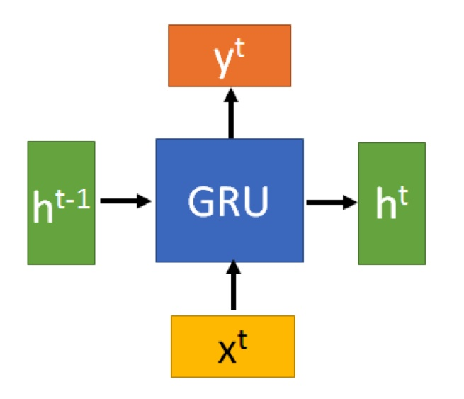
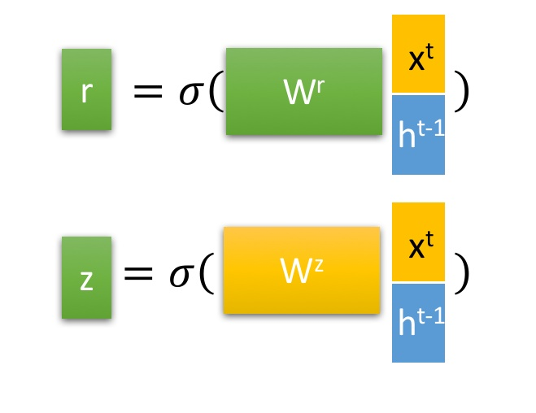
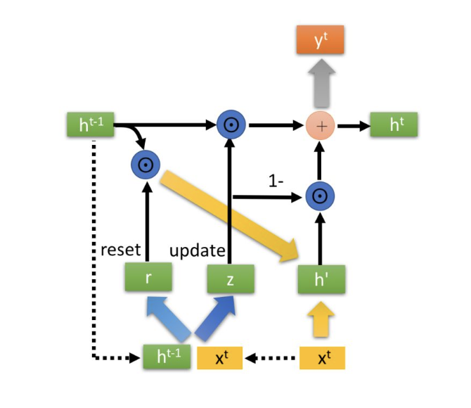
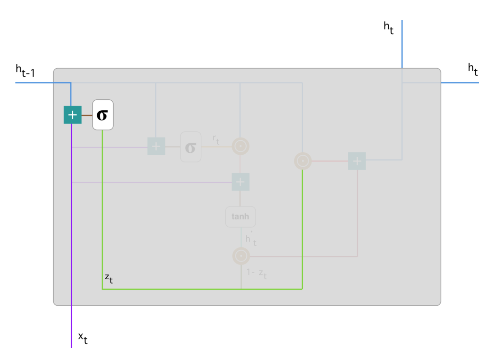
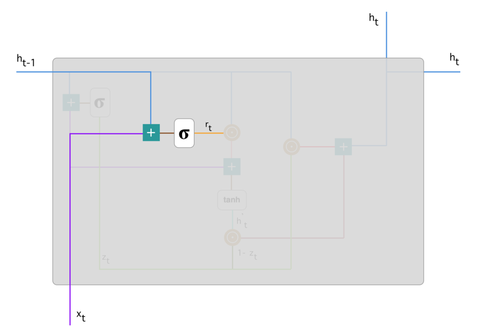
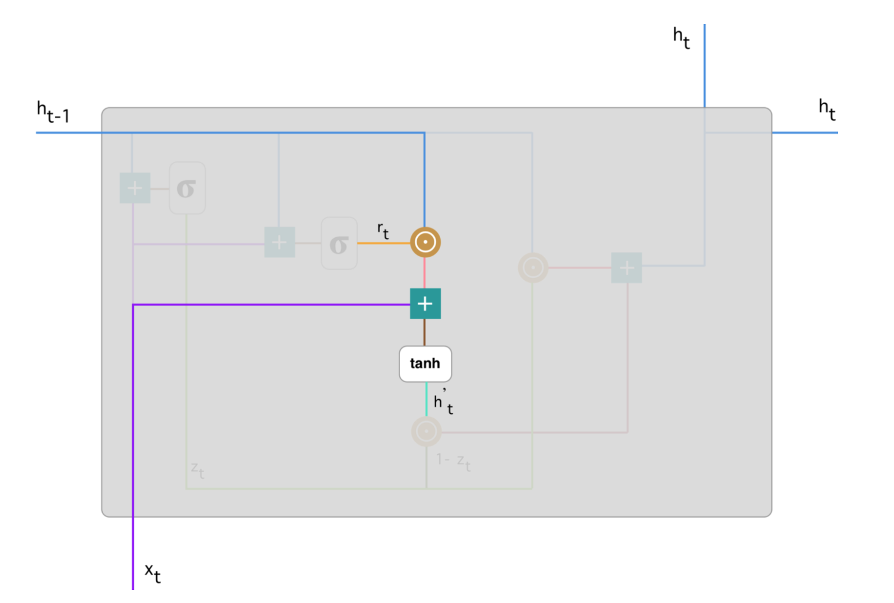

目录

- [GRU](#gru)
- [GRU 结构](#gru-结构)
  - [GRU 神经元](#gru-神经元)
  - [GRU Update gate 和 Reset gate](#gru-update-gate-和-reset-gate)
  - [GRU 层次结构](#gru-层次结构)
    - [GRU 重置记忆](#gru-重置记忆)
    - [GRU 更新记忆](#gru-更新记忆)
- [GRU 结构](#gru-结构-1)
  - [Update gate](#update-gate)
  - [Reset gate](#reset-gate)
  - [Current memery content](#current-memery-content)
  - [Final memory at current time step](#final-memory-at-current-time-step)
- [参考](#参考)

# GRU

> 循环门控单元，Gate Recurrent Unit，GRU

GRU 是循环神经网络的一种变体。和 LSTM 一样，GRU 也是为了解
决长期记忆和反向传播中出现的梯度消失和梯度爆炸问题而提出来的。GRU 和 LSTM 在很多种情况
下实际表现相差无几，但 GRU 更容易训练，能够很大程度上提高训练效率

GRU 使用了 Update gate 和 Reset gate，这是两个向量，用来决定哪些信息可以进入输出。
它们的特征是可以用来训练对信息进行长时间的记忆，而不会随着时间的流逝而担心与预测有关的信息会消失

与 LSTM 相比，GRU 内部少了一个 "门控"，参数比 LSTM 少，但是却也能够达到与 LSTM 相当的功能。
考虑到硬件的计算能力和时间成本，因而很多时候我们也就会选择更加”实用“的 GRU

# GRU 结构

## GRU 神经元

GRU 的输入输出结构与普通的 RNN 一样，有一个 `$x^{t}$` 和 上一个节点传递下来的隐状态(hidden state) `$h^{t-1}$`，
这个隐状态包含了之前节点的相关信息。结合 `$x^{t}$` 和 `$h^{t-1}$` ，GRU 会得到当前隐藏节点的输出 `$y^{t}$` 
和传递给下一个节点的隐状态 `$h^{t}$`.

## GRU Update gate 和 Reset gate

Reset gate 用来...

`$$r = \sigma\Big(W^{r}(x^{t}，h^{t-1})^{T}\Big)$$`
`$$\sigma(\cdot) = \frac{1}{1+e^{-x}}$$`

Update gate 用来帮助模型决定多少上一步(时间 `$t-1$`)的信息需要传递到下一步(时间 `$t$`)

`$$z = \sigma\Big(W^{z} (x^{t}，h^{t-1})^{T}\Big)$$`
`$$\sigma(\cdot) = \frac{1}{1+e^{-x}}$$`

## GRU 层次结构

**NOTE**

- `$\odot$` 是 Hadamard Product，操作矩阵中对应的元素相乘
- `$\oplus$` 是矩阵加法操作

### GRU 重置记忆

1. 在这个阶段，使用 Reset gate `$r$` 控来得到“重置”之后的数据:
      
`$$h^{t-1 '} = h^{t-1} \odot r$$`

2. 再将 `$h^{t-1 '}$` 与输入 `$x^{t}$`，再通过一个 `$tanh$` 激活函数来将数据缩放到 `$[-1，1]$` 的范围内:

`$$h' = tanh(W (x_{t}，h_{t-1}'))$$`

这里的 `$h^{'}$` 主要是包含了当前输入的 `$x^{t}$` 数据。有针对性地对 `$h^{'}$` 添加到当前的隐藏状态，
相当于“记忆了当前时刻的状态”。类似于 LSTM 的选择记忆阶段

### GRU 更新记忆

1. 在这个阶段，使用 Update gate `$z$` 同时进行了遗忘了记忆两个步骤，GRU 很聪明的一点就在于，使用了同一个门控 `$z$` 就同时可以进行遗忘和选择记忆(LSTM则要使用多个门控):
    - 门控信号(这里的 `$z$`) 的范围为 `$[0, 1]$`。门控信号接近1，代表“记忆”下来的数据越多，而接近 0 则代表“遗忘”的越多

`$$h^{t} = z \odot h^{t-1} + (1-z)\odot h^{'}$$`

2. 更新记忆解释
    - `$z \odot h^{t-1}$` :表示对原本隐藏状态的选择性“遗忘”。这里的
      `$z` 可以想象成遗忘门 (forget gate)，忘记 `$h^{t-1}$` 维度中一些不重要的信息
    - `$(1-z) \odot h^{'}$`:表示对包含当前节点信息的 `$h^{'}$` 进行选择性“记忆”。与上面类似，
      这里的 `$(1-z)$` 同理会忘记 `$h^{'}$` 维度中的一些不重要的信息。或者，这里我们更应当看作是对
      `$h^{'}$` 维度中的某些信息进行选择
    - `$h^{t}$` 的操作就是忘记传递下来的 `$h^{t-1}$` 中的某些维度信息，并加入当前节点输入的某些维度信息
    - 遗忘 `$z$` 和选择 `$(1-z)$` 是联动的。也就是说，对于传递进来的维度信息，我们会进行选择性遗忘，则遗忘了多少权重
      `$(z)$`，我们就会使用包含当前输入的 `$(h^{'})$` 中所对应的权重进行弥补 `$(1-z)$`，以保持一种“恒定”状态。
    - `$h^{'}$` 实际上可以看成对应于 LSTM 中的 hidden state; 上一个节点传下来的 `$h^{t-1}$` 则对应于 LSTM 中的 cell
      state。`$z$` 对应的则是 LSTM 中的 `$z^{f}$` forget gate，那么 `$(1-z)$` 我们似乎就可以看成是选择门 `$z^{i}$` 了.

# GRU 结构

## Update gate

update gate `$z_t$` for time step `$t$`，
The update gate helps the model to determine how much of the past 
information (from previous time steps) needs to be passed along to the future

`$$z_{t} = \sigma(W^{(z)} x_{t} + U^{(z)} h_{t-1})$$`

## Reset gate

The reset gate is used from the model to decide how much of the past information to forget

`$$r_{t} = \sigma(W^{(r)} x_{t} + U^{(r)} h_{t-1})$$`

## Current memery content

`$$h_{t}^{'} = \tanh(W \cdot x_{t} + r_{t} \odot U \cdot h_{t-1})$$`

## Final memory at current time step

`$$h_{t} = z_{t} \odot h_{t-1} + (1-z_{t}) \odot h_{t}^{'})$$`

# 参考

* [LSTM 与 GRU的原理](https://zhuanlan.zhihu.com/p/184937263)
