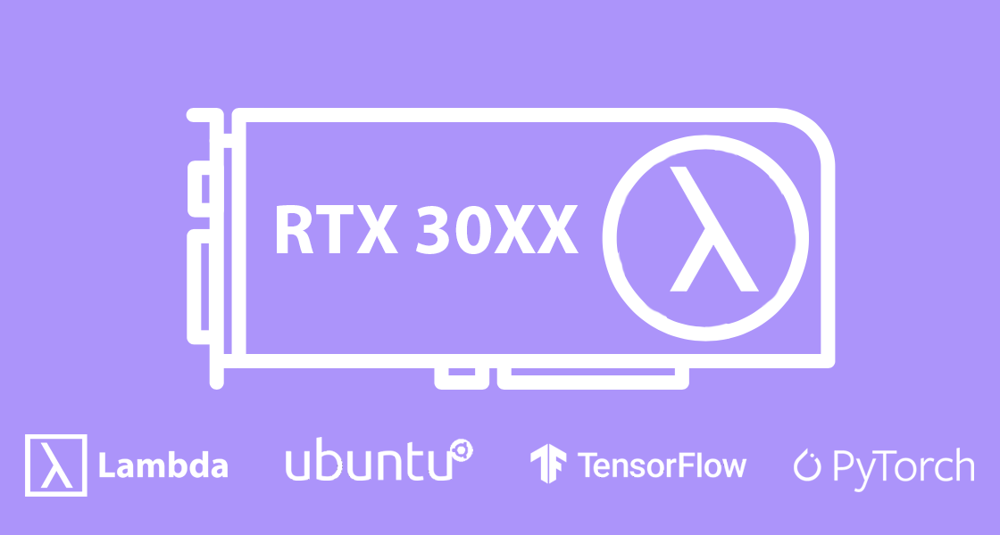
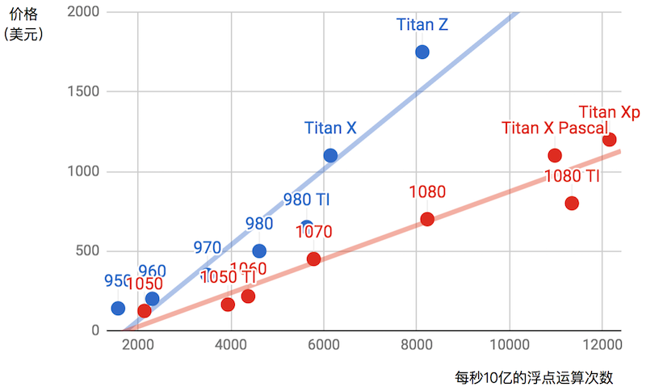
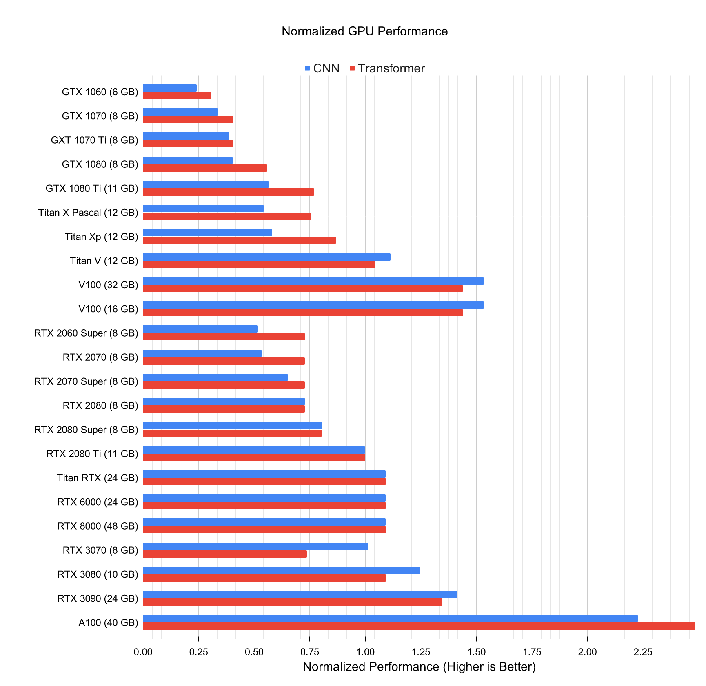
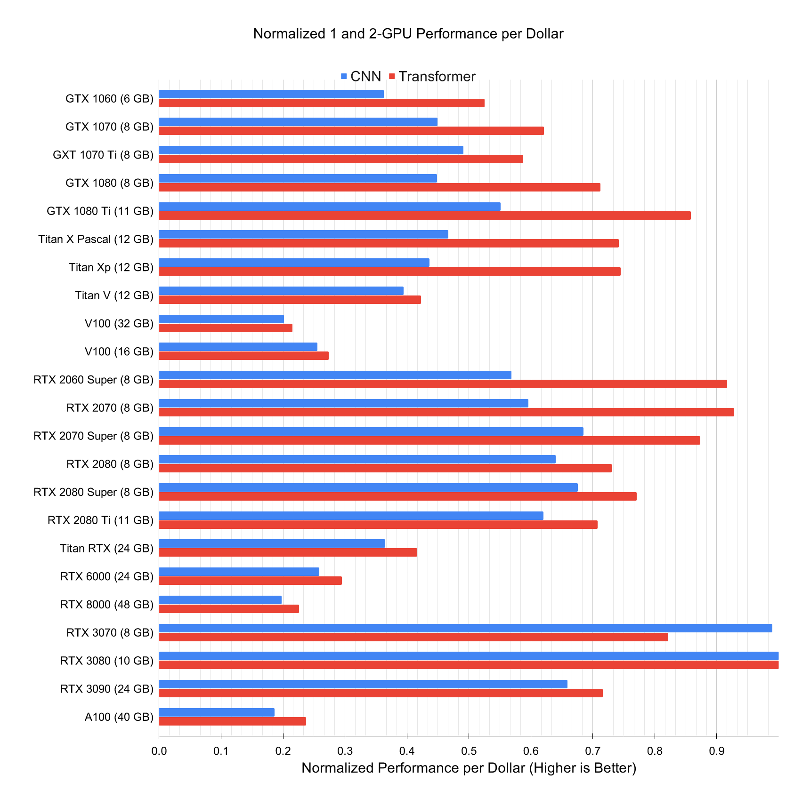

目录

- [概述](#概述)
- [GPU 选择](#gpu-选择)
  - [独立显卡](#独立显卡)
  - [GPU 性能](#gpu-性能)
- [整机配置](#整机配置)
- [总结](#总结)

# 概述

深度学习训练通常需要大量的计算资源。GPU
目前是深度学习最常使用的计算加速硬件。 相对于 CPU 来说, GPU
更便宜且计算更加密集

- 一方面, 相同计算能力的 GPU 的价格一般是 CPU 价格的十分之一；
- 另一方面, 一台服务器通常可以搭载 8 块或者 16 块 GPU。
  因此, GPU 数量可以看作是衡量一台服务器的深度学习计算能力的一个指标

# GPU 选择

## 独立显卡

目前独立显卡主要有 AMD 和 NVIDIA 两家厂商。其中 NVIDIA 在深度学习布局较早, 对深度学习框架支持更好。
因此, 目前大家主要会选择 NVIDIA 的 GPU

NVIDIA 有面向个人用户(如 GTX 系列)和企业用户(如 Tesla 系列)的两类 GPU。这两类 GPU 的计算能力相当。
然而，面向企业用户的 GPU 通常使用被动散热并增加了显存校验, 从而更适合数据中心,
并通常要比面向个人用户的 GPU 贵上 10 倍

* 如果是拥有 100 台机器以上的大公司用户, 通常可以考虑针对企业用户的 NVIDIA Tesla 系列
* 如果是拥有 10~100 台机器的实验室和中小公司用户, 预算充足的情况下可以考虑 NVIDIA DGX 系列 
* 否则可以考虑购买如 Supermicro 之类的性价比比较高的服务器, 然后再购买安装 GTX 系列的 GPU

## GPU 性能

NVIDIA 一般每一两年发布一次新版本的 GPU, 例如 2016 年发布的 GTX 1000 系列以及 2018 年发布的 RTX 2000 系列。
每个系列中会有数个不同的型号，分别对应不同的性能

GPU 的性能主要由以下 3 个参数构成:

* 计算能力。通常我们关心的是 32 位浮点计算能力。16 位浮点训练也开始流行, 如果只做预测的话也可以用 8 位整数
* 显存大小。当模型越大或者训练时的批量越大时, 所需要的显存就越多
* 显存带宽。只有当显存带宽足够时才能充分发挥计算能力

对大部分用户来说, 只要考虑计算能力就可以了。显存尽量不小于 4GB。
但如果 GPU 要同时显示图形界面, 那么推荐的显存大小至少为 6GB。
显存带宽通常相对固定, 选择空间较小

下图描绘了 GTX 900 和 GTX 1000 系列里各个型号的 32 位浮点计算能力和价格的对比(其中的价格为 Wikipedia 的建议价格)。

我们可以从上图中读出以下两点信息:

1. 在同一个系列里面, 价格和性能大体上成正比。但后发布的型号性价比更高, 如 980 Ti 和 1080 Ti
2. GTX 1000 系列比 900 系列在性价比上高出 2 倍左右

如果大家继续比较 NVIDIA 的一些其他系列, 也可以发现类似的规律。据此, 
我们推荐大家在能力范围内尽可能买较新的 GPU

 

# 整机配置

通常, 我们主要用 GPU 做深度学习训练。因此, 不需要购买高端的
CPU。至于整机配置, 尽量参考网上推荐的中高档的配置就好。
不过, 考虑到 GPU 的功耗、散热和体积, 在整机配置上也需要考虑以下 3 个额外因素:

1. 机箱体积。显卡尺寸较大, 通常考虑较大且自带风扇的机箱
2. 电源。购买 GPU 时需要查一下 GPU 的功耗, 如 50W 到 300W
   不等。购买电源要确保功率足够, 且不会造成机房供电过载
3. 主板的 PCIe 卡槽。推荐使用 PCIe 3.0 16x 来保证充足的 GPU
   到内存的带宽。如果搭载多块 GPU, 要仔细阅读主板说明, 以确保多块 GPU
   一起使用时仍然是 16 倍带宽。注意, 有些主板搭载 4 块 GPU 时会降到 8
   倍甚至 4 倍带宽

# 总结

* 在预算范围内, 尽可能买较新的 GPU
* 整机配置需要考虑到 GPU 的功耗、散热、体积等
