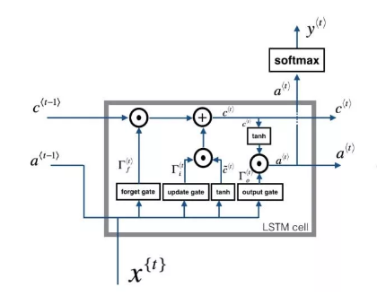
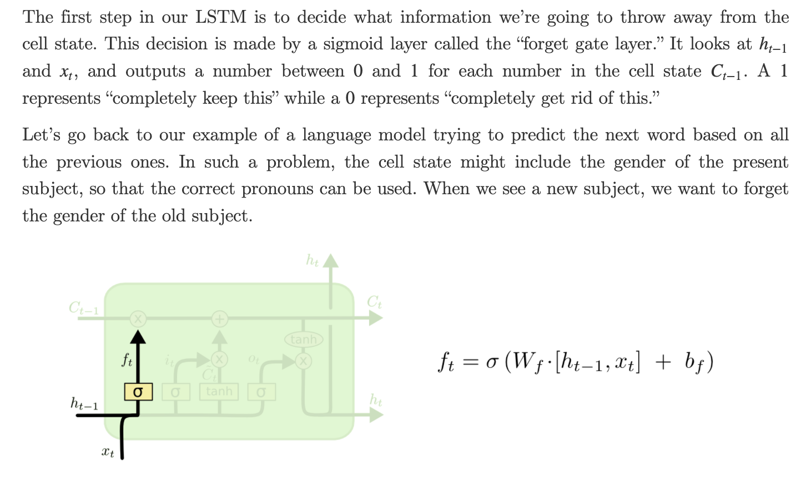
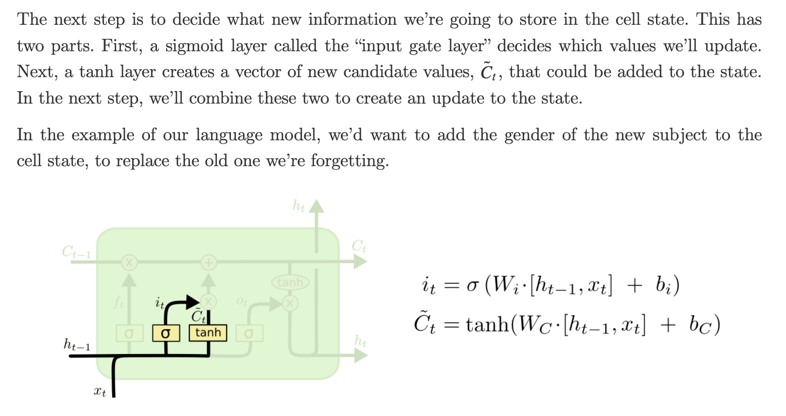
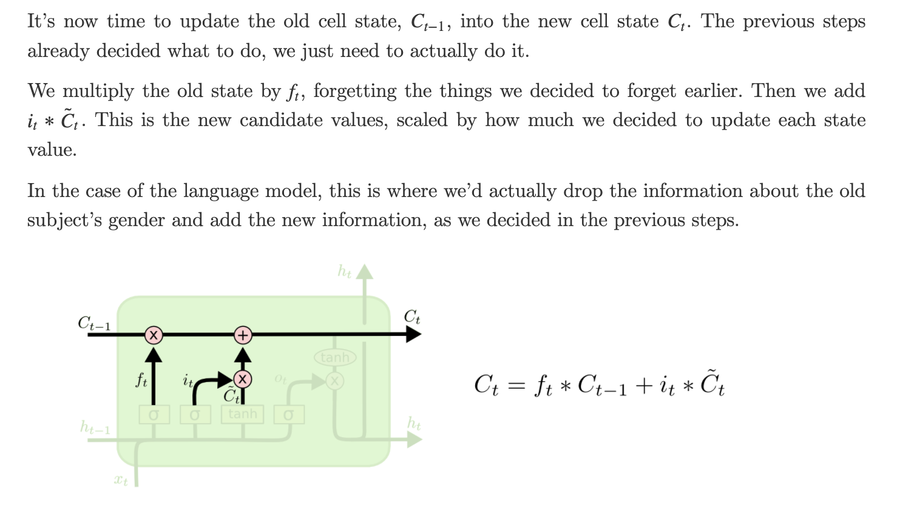

目录

- [LSTM 简介](#lstm-简介)
  - [RNN 问题](#rnn-问题)
  - [LSTM 简介](#lstm-简介-1)
- [LSTM 网络架构](#lstm-网络架构)
  - [RNN 重复模块链结构](#rnn-重复模块链结构)
  - [LSTM 重复模块链结构](#lstm-重复模块链结构)
- [LSTML 网络架构详解](#lstml-网络架构详解)
  - [记忆细胞](#记忆细胞)
  - [遗忘门](#遗忘门)
  - [更新门或输入门](#更新门或输入门)
  - [输出门](#输出门)
- [LSTM 变形](#lstm-变形)
  - [LSTM + peephole connections](#lstm--peephole-connections)
  - [LSTM + coupled \& input gates](#lstm--coupled--input-gates)
  - [GRU](#gru)
- [LSTM 结构解析](#lstm-结构解析)
- [LSTM 数学表示](#lstm-数学表示)
- [LSTM 解释](#lstm-解释)
- [参考](#参考)

# LSTM 简介

> Long Short Term Memory networks，LSTM - 让 RNN 具备更好的记忆机制

## RNN 问题

梯度爆炸和梯度消失对 RNN 的影响非常大，当 RNN 加深时，
因为梯度消失的问题使得前层的网络权重得不到更新，RNN 的记忆性就很难生效 

在传统的 RNN 基础上，研究人员给出了一些著名的改进方案，即 RNN 变种网络，
比较著名的是 GRU(循环门控单元)和 LSTM(长短期记忆网络)。
GRU 和 LSTM 二者的结构基本一致，但有些许不同

## LSTM 简介

LSTM，是一种特殊的 RNN 网络，能够学习序列数据中的信息的长期依赖关系。
LSTM 由 [Hochreiter＆Schmidhuber(1997)](http://www.bioinf.jku.at/publications/older/2604.pdf) 提出，
并在随后的工作中被许多人进行提炼和推广

LSTM 在传统的 RNN 结构上做了相对复杂的改进，这些改进使得 LSTM 相对于经典的 RNN 能够很好地解决梯度爆炸和梯度消失的问题，
让 RNN 具备更好的记忆性能，这也是 LSTM 的价值所在。LSTM 在各种各样的序列处理问题上都表现出色，现在已被广泛使用

LSTM 的设计明确避免了长期依赖的问题，长时间记住信息实际上是它们的默认行为，而不是它们努力学习的东西

# LSTM 网络架构

## RNN 重复模块链结构

RNN 网络是由一系列重复的单元结构组成的神经网络重复模块链的形式

RNN 单元结构：

RNN 神经网络重复模块链：

在标准的 RNN 中，此重复模块具有非常简单的结构，例如单个 tanh 层：

RNN 单元结构的具体形式：

## LSTM 重复模块链结构

LSTM 也具有上面的这种链状结构，但是重复模块具有不同的结构，
而不是只有一个神经网络层，而是有四个非常特殊的方式进行交互的层

> 

LSTM 单元结构的具体形式:

# LSTML 网络架构详解

## 记忆细胞

> 记忆细胞，remember cell，cell state

<!-- 
 -->

LSTM 最关键的部分是 LSTM 单元的最上层有一条水平贯穿的关于记忆细胞(remember cell, cell state)，即 `$c_{t-1}$` 到 `$c_{t}$` 
的箭头直线 cell state，这个单元状态有点像传送带，它在整个链中一直沿直线运行，只有一些较小的线性相互作用，
信息很容易不加改动地流动，这样贯穿的直线表现记忆信息在网络各层之间保持下去很容易：

LSTM 确实具有删除信息或将信息添加到记忆细胞的能力，这些信息由称为 gate(门) 的结构调节，
gate(门) 是一种选择性地让信息通过的方式，它们由 Sigmoid 神经网络层和逐点乘法运算组成：

Sigmoid 层的输出数值结果是在 `$[0, 1]$` 之间的数，描述了每个组件应该允许通过多少信息，
值为 0 表示 "不让任何信息通过"，值为 1 表示 "让所有信息通过"

LSTM 有三种 gate(门)，用来生成和控制记忆细胞

## 遗忘门

> 遗忘门，forget gate

遗忘门就是要决定从记忆细胞中是否丢弃某些信息，通过一个 Sigmoid 函数进行处理，
可以看到，遗忘门接受来自输入 `$x_{t}$` 和上一层隐状态 `$h_{t-1}$` 的值进行加权计算处理.
 

<!--  -->

## 更新门或输入门

> 更新门或输入门，update/input gate

更新门确定什么信息能存入记忆细胞状态中，除了计算更新门之外，
还需要通过 `$tanh$` 计算记忆细胞的候选值 `$\tilde{C}_{t}$`.
然后，LSTM 结合遗忘门 `$f_{t}$`、更新门 `$i_{t} * \tilde{C}_{t}$`、
上一层记忆细胞值和记忆细胞候选值 `$C_{t-1}$` 来共同决定和更新当前细胞状态 `$C_{t}$`
   

<!-- 
 -->

## 输出门

> output gate

LSTM 提供了单独的输出门

<!--  -->

# LSTM 变形

## LSTM + peephole connections

   
## LSTM + coupled & input gates

## GRU

> Gated Recurrent Unit，GRU

# LSTM 结构解析

# LSTM 数学表示

`$$\begin{align}
i_{t}=\sigma\left(W_{i} x_{t}+U_{i} h_{t-1}+b_{i}\right) \tag{1} \\
f_{t}=\sigma\left(W_{f} x_{t}+U_{f} h_{t-1}+b_{f}\right) \tag{2} \\
o_{t}=\sigma\left(W_{o} x_{t}+U_{o} h_{t-1}+b_{o}\right) \tag{3} \\
\tilde{c}_{t}=\tanh \left(W_{c} x_{t}+U_{c} h_{t-1}+b_{c}\right) \tag{4} \\
c_{t}=f_{t} \odot c_{t-1}+i_{t} \odot \tilde{c}_{t} \tag{5} \\
h_{t}=o_{t} \odot \tanh \left(c_{t}\right) \tag{6}
\end{align}$$`

# LSTM 解释

* LSTM 通过引入了三个门来控制信息的传递，分别是遗忘门、输入门、输出门。三个门的作用为：
    - 遗忘门：遗忘门 `$f_t$` 控制上一时刻的内部状态，需要遗忘多少信息
    - 输入门：输入门 `$i_t$` 控制当前时刻的候选状态，有多少信息需要保存
    - 输出门：输出门 `$o_t$` 控制当前时刻的内部状态，有多少信息需要输出给外部状态

# 参考

* [Understanding LSTM Networks](http://colah.github.io/posts/2015-08-Understanding-LSTMs/)
* [The Unreasonable Effectiveness of Recurrent Neural Networks](http://karpathy.github.io/2015/05/21/rnn-effectiveness/)
* [LONG SHORT-TERM MEMORY](http://www.bioinf.jku.at/publications/older/2604.pdf)
* [狗熊会课程-写一篇人人都能看得懂的LSTM](https://mp.weixin.qq.com/s?__biz=MzA5MjEyMTYwMg==&mid=2650243045&idx=1&sn=e77f19bf316268813dcdd572a0b49213&*hksm=88722088bf05a99e6ce2759808781884aa69c8de831cd4c27fc8198698b42289923ee41eee33&scene=21#wechat_redirect)
* [LSTM 与 GRU结构](https://blog.csdn.net/qq_28743951/article/details/78974058)
* [PyTorch LSTM](https://pytorch.org/docs/stable/generated/torch.nn.LSTM.html)
