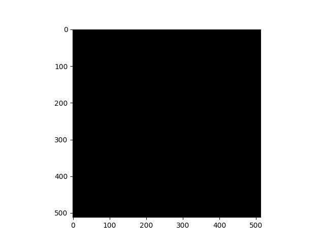
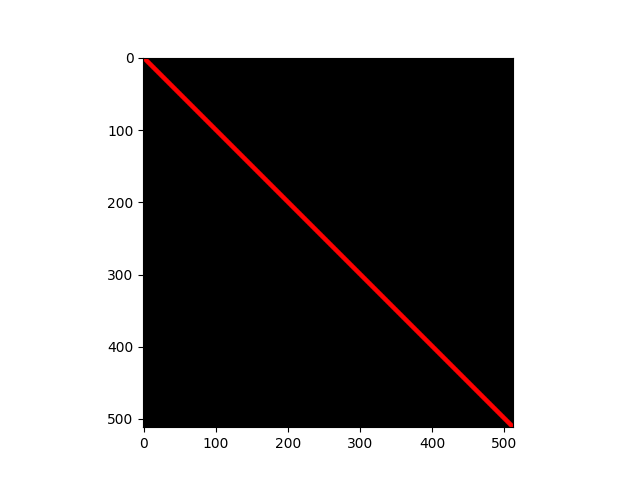
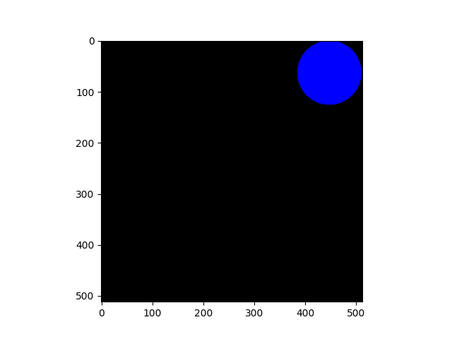

<style>
details {
    border: 1px solid #aaa;
    border-radius: 4px;
    padding: .5em .5em 0;
}
summary {
    font-weight: bold;
    margin: -.5em -.5em 0;
    padding: .5em;
}
details[open] {
    padding: .5em;
}
details[open] summary {
    border-bottom: 1px solid #aaa;
    margin-bottom: .5em;
}
</style>

<details><summary>目录</summary><p>

- [OpenCV 简介](#opencv-简介)
  - [OpenCV 基本信息](#opencv-基本信息)
  - [IPPICV 加速](#ippicv-加速)
- [OpenCV-Python](#opencv-python)
  - [依赖](#依赖)
  - [OpenCV-Python 安装](#opencv-python-安装)
    - [使用预构建的二进制文件和源代码](#使用预构建的二进制文件和源代码)
    - [使用非官方的 Python 预构建 OpenCV 包](#使用非官方的-python-预构建-opencv-包)
  - [OpenCV-Python 调用](#opencv-python-调用)
- [OpenCV 图像基本操作](#opencv-图像基本操作)
  - [OpenCV 常用 API](#opencv-常用-api)
  - [图像读取](#图像读取)
  - [图像显示](#图像显示)
    - [Jupyter Notebook](#jupyter-notebook)
    - [Python Script](#python-script)
  - [图像保存](#图像保存)
  - [在图像上绘图](#在图像上绘图)
    - [基本流程](#基本流程)
    - [直线](#直线)
    - [矩形](#矩形)
    - [圆圈](#圆圈)
  - [在图像上写文字](#在图像上写文字)
  - [图像混合](#图像混合)
  - [图像变换](#图像变换)
    - [图像翻转](#图像翻转)
  - [图像预处理](#图像预处理)
  - [图像特征检测与描述](#图像特征检测与描述)
  - [图像边缘检测](#图像边缘检测)
  - [图像轮廓](#图像轮廓)
  - [视频分析](#视频分析)
  - [机器学习](#机器学习)
  - [计算摄影学](#计算摄影学)
  - [目标检测](#目标检测)
- [OpenCV-Python Binding](#opencv-python-binding)
- [OpenCV 收集图片数据集](#opencv-收集图片数据集)
  - [初始化](#初始化)
  - [示例](#示例)
  - [参考](#参考)
- [OpenCV 图像投影变换](#opencv-图像投影变换)
  - [投影变换(仿射变换)](#投影变换仿射变换)
    - [投影变换矩阵](#投影变换矩阵)
    - [投影变换](#投影变换)
  - [示例](#示例-1)
</p></details><p></p>


# OpenCV 简介

## OpenCV 基本信息

> OpenCV (Open Source Computer Vision Library)，一个开源的计算机视觉库，
> 官方网站为 [http://opencv.org](http://opencv.org/)。它提供了很多函数，
> 这些函数非常高效地实现了计算机视觉算法，从最基本的滤波到高级的物体检测皆有涵盖
>
> 1999 年，Gary Bradski(加里·布拉德斯基)当时在英特尔任职，
> 怀着通过为计算机视觉和人工智能的从业者提供稳定的基础架构并以此来推动产业发展的美好愿景，
> 他启动了 OpenCV 项目

- OpenCV 的一个目标是提供易于使用的计算机视觉接口，从而帮助人们快速建立精巧的视觉应用
- OpenCV 设计用于进行高效的计算，十分强调实时应用的开发。它由 C++ 语言编写并进行了深度优化，
  从而可以享受多线程处理的优势。同时也提供了 Python、Java、MATLAB 等语言的接口
- OpenCV 是跨平台的，可以在 Windows、Linux、macOS、Android、iOS 等系统上运行
- OpenCV 库包含从计算机视觉各个领域衍生出来的 500 多个函数，
  包括工业产品质量检验、医学图像处理、安保领域、交互操作、相机校正、双目视觉以及机器人学。
  OpenCV 的应用非常广泛，包括图像拼接、图像降噪、产品质检、人机交互、人脸识别、动作识别、动作跟踪、无人驾驶等
- 因为计算机视觉和机器学习经常在一起使用，所以 OpenCV 也包含一个完备的、具有通用性的机器学习库(ML模块)。
  这个子库聚焦于统计模式识别以及聚类。ML 模块对 OpenCV 的核心任务(计算机视觉)相当有用，
  但是这个库也足够通用，可以用于任意机器学习问题

## IPPICV 加速

- 如果希望得到更多在英特尔架构上的自动优化，可以购买英特尔的集成性能基元(IPP)库，
  该库包含了许多算法领域的底层优化程序。在库安装完毕的情况下 OpenCV 在运行的时候会自动调用合适的 IPP 库
- 从 OpenCV 3.0 开始，英特尔许可 OpenCV 研发团队和 OpenCV 社区拥有一个免费的 IPP 库的子库(称 IPPICV)，
  该子库默认集成在 OpenCV 中并在运算时发挥效用。如果你使用的是英特尔的处理器，那么 OpenCV 会自动调用 IPPICV。
- IPPICV 可以在编译阶段链接到 OpenCV，这样一来，
  会替代相应的低级优化的 C 语言代码(在 cmake 中设置 `WITH_IPP=ON/OFF` 来开启或者关闭这一功能，默认情况为开启)。
  使用 IPP 获得的速度提升非常可观

# OpenCV-Python

OpenCV-Python 是用于 OpenCV 的 Python API，结合了 OpenCV C++ API 和 Python 的最佳特性

OpenCV-Python 依赖于 Numpy 库，所有的 OpenCV 数组结构都能够与 Numpy 数组相互转换，
这也使得使用 OpenCV 与 Numpy 的其他库的集成变得更加容易

## 依赖

- OpenCV 3.x
- Python 3
- Numpy
- Matplotlib

## OpenCV-Python 安装

### 使用预构建的二进制文件和源代码

- [Ubuntu doc](https://mp.weixin.qq.com/s?__biz=MzU2NTUwNjQ1Mw==&mid=2247484077&idx=1&sn=f8ac89b218addfe8b4110b8dfa121938&scene=19#wechat_redirect)
- [Windows doc](https://docs.opencv.org/3.0-beta/doc/py_tutorials/py_setup/py_setup_in_windows/py_setup_in_windows.html)
- [macOS doc](https://www.pyimagesearch.com/2016/12/19/install-opencv-3-on-macos-with-homebrew-the-easy-way/)

### 使用非官方的 Python 预构建 OpenCV 包 

在 macOS、Windows、Linux 环境中安装:

- 如果只需要主模块(main module)

```bash
$ pip install opencv-python
```

- 如果需要主模块(main module)和 contrib 模块

```bash
$ pip install opencv-contrib-python
```

## OpenCV-Python 调用

```python
import cv2 as cv
print(cv.__version__)
```


# OpenCV 图像基本操作

## OpenCV 常用 API

- `cv2.imread(img_path, img_mode)`
	- `cv2.IMREAD_COLOR`
    	- 加载彩色图像
    	- 任何图像的透明度都会被忽视，默认
    	- 参数编码：`1`
	- `cv2.IMREAD_GRAYSCALE`
    	- 以灰度模式加载图像
    	- 参数编码：`0`
	- `cv2.IMREAD_UNCHANGED`
    	- 加载图像，包括 alpha 通道
    	- 参数编码：`-1`
- `cv2.imshow('window_name', img_obj)`
- `cv2.imwrite()`
- `cv2.waitKey()` 
    - 一个键盘绑定函数，它的参数是以毫秒为单位的时间
    - 该函数等待任何键盘事件的指定毫秒，如果在那段时间内按任意键，程序将继续
    - 如果传递参数为 0，它将无限期得等待一次敲击键
    - 也可以设置参数为检测特定的按键，例如: 如果按下键 `a` 等
- 键盘上的 Escape 键(`0xFF == 27`)
    - 如果按下了退出键，则循环将中断并且程序停止
- `cv2.destroyAllWindows()` 
    - 简单地销毁创建的所有窗口
- `cv2.destoryAllWindow()`
    - 如果要销毁任何特定窗口，将确切的窗口名称作为参数传递


## 图像读取

使用 `cv.imread` 读取图像时，图像应该在工作目录或者给出图像的完整文件路径

```python
import cv2

img = cv2.imread("img.jpg")

print(type(img))
print(img.shape)
```

## 图像显示

使用 `cv.imshow` 显示图像时，显示图像的窗口自动适合图像尺寸

<div class="warning" style='background-color:#E9D8FD; color: #69337A; border-left: solid #805AD5 4px; border-radius: 4px; padding:0.7em;'>
    <span>
        <p style='margin-top:1em; text-align:left'>
            <b>Note</b>
        </p>
        <p style='margin-left:1em;'>
            由于 OpenCV 和 Matplotlib 具有不同的原色顺序，
            OpenCV 以 BGR 的形式读取图像, Matplotlib 以 RGB 的形式读取图像，
            因此为了正常显示图像，在用 Matplotlib 显示图像时，
            需要将图像转换为 Matplotlib 的形式
        </p>
        <p style='margin-bottom:1em; margin-right:1em; text-align:right; font-family:Georgia'> 
            <b></b> 
            <i></i>
        </p>
    </span>
</div>


### Jupyter Notebook

```python
# opencv
import cv2

# 读取图像
img_bgr = cv2.imread("img.jpg")
cv2.imshow("image", img_bgr)
cv2.waitKey(0)
cv2.destoryAllWindows()
```

```python
# matplotlib
import matplotlib.pyplot as plt
import cv2

# 读取图像
img_bgr = cv2.imread("img.jpg")
# 将 opencv 图像转换为 matplotlib 的形式
img_rgb = cv2.cvtColor(img_bgr, cv2.COLOR_BGR2RGB)
plt.imshow("image", img_rgb)
```

### Python Script

```python
import cv2

img = cv2.imread("img.jpg")

while True:
    cv2.imshow("image", img)
    if cv2.waitKey(1) & 0xFF == 27:
        break
cv2.destoryAllWindows()
```

## 图像保存

```python
import cv2

img = cv2.imread("img.jpg")
cv2.imwrite("final_image.png", img)
```

## 在图像上绘图

### 基本流程

1. 读取或创建一个图像作为模板

```python
import numpy as np
import matplotlib.pyplot as plt

img_blank = np.zeros(shape = (512, 512, 3), dtype = np.int16)
plt.imshow(img_blank)
plt.show()

img_bgr = cv2.imread("img.jpg")
img_rgb = cvtColor(img_bgr, cv2.COLOR_BGR2RGB)
plt.imshow(img_rgb)
plt.show()
```



2. 功能与属性

在图像上绘制形状的通用函数是 `cv2.shape()`:

```python
import cv2

cv2.shape(img, pt1, pt2, color, thickness, lineType)
```

参数:

- `cv2.shape()`: shape 可以是 line, rectangle, ...
- `img`: 被绘制形状的图像
- `pt1`, `pt2`: 形状从左下角(pt1)到右下角(pt2)的坐标
- `color`: 要绘制的形状的颜色, 如 (255, 0, 0) 表示灰度
- `thickness`: 几何图形的厚度
- `lineType`: 线类型

### 直线

```python
import matplotlib.pyplot as plt
import cv2

img_line = cv2.line(
    img = img_blank, 
    pt1 = (0, 0), 
    pt2 = (511, 511), 
    color = (255, 0, 0), 
    thickness = 5, 
    lineType = 8
)
plt.imshow(img_line)
plt.show()
```



### 矩形

```python
import matplotlib.pyplot as plt
import cv2

img_rectangle = cv2.rectangle(
    img = img_blank, 
    pt1 = (384, 0),
    pt2 = (510, 128), 
    color = (0, 0, 255), 
    thickness = 5,
    lineType = 8,
)
plt.imshow(img_rectangle)
plt.show()
```


### 圆圈

```python
import matplotlib.pyplot as plt
import cv2

img_circle = cv2.circle(
    img = img_blank, 
    center = (447, 63), 
    radius = 63, 
    color = (0, 0, 255), 
    thickness = -1,
    lineType = 8,
)
plt.imshow(img_circle)
plt.show()
```



## 在图像上写文字

API:

* `cv2.putText(img, text, org, fontFace, fontScale, color, thickness, lineType)`

主要参数：

- `img`: 文字背景图像
- `text`: 文字内容
- `org`: 文字的坐标，从左下角开始
- `fontFace`: 文字字体
- `fontScale`: 文字大小比例
- `color`: 文字颜色
- `thickness`: 文字字体粗细
- `lineType`: 文字线条类型

```python
import matplotlib.pyplot as plt
import cv2

font = cv2.FONT_HERSHEY_SCRIPT_SIMPLEX
img_text = cv2.putText(
    img = img_blank,             # 图像
    text = "OpenCV",             # 文字内容
    org = (150, 200),              # 文字坐标
    fontFace = font,             # 文字字体
    fontScale = 2,               # 文字比例
    color = (255, 255, 255),     # 文字颜色
    thickness = 5,               # 文字字体粗细
    lineType = cv2.LINE_AA,      # 文字线条类型
)
plt.imshow(img_text)
plt.show()
```


## 图像混合

## 图像变换

图像变换包括:

* 平移
* 旋转
* 缩放
* 裁剪
* 翻转

### 图像翻转

```python
import matplotlib.pyplot as plt
import cv2

img = cv2.imread("img.jpg")
cv2.flip()
```

## 图像预处理

## 图像特征检测与描述

## 图像边缘检测

## 图像轮廓

## 视频分析

## 机器学习

## 计算摄影学

## 目标检测

# OpenCV-Python Binding


# OpenCV 收集图片数据集

通过视频截取图像来创建图像数据集是收集和格式化图像数据的最简单方法之一。
建议在有一面空白墙壁来收集数据，以确保框架中没有外部噪音

## 初始化

创建一个 VideoCapture 对象，该对象从系统的网络摄像头实时捕获视频

* `flag_collecting`：这是一个布尔变量，用作暂停/恢复按钮
* `images_collected`：这是一个整数变量，用于指示系统中收集和保存的图像数量
* `images_required`：这是一个整数变量，用于指示我们打算收集的图像数量

- https://docs.opencv.org/4.x/dd/d43/tutorial_py_video_display.html

## 示例

```python
import os
import cv2

# 创建 VideoCapture 对象
cap = cv2.VideoCapture(0)

flag_collecting = False
images_collected = 0
images_required = 50

# 创建项目目录
directory = os.path.join(os.path.dirname(__file__), "demo")
if not os.path.exists(directory):
    os.mkdir(directory)

# 收集和格式化图像数据集
while True:
    # 
    ret, frame = cap.read()
    frame = cv2.flip(frame, 1)

    # 设置收集图像的数据量    
    if images_collected == images_required:
        break

    # 绘制矩形    
    cv2.rectangle(frame, (380, 80), (620, 320), (0, 0, 0), 3)

    if flag_collecting == True:
        sliced_frame = frame[80:320, 380:620]
        save_path = os.path.join(directory, f'{images_collected + 1}.jpg')
        cv2.imwrite(save_path, sliced_frame)
        images_collected += 1
    
    cv2.putText(
        frame, 
        f"Saved Images: {images_collected}", 
        (400, 50), 
        cv2.FONT_HERSHEY_SIMPLEX, 
        0.7,
        (0, 0, 0),
        2
    )
    cv2.imshow("Data Collection", frame)

    k = cv2.waitKey(10)
    if k == ord("s"):
        flag_collecting = not flag_collecting
    if k == ord("q"):
        break

print(images_collected, "images saved to directory")
cap.release()
cv2.destoryAllWindows()
```

## 参考

- https://mp.weixin.qq.com/s/R9uBQaVl2Zlr2rZ5kaq4Rw

# OpenCV 图像投影变换

## 投影变换(仿射变换)

在数学中，线性变换是将一个向量空间映射到另一个向量空间的函数，通常由矩阵实现。
如果映射保留向量加法和标量乘法，则映射被认为是线性变换

要将线性变换应用于向量(即，一个点的坐标，在图像中就是像素的 `$x$` 和 `$y$`值)，
需要将该向量乘以表示线性变换的矩阵。作为输出，将获得一个坐标转换后的向量

### 投影变换矩阵

投影变换可以用下面的矩阵表示

`$$
\left[
    \begin{array}{c}
        a_{1} & a_{2} & b_{1}\\
        a_{3} & a_{4} & b_{2}\\
        c_{1} & c_{2} & 1\\
    \end{array}
\right]$$`

其中:

`$$
\left[
    \begin{array}{c}
        a_{1} & a_{2}\\
        a_{3} & a_{4}\\
    \end{array}
\right]$$`

是一个旋转矩阵，该矩阵定义了将要执行的变换类型: 缩放、旋转等

`$$
\left[
    \begin{array}{c}
        b_{1}\\
        b_{2}\\
    \end{array}
\right]$$`

是一个平移向量，它只移动点

`$$
\left[
    \begin{array}{c}
        c_{1} & c_{2}\\
    \end{array}
\right]$$`

是投影向量，对于仿射变换，该向量的所有元素始终等于 0

### 投影变换

如果 `$x$` 和 `$y$` 是一个点的坐标，则可以通过简单的乘法进行变换

`$$
\left[
    \begin{array}{c}
        a_{1} & a_{2} & b_{1}\\
        a_{3} & a_{4} & b_{2}\\
        c_{1} & c_{2} & 1\\
    \end{array}
\right] \times
\left[
    \begin{array}{c}
        x\\
        y\\
        1\\
    \end{array}
\right] =
\left[
    \begin{array}{c}
        x^{'}\\
        y^{'}\\
        1\\
    \end{array}
\right]$$`

其中: `$x^{'}$` 和 `$y^{'}$` 是变换点的坐标

## 示例

1. 读取源图像并获取源图像的大小

```python
import numpy as np
import matplotlib.pyplot as plt
import cv2

# 源图像
img_src = cv2.imread("source_image.jpg", cv2.IMREAD_COLOR)

# 源图像大小参数
h, w, c = img_src.shape

# 获取源图像的参数: [[left,top], [left,bottom], [right, top], [right, bottom]]
img_src_coordinate = np.array([
    [0, 0],
    [0, h],
    [w, 0],
    [w, h],
])
```

2. 读取目标图像

```python
img_dest = cv2.imread("dest_image.jpg", cv2.IMREAD_COLOR)
img_dest_copy = img_dest.copy()
```

3. 获取目标图像中的坐标，源图像将被粘贴到改坐标

```python
def get_paste_position(img_dest_copy, event, x, y, flags, paste_coorinate_list):
    """
    点击目标图像中的四个点后，将四个点保存到一个列表中
    """
    cv2.imshow("collect coordinate", img_dest_copy)
    if event == cv2.EVENT_LBUTTONUP:
        # draw circle right in click position
        cv2.circle(img_dest_copy, (x, y), 2, (0, 0, 225), -1)
        # append new clicked coordinate to paste_coordinate_list
        paste_coordinate_list.append([x, y])

# 获取目标图像中的坐标
paste_coordinate = []
cv2.namedWindow("collect coordinate")
cv2.setMouseCallback(
    "collect coordinate", 
    get_paste_position, 
    paste_coordinate
)
while True:
    cv2.waitKey(1)
    if len(paste_coordinate) == 4:
        break
paste_coordinate = np.array(paste_coordinate)

# 计算投影变换矩阵
matrix, _ = cv2.findHomography(img_src_coordinate, paste_coordinate, 0)
print(f"matrix: {matrix}")

# 将源图像转换为具有目标图像大小的透视图像
perspective_img = cv2.warpPerspective(
    img_src, 
    matrix, 
    (img_dest.shape[1], img_dest.shape[0]),
)
cv2.imshow("img", perspective_img)

# 将源图像粘贴到目标图像中的选定坐标中
cv2.copyTo(
    src = perspective_img, 
    mask = np.tile(perspective_img, 1), 
    dst = img_dest
)
cv2.imshow("result", img_dest)

cv2.waitKey()
cv2.destoryAllWindows()
```

