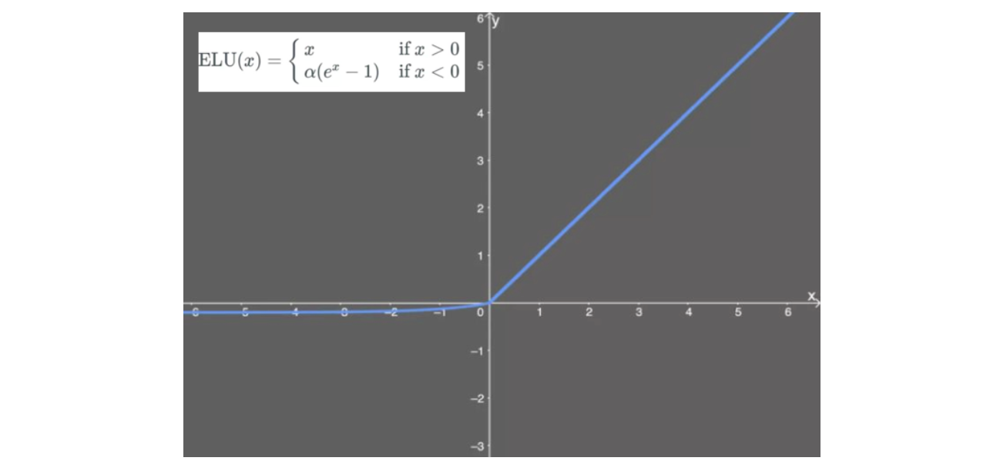

目录

- [隐藏层](#隐藏层)
  - [恒等函数](#恒等函数)
  - [Sigmoid](#sigmoid)
    - [Logistic](#logistic)
    - [Tanh](#tanh)
    - [Hard-Logistic 和 Hard-Tanh](#hard-logistic-和-hard-tanh)
  - [ReLU](#relu)
    - [ReLU](#relu-1)
    - [Leaky ReLU](#leaky-relu)
    - [PReLU](#prelu)
    - [ELU](#elu)
    - [SELU](#selu)
    - [GELU](#gelu)
  - [Swish](#swish)
  - [Softmax](#softmax)
- [输出层](#输出层)
  - [恒等函数](#恒等函数-1)
  - [Softmax](#softmax-1)
  - [Sigmoid](#sigmoid-1)
  - [神经元数量](#神经元数量)
- [参考](#参考)

# 隐藏层

激活函数在深度学习中扮演着非常重要的角色，它给神经网络赋予了非线性，
从而使得神经网络能够拟合任意复杂的函数。如果没有激活函数，无论多么复杂的网络，
都等价于单一的线性变换，无法对非线性函数进行拟合

为了增强网络的表示能力和学习能力，激活函数需要具备以下几点性质：

1. 连续并可导(允许少数点上不可导)的非线性函数。可导的激活函数可以直接利用数值优化的方法来学习网络参数
2. 激活函数及其导函数要尽可能的简单，有利于提高网络的计算效率
3. 激活函数的导函数的值域要在一个合适的区间内，不能太大也不能太小，否则会影响训练的效率和稳定性

目前，深度学习中最流行的激活函数是 ReLU，但也有新推出的激活函数，例如 swish、GELU，
据称效果优于 ReLU 激活函数

## 恒等函数

> Linear

线性激活函数是一种简单的线性函数，基本上，输入到输出过程中不经过修改

`$$\sigma(x) = x$$`

## Sigmoid

Sigmoid 型函数是指一类 S 型曲线函数，为两端饱和函数。
常用的 Sigmoid 型函数有 Logistic 函数和 Tanh 函数

Tanh 函数的输出是零中心化(Zero-Centered)，而 Logistic 函数的输出恒大于 0。
非零中心化的输出会使得其后一层的神经元的输入发生偏置偏移(Bias Shift)，
并进一步使得梯度下降的收敛速度变慢

### Logistic

Logistic 型函数将实数压缩到 `$(0, 1)$` 区间内。一般只在二分类的最后输出层使用

`$$\sigma(x) = \frac{1}{1+e^{-x}}$$`

其中:

* `$e$` 是纳皮尔常数 `$2.7182...$`

Logistic 函数的三个主要缺陷：

1. 梯度消失
   Logistic 函数趋近 0 和 1 的时候变化率会变得平坦，也就是说，Logistic 的梯度趋近于 0。
   神经网络使用 Logistic 激活函数进行反向传播时，输出接近 0 或 1 的神经元其梯度趋近于 0。
   这些神经元叫作饱和神经元。因此，这些神经元的权重不会更新。此外，与此类神经元相连的神经元的权重也更新得很慢。
   该问题叫作梯度消失。因此，如果一个大型神经网络包含 Logistic 神经元，而其中很多个都处于饱和状态，
   那么该网络无法执行反向传播
2. 不以零为中心
   Logistic 输出不以零为中心的
3. 计算成本高昂
    - 指数函数(`$e^{x}$`)与其他非线性激活函数相比，计算成本高昂

### Tanh

Tanh(Hyperbolic Tangent)函数，双曲正切函数，也是一种 Sigmoid 型函数。
Tanh 函数可以看作放大并平移的 Logistic 函数，将实数压缩到 `$[-1, 1]$` 区间内，
输出期望为 0，解决了 Logistic 函数中值域期望不为 0 的问题。
在实践中，Tanh 函数的使用优先性高于 Logistic 函数

`$$\sigma(x) = \frac{e^{x} - e^{-x}}{e^{x} + e^{-x}}$$`

主要缺陷为：

1. 有梯度消失的问题，因此在饱和时也会杀死梯度
2. 计算复杂度高

### Hard-Logistic 和 Hard-Tanh

Logistic 函数和 Tanh 函数都是 Sigmoid 型函数，具有饱和性，但是计算开销较大。
因为这两个函数都是在中间(0 附近)近似线性，两端饱和。因此，这两个函数可以通过分段函数来近似

Hard-Logistic 函数如下：

`$$\begin{aligned}
Hard-Logistic(x) 
&= \begin{cases}
    1, g_{l}(x) \geq 1 \\
    g_{l}, 0 \leq g_{l}(x) \leq 1 \\
    0, g_{l}(x) \leq 0
\end{cases} \\
&=max(min(g_{l}(x), 1), 0) \\
&= max(min(0.25x + 0.5, 1), 0)
\end{aligned}$$`

其中：

* `$g_{l}(x)\approx \sigma(0) + x \times \sigma^{'}(0) = 0.25 x + 0.5$`，为 Logistic 函数在 0 附近的一阶泰勒展开

Hard-Tanh 函数如下：

`$$\begin{aligned}
Hard-Tanh(x) 
&= max(min(g_{t}, 1), -1) \\
&= max(min(x, 1), -1)
\end{aligned}$$`

其中：

* `$g_{t}(x)\approx tanh(0) + x \times tanh^{'}(0) = x$`，是 Tanh 函数在 0 附近的一阶泰勒展开

## ReLU

在神经网络发展的历史上，Sigmoid 激活函数很早就开始使用了，
而在现代神经网络中，默认推荐的是使用 ReLU(Rectified Linear Unit 整流线性单元)函数

### ReLU

当输入 `$x<0$` 时，输出为 0，当 `$x> 0$` 时，输出为 `$x$`。该激活函数使网络更快速地收敛。
它不会饱和，即它可以对抗梯度消失问题，至少在正区域（`$x> 0$` 时）可以这样，
因此神经元至少在一半区域中不会把所有零进行反向传播。由于使用了简单的阈值化（thresholding），
ReLU 计算效率很高

`$$\begin{align}
\sigma(x)
&= \begin{cases}
    x    &      & {x \geq 0}    \\
    0    &      & {x < 0} \end{cases} \\
&=max\{0, x\}
\end{align}$$`

但是 ReLU 神经元也存在一些缺点：

1. 不以零为中心
    - 和 Sigmoid 激活函数类似，ReLU 函数的输出不以零为中心
2. 前向传导（forward pass）过程中，如果 `$x < 0$`，则神经元保持非激活状态，
   且在后向传导（backward pass）中杀死梯度。这样权重无法得到更新，
   网络无法学习。当 `$x = 0$` 时，该点的梯度未定义，但是这个问题在实现中得到了解决，
   通过采用左侧或右侧的梯度的方式

为了解决 ReLU 激活函数中的梯度消失问题，当 `$x < 0$` 时，
使用 Leaky ReLU，该函数试图修复 dead ReLU 问题

### Leaky ReLU

Leaky ReLU 是对修正线性单元的改进，Leaky ReLU 的概念是：当 `$x < 0$` 时，它得到 0.1 的正梯度。
该函数一定程度上缓解了 dead ReLU 问题，但是使用该函数的结果并不连贯。尽管它具备 ReLU 激活函数的所有特征，
如计算高效、快速收敛、在正区域内不会饱和

`$$\sigma(x) = max(0.1x, x)$$`

### PReLU

> Parameteric ReLU

Leaky ReLU 可以得到更多扩展。不让 `$x$` 乘常数项，而是让 `$x$` 乘超参数，
这看起来比 Leaky ReLU 效果要好。该扩展就是 Parametric ReLU

`$$\sigma(x)=max\{\alpha x, x\}$$`

其中：

* `$\alpha$` 是超参数

这里引入了一个随机的超参数 `$\alpha$`，它可以被学习，因为可以对它进行反向传播。
这使神经元能够选择负区域最好的梯度，有了这种能力，它们可以变成 ReLU 或 Leaky ReLU

总之，最好使用 ReLU，但是你可以使用 Leaky ReLU 或 Parametric ReLU 实验一下，
看看它们是否更适合你的问题

### ELU

ELU，指数线性单元，是对 ReLU 的改进，能够缓解死亡 ReLU 问题

`$$\sigma(x) = \begin{cases}
x, \quad x > 0 \\
\alpha (e^{x} - 1)   \quad x \leq 0
\end{cases}$$`

### SELU

SELU，扩展型指数线性单元，SELU 激活能够对神经网络进行自归一化（self-normalizing）。
在权重用 LeCun Normal 初始化的前提下能够对神经网络进行自归一化。
不可能出现梯度爆炸或者梯度消失问题。需要和 Dropout 的变种 AlphaDropout 一起使用

`$$\sigma(x) = \lambda \begin{cases}
x, \quad x > 0 \\
\alpha (e^{x} - 1), \quad x \leq 0
\end{cases}$$`

优点：

* 内部归一化的速度比外部归一化快，这意味着网络能更快收敛
* 不可能出现梯度消失或爆炸问题

缺点：

* 这个激活函数相对较新，需要更多论文比较性地探索其在 CNN 和 RNN 等架构中应用

### GELU

GELU，高斯误差线性单元激活函数，在 Transformer 中表现最好

`$$\sigma(x) = 0.5 x \Big(1 + tanh(\sqrt{\frac{2}{\pi}} (x + 0.044715 x^{3}))\Big)$$`

可以看出，当 `$x$` 大于 0 时，输出为 `$x$`；但 `$x=0$` 到 `$x=1$` 的区间除外，
这时曲线更偏向于 `$y$` 轴

优点：

1. 似乎是 NLP 领域的当前最佳，尤其在 Transformer 模型中表现最好
2. 能避免梯度消失问题

缺点：

* 尽管是 2016 年提出的，但在实际应用中还是一个相当新颖的激活函数

## Swish

Swish，自门控激活函数，谷歌出品，相关研究指出用 Swish 替代 ReLU 将获得轻微效果提升

`$$\sigma(x) = \frac{x}{1 + e^{-x}}$$`

根据上图，可以观察到在 `$x$` 轴的负区域曲线的形状与 ReLU 激活函数不同，
因此，Swish 激活函数的输出可能下降，即使在输入值增大的情况下。大多数激活函数是单调的，
即输入值增大的情况下，输出值不可能下降。而 Swish 函数为 0 时具备单侧有界（one-sided boundedness）的特性，
它是平滑、非单调的。更改一行代码再来查看它的性能，似乎也挺有意思

## Softmax

Softmax 是 Sigmoid 的多分类扩展，一般只在多分类问题的最后输出层使用

`$$\sigma(a;k) = \frac{e^{a_{k}}}{\sum_{i=1}^{n}e^{a_i}}$$`

其中:

* `$n$`: 是输出层神经元的个数
* `$k$`: 是指第 `$k$` 个神经元
* `$a$`: 是输入信号

Softmax 函数针对溢出问题的改进:

`$$\sigma(a;k) = \frac{e^{a_k+C}}{\sum_{n}^{i=1}e^{a_i+C}}$$`

# 输出层

神经网络可以用在分类和回归问题上，不过需要根据情况改变输出层的激活函数。
一般而言，回归问题用恒等函数，分类问题用 Softmax 函数

## 恒等函数

`$$\sigma(x) = x$$`

## Softmax

`$$y_k = \frac{e^{a_{k}}}{\sum_{i=1}^{n}e^{a_i}}$$`

其中:

* `$n$` 是输出层神经元的个数
* `$k$` 是指第 `$k$` 个神经元
* `$a$` 是输入信号

Softmax 函数针对溢出问题的改进形式：

`$$y_k = \frac{e^{a_{k}+C}}{\sum_{n}^{i=1}e^{a_{i}+C}}$$`

## Sigmoid

在预测概率的输出层中使用

`$$\sigma(x) = \frac{1}{1+e^{-x}}$$`

其中:

* `$e$` 是纳皮尔常数 `$2.7182...$`

## 神经元数量

输出层的神经元数量需要根据待解决的问题决定

* 对于分类问题, 输出层的神经元数量一般设定为类别的数量

# 参考

* [Activation Functions in Deep Learning](https://learnopencv.com/understanding-activation-functions-in-deep-learning/)
* [一文概览深度学习中的激活函数（入门篇）](https://zhuanlan.zhihu.com/p/98472075)
* [一文概览深度学习中的激活函数（深入篇）](https://zhuanlan.zhihu.com/p/98974388)
