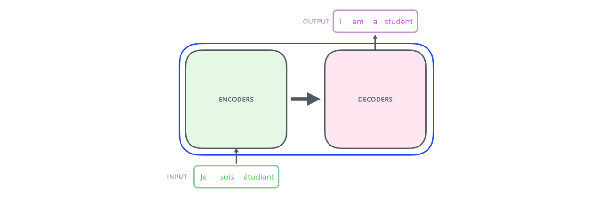
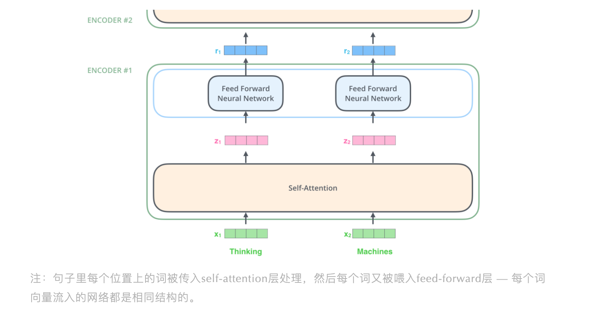
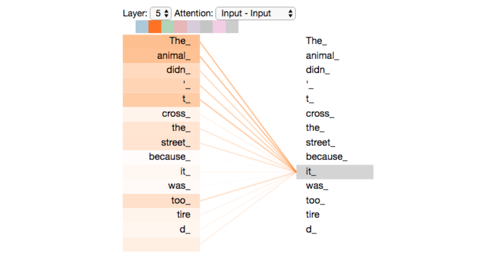
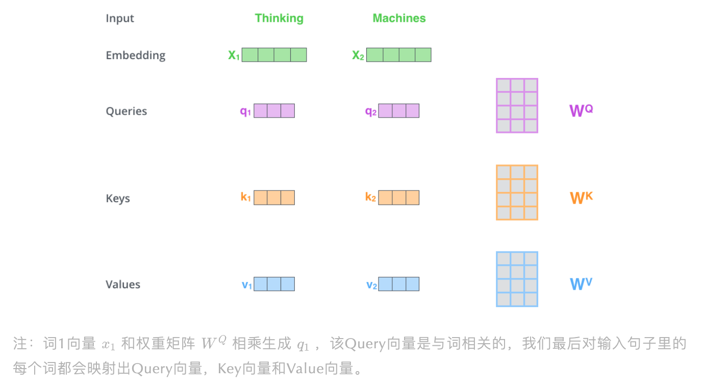
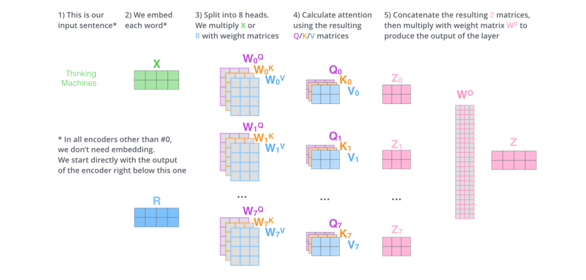
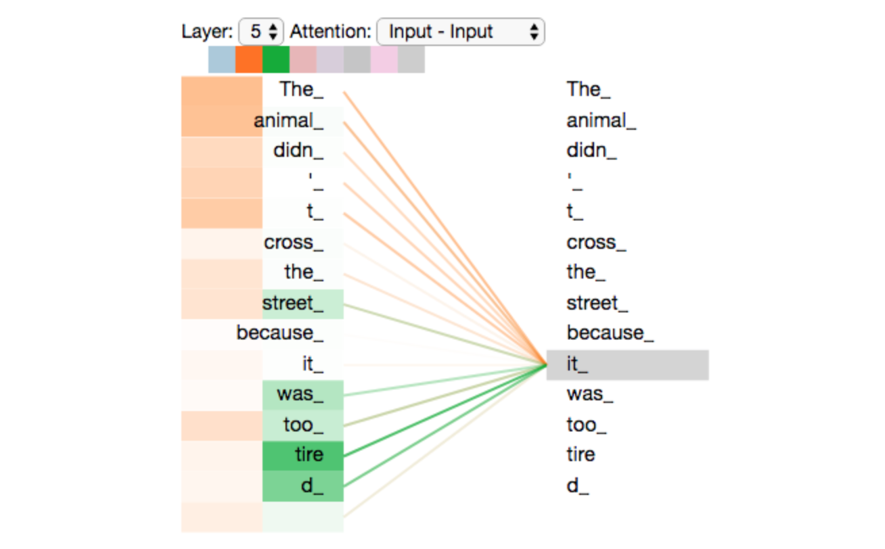
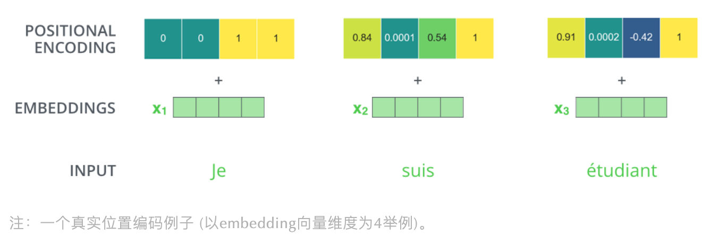
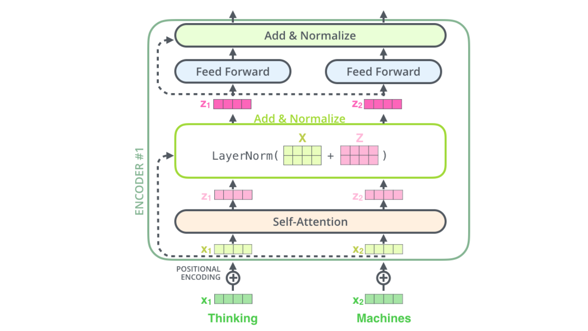
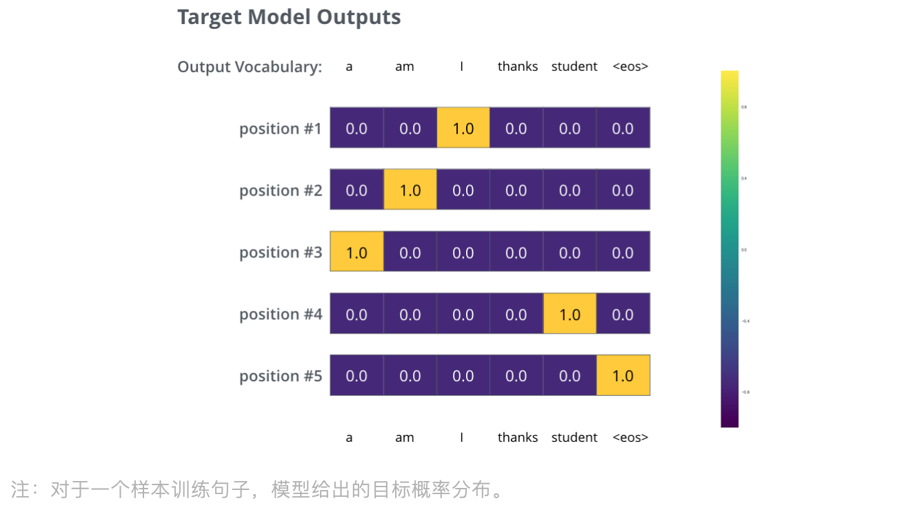
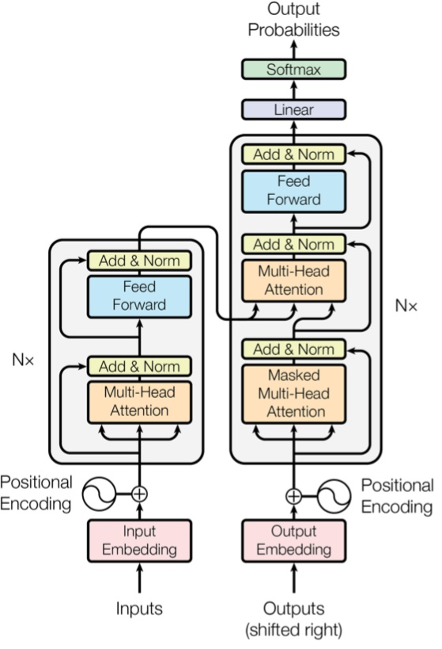

<style>
details {
    border: 1px solid #aaa;
    border-radius: 4px;
    padding: .5em .5em 0;
}
summary {
    font-weight: bold;
    margin: -.5em -.5em 0;
    padding: .5em;
}
details[open] {
    padding: .5em;
}
details[open] summary {
    border-bottom: 1px solid #aaa;
    margin-bottom: .5em;
}
</style>

<details><summary>目录</summary><p>

- [Transformer 整体架构架构](#transformer-整体架构架构)
  - [Transformer 架构](#transformer-架构)
  - [Transformer 输入](#transformer-输入)
- [编码模块](#编码模块)
  - [从高处看 Self-attention](#从高处看-self-attention)
  - [从细节看 Self-attention](#从细节看-self-attention)
    - [Self-attention 的向量计算](#self-attention-的向量计算)
    - [Self-attention 的矩阵计算](#self-attention-的矩阵计算)
  - [Multi-head 机制](#multi-head-机制)
  - [使用位置编码表征序列顺序](#使用位置编码表征序列顺序)
  - [残差项](#残差项)
- [解码模块](#解码模块)
  - [Encoder-Deocder Attention 层](#encoder-deocder-attention-层)
  - [Linear 和 Softmax 层](#linear-和-softmax-层)
- [训练概要](#训练概要)
- [损失函数](#损失函数)
  - [Transformer 结构解析](#transformer-结构解析)
  - [Transformer 数学表示](#transformer-数学表示)
  - [Transformer 要点问题](#transformer-要点问题)
  - [PyTorch 示例](#pytorch-示例)
- [参考](#参考)
</p></details><p></p>

Transformer 是 Google 在 2017 年提出的一个 NLP 模型，适用于机器翻译任务。
它不依赖于使用 CNN 和 RNN，而是基于关注机制(Attention)构建网络结构

# Transformer 整体架构架构

## Transformer 架构

如果把 Transformer 模型当作黑盒，在机器翻译任务里，模型接受一种语言的句子，输出另一种语言的翻译句子


打开中间这个 Transformer 结构，我们能看到一个编码模块和一个解码模块，且它们互相连接



编码模块有多个编码器堆叠而成 (论文堆了 6 个，数字 6 没有特别规定，可以自行修改进行实验)，
解码模块也堆叠了 6 个解码器


编码器之间都是相同结构，但不共享权重。每个编码器有两层：


编码器的输入首先流入一个自关注层 (self-attention layer) - 当编码器对某个特定单词进行编码时，
该层会帮助编码器关注输入句子中的其它单词。后续会详细讲这块

自关注层的输出会被喂入前馈神经网络 (feed-forward neural network)，每个输入位置上都有一个前馈神经网络，
它们之间是相互独立的 (补充: 论文说前馈神经网络是 point-wise)

解码器也有编码器的这两层，但是在它们中间还有个关注层，帮助解码器关注输入句子的相关部分 (跟 seq2seq 模型里的关注机制类似)


## Transformer 输入

我们已经看过模型的主要模块，现在来看下，向量/张量是如何在这些模块中，从输入到输出。
以 NLP 常见应用的为例，我们用一个 Embedding 算法将每个输入词转化为一个向量：


Word Embedding 只发生在编码器的最底端，对于所有编码器来说，它们会接收一个 list，list 内含有多个长度为 512 的词向量。
但对其他编码器来说，它们的输入会是上一层编码器的输入。list 的长度是可调整的超参，一般为训练集中最长句子的长度

对输入序列进行词向量化后，每个词向量会依次流入下面编码器中的两个子层


现在，我们来看下 Transformer 的一个重要特性 - 句子中的每个对应位置上的词是按照它自有路径流入编码器的，
在 self-attention 层这些路径是相互依赖的。但 Feed-forward 层不存在依赖性，
因此，当 self-attention 层的输入流入 feed-forward 层，这些独立的路径可以并行

接下来，我们将目光转向一个更短的句子，我们看下在编码器每个子层里发生了什么？

# 编码模块

正如之前提到的，编码器接收一个 list 的词向量作为输入。它将 list 里的向量传入 self-attention 层，
然后喂入 feed-forward 层，最后输出给下个编码器



> 注意对于每个位置的词向量来说，Feed-forward 层都是相互独立，
> Transformer 作者也因此称之为 position-wise fully connected feed-forward network。
> 而 self-attention 层则是多个词向量共用的

## 从高处看 Self-attention

不要被 “self-attention” 这词迷惑了，它不是我们熟悉的含义。直到阅读了《Attention is all you need》原文，
才弄明白了此概念。让我们来看下它具体怎么工作的

如果说，我们想翻译以下句子：

> “The animal didn't cross the street because it was too tired”

句子中的 “it” 是指代什么？指代 `street` 还是 `animal`？对人来说很简单，但对算法来说不简单。
当模型处理 “it” 时，self-attention 允许将 “it” 和 “animal” 关联起来

当模型处理每个词时 (即在输入序列的每个位置上)，self-attention 允许关注输入序列其它位置作为辅助信息，
帮助对当前词更好地编码。如果你熟悉 RNN，想想隐藏层是如何使得 RNN 利用历史词/向量的表征去获取当前词的表征向量。
Transformer 的 self-attention 是将对相关词的理解融入到当前词的处理当中

比如：当我们在第 5 个编码器 (即堆叠在上面的编码器) 编码 “it” 时，部分关注会集中在 “The Animal” 上，
然后将它的表征融合进 “it” 的编码中



## 从细节看 Self-attention

首先，看下如何使用向量计算 self-attention，然后进一步看如何使用矩阵实施计算

### Self-attention 的向量计算

1. 第一步在计算 self-attention 中，是对编码器的每个输入向量 (即每个词的向量) 创建 3 个向量。
对于每个词，我们会创建 Query 向量、Key 向量和 Value 向量，将三个权重矩阵乘以词向量便可得到这三个向量，
这三个矩阵会在训练过程中不断学习

那什么是 Query 向量、Key 向量和 Value 向量呢？对于计算和思考 attention 来说，提取它们是有益的。
一旦你往下了解 attention 是如何计算，你就会了解到每个向量是扮演着什么角色了



> 注意，相比于词向量 (512维)，这三个向量的维度是偏小的 (64维)。三向量不是一定要小，
> 这是为了让 Multi-head Attention 的计算是连续的 (补充: 这里可能比较模糊，其实是这样的，self-attention 其实是个 multi-head 的形式，
> 即多个 attention 模块，原论文是说有 8 个并行的 attention 层，这样若总维度为 512，那会变为 512/8=64 维，
> 相当于全 512 维度输入 single-head attention 变为了 64 维输入 Multi-head Attention，如下图所示)


2. 计算 self-attention 的第二步是计算一个分数。举例，我们在对 “Thinking” 这第一个词计算 self-attention，
当前词要对输入句子中其它词对进行打分，这个分数决定了：当我们对某给定位置上的词进行编码时，应该给输入句子中其它位置上的词多少关注。
Query 向量和 Key 向量点乘便可得到分数，所以如果我们对位置 1 的词计算 self-attention，
`$q_{1}$` 点乘 `$k_{1}$` 便可得到第一个分数，第二个分数则是 `$q_{1}$` 和 `$k_{2}$` 的点乘


3. 第三步是将分数除 8，论文提到这里是对 Key 向量维度开方，即对 64 开方为 8，这能帮助拥有更稳定的梯度，
   这也可以是其它可能值，但这个是默认的(补充: 作者是担心对于大的 Key 向量维度会导致点乘结果变得很大，
   将 Softmax 函数推向得到极小梯度的方向，因此才将分数除以 Key 向量维度开方值)
4. 第四步是基于上面的分数求 Softmax 分数，这个 Softmax 分数决定对当前位置上的词，句子上的各词该表达多少程度。
   明显在当前位置上的词获取最高的 Softmax 分数，但有时，与当前词有关的其它词如果能参与进来也是有帮助的


5. 第五步是 Value 向量与 Softmax 分数相乘(以便相加)，这是为了保留我们想关注的词，
   掩盖掉不相干的词，例如：给他们乘上极小值 0.001
6. 第六步是加总这些加权的 Value 向量，对于第一个词，这便生成了 self-attention 层在此位置上的输出


上面就是 self-attention 层的计算过程，结果向量可以输入给 feed-forword 神经网络。
在真实应用中，是使用矩阵计算加快处理速度，所以让我们看下单词级别的矩阵计算

### Self-attention 的矩阵计算

1. 第一步是计算 Query、Key 和 Value 矩阵，我们是通过打包词向量成矩阵 `$X$`，
   然后分别乘上三个可学习的权重矩阵 `$(W^{Q}, W^{K}, W^{V})$`。在矩阵 `$X$` 中，每一行对应输入句子中每一个单词，
   我们再次看到词向量长度 (512，图中的 4 个 box) 和 Q/K/V 向量长度 (64, 图中的 3 个 box) 是不一样的


2. 最后，因为我们要处理这些矩阵，我们能压缩第二步到第六步到一个方程式，从而计算出 self-attention 层的输出结果


## Multi-head 机制

论文在 self-attention 层前还加入了 “multi-headed” 的关注机制，它从两方面提升了 attention 层的表现：

1. Multi-head Attention 增强了模型关注不同位置的能力。
   - 是的，在以上例子中，`$z_{1}$` 没怎么包括其他词编码的信息 (例过于关注 “it” 并不能带来很多信息)，
     但实际上可能是由真实值所控制的 (例如关注 “it” 指代的 “The animal” 会对模型更好)，
     所以如果我们翻译 “The animal didn’t cross the street because it was too tired”，
     多头关注能帮助我们知道 “it” 指代的是哪个词，从而提升模型表现。
2. Multi-head 机制给 attention 层带来多个 “表征子空间”
    - 我们晚点会看到，Multi-head Attention 不只是 1 个，而是多个 Query/Key/Value 矩阵 (Transformer 用了 8 个关注头，
      所以对于每个编码器/解码器，我们有 8 组)，每组都是随机初始化。然后，训练之后，
       每组会将输入向量 (或者是来自更低部编码器/解码器的向量) 映射到不同的表征空间

    

    - 在 Multi-head Attention 下，我们对每个头都有独立的 Q/K/V 权重矩阵，因此每个头会生成不同的 Q/K/V 矩阵。
      正如我们之前所做，我们将X和 `$W^{Q}$`/ `$W^{K}$` / `$W^{V}$` 矩阵相乘便可得到 Q/K/V 矩阵。
      如果我们按上面方式去计算，8 次与不同权重矩阵相乘会得到 8 个不同的Z矩阵

    

    - 这有点困难了，因为 feed-forward 层不期望获取 8 个矩阵，它希望得到 1 个矩阵 (即一个词 1 个向量)，
      所以我们需要使用一个方法将这 8 个矩阵变为 1 个矩阵。怎么做呢？我们直接合并矩阵，然后乘上一个额外的权重矩阵 `$W^{O}$` 就好了

    

这差不多就是 Multi-head Self-attention 层的全部了，让我们来把这些矩阵放在一块看看：



现在，我们已经接触了 attention 的头了，我们重温下之前的例子，去看下在编码 “it” 时，不同关注头是怎么关注：



## 使用位置编码表征序列顺序

说了那么久，有件事没讲，怎么去将输入序列的词顺序考虑进模型呢？(补充：需要考虑词顺序是因为 Transformer 没有循环网络和卷积网络，
因此需要告诉模型词的相对/绝对位置)

为了解决这个问题，Transformer 给每个输入 embedding 加上一个向量，该向量服从模型学习的特定模式，
这决定了词位置，或者序列中词之间的距离。当 embedding 向量被映射到 Q/K/V 向量和点乘 attention 时，
对 embedding 向量加上位置向量有利于提供有意义的距离信息


假设 embedding 向量维度是 4，那么真实位置编码会如下所示：



这个指定模式是怎样的？如下图所示，每行对应的是一个词向量的位置编码，所以第一行是我们要加到输入序列中第一个词 embedding 的向量。
每行包含 512 个值，每个值范围在 -1 到 1 之间。我们对值进行着色可视化


位置编码的公式在论文 (section 3.5) 有提及，你也能看在 `get_timing_signal_1d()` 里位置编码的代码。
这不是位置编码的唯一方法，但它能处理不可见长度的序列 (例如我们训练好的模型被要求去翻译一个超过我们训练集句子长度的句子)。

以上展示的位置编码在 Tensor2Tensor (论文的开源代码) 实现里是合并 `$sin()$` 和 `$cos()$`，
但是论文不在论文展示的又不一样，论文是交叉使用两种 signals (即偶数位置使用 `$sin()$`，奇数位置使用 `$cos()$`)，
下图便是论文生成方式得到的：


位置编码的公式如下：

`$$PE_{(pos, 2i)} = sin(\frac{pos}{10000^{\frac{2i}{d_{model}}}})$$`

`$$PE_{(pos, 2i + 1)} = cos(\frac{pos}{10000^{\frac{2i}{d_{model}}}})$$`

其中：

* `$pos$` 是位置
* `$i$` 是维度
* `$2i$` 代表偶数维度
* `$2i+1$` 代表奇数维度
* `$d_{model}$` 为 512

## 残差项

在继续深入下去之前，编码器结构有个细节需要注意：编码器每个子层 (self-attention, ffnn) 都有一个残差连接项，
并跟着 layer normalization


如果我们将向量和 Self-attention 层的 layer-norm 操作可视化，会如下所示：



在解码器也一样，如果 Transformer 堆叠了 2 层的编码器和解码器，它会如下所示：


# 解码模块

现在，我们讲了编码器大部分的内容，我们也基本了解解码器的成分，但我们来看下它们是怎样一起工作的

## Encoder-Deocder Attention 层

编码器先处理输入序列，最上层编码器的输出被转换成一组关注向量 `$K$` 和 `$V$`，
它们被输入进 encoder-decoder attention 层内的每个解码器里，帮助解码器关注输入序列中合适的部分


接下来不断重复解码过程，直到生成出特殊符号，标志 Transformer 解码器完成了输出。
每步的输出被喂入下一时间轮数下的底层解码器，然后不断向上运输解码结果。与对待编码器输入一样，
我们向量化和加位置编码给解码器的输入，以便解码器了解到每个词的位置信息


解码器中的 self-attention 层和编码器的有点不一样：在解码器中，self-attention 层只允许关注输出序列的历史位置，
这通过 self-attention 的 softmax 前，遮掩未来位置实现 (即设置它们为 -inf)。

encoder-decoder attention 层工作就像 multi-head self-attention，除了它是从前一层创建出 Query 矩阵，
然后接收编码器输出的 Key 和 Value 矩阵

## Linear 和 Softmax 层

解码器们输出浮点向量，我们怎么将其转换为一个词呢？这是最后的 Linear 和 Softmax 层所做的工作。

* 线性层就是简单的全连接神经网络，将解码器的输出向量映射到一个很大很大的向量叫 logits 向量
    - 假设我们模型透过学习训练集，知道 1 万个独特的英文单词 (即我们模型的输出词汇)。
      这就需要 logits 向量有 1 万个格子，每个格子对应着一个独特词的分数
* Softmax 层将这些分数转化为概率 (0-1 的正数)，选择最高概率的格子，然后对应的单词作为当前时间步数下的输出


# 训练概要

我们已经讲了 Transformer 的前向过程，现在来看下训练的内容

训练时，未训练的模型会通过一样的前向过程，但由于我们是在有标签的训练集上训练，我们可以对比输出和真实值。
为了可视化，我们假设我们的输出单词只包含 6 个词 

> `a`，`am`，`i`，`thanks`，`student` 和 `“<eos>”`(`end of sentence`的简写)


一旦我们定义了输出词表 (output vocabulary)，我们能用相同长度的向量去构建词表里的每个词，
这边是独热编码，举个例子，我们可以编码 `am` 成如下向量：


接下来，我们讨论下模型的损失函数，在训练阶段用于优化的度量指标，使得模型训练得更加准确

# 损失函数

假设我们在训练模型，我们训练模型实现将 “merci” 翻译成 “thanks”。
这意味着，我们想输出的概率分布指向词 “thanks”。但因为模型还未训练，它还不可以发生


我们怎么对比两个概率分布？简单相减就好(对于细节，可以看交叉熵和 KL散度相关资料)。
注意这只是个最简单的例子，更真实情况下，我们会用一个句子，例如 `je suis étudiant`，
期待输出 `i am a student`。在这里是希望我们模型能够成功输出概率分布：

* 每个概率分布被表征成一个长度为词表尺寸(`vocab_size`)的向量 (我们简单例子为 6，但现实是 3 万或 5 万)
* 第一个概率分布有最高的概率格子是在词 “i” 上
* 第二个概率分布有最高的概率格子是在词 "am" 上
* ...
* 直到第五个概率分布指向 `<end of sentence>` 符号，这里也有格子关联到它



在足够大的数据集上训练模型足够多的时间，我们期望生成的概率分布会如下所示：


现在，因为模型每步生成一个输出，我们可以假设模型选择最高概率的词，而丢弃剩余的词，
这种方式称为贪婪解码。另一种方式是便是 beam search 了，比方说第一步预测时，'I' 和 'a' 是两个 Top 概率词，
然后，如果以 'I' 和 'a' 分别作为第一个预测值，去进行下一步预测，
如果 'I' 作为第一词预测第二个词下的误差比 'a' 作为第一词预测第二个词下的误差小，
那么便保留 'I' 作为第一词，不断重复这个过程。在我们例子中，
beam_size 是 2(意味着任何时候，两个词 (未完成的翻译) 的假设都被保留在 memory 中)，
然后 top_beams 也是 2 个(意味着我们会返回 2 个翻译)，这些都是超参可以调整的


## Transformer 结构解析



## Transformer 数学表示

`$$\operatorname{Attention}(Q, K, V)=\operatorname{softmax}\left(\frac{Q K^{T}}{\sqrt{d_{k}}}\right) V$$`

`$$\begin{aligned}
\operatorname{MultiHead}(Q, K, V) &=\operatorname{Concat}\left(\operatorname{head}_{1}, \ldots, \text { head }_{\mathrm{h}}\right) W^{O} \\
\text { where }\, head_{i} &=\operatorname{Attention}\left(Q W_{i}^{Q}, K W_{i}^{K}, V W_{i}^{V}\right)
\end{aligned}$$`

## Transformer 要点问题

1. Transformer 是如何解决长距离依赖的问题的？
    - Transformer 是通过引入 Scale-Dot-Product 注意力机制来融合序列上不同位置的信息，从而解决长距离依赖问题。
      以文本数据为例，在循环神经网络 LSTM 结构中，输入序列上相距很远的两个单词无法直接发生交互，
      只能通过隐藏层输出或者细胞状态按照时间步骤一个一个向后进行传递。
      对于两个在序列上相距非常远的单词，中间经过的其它单词让隐藏层输出和细胞状态混入了太多的信息，
      很难有效地捕捉这种长距离依赖特征。但是在 Scale-Dot-Product 注意力机制中，
      序列上的每个单词都会和其它所有单词做一次点积计算注意力得分，
      这种注意力机制中单词之间的交互是强制的不受距离影响的，所以可以解决长距离依赖问题
2. Transformer 在训练和测试阶段可以在时间(序列)维度上进行并行吗？
    - 在训练阶段，Encoder 和 Decoder 在时间(序列)维度都是并行的；
      在测试阶段，Encoder 在序列维度是并行的，Decoder 是串行的
    - 首先，Encoder 部分在训练阶段和预测阶段都可以并行比较好理解，
      无论在训练还是预测阶段，它干的事情都是把已知的完整输入编码成 memory，
      在序列维度可以并行
    - 对于 Decoder 部分有些微妙。在预测阶段 Decoder 肯定是不能并行的，因为 Decoder 实际上是一个自回归，
      它前面 `$k-1$` 位置的输出会变成第 `$k$` 位的输入的。前面没有计算完，后面是拿不到输入的，肯定不可以并行。
      那么训练阶段能否并行呢？虽然训练阶段知道了全部的解码结果，但是训练阶段要和预测阶段一致啊，
      前面的解码输出不能受到后面解码结果的影响啊。
      但 Transformer 通过在 Decoder 中巧妙地引入 Mask 技巧，使得在用 Attention 机制做序列特征融合的时候，
      每个单词对位于它之后的单词的注意力得分都为 0，这样就保证了前面的解码输出不会受到后面解码结果的影响，
      因此 Decoder 在训练阶段可以在序列维度做并行
3. Scaled-Dot Product Attention 为什么要除以 `$\sqrt{d_k}$`?
    - 为了避免 `$d_k$` 变得很大时 softmax 函数的梯度趋于 0。
      假设 Q 和 K 中的取出的两个向量 `$q$` 和 `$k$` 的每个元素值都是正态随机分布，
      数学上可以证明两个独立的正态随机变量的积依然是一个正态随机变量，
      那么两个向量做点积，会得到 `$d_k$` 个正态随机变量的和，
      数学上 `$d_k$` 个正态随机变量的和依然是一个正态随机变量，
      其方差是原来的 `$d_k$` 倍，标准差是原来的 `$\sqrt{d_k}$` 倍。
      如果不做 scale, 当 `$d_k$` 很大时，求得的 `$QK^T$` 元素的绝对值容易很大，
      导致落在 softmax 的极端区域(趋于 0 或者 1)，极端区域 softmax 函数的梯度值趋于 0，
      不利于模型学习。除以 `$\sqrt{d_k}$`，恰好做了归一，不受 `$d_k$` 变化影响
4. MultiHeadAttention 的参数数量和 head 数量有何关系?
    - MultiHeadAttention 的参数数量和 head 数量无关。
      多头注意力的参数来自对 QKV 的三个变换矩阵以及多头结果 concat 后的输出变换矩阵。
      假设嵌入向量的长度是 d_model, 一共有 h 个 head. 对每个 head，
      `$W_{i}^{Q},W_{i}^{K},W_{i}^{V}$` 这三个变换矩阵的尺寸都是 `$d_model \times (d_model/h)$`，
      所以 h 个 head 总的参数数量就是 `$3 \times d_model \times (d_model/h) \times h = 3 \times d_model \times d_model$`。
      它们的输出向量长度都变成 `$d_model/h$`，经过 attention 作用后向量长度保持，
      h 个 head 的输出拼接到一起后向量长度还是 d_model，
      所以最后输出变换矩阵的尺寸是 `$d_model×d_model$`。
      因此，MultiHeadAttention 的参数数量为 `$4 \times d_model \times d_model$`，和 head 数量无关
5. Transformer 有什么缺点？
    - Transformer 主要的缺点有两个，一个是注意力机制相对序列长度的复杂度是 `$O(n^2)$`，第二个是对位置信息的
        - 第一，Transformer 在用 Attention 机制做序列特征融合的时候，
          每两个单词之间都要计算点积获得注意力得分，这个计算复杂度和序列的长度平方成正比，
          对于一些特别长的序列，可能存在着性能瓶颈，有一些针对这个问题的改进方案如 Linformer
        - 第二个是 Transformer 通过引入注意力机制两两位置做点乘来融合序列特征，
          而不是像循环神经网络那样由先到后地处理序列中的数据，导致丢失了单词之间的位置信息关系，
          通过在输入中引入正余弦函数构造的位置编码 PositionEncoding 一定程度上补充了位置信息，
          但还是不如循环神经网络那样自然和高效


## PyTorch 示例

```python
import torch 
from torch import nn 

#验证MultiheadAttention和head数量无关
inputs = torch.randn(8,200,64) #batch_size, seq_length, features

attention_h8 = nn.MultiheadAttention(
    embed_dim = 64,
    num_heads = 8,
    bias=True,
    batch_first=True
)

attention_h16 = nn.MultiheadAttention(
    embed_dim = 64,
    num_heads = 16,
    bias=True,
    batch_first=True
)


out_h8 = attention_h8(inputs,inputs,inputs)
out_h16 = attention_h16(inputs,inputs,inputs)

from torchkeras import summary 
summary(attention_h8,input_data_args=(inputs,inputs,inputs));

summary(attention_h16,input_data_args=(inputs,inputs,inputs));
```


```python
import torch 
from torch import nn 
from copy import deepcopy

#多头注意力的一种简洁实现

class ScaledDotProductAttention(nn.Module):
    "Compute 'Scaled Dot Product Attention'"
    def __init__(self):
        super(ScaledDotProductAttention, self).__init__()

    def forward(self,query, key, value, mask=None, dropout=None):
        d_k = query.size(-1)
        scores = query@key.transpose(-2,-1) / d_k**0.5     
        if mask is not None:
            scores = scores.masked_fill(mask == 0, -1e20)
        p_attn = F.softmax(scores, dim = -1)
        if dropout is not None:
            p_attn = dropout(p_attn)
        return p_attn@value, p_attn
    
class MultiHeadAttention(nn.Module):
    def __init__(self, h, d_model, dropout=0.1):
        "Take in model size and number of heads."
        super(MultiHeadAttention, self).__init__()
        assert d_model % h == 0
        # We assume d_v always equals d_k
        self.d_k = d_model // h
        self.h = h
        self.linears = nn.ModuleList([deepcopy(nn.Linear(d_model, d_model)) for _ in range(4)])
        
        self.attn = None
        self.dropout = nn.Dropout(p=dropout)
        self.attention = ScaledDotProductAttention()
        
    def forward(self, query, key, value, mask=None):
        "Implements Figure 2"
        if mask is not None:
            # Same mask applied to all h heads.
            mask = mask.unsqueeze(1)
        nbatches = query.size(0)
        
        # 1) Do all the linear projections in batch from d_model => h x d_k 
        query, key, value = \
            [l(x).view(nbatches, -1, self.h, self.d_k).transpose(1, 2)
             for l, x in zip(self.linears, (query, key, value))]
        
        # 2) Apply attention on all the projected vectors in batch. 
        x, self.attn = self.attention(query, key, value, mask=mask, 
                                 dropout=self.dropout)
        
        # 3) "Concat" using a view and apply a final linear. 
        x = x.transpose(1, 2).contiguous() \
             .view(nbatches, -1, self.h * self.d_k)
        return self.linears[-1](x)
```

# 参考

* [Transformer](https://mp.weixin.qq.com/s?__biz=MzUyNzA1OTcxNg==&mid=2247486160&idx=1&sn=2dfdedb2edbca76a0c7b110ca9952e98&chksm=fa0414bbcd739dad0ccd604f6dd5ed99e8ab7f713ecafc17dd056fc91ad85968844e70bbf398&scene=178&cur_album_id=1577157748566310916#rd)
* [Hugging Face](https://huggingface.co/docs/transformers/quicktour)
* [🤗 Transformers 教程：pipeline一键预测](https://mp.weixin.qq.com/s/1dtk5gCa7C-wyVQ9vIuRYw)
* [Transformer的一家](https://mp.weixin.qq.com/s/ArzUQHQ-imSpWRPt6XG9FQ)
* [Transformer 知乎原理讲解](https://zhuanlan.zhihu.com/p/48508221)
* [Transformer 哈佛博客代码讲解](http://nlp.seas.harvard.edu/annotated-transformer/)
