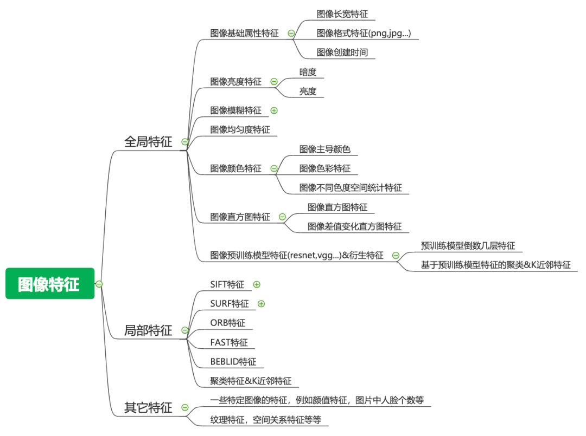

目录

- [图像数据不足时的处理方法](#图像数据不足时的处理方法)
  - [基于模型的方法](#基于模型的方法)
  - [基于数据的方法](#基于数据的方法)
- [图像特征提取](#图像特征提取)
- [全局特征](#全局特征)
  - [基础属性特征](#基础属性特征)
    - [图像的创建时间](#图像的创建时间)
    - [图像长宽特征](#图像长宽特征)
    - [图像格式特征](#图像格式特征)
  - [亮度特征](#亮度特征)
  - [模糊特征](#模糊特征)
  - [均匀度特征](#均匀度特征)
  - [颜色特征](#颜色特征)
    - [图像各通道的统计特征](#图像各通道的统计特征)
    - [色彩范围](#色彩范围)
    - [图像的主导颜色](#图像的主导颜色)
  - [直方图特征](#直方图特征)
- [局部特征](#局部特征)
  - [SIFT 特征](#sift-特征)
  - [SURF](#surf)
  - [FAST](#fast)
  - [BEBLID](#beblid)
  - [聚类特征和 K 近邻特征](#聚类特征和-k-近邻特征)
- [其他特征](#其他特征)
  - [一些特定图像特征](#一些特定图像特征)
  - [纹理特征](#纹理特征)
  - [空间关系特征](#空间关系特征)
  - [物体和形状](#物体和形状)
    - [边缘检测](#边缘检测)
    - [高级形状特征](#高级形状特征)
    - [降维](#降维)
- [图像上采样](#图像上采样)
- [图像处理](#图像处理)
  - [图像调整](#图像调整)
  - [图像噪音扰动](#图像噪音扰动)
  - [颜色转换](#颜色转换)
  - [改变图像亮度、清晰度、对比度、锐度](#改变图像亮度清晰度对比度锐度)
- [参考](#参考)

# 图像数据不足时的处理方法

一个模型所能提供的信息一般来源于两个方面，一是训练数据中蕴含的信息；
二是在模型的形成的过程中(包括构造、学习、推理等)，人们提供的先验信息 

当训练数据不足时，说明模型从原始数据中获取的信息比较少，这种情况下想要保证模型的效果，
就需要更多先验信息

* 先验信息可以作用在模型上，例如，让模型采用特定的内在结构、条件假设或添加其他一些约束条件
* 先验信息也可以直接施加在数据集上，即根据特定的先验假设去调整、变换或扩展训练数据，
  让其展示出更多的更有用的信息，以利于后续模型的训练和学习

对于图像分类任务处理方法，有两种方法可以处理

## 基于模型的方法

基于模型的方法，主要是采用降低过拟合风险的措施

* 简化模型
    - 如: 将非线性模型简化为线性模型
* 添加约束项以缩小假设空间，如: L1/L2 正则项
* 集成学习
* Dropout 超参数

## 基于数据的方法

基于数据的方法，主要是通过数据扩充(data augmentation)，即根据一些先验知识，
在保证特定信息的前提下，对原始数据进行适当变换以达到扩充数据集的效果

1. 一定程度内的随机旋转、平移、缩放、裁剪、填充、左右翻转等，这些变换对应着同一个目标在不同角度的观察结果
2. 对图像中的像素添加噪音扰动，比如椒盐噪声、高斯噪声等
3. 颜色变换，比如: 在图像的 RGB 颜色空间上进行主成分分析，
   得到3个主成分的特征向量 `$p_{1}，p_{2}，p_{3}$` 及其对应的特征值 `$\lambda_{1}，\lambda_{2}，\lambda_{3}$`，
   然后在每个像素的 RGB 值上添加增量 `$[p_{1}，p_{2}，p_{3}]\cdot [\alpha_{1}\lambda_{1}，\alpha_{2}\lambda_{2}，\alpha_{3}\lambda_{3}]^{T}$`，
   其中 `$\alpha_{1}，\alpha_{2}，\alpha_{3}$` 是均值为 0、方差较小的高斯分布随机数
4. 改变图像的亮度、清晰度、对比度、锐度等
5. 对图像进行 **特征提取**，然后在图像的特征空间内进行转换，利用一些通用的数据扩充或上采样技术，
   例如: SMOTE(Synthetic Minority Over-sampling Technique) 算法
6. 利用 **生成模型** 生成新样本，例如: 生成式对抗网络(GNN)
7. 借助已有的其他模型或数据来进行 **迁移学习**，例如: 对于大部分图像分类任务，并不需要从头开始训练模型，
   而是借用一个在大规模数据集上预训练好的通用模型，并在针对目标任务的小数据集上进行微调(fine-tune)，
   这种微调操作就可以看成是一种简单的迁移学习

# 图像特征提取

图像特征是梯度提升树模型非常难以挖掘的一类数据，目前图像相关的问题，
例如图像分类，图像分割等等几乎都是以神经网络为主的模型，但是在一些多模态的问题中，
例如商品搜索推荐的问题中，里面既包含图像信息又含有文本信息等，
这个时候基于梯度提升树模型的建模方案还是至关重要的，这个时候为了更好地使用所有的数据信息，
需要对图像特征进行多方位的提取

# 全局特征

## 基础属性特征

> 元数据特征

|特征                     |定义                              |
|------------------------|----------------------------------|
| 制造商(manufacturer)    | 相机制造商                         |
| 方向(orientation)       | 照相机的方向（横向或纵向）           |
| 日期-时间(date-time)     | 拍摄时间（可用日期时间的相关提取方式） |
| 压缩方式(compression)    | 图像的压缩方式(JPEG 或未压缩)        |
| 解析度(resolution)       | 在宽高空间中像素的数量              |
| 长宽比(aspect ratio)     | 通过划分高度和宽度分辨率表示的度量    |
| 曝光时间(exposure time)  | 曝光秒数                          |
| 光圈(aperture)           | 表示光圈的 f 值(如 2.8 或 4.0)     |
| 闪光灯(flash light)       | 闪光灯是否打开                     |
| 焦距(focal length)       | 镜头到焦点的距离                   |

### 图像的创建时间

### 图像长宽特征

### 图像格式特征

## 亮度特征

## 模糊特征

## 均匀度特征

## 颜色特征

### 图像各通道的统计特征

计算每种颜色通道中简单的统计值，如平均值、中值、色调、标准差、偏度和峰度。
对于 RGB 就有 `$6 \times 3 = 18$` 个特征

| 颜色 | 平均值 | 中值 | 色调 | 标准差 | 偏度 | 峰度 |
|-----|-------|------|-----|-------|-----|-----|
| R   |       |      |     |       |     |     |
| G   |       |      |     |       |     |     |
| B   |       |      |     |       |     |     |

### 色彩范围

| 颜色范围	                    | 定义                                                 |
|------------------------------|-----------------------------------------------------|
| 红色范围(red range)	        | 红色通道中最大值减去最小值的差值                          |
| 红蓝范围(red-to-blue range)   | 红色范围 / (蓝色通道中最大值减去最小值 + 1)                   |
| 蓝绿范围(blue-to-green range) | (蓝色通道中最大值减去最小值) / (绿色通道中最大值减去最小值 + 1)  |
| 红绿范围(red-to-green range)  | 红色范围 / (绿色通道中最大值减去最小值 + 1)                   |

### 图像的主导颜色

## 直方图特征

# 局部特征

## SIFT 特征

## SURF

## FAST

## BEBLID 

## 聚类特征和 K 近邻特征

# 其他特征

## 一些特定图像特征

* 颜值特征
* 图片中人脸个数

## 纹理特征

## 空间关系特征

## 物体和形状

### 边缘检测

常用 Sobel 和 Ganny 边缘检测算法，可使用 `scikit-image` 库来完成

提取到边缘之后，最简单的特征是计算边缘数目（也可计算局部边缘数目），计算公式：

`$$edge\_score = \frac{\sum edges}{res_{x} \times res_{y}}$$`

其中:

* edges 是边缘图像
* res 是图像的解析度

### 高级形状特征

方向梯度直方图(HOG)，常同来检测图片中的人脸和特定动物可以直接使用 `skimgae.feature.hog`。
当图像中的物体方向变化太大时，HOG 工作得不好

### 降维

主成分分析(PCA)，新图片的特征由与主成分图像的“距离”产生，可以用与每个主成分图像相关的数字表示。
为了使问题更有意义，可以使用尽可能多的主要成分

PCA 是线性算法，不能表示本质上是非线性的数据。由很多 PCA 的拓展和其他非线性的降维方式，
如扩散映射(diffusion maps)

# 图像上采样

# 图像处理

## 图像调整

## 图像噪音扰动

## 颜色转换

## 改变图像亮度、清晰度、对比度、锐度

# 参考

* [特征工程--图像特征上篇](https://mp.weixin.qq.com/s?__biz=Mzk0NDE5Nzg1Ng==&mid=2247494894&idx=2&sn=d268c10eea333da6ff48007140b14d16&chksm=c32af561f45d7c7729a4b92744b0d87f312539cf5a65c03d7fa9fe597145ce9eae7e45f8216a&scene=21#wechat_redirect)
* [特征工程--图像特征中篇](https://mp.weixin.qq.com/s?__biz=Mzk0NDE5Nzg1Ng==&mid=2247495021&idx=1&sn=21af676dc9bd1de7b203971b35f4b524&chksm=c32af4e2f45d7df4bf28d97121fb06662f112c873e80109d6072eb361f2f6f7866866fbb7bc2&scene=21#wechat_redirect)
* [特征工程--图像特征下篇](https://mp.weixin.qq.com/s/SARm2GlHZHYKAFFRr9buXw)
* [图像数据的特征工程](https://mp.weixin.qq.com/s/TRSrPT501FinjsbcmC1d6A)

