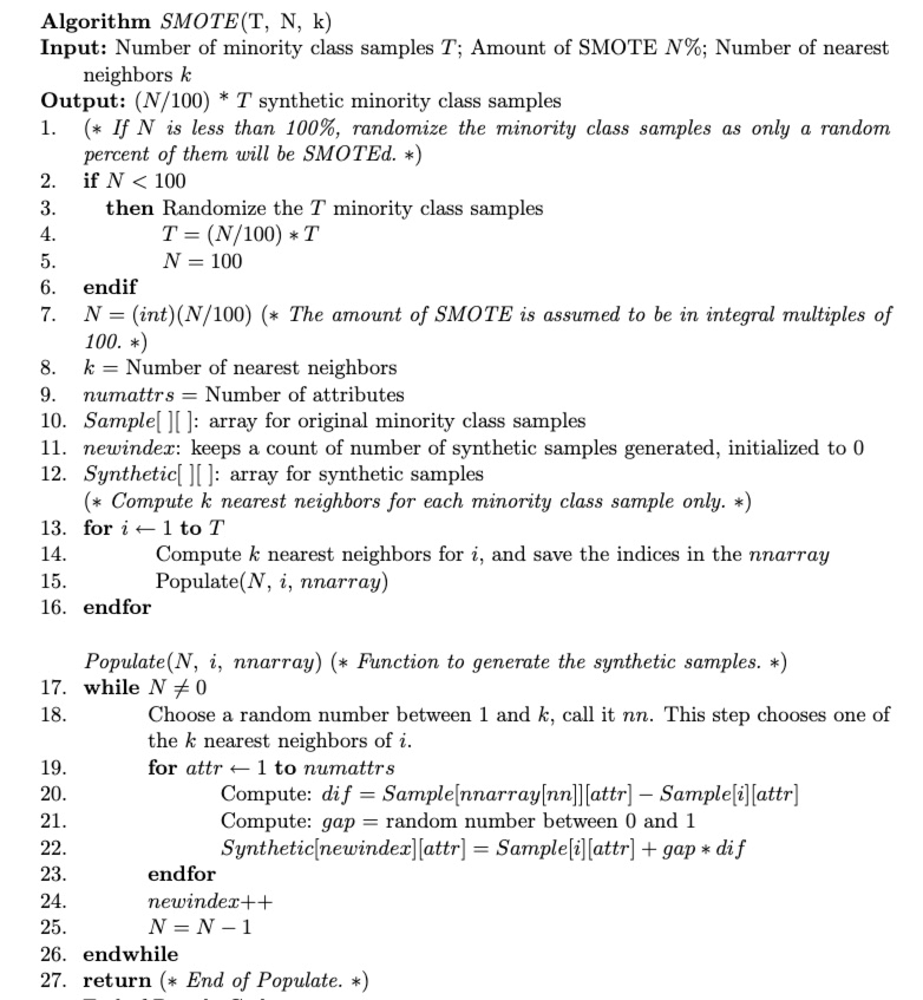

目录

- [过采样](#过采样)
- [欠采样](#欠采样)
- [SMOTE](#smote)
  - [SMOTE 算法简介](#smote-算法简介)
  - [SMOTE算法的缺陷](#smote算法的缺陷)
  - [针对 SMOTE 算法的进一步改进](#针对-smote-算法的进一步改进)
  - [参考文献](#参考文献)
- [API](#api)

如何处理不平衡数据？

# 过采样

# 欠采样

# SMOTE

## SMOTE 算法简介

SMOTE(Synthetic Minority Oversampling Technique), 合成少数类过采样技术．
它是基于随机过采样算法的一种改进方案, 由于随机过采样采取简单复制样本的策略来增加少数类样本, 
这样容易产生模型过拟合的问题, 即使得模型学习到的信息过于特别(Specific)而不够泛化(General), 

SMOTE 算法的基本思想是对少数类样本进行分析并根据少数类样本人工合成新样本添加到数据集中, 
具体如下图所示, 算法流程如下:

1. 对于少数类中每一个样本 :math:`$x_{i}$`, 以欧氏距离为标准计算它到少数类样本集中所有样本的距离, 
   得到其 :math:`$k$` 近邻
2. 根据样本不平衡比例设置一个采样比例以确定采样倍率 :math:`$N$`, :math:`$N=$`, 
   对于每一个少数类样本 :math:`$x_{i}$`, 从其 :math:`$k$` 近邻中随机选择若干个样本, 
   假设选择的近邻为 :math:`$x_{n}$`
3. 对于每一个随机选出的近邻 :math:`$\hat{x}_{i}$` , 分别与原样本按照如下的公式构建新的样本:

`$$x_{new} = x_{i} + rand(0, 1) \times (\hat{x}_{i} - x_{i})$$`

SMOTE 算法的伪代码如下:

## SMOTE算法的缺陷

- 一是在近邻选择时, 存在一定的盲目性. 从上面的算法流程可以看出, 在算法执行过程中, 需要确定 :math:`k` 值,
    即选择多少个近邻样本, 这需要用户自行解决. 从 :math:`k` 值的定义可以看出, 
    :math:`k` 值的下限是 :math:`M` 值(:math:`M` 值为从 :math:`k` 个近邻中随机挑选出的近邻样本的个数, 且有 :math:`M < k`), 
    :math:`M` 的大小可以根据负类样本数量、正类样本数量和数据集最后需要达到的平衡率决定. 但 :math:`k` 值的上限没有办法确定,
    只能根据具体的数据集去反复测试. 因此如何确定 :math:`k` 值,才能使算法达到最优这是未知的
- 另外, 该算法无法克服非平衡数据集的数据分布问题, 容易产生分布边缘化问题. 由于负类样本的分布决定了其可选择的近邻, 
    如果一个负类样本处在负类样本集的分布边缘, 则由此负类样本和相邻样本产生的"人造”样本也会处在这个边缘,且会越来越边缘化, 
    从而模糊了正类样本和负类样本的边界, 而且使边界变得越来越模糊. 这种边界模糊性,虽然使数据集的平衡性得到了改善,
    但加大了分类算法进行分类的难度

## 针对 SMOTE 算法的进一步改进

针对 SMOTE 算法存在的边缘化和盲目性等问题, 很多人纷纷提出了新的改进办法, 
在一定程度上改进了算法的性能, 但还存在许多需要解决的问题. 

Han 等人在 SMOTE 算法基础上进行了改进, 
提出了 Borderhne-SMOTE(Borderline-SMOTE: A New Over-Sampling Method in Imbalanced Data Sets Learning) 算法, 
解决了生成样本重叠(Overlapping)的问题, 该算法在运行的过程中查找一个适当的区域,该区域可以较好地反应数据集的性质, 
然后在该区域内进行插值, 以使新增加的"人造”样本更有效. 这个适当的区域一般由经验给定, 因此算法在执行的过程中有一定的局限性

## 参考文献

* [SMOTE](https://www.jair.org/index.php/jair/article/view/10302/24590)
* [Borderhne-SMOTE](https://sci2s.ugr.es/keel/keel-dataset/pdfs/2005-Han-LNCS.pdf)

# API

- imblearn.under_sampling
    - Prototype generation
        - imblearn.under_sampling.ClusterCentroids
    - Prototype selection
        - under_sampling.CondensedNearestNeighbour()
        - under_sampling.EditedNearestNeighbours()
        - under_sampling.RepeatedEditedNearestNeighbours()
        - under_sampling.AllKNN()
        - under_sampling.InstanceHardnessThreshold()
        - under_sampling.NearMiss()
        - under_sampling.NeighbourhoodCleaningRule()
        - under_sampling.OneSidedSelection()
        - under_sampling.RandomUnderSampler()
        - under_sampling.TomekLinks()
- imblearn.over_sampling
    - imblearn.over_sampling.ADASYN
    - imblearn.over_sampling.BorderlineSMOTE
    - imblearn.over_sampling.KMeansSMOTE
    - imblearn.over_sampling.RandomOverSampler
    - imblearn.over_sampling.SMOTE
    - imblearn.over_sampling.SMOTENC
    - imblearn.over_sampling.SVMSMOTE
- imblearn.combine
    - imblearn.combine.SMOTEENN
    - imblearn.combine.SMOTETomek
- imblearn.ensemble
- imblearn.keras
- imblearn.tensorflow
- imblearn.pipeline
- imblearn.metrics
- imblearn.datasets
- imblearn.utils
