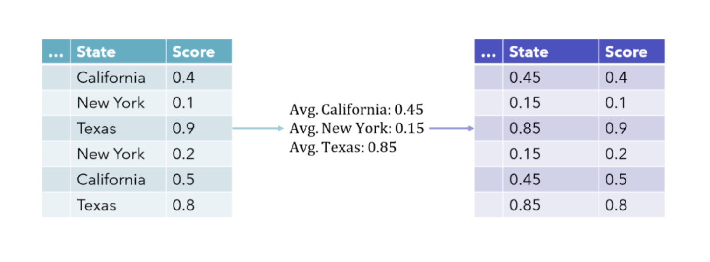

<style>
details {
    border: 1px solid #aaa;
    border-radius: 4px;
    padding: .5em .5em 0;
}
summary {
    font-weight: bold;
    margin: -.5em -.5em 0;
    padding: .5em;
}
details[open] {
    padding: .5em;
}
details[open] summary {
    border-bottom: 1px solid #aaa;
    margin-bottom: .5em;
}
</style>

<details><summary>目录</summary><p>

- [类别特征编码](#类别特征编码)
  - [序号编码(Ordinal Encoding)](#序号编码ordinal-encoding)
  - [独热编码(One-Hot Encoding)](#独热编码one-hot-encoding)
  - [二进制编码(Binary Encoding)](#二进制编码binary-encoding)
  - [虚拟编码](#虚拟编码)
  - [效果编码](#效果编码)
  - [特征散列化](#特征散列化)
  - [Helmert Contrast](#helmert-contrast)
  - [Sum Contrast](#sum-contrast)
  - [Polynomial Contrast](#polynomial-contrast)
  - [Backward Difference Contrast](#backward-difference-contrast)
  - [Target Encoding(目标编码)](#target-encoding目标编码)
  - [Leave-one-out Encoding(留一法编码)](#leave-one-out-encoding留一法编码)
  - [Bayesian Target Encoding(贝叶斯目标编码)](#bayesian-target-encoding贝叶斯目标编码)
  - [Weight of Evidence(WoE)(证据权重)](#weight-of-evidencewoe证据权重)
  - [Nonlinear PCA(非线性 PCA)](#nonlinear-pca非线性-pca)
- [分箱计数](#分箱计数)
- [特征组合](#特征组合)
- [频度统计特征](#频度统计特征)
  - [参考](#参考)
</p></details><p></p>

# 类别特征编码

- 类别性特征原始输入通常是字符串形式, 除了基于决策树模型的少数模型能够直接处理字符串形式的输入, 
  其他模型需要将类别型特征转换为数值型特征
- 类别型特征可以分为两种
    - 无序类别特征
    - 有序类别特征

## 序号编码(Ordinal Encoding)

- 序号编码通常用于处理类别间具有大小关系的特征, 序号编码会按照大小关系对类别型特征赋予一个数值 ID

## 独热编码(One-Hot Encoding)

One-Hot Encoding 是一种被广泛使用的编码方法, 但也会造成维度过高等问题. 
One-Hot Encoding 类似于虚拟变量(dummy variables), 
是一种将分类变量转换为几个二进制列的方法. 其中 1 代表某个输入属于该类别. 

从机器学习的角度来看, one-hot 编码并不是一种良好的分类变量编码方法. 
众所周知, 维数越少越好, 但 one-hot 编码却增加了大量的维度. 
例如, 如果用一个序列来表示美国的各个州, 那么 one-hot 编码会带来 50 多个维度. 

One-Hot Encoding 不仅会为数据集增加大量维度, 而且实际上并没有太多信息, 
很多时候 1 散落在众多零之中, 即有用的信息零散地分布在大量数据中. 
这会导致结果异常稀疏, 使其难以进行优化, 对于神经网络来说尤其如此. 

更糟糕的是, 每个信息稀疏列之间都具有线性关系. 这意味着一个变量可以很容易地使用其他变量进行预测, 
导致高维度中出现并行性和多重共线性的问题. 

最优数据集由信息具有独立价值的特征组成, 但 one-hot 编码创建了一个完全不同的环境. 

当然, 如果只有三、四个类, 那么 one-hot 编码可能不是一个糟糕的选择. 
但是随着类别的增加, 可能还有其他更合适的方案值得探索. 本文作者列举了几个方案供读者参考. 


- One-Hot Encoding 通常用于处理类别间不具有大小关系的特征
- One-Hot Encoding 使用一组比特位, 每个比特位表示一种可能的类别, 
  如果特征不能同时属于多个类别, 那么这组值中就只有一个比特位是"开”的
- One-Hot Encoding 的问题是它允许有 k 个自由度, 二特征本身只需要 k-1 个自由度
- One-Hot Encoding 编码有冗余, 这会使得同一个问题有多个有效模型, 这种非唯一性有时候比较难以理解
- One-Hot Encoding 的优点是每个特征都对应一个类别, 
  而且可以把缺失数据编码为全零向量, 模型输出也是目标变量的总体均值
- 对于类别取值较多的特征的情况下使用 One-Hot Encoding 需要注意: 
    - 使用稀疏向量节省空间
    - 配合特征选择降低维度
        - 高纬度特征的问题: 
        - 高纬度空间下, 两点之间的距离很难得到有效的衡量
        - 模型参数的数量增多, 模型变得复杂, 容易出现过拟合
        - 只有部分维度对预测有帮助

## 二进制编码(Binary Encoding)

- 二进制编码主要分为两步, 先用序号编码给每个类别赋予一个类别ID, 
  然后将类别ID对应的二进制编码作为结果. 
- 二进制编码本质上是利用二进制对ID进行哈希映射, 最终得到 0/1 特征向量, 
  且维数少于 One-Hot Encoding, 节省了存储空间

## 虚拟编码

- 虚拟编码在进行表示时只使用 k-1 个自由度, 除去了额外的自由度, 
  没有被使用的那个特征通过一个全零向量表示, 它称为参照类
- 使用虚拟编码的模型结果比使用 One-Hot Encoding 的模型结果更具解释性
- 虚拟编码的缺点是不太容易处理缺失数据, 因为全零向量已经映射为参照类了

## 效果编码

- 效果编码与虚拟编码非常相似, 区别在于参照类是用全部由 -1 组成的向量表示的
- 效果编码的优点是全由-1组成的向量是个密集向量, 计算和存储的成本都比较高

## 特征散列化

- 散列函数是一种确定性函数, 他可以将一个可能无界的整数映射到一个有限的整数范围 `$\[1, m\]$` 中, 
  因为输入域可能大于输出范围, 所以可能有多个值被映射为同样的输出, 这称为碰撞
- 均匀散列函数可以确保将大致相同数量的数值映射到 m 个分箱中
- 如果模型中涉及特征向量和系数的内积运算, 那么就可以使用特征散列化
- 特征散列化的一个缺点是散列后的特征失去了可解释性, 只是初始特征的某种聚合

## Helmert Contrast


## Sum Contrast


## Polynomial Contrast


## Backward Difference Contrast


## Target Encoding(目标编码)

目标编码(Target encoding)是表示分类列的一种非常有效的方法, 并且仅占用一个特征空间, 也称为均值编码. 
该列中的每个值都被该类别的平均目标值替代. 这可以更直接地表示分类变量和目标变量之间的关系, 
并且也是一种很受欢迎的技术方法(尤其是在 Kaggle 比赛中). 



但这种编码方法也有一些缺点. 

- 首先, 它使模型更难学习均值编码变量和另一个变量之间的关系, 仅基于列与目标的关系就在列中绘制相似性
- 而最主要的是, 这种编码方法对 y 变量非常敏感, 这会影响模型提取编码信息的能力

由于该类别的每个值都被相同的数值替换, 因此模型可能会过拟合其见过的编码值(例如将 0.8 与完全不同的值相关联, 而不是 0.79), 
这是把连续尺度上的值视为严重重复的类的结果. 因此, 需要仔细监控 y 变量, 以防出现异常值. 要实现这个目的, 
就要使用 `category_encoders` 库. 由于目标编码器是一种有监督方法, 所以它同时需要 X 和 y 训练集. 

## Leave-one-out Encoding(留一法编码)

留一法(Leave-one-out)编码试图通过计算平均值(不包括当前行值)来弥补对 y 变量的依赖以及值的多样性. 
这使异常值的影响趋于平稳, 并创建更多样化的编码值. 


由于模型不仅要面对每个编码类的相同值, 还要面对一个范围值, 因此它可以更好地泛化. 
在实现方面, 可以使用 category_encoders 库中的 LeaveOneOutEncoder. 
实现类似效果的另一种策略是将正态分布的噪声添加到编码分数中, 其中标准差是可以调整的参数. 

## Bayesian Target Encoding(贝叶斯目标编码)

贝叶斯目标编码(Bayesian Target Encoding)是一种使用目标作为编码方法的数学方法. 
仅使用均值可能是一种欺骗性度量标准, 因此贝叶斯目标编码试图结合目标变量分布的其他统计度量. 
例如其方差或偏度(称为高阶矩「higher moments」). 然后通过贝叶斯模型合并这些分布的属性, 
从而产生一种编码, 该编码更清楚类别目标分布的各个方面, 但是结果的可解释性比较差. 

## Weight of Evidence(WoE)(证据权重)

证据权重(Weight of Evidence, 简称 WoE)是另一种关于分类自变量和因变量之间关系的方案. 
WoE 源自信用评分领域, 曾用于区分用户是违约拖欠还是已经偿还贷款. 
证据权重的数学定义是优势比的自然对数, 即: 

`$ln (% of non events / % of events)$`

WoE 越高, 事件发生的可能性就越大. 「Non-events」是不属于某个类的百分比.
使用证据权重与因变量建立单调关系, 并在逻辑尺度上确保类别, 这对于逻辑回归来说很自然. 
WoE 是另一个衡量指标「Information Value」的关键组成部分. 
该指标用来衡量特征如何为预测提供信息. 

这些方法都是有监督编码器, 或者是考虑目标变量的编码方法, 
因此在预测任务中通常是更有效的编码器. 
但是, 当需要执行无监督分析时, 这些方法并不一定适用. 

## Nonlinear PCA(非线性 PCA)

非线性 PCA(Nonlinear PCA)是一种使用分类量化来处理分类变量的主成分分析(PCA)方法. 
它会找到对类别来说的最佳数值, 从而使常规 PCA 的性能(可解释方差)最大化. 

# 分箱计数

# 特征组合

- 为了提高复杂关系的拟合能力, 在特征工程中经常把一阶离散特征凉凉组合, 构成高阶组合特征
- 并不是所有的特征组合都有意义, 可以使用基于决策树的特征组合方法寻找组合特征, 
  决策树中每一条从根节点到叶节点的路径都可以看成是一种特征组合的方式

# 频度统计特征

* 频度统计对于低频具有归一化作用，能够使类别特征中低频的特征数据的共性被挖掘出来
* 频度统计在不同场景有不同的含义
* 交叉特征

```python
import pandas as pd

# data
df = pd.DataFrame({
    '区域' : ['西安', '太原', '西安', '太原', '郑州', '太原'], 
    '10月份销售' : ['0.477468', '0.195046', '0.015964', '0.259654', '0.856412', '0.259644'],
    '9月份销售' : ['0.347705', '0.151220', '0.895599', '0236547', '0.569841', '0.254784']
})

# 统计
df_counts = df['区域'].value_counts().reset_index()
df_counts.columns = ['区域', '区域频度统计']
print(df_count)
```

```
   区域  区域频度统计
0  太原       3
1  西安       2
2  郑州       1
```

```python
df = df.merge(df_counts, on = ['区域'], how = 'left')
print(df)
```

```
   区域    10月份销售     9月份销售  区域频度统计
0  西安  0.477468  0.347705       2
1  太原  0.195046  0.151220       3
2  西安  0.015964  0.895599       2
3  太原  0.259654   0236547       3
4  郑州  0.856412  0.569841       1
5  太原  0.259644  0.254784       3
```

## 参考

* https://mp.weixin.qq.com/s/yQoaia_jJQsIdBGIe78PQw 

