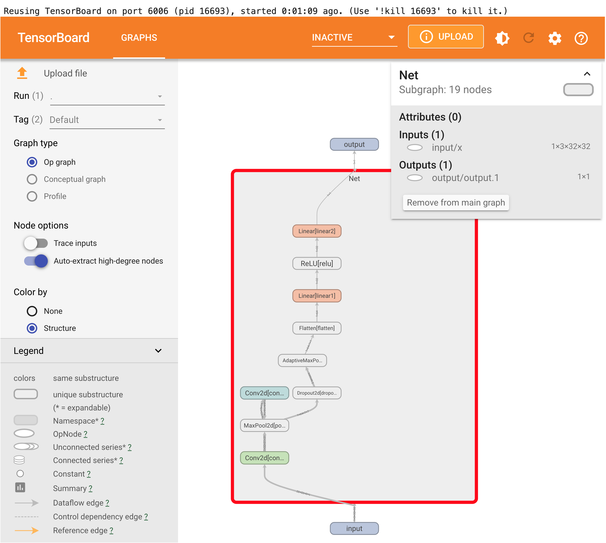
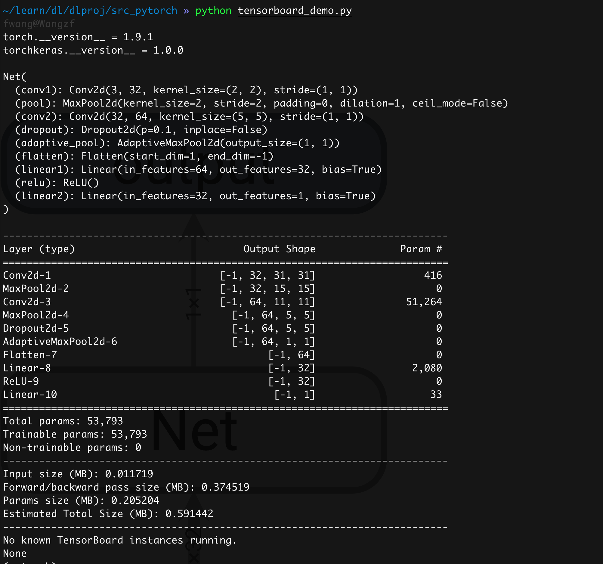
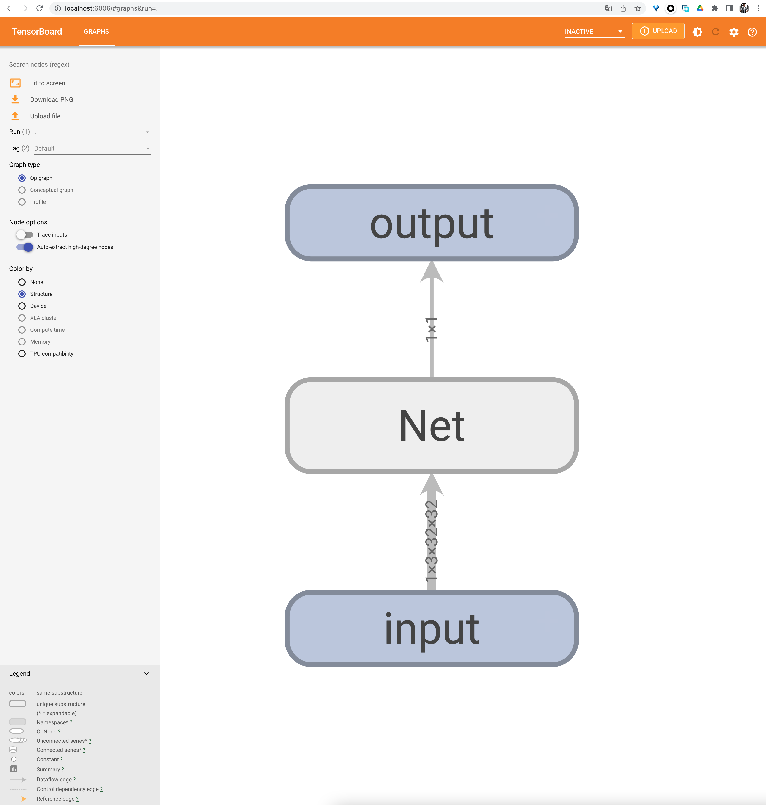

<style>
details {
    border: 1px solid #aaa;
    border-radius: 4px;
    padding: .5em .5em 0;
}
summary {
    font-weight: bold;
    margin: -.5em -.5em 0;
    padding: .5em;
}
details[open] {
    padding: .5em;
}
details[open] summary {
    border-bottom: 1px solid #aaa;
    margin-bottom: .5em;
}
</style>

<details><summary>目录</summary><p>

- [可视化模结构](#可视化模结构)
  - [模型结构](#模型结构)
  - [创建日志写入器](#创建日志写入器)
  - [利用日志写入器将相应信息日志写入指定的目录](#利用日志写入器将相应信息日志写入指定的目录)
  - [传入日志目录参数启动 TensorBoard](#传入日志目录参数启动-tensorboard)
    - [Jupyte notebook/lab](#jupyte-notebooklab)
    - [命令行](#命令行)
- [可视化指标变化](#可视化指标变化)
  - [模型结构](#模型结构-1)
  - [创建日志写入器](#创建日志写入器-1)
  - [利用日志写入器将相应信息日志写入指定的目录](#利用日志写入器将相应信息日志写入指定的目录-1)
  - [传入日志目录参数启动 TensorBoard](#传入日志目录参数启动-tensorboard-1)
- [可视化参数分布](#可视化参数分布)
  - [模型结构](#模型结构-2)
  - [创建日志写入器](#创建日志写入器-2)
  - [利用日志写入器将相应信息日志写入指定的目录](#利用日志写入器将相应信息日志写入指定的目录-2)
  - [传入日志目录参数启动 TensorBoard](#传入日志目录参数启动-tensorboard-2)
- [可视化原始图像](#可视化原始图像)
- [图像数据](#图像数据)
  - [仅查看一张图片](#仅查看一张图片)
  - [将多张图片拼接成一张图片](#将多张图片拼接成一张图片)
  - [将多张图片直接写入](#将多张图片直接写入)
  - [传入日志目录参数启动 TensorBoard](#传入日志目录参数启动-tensorboard-3)
- [可视化人工绘图](#可视化人工绘图)
  - [图像数据](#图像数据-1)
  - [Matplotlib 绘图](#matplotlib-绘图)
  - [利用日志写入器将相应信息日志写入指定的目录](#利用日志写入器将相应信息日志写入指定的目录-3)
  - [传入日志目录参数启动 TensorBoard](#传入日志目录参数启动-tensorboard-4)
- [torchkeras 中的 TensorBoard 回调函数](#torchkeras-中的-tensorboard-回调函数)
  - [准备数据](#准备数据)
  - [定义模型](#定义模型)
  - [模型训练](#模型训练)
  - [TensorBoard 可视化监控](#tensorboard-可视化监控)
</p></details><p></p>

在深度学习建模的过程中，如果能够使用丰富的图像来展示模型的结构，
指标的变化，参数的分布，输入的形态等信信息，会提升对问题的洞察力

PyTorch 中利用 TensorBoard 可视化的大概过程如下:

1. 首先，在 PyTorch 中指定一个目录创建一个 `torch.utils.tensorboard.SummaryWriter` 日志写入器
2. 然后，根据需要可视化的信息，利用日志写入器将相应信息日志写入指定的目录
3. 最后，就可以传入日志目录作为参数启动 TensorBoard，然后就可以在 TensorBoard 中看到相应的可视化信息

PyTorch 中利用 TensorBoard 进行信息可视化的方法如下:

* 可视化模型结构: `writer.add_graph`
* 可视化指标变化: `writer.add_scalar`
* 可视化参数分布: `writer.add_histogram`
* 可视化原始图像: `writer.add_image` 或 `writer.add_images`
* 可视化人工绘图: `writer.add_figure`

这些方法尽管非常简单，但每次训练的时候都要调取、调试，还是非常麻烦，
在 `torchkeras` 中集成了 `torchkeras.callback.TensorBoard` 回调函数工具。
利用该工具配合 `torchkeras.LightModel` 可以用极少的代码在 TensorBoard 中实现大部分常用的可视化功能。
包括:

* 可视化模型结构
* 可视化指标变化
* 可视化参数分布
* 可视化参数分布

# 可视化模结构

## 模型结构

```python
import torch
from torch import nn
from torchkeras import summary
print(f"torch.__version__ = {torch.__version__}")
print(f"torchkeras.__version__ = {torchkeras.__version__}\n")

class Net(nn.Module):

    def __init__(self):
        super(Net, self).__init__()
        self.conv1 = nn.Conv2d(in_channels = 3, out_channels = 32, kernel_size = 2)
        self.pool = nn.MaxPool2d(kernel_size = 2, stride = 2)
        self.conv2 = nn.Conv2d(in_channels = 32, out_channels = 64, kernel_size =2)
        self.dropout = nn.Dropout2d(p = 0.1)
        self.adaptive_pool = nn.AdaptiveMaxPool2d((1, 1))
        self.flatten = nn.Flatten()
        self.linear1 = nn.Linear(64, 32)
        self.relu = nn.ReLU()
        self.linear2 = nn.Linear(32, 1)
    
    def forward(self, x):
        x = self.conv1(x)
        x = self.pool(x)
        x = self.conv2(x)
        x = self.pool(x)
        x = self.dropout(x)
        x = self.adaptive_pool(x)
        x = self.flatten(x)
        x = self.linear1(x)
        x = self.relu(x)
        y = self.linear2(x)
        return y

net = Net()
print(net)
summary(net, input_shape = (3, 32, 32))
```

## 创建日志写入器

```python
from torch.utils.tensorboard import SummaryWriter

writer = SummaryWriter("./data/tensorboard")
```

## 利用日志写入器将相应信息日志写入指定的目录

```python
writer.add_graph(net, input_to_model = torch.rand(1, 3, 32, 32))
writer.close()
```

## 传入日志目录参数启动 TensorBoard

### Jupyte notebook/lab

完整示例代码:

```python
import torch
from torch import nn
from torch.utils.tensorboard import SummaryWriter

import torchkeras
from torchkeras import summary

print(f"torch.__version__ = {torch.__version__}")
print(f"torchkeras.__version__ = {torchkeras.__version__}\n")


class Net(nn.Module):

    def __init__(self):
        super(Net, self).__init__()
        self.conv1 = nn.Conv2d(in_channels = 3, out_channels = 32, kernel_size = 2)
        self.pool = nn.MaxPool2d(kernel_size = 2, stride = 2)
        self.conv2 = nn.Conv2d(in_channels = 32, out_channels = 64, kernel_size =2)
        self.dropout = nn.Dropout2d(p = 0.1)
        self.adaptive_pool = nn.AdaptiveMaxPool2d((1, 1))
        self.flatten = nn.Flatten()
        self.linear1 = nn.Linear(64, 32)
        self.relu = nn.ReLU()
        self.linear2 = nn.Linear(32, 1)
    
    def forward(self, x):
        x = self.conv1(x)
        x = self.pool(x)
        x = self.conv2(x)
        x = self.pool(x)
        x = self.dropout(x)
        x = self.adaptive_pool(x)
        x = self.flatten(x)
        x = self.linear1(x)
        x = self.relu(x)
        y = self.linear2(x)
        return y

# 模型查看
net = Net()
print(net, "\n")
print(summary(net, input_shape = (3, 32, 32)))
```

```
torch.__version__ = 1.9.1
torchkeras.__version__ = 1.0.0

Net(
  (conv1): Conv2d(3, 32, kernel_size=(2, 2), stride=(1, 1))
  (pool): MaxPool2d(kernel_size=2, stride=2, padding=0, dilation=1, ceil_mode=False)
  (conv2): Conv2d(32, 64, kernel_size=(2, 2), stride=(1, 1))
  (dropout): Dropout2d(p=0.1, inplace=False)
  (adaptive_pool): AdaptiveMaxPool2d(output_size=(1, 1))
  (flatten): Flatten(start_dim=1, end_dim=-1)
  (linear1): Linear(in_features=64, out_features=32, bias=True)
  (relu): ReLU()
  (linear2): Linear(in_features=32, out_features=1, bias=True)
) 

--------------------------------------------------------------------------
Layer (type)                            Output Shape              Param #
==========================================================================
Conv2d-1                            [-1, 32, 31, 31]                  416
MaxPool2d-2                         [-1, 32, 15, 15]                    0
Conv2d-3                            [-1, 64, 14, 14]                8,256
MaxPool2d-4                           [-1, 64, 7, 7]                    0
Dropout2d-5                           [-1, 64, 7, 7]                    0
AdaptiveMaxPool2d-6                   [-1, 64, 1, 1]                    0
Flatten-7                                   [-1, 64]                    0
Linear-8                                    [-1, 32]                2,080
ReLU-9                                      [-1, 32]                    0
Linear-10                                    [-1, 1]                   33
==========================================================================
Total params: 10,785
Trainable params: 10,785
Non-trainable params: 0
--------------------------------------------------------------------------
Input size (MB): 0.011719
Forward/backward pass size (MB): 0.434578
Params size (MB): 0.041142
Estimated Total Size (MB): 0.487438
--------------------------------------------------------------------------
```

查看启动的 TensorBoard 程序:

```python
from tensorboard import notebook

notebook.list()
```

```
No known TensorBoard instances running.
```

启动 Tensorboard 程序:

* 等价于在命令行中执行 `tensorboard --logdir ./data/tensorboard`
* 等价于在 Jupyter 中执行 
    - `%load_ext tensorboard`
    - `%tensorboard --logdir ./data/tensorboard`

```python
%load_ext tensorboard

from tensorboard import notebook

notebook.start("--logdir ./data/tensorboard")
# or 
# %tensorboard --logdir ./data/tensorboard
```



查看启动的 TensorBoard 程序:

```python
from tensorboard import notebook

notebook.list()
```

```
Known TensorBoard instances:
  - port 6006: logdir ./data/tensorboard (started 0:00:39 ago; pid 219)
```

### 命令行

完整示例代码:

```python
import torch
from torch import nn
from torch.utils.tensorboard import SummaryWriter

import torchkeras
from torchkeras import summary

print(f"torch.__version__ = {torch.__version__}")
print(f"torchkeras.__version__ = {torchkeras.__version__}\n")


class Net(nn.Module):

    def __init__(self):
        super(Net, self).__init__()
        self.conv1 = nn.Conv2d(in_channels = 3, out_channels = 32, kernel_size = 2)
        self.pool = nn.MaxPool2d(kernel_size = 2, stride = 2)
        self.conv2 = nn.Conv2d(in_channels = 32, out_channels = 64, kernel_size = 5)
        self.dropout = nn.Dropout2d(p = 0.1)
        self.adaptive_pool = nn.AdaptiveMaxPool2d((1, 1))
        self.flatten = nn.Flatten()
        self.linear1 = nn.Linear(64, 32)
        self.relu = nn.ReLU()
        self.linear2 = nn.Linear(32, 1)
    
    def forward(self, x):
        x = self.conv1(x)
        x = self.pool(x)
        x = self.conv2(x)
        x = self.pool(x)
        x = self.dropout(x)
        x = self.adaptive_pool(x)
        x = self.flatten(x)
        x = self.linear1(x)
        x = self.relu(x)
        y = self.linear2(x)
        return y


# 模型查看
net = Net()
print(net, "\n")
summary(net, input_shape = (3, 32, 32))

# tensorboard 模型查看
writer = SummaryWriter("./data/tensorboard")
writer.add_graph(net, input_to_model = torch.rand(1, 3, 32, 32))
writer.close()
```

运行示例代码:



启动 tensorboard 程序

```bash
$ tensorboard --logdir ./data/tensorboard
```


在浏览器中打开:

* http://localhost:6006/




# 可视化指标变化

在模型训练的过程中，实时动态地查看 loss 和各种 metric 的变化曲线，
可以帮助更加直观地了解模型的训练情况

`writer.add_scalar` 仅能对标量值的变化进行可视化，
因此它一般用于对 loss 和 metric 的变化进行可视化


## 模型结构

求 `$f(x) = a x^{2} + b x + c$` 的最小值

```python
import torch
import numpy as np

# 模型参数
x = torch.tensor(0.0, requires_grad = True)
a = torch.tensor(1.0)
b = torch.tensor(-2.0)
c = torch.tensor(1.0)

# 优化器
optimizer = torch.optim.SGD(params = [x], lr = 0.01)

# 模型
def f(x):
    result = a * torch.pow(x, 2) + b * x + c
    return (result)
```

## 创建日志写入器

```python
from torch.utils.tensorboard import SummaryWriter

writer = SummaryWriter("./data/tensorboard")
```

## 利用日志写入器将相应信息日志写入指定的目录

```python
for i in range(500):
    optimizer.zero_grad()
    # 前向传播
    y = f(x)
    # 反向传播
    y.backward()
    # 求梯度
    optimizer.step()
    # 写入日志
    writer.add_scalar("x", x.item(), i) # 日志中记录 x 在第 step i 的值
    writer.add_scalar("y", y.item(), i) # 日志中记录 y 在第 step i 的值

writer.close()

print(f"y = {f(x).data}; x = {x.data}")
```

```
y = 0.0; x = 0.9999589920043945
```

## 传入日志目录参数启动 TensorBoard

查看启动的 TensorBoard 程序:

```python
from tensorboard import notebook

notebook.list()
```

```
No known TensorBoard instances running.
```

启动 Tensorboard 程序:

* 等价于在命令行中执行 `tensorboard --logdir ./data/tensorboard`
* 等价于在 Jupyter 中执行 
    - `%load_ext tensorboard`
    - `%tensorboard --logdir ./data/tensorboard`

```python
%load_ext tensorboard

from tensorboard import notebook

notebook.start("--logdir ./data/tensorboard")
# or 
# %tensorboard --logdir ./data/tensorboard
```


# 可视化参数分布

如果需要对模型的参数(一般非标量)在训练过程中的变化进行可视化，可以使用 `writer.add_histogram`


## 模型结构

```python
import numpy as np
import torch

def norm(mean, std):
    """
    创建正态分布的张量模拟参数矩阵 
    """
    t = std * torch.randn((100, 20)) + mean
    return t
```

## 创建日志写入器

```python
from torch.utils.tensorboard import SummaryWriter

writer = SummaryWriter("./data/tensorboard")
```

## 利用日志写入器将相应信息日志写入指定的目录

```python
for step, mean in enumerate(range(-10, 10, 1)):
    w = norm(mean, 1)
    writer.add_histogram("w", w, step)
    writer.flush()
writer.close()
```

## 传入日志目录参数启动 TensorBoard

查看启动的 TensorBoard 程序:

```python
from tensorboard import notebook

notebook.list()
```

```
No known TensorBoard instances running.
```

启动 Tensorboard 程序:

* 等价于在命令行中执行 `tensorboard --logdir ./data/tensorboard`
* 等价于在 Jupyter 中执行 
    - `%load_ext tensorboard`
    - `%tensorboard --logdir ./data/tensorboard`

```python
%load_ext tensorboard

from tensorboard import notebook

notebook.start("--logdir ./data/tensorboard")
# or 
# %tensorboard --logdir ./data/tensorboard
```


# 可视化原始图像

在做图像相关的任务时，可以将原始图像的图片在 TensorBoard 中进行展示

* 如果只写入一张图片信息，可以使用 `writer.add_image`
* 如果要写入多张图片信息，可以使用 `writer.add_images`

也可以使用 `torch.utils.make_grid` 将多张图片拼成一张图片，然后用 `writer.add_image` 写入。
传入的是代表图片信息的 PyTorch 中的张量数据

# 图像数据

```python
import torch
from torch import nn
from torch.utils.data import Dataset, DataLoader
import torchvision
from torchvision import transforms
from torchvision import datasets


transform_img = transforms.Compose([
    T.ToTensor(),
])

def transform_label(x):
    return torch.tensor([x]).float()

ds_train = datasets.ImageFolder(
    "./data/cifar2/train/",
    transform = transform_img,
    target_transform = transform_label,
)
ds_val = datasets.ImageFolder(
    "./data/cifar2/test/",
    transform = transform_img,
    target_transform = transform_label,
)
print(ds_train.class_to_idx)

dl_train = DataLoader(
    ds_train, 
    batch_size = 50,
    shuffle = True,
)
dl_val = DataLoader(
    ds_val,
    batch_size = 50,
    shuffle = True,
)
images, labels = next(iter(dl_train))
```

## 仅查看一张图片

```python
writer = SummaryWriter("./data/tensorboard")
writer.add_image("images[0]", images[0])
writer.close()
```

## 将多张图片拼接成一张图片

中间用黑色网络分割

```python
writer = SummaryWriter("./data/tensorboard")

# 创建图像网格
img_grid = torchvision.utils.make_grid(images)

writer.add_image("image_grid", img_grid)
writer.close()
```

## 将多张图片直接写入

```python
writer = SummaryWriter("./data/tensorboard")
writer.add_images("images", images, global_step = 0)
writer.close()
```

## 传入日志目录参数启动 TensorBoard

查看启动的 TensorBoard 程序:

```python
from tensorboard import notebook

notebook.list()
```

```
No known TensorBoard instances running.
```

启动 Tensorboard 程序:

* 等价于在命令行中执行 `tensorboard --logdir ./data/tensorboard`
* 等价于在 Jupyter 中执行 
    - `%load_ext tensorboard`
    - `%tensorboard --logdir ./data/tensorboard`

```python
%load_ext tensorboard
from tensorboard import notebook
notebook.start("--logdir ./data/tensorboard")
# or 
# %tensorboard --logdir ./data/tensorboard
```


# 可视化人工绘图

如果将 matplotlib 绘图的结果在 TensorBoard 中展示，可以使用 `add_figure`。
和 `writer.add_image` 不同的是，`writer.add_figure` 需要传入 matplotlib 的 `figure` 对象

## 图像数据

```python
import torch
from torch import nn
from torch.utils.data import Dataset, DataLoader
import torchvision
from torchvision import transforms
from torchvision import datasets


transform_img = transforms.Compose([
    T.ToTensor(),
])

def transform_label(x):
    return torch.tensor([x]).float()

ds_train = datasets.ImageFolder(
    "./data/cifar2/train/",
    transform = transform_img,
    target_transform = transform_label,
)
ds_val = datasets.ImageFolder(
    "./data/cifar2/test/",
    transform = transform_img,
    target_transform = transform_label,
)
print(ds_train.class_to_idx)

dl_train = DataLoader(
    ds_train, 
    batch_size = 50,
    shuffle = True,
)
dl_val = DataLoader(
    ds_val,
    batch_size = 50,
    shuffle = True,
)
images, labels = next(iter(dl_train))
```

## Matplotlib 绘图

```python
%matplotlib inline
%config InlineBackend.figure_format = "svg"
import matplotlib.pyplot as plt


figure = plt.figure(figsize = (8, 8))
for i in range(9):
    img, label = ds_train[i]
    img = img.permute(1, 2, 0)
    ax = plt.subplot(3, 3, i + 1)
    ax.imshow(img.numpy())
    ax.set_title("label = %d" % label.item())
    ax.set_xticks([])
    ax.set_yticks([])
plt.show()
```

## 利用日志写入器将相应信息日志写入指定的目录

```python
writer = SummaryWriter("./data/tensorboard")
writer.add_figure("figure", figure, global_step = 0)
writer.close()
```

## 传入日志目录参数启动 TensorBoard

查看启动的 TensorBoard 程序:

```python
from tensorboard import notebook

notebook.list()
```

```
No known TensorBoard instances running.
```

启动 Tensorboard 程序:

* 等价于在命令行中执行 `tensorboard --logdir ./data/tensorboard`
* 等价于在 Jupyter 中执行 
    - `%load_ext tensorboard`
    - `%tensorboard --logdir ./data/tensorboard`

```python
%load_ext tensorboard
from tensorboard import notebook
notebook.start("--logdir ./data/tensorboard")
# or 
# %tensorboard --logdir ./data/tensorboard
```


# torchkeras 中的 TensorBoard 回调函数

在 torchkeras 中调用 TensorBoard 回调函数实现常用可视化功能

```python
import numpy as np
import pandas as pd
import matplotlib.pyplot as plt

import torch
from torch import nn
import torch.nn.functional as F
from torch.utils.data import Dataset, DataLoader, TensorDataset

import torchkeras
from torchkeras import summary
from torchkeras.metrics import Accuracy
import pytorch_lightning as pl
from torchkeras.callbacks import TensorBoard

from tensorboard import notebook

%matplotlib inline
%config InlineBackend.figure_format = "svg"
```

## 准备数据

```python
# ------------------------------
# 构造样本数据
# ------------------------------
# 样本数量
n_positive, n_negative = 2000, 2000
# 正样本
r_p = 5.0 + torch.normal(0.0, 1.0, size = [n_positive, 1])
theta_p = 2 * np.pi * torch.rand([n_positive, 1])
Xp = torch.cat([
    r_p * torch.cos(theta_p), 
    r_p * torch.sin(theta_p)
], axis = 1)
Yp = torch.ones_like(r_p)
# 负样本
r_n = 8.0 + torch.normal(0.0, 1.0, size = [n_negative, 1])
theta_n = 2 * np.pi * torch.rand([n_negative, 1])
Xn = torch.cat([
    r_n * torch.cos(theta_n), 
    r_n * torch.sin(theta_n)
], axis = 1)
Yn = torch.zeros_like(r_n)

# ------------------------------
# 训练数据
# ------------------------------
X = torch.cat([Xp, Xn], axis = 0)
Y = torch.cat([Yp, Yn], axis = 0)
# 查看数据
plt.figure(figsize = (6, 6))
plt.scatter(Xp[:, 0], Xp[:, 1], c = "r")
plt.scatter(Xn[:, 0], Xn[:, 1], c = "g")
plt.legend(["positive", "negative"])
plt.show()

# ------------------------------
# 数据分割
# ------------------------------
ds = TensorDataset(X, Y)
ds_train, ds_val = torch.utils.data.random_split(
    ds, 
    [int(len(ds) * 0.7), len(ds) - int(len(ds) * 0.7)]
)
dl_train = DataLoader(
    ds_train,
    batch_size = 200,
    shuffle = True,
    num_workers = 2,
)
ds_val = DataLoader(
    ds_val,
    batch_size = 200,
    num_workers = 2,
)

for features, labels in dl_train:
    break
print(features.shape)
print(labels.shape)
```

## 定义模型

```python
class Net(nn.Module):

    def __init__(self):
        super().__init__()
        self.fc1 = nn.Linear(2, 4)
        self.fc2 = nn.Linear(4, 8)
        self.fc3 = nn.Linear(8, 1)
    
    def forward(self, x):
        x = F.relu(self.fc1(x))
        x = F.relu(self.fc2(x))
        y = self.fc3(x)
        return y
```

```python
net = Net()
loss_fn = nn.BCEWithLogitsLoss()
optimizer = torch.optim.Adam(net.parameters(), lr = 0.03)
metric_dict = {
    "acc": Accuracy,
}
lr_scheduler = torch.optim.lr_scheduler.StepLR(
    optimizer, 
    step_size = 0, 
    gamma = 0.0001
)

model = torchkeras.LightModel(
    net, 
    loss_fn = loss_fn,
    metric_dict = metric_dict,
    optimizer = optimizer,
    lr_scheduler = lr_scheduler,
)

summary(model, input_data = features)
```

## 模型训练

```python
# 设置回调函数
model_ckpt = pl.callbacks.ModelCheckpoint(
    monitor = "val_loss",
    save_top_k = 1,
    mode = "min",
)
early_stopping = pl.callbacks.EarlyStopping(
    monitor = "val_loss",
    patience = 3,
    mode = "min",
)
tensorboard = TensorBoard(
    save_dir = "tb_logs",
    model_name = "cnn",
    log_weight = True,
    log_weight_freq = 2,  # 每两个 epoch 记录一次权重可视化
    log_graph = True,
    example_input_array = features,
    log_hparams = True,  # 记录超参数
    hparams_dict = {"lr": lr},
)

# 设置训练参数
trainer = pl.Trainer(
    logger = True,
    min_epochs = 3,
    max_epochs = 10,
    gpus = 0,
    callbacks = [
        model_ckpt, 
        early_stopping, 
        tensorboard
    ],
    enable_progress_bar = True,
)

# 启动训练循环
trainer.fit(model, dl_train, dl_val)
```

## TensorBoard 可视化监控

```python
notebook.list()
# !tensorboard --logdir="./tb_logs" --bind_all --port=6006

# or

notebook.list()
notebook.start("--logdir ./tb_logs")
```

