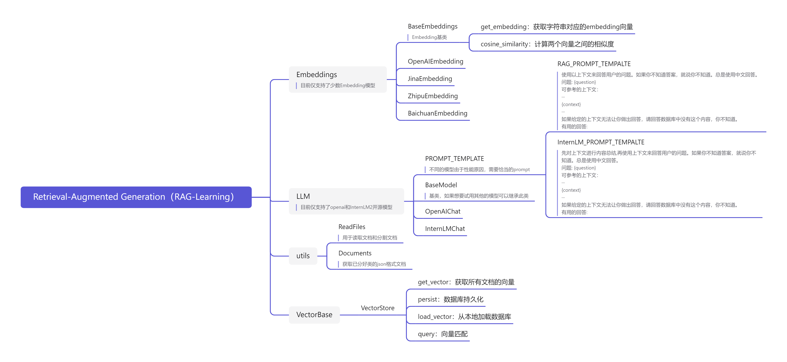
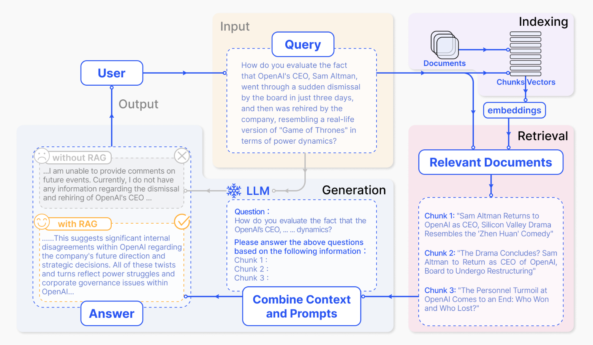

目录

- [RAG 介绍](#rag-介绍)
    - [LLM 问题](#llm-问题)
    - [RAG 原理](#rag-原理)
    - [RAG 和 Fine-tune](#rag-和-fine-tune)
- [RAG 模块](#rag-模块)
- [RAG 流程](#rag-流程)
- [RAG 实现](#rag-实现)
    - [向量化](#向量化)
    - [文档加载和切分](#文档加载和切分)
    - [数据库和向量检索](#数据库和向量检索)
    - [大模型模块](#大模型模块)
- [RAG 组件](#rag-组件)
- [RAG 应用](#rag-应用)
- [参考](#参考)

# RAG 介绍

LLM 会产生误导性的 “幻觉”，依赖的信息可能过时，处理特定知识时效率不高，
缺乏专业领域的深度洞察，同时在推理能力上也有所欠缺。

正是在这样的背景下，检索增强生成技术（Retrieval-Augmented Generation，RAG）应时而生，
成为 AI 时代的一大趋势。

RAG 通过在语言模型生成答案之前，先从广泛的文档数据库中检索相关信息，然后利用这些信息来引导生成过程，
极大地提升了内容的准确性和相关性。RAG 有效地缓解了幻觉问题，提高了知识更新的速度，
并增强了内容生成的可追溯性，使得大型语言模型在实际应用中变得更加实用和可信。

## LLM 问题

大型语言模型（LLM）相较于传统的语言模型具有更强大的能力，然而在某些情况下，
它们仍可能无法提供准确的答案。由于训练这些模型需要耗费大量时间，
因此它们所依赖的数据可能已经过时。此外，大模型虽然能够理解互联网上的通用事实，
但往往缺乏对特定领域或企业专有数据的了解，而这些数据对于构建基于 AI 的应用至关重要。

在大模型出现之前，**微调(fine-tuning)** 是一种常用的扩展模型能力的方法。
然而，随着模型规模的扩大和训练数据数据量的增加，微调变得越来越不适用于大多数情况，
除非需要模型以指定风格进行交流或充当领域专家的角色，
一个显著的例子是 OpenAI 将补全模型 GPT-3.5 改进为新的聊天模型 ChatGPT，
微调效果出色。微调不仅需要大量的高质量数据，还消耗巨大的计算资源和时间，
这对于许多个人和企业用户来说是昂贵且稀缺的资源。
因此，研究如何有效地利用专有数据来辅助大模型生成内容，成为了学术界和工业界的一个重要领域。
这不仅能够提高模型的实用性，还能够减轻对微调的依赖，使得 AI 应用更加高效和经济。

目前 LLM 面临的主要问题以及 RAG 的作用：

* **信息偏差/幻觉**：LLM 有时会产生与客观事实不符的信息，导致用户接收到的信息不准确。
  RAG 通过检索数据源，辅助模型生成过程，确保输出内容的精确性和可信度，减少信息偏差。
* **知识更新滞后性**：LLM 基于静态的数据集训练，这可能导致模型的知识更新滞后，
  无法及时反映最新的信息动态。RAG 通过实时检索最新数据，保持内容的时效性，确保信息的持续更新和准确性。
* **内容不可追溯**：LLM 生成的内容往往缺乏明确的信息来源，影响内容的可信度。
  RAG 将生成内容与检索到的原始资料建立链接，增强了内容的可追溯性，从而提升了用户对生成内容的信任度。
* **领域专业知识能力欠缺**：LLM 在处理特定领域的专业知识时，效果可能不太理想，
  这可能会影响到其在相关领域的回答质量。RAG 通过检索特定领域的相关文档，
  为模型提供丰富的上下文信息，从而提升了在专业领域内的问题回答质量和深度。
* **推理能力限制**：面对复杂问题时，LLM 可能缺乏必要的推理能力，这影响了其对问题的理解和回答。
  RAG 结合检索到的信息和模型的生成能力，通过提供额外的背景知识和数据支持，增强了模型的推理和理解能力。
* **应用场景适应性受限**：LLM 需在多样化的应用场景中保持高效和准确，
  但单一模型可能难以全面适应所有场景。RAG 使得 LLM 能够通过检索对应应用场景数据的方式，
  灵活适应问答系统、推荐系统等多种应用场景。
* **长文本处理能力较弱**： LLM 在理解和生成长篇内容时受限于有限的上下文窗口，
  且必须按顺序处理内容，输入越长，速度越慢。RAG 通过检索和整合长文本信息，
  强化了模型对长上下文的理解和生成，有效突破了输入长度的限制，同时降低了调用成本，并提升了整体的处理效率。

## RAG 原理

为了解决大型语言模型在生成文本时面临的一系列挑战，提高模型的性能和输出质量，
研究人员提出了一种新的模型架构：**检索增强生成(RAG, Retrieval-Augmented Generation)**。
该架构巧妙地 **整合了从庞大知识库中检索到的相关信息，并以此为基础，指导大型语言模型生成更为精准的答案**，
即：RAG 的作用是 **帮助模型查找外部信息以改善其响应**，从而显著提升了回答的准确性与深度。

RAG 技术基于 **提示词(prompt)**，最早由 Facebook AI 研究机构(FAIR)与其合作者于 2021 年发布的论文 “Retrieval-Augmented Generation for Knowledge-Intensive NLP Tasks” 中提出。
RAG 有效地缓解了幻觉问题，提高了知识更新的速度，并增强了内容生成的可追溯性，
使得大型语言模型在实际应用中变得更加实用和可信。

RAG 技术十分强大，它已经被必应搜索、百度搜索以及其他大公司的产品所采用，旨在将最新的数据融入其模型。
在没有大量新数据、预算有限或时间紧张的情况下，这种方法也能取得不错的效果，而且它的原理足够简单。

## RAG 和 Fine-tune

在提升大语言模型效果中，RAG 和 微调(Fine-tune)是两种主流的方法：

* RAG 结合了 **检索（从大型文档系统中获取相关文档片段）** 和 **生成（模型使用这些片段中的信息生成答案）** 两部分。
  RAG 通过在语言模型生成答案之前，先从广泛的文档数据库中检索相关信息，然后利用这些信息来引导生成过程，
  极大地提升了内容的准确性。
* 微调通过在特定数据集上进一步训练大语言模型，来提升模型在特定任务上的表现。

RAG 和 微调的对比可以参考下表：

| 特征比较 | RAG                                                                    | 微调                                                                       |
| -------- | ---------------------------------------------------------------------- | -------------------------------------------------------------------------- |
| 知识更新 | 直接更新检索知识库，无需重新训练。信息更新成本低，适合动态变化的数据。 | 通常需要重新训练来保持知识和数据的更新。更新成本高，适合静态数据。         |
| 外部知识 | 擅长利用外部资源，特别适合处理文档或其他结构化/非结构化数据库。        | 将外部知识学习到 LLM 内部。                                                |
| 数据处理 | 对数据的处理和操作要求极低。                                           | 依赖于构建高质量的数据集，有限的数据集可能无法显著提高性能。               |
| 模型定制 | 侧重于信息检索和融合外部知识，但可能无法充分定制模型行为或写作风格。   | 可以根据特定风格或术语调整 LLM 行为、写作风格或特定领域知识。              |
| 可解释性 | 可以追溯到具体的数据来源，有较好的可解释性和可追踪性。                 | 黑盒子，可解释性相对较低。                                                 |
| 计算资源 | 需要额外的资源来支持检索机制和数据库的维护。                           | 依赖高质量的训练数据集和微调目标，对计算资源的要求较高。                   |
| 推理延迟 | 增加了检索步骤的耗时                                                   | 单纯 LLM 生成的耗时                                                        |
| 降低幻觉 | 通过检索到的真实信息生成回答，降低了产生幻觉的概率。                   | 模型学习特定领域的数据有助于减少幻觉，但面对未见过的输入时仍可能出现幻觉。 |
| 伦理隐私 | 检索和使用外部数据可能引发伦理和隐私方面的问题。                       | 训练数据中的敏感信息需要妥善处理，以防泄露。                               |

# RAG 模块

> RAG 基本结构

* 一个向量化(Embedding)模块，用来将文档片段向量化
* 一个文档加载和切分的模块，用来加载文档并切分成文档片段
* 一个数据库来存放文档片段和对应的向量表示
* 一个检索模块，用来根据 Query(问题) 检索相关的文档片段
* 一个大模型模块，用来根据检索出来的文档回答用户的问题

# RAG 流程

RAG 技术在具体实现方式上可能有所变化，但在概念层面，
将其融入应用通常包括以下几个步骤（见下图）：

1. 用户提交一个问题
2. 文档数据加载和处理
    - 加载文档数据
    - 清洗和处理文档数据
    - 将处理后的数据转化为检索模型可以使用的格式
3. **索引**：将文档库分割成较短的 chunk，并通过编码器构建向量索引
    - RAG 系统搜索可能回答这个问题的相关文档。这些文档通常包含了专有数据，并被存储在某种形式的文档索引里
4. **检索**：根据问题(query)和 chunks 的相似度从数据库中检索相关文档片段
5. **增强**：对检索到的信息进行处理和增强，以便生成模型可以更好地理解和使用
    - RAG 系统构建一个提示词，它结合了用户输入、相关文档以及对大模型的提示词，引导其使用相关文档来回答用户的问题
6. **生成**：以检索到的上下文为条件，生成问题的回答
    - RAG 系统将这个提示词(增强后的信息)发送给大模型，大模型基于提供的上下文返回对用户问题的回答，这就是系统的输出结果

# RAG 实现

## 向量化

> Embedding
> 
> Embedding API 的调用介绍在[这里](https://wangzhefeng.com/note/llm/llm-arch/embedding/)。

首先实现一个向量化的类，这是 RAG 架构的基础。向量化的类主要用来将文档片段向量化，将一段文本映射为一个向量。

## 文档加载和切分

接下来实现一个文档加载、切分的类，这个类主要是用来加载文档并切分成文档片段。

那么需要切分什么文档呢？这个文档可以是一篇文章、一本书、一段对话、一段代码等等。
这个文档的内容可以是任何的，只要是文本就行，比如：PDF 文件、MD 文件、TXT 文件等。

把文件内容都读取之后，还需要切分。按 Token 的长度来切分文档。
可以设置一个最大的 Token 长度，然后根据这个最大的 Token 长度来切分文档。
这样切分出来的文档片段就是一个一个的差不多相同长度的文档片段了。
不过在切分的时候要注意，片段与片段之间最好要有一些重叠的内容，
这样才能保证检索的时候能够检索到相关的文档片段。
还有就是切分文档的时候最好以句子为单位，也就是按 `\n` 进行粗切分，
这样可以基本保证句子内容是完整的。

## 数据库和向量检索

做好了文档切分后，也做好了 Embedding 模型的加载。
接下来就得设计一个向量数据库用来存放文档片段和对应的向量表示了。
并且需要设计一个检索模块，用来根据 Query （问题）检索相关的文档片段。

一个数据库对于最小 RAG 架构来说，以下四个模块就是一个最小的 RAG 结构数据库需要实现的功能:

* persist：数据库持久化，本地保存
* load_vector：从本地加载数据库
* get_vector：获得文档的向量表示
* query：根据问题检索相关的文档片段。query 方法具体实现：
     - 1.首先，先把用户提出的问题向量化
     - 2.然后，在数据库中检索相关的文档片段
     - 3.最后，返回检索到的文档片段

## 大模型模块

> LLMs API
>
> LLM API 调用介绍在[这里](https://wangzhefeng.com/note/2024/08/14/llm-models-api/)。

大模型模块主要是用来根据检索出来的文档回答用户的问题。

# RAG 组件

> LangChian RAG 组件

在实际的生产环境中，通常会面对来自多种渠道的数据，其中很大一部分是复杂的非机构化数据，
处理这些数据，特别是提取和预处理，往往是耗费精力的任务之一。
因此 LangChain 提供了专门的文档加载和分割模块。RAG 技术的每个阶段都在 LangChain 中得到完整的实现。

* TODO

# RAG 应用

* [基于 LangChain 搭建知识库、搭建检索问答链、部署知识库助手](https://wangzhefeng.com/note/2024/08/03/llm-rag-app-knowledge/)

# 参考

* [动手做一个最小RAG——TinyRAG](https://mp.weixin.qq.com/s?__biz=MzIyNjM2MzQyNg==&mid=2247660972&idx=1&sn=0bf6fe4d0854015d18263b49cd7b81ef&chksm=e98387af128051c9cb6914cee71626e5afb79ab8439966c508999270ca5b4048ad51a386fc2f&scene=0&xtrack=1)
* [Tiny RAG](https://github.com/datawhalechina/tiny-universe/tree/main/content/TinyRAG)
