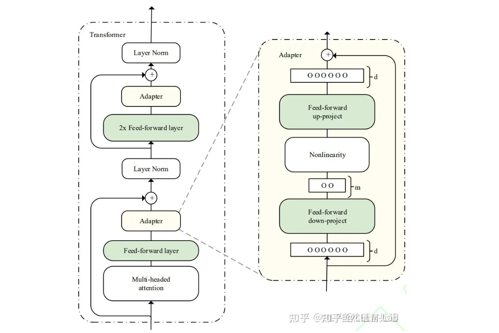

目录

- [什么是 LoRA](#什么是-lora)
  - [针对的问题](#针对的问题)
  - [替代解决方案](#替代解决方案)
  - [LoRA 的思路](#lora-的思路)
  - [LoRA 的优势](#lora-的优势)
- [LoRA 的原理](#lora-的原理)
- [LoRA 使用](#lora-使用)
- [参考](#参考)

# 什么是 LoRA

## 针对的问题

全量参数 Fine-tune 需要调整模型全部参数，随着预训练模型规模的不断扩大（GPT-3，175B），
全量 Fine-tune 的资源压力也倍增。高效、快速对模型进行领域或任务的微调，在大模型时代极其重要。

## 替代解决方案

针对全量 Fine-tune 的昂贵问题，目前主要有两种解决方案：

1. Adapt Tuning
    - 即在模型中添加 Adapter 层，在微调时冻结原参数，仅更新 Adapter 层。
      具体而言，其在预训练模型每层中插入用于下游任务的参数，即 Adapter 模块，
      在微调时冻结模型主体，仅训练特定于任务的参数。
    - 每个 Adapter 模块由两个前馈子层组成，第一个前馈子层将 Transformer 块的输出作为输入，
      将原始输入维度 `$d$` 投影到 `$m$`，通过控制 `$m$` 的大小来限制 Adapter 模块的参数量，
      通常情况下 `$m << d$`。在输出阶段，通过第二个前馈子层还原输入维度，将 `$m$` 重新投影到 `$d$`，
      作为 Adapter 模块的输出(如上图右侧结构)。LoRA 事实上就是一种改进的 Adapt Tuning 方法。
      但 Adapt Tuning 方法存在推理延迟问题，由于增加了额外参数和额外计算量，
      导致微调之后的模型计算速度相较原预训练模型更慢。

    

2. Prefix Tuning
    - 该种方法固定预训练 LM，为 LM 添加可训练，任务特定的前缀，这样就可以为不同任务保存不同的前缀，
      微调成本也小。具体而言，在每一个输入 token 前构造一段与下游任务相关的 virtual tokens 作为 prefix，
      在微调时只更新 prefix 部分的参数，而其他参数冻结不变。也是目前常用的微量微调方法的 Ptuning，
      其实就是 Prefix Tuning 的一种改进。但 Prefix Tuning 也存在固定的缺陷：模型可用序列长度减少。
      由于加入了 virtual tokens，占用了可用序列长度，因此越高的微调质量，模型可用序列长度就越低。

## LoRA 的思路

如果一个大模型是将数据映射到高维空间进行处理，这里假定在处理一个细分的小任务时，
是不需要那么复杂的大模型的，可能只需要在某个子空间范围内就可以解决，
那么也就不需要对全量参数进行优化了，我们可以定义当对某个子空间参数进行优化时，
能够达到全量参数优化的性能的一定水平（如 90% 精度）时，
那么这个子空间参数矩阵的秩就可以称为对应当前待解决问题的本征秩（intrinsic rank）。

预训练模型本身就隐式地降低了本征秩，当针对特定任务进行微调后，
模型中权重矩阵其实具有更低的本征秩（intrinsic rank）。
同时，越简单的下游任务，对应的本征秩越低。
因此，权重更新的那部分参数矩阵尽管随机投影到较小的子空间，仍然可以有效的学习，
可以理解为针对特定的下游任务这些权重矩阵就不要求满秩。
我们可以通过优化密集层在适应过程中变化的秩分解矩阵来间接训练神经网络中的一些密集层，
从而实现仅优化密集层的秩分解矩阵来达到微调效果。

例如，假设预训练参数为 `$\theta_{0}^{D}$`，
在特定下游任务上密集层权重参数矩阵对应的本征秩为 `$\theta^{d}$`，
对应特定下游任务微调参数为 `$\theta^{D}$`，那么有：

`$$\theta^{D} = \theta_{0}^{D} + \theta^{d}M$$`

这个 `$M$` 即为 LoRA 优化的秩分解矩阵。

## LoRA 的优势

1. 可以针对不同的下游任务构建小型 LoRA 模块，从而在共享预训练模型参数基础上有效地切换下游任务。
2. LoRA 使用自适应优化器（Adaptive Optimizer），不需要计算梯度或维护大多数参数的优化器状态，
   训练更有效、硬件门槛更低。
3. LoRA 使用简单的线性设计，在部署时将可训练矩阵与冻结权重合并，不存在推理延迟。
4. LoRA 与其他方法正交，可以组合。

# LoRA 的原理

# LoRA 使用

# 参考

* [深入浅出 LoRA](https://zhuanlan.zhihu.com/p/650197598)
* [LoRA: Low-rank Adaptation of Large Language Models](https://arxiv.org/pdf/2106.09685)
* [LoRA GitHub](https://github.com/microsoft/LoRA)
* [Intrinsic Dimensionality Explains the Effectiveness of Language Model Fine-Tuning](https://arxiv.org/abs/2012.13255)
