<style>
details {
    border: 1px solid #aaa;
    border-radius: 4px;
    padding: .5em .5em 0;
}
summary {
    font-weight: bold;
    margin: -.5em -.5em 0;
    padding: .5em;
}
details[open] {
    padding: .5em;
}
details[open] summary {
    border-bottom: 1px solid #aaa;
    margin-bottom: .5em;
}
img {
    pointer-events: none;
}
</style>

<details><summary>目录</summary><p>

- [Transformer 简介](#transformer-简介)
- [Transformer 架构](#transformer-架构)
    - [Transformer 模型架构](#transformer-模型架构)
    - [Transformer 数学表示](#transformer-数学表示)
    - [Transformer 架构解析](#transformer-架构解析)
        - [Transformer](#transformer)
        - [Encoder-Decoder](#encoder-decoder)
        - [Encoder](#encoder)
        - [Decoder](#decoder)
    - [Transformer 输入模块](#transformer-输入模块)
        - [Embedding](#embedding)
        - [Embedding-Encoder](#embedding-encoder)
    - [Transformer 编码模块](#transformer-编码模块)
        - [从高处看 Self-Attention](#从高处看-self-attention)
        - [从细节看 Self-Attention](#从细节看-self-attention)
            - [Self-Attention 向量计算](#self-attention-向量计算)
            - [Self-Attention 矩阵计算](#self-attention-矩阵计算)
        - [Multi-head Attention](#multi-head-attention)
        - [Positional Encoding](#positional-encoding)
        - [残差项](#残差项)
    - [Transformer 解码模块](#transformer-解码模块)
        - [Encoder-Deocder Attention 层](#encoder-deocder-attention-层)
        - [Linear 和 Softmax 层](#linear-和-softmax-层)
- [Transformer 详解](#transformer-详解)
    - [Attention 机制](#attention-机制)
        - [Attention 机制简介](#attention-机制简介)
        - [Attention 机制理解](#attention-机制理解)
        - [Attention 机制实现](#attention-机制实现)
        - [Self-Attention](#self-attention)
        - [Masked Self-Attention](#masked-self-attention)
        - [Multi-Head Attention](#multi-head-attention-1)
    - [Encoder-Decoder 结构](#encoder-decoder-结构)
        - [Seq2Seq 模型](#seq2seq-模型)
        - [Full-connected Neural Newtork](#full-connected-neural-newtork)
        - [Layer Norm](#layer-norm)
        - [残差链接](#残差链接)
        - [Encoder](#encoder-1)
        - [Decoder](#decoder-1)
    - [Transformer 模型](#transformer-模型)
        - [Embedding](#embedding-1)
        - [Positional Encoding](#positional-encoding-1)
        - [Transformer](#transformer-1)
- [Transformer 训练](#transformer-训练)
    - [Transformer 训练概要](#transformer-训练概要)
    - [Transformer 损失函数](#transformer-损失函数)
- [Transformer 通俗解释](#transformer-通俗解释)
    - [Tokenization 和 Embedding](#tokenization-和-embedding)
    - [Modeling tokens](#modeling-tokens)
    - [Attention](#attention)
    - [Query-Key-Value vector](#query-key-value-vector)
    - [Context aware Embedding](#context-aware-embedding)
    - [pytorch code](#pytorch-code)
- [Transformer CheatSheet](#transformer-cheatsheet)
- [Transformer 要点问题](#transformer-要点问题)
- [参考](#参考)
- [TODO](#todo)
</p></details><p></p>

# Transformer 简介

Transformer 是 Google 在 2017 年提出的一个 **NLP 模型**，适用于**机器翻译**任务。
它不依赖于使用 CNN 和 RNN，而是基于 **注意力机制(Attention Mechanism)** 构建网络结构。

自然语言处理与图像具有显著差异，自然语言处理任务具有其独特性。
相对于 CNN(卷积神经网络) 在计算机视觉中的霸主地位，
在很长一段时间里，RNN(循环神经网络)、LSTM(长短期记忆递归神经网络) 占据了 NLP 的主流地位。
作为针对序列建模的模型，RNN、LSTM 在以序列为主要呈现形式的 NLP 任务上展现出远超 CNN 的卓越性能。
​但是 RNN、LSTM 虽然在处理自然语言处理的序列建模任务中得天独厚，却也有着难以忽视的缺陷：

1. RNN 为单向依序计算，序列需要依次输入、串行计算，限制了计算机的并行计算能力，导致时间成本过高；
2. RNN 难以捕捉长期依赖问题，即对于极长序列，RNN 难以捕捉远距离输入之间的关系。
   虽然 LSTM 通过门机制对此进行了一定优化，但 RNN 对长期依赖问题的捕捉能力依旧是不如人意的。

​针对上述两个问题，2017 年，Vaswani 等人发表了论文《Attention Is All You Need》，
抛弃了传统的 CNN、RNN 架构，提出了一种全新的完全基于 Attention 机制的模型：Transformer，
解决了上述问题，在较小的时间成本下取得了多个任务的 the-state-of-art 效果，并为自然语言处理任务提供了新的思路。
自此，Attention 机制成为 NLP 任务的主流架构。

在 Transformer 的基础上，诞生了 **预训练-微调** 范式的多种经典模型如 Bert、GPT、T5 等。
当然，同样是在 Transformer 的肩膀上，引入了 RLHF 机制、
实现了大量参数建模的 ChatGPT 则带领 NLP 进入了全新的大模型时代。
但不管是预训练-微调范式的主流模型 Bert，还是大模型时代的主流模型 ChatGPT、
LLaMA，Transformer 都是其最坚实的基座。

# Transformer 架构

## Transformer 模型架构


## Transformer 数学表示

**Inputs：**

`$$\operatorname{Inputs} = (x_{1}, x_{2}, \cdots, x_{n})$$`

**Embedding：**

`$$X = \begin{bmatrix}
x_{1, embedding} = [\cdots] \\
x_{2, embedding} = [\cdots] \\
\cdots \\
x_{n, embedding} = [\cdots] \\
\end{bmatrix}$$`

**Attention：**

`$$Q = X \cdot W^{Q}$$`
`$$K = X \cdot W^{K}$$`
`$$V = X \cdot W^{V}$$`
`$$\operatorname{Attention}(Q, K, V)=\operatorname{Softmax}\left(\frac{Q K^{T}}{\sqrt{d_{k}}}\right) \cdot V$$`

**Multi-head Attention：**

`$$\operatorname{Multi-head}(Q, K, V) =\operatorname{Concat}\left(\operatorname{head}_{1}, \ldots, \text { head }_{\mathrm{h}}\right) \cdot W^{O}$$`

其中：

`$$head_{i} =\operatorname{Attention}\left(Q W_{i}^{Q}, K W_{i}^{K}, V W_{i}^{V}\right)$$`

**Feed forward：**

TODO

**Linear：**

TODO

**Softmax：**

TODO

## Transformer 架构解析

### Transformer

如果把 Transformer 模型当作黑盒，在机器翻译任务里，模型接受一种语言的句子，输出另一种语言的翻译句子：


### Encoder-Decoder

打开中间的 Transformer 结构，能看到一个 **编码模块** 和一个 **解码模块**，且它们互相连接：


**编码模块** 有多个 **编码器** 堆叠而成 (论文堆了 6 个，数字 6 没有特别规定，可以自行修改进行实验)，
**解码模块**也堆叠了 6 个 **解码器**。Transformer 模型结构中左侧和右侧的 `$N_x$` 就是指编码器或解码器的个数，
这里就是 `$N_6$`：


### Encoder

**编码器**之间都是相同结构，但不共享权重。每个编码器有两层：


编码器的输入首先流入一个 **自注意力层(Self-Attention layer)**，当编码器对某个特定单词进行编码时，
该层会帮助编码器关注输入句子中的其它单词。后续会详细讲这块。

**自注意力层(Self-Attention layer)** 的输出会被喂入 **前馈神经网络 (Feed-forward neural network)**，
每个输入位置上都有一个前馈神经网络，它们之间是相互独立的 (补充: 论文说前馈神经网络是 point-wise)。

### Decoder

**解码器** 也有编码器的这两层，但是在它们中间还有个 **注意力层**，
帮助解码器关注输入句子的相关部分（跟 seq2seq 模型里的关注机制类似）。


## Transformer 输入模块

### Embedding

上面已经看过模型的主要模块，现在来看下 **向量/张量** 是如何在这些模块中从 **输入** 到 **输出**。

以 NLP 常见应用的为例，用一个 Word Embedding 算法将每个输入词转化为一个向量：


Word Embedding 只发生在编码器的最底端，对于所有编码器来说，它们会接收一个 `list`，
`list` 内含有多个长度为 512 的词向量。但对其他编码器来说，它们的输入会是上一层编码器的输入。
`list` 的长度是可调整的超参，一般为训练集中最长句子的长度。

### Embedding-Encoder

对输入序列进行词向量化(Word Embedding)后，每个词向量会依次流入下面编码器中的两个子层：


Transformer 有一个重要特性：句子中的每个对应位置上的词是按照它自有路径流入编码器的，
在 Self-Attention 层这些路径是相互依赖的。但 Feed-forward 层不存在依赖性，
因此，当 Self-Attention 层的输入流入 Feed-forward 层，这些独立的路径可以 **并行**。

接下来，将目光转向一个更短的句子，看下在编码器每个子层里发生了什么？

## Transformer 编码模块

正如之前提到的，编码器接收一个 `list` 的词向量(Word Vector)作为输入。
它将 `list` 里的向量传入 Self-Attention 层，然后喂入 Feed-forward 层，
最后输出给下一个编码器：


> 注意：对于每个位置的词向量来说，Feed-forward 层都是相互独立，
> Transformer 的作者也因此称之为 position-wise fully connected Feed-forward network。
> 而 Self-Attention 层则是多个词向量共用的。

### 从高处看 Self-Attention

不要被 “Self-Attention” 这个词迷惑了，它不是我们熟悉的含义。下面来看下它具体怎么工作的。

假设，想翻译以下句子：

```
The animal didn't cross the street because it was too tired.
```

句子中的 `"it"` 是指代什么？指代 `"street"` 还是 `"animal"`？对人来说很简单，但对算法来说不简单。
当模型处理 `"it"` 时，Self-Attention 允许将 `"it"` 和 `"animal"` 关联起来。

**当模型处理每个词时 (即在输入序列的每个位置上)，Self-Attention 允许关注输入序列其它位置作为辅助信息，
帮助对当前词更好地编码。如果熟悉 RNN，想想隐藏层是如何使得 RNN 利用历史词/向量的表征去获取当前词的表征向量。
Transformer 的 Self-Attention 是将对相关词的理解融入到当前词的处理当中。**

比如：当在第 5 个编码器 (即堆叠在上面的编码器) 编码 `"it"` 时，部分关注会集中在 `"The animal"` 上，
然后将它的表征融合进 `"it"` 的编码中：


### 从细节看 Self-Attention

首先看下如何使用 **向量** 计算 Self-Attention，然后进一步看如何使用 **矩阵** 实施计算。

#### Self-Attention 向量计算

1. **第一步，在计算 Self-Attention 中，是对编码器的每个输入向量(即每个词向量 `$x$`)创建三个向量。**
   即：
   `$$q = x \cdot W^{q}$$`
   `$$k = x \cdot W^{k}$$`
   `$$v = x \cdot W^{v}$$`
   对于每个词 **Embedding 向量**，会创建 **Query 向量**、**Key 向量** 和 **Value 向量**，
   将三个权重矩阵乘以词向量便可得到这三个向量，这三个权重矩阵会在训练过程中不断学习。

    

> * 那什么是 Query 向量、Key 向量和 Value 向量呢？
> 
> * 注意：相比于词向量 (512 维)，这三个向量（Query、Key、Value）的维度是偏小的 (64 维)。
> 三向量不是一定要小，这是为了让 Multi-head Attention 的计算是连续的 (Self-Attention 其实是个 Multi-head 的形式，
> 即多个 Attention 模块，原论文是说有 8 个并行的 Attention 层，这样若总维度为 512，那会变为 512/8=64 维，
> 相当于全 512 维度输入 Single-head Attention 变为了 64 维输入 Multi-head Attention，如下图所示)。
> 
> 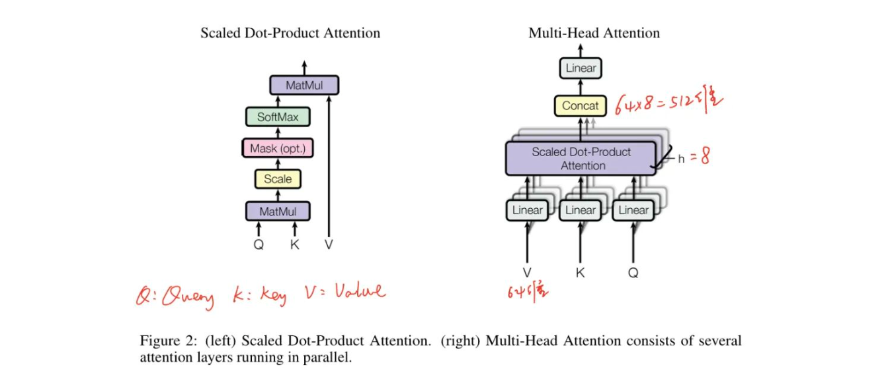

2. **计算 Self-Attention 的第二步是计算一个分数。** 
   即：
   `$$q \cdot k$$`
   假设对 `"Thinking"` 这个词计算 Self-Attention，
   当前词(`"Thinking"`)要对输入句子中其它词(`"Machines"`)对进行打分，
   这个分数决定了：当对某给定位置上的词进行编码时，应该给输入句子中其它位置上的词多少关注。
   Query 向量和 Key 向量点乘便可得到分数，所以如果对位置 1 的词计算 Self-Attention，
   `$q_{1}$` 点乘 `$k_{1}$` 便可得到第一个分数，第二个分数则是 `$q_{1}$` 和 `$k_{2}$` 的点乘。

    

3. **第三步是将分数除 `$\sqrt{d_{k}}$`。**
   即：
   `$$q \cdot k / \sqrt{d_{k}}$$`
   论文提到这里是对 Key 向量维度开方(`$\sqrt{d_{k}}$`)，即 `$\sqrt{64}=8$`，
   这能帮助拥有更稳定的梯度，也可以是其它可能值，
   但这个是默认的(补充: 作者是担心对于大的 Key 向量维度会导致点乘结果变得很大，
   将 Softmax 函数推向得到极小梯度的方向，因此才将分数除以 Key 向量维度开方值)。
4. **第四步是基于上面的分数求 Softmax 分数。**
   即：
   `$$s = Softmax(q \cdot k / \sqrt{d_{k}})$$`
   这个 Softmax 分数决定对当前位置上的词，句子上的各词该表达多少程度。
   明显在当前位置上的词获取最高的 Softmax 分数，但有时，
   与当前词有关的其它词如果能参与进来也是有帮助的。

    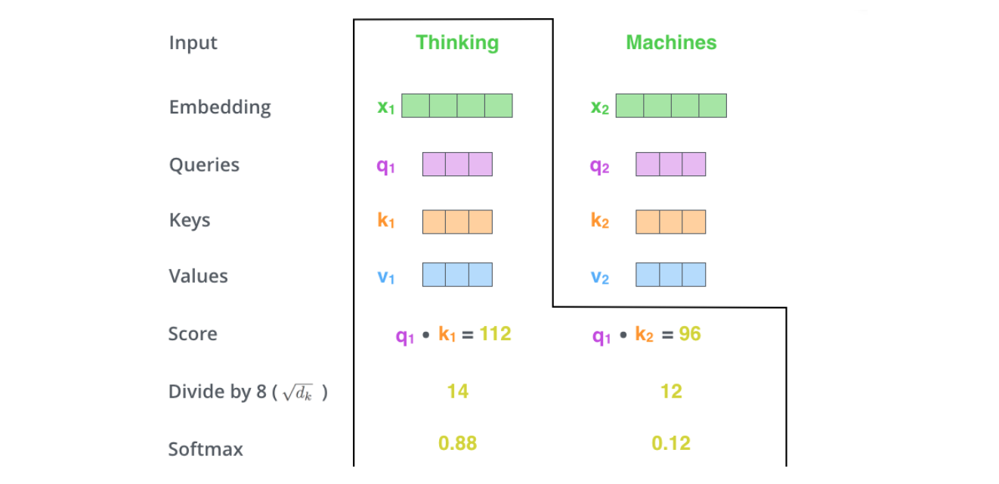

5. **第五步是 Value 向量与 Softmax 分数相乘(以便相加)。**
   即：
   `$$s \cdot v = Softmax(q \cdot k / \sqrt{d_{k}}) \cdot v$$`
   这是为了保留想关注的词，掩盖掉不相干的词，例如：给他们乘上极小值 0.001。
6. **第六步是加总这些加权的 Value 向量。**
   即：
   `$$z = \sum s \cdot v = \sum Softmax(q \cdot k / \sqrt{d_{k}}) \cdot v$$`
   对于第一个词 `"Thinking"`，这便生成了 Self-Attention 层在此位置上的输出。

    

上面就是 Self-Attention 层的计算过程，结果向量可以输入给 feed-forword 神经网络。
在真实应用中，是使用矩阵计算加快处理速度，所以下面看下单词级别的矩阵计算。

#### Self-Attention 矩阵计算

1. 第一步是计算 Query、Key 和 Value 矩阵，通过打包词向量 `$x$` 成矩阵 `$X$`，
   然后分别乘上三个可学习的权重矩阵 `$(W^{Q}, W^{K}, W^{V})$`。
   `$$Q = X \cdot W^{Q}$$`
   `$$K = X \cdot W^{K}$$`
   `$$V = X \cdot W^{V}$$` 
   在矩阵 `$X$` 中，每一行对应输入句子中每一个单词，
   再次看到词向量长度(512，图中的 4 个 box)和 Q/K/V 向量长度(64，图中的 3 个 box)是不一样的。

    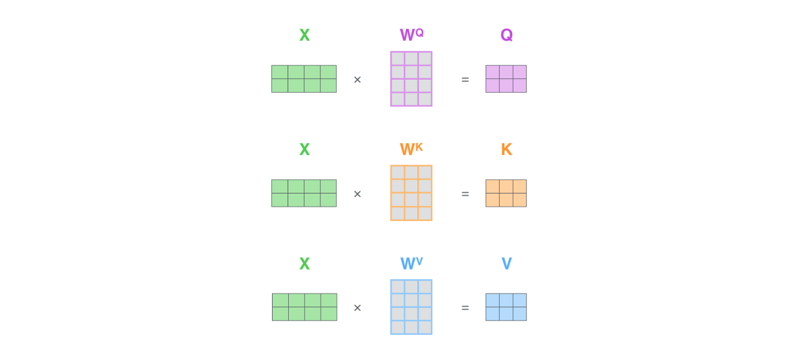

2. 最后，因为要处理这些矩阵，我们能压缩第二步到第六步到一个方程式，
   从而计算出 Self-Attention 层的输出结果：
   - 第二步：
   `$$Q \cdot K^{T}$$`
   - 第三步：
   `$$Q \cdot K^{T} / \sqrt{d_{K}}$$`
   - 第四步：
   `$$S = Softmax(Q \cdot K^{T} / \sqrt{d_{k}})$$`
   - 第五步：
   `$$S \cdot V = Softmax(Q \cdot K^{T} / \sqrt{d_{K}}) \cdot V$$`
   - 第六步：
   `$$Z = \sum S \cdot V = \sum Softmax(Q \cdot K^{T} / \sqrt{d_{K}}) \cdot V$$`
   即：
    

### Multi-head Attention

论文在 Self-Attention 层前还加入了 “Multi-head” 的 Attention 机制，它从两方面提升了 Attention 层的表现：

1. Multi-head Attention 增强了模型关注不同位置的能力
   - 在以上例子中，`$z_{1}$` 没怎么包括其他词编码的信息 (例如，过于关注 `"it"` 并不能带来很多信息)，
     但实际上可能是由真实值所控制的 (例如，关注 `"it"` 指代的 `"The animal"` 会对模型更好)，
     所以如果翻译 `"The animal didn’t cross the street because it was too tired."`，
     Multi-head Attention 能帮助我们知道 `"it"` 指代的是哪个词，从而提升模型表现。
2. Multi-head 机制给 Attention 层带来多个 “表征子空间”
    - Multi-head Attention 不只是 1 个，而是多个 Q/K/V 矩阵 (Transformer 用了 8 个关注头，
      所以对于每个编码器-解码器，有 8 组)，每组都是随机初始化。然后，训练之后，
      每组会将输入向量 (或者是来自更低部编码器-解码器的向量) 映射到不同的表征空间

    

    - 在 Multi-head Attention 下，对每个头都有独立的 Q/K/V 权重矩阵，因此每个头会生成不同的 Q/K/V 矩阵。
      正如之前所做，将 `$X$` 和 `$W^{Q}$`/ `$W^{K}$` / `$W^{V}$` 矩阵相乘便可得到 Q/K/V 矩阵。
      如果按上面方式去计算，8 次与不同权重矩阵相乘会得到 8 个不同的 Z 矩阵

    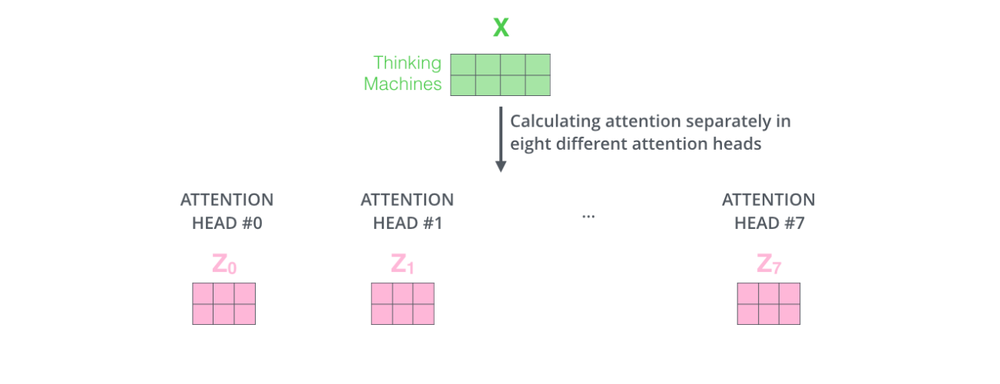

    - 这有点困难了，因为 Feed-Forward 层不期望获取 8 个矩阵，它希望得到 1 个矩阵 (即一个词 1 个向量)，
      所以需要使用一个方法将这 8 个矩阵变为 1 个矩阵。直接合并矩阵，
      然后乘上一个额外的权重矩阵 `$W^{O}$` 就好了

    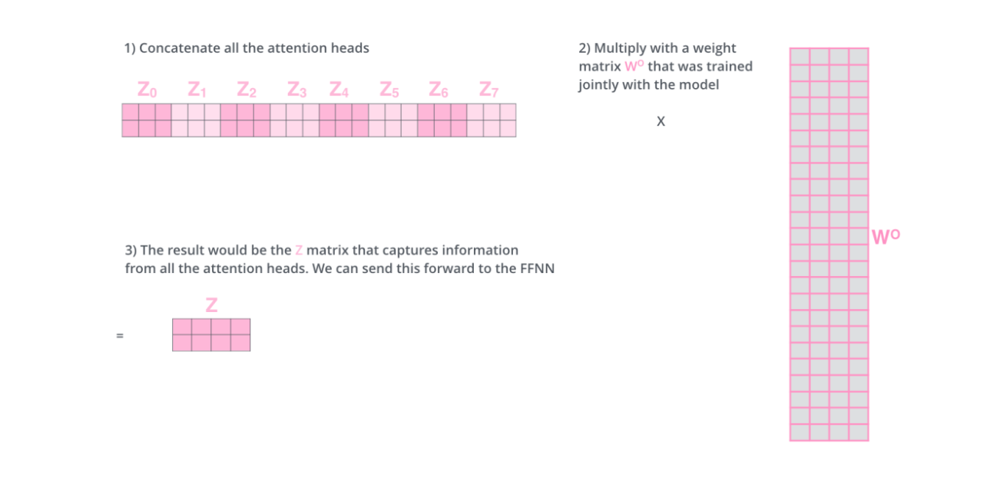

这差不多就是 Multi-head Self-Attention 层的全部了，来把这些矩阵放在一块看看：


现在，已经接触了 Attention 的 head 了，重温下之前的例子，去看下在编码 `"it"` 时，
不同 Attention head 是怎么 Attenion：


当我们编码词 `"it"` 时，一个 Attention head 更加关注 `"The animal"`，
另一个更关注 `"tired"`。在某种意义上，对于 `"it"` 的表征加入了 `"animal"` 和 `"tired"` 的考虑。
如果我们加入所有关注头，就可能会较难解释：

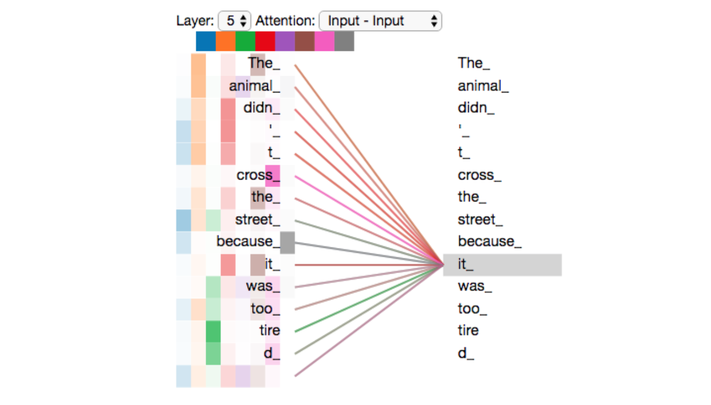

### Positional Encoding 

> 使用位置编码表征序列顺序

说了那么久，有件事没讲，怎么去将输入序列的词顺序考虑进模型呢？
(补充：需要考虑词顺序是因为 Transformer 没有循环网络和卷积网络，
因此需要告诉模型词的相对/绝对位置)。

为了解决这个问题，Transformer 给每个输入 Embedding 加上一个向量，该向量服从模型学习的特定模式，
这决定了词位置，或者序列中词之间的距离。当 Embedding 向量被映射到 Q/K/V 向量和点乘 Attention 时，
对 Embedding 向量加上位置向量有利于提供有意义的距离信息。


假设 Embedding 向量维度是 4，那么真实位置编码会如下所示：


> 这个指定模式是怎样的？如下图所示，每行对应的是一个词向量的位置编码，
> 所以第一行是要加到输入序列中第一个词 Embedding 的向量。
> 每行包含 512 个值，每个值范围在 -1 到 1 之间。对值进行着色可视化：
> 
> 
> 
> 位置编码的公式在[《Visualizing A Neural Machine Translation Model (Mechanics of Seq2seq Models With Attention)》](https://jalammar.github.io/visualizing-neural-machine-translation-mechanics-of-seq2seq-models-with-attention/) 有提及，你也能看在 [`get_timing_signal_1d()`](https://github.com/tensorflow/tensor2tensor/blob/23bd23b9830059fbc349381b70d9429b5c40a139/tensor2tensor/layers/common_attention.py) 里位置编码的代码。
> 这不是位置编码的唯一方法，但它能处理不可见长度的序列 (例如训练好的模型被要求去翻译一个超过训练集句子长度的句子)。
> 
> 以上展示的位置编码在 Tensor2Tensor (论文的开源代码) 实现里是合并 sine 和 cosine，
> 但是原始论文展示的又不一样，原始论文是交叉使用两种 signals (即偶数位置使用 sine，奇数位置使用 cosine)，
> 下图便是论文生成方式得到的：
> 
> 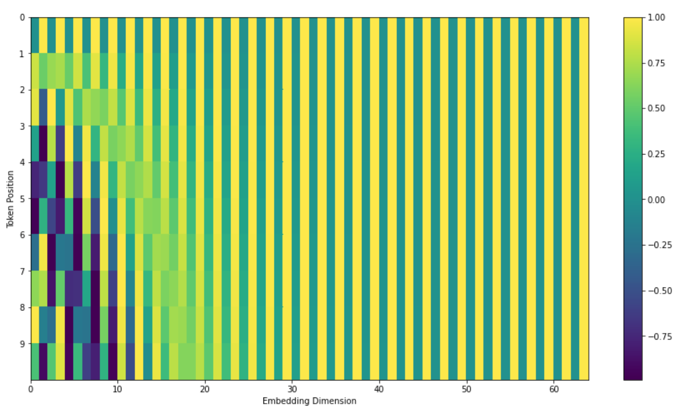

这里作者提到了两种方法：

* 方法 1：用不同频率的 sine 和 cosine 函数直接计算
* 方法 2：学习出一份 Positional Embedding

经过实验发现两者的结果一样，所以最后选择了第一种方法，位置编码的公式如下：

`$$PE_{(pos, 2i)} = sin\Bigg(\frac{pos}{10000^{\frac{2i}{d_{model}}}}\Bigg)$$`
`$$PE_{(pos, 2i + 1)} = cos\Bigg(\frac{pos}{10000^{\frac{2i}{d_{model}}}}\Bigg)$$`

其中：

* `$pos$` 是位置
* `$i$` 是维度。`$2i$` 代表偶数维度，`$2i+1$` 代表奇数维度
* `$d_{model}$` 为 512

作者提到，方法 1 的好处有两点：

1. 任意位置的 `$PE_{pos+k}$` 都可以被 `$PE_{pos}$` 的线性函数表示。
    - 三角函数特性复习下：
    `$$cos(\alpha + \beta) = cos(\alpha)cos(\beta) - sin(\alpha)sin(\beta)$$`
    `$$sin(\alpha + \beta) = sin(\alpha)cos(\beta) + cos(\alpha)sin(\beta)$$`
2. 如果是学习到的 Positional Embedding，(个人认为，没看论文)会像词向量一样受限于词典大小。
   也就是只能学习到 “位置 2 对应的向量是 (1,1,1,2)” 这样的表示。所以用三角公式明显不受序列长度的限制，
   也就是可以对比所遇到序列的更长的序列进行表示。

### 残差项

在继续深入下去之前，编码器结构有个细节需要注意：
编码器每个子层 (Self-Attention, Feed Forward) 都有一个残差连接项，
并跟着 Normalization 层：

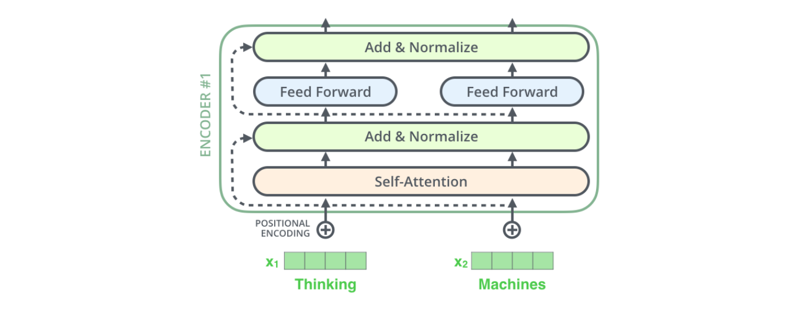

如果将向量和 Self-Attention 层的 Layer-Norm 操作可视化，会如下所示：


在解码器中也一样，如果 Transformer 堆叠了两层的编码器和解码器，它会如下所示：

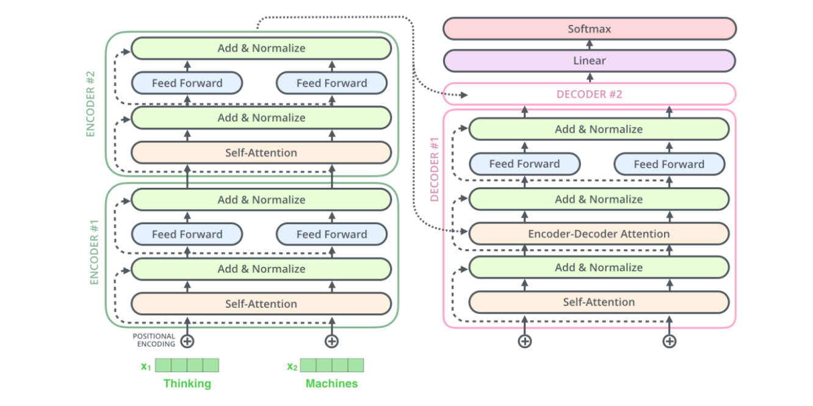

## Transformer 解码模块

现在，讲了编码器大部分的内容，也基本了解解码器的成分，但看下它们是怎样一起工作的。

### Encoder-Deocder Attention 层

编码器先处理输入序列，最上层编码器的输出被转换成一组关注向量 `$K$` 和 `$V$`，
它们被输入进 Encoder-Decoder Attention 层内的每个解码器里，帮助解码器关注输入序列中合适的部分：

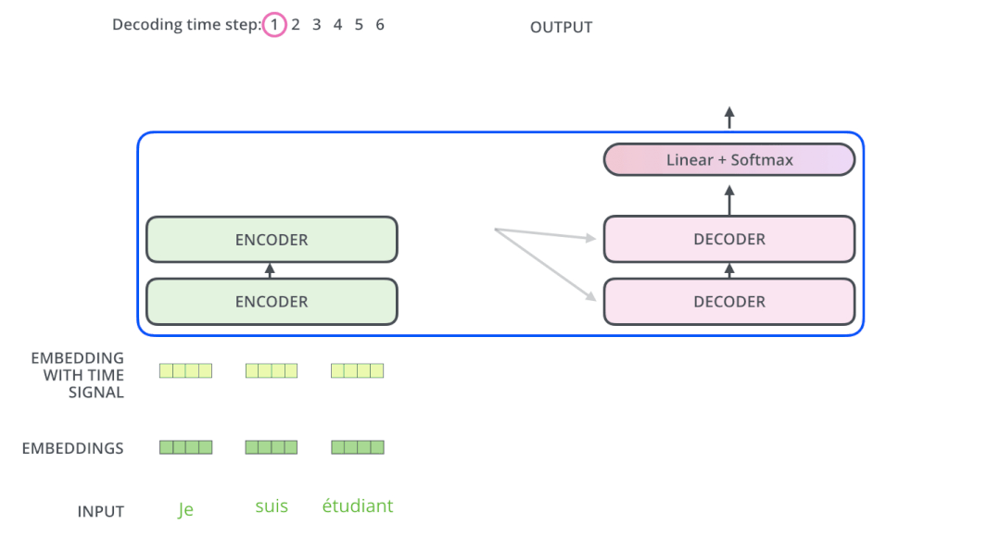

接下来不断重复解码过程，直到生成出特殊符号，标志 Transformer 解码器完成了输出。
每步的输出被喂入下一时间轮数下的底层解码器，然后不断向上运输解码结果。与对待编码器输入一样，
向量化和加位置编码给解码器的输入，以便解码器了解到每个词的位置信息

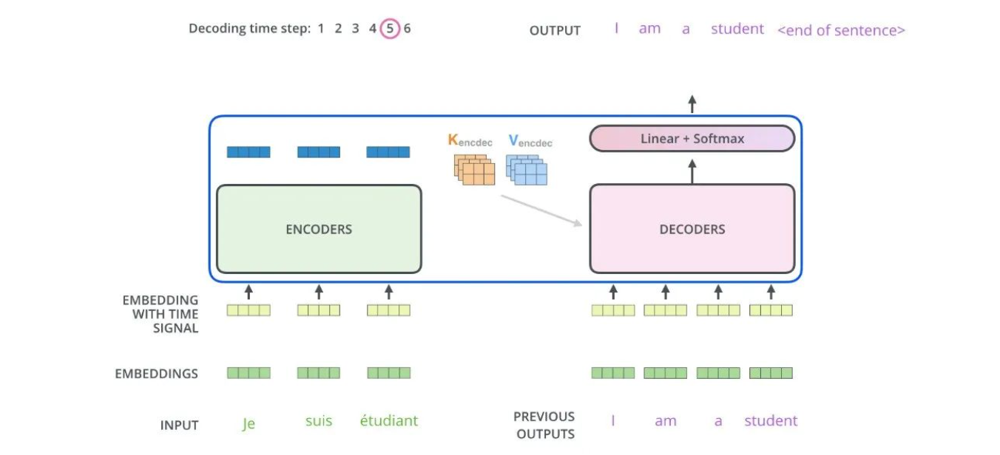

解码器中的 Self-Attention 层和编码器的有点不一样：在解码器中，Self-Attention 层只允许关注输出序列的历史位置，
这通过 Self-Attention 的 softmax 前，遮掩未来位置实现 (即设置它们为 -inf)。

Encoder-Decoder Attention 层工作就像 Multi-head Self-Attention，除了它是从前一层创建出 Query 矩阵，
然后接收编码器输出的 Key 和 Value 矩阵。

### Linear 和 Softmax 层

解码器们输出浮点向量，怎么将其转换为一个词呢？这是最后的 Linear 和 Softmax 层所做的工作。

* Linear 层就是简单的全连接神经网络，将解码器的输出向量映射到一个很大很大的向量叫 **logits 向量**
    - 假设模型通过学习训练集，知道 1 万个独特的英文单词 (即模型的输出词汇)。
      这就需要 logits 向量有 1 万个格子，每个格子对应着一个独特词的分数
* Softmax 层将这些分数转化为概率 (0-1 的正数)，选择最高概率的格子，然后对应的单词作为当前时间步数下的输出

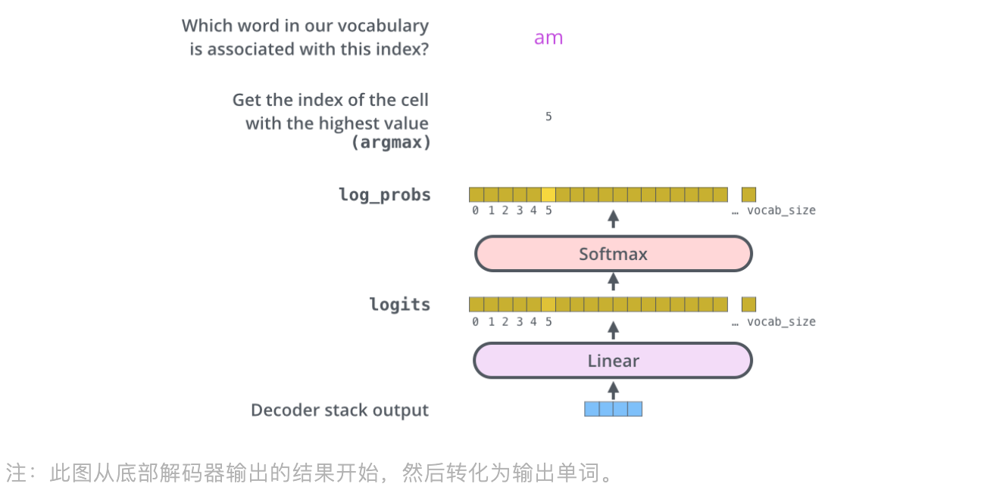

# Transformer 详解

## Attention 机制

注意力机制，也就是 ​Attention 机制，是 Transformer 的核心之一。下面从 Attention、Self-Attention、
Mask/Casual Attention 和 Multi-Head Attention 四个方面逐步介绍 Transformer 中使用的 Attention 机制。

### Attention 机制简介

​Attention 机制最先源于计算机视觉领域，其核心思想为当关注一张图片时，
往往无需看清楚全部内容而仅将注意力集中在重点部分即可。
而在自然语言处理领域，往往也可以通过将重点注意力集中在一个或几个 `token`，
从而取得更高效高质的计算效果。

Attention 机制有三个核心变量：**Query(查询值)**、**Key(键值)** 和 **Value(真值)**。
可以通过一个案例来理解每一个变量所代表的含义。例如，有一篇新闻报道，我们想要找到这个报道的时间，
那么，Query 可以是类似于 “时间”、“日期” 一类的向量（为了便于理解，此处使用文本来表示，但其实际是稠密的向量），
Key 和 Value 会是整个文本。通过对 Query 和 Key 进行运算可以得到一个权重，
这个权重其实反映了从 Query 出发，对文本每一个 `token` 应该分布的注意力相对大小。
通过把权重和 Value 进行运算，得到的最后结果就是从 Query 出发计算整个文本注意力得到的结果。

​具体而言，Attention 机制的特点是通过计算 Query 与 Key 的相关性为 Value 加权求和，
从而拟合序列中每个词同其他词的相关关系。

### Attention 机制理解

接下来以字典为例，逐步分析 Attention 机制的计算公式是如何得到的，
从而帮助读者深入理解 Attention 机制。

> 首先，假设有这样一个字典：
> 
> ```json
> {
>     "apple":10,
>     "banana":5,
>     "chair":2
> }
> ```
> 
> 此时，字典的键就是 Attention 机制中的键值 Key，而字典的值就是 Value。
> 字典支持进行精确的字符串匹配，例如，如果想要查找的值也就是查询值 Query 为 `"apple"`，
> 那么可以直接通过将 Query 与 Key 做匹配来得到对应的 Value。
> 
> 但是，如果想要匹配的 Query 是一个包含多个 Key 的概念呢？例如，想要查找 `"fruit"`，
> 此时，应该将 `"apple"` 和 `"banana"` 都匹配到，但不能匹配到 `"chair"`。
> 因此，往往会选择将 Key 对应的 Value 进行组合得到最终的 Value。
> 
> 例如，当 Query 为 `"fruit"`，可以分别给三个 Key 赋予如下的权重：
> 
> ```json
> {
>     "apple":0.6,
>     "banana":0.4,
>     "chair":0
> }
> ```
> 
> 那么，最终查询到的值应该是：
> 
> `$$Value = 0.6 \times 10 + 0.4 \times 5 + 0 \times 2 = 8$$`

给不同 Key 所赋予的不同权重，就是所说的 **注意力分数**，也就是为了查询到 Query，
应该赋予给每一个 Key 多少注意力。但是，如何针对每一个 Query 计算出对应的注意力分数呢？
从直观上讲，可以认为 Key 与 Query 相关性越高，则其所应该赋予的注意力权重就越大。
但是，如何能够找到一个合理的、能够计算出正确的注意力分数的方法呢？

> 通过合理的训练拟合，词向量能够表征语义信息，从而让语义相近的词在向量空间中距离更近，
> 语义较远的词在向量空间中距离更远。往往用欧式距离来衡量词向量的相似性，
> 但同样也可以用点积来进行度量：
> 
> `$$v\cdot w = \sum_{i}v_{i}w_{i}$$`
> 
> 根据词向量的定义，语义相似的两个词对应的词向量的点积应该大于 0，而语义不相似的词向量点积应该小于 0。

那么，就可以用点积来计算词之间的相似度。假设 Query 为 `"fruit"`，对应的词向量为 `$q^{(1 \times 512)}$`；
Key 对应的词向量为 `$K^{(3 \times 512)} = \begin{bmatrix} & k_{\text{apple}}^{(1 \times 512)} \\ & k_{\text{banana}}^{(1 \times 512)} \\& k_{\text{chair}}^{(1 \times 512)} \end{bmatrix}$`，
则可以计算 Query 和每一个键的相似程度：

`$$x^{(1 \times 3)} = qK^{T} = q^{(1\times 512)} [k_{\text{apple}}^{512\times 1}, k_{\text{banana}}^{512\times 1}, k_{\text{chair}}^{512\times 1}] = [x_{1}, x_{2}, x_{3}]$$`

此处的 `$K$` 即为将所有 Key 对应的词向量堆叠形成的矩阵。
基于矩阵乘法的定义，`$x$` 即为 `$q$` 与每一个 `$k$` 值的点积。
现在得到的 `$x$` 即反映了 Query 和每一个 Key 的相似程度，
再通过一个 Softmax 层将其转化为和为 1 的权重：

`$$\begin{align}
\text{Softmax}(x)
&= \text{Softmax}(qK^{T}) \\
&= \Bigg[\frac{e^{x_1}}{\sum_{j=1}^{3}e^{x_j}}, \frac{e^{x_2}}{\sum_{j=1}^{3}e^{x_j}}, \frac{e^{x_3}}{\sum_{j=1}^{3}e^{x_j}}\Bigg] \\ 
&= [x'_{1}, x'_{2}, x'_{3}]^{(1\times 3)}
\end{align}$$`

其中：`$x'_{1}+x'_{2}+x'_{3}=1$`。

这样，得到的向量就能够反映 Query 和每一个 Key 的相似程度，同时又相加权重为 1，也就是注意力分数了。
最后，再将得到的注意力分数和值向量 `$v^{(3\times 512)}=[v_{\text{apple}}, v_{\text{banana}},v_{\text{chair}}]^{T}$` 做对应乘积即可。根据上述过程，就可以得到 Attention 机制计算的基本公式：

`$$\text{Attention}(q, K, V)^{(1\times 512)} = \text{Softmax}(qK^{T})v$$`

不过，此时的值还是一个标量，此次只查询了一个 Query。
可以将值转化为维度为 `$d_{v}$` 的向量，同时一次性查询多个 Query，
同样将多个 Query 对应的词向量堆叠在一起形成矩阵 Q，得到公式：

`$$\text{Attention}(Q, K, V) = \text{Softmax}(QK^{T})V$$`

目前，离标准的注意力公式还差最后一步。在上一个公式中，**如果 Q 和 K 对应的维度 `$d_{k}$` 比较大，
Softmax 放缩时就非常容易受影响，使不同值之间的差异较大，从而影响梯度的稳定性。**
因此，要将 Q 和 K 乘积的结果做一个放缩：

`$$\text{Attention}(Q, K, V) = \text{Softmax}\Big(\frac{QK^{T}}{\sqrt{d_{k}}}\Big)V$$`

这也就是 Attention 机制的核心计算公式了。

### Attention 机制实现

```python
from torch.nn import functional as F

def attention(q, k, v):
    """
    注意力计算函数
    """
    # 假设 q、k、v 维度都为 (B,T,n_embed)，分别为 batch_size、序列长度、隐藏层维度
    # 计算 QK^T / sqrt(d_k)，维度为 (B,T,n_embed)x(B,n_embed,T)->(B,T,T)
    att = (q @ k.transpose(-2, -1)) * (1.0 / math.sqrt(k.size(-1)))
    # 计算 softmax，维度为 (B, T, T)
    att = F.softmax(att, dim=-1)
    # V * Score，维度为(B, T, T) x (B, T, n_embed) -> (B, T, n_embed)
    y = att @ v 
    return y
```

### Self-Attention

根据上文的分析，可以发现，Attention 机制的本质是对两段序列的元素依次进行相似度计算，
寻找出一个序列的每个元素对另一个序列的每个元素的相关度，然后基于相关度进行加权，即分配注意力。
而这两段序列即是计算过程中 Q、K、V 的来源。

但是，在实际应用中往往只需要计算 Query 和 Key 之间的注意力结果，很少存在额外的 Value。
也就是说，其实只需要拟合两个文本序列。​在经典的 Attention 机制中，Q 往往来自于一个序列，
K 与 V 来自于另一个序列，都通过参数矩阵计算得到，从而可以拟合这两个序列之间的关系。
例如在 Transformer 的 Decoder 结构中，Q 来自于 Decoder 的输入，K 与 V 来自于 Encoder 的输出，
从而拟合了编码信息与历史信息之间的关系，便于综合这两种信息实现未来的预测。

​但在 Transformer 的 Encoder 结构中，使用的是 Attention 机制的变种：**Self-Attention(自注意力) 机制**。
所谓自注意力，即是计算本身序列中每个元素都其他元素的注意力分布，
即在计算过程中，Q、K、V 都由同一个输入通过不同的参数矩阵计算得到。
在 Encoder 中，Q、K、V 分别是输入对参数矩阵 `$W_{q}$`、`$W_k$`、`$W_v$` 做积得到，
从而拟合输入语句中每一个 token 对其他所有 token 的关系。
通过 Self-Attention 机制，可以找到一段文本中每一个 token 与其他所有 token 的相关关系大小，
从而建模文本之间的依赖关系。​

在代码中的实现，Self-Attention 机制其实是通过给 Q、K、V 的输入传入同一个参数实现的：

```python
# attn 为一个注意力计算层
self.attn(x, x, x)
```

​上述代码是 Encoder 层的部分实现，`self.attn` 即是注意力层，传入的三个参数都是 `x`，
分别是 `$Q$`、`$K$`、`$V$` 的计算输入，从而 `$Q$`、`$K$`、`$V$` 均来源于同一个输入，
则实现了自注意力的拟合。

### Masked Self-Attention

> Casual Self-Attention

掩码自注意力(Masked Self-Attention)，是指使用注意力掩码的 Self-Attention 机制。
掩码的作用是遮蔽一些特定位置的 token，模型在学习的过程中，会忽略掉被遮蔽的 token。
使用注意力掩码的核心动机是让模型只能使用历史信息进行预测而不能看到未来信息。
使用 Attention 机制的 Transformer 模型也是通过类似于 N-Gram 的语言模型任务来学习的，
也就是对一个文本序列，不断根据之前的 token 来预测下一个 token，直到将整个文本序列补全。

例如，如果待学习的文本序列是 `【BOS】I like you【EOS】`，那么，
模型会按如下顺序进行预测和学习：

```
Step 1：输入 【BOS】，输出 I
Step 2：输入 【BOS】I，输出 like
Step 3：输入 【BOS】I like，输出 you
Step 4：输入 【BOS】I like you，输出 【EOS】
```

理论上来说，只要学习的语料足够多，通过上述的过程，模型可以学会任意一种文本序列的建模方式，
也就是可以对任意的文本进行补全。但是，可以发现上述过程是一个串行的过程，
也就是需要先完成 Step 1，才能做 Step 2，接下来逐步完成整个序列的补全。
在一开始就说过，Transformer 相对于 RNN 的核心优势之一即在于其可以并行计算，
具有更高的计算效率。如果对于每一个训练语料，模型都需要串行完成上述过程才能完成学习，
那么很明显没有做到并行计算，计算效率很低。

针对这个问题，Transformer 就提出了 Masked Self-Attention 的方法。Masked Self-Attention 会生成一串掩码，
来遮蔽未来信息。

例如，待学习的文本序列仍然是 `【BOS】I like you【EOS】`，使用的注意力掩码是 `【MASK】`，
那么模型的输入为：

```
<BOS> 【MASK】【MASK】【MASK】【MASK】
<BOS>    I   【MASK】 【MASK】【MASK】
<BOS>    I     like  【MASK】【MASK】
<BOS>    I     like    you  【MASK】
<BoS>    I     like    you   </EOS>
```

在每一行输入中，模型仍然是只看到前面的 token，预测下一个 token。
但是注意，上述输入不再是串行的过程，而可以一起并行地输入到模型中，
模型只需要每一个样本根据未被遮蔽的 token 来预测下一个 token 即可，
从而实现了并行的语言模型。

观察上述的掩码，可以发现其实则是一个和文本序列等长的上三角矩阵。
可以简单地通过创建一个和输入同等长度的上三角矩阵作为注意力掩码，
再使用掩码来遮蔽掉输入即可。也就是说，当输入维度为 `(batch_size, seq_len, hidden_size)` 时，
Mask 矩阵维度一般为 `(1, seq_len, seq_len)`（通过广播实现同一个 batch 中不同样本的计算）。

在具体实现中，通过以下代码生成 Mask 矩阵：

```python
# 此处使用 register_buffer 注册一个 bias 属性
# bias 是一个上三角矩阵，维度为 1 x block_size x block_size，block_size 为序列最大长度
self.register_buffer(
    "bias", 
    torch.tril(torch.ones(config.block_size, config.block_size))
         .view(1, config.block_size, config.block_size)
)
```

### Multi-Head Attention

Attention 机制可以实现并行化与长期依赖关系拟合，但一次注意力计算只能拟合一种相关关系，
单一的 Attention 机制很难全面拟合语句序列里的相关关系。
因此 Transformer 使用了 Multi-Head attention 机制，即同时对一个语料进行多次注意力计算，
每次注意力计算都能拟合不同的关系，将最后的多次结果拼接起来作为最后的输出，
即可更全面深入地拟合语言信息。


> 在原论文中，作者也通过实验证实，多头注意力计算中，每个不同的注意力头能够拟合语句中的不同信息，如下图：
> 
> 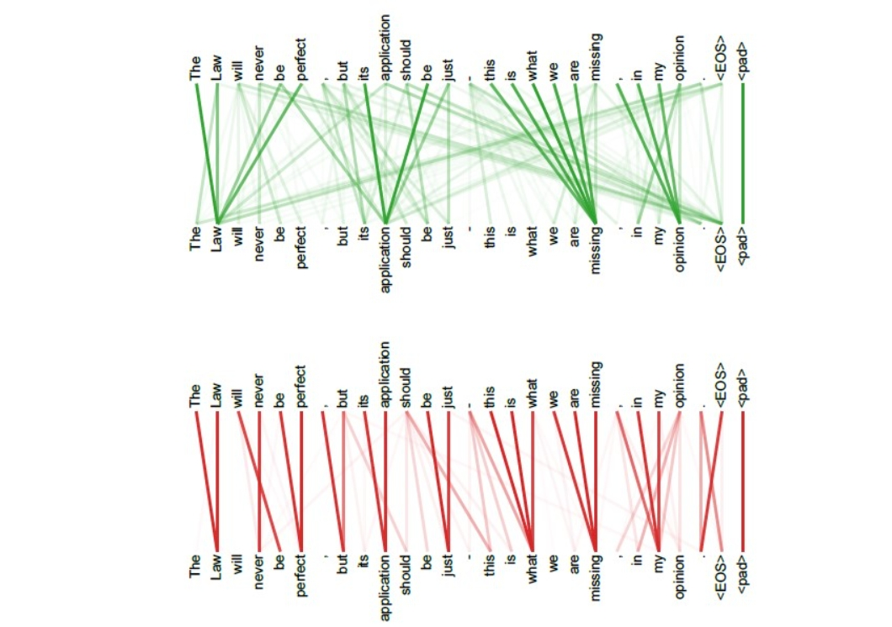
> 
> ​上层与下层分别是两个注意力头对同一段语句序列进行自注意力计算的结果，
> 可以看到，对于不同的注意力头，能够拟合不同层次的相关信息。
> 通过多个注意力头同时计算，能够更全面地拟合语句关系。

​Multi-Head attention 的整体计算流程如下：

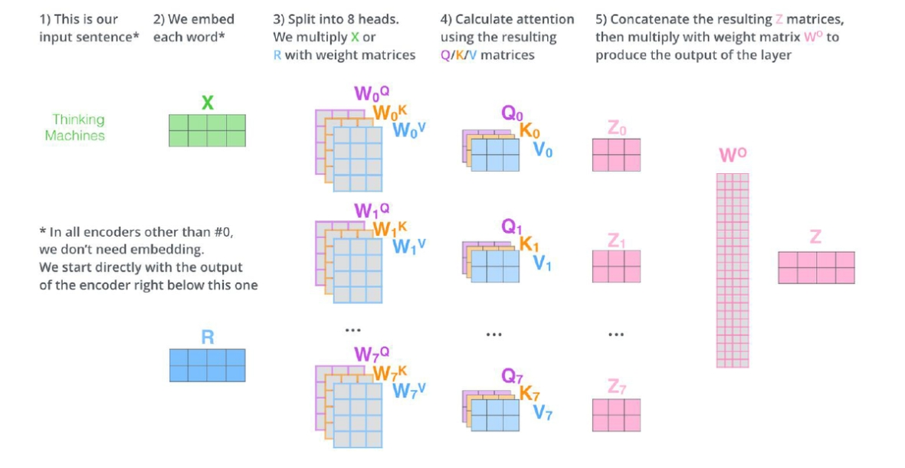

所谓的 Multi-Head Attention 机制其实就是将原始的输入序列进行多组的自注意力处理；
然后再将每一组得到的自注意力结果拼接起来，再通过一个线性层进行处理，
得到最终的输出。用公式可以表示为：

`$$\text{MultiHeadAttention}(Q, K, V) = Concat(\text{head}_{1}, \cdots, \text{head}_{n})W^{O}$$`

其中 `$\text{head}_{i} = \text{Attention}(QW^{Q}_{i}, KW_{i}^{K}, VW_{i}^{V})$`。

其最直观的代码实现并不复杂，即 `$n$` 个头就有 `$n$` 组 3 个参数矩阵，
每一组进行同样的注意力计算，但由于是不同的参数矩阵从而通过反向传播实现了不同的注意力结果，
然后将 `$n$` 个结果拼接起来输出即可。

但上述实现复杂度较高，可以通过矩阵运算巧妙地实现并行的多头计算，
其核心逻辑在于使用三个组合矩阵来代替了 `$n$` 个参数矩阵的组合。
此处手动实现一个 MultiHeadAttention 层（注意，加入了 Mask 矩阵和 Dropout 操作）：

```python
import torch.nn as nn
import torch

'''多头注意力计算模块'''
class MultiHeadAttention(nn.Module):

    def __init__(self, config, is_causal=False):
        # 构造函数
        # config: 配置对象
        super().__init__()
        # 隐藏层维度必须是头数的整数倍，因为后面我们会将输入拆成头数个矩阵
        assert config.n_embd % config.n_head == 0
        # Wq, Wk, Wv 参数矩阵，每个参数矩阵为 n_embd x n_embd
        # 这里通过三个组合矩阵来代替了n个参数矩阵的组合，其逻辑在于矩阵内积再拼接其实等同于拼接矩阵再内积，不理解的读者可以自行模拟一下，每一个线性层其实相当于n个参数矩阵的拼接
        self.c_attns = nn.ModuleList([nn.Linear(config.n_embd, config.n_embd, bias=config.bias) for _ in range(3)])
        # 输出的线性层，维度为 n_embd x n_embd
        self.c_proj = nn.Linear(config.n_embd, config.n_embd, bias=config.bias)
        # 注意力的 dropout
        self.attn_dropout = nn.Dropout(config.dropout)
        # 残差连接的 dropout
        self.resid_dropout = nn.Dropout(config.dropout)
        # 头数
        self.n_head = config.n_head
        # 隐藏层维度
        self.n_embd = config.n_embd
        # Dropout 概率
        self.dropout = config.dropout
        # 是否是解码器的 Casual LM
        self.is_causal = is_causal
        # 判断是否使用 Flash Attention，Pytorch 2.0 支持，即判断 torch.nn.functional.scaled_dot_product_attention 是否存在
        self.flash = hasattr(torch.nn.functional, 'scaled_dot_product_attention')
        
        # 如果不使用 Flash Attention，打印一个警告
        if not self.flash:
            print("WARNING: using slow attention. Flash Attention requires PyTorch >= 2.0")
            # 如果自己实现 MHSA，需要一个 causal mask，确保 attention 只能作用在输入序列的左边
            # 此处使用 register_buffer 注册一个 bias 属性
            # bias 是一个上三角矩阵，维度为 1 x 1 x block_size x block_size，block_size 为序列最大长度
            self.register_buffer("bias", torch.tril(torch.ones(config.block_size, config.block_size))
                                        .view(1, 1, config.block_size, config.block_size))

    def forward(self, query, key, value):
        # 输入为 query、key、value，维度为 (B, T, n_embed)
        # print("query",query.size())
        B, T, C = query.size() # batch size, sequence length, embedding dimensionality (n_embd)
        # 计算 Q、K、V，输入通过参数矩阵层，维度为 (B, T, n_embed) x (n_embed, n_embed) -> (B, T, n_embed)
        q, k, v  = [self.c_attns[i](x) for i, x in zip(range(3), (query, key, value))]
        # 将 Q、K、V 拆分成多头，维度为 (B, T, n_head, C // n_head)，然后交换维度，变成 (B, n_head, T, C // n_head)，因为在注意力计算中我们是取了后两个维度参与计算
        # 为什么要先按B*T*n_head*C//n_head展开再互换1、2维度而不是直接按注意力输入展开，是因为view的展开方式是直接把输入全部排开，然后按要求构造，可以发现只有上述操作能够实现我们将每个头对应部分取出来的目标
        k = k.view(B, T, self.n_head, C // self.n_head).transpose(1, 2)
        q = q.view(B, T, self.n_head, C // self.n_head).transpose(1, 2)
        v = v.view(B, T, self.n_head, C // self.n_head).transpose(1, 2)

        # 注意力计算 
        if self.flash:
            # 直接使用 Flash Attention
            y = torch.nn.functional.scaled_dot_product_attention(q, k, v, attn_mask=None, dropout_p=self.dropout if self.training else 0, is_causal=self.is_causal)
        else:
            # 手动实现注意力计算
            # 计算 QK^T / sqrt(d_k)，维度为 (B, nh, T, hs) x (B, nh, hs, T) -> (B, nh, T, T)
            att = (q @ k.transpose(-2, -1)) * (1.0 / math.sqrt(k.size(-1)))
            # 如果是解码器的 Casual LM，需要 mask 掉右上角的元素
            if self.is_causal:
                # 这里截取到序列长度，因为有些序列可能比 block_size 短
                att = att.masked_fill(self.bias[:,:,:T,:T] == 0, float('-inf'))
            # 计算 softmax，维度为 (B, nh, T, T)
            att = F.softmax(att, dim=-1)
            # Attention Dropout
            att = self.attn_dropout(att)
            # V * Score，维度为(B, nh, T, T) x (B, nh, T, hs) -> (B, nh, T, hs)
            y = att @ v 
        # 将多头的结果拼接起来, 先交换维度为 (B, T, n_head, C // n_head)，再拼接成 (B, T, n_head * C // n_head)
        # contiguous 函数用于重新开辟一块新内存存储，因为Pytorch设置先transpose再view会报错，因为view直接基于底层存储得到，然而transpose并不会改变底层存储，因此需要额外存储
        y = y.transpose(1, 2).contiguous().view(B, T, C)

        # 经过输出层计算，维度为 (B, T, C)，再经过线性层残差连接
        y = self.resid_dropout(self.c_proj(y))
        return y
```

## Encoder-Decoder 结构

### Seq2Seq 模型

> [Seq2Seq 模型介绍](https://wangzhefeng.com/note/2022/04/05/dl-seq2seq/)

Seq2Seq，即序列到序列，是一种经典的 NLP 任务。具体而言，
是指模型输入的是一个自然语言序列 `$\text{input} = (x_{1}, x_{2}, \cdots, x_{n})$`，
输出的是一个可能不等长的自然语言序列 `$\text{output} = (y_{1}, y_{2}, \cdots, y_{m})$`。
事实上，Seq2Seq 是 NLP 最经典的任务，几乎所有的 NLP 任务都可以视为 Seq2Seq 任务。
例如文本分类任务，可以视为输出长度为 1 的目标序列（如在上式中 `$m=1$`）；
词性标注任务，可以视为输出于输入序列等长的目标序列（如在上式中 `$m=n$`）。
机器翻译任务即是一个经典的 Seq2Seq 任务，例如，输入是 `“今天天气真好”`，
输出是 `“Today is a good day.”`。

Transformer 是一个经典的 Seq2Seq 模型，即模型的输入为文本序列，输出为另一个文本序列。
Transformer 的整体模型结构如下图：


Transformer 整体由一个 Encoder，一个 Decoder 外加一个 Softmax 分类器与两层编码层构成。

作为一个 Seq2Seq 模型，在训练时，Transformer 的训练语料为若干个 **句对**，
具体子任务可以是机器翻译、阅读理解、机器对话等。此处以德语到英语的机器翻译任务为例。
在训练时，句对会被划分为输入语料和输出语料，输入语料将从左侧通过编码层进入 Encoder，
输出语料将从右侧通过编码层进入 Decoder。
Encoder 的主要任务是对输入语料进行编码再输出给 Decoder，
Decoder 再根据输出语料的历史信息与 Encoder 的输出进行计算，
输出结果再经过一个线性层和 Softmax 分类器即可输出预测的结果概率，整体逻辑如下图：


> 六层 Encoder 和 Decoder 结构。
>
> 每个 Encoder 和 Decoder 之间不共享权重。

### Full-connected Neural Newtork

每一个 Encoder 块内部其实是一个 **多头自注意力层** 再加一个 **全连接层**，
在 Transformer 中，一个全连接网络一般包括 **两个线性层**，线性层之间使用 **ReLU 函数** 作为激活函数。

```python
class MLP(nn.Module):
    """
    全连接模块
    """

    def __init__(self, config):
        """
        Transformer 的全连接模块有两个线性层，中间加了一个 RELU 激活函数
        此处将隐藏层维度设为输出层的四倍，也可以设置成其他维度
        """
        super().__init__()
        self.c_fc = nn.Linear(config.n_embd, 4 * config.n_embd, bias = config.bias)
        self.relu = nn.ReLU()
        self.c_proj = nn.Linear(4 * config.n_embd, config.n_embd, bias = config.bias)
        self.dropout = nn.Dropout(config.dropout)

    def forward(self, x):
        x = self.c_fc(x)
        x = self.relu(x)
        x = self.c_proj(x)
        x = self.dropout(x)

        return x
```

### Layer Norm

Layer Norm，也就是层归一化，是深度学习中经典的 **归一化操作**。
**归一化核心是为了让不同层输入的取值范围或者分布能够比较一致。**
由于深度神经网络中每一层的输入都是上一层的输出，因此多层传递下，
对网络中较高的层，之前的所有神经层的参数变化会导致其输入的分布发生较大的改变。
也就是说，随着神经网络参数的更新，各层的输出分布是不相同的，
且差异会随着网络深度的增大而增大。但是，需要预测的条件分布始终是相同的，
从而也就造成了预测的误差。因此，在深度神经网络中，往往需要归一化操作，
将每一层的输入都归一化成标准正态分布。

神经网络主流的归一化一般有两种：**批归一化(Batch Norm)**、**层归一化(Layer Norm)**。

> **批归一化**是指在一个 mini-batch 上进行归一化，相当于对样本拆分出来一部分作为一个 batch。
> 
> 首先计算 batch 样本的均值：
> 
> `$$\mu_{j} = \frac{1}{m}\sum_{i=1}^{m}Z_{j}^{i}$$`
> 
> 再计算样本的方差：
> 
> `$$\sigma^{2}=\frac{1}{m}\sum_{i=1}^{m}(Z_{j}^{i} - \mu_{j})^{2}$$`
> 
> 其中，`$Z_j^{i}$` 是样本 `$i$` 在第 `$j$` 个维度上的值，`$m$` 就是 mini-batch 的大小。
> 
> 最后，对每个样本的值减去均值，再除以标准差，
> 来将这一个 mini-batch 的样本的分布转化为标准正态分布（此处加上 `$\epsilon$` 这一极小量是为了避免分母为 0）：
> 
> `$$\widetilde{Z}_{j} = \frac{Z_{j} - \mu_{j}}{\sqrt{\sigma^{2} + \epsilon}}$$` 
> 
> 但是，批归一化存在一些缺陷，例如：
> 
> * 当显存有限，mini-batch 较小时，Batch Norm 取的样本的均值和方差不能反映全局的统计分布信息，
>   从而导致效果变差；
> * 对于在时间维度展开的 RNN，不同句子的同一分布大概率不同，
>   所以 Batch Norm 的归一化会失去意义；
> * 在训练时，Batch Norm 需要保存每个 step 的统计信息（均值和方差）。
>   在测试时，由于变长句子的特性，测试集可能出现比训练集更长的句子，
>   所以对于后面位置的 step，是没有训练的统计量使用的；
> * 应用 Batch Norm，每个 step 都需要去保存和计算 batch 统计量，耗时又耗力。
> 
> 因此，出现了在深度神经网络中更常用、效果更好的层归一化（Layer Norm）。
> 相较于 Batch Norm 在每一层统计所有样本的均值和方差，
> Layer Norm 在每个样本上计算其所有层的均值和方差，从而使每个样本的分布达到稳定。
> Layer Norm 的归一化方式其实和 Batch Norm 是完全一样的，只是统计统计量的维度不同。

**Layer Norm** 是 Transformer 的一个重要组成部分，模型在每一层网络计算之前都进行了 Layer Norm 操作。
注意，在论文原图中，是先进行注意力计算和全连接计算再进行 Layer Norm 操作，这样也称为 **Post Norm**；
但是在事实上实现 Transformer 模型时，作者其实将 Layer Norm 放在了注意力计算和全连接计算之前，
从而将输入规范化到同一区间，减少模型训练的波动，称为 **Pre Norm** 操作。**目前，Pre Norm 是较为常用的策略。**

由于 Pytorch 中自带的 Layer Norm 层必须存在偏置，我们此处手动实现一个 Layer Norm 层：

```python
class LayerNorm(nn.Module):
    """
    层规范化模块
    """
    # 在 Pytorch 的 LayerNorm 基础上添加了偏置，
    # 因为 Pytorch 的 LayerNorm 不支持偏置为 None

    def __init__(self, ndim, bias):
        super().__init__()
        # 初始化参数和偏置
        self.weight = nn.Parameter(torch.ones(ndim))
        self.bias = nn.Parameter(torch.zeros(ndim)) if bias else None

    def forward(self, input):
        # 直接调用 Pytorch 的 LayerNorm
        return F.layer_norm(
            input, 
            self.weight.shape, 
            self.weight, 
            self.bias, 
            1e-5
        )
```

### 残差链接

由于 Transformer 模型结构较复杂、层数较深，**​为了避免模型退化**，
Transformer 采用了残差连接的思想来连接每一个子层。
**残差连接，即下一层的输入不仅是上一层的输出，还包括上一层的输入。**
残差连接允许最底层信息直接传到最高层，让高层专注于残差的学习。

​例如，在 Encoder 中，在第一个子层，输入进入多头自注意力层的同时会直接传递到该层的输出，
然后该层的输出会与原输入相加，再进行标准化。在第二个子层也是一样。
即：

`$$\rm x = x + MultiHeadSelfAttention(LayerNorm(x))$$` 
`$$\rm output = x + FNN(LayerNorm(x))$$`

在代码实现中，通过在 Encoder Layer 的 `forward` 计算中加上原值来实现残差连接：

```python
def forward(self, x):
    # 此处通过加x实现了残差连接
    x = self.ln_1(x)
    # Encoder 使用 Self Attention，所以 Q、K、V 都是 x
    x = x + self.attn(x, x, x)
    x = x + self.mlp(self.ln_2(x))
    return x
```

在上文代码中，`self.ln_1` 和 `self.ln_2` 都是 `LayerNorm` 层，
`self.attn` 是注意力层，而 `self.mlp` 是全连接层。

### Encoder

在实现上述组件之后，可以搭建起 Transformer 的 Encoder。
Encoder 由 N 个 Encoder Layer 组成，
每一个 Encoder Layer 包括一个**多头注意力层**和一个**全连接层**。

```python
class EncoderLayer(nn.Module):
    """
    Encoder Layer 
    """

    def __init__(self, config):
        super().__init__()
        # 一个 Layer 中有两个 LayerNorm，分别在 Attention 之前和 MLP 之前
        self.ln_1 = LayerNorm(config.n_embd, bias=config.bias)
        # Encoder 不需要掩码，传入 is_causal=False
        self.attn = MultiHeadAttention(config, is_causal=False)
        self.ln_2 = LayerNorm(config.n_embd, bias=config.bias)
        self.mlp = MLP(config)

    def forward(self, x):
        # 此处前面加了 x 实则是实现了残差连接
        x = self.ln_1(x)
        # Encoder 使用 Self Attention，所以 Q、K、V 都是 x
        # print("x",x.size())
        x = x + self.attn(x, x, x)
        x = x + self.mlp(self.ln_2(x))
        return x
```

然后搭建一个 Encoder，由 **N 个 Encoder Layer** 组成，在最后会加入一个 **Layer Norm** 实现规范化：

```python
class Encoder(nn.Module):
    """
    Encoder
    """

    def __init__(self, config):
        super(Encoder, self).__init__() 
        # 一个 Encoder 由 N 个 Encoder Layer 组成
        self.layers = nn.ModuleList([EncoderLayer(config) for _ in range(config.n_layer)])
        self.norm = LayerNorm(config.n_embd, bias=config.bias)

    def forward(self, x):
        "分别通过 N 层 Encoder Layer"
        for layer in self.layers:
            x = layer(x)
        return self.norm(x)
```

### Decoder

类似的，也可以先搭建 Decoder Layer，再将 N 个 Decoder Layer 组装为 Decoder。
但是和 Encoder 不同的是，Decoder 由 **两个注意力层** 和 **一个全连接层** 组成。

* 第一个注意力层是一个 **掩码自注意力层**，即使用 Mask 的注意力计算，
  保证每一个 token 只能使用该 token 之前的注意力分数；
* 第二个注意力层是一个 **多头注意力层**，该层将使用第一个注意力层的输出作为 Query，
  使用 Encoder 的输出作为 Key 和 Value，来计算注意力分数；
* 最后，再经过全连接层。

```python
class DecoderLayer(nn.Module):
    """
    Decoder Layer 
    """

    def __init__(self, config):
        super().__init__()
        # 一个 Layer 中有三个 LayerNorm，分别在 Mask Attention 之前、Self Attention 之前和 MLP 之前
        self.ln_1 = LayerNorm(config.n_embd, bias=config.bias)
        # Decoder 的第一个部分是 Mask Attention，传入 is_causal=True
        self.m_attn = MultiHeadAttention(config, is_causal=True)
        self.ln_2 = LayerNorm(config.n_embd, bias=config.bias)
        # Decoder 的第二个部分是 类似于 Encoder 的 Attention，传入 is_causal=False
        self.attn = MultiHeadAttention(config, is_causal=False)
        self.ln_3 = LayerNorm(config.n_embd, bias=config.bias)
        # 第三个部分是 MLP
        self.mlp = MLP(config)

    def forward(self, x, enc_out):
        # 此处前面加了 x 实则是实现了残差连接
        x = self.ln_1(x)
        # 第一部分是一个 Mask Self Attention，Q、K、V 都是 x
        x = x + self.m_attn(x, x, x)
        x = self.ln_2(x)
        # 第二部分是一个类似于 Encoder 的 Attention，Q 是 x，K、V 是 Encoder 的输出
        x = x + self.attn(x, enc_out, enc_out)
        x = self.ln_3(x)
        x = x + self.mlp(x)
        return x
```

## Transformer 模型

### Embedding

在 NLP 任务中，往往需要将自然语言的输入转化为机器可以处理的向量。
在深度学习中，承担这个任务的组件就是 **Embedding 层**。

Embedding 层其实是一个存储固定大小的词典的嵌入向量查找表。
也就是说，在输入神经网络之前，往往会先让自然语言输入通过分词器 tokenizer，
分词器的作用是把自然语言输入切分成 `token` 并转化成一个固定的 `index`。
当然，在实际情况下，tokenizer 的工作会比这更复杂。例如，分词有多种不同的方式，
可以切分成词、切分成子词、切分成字符等，而词表大小则往往高达数万数十万。
此处不赘述 tokenizer 的详细情况。

> 例如，如果将词表大小设为 4，输入 `“我喜欢你”`，那么，分词器可以将输入转化成：
> 
> ```
> input: 我
> output: 0
> 
> input: 喜欢
> output: 1
> 
> input：你
> output: 2
> ```

因此，Embedding 层的输入往往是一个形状为 `(batch_size, seq_len, 1)` 的矩阵，
第一个维度是一次批处理的数量，第二个维度是自然语言序列的长度，
第三个维度则是 token 经过 tokenizer 转化成的 index 值。

> 例如，对上述输入，Embedding 层的输入会是：
> 
> ```
> [[0, 1, 2]]
> ```
> 
> 其 batch_size 为 1，seq_len 为 3，转化出来的 index 如上。

而 Embedding 内部其实是一个可训练的 `(Vocab_size，embedding_dim)` 的权重矩阵，
词表里的每一个值，都对应一行维度为 `embedding_dim` 的向量。对于输入的值，
会对应到这个词向量，然后拼接成 `(batch_size，seq_len，embedding_dim)` 的矩阵输出。

上述实现并不复杂，可以直接使用 `torch` 中的 `Embedding` 层：

```
self.tok_embeddings = nn.Embedding(args.vocab_size, args.dim)
```

### Positional Encoding

Attention 机制可以实现良好的并行计算，但同时，其注意力计算的方式也导致序列中相对位置的丢失。

在 RNN、LSTM 中，输入序列会沿着语句本身的顺序被依次递归处理，
因此输入序列的顺序提供了极其重要的信息，这也和自然语言的本身特性非常吻合。
但从上文对 Attention 机制的分析可以发现，在 Attention 机制的计算过程中，
对于序列中的每一个 token，其他各个位置对其来说都是平等的，
即 `“我喜欢你”` 和 `“你喜欢我”` 在 Attention 机制看来是完全相同的，
但无疑这是 Attention 机制存在的一个巨大问题。

因此，**为使用序列顺序信息，保留序列中的相对位置信息，
Transformer 采用了位置编码(Positional Encoding) 机制**，
该机制也在之后被多种模型沿用。**​位置编码(Positional Encoding)**，
即根据序列中 token 的相对位置对其进行编码，再将位置编码加入词向量编码中。

位置编码的方式有很多，Transformer 使用了 **正余弦函数** 来进行位置编码（绝对位置编码 Sinusoidal），
其编码方式为：

`$$\text{PE}(\text{pos}, 2i) = sin(pos / 10000^{2i/d_{model}})$$`
`$$\text{PE}(\text{pos}, 2i+1) = cos(pos / 10000^{2i/d_{model}})$$`

上式中，`$\text{pos}$` 为 token 在句子中的位置，
`$2i$` 和 `$2i+1$` 则是指示了 token 是奇数位置还是偶数位置，
从上式中可以看出对于奇数位置的 token 和偶数位置的 token，
Transformer 采用了不同的函数进行编码。

> 下面以一个简单的例子来说明位置编码的计算过程：假如输入的是一个长度为 4 的句子 `"I like to code"`，
> 可以得到下面的词向量矩阵 `$\rm x$`，其中每一行代表的就是一个词向量，
> `$\rm x_0=[0.1,0.2,0.3,0.4]$` 对应的就是 `“I”` 的词向量，
> 它的 `$\text{pos}$` 就是为 0，以此类推，第二行代表的是 `“like”` 的词向量，
> 它的 `$\text{pos}$` 就是 1：
> 
> `$$ \rm x = \begin{bmatrix} 
> 0.1 & 0.2 & 0.3 & 0.4 \\ 
> 0.2 & 0.3 & 0.4 & 0.5 \\ 
> 0.3 & 0.4 & 0.5 & 0.6 \\ 
> 0.4 & 0.5 & 0.6 & 0.7 
> \end{bmatrix} $$`
> 
> ​则经过位置编码后的词向量为：
> 
> `$$\begin{align}
> \rm x_{PE}
> &= \begin{bmatrix} 
> 0.1 & 0.2 & 0.3 & 0.4 \\ 
> 0.2 & 0.3 & 0.4 & 0.5 \\ 
> 0.3 & 0.4 & 0.5 & 0.6 \\ 
> 0.4 & 0.5 & 0.6 & 0.7 \end{bmatrix} \\
> &+ \begin{bmatrix} 
> \sin(\frac{0}{10000^0}) & \cos(\frac{0}{10000^0}) & \sin(\frac{0}{10000^{2/4}}) & \cos(\frac{0}{10000^{2/4}}) \\ 
> \sin(\frac{1}{10000^0}) & \cos(\frac{1}{10000^0}) & \sin(\frac{1}{10000^{2/4}}) & \cos(\frac{1}{10000^{2/4}}) \\ 
> \sin(\frac{2}{10000^0}) & \cos(\frac{2}{10000^0}) & \sin(\frac{2}{10000^{2/4}}) & \cos(\frac{2}{10000^{2/4}}) \\ 
> \sin(\frac{3}{10000^0}) & \cos(\frac{3}{10000^0}) & \sin(\frac{3}{10000^{2/4}}) & \cos(\frac{3}{10000^{2/4}}) \end{bmatrix} \\
> &= \begin{bmatrix} 
> 0.1 & 1.2 & 0.3 & 1.4 \\ 
> 1.041 & 0.84 & 0.41 & 1.49 \\ 
> 1.209 & -0.016 & 0.52 & 1.59 \\ 
> 0.541 & -0.489 & 0.895 & 1.655 \end{bmatrix}
> \end{align}$$` 
> 
> 可以使用如下的代码来获取上述例子的位置编码：
> 
> ```python
> import numpy as np
> import matplotlib.pyplot as plt
> 
> def PositionEncoding(seq_len, d_model, n = 10000):
>     P = np.zeros((seq_len, d_model))
>     for k in range(seq_len):
>         for i in np.arange(int(d_model/2)):
>             denominator = np.power(n, 2*i/d_model)
>             P[k, 2*i] = np.sin(k/denominator)
>             P[k, 2*i+1] = np.cos(k/denominator)
>         
>     return P
> 
> P = PositionEncoding(seq_len=4, d_model=4, n=100)
> print(P)
> ```
> 
> ```
> [[ 0.          1.          0.          1.        ]
>  [ 0.84147098  0.54030231  0.09983342  0.99500417]
>  [ 0.90929743 -0.41614684  0.19866933  0.98006658]
>  [ 0.14112001 -0.9899925   0.29552021  0.95533649]]
> ```
 
这样的位置编码主要有两个好处：

1. 使 `$\text{PE}(\cdot)$` 能够适应比训练集里面所有句子更长的句子，
   假设训练集里面最长的句子是有 20 个单词，突然来了一个长度为 21 的句子，
   则使用公式计算的方法可以计算出第 21 位的 Embedding；
2. 可以让模型容易地计算出相对位置，对于固定长度的间距 `$k$`，
   `$\text{PE}(\text{pos}+k)$` 可以用 `$\text{PE}(\text{pos})$` 计算得到。
   因为 `$sin(A+B) = sin(A)cos(B) + cos(A)sin(B)$`，`$cos(A+B) = cos(A)cos(B) - sin(A)sin(B)$`。

> 当然，也可以通过严谨的数学推导证明该编码方式的优越性。
> 
> 原始的 Transformer Embedding 可以表示为：
> 
> `$$f(\cdots, x_{m}, \cdots, x_{n}, \cdots) = f(\cdots, x_{n}, \cdots, x_{m}, \cdots)$$`
> 
> 很明显，这样的函数是不具有不对称性的，也就是无法表征相对位置信息。
> 
> 其实，想要得到这样一种编码方式：
> 
> `$$\widetilde{f}(\cdots, x_{m}, \cdots, x_{n}, \cdots) = f(\cdots, x_{m} +p_{m}, \cdots, x_{n} + p_{n}, \cdots)$$`
> 
> 这里加上的 `$p_{m}$`，`$p_{n}$` 就是位置编码。
> 
> 接下来将 `$f(\cdots, x_{m}+p_{m}, \cdots, x_{n}+p_{n}, \cdots)$` 在 `$m, n$` 两个位置做泰勒展开：
> 
> `$$\begin{align}
> \tilde{f} 
> \approx f 
> &+ \boldsymbol{p}_m^{\top} \frac{\partial f}{\partial \boldsymbol{x}_m} + \boldsymbol{p}_n^{\top} \frac{\partial f}{\partial \boldsymbol{x}_n} \\
> &+ \frac{1}{2}\boldsymbol{p}_m^{\top} \frac{\partial^2 f}{\partial \boldsymbol{x}_m^2}\boldsymbol{p}_m + \frac{1}{2}\boldsymbol{p}_n^{\top} \frac{\partial^2 f}{\partial \boldsymbol{x}_n^2}\boldsymbol{p}_n + 
> \underbrace{\boldsymbol{p}_m^{\top} \frac{\partial^2 f}{\partial \boldsymbol{x}_m \partial \boldsymbol{x}_n}\boldsymbol{p}_n}
> _{\boldsymbol{p}_m^{\top} \boldsymbol{\mathcal{H}} \boldsymbol{p}_{n}}
> \end{align}$$`
> 
> 可以看到第 1 项与位置无关，2~5 项仅依赖单一位置，
> 第 6 项（`$f$` 分别对 `$m$`、`$n$` 求偏导）与两个位置有关，
> 所以希望第 6 项（`$p_{m}^{T} H p_{n}$`）表达相对位置信息，
> 即求一个函数 `$g(\cdot)$` 使得 `$p_{m}^{T} H p_{n} = g(m-n)$`。
> 
> 假设 `$H$` 是一个单位矩阵，则：
> 
> `$$p_{m}^{T} H p_{n} = p_{m}^{T}p_{n} = <p_{m}, p_{n}> = g(m-n)$$`
> 
> 通过将向量 `$[x,y]$` 视为复数 `$x+yi$`，基于复数的运算法则构建方程：
> 
> `$$<p_{m}, p_{n}> = Re[p_{m}p_{n}^{*}]$$`
> 
> 再假设存在复数 `$q_{m-n}$` 使得：
> 
> `$$p_{m} p_{n}^{*} = q_{m-n}$$`
> 
> 使用复数的指数形式求解这个方程，得到二维情形下位置编码的解：
> 
> `$$p_{m} = e^{im\theta} \Leftrightarrow p_{m} = (\cos m \theta \sin m \theta)$$`
> 
> 由于内积满足线性叠加性，所以更高维的偶数维位置编码，可以表示为多个二维位置编码的组合：
> 
> `$$\boldsymbol{p}_{m} = \begin{pmatrix}
> e^{\text{i} m \theta_{0}} \\ 
> e^{\text{i} m \theta_{1}} \\ 
> \vdots \\ 
> e^{\text{i} m \theta_{d/2-1}}
> \end{pmatrix} 
> \quad \Leftrightarrow \quad 
> \boldsymbol{p}_{m} = \begin{pmatrix}
> \cos m \theta_{0} \\ 
> \sin m \theta_{0} \\ 
> \cos m \theta_{1} \\ 
> \sin m \theta_{1} \\ 
> \vdots \\ 
> \cos m \theta_{d/2-1} \\ 
> \sin m \theta_{d/2-1} 
> \end{pmatrix}$$`
> 
> 再取 `$\theta_{i} = 10000^{-2i/d}$`（该形式可以使得随着 `$|m−n|$` 的增大，
> `$<p_m, p_n>$` 有着趋于零的趋势，这一点可以通过对位置编码做积分来证明，
> 而 base 取为 10000 是实验结果），就得到了上文的编码方式。
> 
> 当 `$H$` 不是一个单位矩阵时，
> 因为模型的 Embedding 层所形成的 `$d$` 维向量之间任意两个维度的相关性比较小，
> 满足一定的解耦性，我们可以将其视作对角矩阵，那么使用上述编码：
> 
> `$$\boldsymbol{p}_{m}^{\top} \boldsymbol{\mathcal{H}} \boldsymbol{p}_{n}
> =\sum_{i=1}^{d/2} \boldsymbol{\mathcal{H}}_{2i,2i} \cos m\theta_{i} \cos n \theta_{i} + \boldsymbol{\mathcal{H}}_{2i+1,2i+1} \sin m \theta_{i} \sin n \theta_{i}$$`
> 
> 通过积化和差：
> 
> `$$\sum_{i=1}^{d/2} \Big[\frac{1}{2}\left(\boldsymbol{\mathcal{H}}_{2i,2i} + \boldsymbol{\mathcal{H}}_{2i+1,2i+1}\right) \cos (m-n)\theta_i + \frac{1}{2}\left(\boldsymbol{\mathcal{H}}_{2i,2i} - \boldsymbol{\mathcal{H}}_{2i+1,2i+1}\right) \cos (m+n)\theta_{i}\Big]$$`
> 
> 说明该编码仍然可以表示相对位置。
> 
> 上述​编码结果示例如下：
> 
> 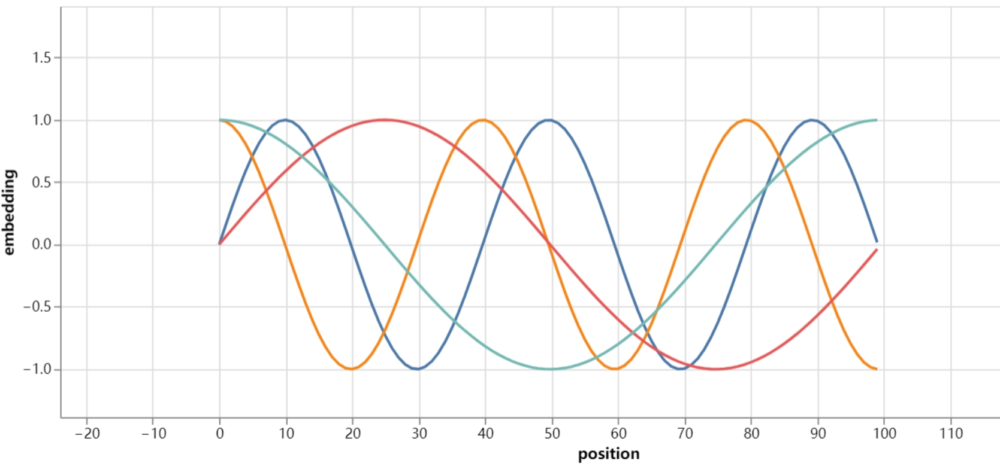

基于上述原理，我们实现一个​位置编码层：

```python
class PositionalEncoding(nn.Module):
    """
    位置编码模块
    """

    def __init__(self, config):
        super(PositionalEncoding, self).__init__()
        # Dropout 层
        self.dropout = nn.Dropout(p=config.dropout)

        # block size 是序列的最大长度
        pe = torch.zeros(config.block_size, config.n_embd)
        position = torch.arange(0, config.block_size).unsqueeze(1)
        div_term = torch.exp(
            torch.arange(0, config.n_embd, 2) * -(math.log(10000.0) / config.n_embd)
        )
        pe[:, 0::2] = torch.sin(position * div_term)
        pe[:, 1::2] = torch.cos(position * div_term)
        pe = pe.unsqueeze(0)
        self.register_buffer("pe", pe)

    def forward(self, x):
        x = x + self.pe[:, : x.size(1)].requires_grad_(False)
        return self.dropout(x)
```

### Transformer

在实现上述组件之后，可以根据 Transformer 的模型结构将整个模型搭建起来了。
Transformer 整体包括一个 Embedding 层，一个位置编码层，一个 Encoder（包括 N 个 Encoder Layer），
一个 Decoder（包括 N 个 Decoder Layer），最后还有一个从隐藏层维度映射到词表大小的线性层，
从最后线性层输出出来再计算 Softmax，即能得到该预测结果映射到词表上的概率值。

可以搭建这样一个 Transformer，并实现其部分方法：

```python
# TODO
```

在上述代码中，主要实现了模型的 **构造函数**、**前向计算函数** 和 **推理阶段的生成函数**。

* **构造函数** 根据传入的参数构造模型的每个层；
* **前向计算函数** 主要根据模型结构依次在各层之间进行传递；
    - 前向计算到最后一层，如果同时传入了 `label`，即训练阶段，
      那么通过最后一层之后与 `label` 计算交叉熵损失函数；
    - 如果没有 label，即推理阶段，那么直接通过最后一层得到结果即可。
* **推理阶段的生成函数** 核心在于需要依次生成，因为 Seq2Seq 任务，在生成时以 LM 的形式生成，
  如果要生成长度为 `$N$` 的目标序列，那么会连续推理 `$N$` 次，
  每次将推理得到的结果附加到输入中再进行下一次生成。

通过上述代码，即可实现一个完整的、可运行的 Transformer 模型。

# Transformer 训练

## Transformer 训练概要

已经讲了 Transformer 的前向过程，现在来看下训练的内容。训练时，
未训练的模型会通过一样的前向过程，但由于是在有标签的训练集上训练，可以对比输出和真实值。

为了可视化，假设输出单词只包含 6 个词：

> `a`, `am`, `i`, `thanks`, `student`, `"<eos>"`


一旦定义了输出词表 (output vocabulary)，能用相同长度的向量去构建词表里的每个词，
这边是独热编码，举个例子，可以编码 `am` 成如下向量：


## Transformer 损失函数

接下来，讨论下模型的损失函数，在训练阶段用于优化的度量指标，使得模型训练得更加准确。

假设我们在训练模型，训练模型实现将 `"merci"` 翻译成 `"thanks"`。
这意味着，想输出的概率分布指向词 `"thanks"`。但因为模型还未训练，它还不可以发生：

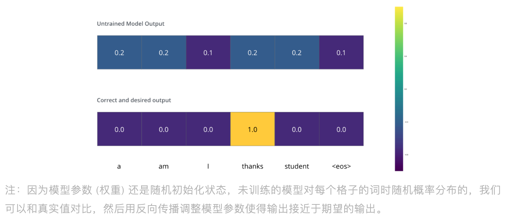

怎么对比两个概率分布？简单相减就好(对于细节，可以看交叉熵和 KL 散度相关资料)。
注意这只是个最简单的例子，更真实情况下，我们会用一个句子，例如 `je suis étudiant`，
期待输出 `i am a student`。在这里是希望模型能够成功输出概率分布：

* 每个概率分布被表征成一个长度为词表尺寸(`vocab_size`)的向量 (简单例子为 6，但现实是 3 万或 5 万)
* 第一个概率分布有最高的概率格子是在词 `"i"` 上
* 第二个概率分布有最高的概率格子是在词 `"am"` 上
* ...
* 直到第五个概率分布指向 `<end of sentence>` 符号，这里也有格子关联到它


在足够大的数据集上训练模型足够多的时间，期望生成的概率分布会如下所示：


现在，因为模型每步生成一个输出，可以假设模型选择最高概率的词，而丢弃剩余的词，
这种方式称为贪婪解码。另一种方式是便是 beam search 了，比方说第一步预测时，'I' 和 'a' 是两个 Top 概率词，
然后，如果以 'I' 和 'a' 分别作为第一个预测值，去进行下一步预测，
如果 'I' 作为第一词预测第二个词下的误差比 'a' 作为第一词预测第二个词下的误差小，
那么便保留 'I' 作为第一词，不断重复这个过程。在例子中，
beam_size 是 2(意味着任何时候，两个词 (未完成的翻译) 的假设都被保留在 memory 中)，
然后 top_beams 也是 2 个(意味着会返回 2 个翻译)，这些都是超参可以调整的。

# Transformer 通俗解释

## Tokenization 和 Embedding

```
原始文本 → 分词(Tokenization) → 嵌入(Embedding) → 模型
```

Tokenization 是将原始文本分割为一个个 token。

嵌入(Embedding)是使用一堆数字对每个 token（大约一个词）进行有意义的表示。
这个嵌入是提供给语言模型作为输入的。


<!-- <image src="images/tf-attention1.jpg" width=50% align="center"> -->

## Modeling tokens

语言建模的核心思想是理解语言中的结构和模式。
通过对句子中的单词（tokens）建模，可以捕捉文本的上下文和含义。

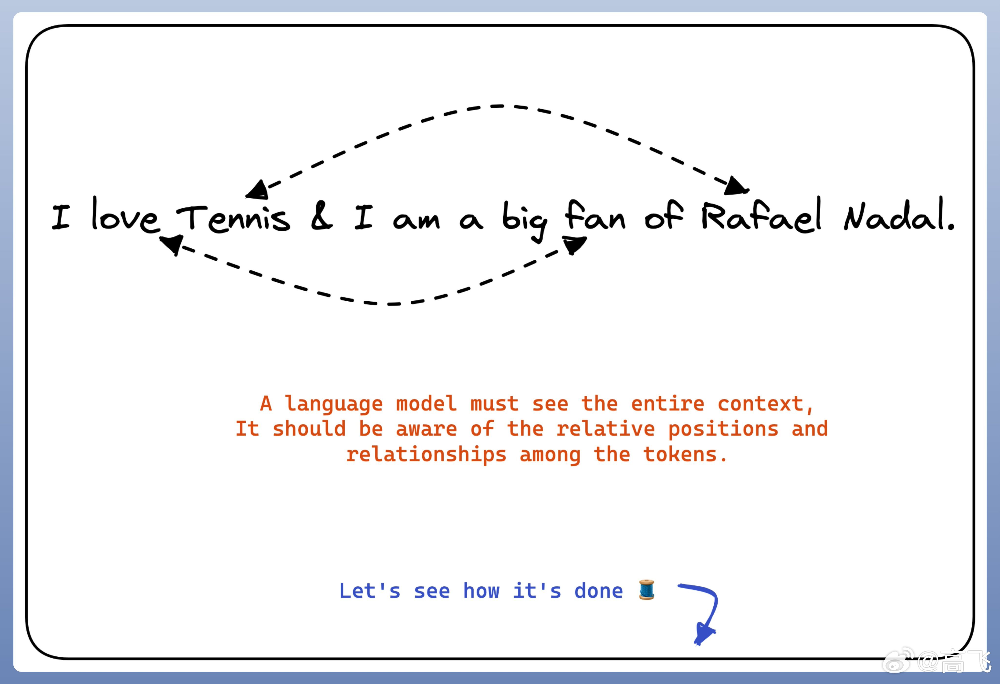
<!-- <image src="images/tf-attention2.jpg" width=50%> -->

## Attention

现在自我关注是一种帮助建立这些关系的通信机制，表达为概率分数。
每个 token 都会给自己最高分，并根据它们的相关性给其他 tokens 分数。
您可以将其视为一个有向图（Directed Graph）。


<!-- <image src="images/tf-attention3.jpg" width=50%> -->

## Query-Key-Value vector

了解这些概率/注意力分数是如何获得的，必须理解 3 个关键术语：

* 查询向量
* 关键向量
* 价值向量

这些向量是通过将输入嵌入乘以三个可训练的权重矩阵而创建的。

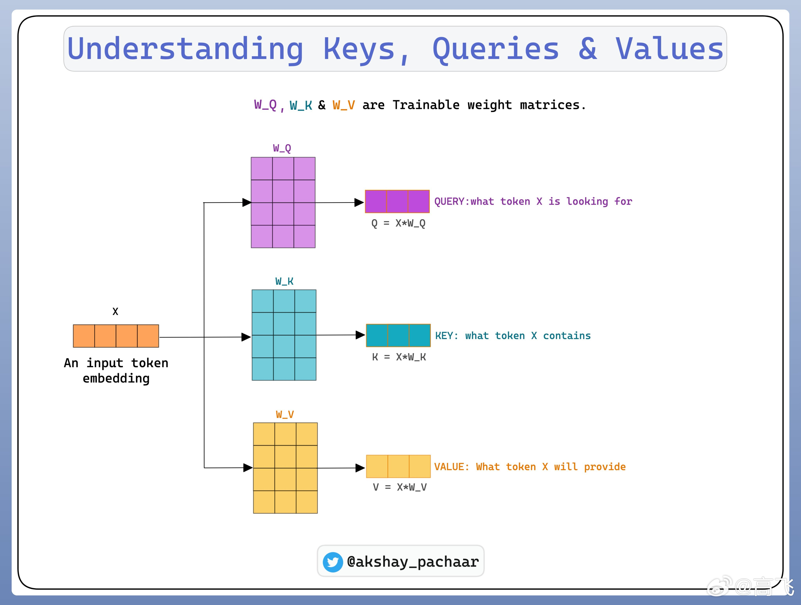
<!-- <image src="images/tf-attention4.jpg" width=50%> -->

## Context aware Embedding

现在更全面地了解输入嵌入是如何与键、查询和数值结合以获得实际的注意力分数的。
获取密钥、查询和值后，将它们合并以创建一组新的上下文感知嵌入。


<!-- <image src="images/tf-attention5.jpg" width=50%> -->

## pytorch code

使用 PyTorch 实现自注意力，再也不会更简单了！这非常直观！

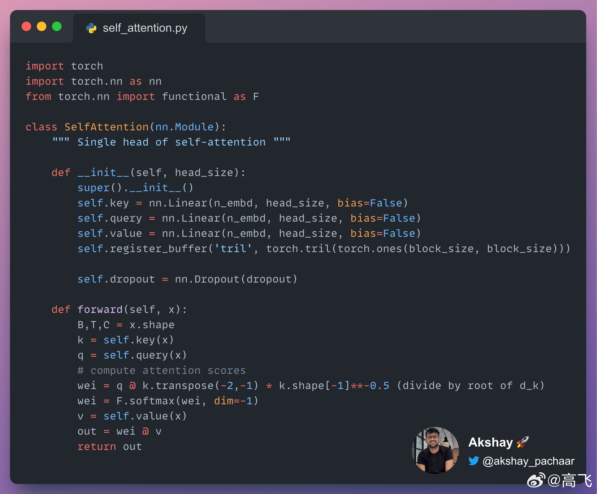
<!-- <image src="images/tf-attention6.jpg" width=50%> -->

# Transformer CheatSheet

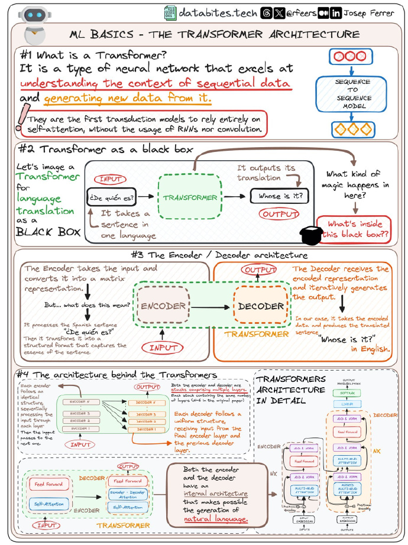

# Transformer 要点问题

1. Transformer 是如何解决长距离依赖的问题的？
    - Transformer 是通过引入 Scale-Dot-Product 注意力机制来融合序列上不同位置的信息，从而解决长距离依赖问题。
      以文本数据为例，在循环神经网络 LSTM 结构中，输入序列上相距很远的两个单词无法直接发生交互，
      只能通过隐藏层输出或者细胞状态按照时间步骤一个一个向后进行传递。
      对于两个在序列上相距非常远的单词，中间经过的其它单词让隐藏层输出和细胞状态混入了太多的信息，
      很难有效地捕捉这种长距离依赖特征。但是在 Scale-Dot-Product 注意力机制中，
      序列上的每个单词都会和其它所有单词做一次点积计算注意力得分，
      这种注意力机制中单词之间的交互是强制的不受距离影响的，所以可以解决长距离依赖问题
2. Transformer 在训练和测试阶段可以在时间(序列)维度上进行并行吗？
    - 在训练阶段，Encoder 和 Decoder 在时间(序列)维度都是并行的；
      在测试阶段，Encoder 在序列维度是并行的，Decoder 是串行的
    - 首先，Encoder 部分在训练阶段和预测阶段都可以并行比较好理解，
      无论在训练还是预测阶段，它干的事情都是把已知的完整输入编码成 memory，
      在序列维度可以并行
    - 对于 Decoder 部分有些微妙。在预测阶段 Decoder 肯定是不能并行的，因为 Decoder 实际上是一个自回归，
      它前面 `$k-1$` 位置的输出会变成第 `$k$` 位的输入的。前面没有计算完，后面是拿不到输入的，肯定不可以并行。
      那么训练阶段能否并行呢？虽然训练阶段知道了全部的解码结果，但是训练阶段要和预测阶段一致啊，
      前面的解码输出不能受到后面解码结果的影响啊。
      但 Transformer 通过在 Decoder 中巧妙地引入 Mask 技巧，使得在用 Attention 机制做序列特征融合的时候，
      每个单词对位于它之后的单词的注意力得分都为 0，这样就保证了前面的解码输出不会受到后面解码结果的影响，
      因此 Decoder 在训练阶段可以在序列维度做并行
3. Scaled-Dot Product Attention 为什么要除以 `$\sqrt{d_k}$`?
    - 为了避免 `$d_k$` 变得很大时 softmax 函数的梯度趋于 0。
      假设 Q 和 K 中的取出的两个向量 `$q$` 和 `$k$` 的每个元素值都是正态随机分布，
      数学上可以证明两个独立的正态随机变量的积依然是一个正态随机变量，
      那么两个向量做点积，会得到 `$d_k$` 个正态随机变量的和，
      数学上 `$d_k$` 个正态随机变量的和依然是一个正态随机变量，
      其方差是原来的 `$d_k$` 倍，标准差是原来的 `$\sqrt{d_k}$` 倍。
      如果不做 scale, 当 `$d_k$` 很大时，求得的 `$QK^T$` 元素的绝对值容易很大，
      导致落在 softmax 的极端区域(趋于 0 或者 1)，极端区域 softmax 函数的梯度值趋于 0，
      不利于模型学习。除以 `$\sqrt{d_k}$`，恰好做了归一，不受 `$d_k$` 变化影响
4. MultiHeadAttention 的参数数量和 head 数量有何关系?
    - MultiHeadAttention 的参数数量和 head 数量无关。
      多头注意力的参数来自对 QKV 的三个变换矩阵以及多头结果 concat 后的输出变换矩阵。
      假设嵌入向量的长度是 d_model, 一共有 h 个 head. 对每个 head，
      `$W_{i}^{Q},W_{i}^{K},W_{i}^{V}$` 这三个变换矩阵的尺寸都是 `$d_model \times (d_model/h)$`，
      所以 h 个 head 总的参数数量就是 `$3 \times d_model \times (d_model/h) \times h = 3 \times d_model \times d_model$`。
      它们的输出向量长度都变成 `$d_model/h$`，经过 Attention 作用后向量长度保持，
      h 个 head 的输出拼接到一起后向量长度还是 d_model，
      所以最后输出变换矩阵的尺寸是 `$d_model×d_model$`。
      因此，MultiHeadAttention 的参数数量为 `$4 \times d_model \times d_model$`，和 head 数量无关
5. Transformer 有什么缺点？
    - Transformer 主要的缺点有两个，一个是注意力机制相对序列长度的复杂度是 `$O(n^2)$`，第二个是对位置信息的
        - 第一，Transformer 在用 Attention 机制做序列特征融合的时候，
          每两个单词之间都要计算点积获得注意力得分，这个计算复杂度和序列的长度平方成正比，
          对于一些特别长的序列，可能存在着性能瓶颈，有一些针对这个问题的改进方案如 Linformer
        - 第二个是 Transformer 通过引入注意力机制两两位置做点乘来融合序列特征，
          而不是像循环神经网络那样由先到后地处理序列中的数据，导致丢失了单词之间的位置信息关系，
          通过在输入中引入正余弦函数构造的位置编码 PositionEncoding 一定程度上补充了位置信息，
          但还是不如循环神经网络那样自然和高效


# 参考

* [Transformer 介绍](https://mp.weixin.qq.com/s?__biz=MzUyNzA1OTcxNg==&mid=2247486160&idx=1&sn=2dfdedb2edbca76a0c7b110ca9952e98&chksm=fa0414bbcd739dad0ccd604f6dd5ed99e8ab7f713ecafc17dd056fc91ad85968844e70bbf398&scene=178&cur_album_id=1577157748566310916#rd)
* [《The Illustrated Transformer》](http://jalammar.github.io/illustrated-transformer/)

# TODO

* [Paper: Attention Is All You Need](https://arxiv.org/pdf/1706.03762.pdf)
* [《Transformer: A Novel Neural Network Architecture for Language Understanding》](https://ai.googleblog.com/2017/08/transformer-novel-neural-network.html)
* [Tensor2Tensor announcement](https://ai.googleblog.com/2017/06/accelerating-deep-learning-research.html)
* [Łukasz Kaiser’s talk](https://www.youtube.com/watch?v=rBCqOTEfxvg)
* [Tensor2Tensor notebook](https://colab.research.google.com/github/tensorflow/tensor2tensor/blob/master/tensor2tensor/notebooks/hello_t2t.ipynb)
* [《Visualizing A Neural Machine Translation Model (Mechanics of Seq2seq Models With Attention)》](https://jalammar.github.io/visualizing-neural-machine-translation-mechanics-of-seq2seq-models-with-attention/)
* [Transformer 的一家](https://mp.weixin.qq.com/s/ArzUQHQ-imSpWRPt6XG9FQ)
* [详解 Transformer ](https://zhuanlan.zhihu.com/p/48508221)
* [深度学习中的注意力机制](https://zhuanlan.zhihu.com/p/37601161)
* [Self-Attention 和 Transformer](https://luweikxy.gitbook.io/machine-learning-notes/self-attention-and-transformer)
* [The Annotated Transformer](http://nlp.seas.harvard.edu/annotated-transformer/#background)
* [transformer_positional_encoding_graph.ipynb](https://github.com/jalammar/jalammar.github.io/blob/master/notebookes/transformer/transformer_positional_encoding_graph.ipynb)
* [TransformerX](https://github.com/wangzhefeng/TransformerX)
* [The Annotated Transformer](http://nlp.seas.harvard.edu/annotated-transformer/#training-data-and-batching)
* [Transformer](https://mp.weixin.qq.com/s/biFNBi8Efs5uDYEocwmqbg)
* HuggingFace
    - [Transformer Doc](https://huggingface.co/docs/transformers/quicktour)
    - [transformers library](https://github.com/huggingface/transformers)
