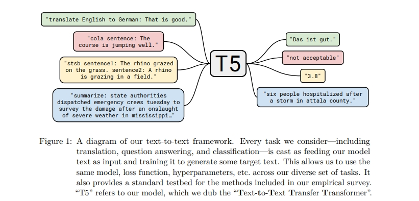
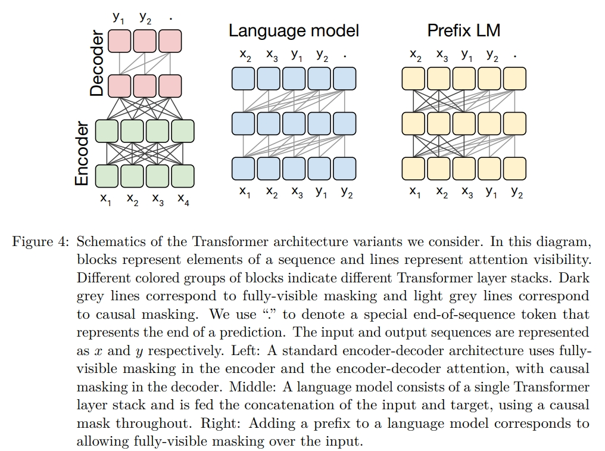
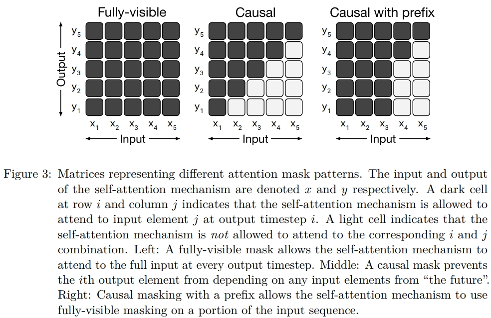
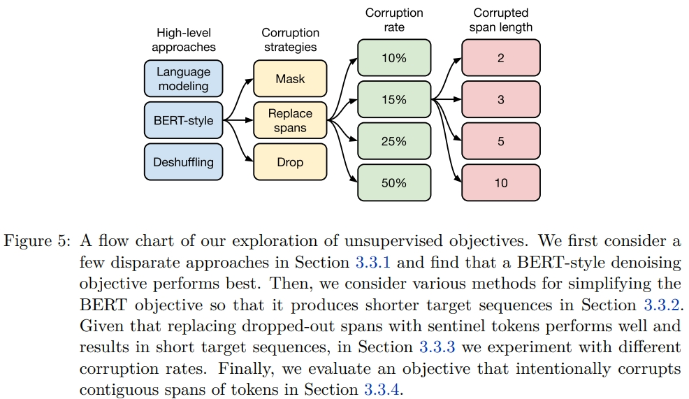
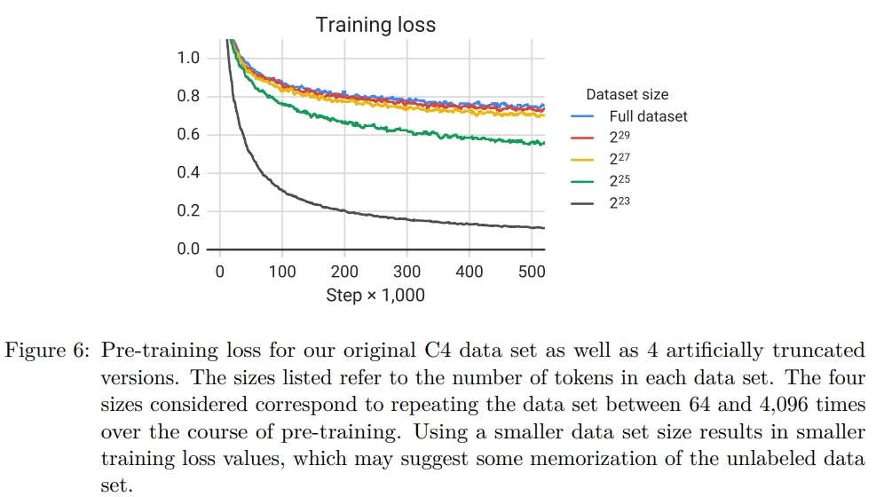
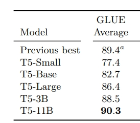

目录

- [T5 模型简介](#t5-模型简介)
  - [Why Text-to-Text](#why-text-to-text)
  - [Data-C4](#data-c4)
- [T5 模型架构](#t5-模型架构)
  - [架构-The Best One](#架构-the-best-one)
  - [Objectives-SearchSearchSearch](#objectives-searchsearchsearch)
  - [Datasets](#datasets)
    - [Training：Multi-Task Learning](#trainingmulti-task-learning)
    - [Scaling：bigger is better?](#scalingbigger-is-better)
    - [Models](#models)
- [参考](#参考)

# T5 模型简介

类似 T5 这样的大型实验探索论文，首先提出一个通用框架，接着进行了各种比对实验，
获得一套建议参数，最后得到一个很强的 baseline。而我们之后做这方面实验就能参考它的一套参数。

对于 T5 这篇论文，`Exploring the Limits of Transfer Learning with a Unified Text-to-Text Transformer`，
无疑也是类似的论文。它的意义不在烧了多少钱，也不在屠了多少榜（砸钱就能砸出来），其中 idea 创新也不大，
它最重要作用是**给整个 NLP 预训练模型领域提供了一个通用框架，把所有任务都转化成一种形式**，正如论文里所说的：

> introducing a unified framework that converts every language problem into a text-to-text format.

之后未来做 NLP 实验时，可能就不再是自己怎么调一些模型了，而是无论什么任务，直接拿来一个**超大预训练模型**，
然后主要工作就变成了**怎么把任务转换成合适的文本输入输出**，于是我们就成了带引号的 “数据科学家”。
而且可以用于多种任务，而模型对这些任务的区分只是根据你构建的输入输出形式，
其实这让我想起 Jeff Dean 在某次谈话中谈到的谷歌未来方向，想做一个超级模型，
什么任务都能直接处理，而它内部可以是稀疏的，或者可以局部 Distill，来对单独任务进行处理。

## Why Text-to-Text

首先为什么叫 T5 模型，因为是 Transfer Text-to-Text Transformer 的简写。
Transfer 来自 Transfer Learning，预训练模型大体在这范畴。Transformer 也不必多说。
那么 Text-to-Text 是什么呢。那就是作者在这提出的一个统一框架，靠着大力出奇迹，
**将所有 NLP 任务都转化成 Text-to-Text(文本到文本)** 任务。

举几个例子就明白了：

* 比如英德翻译，只需将训练数据集的输入部分前加上 `"translate English to German"` 就行。
  假设需要翻译 `"That is good"`，那么先转换成 `"translate English to German：That is good."` 输入模型，
  之后就可以直接输出德语翻译 `"Das ist gut."`；
* 再比如情感分类任务，输入 `"sentiment：This movie is terrible!"`，前面直接加上 `"sentiment："`，
  然后就能输出结果 `"negative"`。

最神奇的是，对于需要输出连续值的 STS-B（文本语义相似度任务），居然也是直接输出文本，而不是加个连续值输出头。
以每 0.2 为间隔，从 1 到 5 分之间分成 21 个值作为输出分类任务。比如上图中，输出 3.8 其实不是数值，
而是一串文本，之所以能进行这样的操作，应该完全赖于 T5 模型强大的容量。

通过这样的方式就能将 NLP 任务都转换成 Text-to-Text 形式，也就可以**用同样的模型，同样的损失函数，
同样的训练过程，同样的解码过程来完成所有 NLP 任务**。其实这个思想之前 GPT-2 论文里有提。

## Data-C4

作者从 Common Crawl（一个公开的网页存档数据集，每个月大概抓取 20TB 文本数据） 里清出了 750 GB 的训练数据，
然后取名为 ” Colossal Clean Crawled Corpus （超大型干净爬取数据）“，简称 C4，论作者取名之恶趣味。

大概清理过程如下：

* 只保留结尾是正常符号的行；
* 删除任何包含不好的词的页面，具体词表参考 [List-of-Dirty-Naughty-Obscene-and-Otherwise-Bad-Words](https://github.com/LDNOOBW/List-of-Dirty-Naughty-Obscene-and-Otherwise-Bad-Words) 库；
* 包含 Javascript 词的行全去掉；
* 包含编程语言中常用大括号的页面；
* 任何包含 "lorem ipsum"(用于排版测试) 的页面；
* 连续三句话重复出现情况，保留一个。

# T5 模型架构

## 架构-The Best One

首先作者们先对预训练模型中的多种模型架构（Transformer）进行了比对，
最主要的模型架构可以分成下面三种。

* 第一种，**Encoder-Decoder 型**，即 Seq2Seq 常用模型，分成 Encoder 和 Decoder 两部分，
  对于 Encoder 部分，输入可以看到全体，之后结果输给 Decoder，而 Decoder 因为输出方式只能看到之前的。
  此架构代表是 MASS（今年 WMT 的胜者），而 BERT 可以看作是其中 Encoder 部分。
* 第二种，相当于上面的 **Decoder 部分**，当前时间步只能看到之前时间步信息。典型代表是 GPT-2，还有最近 CTRL 这样的。
* 第三种，**Prefix LM(Language Model) 型**，可看作是上面 Encoder 和 Decoder 的融合体，
  一部分如 Encoder 一样能看到全体信息，一部分如 Decoder 一样只能看到过去信息。最近开源的 UniLM 便是此结构。

上面这些模型架构都是 Transformer 构成，之所以有这些变换，主要是对其中注意力机制的 Mask 操作。

通过实验作者们发现，在提出的这个 Text-to-Text 架构中，Encoder-Decoder 模型效果最好。
于是乎，就把它定为 T5 模型，因此所谓的 T5 模型其实就是个 Transformer 的 Encoder-Decoder 模型。

## Objectives-SearchSearchSearch

之后是对预训练目标的大范围探索，具体做了哪些实验，下面这张图就能一目了然。

总共从四方面来进行比较：

1. 第一个方面，高层次方法（自监督的预训练方法）对比，总共三种方式。
    - (1) 语言模型式，就是 GPT-2 那种方式，从左到右预测；
    - (2) BERT-style 式，就是像 BERT 一样将一部分给破坏掉，然后还原出来；
    - (3) Deshuffling（顺序还原）式，就是将文本打乱，然后还原出来。

其中发现 Bert-style 最好，进入下一轮。

2. 第二方面，对文本一部分进行破坏时的策略，也分三种方法。

    - (1) **Mask 法**，如现在大多模型的做法，将被破坏 token 换成特殊符如 [M]；
    - (2) **replace span（小段替换）法**，可以把它当作是把上面 Mask 法中相邻 [M] 都合成了一个特殊符，
      每一小段替换一个特殊符，提高计算效率；
    - (3) **Drop 法**，没有替换操作，直接随机丢弃一些字符。

此轮获胜的是 Replace Span 法，类似做法如 SpanBERT 也证明了有效性。进入下一轮。

3. 第三方面，到底该对文本百分之多少进行破坏呢，挑了 4 个值，10%，15%，25%，50%，
   最后发现 BERT 的 15% 就很 ok了。这时不得不感叹 BERT 作者 Devlin 这个技术老司机直觉的厉害。

接着进入更细节。

4. 第四方面，因为 Replace Span 需要决定对大概多长的小段进行破坏，于是对不同长度进行探索，
   2，3，5，10 这四个值，最后发现 3 结果最好。

终于获得了完整的 T5 模型，还有它的训练方法。

* Transformer Encoder-Decoder 模型；
* BERT-style 式的破坏方法；
* Replace Span 的破坏策略；
* 15 % 的破坏比；
* 3 的破坏时小段长度。

到此基本上 T5 预训练就大致说完了，之后是些细碎探索。

## Datasets

接着作者们拿着 C4 数据集做了各种实验，比如说从里面分出各种类型的数据集，单独训练 T5 模型，
之后看在下游任务的表现，发现一些情况领域内的预训练数据可以增强下游任务（想当然的）。
而 C4 完整数据集因为数据太多太杂，可能反而不如这种领域内较少数据集。

还有从 C4 中抽出不同量数据做实验，发现数据少时，模型会记住数据所以之后表现会比较差（这个也是想当然）。

### Training：Multi-Task Learning

作者们之后又针对 MTDNN 给 T5 做了一系列类似训练，在一堆监督和非监督数据上进行预训练。

结果发现，只要混合训练比例调得OK，和前面说的非监督预训练性能差不多。

### Scaling：bigger is better?

接着又做了当放大模型某方面规模的相关实验，分别是增大模型，增大数据，还有在一定资源限制下的集成。

结论是，当这些因素放大时对性能都有提高，但其中大模型是最必要的。

### Models

最后就是结合上面所有实验结果，训练了不同规模几个模型，由小到大：

* Small，Encoder 和 Decoder 都只有 6 层，隐维度 512，8 头；
* Base，相当于 Encoder 和 Decoder 都用 BERT-base；
* Large，Encoder 和 Decoder 都用 BERT-large 设置，除了层数只用 12 层；
* 3B（Billion）和11B，层数都用 24 层，不同的是其中头数量和前向层的维度。

11B 的模型最后在 GLUE，SuperGLUE，SQuAD，还有 CNN/DM 上取得了 SOTA，而 WMT 则没有。
看了性能表之后，我猜想之所以会有 3B 和 11B 模型出现，主要是为了刷榜。看表就能发现

比如说 GLUE，到 3B 时效果还并不是 SOTA，大概和 RoBERTa 评分差不多都是 88.5，
而把模型加到 11B 才打破 ALBERT 的记录。然后其他实验结果也都差不多，3B 时还都不是 SOTA，
而是靠 11B 硬拉上去的。除了 WMT 翻译任务，可能感觉差距太大，要拿 SOTA 代价过大，所以就没有再往上提。
根据这几个模型的对比，可以发现即使是容量提到 11B，性能提升的间隔还是没有变缓，
因此我认为再往上加容量还是有提升空间。

# 参考

* [Exploring the Limits of Transfer Learning with a Unified Text-to-Text Transformer](https://arxiv.org/pdf/1910.10683)
* [T5 模型：NLP Text-to-Text 预训练模型超大规模探索](https://zhuanlan.zhihu.com/p/88438851)
* [T5-Base Model for Summarization, Sentiment, Classification, and Translation](https://pytorch.org/text/stable/tutorials/t5_demo.html)
