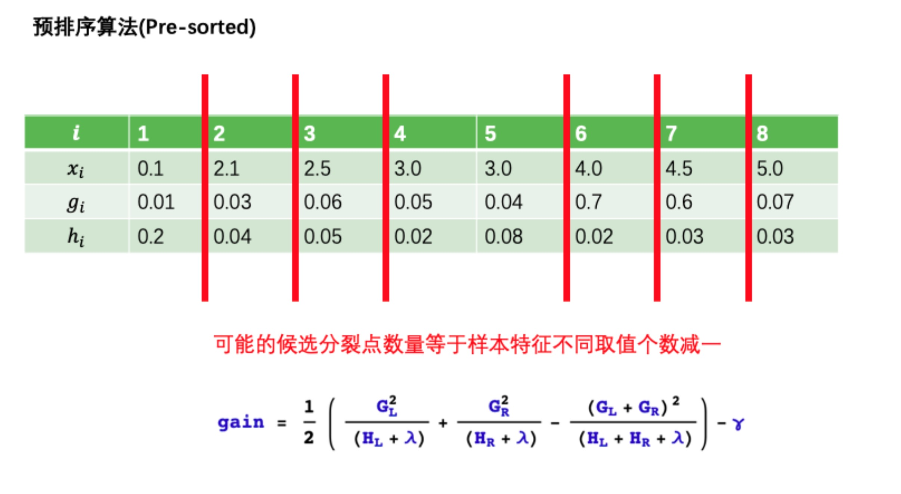
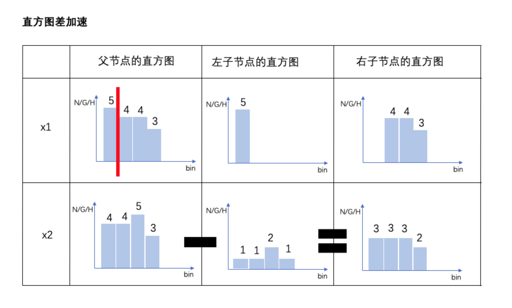

<style>
h1 {
    background-color: #2B90B6;
    background-image: linear-gradient(45deg, #4EC5D4 10%, #146b8c 20%);
    background-size: 100%;
    -webkit-background-clip: text;
    -moz-background-clip: text;
    -webkit-text-fill-color: transparent;
    -moz-text-fill-color: transparent;
}
h2 {
    background-color: #2B90B6;
    background-image: linear-gradient(45deg, #4EC5D4 10%, #146b8c 20%);
    background-size: 100%;
    -webkit-background-clip: text;
    -moz-background-clip: text;
    -webkit-text-fill-color: transparent;
    -moz-text-fill-color: transparent;
}
h3 {
    background-color: #2B90B6;
    background-image: linear-gradient(45deg, #4EC5D4 10%, #146b8c 20%);
    background-size: 100%;
    -webkit-background-clip: text;
    -moz-background-clip: text;
    -webkit-text-fill-color: transparent;
    -moz-text-fill-color: transparent;
}
details {
    border: 1px solid #aaa;
    border-radius: 4px;
    padding: .5em .5em 0;
}
summary {
    font-weight: bold;
    margin: -.5em -.5em 0;
    padding: .5em;
}
details[open] {
    padding: .5em;
}
details[open] summary {
    border-bottom: 1px solid #aaa;
    margin-bottom: .5em;
}
</style>


<details><summary>目录</summary><p>

- [LightGBM 资源](#lightgbm-资源)
- [LightGBM 模型理论](#lightgbm-模型理论)
  - [LightGBM 特点](#lightgbm-特点)
  - [LightGBM vs XGBoost](#lightgbm-vs-xgboost)
  - [LightGBM 性能优化原理](#lightgbm-性能优化原理)
    - [LightGBM 优化策略](#lightgbm-优化策略)
    - [Histogram 算法](#histogram-算法)
    - [GOSS 算法](#goss-算法)
    - [EFB 算法](#efb-算法)
- [LightGBM 安装](#lightgbm-安装)
  - [CLI(Command Line Interface) 安装](#clicommand-line-interface-安装)
    - [Homebrew](#homebrew)
    - [使用 CMake 从 GitHub 上构建](#使用-cmake-从-github-上构建)
    - [使用 gcc 从 GitHub 上构建](#使用-gcc-从-github-上构建)
  - [Python Package 安装](#python-package-安装)
    - [pip 安装](#pip-安装)
    - [从源码构建](#从源码构建)
- [LightGBM 数据接口](#lightgbm-数据接口)
  - [加载 LibSVM(zero-based) 文本文件、LightGBM 二进制文件](#加载-libsvmzero-based-文本文件lightgbm-二进制文件)
  - [加载 Numpy 2 维数组](#加载-numpy-2-维数组)
  - [加载 scipy.sparse.csr_matrix 数组](#加载-scipysparsecsr_matrix-数组)
  - [保存数据为 LightGBM 二进制文件](#保存数据为-lightgbm-二进制文件)
  - [创建验证数据](#创建验证数据)
  - [在数据加载时标识特征名称和类别特征](#在数据加载时标识特征名称和类别特征)
  - [有效利用内存空间](#有效利用内存空间)
- [LightGBM 设置参数](#lightgbm-设置参数)
  - [Booster 参数](#booster-参数)
- [LightGBM 应用](#lightgbm-应用)
  - [训练、保存、加载模型](#训练保存加载模型)
  - [交叉验证](#交叉验证)
  - [提前停止](#提前停止)
  - [预测](#预测)
- [LightGBM API](#lightgbm-api)
  - [Data Structure API](#data-structure-api)
  - [Training API](#training-api)
  - [Scikit-learn API](#scikit-learn-api)
  - [Callbacks](#callbacks)
  - [Plotting](#plotting)
- [LightGBM 示例](#lightgbm-示例)
  - [示例 1: 常用操作总结](#示例-1-常用操作总结)
  - [示例 2](#示例-2)
</p></details><p></p>

# LightGBM 资源

- [原始算法论文](https://papers.nips.cc/paper/6907-lightgbm-a-highly-efficient-gradient-boosting-decision-tree.pdf>)
- [GitHub-Python-Package](https://github.com/Microsoft/LightGBM/tree/master/python-package>)
- [GitHub-R-Package](https://github.com/Microsoft/LightGBM/tree/master/R-package>)
- [GitHub-Microsoft](https://github.com/Microsoft/LightGBM>)
- [Doc](https://lightgbm.readthedocs.io/en/latest/>)
- [Python 示例](https://github.com/microsoft/LightGBM/tree/master/examples/python-guide>)

# LightGBM 模型理论

## LightGBM 特点

LightGBM is a gradient boosting framework that uses tree based learning algorithms. 
It is designed to be distributed and efficient with the following advantages:

- Faster training speed and higher efficiency.
- Lower memory usage.
- Better accuracy.
- Support of parallel and GPU learning.
- Capable of handling large-scale data.

## LightGBM vs XGBoost

LightGBM 可以看成是 XGBoost 的升级加强版本:

* 模型精度
    - XGBoost 和 LightGBM 相当
* 训练速度
    - LightGBM 远快于 XGBoost
* 内存消耗
    - LightGBM 远小于 XGBoost
* 缺失值特征
    - XGBoost 和 LightGBM 都可以自动处理特征缺失值
* 类别特征
    - XGBoost 不支持类别特征，需要 OneHot 编码预处理
    - LightGBM 直接支持类别特征

LightGBM 和 XGBoost 的关系可以用一个简单公式来说明:

`$$LightGBM = XGBoost + Histogram + GOSS + EFB$$`

LightGBM 在 XGBoost 上主要有三方面的优化:

1. Histogram 算法: 直方图算法
2. GOSS 算法: 基于梯度的单边采样算法
3. EFB 算法: 互斥特征捆绑算法


## LightGBM 性能优化原理

### LightGBM 优化策略

由于 XGBoost 采用的基模型是二叉树，因此生产每片叶子需要分裂一次。
而每次分裂，都要遍历素有特征上所有候选分裂点位，
计算按照这些候选分裂点分裂后的全部样本的目标函数增益，
找到最大的那个增益赌赢的特征和候选分裂点位，从而生产一片新叶子

* XGBoost 模型训练的总体的复杂度可以粗略估计为:

`$$训练复杂度 = 树的棵树 \times 每棵树上叶子的数量 \times 生成每片叶子的复杂度$$`

* 生成一片叶子的复杂度可以粗略估计为:

`$$生成一片叶子的复杂度 = 特征数量 \times 候选分裂点数量 \times 样本的数量$$`

LightGBM 使用的 Histogram 算法的主要作用就是减少候选分裂点数量，
GOSS 算法的作用是减少样本的数量，EFB 算法的作用是减少特征的数量。
通过引入这三个算法，LightGBM 生成的一片叶子需要的复杂度大大降低，
从而极大节约了时间。同时，Histogram 算法还将特征由浮点数转换为 0~255 位的整数进行存储，
从而极大节了内存存储

### Histogram 算法

Histogram 算法是替代 XGBoost 的预排序(Pre-sorted)算法的:

* 预排序算法
    - 首先，将样本按照特征取值排序
    - 然后，从全部特征取值中找到最优的分裂点位，该算法的候选分裂点数量与样本数量成正比



* Histogram 算法
    - 通过将连续特征值离散化到固定数量(如 255 个)的 bins 上，
      使得候选点位为常数个(num_bin - 1)
    - 此外，Histogram 算法还能够作直方图差加速。
      当节点分裂成两个时，右边叶子节点的直方图等于其父节点的直方图减去左边叶子节点的直方图，
      从而大大减少构建直方图的计算量




### GOSS 算法

GOSS 算法，Gradient-based One-Side Sampling，基于梯度的单边采样算法

* 主要思想
    - 通过对样本采样的方法来减少计算目标函数增益时候的复杂度。
      但如果对全部样本进行随机采样，势必会对目标函数增益的计算精度造成较大的影响
* GOSS 算法的创新之处
    - 只对梯度绝对值较小的样本按照一定比例进行采样，
      而保留了梯度绝对值较大的样本，这就是所谓的单边采样。
      由于目标函数增益主要来自梯度绝对值较大的样本，
      因此这种方法在计算性能和计算精度之间取得了很好的平衡


### EFB 算法

EFB 算法，Exclusive Feature Bunding，互斥特征绑定算法

EFB 算法可以有效减少用于构建直方图的特征数量，从而降低计算复杂度，
尤其是特征中包含大量稀疏特征的时候。
在许多应用场景下，数据集中会有大量的稀疏特征，这些稀疏特征大部分样本都取值为 0，
只有少数样本取值非 0。
通常可以认为这些稀疏特征是互斥的，即它们几乎不会同时取非零值

利用这种特性，可以通过对某些特征的取值重新编码，
将多个这样互斥的特征捆绑称为一个新的特征。
有趣的是，对于类别特征，如果转换成 one-hot 编码，
则这些 one-hot 编码后的多个特征相互之间是互斥的，
从而可以被捆绑成为一个特征。因此，对于指定为类别特征的特征，
LightGBM 可以直接将每个类别取值和一个 bin 关联，从而自动地处理它们，
而无需预处理成 one-hot 编码


# LightGBM 安装

- CLI 版本
    - Win
    - Linux
    - OSX
    - Docker
    - Build MPI 版本
    - Build GPU 版本
- Python library
    - 安装依赖库
    - 安装 `lightgbm`

## CLI(Command Line Interface) 安装

MacOS 上安装 LightGBM(CLI) 有以下三种方式:

- Apple Clang
    - Homebrew
    - CMake
    - Build from GitHub
- gcc
    - Build from GitHub

### Homebrew

安装 LightGBM:

```bash
$ brew install lightgbm
```

### 使用 CMake 从 GitHub 上构建

(1)安装 CMake(3.16 or higher)

```bash
$ brew install cmake
```

(2)安装 OpenMP

```bash
$ brew install libomp
```

(3)构建 LightGBM

```bash
$ git clone --recursive https://github.com/microsoft/LightGBM
$ cd LightGBM
$ cmake ..
$ make -j4
```

### 使用 gcc 从 GitHub 上构建

(1)安装 CMake(3.2 or higher)

```bash
$ brew install cmake
```

(2)安装 gcc

```bash
$ brew install gcc
```

(3)构建 LightGBM

```bash
$ git clone --recursive https://github.com/microsoft/LightGBM
$ cd LightGBM
$ export CXX=g++-7 CC=gcc-7  # replace "7" with version of gcc installed on your machine
$ mkdir build
$ cd build
$ cmake ..
$ make -j4
```

## Python Package 安装

### pip 安装

- 安装 `lightgbm`:

```bash
# 默认版本
$ pip install lightgbm

# MPI 版本
$ pip install lightgbm --install-option=--mpi

# GPU 版本
$ pip install lightgbm --install-option=--gpu
```

- 约定成俗的库导入:

```python
import lightgbm as lgb
```

### 从源码构建

```bash
$ git clone --recursive https://github.com/microsoft/LightGBM
$ cd LightGBM
$ mkdir build
$ cd build
$ cmake ..

# 开启MPI 通信机制, 训练更快
$ cmake -DUSE_MPI=ON ..

# GPU 版本, 训练更快
$ cmake -DUSE_GPU=1 ..
$ make -j4
```


# LightGBM 数据接口

数据接口:

- LibSVM(zero-based), TSV, CSV, TXT 文本文件
- Numpy 2 维数组
- pandas DataFrame
- H2O DataTable’s Frame
- SciPy sparse matrix
- LightGBM 二进制文件

**Note:**

- 数据保存在 `Dataset` 对象中.

## 加载 LibSVM(zero-based) 文本文件、LightGBM 二进制文件

```python
import lightgbm as lgb

# csv
train_csv_data = lgb.Dataset('train.csv')

# tsv
train_tsv_data = lgb.Dataset('train.tsv')

# libsvm
train_svm_data = lgb.Dataset('train.svm')

# lightgbm bin
train_bin_data = lgb.Dataset('train.bin')
```

## 加载 Numpy 2 维数组

```python
import liggtgbm as lgb

data = np.random.rand(500, 10)
label = np.random.randint(2, size = 500)
train_array = lgb.Dataset(data, label = label)
```

## 加载 scipy.sparse.csr_matrix 数组

```python
import lightgbm as lgb
import scipy

csr = scipy.sparse.csr_matirx((dat, (row, col)))
train_sparse = lgb.Dataset(csr)
```

## 保存数据为 LightGBM 二进制文件

```python
import lightgbm as lgb

train_data = lgb.Dataset("train.svm.txt")
train_data.save_binary('train.bin')
```

**Note:**

- 将数据保存为 LightGBM 二进制文件会使数据加载更快


## 创建验证数据

```python
import lightgbm as lgb

# 训练数据
train_data = lgb.Dataset("train.csv")

# 验证数据
validation_data = train_data.create_vaild('validation.svm')
# or
validation_data = lgb.Dataset('validation.svm', reference = train_data)
```

**Note:**

- 在 LightGBM 中, 验证数据应该与训练数据一致(格式)

## 在数据加载时标识特征名称和类别特征

```python
import numpy as np
import lightgbm as lgb

data = np.random.rand(500, 10)
label = np.random.randint(2, size = 500)
train_array = lgb.Dataset(data, label = label)
w = np.random.rand(500, 1)

train_data = lgb.Dataset(data, 
                        label = label, 
                        feature_name = ['c1', 'c2', 'c3'], 
                        categorical_feature = ['c3'],
                        weight = w,
                        free_raw_data = True)
# or
train_data.set_weight(w)

train_data.set_init_score()

train_data.set_group()
```

## 有效利用内存空间

The Dataset object in LightGBM is very memory-efficient, 
it only needs to save discrete bins. However, Numpy/Array/Pandas object is memory expensive. 
If you are concerned about your memory consumption, you can save memory by:

- 1.Set `free_raw_data=True` (default is `True`) when constructing the Dataset
- 2.Explicitly set `raw_data=None` after the Dataset has been constructed
- Call `gc`

# LightGBM 设置参数

- 参数设置方式: 
    - 命令行参数
    - 参数配置文件
    - Python 参数字典
- 参数类型:
    - 核心参数
    - 学习控制参数
    - IO参数
    - 目标参数
    - 度量参数
    - 网络参数
    - GPU参数
    - 模型参数
    - 其他参数


## Booster 参数

```python
param = {
   'num_levels': 31,
   'num_trees': 100,
   'objective': 'binary',
   'metirc': ['auc', 'binary_logloss']
}
```


# LightGBM 应用

## 训练、保存、加载模型

```python
# 训练模型

import lightgbm as lgb

# 训练数据
train_data = lgb.Dataset("train.csv")

# 验证数据
validation_data = train_data.create_vaild('validation.svm')

# 参数
param = {
   'num_levels': 31,
   'num_trees': 100,
   'objective': 'binary',
   'metirc': ['auc', 'binary_logloss']
}
num_round = 10

# 模型训练
bst = lgb.train(param, train_data, num_round, vaild_sets = [validation_data])

# 保存模型
bst.save_model('model.txt')
json_model = bst.dump_model()

# 加载模型
bst = lgb.Booster(model_file = 'model.txt')
```

## 交叉验证

```python
num_round = 10
lgb.cv(param, train_data, num_round, nfold = 5)
```

## 提前停止

```python
bst = lgb.train(param,
                train_data,
                num_round,
                valid_sets = valid_sets,
                ealy_stopping_rounds = 10)
```

## 预测

- 用已经训练好的或加载的保存的模型对数据集进行预测
- 如果在训练过程中启用了提前停止, 可以用 `bst.best_iteration` 从最佳迭代中获得预测结果

```python
testing = np.random.rand(7, 10)
y_pred = bst.predict(testing, num_iteration = bst.best_iteration)
```

# LightGBM API

## Data Structure API

- `Dataset(data, label, reference, weight, ...)`
- `Booster(params, train_set, model_file, ...)`

## Training API

- `train(params, train_set, num_boost_round, ...)`
- `cv(params, train_ste, num_boost_round, ...)`

## Scikit-learn API

- `LGBMModel(boosting\ *type, num*\ leaves, ...)`
- `LGBMClassifier(boosting\ *type, num*\ leaves, ...)`
- `LGBMRegressor(boosting\ *type, num*\ leaves, ...)`
- `LGBMRanker(boosting\ *type, num*\ leaves, ...)`


```python
lightgbm.LGBMClassifier(boosting_type = "gbdt", # gbdt, dart, goss, rf
                       num_leaves = 31, 
                       max_depth = -1, 
                       learning_rate = 0.1,
                       n_estimators = 100,
                       subsample_for_bin = 200000,
                       objective = None, 
                       class_weight = None,
                       min_split_gain = 0.0,
                       min_child_weight = 0.001, 
                       min_child_samples = 20,
                       subsample = 1.0,
                       subsample_freq = 0,
                       colsample_bytree = 1.0,
                       reg_alpha = 0.0,
                       reg_lambda = 0.0,
                       random_state = None,
                       n_jobs = -1, 
                       silent = True,
                       importance_type = "split",
                       **kwargs)

lgbc.fit(X, y,
        sample, 
        weight = None, 
        init_score = None,
        eval_set = None,
        eval_names = None, 
        eval_sample_weight = None,
        eval_class_weight = None,
        eval_init_score = None,
        eval_metric = None,
        early_stopping_rounds = None,
        verbose = True,
        feature_name = "auto",
        categorical_feature = "auto",
        callbacks = None)

lgbc.predict(X, 
            raw_score = False,
            num_iteration = None,
            pred_leaf = False,
            pred_contrib = False,
            **kwargs)

lgbc.predict_proba(X, 
                  raw_score = False,
                  num_iteration = None,
                  pred_leaf = False,
                  pred_contrib = False,
                  **kwargs)
```

```python
lightgbm.LGBMRegressor(boosting_type = "gbdt",
                      num_leaves = 31,
                      max_depth = -1,
                      learning_rate = 0.1,
                      n_estimators = 100,
                      subsample_for_bin = 200000,
                      objective = None,
                      class_weight = None,
                      min_split_gain = 0.0,
                      min_child_weight = 0.001,
                      min_child_samples = 20,
                      subsample = 1.0,
                      subsample_freq = 0,
                      colsample_bytree = 1.0,
                      reg_alpha = 0.0,
                      reg_lambda = 0.0,
                      random_state = None,
                      n_jobs = -1,
                      silent = True,
                      importance_type = "split",
                      **kwargs)

lgbr.fit(X, y, sample_weight = None,
        init_score = None, 
        eval_set = None,
        eval_names = None,
        eval_sample_weight = None,
        eval_init_score = None,
        eval_metric = None,
        early_stopping_rounds = None,
        verbose = True,
        feature_name = "auto",
        categorical_feature = "auto",
        callbacks = None)

lgbr.predict(X, 
            raw_score = False, 
            num_iteration = None, 
            pred_leaf = False,
            pred_contrib = False,
            **kwargs)
```


## Callbacks

- `early_stopping(stopping_round, ...)`
- `print_evaluation(period, show_stdv)`
- `record_evaluation(eval_result)`
- `reset_parameter(**kwargs)`

```python
early_stopping(stopping_round, ...)
print_evaluation(period, show_stdv)
record_evaluation(eval_result)
reset_parameter(**kwargs)
```

## Plotting

- `plot_importance(booster, ax, height, xlim, ...)`
- `plot_split_value_histogram(booster, feature)`
- `plot_metric(booster, metric, ...)`
- `plot_tree(booster, ax, tree_index, ...)`
- `create_tree_digraph(booster, tree_index, ...)`

```python
plot_importance(booster, ax, height, xlim, ...)
plot_split_value_histogram(booster, feature)
plot_metric(booster, ax, tree, index, ...)
plot_tree(booster, ax, tree_index, ...)
create_tree_digraph(booster, tree_index, ...)
```

# LightGBM 示例

## 示例 1: 常用操作总结

**Note:** 

- 人工调参
- 提高速度
   - Use bagging by setting bagging_fraction and bagging_freq
   - Use feature sub-sampling by setting feature_fraction
   - Use small max_bin
   - Use save_binary to speed up data loading in future learning
   - Use parallel learning, refer to Parallel Learning Guide
- 提高准确率
   - Use large max_bin (may be slower)
   - Use small learning_rate with large num_iterations
   - Use large num_leaves (may cause over-fitting)
   - Use bigger training data
   - Try dart
- 处理过拟合
   - Use small max_bin
   - Use small num_leaves
   - Use min_data_in_leaf and min_sum_hessian_in_leaf
   - Use bagging by set bagging_fraction and bagging_freq
   - Use feature sub-sampling by set feature_fraction
   - Use bigger training data
   - Try lambda_l1, lambda_l2 and min_gain_to_split for regularization
   - Try max_depth to avoid growing deep tree
   - Try extra_trees
   - Try increasing path_smooth

## 示例 2

```python

```