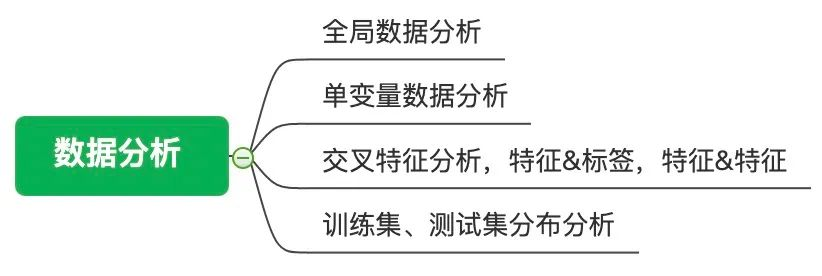

## 为什么要做探索性数据分析

在对于问题的背景有了大致的了解之后，接下来要做的就是对于基于所获得的数据进行数据的探索分析。
为什么要做数据分析呢？有些厉害的朋友可以几乎不做数据探索而仅仅通过不断枚举特征加树模型的实验方式拿到不错的成绩。
这在有些数据质量较高同时数据量并不是非常大的问题中是可行的，但如果数据的质量较差，亦或是数据量非常大的时候，
就会遇到非常大的麻烦

要想在所有的数据建模问题中都能做好，扎实的数据分析是必备的技能，但很多朋友经常会毫无头脑的随机分析，
或者看了很多 Kernel 也毫无思绪，在对很多别人的数据分析文章进行分析归纳后，
基本可以汇总到下面的四个模块：

1. 全局数据分析：通过数据全局分析，可以了解到数据的整体情况，包括数据类型、大小、质量等等
2. 单变量数据分析：在这一模块，会单独的对每个变量进行观测，包括类别变量、连续变量、文本变量等等
3. 交叉特征分析：在交叉特征分析模块，又将其分为特征与标签的交叉分析以及特征与特征之间的交叉等等
4. 训练集、测试集分布分析：关于训练集和测试集的分布探索，在目前数据挖掘中最为核心的模块之一，
   训练集和测试集的分布不一致也是导致线上和线下不一致的重要原因之一，
   所以在这一块会阐述常见的几种方案

## 文档

