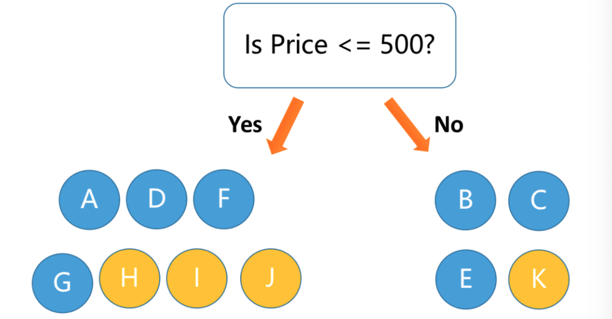
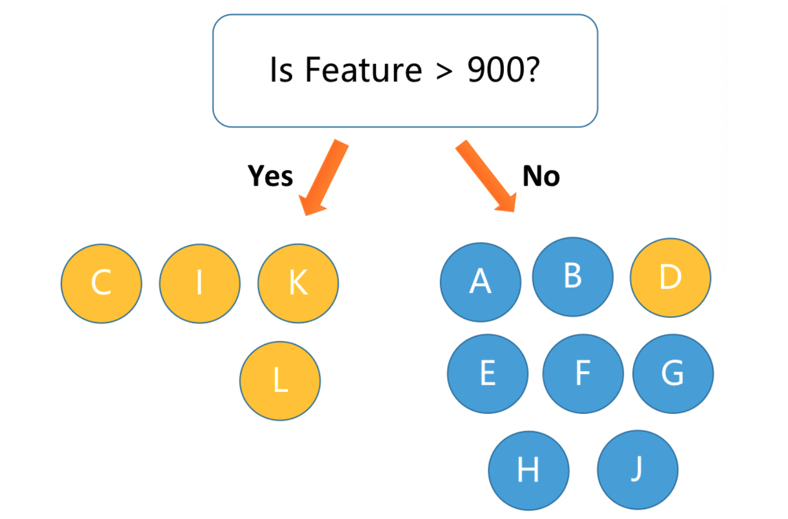

<style>
details {
    border: 1px solid #aaa;
    border-radius: 4px;
    padding: .5em .5em 0;
}
summary {
    font-weight: bold;
    margin: -.5em -.5em 0;
    padding: .5em;
}
details[open] {
    padding: .5em;
}
details[open] summary {
    border-bottom: 1px solid #aaa;
    margin-bottom: .5em;
}
</style>

<details><summary>目录</summary><p>

- [特征缩放/特征归一化(standardization)](#特征缩放特征归一化standardization)
  - [标准化(Standard Scaling)](#标准化standard-scaling)
  - [Min-Max Scaling](#min-max-scaling)
  - [Max-Abs Scaling](#max-abs-scaling)
  - [L1/L2 归一化:](#l1l2-归一化)
  - [稳健缩放:](#稳健缩放)
- [特征离散化](#特征离散化)
  - [计数特征二值化【尺度】](#计数特征二值化尺度)
  - [计数特征分箱【分布】](#计数特征分箱分布)
- [特征转换【分布】](#特征转换分布)
  - [均匀分布](#均匀分布)
  - [对数变换【分布】](#对数变换分布)
  - [指数变换(Box-Cox):](#指数变换box-cox)
  - [Yeo-Johnson 和 Box-Cox](#yeo-johnson-和-box-cox)
    - [Yeo-Johnson 转换](#yeo-johnson-转换)
    - [Box-Cox 转换](#box-cox-转换)
- [样本正规化(Normalization)](#样本正规化normalization)
- [树模型特征工程](#树模型特征工程)
  - [树模型数据吸收方式](#树模型数据吸收方式)
  - [树模型特征工程](#树模型特征工程-1)
    - [高基数类别数据](#高基数类别数据)
    - [交叉信息挖掘](#交叉信息挖掘)
    - [局部上下文信息特征](#局部上下文信息特征)
- [参考](#参考)
</p></details><p></p>

异常值 偏态分布

- 特征尺度
- 特征分布

# 特征缩放/特征归一化(standardization)

- 当一组输入特征的尺度相差很大, 并且模型对于特征的尺度很敏感, 
  就需要进行特征缩放(特征正规化), 从而消除数据特征之间量纲的影响, 
  使得不同的特征之间具有可比性.
- 特征缩放总是将特征除以一个常数(正规化常数), 因此不会改变单特征的分布, 
  只有数据尺度发生了变化. 对数值型特征的特征做归一化可以将所有特征都统一到一个大致相同的数值区间内.
- 什么样的特征需要正规化:
    - 如果模型是输入特征的平滑函数, 那么模型对输入的的尺度是非常敏感的
    - 通过梯度下降法求解的模型通常需要进行特征正规化
        - 线性回归
        - 逻辑回归
        - 支持向量机
        - 应用正则化方法的模型
        - 神经网络
    - 使用欧式距离的方法, 比如: k均值聚类、最近邻方法、径向基核函数, 
      通常需要对特征进行标准化, 以便将输出控制在期望的范围内

## 标准化(Standard Scaling)

- 标准化也称为: 方差缩放、零均值归一化、Z-Score Normalization
- 标准化后的特征均值为 0, 方差为 1
- 如果初始特征服从正态分布, 标准化后的特征也服从正态分布(标准正态分布)
- 不要中心化稀疏数据

`$$x_{transformed} = \frac{x - mean(x)}{std(x)}$$`

```python
from sklearn.preprocessing import StandardScaler

ss = StandardScaler(with_mean = True, with_std = True)
featureScaled = ss.fit_transform()(feature)
```

## Min-Max Scaling

- Min-Max Scaling 对原始特征进行线性变换, 将特征值压缩(或扩展)到 `$\[0, 1\]$` 区间中, 
  实现对原始特征的等比缩放. 特征中所有观测值的和为 1

`$$x_{transformed} = \frac{x - min(x)}{max(x) - min(x)}$$`

```python
from sklearn.preprocessing import MinMaxScaler

mms = MinMaxScaler()
featureScaled = mms.fit_transform(feature)
```

## Max-Abs Scaling

- Max-Abs Scaling 对原始特征进行线性变换, 将特征值压缩(或扩展)到 `$\[-1, 1\]$` 区间中, 
  实现对原始特征的等比缩放

`$$x_{transformed} = \frac{x}{max(x)}$$`


```python
from sklearn.preprocessing import MaxAbsScaler

mas = MaxAbsScaler()
featureScaled = mas.fit_transform(feature)
```

## L1/L2 归一化:

- 将特征除以一个归一化常数, 比如: `$l2$`, `$l1$` 范数, 使得特征的范数为为常数

```python
from sklearn.preprocessing import Normalize
```

## 稳健缩放:

- 对于包含异常值的特征, 标准化的效果不好, 可以使用稳健的特征缩放技术对特征进行缩放


```python
from sklearn.preprocessing import RobustScaler

rs = RobustScaler(
    with_centering = True,
    with_scaling = True,
    quantile_range = (25.0, 75.0),
    copy = True
)
transform_data = rs.fit_transform(data)
```

# 特征离散化

## 计数特征二值化【尺度】

- 当数据被大量且快速地生成时很有可能包含一些极端值, 这时就应该检查数据的尺度, 
  确定是应该保留数据的原始数值形式, 还是应该将他们转换为二值数据, 
  或者进行粗粒度的分箱操作；
- 二值目标变量是一个既简单又稳健的衡量指标；

```python
from sklearn.preprocessing import Binarizer
bined = Binarizer(threshod = 1, copy = True)
transformed_data = bined.fit_transform(data)
```

## 计数特征分箱【分布】

- 在线性模型中, 同一线性系数应该对所有可能的计数值起作用;
- 过大的计数值对无监督学习方法也会造成破坏, 比如:k-均值聚类等基于欧式距离的方法, 
  它们使用欧式距离作为相似度函数来测量数据点之间的相似度, 
  数据向量某个元素中过大的计数值对相似度的影响会远超其他元素, 
  从而破坏整体的相似度测量;
- 区间量化可以将连续型数值映射为离散型数值, 可以将这种离散型数值看作一种有序的分箱序列, 
  它表示的是对密度的测量；
- 为了对数据进行区间量化, 必须确定每个分箱的宽度: 
    - 固定宽度分箱
    - 自适应分箱

```python
from sklearn.preprocessing import KBinsDiscretizer
kbins1 = KBinsDiscretizer(n_bins = 5, encode = "onehot", strategy = "quantile")
kbins2 = KBinsDiscretizer(n_bins = 5, encode = "onehot-dense", strategy = "uniform")
kbins3 = KBinsDiscretizer(n_bins = 5, encode = "ordinal", strategy = "kmeans")
transformed_data = kbins1.fit_transform(data)
```

**固定宽度分箱:**

通过固定宽度, 每个分箱中会包含一个具体范围内的数值. 这些范围可以人工定制, 
也可以通过自动分段来生成, 它们可以是线性的, 也可以是指数性的
   
- 线性
    - 要将计数值映射到分箱, 只需要计数值除以分箱的宽度, 然后取整数部分
- 指数
    - 当数值横跨多个数量级时, 最好按照10的幂(或任何常数的幂)来进行分组. 
      要将计数值映射到分箱, 需要取计数值的对数. 

APIs:

```python
np.floor_divide(X, 10)
np.floor(np.log10(X))
```

Examples:

```python
import numpy as np

# 固定宽度
small_counts = np.random.randint(0, 100, 20)
new_small_counts = np.floor_divide(small_counts, 10)
print(new_small_counts)


# 指数宽度
large_counts = [296, 8286, 64011, 80, 3, 725, 867, 2215, 7689, 
                11495, 91897, 44, 28, 7917, 926, 122, 22222]
new_large_counts = np.floor(np.log10(large_counts))
print(new_large_counts)
```

**分位数分箱:**

- 如果计数数值中有比较大的缺口, 就会产生很多没有任何数据的空箱子；
- 可以根据数据的分布特点, 利用分布的分位数进行自适应的箱体定位
    - 分位数是可以将数据划分为相等的若干份的数的值

APIs:

```python
pd.qcut()
```

Examples:

```python
import numpy as np
import pandas as pd
large_counts = pd.Series([296, 8286, 64011, 80, 3, 725, 867, 2215, 7689, 
                            11495, 91897, 44, 28, 7917, 926, 122, 22222])
new_large_counts = pd.qcut(large_counts, 4, labels = False)
```

# 特征转换【分布】

## 均匀分布

- 将特征转换为 `$\[0, 1\]$` 区间的均匀分布

```python
from sklearn.preprocessing import QuantileTransformer

qt = QuantileTransformer(random_state = 0)
featureScaled = qt.fit_transform()
```

## 对数变换【分布】

- 对数函数可以对大数值的范围进行压缩, 对小数值的范围进行扩展
- 对于具有重尾分布的正数值的处理, 对数变换是一个非常强大的工具
    - 与正态分布相比, 重尾分布的概率质量更多地位于尾部
    - 对数变换压缩了分布高端的尾部, 使之成为较短的尾部, 并将低端扩展为更长的头部, 即: 经过对数变换后, 
      直方图在重尾的集中趋势被减弱了, 在 `$x$` 轴上的分布更均匀了一些
- `$log_{a}x$`:
     - 将 `$\(0, 1\)$` 这个小区间中的数映射到包含全部负数的区间: `$\(-\infty, 0\)$`
- `$log_{10}x$`:
    - 将 `$\[0, 10\]$` 这个区间中的数映射到 `$\[0, 1\]$`
    - 将 `$\[10, 100\]$` 这个区间中的数映射到 `$\[1, 2\]$`
    - ...

对数变换:

APIs:

```python
np.log1p()
np.log10(x + 1)
```

## 指数变换(Box-Cox):

- 指数变换是个变换族, 对数变换只是指数变换的一个特例, 它们都是方差稳定变换
- 指数变换可以改变变量的分布, 使得方差不再依赖于均值
- 平方根变换和对数变换都可以简单地推广为 Box-Cox 变换
- 常用的指数变换: 
   - Box-Cox 变换
      - `$x_transformed = \frac{x^{\lambda} - 1}{\lambda}, \lambda \neq 0$`
      - `$x_transformed = log1p(x), \lambda = 0$`
   - 平方根(\ `$\sqrt{x}$`)变换
      - `$\lambda = 0.5$`
   - 对数变换(`$np.log1p(x)$`, `$np.log10(x + 1))$`
      - `$\lambda = 0$`

```python
from scipy.stats import boxcox
# 对数变换
rc_log = boxcox(df["feature"], lmbda = 0)

# Box-Cox:默认情况下, Scipy 在实现 Box-Cox 变换时会找出使得输出最接近于正态分布的 lambda 参数
rc_boxcox = boxcox(df["feature"])
```

- 对比特征的分布与正态分布
   - 概率图(probplot):用于比较特征的实际分布与理论分布, 它本质上是一种表示实测分位数和理论分位数的关系的散点图

```python
from scipy import stats
from scipy.stats import probplot
probplot(df["feature"], dist = stats.norn, plot = ax)
```

## Yeo-Johnson 和 Box-Cox

### Yeo-Johnson 转换

`$$\begin{split}x_{i}^{(\lambda)} =
\begin{cases}
[(x_{i} + 1)^{\lambda} - 1] / \lambda & \text{if } \lambda \neq 0, x_{i} \geq 0, \\\\
\ln{(x_{i}) + 1} & \text{if } \lambda = 0, x_{i} \geq 0 \\\\
-[(- x_{i} + 1)^{2 - \lambda} - 1] / (2 - \lambda) & \text{if } \lambda \neq 2, x_{i} < 0, \\\\
-\ln (- x_{i} + 1) & \text{if } \lambda = 2, x_{i} < 0
\end{cases}\end{split}$$`

```python
from sklearn.preprocessing import PowerTransformer

pt = PowerTransformer(method = "yeo-johnson", standardize = False)
featureTrans = pt.fit_transform(feature)
```

### Box-Cox 转换

`$$\begin{split}x_{i}^{(\lambda)} =
\begin{cases}
\dfrac{x_{i}^\lambda - 1}{\lambda} & \text{if } \lambda \neq 0, \\\\
\ln{(x_{i})} & \text{if } \lambda = 0,
\end{cases}\end{split}$$`

```python
from sklearn.preprocessing import PowerTransformer

pt = PowerTransformer(method = "box-cox", standardize = False)
featureTrans = pt.fit_transform(feature)
```

# 样本正规化(Normalization)

Normalization is the process of scaling individual samples to have unit norm.

```python
from sklearn.preprocessing import Normalizer

norm = Normalizer()
df_norm = norm.fit_transform(df)
```

# 树模型特征工程

特征工程和模型是一个完整的整体，特征工程的目的是为了辅助模型进行更好的学习，
因为目前还没有一个模型可以直接对所有类型的数据进行充分的学习，
所以对于模型学习不佳的地方或者难以学好的地方，我们需要通过特征工程的方式对数据进行转化，
然后再将转化后的数据输入模型使模型可以得到更好的学习，从而拿到更好的效果

先分析梯度提升树对于数据的吸收方式，探讨梯度提升树模型学习不好的地方，
之后我们再阐述各类特征如何通过特征工程的方式转化为树模型更易吸收的形式，
从而拿到更好的效果

## 树模型数据吸收方式

树模型每次分裂的时候都会贪心地寻找一个最佳的分割点，依据寻找到的最佳分割点将数据一分为二。
然后再从所有的特征中继续贪心地寻找下一个分割点，继续以最佳分割点位中心，
按照大于小于该值的情况进行分割，依此类推

也就是说，梯度提升树模型可以近似认为是一种贪心的二叉树模型

## 树模型特征工程

从梯度提升树模型对于数据的吸收方式中，我们发现梯度提升树对于下面几种情况是做得不够好

### 高基数类别数据

什么是高基数类别特征呢？一个类别特征中不同的值的个数较大的时候，
我们认为该类别特征是高基数的特征

一般可以通过下面的方式来计算基数：

```python
df["feature"].nunique()
# or
len(set(df["feature"].unique()))
```

当类别特征的基数较大，树模型很难在较短的几次分裂过程中将数据完美的分割开，
我们知道树模型是基于贪心的策略，只要其中有一次分割的位置不好，
那么对于后续的分割就会产生一些不良的影响，
这也是为什么很多梯度提升树模型在碰到高基数的类别特征的时候效果效果不佳的原因

举个极端的例子，我们现在有 500 个不同的数，如果是奇数，对应的标签就是1，
如果是偶数，对应的标签就是0，目前做下面两个实验：

* 直接训练，验证；
* 采用常用的特征工程技巧，Mean-target 编码，再验证

```python
import lightgbm as lgb
import pandas as pd
import numpy as np
import matplotlib.pyplot as plt
import seaborn as sns
from sklearn.metrics import roc_auc_score
from sklearn.model_selection import train_test_split,KFold


# data
df = pd.DataFrame()
feature = np.array(np.random.randint(1, 500, size = [10000]))
label = feature % 2
df['f'] = feature
df['y'] = label
X_train, X_test, y_train, y_test = train_test_split(
    df['f'].values, 
    df['y'].values, 
    test_size = 0.33
)

# 交叉验证
kf = KFold(n_splits = 5)
# Mean-Target encode
tr_target_encode = np.zeros(X_train.shape[0])
te_target_encode = np.zeros(X_test.shape[0])
for tr_ind, val_ind in kf.split(X_train, y_train):
    df_tmp = pd.DataFrame({
        'f': X_train, 
        'y': y_train
    })
    dic = df_tmp.groupby('f')['y'].mean().to_dict() 
    tr_target_encode[val_ind] = [dic[v] for v in X_train[val_ind]]
    te_target_encode = [te_target_encode[i] + dic[v] / 5.0 for i, v in enumerate(X_test)]
 
tr_target_encode = np.array(tr_target_encode)
te_target_encode = np.array(te_target_encode)

# 模型训练
model = lgb.LGBMClassifier(
    n_estimators = 1000, 
    learning_rate = 0.05
)
model.fit(
    X_train.reshape(-1,1),
    y_train, 
    eval_set = (X_test.reshape(-1,1), y_test), 
    eval_metric ='auc',
    early_stopping_rounds = 50, 
    verbose = 200
)

# 模型验证
model = lgb.LGBMClassifier(
    n_estimators = 1000, 
    learning_rate = 0.05
)
model.fit(
    np.concatenate([
        X_train.reshape(-1, 1), 
        tr_target_encode.reshape(-1, 1)
    ], axis = 1),
    y_train, 
    eval_set = (
        np.concatenate([
            X_test.reshape(-1, 1), 
            te_target_encode.reshape(-1, 1)
        ], axis = 1), 
        y_test
    ), 
    eval_metric = 'auc', 
    early_stopping_rounds = 50, 
    verbose = 200
)
```

从上面的实验中，我们发现对于相对高基数的特征，直接放入模型是很难找到最优的分割，
最终往往导致模型陷入次优的状态。而通过简单的特征工程，我们不仅可以得到更好的效果，
而且往往还能加速模型的收敛

### 交叉信息挖掘

此处我们所谓的交叉信息就是特征之间的交叉关系，举例来说，用户 ID 是单个特征，商店 ID 也是单个特征，
那么用户和商品的组合就是二阶组合特征。因为梯度提升树模型，每次都只会对单个特征进行分割，
进而再对下一个特征进行分割，所以如果两个特征的交叉存在极强的信息，那么梯度提升树模型是很难挖掘出此类信息的

举个例子：我们有一些交易数据，如果平均每个用户的交易额度是大于某个 550，就是好用户；反之就是一般用户

```python
df = pd.DataFrame()
uids = ['u1'] * 4 + ['u2'] * 3 + ['u3'] * 4
price = [400, 2000, 650, 150, 1000, 500, 300, 500, 200, 300, 1000]
isGood = [0] * 7 + [1] * 4

df['UID']   = uids
df['Price'] = price
df['isGood'] = isGood
df['MeanPrice'] = df.groupby('UID')['Price'].transform('mean').values
```


如果我们只用用户 UID 进行分割，我们发现三次也可以全部分对，但是数据集合中，
我们的用户很多，这么做又会出现和高基数类别数据类似的问题。如果我们使用 Price 进行分割，
我们发现没法直接分割开，从而会出现下面这种的分割情况：



而如果我们基于用户ID和用户消费的价格求均值，再进行分割，我们就可以很快地将二者完美的分割开：


也就是说，我们直接基于用户的ID对用户的消费价格求均值得到的特征完美的帮助了我们的模型。
这是一个简单的例子，还有非常多的情况树模型都没法挖掘，这些我们会在后续特征工程部分进行详细地展开

### 局部上下文信息特征

同样的原因，因为梯度提升树模型每次都是贪心的按照大于，小于等于某个值进行分割，
而如果该特征上下之间存在某些关系，同时这些关系影响非常大的话，梯度提升树模型也是极难捕捉到的。
例如在某个波动曲线中，如果下一时刻与上一时刻的差值大于某个阈值，
这个时候表示出了故障，而其它时候则正常，这种情况梯度提升树模型可能完全不知道该如何去区分


如果我们按照原始的 feature 去进行划分，模型可能会将大于 800 的值预测位 1，如下图所示：



对于剩下的 `200` 那个却极难划分。而如果我们进行上下文的特征抽取，
即用下一阶段的值减去上一阶段的值并取绝对值，那么我们就可以得到下面所示的结果，
模型很快就可以得到充分的学习并拿到很好的效果：


# 参考

* [为什么要做特征工程](https://mp.weixin.qq.com/s?__biz=Mzk0NDE5Nzg1Ng==&mid=2247494087&idx=1&sn=21787939263293e1471df7da29de4c0a&chksm=c32af048f45d795e55c08d882228ea5b733797568e15e54d8c00649adfa84a9c8b2843077d91&scene=21#wechat_redirect)

