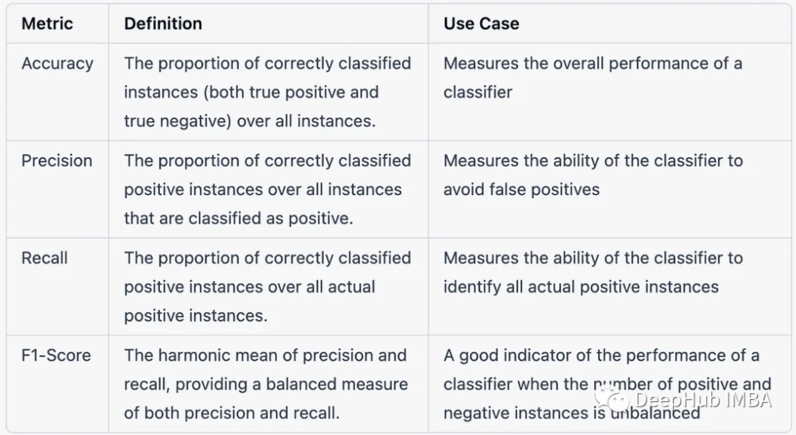

目录

- [评价指标常见问题](#评价指标常见问题)
  - [在机器学习的背景下解释精度和召回率之间的区别](#在机器学习的背景下解释精度和召回率之间的区别)
  - [绍以下模型评估中精度和召回率之间的权衡](#绍以下模型评估中精度和召回率之间的权衡)
  - [介绍一下用 F1 score 吗](#介绍一下用-f1-score-吗)
  - [如何为给定的问题选择合适的评估指标](#如何为给定的问题选择合适的评估指标)
  - [解释在模型评估中使用 ROC 曲线的原因](#解释在模型评估中使用-roc-曲线的原因)
  - [如何确定二元分类模型的最佳阈值](#如何确定二元分类模型的最佳阈值)
  - [如何评估聚类模型的性能](#如何评估聚类模型的性能)
  - [多类分类问题的背景下各种指标之间的区别](#多类分类问题的背景下各种指标之间的区别)
  - [如何评估推荐系统的性能](#如何评估推荐系统的性能)
  - [在评估模型性能时如何处理不平衡的数据集](#在评估模型性能时如何处理不平衡的数据集)
  - [在样本数据不均匀的情况下使用 ROC 更好还是 PRC 更好](#在样本数据不均匀的情况下使用-roc-更好还是-prc-更好)
- [推荐系统](#推荐系统)
- [排序](#排序)
- [参考](#参考)

在机器学习或者深度学习领域，我们在为待解决的问题生成预测模型后，
需要对这个模型对未知数据的泛化性能进行评估，
性能度量方法就是评估模型泛化能力的评价标准

# 评价指标常见问题

## 在机器学习的背景下解释精度和召回率之间的区别

在机器学习模型中，精度和召回率是两个常用的评估指标。
精度是衡量模型在所有正预测中做出的真正正预测的数量，
表示模型避免假阳性预测的能力，其数学表达式为：

`$$Precision = \frac{TP}{TP+FP}$$`

召回率是衡量模型在数据集中所有实际正实例中做出的真正预测的数量。
召回率表示模型正确识别所有正实例的能力，其数学表达式为：

`$$Recall = \frac{TP}{TP+FN}$$`

精确性和召回率都是重要的评估指标，但两者之间的权衡取决于要解决的具体问题的要求。
例如：
* 在医学诊断中，召回率可能更重要，因为它对识别一种疾病的所有病例至关重要，
  即使这会导致更高的假阳性率
* 在欺诈检测中，精确度可能更重要，因为避免虚假指控至关重要，即使这会导致更高的假阴性率

## 绍以下模型评估中精度和召回率之间的权衡

模型评估中精度和召回率之间的权衡是指正确识别正面实例(召回率)和正确识别仅正面实例(召回率)之间的权衡。
精度高意味着假阳性的数量低，而召回率高意味着假阴性的数量低。对于给定的模型，
通常不可能同时最大化精度和召回率。为了进行这种权衡，需要考虑问题的特定目标和需求，
并选择与它们相一致的评估度量

## 介绍一下用 F1 score 吗

F1 score 是机器学习中常用的评估指标，用于平衡精度和召回率。
精确度衡量的是模型所做的所有正面预测中正观察的比例，
而召回率衡量的是所有实际正观察中正预测的比例。
F1 score 是精度和召回率的调和平均值，通常用作总结二元分类器性能的单一指标

`$$F1 = \frac{2 * (Precision * Recall)}{Precision + Recall}$$`

在模型必须在精度和召回率之间做出权衡的情况下，F1 score 比单独使用精度或召回率提供了更细致的性能评估。
例如，在假阳性预测比假阴性预测成本更高的情况下，优化精度可能更重要，而在假阴性预测成本更高的情况下，
可能会优先考虑召回。F1 score 可用于评估模型在这些场景下的性能，
并就如何调整其阈值或其他参数来优化性能给出相应的数据支持

## 如何为给定的问题选择合适的评估指标

为给定的问题选择适当的评估是模型开发过程的一个关键方面。
在选择指标时，考虑问题的性质和分析的目标是很重要的。需要考虑的一些常见因素包括：

* 问题类型：是二元分类问题、多类分类问题、回归问题还是其他问题
* 业务目标：分析的最终目标是什么，需要什么样的性能？例如，如果目标是最小化假阴性，召回率将是一个比精度更重要的指标
* 数据集特征：类是平衡的还是不平衡的？数据集是大还是小？
* 数据质量：数据的质量如何，数据集中存在多少噪声？

基于这些因素，可以选择一个评估指标，如 Accuracy、F1-score、AUC-ROC、Precision-Recall、均方误差等。
但是一般都会使用多个评估指标来获得对模型性能的完整理解

## 解释在模型评估中使用 ROC 曲线的原因

ROC 曲线是二元分类模型性能的图形表示，该模型绘制真阳性率(TPR)与假阳性率(FPR)。
它有助于评估模型的敏感性(真阳性)和特异性(真阴性)之间的权衡，
并广泛用于评估基于二元分类结果(如是或否、通过或失败等)进行预测的模型

ROC 曲线通过比较模型的预测结果和实际结果来衡量模型的性能。
一个好的模型在 ROC 曲线下有很大的面积，这意味着它能够准确地区分正类和负类。
ROC AUC(Area Under the Curve，曲线下面积) 用于比较不同模型的性能，
特别是在类别不平衡时评估模型性能的好方法

## 如何确定二元分类模型的最佳阈值

二元分类模型的最佳阈值是通过找到在精度和召回率之间平衡的阈值来确定的。
这可以通过使用评估指标来实现，例如 F1 score，它平衡了准确性和召回率，
或者使用 ROC 曲线，它绘制了各种阈值的真阳性率和假阳性率

最佳阈值通常选择 ROC 曲线上最接近左上角的点，因为这样可以最大化真阳性率，
同时最小化假阳性率

在实践中，最佳阈值还可能取决于问题的具体目标以及与假阳性和假阴性相关的成本

## 如何评估聚类模型的性能

聚类模型的性能可以使用许多指标进行评估。一些常见的指标包括：

* Silhouette 分数：它衡量观察到自己的簇与其他簇相比的相似性。
  分数范围从 -1 到 1，值越接近 1 表示聚类结构越强
* Calinski-Harabasz 指数：它衡量的是簇间方差与簇内方差的比值。较高的值表示更好的聚类解决方案
* Davies-Bouldin 指数：它衡量每个簇与其最相似的簇之间的平均相似性。较小的值表示更好的聚类解决方案
* Adjusted Rand 指数：它测量真实类标签和预测聚类标签之间的相似性，并根据概率进行调整。
  较高的值表示更好的聚类解决方案
* 混淆矩阵：它可以通过将预测的聚类与真实的类进行比较来评估聚类模型的准确性

## 多类分类问题的背景下各种指标之间的区别

## 如何评估推荐系统的性能

评估推荐系统的性能包括衡量系统向用户推荐相关项目的有效性和效率。一些常用的用于评估推荐系统性能的指标包括:

* Precision：与用户相关的推荐项目的比例
* Recall：系统推荐相关项目的比例
* F1-Score：精密度和召回率的调和平均值
* Mean Average Precision (MAP)：一个推荐系统的整体用户的平均精度的度量
* Normalized Discounted Cumulative Gain (NDCG)：衡量推荐项目的等级加权相关性
* Root Mean Square Error (RMSE)：对一组项目的预测评分和实际评分之间的差异进行测量

## 在评估模型性能时如何处理不平衡的数据集

为了在模型评估中处理不平衡的数据集，可以使用以下几种技术:

* 重新采样数据集：对少数类进行过采样或对多数类进行过采样，以平衡类分布
* 使用不同的评估指标：诸如精度、召回率、F1-score 和 ROC 曲线下面积(AUC-ROC)等指标对类别不平衡很敏感，
  可以更好地理解模型在不平衡数据集上的性能
* 使用代价敏感学习：为不同类型的错误分类分配成本，例如为假阴性分配比假阳性更高的成本，
  以使模型对少数类别更敏感
* 使用集成方法：通过组合多个模型的结果，可以使用 bagging、
  boosting 和 stacking 等技术来提高模型在不平衡数据集上的性能
* 混合方法：上述技术的组合可用于处理模型评估中的不平衡数据集

## 在样本数据不均匀的情况下使用 ROC 更好还是 PRC 更好

> 虽然 ROC 适用于评估分类器的整体性能，但是对于类别不均衡的数据，ROC 曲线往往会过于“乐观”，因此还是 PR 曲线更好

我们知道，ROC 表示了 TPR(True Positive Rate)和 FPR(False Positive Rate)之间的关系。
TPR 是在正样本的基础上计算的，FPR 是在负样本的基础上计算的，因此即使正负样本的比例不均衡，
计算结果并不会改变。我们只需要注意保证样本的绝对数量不能太低，让 TPR 和 FPR 统计意义上有意义

与之相对的，精度召回曲线的情况恰恰相反，尽管召回率只在正样本基础上计算，
精度准确率需要同时测量正和负样本，因此精确度的测量取决于数据中的正负之比

ROC 曲线由于兼顾正例与负例，所以适用于评估分类器的整体性能，相比而言 PR 曲线完全聚焦于正例

一种常见的认为 ROC 适用不均衡数据集的错误观点是，反正 TPR 和 FPR 的计算方式都是比值，因此数据是否均衡并不重要

* 首先运用极限思想，在二分类问题中假设 A 类数据占据了 99.99%，那么分类器只需要预测所有数据为 A 类即可。这显然不合理
* 其次对于多分类问题，ROC 也会因为“负类”的概念出现问题。即使你的数据在各个类别里是均匀分布的，
  对于 negative class，也就是所有的不是你目标的类别，也必定会被过度代表，
  而 Precision Recall 曲线可以很好地解决这个问题

那么 ROC 曲线适合被应用在什么地方呢？

ROC 曲线主要不是为了显示出阈值是多少，而是关于模型在使用某个阈值时特征空间中数据的分离程度。
对于一个鲁棒的分类器，TPR 提升的速度应该远远地高于 FPR 提升的速度(凹函数)。
因此可以根据具体的应用，在曲线上找到最优的点，得到相对应的 precision 和 recall 等指标，
去调整模型的阈值，从而得到一个符合具体应用的模型

因此数据中如果存在不同的类别分布，且想要比较分类器的性能且剔除类别分布改变的影响，
则 ROC 曲线比较适合；反之，如果想测试相同类别分布下对分类器的性能的影响，则 PR 曲线比较适合

最后我们得到一个有点反直觉的结论：

* ROC 曲线选用的两个指标不依赖数据中具体的类别分布，因此不适合被应用于数据分布极度不均的任务中

# 推荐系统

# 排序

# 参考

* [损失函数softmax_cross_entropy、binary_cross_entropy、sigmoid_cross_entropy之间的区别与联系](https://blog.csdn.net/sjyttkl/article/details/103958639)
* [Optimizing probabilities for best MCC](https://www.kaggle.com/cpmpml/optimizing-probabilities-for-best-mcc)
* [Model Fit Metrics](https://www.kaggle.com/residentmario/model-fit-metrics)
* https://github.com/nagadomi/kaggle-coupon-purchase-prediction
* https://github.com/viig99/stackexchange-transfer-learning
* https://deepsense.io/deep-learning-for-satellite-imagery-via-image-segmentation/
* https://arxiv.org/pdf/1505.04597.pdf
* https://github.com/toshi-k/kaggle-satellite-imagery-feature-detection