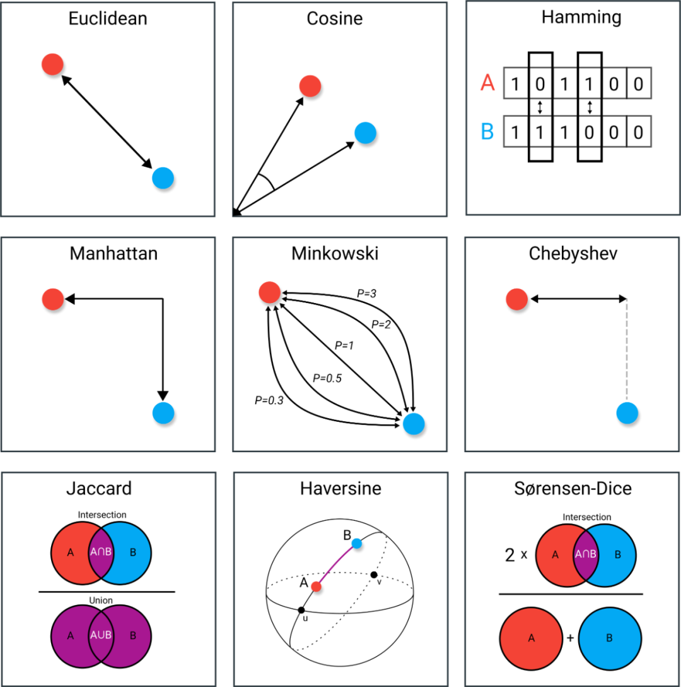
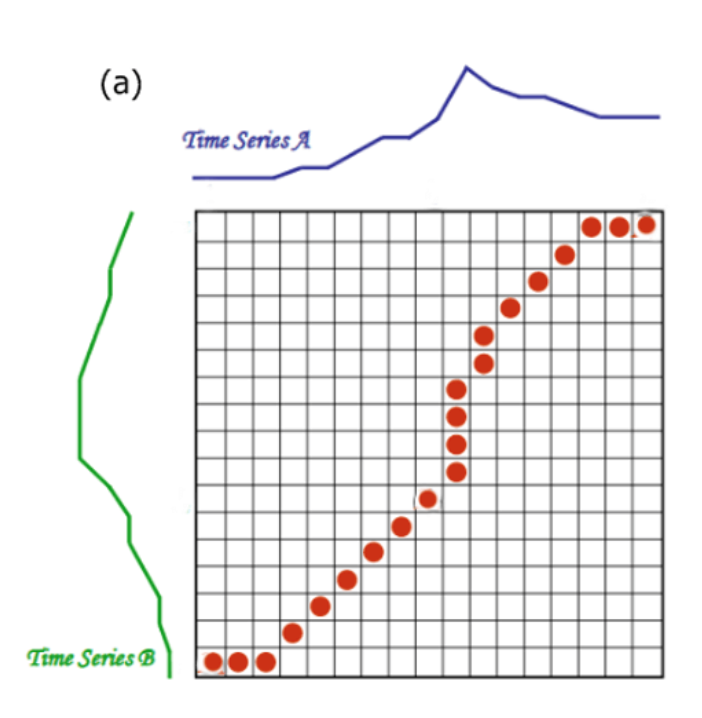

目录

- [相似性度量](#相似性度量)
  - [欧氏距离(Euclidean Distance)](#欧氏距离euclidean-distance)
    - [定义](#定义)
    - [缺点](#缺点)
    - [用例](#用例)
  - [余弦相似度(Cosine Similarity)](#余弦相似度cosine-similarity)
    - [定义](#定义-1)
    - [缺点](#缺点-1)
    - [用例](#用例-1)
  - [汉明距离(Hamming Distance)](#汉明距离hamming-distance)
    - [定义](#定义-2)
    - [缺点](#缺点-2)
    - [用例](#用例-2)
  - [曼哈顿距离(Manhattan Distance)](#曼哈顿距离manhattan-distance)
    - [定义](#定义-3)
    - [缺点](#缺点-3)
    - [用例](#用例-3)
  - [切比雪夫距离(Chebyshev Distance)](#切比雪夫距离chebyshev-distance)
    - [定义](#定义-4)
    - [缺点](#缺点-4)
    - [用例](#用例-4)
  - [闵可夫斯基距离(Minkowski Distance)](#闵可夫斯基距离minkowski-distance)
    - [定义](#定义-5)
    - [缺点](#缺点-5)
    - [用例](#用例-5)
  - [马哈拉诺比斯距离(Mahalanobis Distance)](#马哈拉诺比斯距离mahalanobis-distance)
  - [雅卡尔指数(Jaccard Index)](#雅卡尔指数jaccard-index)
    - [定义](#定义-6)
    - [缺点](#缺点-6)
    - [用例](#用例-6)
  - [半正矢(Haversine)](#半正矢haversine)
    - [定义](#定义-7)
    - [缺点](#缺点-7)
    - [用例](#用例-7)
  - [Sørensen-Dice 系数](#sørensen-dice-系数)
    - [缺点](#缺点-8)
    - [用例](#用例-8)
  - [Pearson 相关系数](#pearson-相关系数)
- [时间序列相似性度量](#时间序列相似性度量)
  - [闵可夫斯基距离(Minkowski Distance)](#闵可夫斯基距离minkowski-distance-1)
    - [定义](#定义-8)
    - [缺点](#缺点-9)
    - [用例](#用例-9)
  - [马哈拉诺比斯距离(Mahalanobis Distance)](#马哈拉诺比斯距离mahalanobis-distance-1)
  - [DTW 距离](#dtw-距离)
  - [参数距离](#参数距离)
    - [基于相关性的相似度度量方法](#基于相关性的相似度度量方法)
    - [基于自相关系数的相似度度量方法](#基于自相关系数的相似度度量方法)
    - [基于周期性的相似度度量方法](#基于周期性的相似度度量方法)
- [参考](#参考)

# 相似性度量

## 欧氏距离(Euclidean Distance)

### 定义

欧式距离可解释为连接两个点的线段的长度。欧式距离公式非常简单，使用勾股定理从这些点的笛卡尔坐标计算距离

`$$D(x, y) = \sqrt{\sum_{i=1}^{n}(x_{i} - y_{i})^{2}}$$`

### 缺点

尽管这是一种常用的距离度量，但欧式距离并不是尺度不变的，
这意味着所计算的距离可能会根据特征的单位发生倾斜。
通常，在使用欧式距离度量之前，需要对数据进行归一化处理

此外，随着数据维数的增加，欧氏距离的作用也就越小。
这与维数灾难(curse of dimensionality)有关

### 用例

当拥有低维数据且向量的大小非常重要时，欧式距离的效果非常好。
如果在低维数据上使用欧式距离，则如 k-NN 和 HDBSCAN 之类的方法可达到开箱即用的效果

## 余弦相似度(Cosine Similarity) 

### 定义

余弦相似度经常被用作处理高维欧式距离问题。余弦相似度是指两个向量夹角的余弦。
如果将向量归一化为长度均为 1 的向量，则向量的点积也相同

两个方向完全相同的向量的余弦相似度为 1，而两个彼此相对的向量的余弦相似度为 -1。
注意，它们的大小并不重要，因为这是在方向上的度量

`$$D(x, y) = cos(\theta) = \frac{x \cdot y}{||x|| ||y||}$$`

### 缺点

余弦相似度的一个主要缺点是没有考虑向量的大小，而只考虑它们的方向。
以推荐系统为例，余弦相似度就没有考虑到不同用户之间评分尺度的差异

### 用例

当我们对高维数据向量的大小不关注时，可以使用余弦相似度。
对于文本分析，当数据以单词计数表示时，经常使用此度量。
例如，当一个单词在一个文档中比另一个单词更频繁出现时，
这并不一定意味着文档与该单词更相关。
可能是文件长度不均匀或者计数的重要性不太重要。
我们最好使用忽略幅度的余弦相似度

## 汉明距离(Hamming Distance)

### 定义

汉明距离是两个向量之间不同值的个数。它通常用于比较两个相同长度的二进制字符串。
它还可以用于字符串，通过计算不同字符的数量来比较它们之间的相似程度

### 缺点

当两个向量长度不相等时，汉明距离使用起来很麻烦。
当幅度是重要指标时，建议不要使用此距离指标

### 用例

典型的用例包括数据通过计算机网络传输时的错误纠正/检测。
它可以用来确定二进制字中失真的数目，作为估计误差的一种方法。
此外，你还可以使用汉明距离来度量分类变量之间的距离

## 曼哈顿距离(Manhattan Distance)

### 定义

曼哈顿距离通常称为出租车距离或城市街区距离，用来计算实值向量之间的距离。
想象一下均匀网格棋盘上的物体，如果它们只能移动直角，
曼哈顿距离是指两个向量之间的距离，在计算距离时不涉及对角线移动

`$$D(x, y) = \sum_{i=1}^{n}|x_{i} - y_{i}|$$`

### 缺点

尽管曼哈顿距离在高维数据中似乎可以工作，但它比欧式距离直观性差，尤其是在高维数据中使用时。
此外，由于它可能不是最短路径，有可能比欧氏距离给出一个更高的距离值

### 用例

当数据集具有离散或二进制属性时，曼哈顿距离似乎工作得很好，因为它考虑了在这些属性的值中实际可以采用的路径。
以欧式距离为例，它会在两个向量之间形成一条直线，但实际上这是不可能的

## 切比雪夫距离(Chebyshev Distance)

### 定义

切比雪夫距离定义为两个向量在任意坐标维度上的最大差值。换句话说，它就是沿着一个轴的最大距离。
切比雪夫距离通常被称为棋盘距离，因为国际象棋的国王从一个方格到另一个方格的最小步数等于切比雪夫距离

`$$D(x, y) = \underset{p \rightarrow \infty}{lim}\Bigg(\sum_{i=1}^{n}|x_{i} - y_{i}|^{p}\Bigg)^{\frac{1}{p}} = \underset{i=1 \rightarrow n}{max}(|x_{i} - y_{i}|)$$`

### 缺点

切比雪夫距离通常用于特定的用例，这使得它很难像欧氏距离或余弦相似度那样作为通用的距离度量。
因此，在确定适合用例时才使用它。

### 用例

切比雪夫距离用于提取从一个方块移动到另一个方块所需的最小移动次数。
此外，在允许无限制八向移动的游戏中，这可能是有用的方法。
在实践中，切比雪夫距离经常用于仓库物流，因为它非常类似于起重机移动一个物体的时间

## 闵可夫斯基距离(Minkowski Distance)

### 定义

闵氏距离比大多数距离度量更复杂。它是在范数向量空间(`$n$` 维实数空间)中使用的度量，
这意味着它可以在一个空间中使用，在这个空间中，距离可以用一个有长度的向量来表示

`$$D(x, y) = \Bigg(\sum_{i=1}^{n}|x_{i} - y_{i}|^{p}\Bigg)^{\frac{1}{p}}$$`

最有趣的一点是，我们可以使用参数 `$p$` 来操纵距离度量，使其与其他度量非常相似。
常见的 `$p$` 值有：

* `$p=1$`：曼哈顿距离
* `$p=2$`：欧氏距离
* `$p=\infty$`：切比雪夫距离

### 缺点

闵氏距离与它们所代表的距离度量有相同的缺点，因此，对：曼哈顿距离、
欧几里得距离和切比雪夫距离等度量标准有个好的理解非常重要。
此外，参数 `$p$` 的使用可能很麻烦，因为根据用例，查找正确的 `$p$` 值在计算上效率低

闵可夫斯基距离比较直观，但是它与数据的分布无关，具有一定的局限性，
如果 `$x$` 方向的幅值远远大于 `$y$` 方向的幅值，这个距离公式就会过度被 `$x$` 维度的作用。
因此在加算前，需要对数据进行变换(去均值，除以标准差)。
这种方法在假设数据各个维度不相关的情况下，利用数据分布的特性计算出不同的距离。
如果数据维度之间数据相关，这时该类距离就不合适了

### 用例

`$p$` 的积极一面是可迭代，并找到最适合用例的距离度量。
它允许在距离度量上有很大的灵活性，如果你非常熟悉 `$p$` 和许多距离度量，将会获益多多

## 马哈拉诺比斯距离(Mahalanobis Distance)

若不同维度之间存在相关性和尺度变换等关系，需要使用一种变化规则，
将当前空间中的向量变换到另一个可以简单度量的空间中去测量

假设样本之间的协方差矩阵是 `$\Sigma$`，利用矩阵分解(LU 分解)可以转换为下三角矩阵和上三角矩阵的乘积:

`$$\Sigma = LL^{T}$$`

消除不同维度之间的相关性和尺度变换，需要对样本 `$x$` 做如下处理：

`$$z = L^{-1}(x-\mu)$$`

经过处理的向量就可以利用欧式距离进行度量：

`$$D(x) = z^{T}z = (x - \mu)^{T}\Sigma^{-1}(x-\mu)$$`

## 雅卡尔指数(Jaccard Index)

### 定义

雅卡尔指数(交并比)是用于比较样本集相似性与多样性的统计量。
雅卡尔系数能够量度有限样本集合的相似度，其定义为两个集合交集大小与并集大小之间的比例

例如，如果两个集合有 1 个共同的实体，而有 5 个不同的实体，
那么雅卡尔指数为 1/5 = 0.2。要计算雅卡尔距离，我们只需从 1 中减去雅卡尔指数：

`$$D(x, y) = 1 - \frac{|x \cap y|}{|x \cup y|}$$`

### 缺点

雅卡尔指数的一个主要缺点是它受数据大小的影响很大。大数据集对指数有很大影响，
因为它可以显著增加并集，同时保持交集相似

### 用例

雅卡尔指数通常用于使用二进制或二进制数据的应用程序中。
当你有一个深度学习模型来预测图像分割时，
比如一辆汽车，雅卡尔指数可以用来计算给定真实标签的预测分割的准确度

类似地，它可以用于文本相似性分析，以测量文档之间有多少词语重叠。因此，它可以用来比较模式集合

## 半正矢(Haversine)

### 定义

半正矢距离是指球面上的两点在给定经纬度条件下的距离。
它与欧几里得距离非常相似，因为它可以计算两点之间的最短连线。
主要区别在于半正矢距离不可能有直线，因为这里的假设是两个点都在一个球面上

`$$D(x, y) = 2r \times arcsin\Bigg(\sqrt{sin^{2}(\frac{\varphi_{2} - \varphi_{1}}{2}) + cos(\varphi_{1})cos(\varphi_{2})sin^{2}(\frac{\lambda_{2} - \lambda_{1}}{2})}\Bigg)$$`

### 缺点

这种距离测量的一个缺点是，假定这些点位于一个球体上。实际上，这种情况很少出现，
例如，地球不是完美的圆形，在某些情况下可能使计算变得困难。
相反，如果假定是椭球，使用 Vincenty 距离比较好。

### 用例

半正矢距离通常用于导航。例如，你可以使用它来计算两个国家之间的飞行距离。
请注意，如果距离本身不那么大，则不太适合

## Sørensen-Dice 系数

Sørensen-Dice 系数与雅卡尔指数非常相似，都是度量样本集的相似性和多样性。
尽管它们的计算方法相似，但是 Sørensen-Dice 系数更直观一些，
因为它可以被视为两个集合之间重叠的百分比，这个值在 0 到 1 之间：

`$$D(x, y) = \frac{2|x \cap y|}{|x| + |y|}$$`

### 缺点

正如雅卡尔指数，Sørensen-Dice 系数也夸大了很少或没有真值的集合的重要性，
因此，它可以控制多集合的平均得分，还可以控制多组平均得分并按相关集合的大小成反比地加权每个项目，
而不是平等对待它们

### 用例

用例与雅卡尔指数相似，它通常用于图像分割任务或文本相似性分析

## Pearson 相关系数

# 时间序列相似性度量

两个时间序列的相似定义很简单：距离最近且形状相似。那么如何量化这些相似呢？
直觉的，要对序列之间的距离进行量化。
对于长度相同的序列，计算每两点之间的距离然后求和，距离越小相似度越高

## 闵可夫斯基距离(Minkowski Distance)

### 定义

闵氏距离比大多数距离度量更复杂。它是在范数向量空间(`$n$` 维实数空间)中使用的度量，
这意味着它可以在一个空间中使用，在这个空间中，距离可以用一个有长度的向量来表示

`$$D(x, y) = \Bigg(\sum_{i=1}^{n}|x_{i} - y_{i}|^{p}\Bigg)^{\frac{1}{p}}$$`

最有趣的一点是，我们可以使用参数 `$p$` 来操纵距离度量，使其与其他度量非常相似。
常见的 `$p$` 值有：

* `$p=1$`：曼哈顿距离
* `$p=2$`：欧氏距离
* `$p=\infty$`：切比雪夫距离

### 缺点

闵氏距离与它们所代表的距离度量有相同的缺点，因此，对：曼哈顿距离、
欧几里得距离和切比雪夫距离等度量标准有个好的理解非常重要。
此外，参数 `$p$` 的使用可能很麻烦，因为根据用例，查找正确的 `$p$` 值在计算上效率低

闵可夫斯基距离比较直观，但是它与数据的分布无关，具有一定的局限性，
如果 `$x$` 方向的幅值远远大于 `$y$` 方向的幅值，这个距离公式就会过度被 `$x$` 维度的作用。
因此在加算前，需要对数据进行变换(去均值，除以标准差)。
这种方法在假设数据各个维度不相关的情况下，利用数据分布的特性计算出不同的距离。
如果数据维度之间数据相关，这时该类距离就不合适了

### 用例

`$p$` 的积极一面是可迭代，并找到最适合用例的距离度量。
它允许在距离度量上有很大的灵活性，如果你非常熟悉 `$p$` 和许多距离度量，将会获益多多

## 马哈拉诺比斯距离(Mahalanobis Distance)

若不同维度之间存在相关性和尺度变换等关系，需要使用一种变化规则，
将当前空间中的向量变换到另一个可以简单度量的空间中去测量

假设样本之间的协方差矩阵是 `$\Sigma$`，利用矩阵分解(LU 分解)可以转换为下三角矩阵和上三角矩阵的乘积:

`$$\Sigma = LL^{T}$$`

消除不同维度之间的相关性和尺度变换，需要对样本 `$x$` 做如下处理：

`$$z = L^{-1}(x-\mu)$$`

经过处理的向量就可以利用欧式距离进行度量：

`$$D(x) = z^{T}z = (x - \mu)^{T}\Sigma^{-1}(x-\mu)$$`

## DTW 距离

当序列长度不相等的时候，如何比较两个序列的相似性呢？
这里我们需要动态时间规整(Dynamic Time Warping；DTW)方法，
该方法是一种将时间规整和距离测度相结合的一种非线性规整技术。
主要思想是把未知量均匀地伸长或者缩短，直到与参考模式的长度一致，
在这一过程中，未知量的时间轴要不均匀地扭曲或弯折，
以使其特征与参考模式特征对正。DTW 距离可以帮助我们找到更多序列之间的形状相似

假设有两个时间序列 `$A = \{a_{1}, a_{2}, \ldots, a_{n}\}$` 和 `$B = \{b_{1}, b_{2}, \ldots, b_{m}\}$`。
构造一个尺寸为 `$(n, m)$` 的矩阵，
第 `$(i, j)$` 单元记录了两个点 `$(a_{i}, b_{j})$` 之间的欧式距离 `$d(a_{i}, b_{j}) = |a_{i} - b_{j}| = \sqrt{(a_{i} - b_{j})^{2}}$`。如下图：

一条弯折的路径 `$W$`，由若干个彼此相连的矩阵单元构成，这条路径描述了 `$A$` 和 `$B$` 之间的一种映射。
设第 `$k$` 个单元定义为 `$\omega_{k} = (i, j)_{k}$`，则：

`$$\omega = \{\omega_{1}, \omega_{2}, \ldots, \omega_{K}\}, max\{n, m\} \leq K \leq n+m-1$$`

这条弯折的路径满足以下条件：

1. 边界条件
    - `$\omega_{1} = (1, 1)$` 且 `$\omega_{k} = (n, m)$`
2. 连续性
    - 设 `$\omega_{k} = (a, b)$`，`$\omega_{k-1}=(a', b')$`，那么 `$a-a' \leq 1$`，`$b-b' \leq 1$`
3. 单调性
    - 设 `$\omega_{k} = (a, b)$`，`$\omega_{k-1}=(a', b')$`，那么 `$a-a' \geq 0$`，`$b-b' \geq 0$`

在满足上述条件的多条路径中，距离最短的、花费最少的一条路径是：

`$$DTW(A, B) = min\Big(\frac{1}{K}\sqrt{\sum_{k=1}^{K}\omega_{k}}\Bigg)$$`

DTW 距离的计算是一个动态规划过程，先用欧式距离初始化矩阵，然后使用如下递推公式进行求解：

`$$r(i, j) = d(i, j) + min\{r(i-1, j-1)), r(i-1, j), r(i, j-1)\}$$`

## 参数距离

除了直接的度量原始时间序列之间的距离，很多方法尝试对时间序列进行建模，
并比较其模型参数的相似度。之前我们介绍了时间序列的统计分析方法，这里可以用到的有：

* 基于相关性的相似度度量方法
* 基于自相关系数的相似度度量方法
* 基于周期性的相似度度量方法

还有通过 ARMA 模型抽象时序的参数，进行举例度量，类似方法这里不作展开

### 基于相关性的相似度度量方法

量化两条序列 `$X$` 与 `$Y$` 之间的相关系数：

`$$cor(X_{T}, Y_{T}) = \frac{\sum_{t=1}^{T}(x_{t} - \bar{X}_{T}) \cdot (y_{t} - \bar{Y}_{T})}{\sqrt{\sum_{t=1}^{T}(x_{t} - \bar{X}_{T})} \cdot \sqrt{\sum_{t-1}^{T}(y_{t} - \bar{Y}_{T})^{2}}}$$`

* 如果相关系数 `$cor(X_{T}, Y_{T}) = 1$`，表示它们完全一致
* 如果相关系数 `$cor(X_{T}, Y_{T}) = -1$`，表示它们之间是负相关的

### 基于自相关系数的相似度度量方法

分别抽取曲线X与Y的自相关系数：

`$$\hat{\rho}_{k}  = \frac{\sum_{t=1}^{T-k}(x_{t} - \mu)\cdot(x_{t+k} - \mu)}{(T - k)\sigma^{2}}$$`

定义时间序列之间的距离如下：

`$$D(X_{T}, Y_{T}) = \sqrt{(\hat{\rho}X_{T} - \hat{\rho}Y_{T})^{T}(\hat{\rho}X_{T} - \hat{\rho}Y_{T})}$$`

### 基于周期性的相似度度量方法

通过傅里叶变换得到一组参数，然后通过这组参数来反映原始的两个时间序列时间的距离。数学表达为：

`$$I_{X_{T}}(\lambda_{k}) = T^{-1}\Bigg| \sum_{t=1}^{T}x_{t}e^{-i\lambda_{k}t} \Bigg|^{2}$$`

`$$I_{Y_{T}}(\lambda_{k}) = T^{-1}\Bigg| \sum_{t=1}^{T}y_{t}e^{-i\lambda_{k}t} \Bigg|^{2}$$`

`$$D(X_{T}, Y_{T}) = \frac{1}{n}\sqrt{\sum_{k=1}^{n}(I_{X_{T}}(\lambda_{k}) - I_{Y_{T}}(\lambda_{k}))^{2}}$$`

# 参考

* [[1] 时间序列聚类](https://mp.weixin.qq.com/s?__biz=Mzg3NDUwNTM3MA==&mid=2247484837&idx=1&sn=cdc922e6a213064485113bbb9b8e911e&chksm=cecef050f9b9794672f0227b36212a1fcf8acb1916c6e12e923bcdf5e9ac71b0aa9e7bb7f58d&scene=21#wechat_redirect)
* [[2] 一文读懂常见的9种距离度量方法](https://mp.weixin.qq.com/s/UrCSFonkg0nYxwtLPWlSxA)

