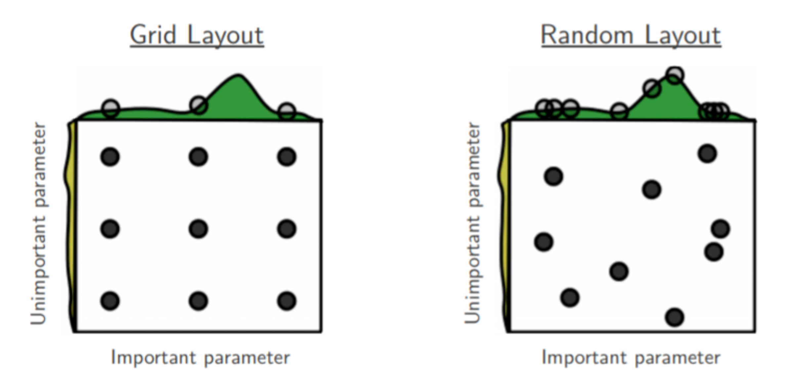
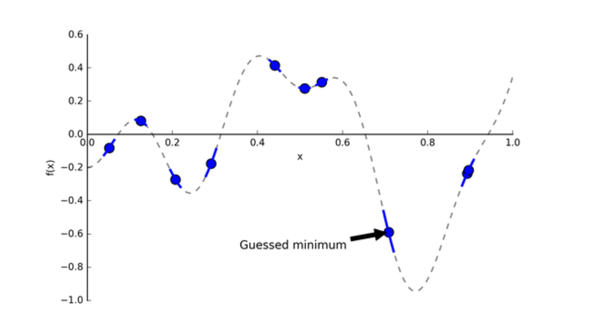
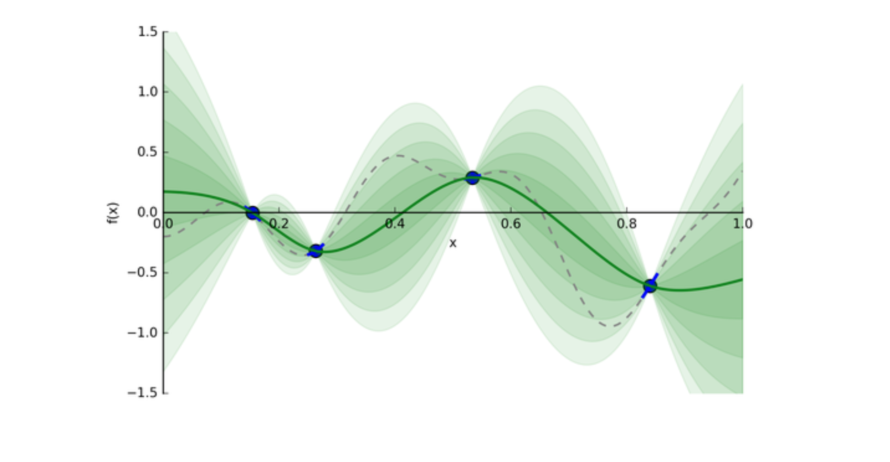
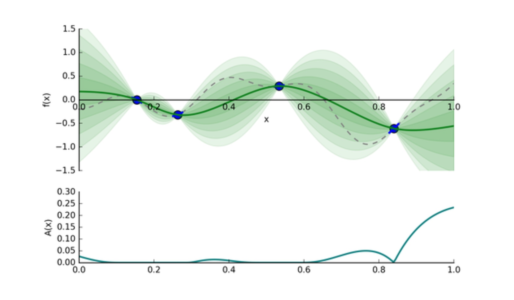
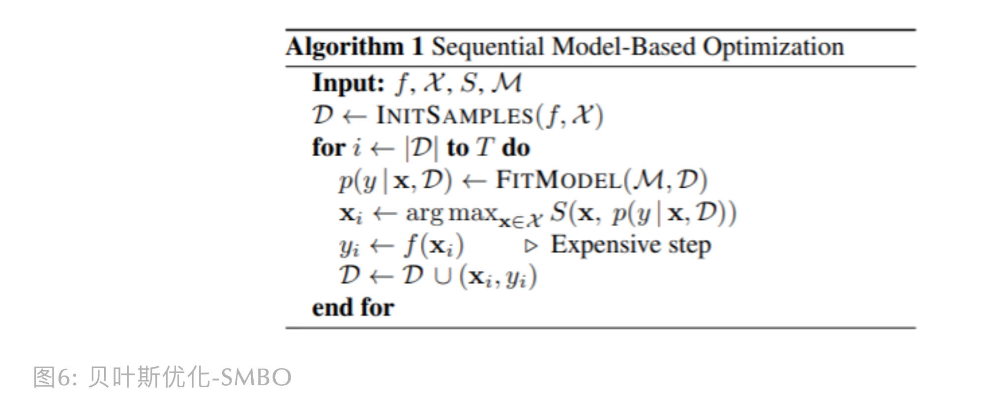

<style>
details {
    border: 1px solid #aaa;
    border-radius: 4px;
    padding: .5em .5em 0;
}
summary {
    font-weight: bold;
    margin: -.5em -.5em 0;
    padding: .5em;
}
details[open] {
    padding: .5em;
}
details[open] summary {
    border-bottom: 1px solid #aaa;
    margin-bottom: .5em;
}
</style>

<details><summary>目录</summary><p>

- [模型调优简介](#模型调优简介)
- [模型调优方法](#模型调优方法)
  - [Grid Search](#grid-search)
    - [示例](#示例)
  - [Randomized Search](#randomized-search)
    - [示例](#示例-1)
  - [Halving Grid Search](#halving-grid-search)
    - [示例](#示例-2)
  - [Halving Random Search](#halving-random-search)
    - [示例](#示例-3)
  - [贝叶斯优化](#贝叶斯优化)
    - [代理模型](#代理模型)
    - [采集函数](#采集函数)
    - [贝叶斯优化步骤](#贝叶斯优化步骤)
    - [Hyperopt 库](#hyperopt-库)
    - [贝叶斯优化的使用情况](#贝叶斯优化的使用情况)
  - [HyperBand](#hyperband)
- [模型调优工具](#模型调优工具)
  - [Optuna](#optuna)
- [参考](#参考)
</p></details><p></p>

# 模型调优简介

在实际建模中很少会花过多时间在超参的调优上，因为它带来的收益是有限的，
很多时候比起压榨模型来说，思考和挖掘数据特征能带来更多的收益，
所以这也是为什么说：在任何想要调优超参时，先用格子搜索或随机搜索吧

# 模型调优方法

在建模时模型的超参数对精度有一定的影响，而设置和调整超参数的取值，往往称为调参

在实践中调参往往依赖人工来进行设置调整范围，然后使用机器在超参数范围内进行搜素。
这里先介绍在 sklearn 中支持的四种基础超参数搜索方法

* Grid Search
* Randomized Search
* HalvingGridSearch
* HalvingRandomSearch

`HalvingGridSearch` 和 `HalvingRandomSearch` 比较适合在数据量比较大的情况使用，
可以提高训练速度。如果计算资源充足，`GridSearch` 和 `HalvingGridSearch` 会得到更好的结果

除了 sklearn，还有一些高阶调参库，其中也会有数据量改变的思路。如在 Optuna 中，
核心是参数组合的生成和剪枝、训练的样本增加等细节

除此之外，还有广为所知的超参自动优化方法

* 贝叶斯优化
* Hyperband

数据和模型示例：

```python
import pandas as pd
from sklearn.ensemble import RandomForestClassifier
from sklearn.model_select import GridSearchCV, RandomizedSearchCV


# 数据读取
df = pd.read_csv('https://mirror.coggle.club/dataset/heart.csv')
X = df.drop(columns = ['output'])
y = df['output']

# 数据划分
x_train, x_test, y_train, y_test = train_test_split(X, y, stratify = y)

# 模型训练与计算准确率
clf = RandomForestClassifier(random_state = 0)
clf.fit(x_train, y_train)
clf.score(x_test, y_test)
```

## Grid Search

GridS earch 是比较基础的超参数搜索方法，中文名字网格搜索。
网格搜索是暴力搜索，在给定超参搜索空间内，尝试所有超参组合，最后搜索出最优的超参组合

### 示例

如下代码所示，对 4 个超参数进行搜索，搜索空间为 `5 * 3 * 2 * 3 = 90` 组超参数。
对于每组超参数还需要计算 5 折交叉验证，则需要训练 450 次

```python
parameters = {
    'max_depth': [2,4,5,6,7],
    'min_samples_leaf': [1,2,3],
    'min_weight_fraction_leaf': [0, 0.1],
    'min_impurity_decrease': [0, 0.1, 0.2]
}

# Fitting 5 folds for each of 90 candidates, totalling 450 fits
clf = GridSearchCV(
    estimator = RandomForestClassifier(random_state = 0),
    param_grid = parameters, 
    scoring = "accuracy",
    n_jobs = -1,
    cv = 5,
    refit = True, 
    verbose = 1,
)
clf.fit(x_train, y_train)
test_score = clf.best_estimator_.score(x_test, y_test)

print('详细结果:\n', pd.DataFrame.from_dict(clf.cv_results_))
print('最佳分类器:\n', clf.best_estimator_)
print('最佳分数:\n', clf.best_score_)
print('最佳参数:\n', clf.best_params_)
```

模型最终在测试集精度为：`0.802`

## Randomized Search

Randomized Search（随机搜索） 是在一定范围内进行搜索，
且需要设置搜索的次数，其默认不会对所有的组合进行搜索。
随机搜索是在搜索空间中采样出超参组合，然后选出采样组合中最优的超参组合。
随机搜索的好处如下图所示：



解释上图，如果目前我们要搜索两个参数，但参数 A 重要而另一个参数 B 并没有想象中重要，
网格搜索 9 个参数组合 (A, B)，而由于模型更依赖于重要参数 A，
所以只有 3 个参数值是真正参与到最优参数的搜索工作中。
反观随机搜索，随机采样 9 种超参组合，在重要参数 A 上会有 9 个参数值参与到搜索工作中，
所以，在某些参数对模型影响较小时，使用随机搜索能让我们有更多的探索空间

### 示例

`n_iter` 代表超参数组合的个数，默认会设置比所有组合次数少的取值，
如下面设置的为 `10`，则只进行 `50` 次训练

```python
parameters = {
    'max_depth': [2,4,5,6,7],
    'min_samples_leaf': [1,2,3],
    'min_weight_fraction_leaf': [0, 0.1],
    'min_impurity_decrease': [0, 0.1, 0.2]
}

clf = RandomizedSearchCV(
    estimator = RandomForestClassifier(random_state = 0),
    param_distributions = parameters, 
    n_iter = 10,
    scoring = "accuracy",
    cv = 5,
    refit = True, 
    n_jobs = -1
    verbose = 1,
    random_state = 2023 
)

clf.fit(x_train, y_train)
clf.best_estimator_.score(x_test, y_test)

# 打印结果
print('详细结果:\n', pd.DataFrame.from_dict(clf.cv_results_))
print('最佳分类器:\n', clf.best_estimator_)
print('最佳分数:\n', clf.best_score_)
print('最佳参数:\n', clf.best_params_)
```

模型最终在测试集精度为：0.815

## Halving Grid Search

Halving Grid Search 和 Grid Search 非常相似，但在迭代的过程中是有参数组合减半的操作

> 最开始使用所有的超参数组合，但使用最少的数据，筛选其中最优的超参数，增加数据再进行筛选

HalvingGridSearch 的思路和 HyperBand 的思路非常相似，但是最朴素的实现。
先使用少量数据筛选超参数组合，然后使用更多的数据验证精

### 示例

```python

```

模型最终在测试集精度为：0.855

## Halving Random Search

Halving Random Search 和 Halving Grid Search 类似，都是逐步增加样本，减少超参数组合。
但每次生成超参数组合，都是随机筛选的

### 示例

```python

```

模型最终在测试集精度为：0.828

## 贝叶斯优化

> Bayesian Optimization，贝叶斯优化

### 代理模型

调优的目的是要找到一组最优的超参组合，能使目标函数 `$f$` 达到全局最小值

举个例子，若学习率设置过大，模型可能会在代价函数的全局最优点附近不断来回震荡，甚至跳出全局最优点，
而设置过小，又可能会陷入局部最优，因此调学习率这一参数，是为了让模型能收敛到代价函数的全局最小值。
可是在机器学习中，目标函数  常是被称作 expensive blackbox function，计算开销大且不一定为凸函数。
为此，贝叶斯优化出现了，它特别适合针对 expensive blackbox function 找到全局最优

假设我们的真实的目标函数 `$f(x)$` 长下图这样：


注意: 目标函数 `$f(x)$` 的 `$x$` 是指超参数，我们希望找到最优的超参 `$x$` 去得到最小的 `$f(x)$`。
为什么用虚线表示 `$f(x)$` 呢？因为它是黑箱函数(blackbox function)

现在，我们怎么找到 `$f(x)$` 全局最小值点呢？我们能不能先在 `$f(x)$` 上随机采样 10 个点，然后取它们的最小值呢？



上图里确实有个点挺靠近全局最优点的，那是不是在它附近再采样几个点，不断重复就行了？
没那么简单，万一起始采样点在局部最小值附近，那这种方法会很容易陷入局部最优。
关于“如何找到下一个合适的点”这个问题，我们先放一放，因为我们漏掉一个重点：
每次尝试一种超参值 `$x$`，计算 `$f(x)$` 的代价是昂贵的，为了减轻开销，
贝叶斯优化采用了代理模型(surrogate model)，
代理模型可以被看作是一个简单模型去拟合原本复杂且不好理解的模型，
简单来说，就是 `$f(x)$` 计算太昂贵了，我们就用代理模型去代替它

贝叶斯优化使用了高斯过程(gasussian processes, GP)去构建代理模型。
基于给定的输入和输出，GP 会推断出一个模型(这里为代理模型)。
假设我们从昂贵的 `$f(x)$` 采样了4个点，然后我们把这 4 个点交给 GP，
它会返回一个代理模型，如下图所示：



绿色实线就是 GP 猜的代理模型，绿色条带是输出分布的标准差(即为 Uncertainty)。
我们有了代理模型，后续我们去找下一个合适的超参值，就能带入到计算开销相对较小的代理模型中，
评估给定超参值的情况

### 采集函数

现在，我们来思考回之前提到的问题："如何找到下一个合适的点?"，
这个问题本质是在问：“哪里有全局最小的点？”，为了解决这个问题，我们要关注两个地方：

1. 已开发区域: 在绿色实线上最低的超参点。因为很可能它附近存在全局最优点
2. 未探索区域: 绿色实线上还未被探索的区域。比如上图中相比于 0.15-0.25 区间，
   0.65-0.75 区间更具有探索价值(即该区间 Uncertainty更大)。
   探索该区域有利于减少我们猜测的方差

为了实现以上探索和开发的平衡(exploration-exploitation trade-off)，
贝叶斯优化使用了采集函数(acquisition function)，它能平衡好全局最小值的探索和开发。
采集函数有很多选择，其中最常见的是 expectated of improvement(EI)，
我们先看一个 utility function

`$$u(x) = \max(0, f' - f(x))$$`

`$f'$` 是目前观察到的最小值，`$x$` 是超参值，
我们希望上述 utility function 输出越大越好(即找到的 `$x$` 能获得比当前最小值还小)，
基于 `$u(x)$`，EI 采集函数如下所示:

`$$\begin{align}
a_{EI}(x) &= \mathbb{E}[u(x)|x, D] \\
&= \int_{-\infty}^{f'}(f' - f)N(f;\mu(x), K(x, x))df \\
&= (f' - \mu(x))\phi(f' - f)N(f';\mu(x), K(x, x)) + K(x, x)N(f';\mu(x), K(x, x))
\end{align}$$`

具有最高的 EI 的超参值 `$x$` 会被选择。EI 有两部分：

* 减少均值函数 `$\mu(x)$`，提高 EI
* 增加方差 `$K(x, x)$`，提高 EI

所以 EI 的提高是建立在均值和方差的 trade-off，也是 exploration 和 exploitation 的 trade-off

下图是采集函数 `$A(x)$`，可以看到，`$x=1$` 时 EI 最大，所以我们下一个超参值 `$x$` 应该选1



### 贝叶斯优化步骤

讲到这里，我们来看下完整的贝叶斯优化步骤是怎样的：



SMBO 是简洁版的贝叶斯优化，伪代码上图所示，具体如下：

1. 准备输入: expensive blackbox function `$f$`，超参搜索空间 `$X$`，
   采样数据集 `$D$`(超参组合 `$x$`，对应 `$f(x)$` 输出值)，
   采集函数 `$S$` 和用数据集 `$D$` 拟合的代理模型 `$M$`
2. 基于 `$X$` 和 `$f$`，采样得到数据集 `$D = (x_{1}, y_{1}), \ldots, (x_{i}, y_{i})$` 
3. 循环选 `$N$` 次参数：
    - 3.1 用当前数据集 `$D$` 拟合代理模型 `$M$`，实现模型更新
    - 3.2 选择使采集函数 `$S$` 最大的超参组合 `$x$` 
    - 3.3 将 `$x$` 带入 `$f$` 中，得到输出值 `$f$`。(注意这里 `$f$` 的计算开销大)
    - 3.4 将新的 `$(x, y)$` 加入到现有数据集 `$D$` 中

### Hyperopt 库

目前，Hyperopt 开源代码库已实现基于 TPE(Tree-structured Parzen Estimator Approach)的贝叶斯优化，
在 SMBO 中我们能看到 GP 构建的概率模型是 `$p(y|x)$`，而 TPE 是 `$p(x|y)$` 和 `$p(y)$`。

TPE 样例代码如下：

```python
import pandas as pd
from sklearn import svm, datasets
from sklearn.model_selection import cross_val_score
from hyperopt import hp, fmin, tpe, space_eval


# 导入数据
iris = datasets.load_iris()

# step1: 定义目标函数
def objective(params):
      # 初始化模型并交叉验证
      svc = svm.SVC(**params)
      cv_scores = cross_val_score(svc, iris.data, iris.target, cv=5)
      # 返回loss = 1 - accuracy (loss必须被最小化)
      loss = 1 - cv_scores.mean()
      return loss

# step2: 定义超参搜索空间
space = {
    'kernel': hp.choice('kernel', ['linear', 'rbf']),
    'C': hp.uniform('C', 1, 10)
}

# step3: 在给定超参搜索空间下，最小化目标函数
best = fmin(objective, space, algo = tpe.suggest, max_evals = 100)

# step4: 打印结果
print(best)
```

```
返回: best_loss: 0.013333333333333308(即accuracy为0.9866666666666667)
返回:{'C': 6.136181888987526, 'kernel': 1}(PS:kernel为0-based index,这里1指rbf)
```

### 贝叶斯优化的使用情况

上面用试了不同的超参自动调优方法，发现贝叶斯优化和随机搜索都比格子搜索好。
从一些论文反映，贝叶斯优化是更香的，但是贝叶斯优化好像在实践中用的不是那么多，
网上也有很多分享者，像 Nagesh Singh Chauhan，说的那样：

> As a general rule of thumb, any time you want to optimize tuning hyperparameters, 
> think Grid Search and Randomized Search! 
> 
> Hyperparameter Optimization for Machine Learning Models - Nagesh Singh Chauhan

为什么呢？我想原因是贝叶斯的开销太大了，前面有提到，在每次循环选超参值的时候，
贝叶斯优化都需要将 `$x$` 带入昂贵的目标函数 `$f(x)$` 中，去得到输出值 `$y$`，
当目标函数特别复杂时，这种情况的评估开销是很大的，更何况随着搜索空间和搜索次数的变大，
计算会越发昂贵。在知乎《为什么基于贝叶斯优化的自动调参没有大范围使用？》中，
很多知乎主也给出了很认真的回复

* [Bayesian Optimization](https://github.com/fmfn/BayesianOptimization)

## HyperBand

除了搜索、随机搜索和贝叶斯优化，还有其它自动调参方式。例如 Hyperband optimization，
Hyperband 本质上是随机搜索的一种变种，它使用早停策略和 Sccessive Halving 算法去分配资源，
结果是 Hyperband 能评估更多的超参组合，同时在给定的资源预算下，比贝叶斯方法收敛更快

在 Hyperband 之后，还出现了 BOHB，它混合了贝叶斯优化和 Hyperband。
Hyperband 和 BOHB 的开源代码可参考 HpBandSter库，这里不展开细讲

# 模型调优工具

## Optuna

* [GitHub](https://github.com/optuna/optuna)
* [optuna可视化调参魔法指南](https://mp.weixin.qq.com/s/RUdYg6OBPIT5jR9ndHiDXg)


# 参考

* [竞赛中的四种超参数搜索方法](https://mp.weixin.qq.com/s/Wx1WMvQQQUV46ckGbE3Eag)
* [超参自动优化方法总结](https://mp.weixin.qq.com/s?__biz=MzUyNzA1OTcxNg==&mid=2247486214&idx=1&sn=b48781aa7ebb7efcca5dc756853e95a9&chksm=fa04156dcd739c7bf2d1c528450b8379deb5d17fea8610161f1c02dda150bceb9f3290b1f0e4&scene=178&cur_album_id=1577157748566310916#rd)
* [贝叶斯优化与自动化实验设计](https://mp.weixin.qq.com/s/sMZAmf3h1XFnTHbycF61rQ)
* [竞赛中的四种超参数搜索方法](https://mp.weixin.qq.com/s/Wx1WMvQQQUV46ckGbE3Eag)
