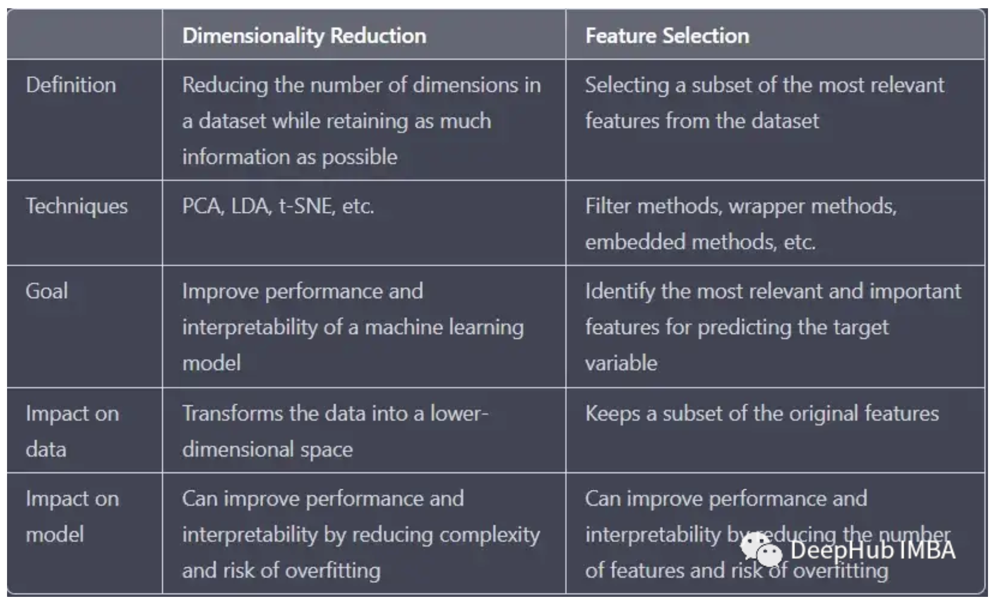

<style>
details {
    border: 1px solid #aaa;
    border-radius: 4px;
    padding: .5em .5em 0;
}
summary {
    font-weight: bold;
    margin: -.5em -.5em 0;
    padding: .5em;
}
details[open] {
    padding: .5em;
}
details[open] summary {
    border-bottom: 1px solid #aaa;
    margin-bottom: .5em;
}
</style>

<details><summary>目录</summary><p>

- [降维和特征选择](#降维和特征选择)
- [模型降维简介](#模型降维简介)
- [主成分分析](#主成分分析)
  - [PCA 实现示例](#pca-实现示例)
- [线性判别分析](#线性判别分析)
  - [LDA 实现示例](#lda-实现示例)
- [t-SNE](#t-sne)
- [独立分量分析](#独立分量分析)
- [LASSO](#lasso)
- [SCAD](#scad)
- [Elastic Net](#elastic-net)
- [其他](#其他)
</p></details><p></p>

# 降维和特征选择

在机器学习中，特征降维和特征选择是两个常见的概念。特征降维和特征选择的目的都是使数据的特征维数降低，
但实际上两者的区别是很大，它们的本质是完全不同的

特征选择从数据集中选择最重要特征的子集，特征选择不会改变原始特征的含义和数值，只是对原始特征进行筛选。
而降维将数据转换为低维空间，会改变原始特征中特征的含义和数值，可以理解为低维的特征映射。
这两种策略都可以用来提高机器学习模型的性能和可解释性，但它们的运作方式是截然不同的



# 模型降维简介

降低数据集中特征的维数，同时保持尽可能多的信息的技术被称为降维。
可以最大限度地降低数据复杂性并提高模型性能

当特征选择完成后，可以直接训练模型了，但是可能由于特征矩阵过大，导致计算量大、训练时间长，
因此降低特征矩阵维度也是必不可少的。常见的降维方法除了以上提到的基于 L1 惩罚项的模型以外，
另外还有主成分分析法（PCA）和线性判别分析（LDA），线性判别分析本身也是一个分类模型

PCA 和 LDA 有很多的相似点，其本质是要将原始的样本映射到维度更低的样本空间中，
但是 PCA 和 LDA 的映射目标不一样：

* PCA 是为了让映射后的样本具有最大的发散性
* LDA 是为了让映射后的样本有最好的分类性能
 
所以说 PCA 是一种无监督的降维方法，而 LDA 是一种有监督的降维方法

# 主成分分析

主成分分析 (PCA) 是一种统计方法，可识别一组不相关的变量，将原始变量进行线性组合，称为主成分。
第一个主成分解释了数据中最大的方差，然后每个后续成分解释主键变少。PCA 经常用作机器学习算法的数据预处理步骤，
因为它有助于降低数据复杂性并提高模型性能

## PCA 实现示例

使用 `sklearn.decomposition` 库的 `PCA` 类选择特征

```python
from sklearn.decomposition import PCA

# 主成分分析法，返回降维后的数据
# 参数 n_components 为主成分数目
PCA(n_components = 2).fit_transform(iris.data)
```

# 线性判别分析

线性判别分析（LDA）是一种用于分类工作的统计工具。它的工作原理是确定数据属性的线性组合，
最大限度地分离不同类别。为了提高模型性能，LDA 经常与其他分类技术(如逻辑回归或支持向量机)结合使用

## LDA 实现示例

使用 `sklearn.lda` 库的 `LDA` 类选择特征

```python
from sklearn.lda import LDA

# 线性判别分析法，返回降维后的数据
# 参数 n_components 为降维后的维数
LDA(n_components = 2).fit_transform(iris.data, iris.target)
```

# t-SNE

t-SNE(t-分布随机邻居嵌入)是一种非线性降维方法，特别适用于显示高维数据集。
它保留数据的局部结构来，也就是说在原始空间中靠近的点在低维空间中也会靠近。
t-SNE 经常用于数据可视化，因为它可以帮助识别数据中的模式和关系

# 独立分量分析

独立分量分析（Independent Component Analysis，ICA）实际上也是对数据在原有特征空间中做的一个线性变换。
相对于 PCA 这种降秩操作，ICA 并不是通过在不同方向上方差的大小，即数据在该方向上的分散程度来判断那些是主要成分，
那些是不需要到特征。而 ICA 并没有设定一个所谓主要成分和次要成分的概念，ICA 认为所有的成分同等重要，
而我们的目标并非将重要特征提取出来，而是找到一个线性变换，使得变换后的结果具有最强的独立性。
PCA 中的不相关太弱，我们希望数据的各阶统计量都能利用，即我们利用大于 2 的统计量来表征。而 ICA 并不要求特征是正交的

# LASSO


# SCAD


# Elastic Net


# 其他

* 多维缩放
* 自编码器

