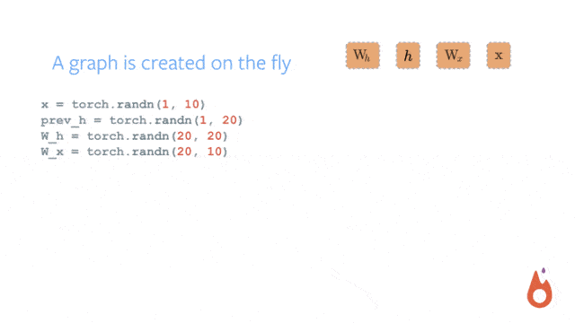

<style>
details {
    border: 1px solid #aaa;
    border-radius: 4px;
    padding: .5em .5em 0;
}
summary {
    font-weight: bold;
    margin: -.5em -.5em 0;
    padding: .5em;
}
details[open] {
    padding: .5em;
}
details[open] summary {
    border-bottom: 1px solid #aaa;
    margin-bottom: .5em;
}
</style>

<details><summary>目录</summary><p>

- [计算图](#计算图)
- [PyTorch 动态计算图机制](#pytorch-动态计算图机制)
  - [动态计算图机制](#动态计算图机制)
  - [计算图中的张量节点](#计算图中的张量节点)
    - [计算图的正向传播是立即执行的](#计算图的正向传播是立即执行的)
    - [计算图在反向传播后立即销毁](#计算图在反向传播后立即销毁)
  - [计算图中的 Function 节点](#计算图中的-function-节点)
- [PyTorch 计算图与反向传播](#pytorch-计算图与反向传播)
- [PyTorch 计算图叶节点和非叶节点](#pytorch-计算图叶节点和非叶节点)
- [PyTorch 计算图在 TensorBoard 中的可视化](#pytorch-计算图在-tensorboard-中的可视化)
</p></details><p></p>

# 计算图

计算图是用来描述运算的有向无环图。主要有两个因素:节点、边。
其中节点表示数据，如向量、矩阵、张量；而边表示运算，如加、减、乘、除、卷积等。

使用计算图的好处不仅是让计算看起来更加简洁，
还有个更大的优势是让梯度求导也变得更加方便

示例:

```python
x = torch.tensor([2.], requires_grad = True)
w = torch.tensor([1.], requires_grad = True)

a = torch.add(w, x)
b = torch.add(w, 1)

y = torch.mul(a, b)

y.backward()
print(w.grad)
```

# PyTorch 动态计算图机制

## 动态计算图机制



PyTorch 的计算图由节点和边组成，节点表示张量或者 Function，边表示张量和 Function 之间的依赖关系。
PyTorch 中的计算图是动态的，这里的动态主要有两重含义:

* 计算图的正向传播是立即执行的
    - 无需等待完成的计算图创建完毕，每条语句都会在计算图中动态添加节点和边，并立即执行正向传播得到计算结果
* 计算图在反向传播后立即销毁，下次调用需要重新构建计算图
    - 如果在程序中使用了 `backward()` 方法执行了反向传播，或者利用了 `torch.autograd.grad()` 方法计算了梯度，
      那么创建的计算图会被立即销毁，释放了存储空间，下次调用需要重新创建

## 计算图中的张量节点

### 计算图的正向传播是立即执行的

```python
import torch

w = torch.tensor([[3.0, 1.0]], requires_grad = True)
b = torch.tensor([[3.0]], requires_grad = True)
X = torch.randn(10, 2)
Y = torch.randn(10, 1)

# Y_hat 定义后其正向传播被立即执行，与其后面的 loss 创建语句无关
Y_hat = X @ w.t() + b
loss = torch.mean(torch.pow(Y_hat - Y, 2))

print(Y_hat.data)
print(loss.data)
```

```
tensor([[3.2613],
        [4.7322],
        [4.5037],
        [7.5899],
        [7.0973],
        [1.3287],
        [6.1473],
        [1.3492],
        [1.3911],
        [1.2150]])
tensor(17.8969)
```

### 计算图在反向传播后立即销毁

```python
import torch

w = torch.tensor([[3.0, 1.0]], requires_grad = True)
b = torch.tensor([[3.0]], requires_grad = True)
X = torch.randn(10, 2)
Y = torch.randn(10, 1)

# Y_hat 定义后其正向传播被立即执行，与其后面的 loss 创建语句无关
Y_hat = X @ w.t() + b
loss = torch.mean(torch.pow(Y_hat - Y, 2))

# 计算图在反向传播后立即销毁
loss.backward()  # 如果再次执行反向传播(loss.backward())将报错

# 如果需要保留计算图，需要设置 retain_graph = True
loss.backward(retain_graph = True)
```

## 计算图中的 Function 节点

计算图中的 Function 节点就是 PyTorch 中各种对张量操作的函数。
这些 Function 与 Python 中的函数有一个较大的区别是它同时包括正向计算逻辑和反向传播逻辑。
可以通过继承 `torch.autograd.Function` 来创建这种支持反向传播的 Function

```python
class MyReLU(torch.autograd.Function):

    # 正向传播逻辑，可以用 ctx 存储一些值，供反向传播使用
    @staticmethod
    def forward(ctx, input):
        ctx.save_for_backward(input)
        return input.clamp(min = 0)
    
    # 反向传播逻辑
    @staticmethod
    def backward(ctx, grad_output):
        input, = ctx.saved_tensors
        grad_input = grad_output.clone()
        grad_input[input < 0] = 0
        return grad_input
```

```python
import torch

w = torch.tensor([[3.0, 1.0]], requires_grad = True)
b = torch.tensor([[3.0]], requires_grad = True)
X = torch.tensor([[-1.0, -1.0], [1.0, 1.0]])
Y = torch.tensor([[2.0, 3.0]])

relu = MyReLU.apply
Y_hat = relu(X @ w.t() + b)
loss = torch.mean(torch.pow(Y_hat - Y, 2))

print(w.grad)
print(b.grad)
# Y_hat 的梯度函数即是定义的 MyReLU.backward
print(Y_hat.grad_fn)
```

# PyTorch 计算图与反向传播

从计算图理解反向传播的原理和过程

```python
import torch

x = torch.tensor(3.0, requires_grad = True)
y1 = x + 1
y2 = 2 * x
loss = (y1 - y2) ** 2

loss.backward()
```

`loss.backward()` 语句调用后，依次发生以下计算过程:

1. `loss` 自己的 `grad` 梯度赋值为 1，即对自身的梯度 为 1
    - `$loss.grad = \frac{dloss}{dloss}(x = 3) = 1$`
2. `loss` 根据其自身梯度以及关联的 `backward()` 方法，
   计算出其对应的自变量即 `y1` 和 `y2` 的梯度，
   将该值赋值到 `y1.grad` 和 `y2.grad`
    - `$y1.grad = \frac{dloss}{dy1}(x = 3) = 2 \cdot (y1 - y2) \cdot 1 = 2 \cdot (4 - 6) \cdot 1 = -4$`
    - `$y2.grad = \frac{dloss}{dy2}(x = 3) = 2 \cdot (y1 - y2) \cdot (-1)= 2 \cdot (4 - 6) \cdot (-1) = 4$`
3. `y1` 和 `y2` 根据其自身梯度以及关联的 `backward()` 方法，
   分别计算出其对应的自变量 `x` 的梯度，`x.grad` 将其收到多个梯度值累加
    - `$x.grad = \frac{dloss}{dx} = \frac{dloss}{dloss} \cdot (\frac{dloss}{dy1} \cdot \frac{dy1}{dx} + \frac{dloss}{dy2} \cdot \frac{dy2}{dx}) = 1 \cdot (-4 \cdot 1 + 4 \cdot 2) = 4$`

因为求导链式法则衍生的梯度累加规则，张量的 `grad` 梯度不会自动清零，在需要的时候需要手动置零

# PyTorch 计算图叶节点和非叶节点

```python
import torch

# 正向传播
x = torch.tensor(3.0, requires_grad = True)
y1 = x + 1
y2 = 2 * x
loss = (y1 - y2) ** 2

# 反向传播
loss.backward()

print(f"loss.grad: {loss.grad}")
print(f"y1.grad: {y1.grad}")
print(f"y2.grad: {y2.grad}")
print(f"x.grad: {x.grad}")

print(f"loss.is_leaf: {loss.is_leaf}")
print(f"y1.is_leaf: {y1.is_leaf}")
print(f"y2.is_leaf: {y2.is_leaf}")
print(f"x.is_leaf: {x.is_leaf}")
```

```
loss.grad: None
y1.grad: None
y2.grad: None
tensor(4.)

loss.is_leaf: False
y1.is_leaf: False
y2.is_leaf: False
x.is_leaf: True
```

在反向传播的过程中，只有 `is_leaf = True` 的叶节点需要求导的张量的导数结果才会被保留下来。
叶节点张量需要满足两个条件:

1. 叶节点张量是由用户直接创建的张量，而非由某个 Function 通过计算得到的张量
2. 叶节点张量的 `requires_grad` 属性必须为 `True`

PyTorch 这样的设计规则主要是为了节约内存或者显存空间，因为几乎所有时候，用户只会关心他自己直接创建的张量的梯度。
所有依赖于叶节点张量的张量，其 `requires_grad = True`，但其梯度值只在计算过程中被用到，不会最终存储到 `grad` 中。
如果需要保留中间计算结果的梯度到 `grad` 属性中，可以使用 `retain_grad` 方法。如果仅仅是为了调试代码产看梯度值，
可以利用 `register_hook` 打印日志，可以查看非叶节点的梯度值

```python
import torch 

#正向传播
x = torch.tensor(3.0, requires_grad = True)
y1 = x + 1
y2 = 2 * x
loss = (y1 - y2) ** 2

#非叶子节点梯度显示控制
y1.register_hook(lambda grad: print('y1 grad: ', grad))
y2.register_hook(lambda grad: print('y2 grad: ', grad))
loss.retain_grad()

#反向传播
loss.backward()

print(f"loss.grad: {loss.grad}")
print(f"y1.grad: {y1.grad}")
print(f"y2.grad: {y2.grad}")
print(f"x.grad: {x.grad}")
```

```
y2 grad: tensor(4.)
y1 grad: tensor(-4.)
loss.grad: tensor(1.)
x.grad: tensor(4.)
```

# PyTorch 计算图在 TensorBoard 中的可视化

可以使用 `torch.utils.tensorboard` 将计算图导出到 TensorBoard 进行可视化

```python
import torch
from torch import nn
from torch.utils.tensorboard import SummaryWriter
from tensorboard import notebook

class Net(nn.Module):
    
    def __init__(self):
        super(Net, self).__init__()
        self.w = nn.Parameter(torch.randn(2, 1))
        self.b = nn.Parameter(torch.zeros(1, 1))
    
    def forward(self, x):
        y = x@self.w + self.b
        return y

net = Net()

# tensorboard 模型产看
writer = SummaryWriter("./tensorboard")
writer.add_graph(net, input_to_model = torch.rand(10, 2))
writer.close()

# 启动 tensorboard
notebook.list()
# %load_ext tensorboard
# %tensorboard --logdir ./data/tensorboard

# 启动 tensorboard
notebook.start("--logdir ./data/tensorboard")
```

