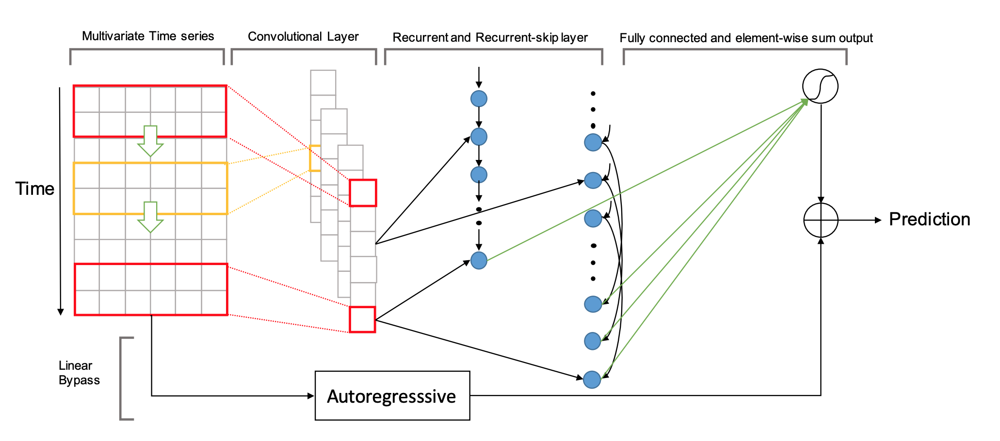

目录

- [循环神经网络 RNN](#循环神经网络-rnn)
  - [LSTM](#lstm)
  - [GRU](#gru)
  - [LSTNet](#lstnet)
    - [网络结构](#网络结构)
    - [网络参数](#网络参数)
- [卷积神经网络 CNN](#卷积神经网络-cnn)
- [格拉姆角场 GAF](#格拉姆角场-gaf)
- [短时傅里叶变换 STFT](#短时傅里叶变换-stft)
- [时间卷积网络 TCN](#时间卷积网络-tcn)
- [基于注意力机制的模型 Attention](#基于注意力机制的模型-attention)
- [CNN 和 RNN 和 Attention](#cnn-和-rnn-和-attention)
- [参考文章:](#参考文章)

深度学习方法近年来逐渐替代机器学习方法，成为人工智能与数据分析的主流，
对于时间序列的分析，有许多方法可以进行处理。
常见的利用神经网络技术来做时间序列预测的方法有 CNN、RNN、LSTM、GRU、seq2seq 等

相对于传统的树模型需要人工构建相关模型特征, 神经网络模型通常需要喂入大量的数据来进行训练, 
因此如果同类时序的数据量够多(有够多彼此间相关性较强的时序), 
那么训练一个通用型的端对端的神经网络预测有时也有不错的效果, 比如使用 LSTM 一方面可以较容易地整合外部变量, 
另一方面 LSTM 有能较好地自动提取时序特征的能力

# 循环神经网络 RNN

循环神经网络(RNN)框架及其变种(LSTM/GRU/...)是为处理序列型而生的模型，
天生的循环自回归的结构是对时间序列的很好的表示。所采用的方式也是监督学习，
不过不需要人为的构建时序特征，可以通过深度学习网络拟合时序曲线，
捕捉时间先后顺序关系，长期依赖，进行特征学习与预测

## LSTM

## GRU

## LSTNet

Long-and Short-term Time-series Network(LSTNet) 专门设计用于时间序列预测的深度学习网络，
该网络特点有如下5点：

* CNN：一维普通卷积(没有使用因果扩张卷积)，用于捕捉短期局部信息
* RNN：使用 LSTM 或 GRU，捕捉长期宏观信息
* Skip-RNN：对输入数据维度整理，使用 LSTM 或 GRU，
  捕捉更长期的信息并充分利用序列的周期特性，但此时的周期 P 是引入的另一个超参数
* Attention：论文中有提到使用 Attention 机制，灵活调整周期 P，但在代码中没见到
* HighWay：使用 Dense 模拟 AR 自回归过程，为预测添加线性成份，同时使输出可以响应输入的尺度变化

### 网络结构

预测包含两部分，最终结果是非线性预测和线性预测的结合：

* 非线性层：CNN 层、RNN 层、Skip-RNN 层
* 线性层：AR 层

### 网络参数

# 卷积神经网络 CNN

传统的卷积神经网络(CNN)一般认为不太适合时序问题的建模，这主要由于其卷积核大小的限制，
不能很好的抓取长时的依赖信息。但是最近也有很多的工作显示，
特定的卷积神经网络结构也可以达到很好的效果，通常将时间序列转化为图像，再应用基于卷积神经网络的模型做分析

# 格拉姆角场 GAF

格拉姆角场，Gramian Angular Field(GAF) 的核心思想是：将笛卡尔坐标系下的一维时间序列，
转化为极坐标系表示，再使用三角函数生成 GAF 矩阵。计算过程如下：

* 数值缩放：将笛卡尔坐标系下的时间序列缩放到 `$[0,1]$` 或 `$[-1,1]$` 区间
* 极坐标转换：使用坐标变换公式，将笛卡尔坐标系序列转化为极坐标系时间序列
* 角度和/差的三角函数变换：若使用两角和的 cos 函数则得到 GASF，若使用两角差的 cos 函数则得到 GADF

# 短时傅里叶变换 STFT

短时傅里叶变换，Short Time Fourier Transform(STFT) 在语音信号处理场景使用很广泛，
其目标主要将时间序列转为时频图像，进而采用卷积网络进行特征分析

# 时间卷积网络 TCN

时间卷积网络，Time Convolution Network(TCN) 是一种特殊的卷积神经网络，针对一维空间做卷积，迭代多层捕捉长期关系。
具体的，对于上一层 `$t$` 时刻的值，只依赖于下一层 `$t$` 时刻及其之前的值。
和传统的卷积神经网络的不同之处在于，TCN 不能看到未来的数据，它是单向的结构，不是双向的。
也就是说只有有了前面的因才有后面的果，是一种严格的时间约束模型，因此又被称为因果卷积

# 基于注意力机制的模型 Attention

在 RNN 中分析时间序列需要一步步按顺序处理从 `$t-n$` 到 `$t$` 的所有信息，
而当它们相距较远(`$n$` 非常大)时 RNN 的效果常常较差，且由于其顺序性处理效率也较低。
基于注意力机制(Attention)的模型，采用跳步的方式计算每个数值之间的两两关联，
然后组合这些关联分数得到一个加权的表示。该表示通过前馈神经网络的学习，可以更好的考虑到时序的上下文的信息

# CNN 和 RNN 和 Attention

结合 CNN + RNN + Attention，作用各不相同互相配合，主要设计思想：

* CNN 捕捉短期局部依赖关系
* RNN 捕捉长期宏观依赖关系
* Attention 为重要时间段或变量加权

# 参考文章:

* LSTNet
    - [blog](https://zhuanlan.zhihu.com/p/61795416)
    - [paper](https://arxiv.org/pdf/1703.07015.pdf)
    - [code](https://github.com/Lorne0/LSTNet_keras)
* TPA-LSTM
    - [blog](https://zhuanlan.zhihu.com/p/63134630)
    - [paper](https://arxiv.org/pdf/1809.04206v2.pdf)
    - [code](https://github.com/gantheory/TPA-LSTM)
* LSTM
   - [blog](https://cloud.tencent.com/developer/article/1041442)
* [时间序列预测](https://mp.weixin.qq.com/s?__biz=Mzg3NDUwNTM3MA==&mid=2247484974&idx=1&sn=d841c644fd9289ad5ec8c52a443463a5&chksm=cecef3dbf9b97acd8a9ededc069851afc00db422cb9be4d155cb2c2a9614b2ee2050dc7ab4d7&scene=21#wechat_redirect)
* [使用 LSTM 进行多变量时间序列预测的保姆级教程](https://mp.weixin.qq.com/s?__biz=MzU1MjYzNjQwOQ==&mid=2247499754&idx=1&sn=183c8aa1156023a19b061c27a0be8407&chksm=fbfda57ccc8a2c6a60f630b2cd9b2d587d345ea002c8af81b5059154c97398589a6c86e15bfd&scene=132#wechat_redirect)

