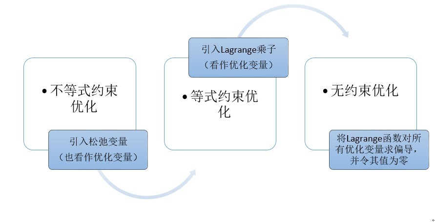

目录

- [KKT 条件](#kkt-条件)
- [等式约束优化问题](#等式约束优化问题)
- [不等式约束优化问题](#不等式约束优化问题)

KKT(Karush-Kuhn-Tucker) 条件是非线性规划(onlinear programming)最佳解的必要条件。
KKT 条件将 Lagrange 乘数法(Lagrange multipliers) 所处理涉及的约束优化问题推广至不等式。
在实际应用上，KKT 条件(方程组)一般不存在代数解，许多优化算法可供数值计算选用

# KKT 条件

对于具有等式和不等式约束的一般优化问题:

`$$min f(\textbf{x})$$`

`$$s.t. \begin{cases}
g_{j}(\textbf{x}) \leq 0, j = 1, 2, \ldots, m \\
h_{k}(\textbf{x}) = 0, k = 1, 2, \ldots, l
\end{cases}$$`

KKT 条件给出了判断 `$x^{*}$` 是否为最优解的必要条件，即:

`$$\begin{cases}
\frac{\partial f}{\partial x_{i}} + \sum_{j=1}^{m}\mu_{j}\frac{\partial g_{j}}{\partial x_{i}} + \sum_{k=1}^{l}\lambda_{k} \frac{\partial h_{k}}{\partial x_{i}} = 0, i = 1, 2, \ldots, n\\
h_{k}(\textbf{x}) = 0, k = 1, 2, \ldots, l  \\
\mu_{j}g_{j}(\textbf{x}), j = 1, 2, \ldots, m  \\
\mu_{j} \geq 0
\end{cases} $$`

# 等式约束优化问题

等式约束优化问题是指：

`$$min f(x_{1}, x_{2}, \ldots, x_{n})$$`

`$$s.t. h_{k}(x_{1}, x_{2}, \ldots, x_{n}) = 0$$`

根据 Lagrange 乘数法，令

`$$L(\textbf{x}, \lambda) = f(\textbf{x}) + \sum_{k=1}^{l} \lambda_{k} h_{k}(\textbf{x})$$`

其中:

* 函数 `$L(\textbf{x}, y)$` 称为 Lagrange 函数
* 参数 `$\lambda$` 称为 Lagrange 乘子

对函数 `$L(\textbf{x}, y)$` 关于 `$\textbf{x}$` 和 `$\lambda$` 求偏导数：

`$$\begin{cases}
\frac{\partial L}{\partial x_{i}} = 0, i = 1, 2, \ldots, n \\
\frac{\partial L}{\partial \lambda_{k}} = 0, k = 1, 2, \ldots, l 
\end{cases} $$`

解方程组得到的解可能为极值点，具体是否为极值点需要根据问题本身的具体情况检验。
这个方程组称为 **等式约束的极值必要条件**

上式对 `$n$` 个 `$x_{i}$` 和 `$l$` 个 `$\lambda_{k}$` 分别求偏导，
在无约束优化问题 `$f(x_{1}, x_{2}, \ldots, x_{n})$` 中，根据机制的必要条件，
分别令 `$\frac{\partial f}{\partial x_{i}} = 0$`，求出可能的极值。
因此可以联想到：

> 等式约束下的 Lagrange 乘数法引入了 `$l$` 个 Lagrange 乘子，
> 或许可以把 `$\lambda_{k}$` 也看作优化变量(`$x_{i}$` 就叫做优化变量)。
> 相当于将优化变量个数增加到了 `$(n + l)$` 个，`$x_{i}$` 与 `$\lambda_{k}$` 一视同仁，
> 均为优化变量，均对它们求偏导

# 不等式约束优化问题

不等式约束优化问题的主要思想是：转化的思想 —— 将不等式约束条件变成等式约束条件。
具体做法是：引入松弛变量。松弛变量也是优化变量，也需要一视同仁求偏导

具体而言，看一个一元函数的例子：

`$$min f(x)$$`

`$$s.t. \begin{cases}
g_{1}(x) = a - x \leq 0 \\
g_{2}(x) = x - b \leq 0 \\
\end{cases}$$`

优化问题中，我们必须求得一个确定的值，因此不妨令所有的不等式均取到等号，即 `$\leq$` 的情况

对于约束 `$g_{1}$` 和 `$g_{2}$`，分别引入两个松弛变量 `$a_{1}^{2}$` 和 `$b_{1}^{2}$`，
得到 

`$$\begin{cases}
h_{1}(x, a_{1}) = g_{1}(x) + a_{1}^{2} = a - x + a_{1}^{2} = 0 \\
h_{2}(x, b_{1}) = g_{2}(x) + b_{1}^{2} = x - b + b_{1}^{2} = 0
\end{cases}$$`

注意，这里直接加上平方项 `$a_{1}^{2}$`、`$b_{1}^{2}$` 而非 `$a_{1}$`、`$b_{1}$`，
是因为 `$g_{1}(x)$`、`$g_{2}(x)$` 这两个不等式的左边必须加上一个正数才能使不等式变为等式。
若只加上 `$a_{1}$`、`$b_{1}$`，又会引入新的约束 `$a_{1} \geq 0$` 和 `$b_{1} \geq 0$`，
这不符合原先的意愿

由此，将不等式约束转化为了等式约束，并得到 Lagrange 函数：

`$$L(x, a_{1}, b_{1}, \mu_{1}, \mu_{2}) = f(x) + \mu_{1} (a - x + a_{1}^{2}) + \mu_{2} (x - b + b_{1}^{2})$$`

按照等式约束优化问题(极值必要条件)对其求解，联立方程：

`$$\begin{cases}
\frac{\partial L}{\partial x} = \frac{\partial f}{\partial x} + \mu_{1} \frac{d g_{1}}{d x} + \mu_{2} \frac{d g_{2}}{d x} = \frac{\partial f}{\partial x} - \mu_{1} + \mu_{2} = 0 \\
\frac{\partial L}{\partial \mu_{1}} = g_{1} + a_{1}^{2} = 0 \\
\frac{\partial L}{\partial \mu_{2}} = g_{2} + b_{1}^{2} = 0 \\
\frac{\partial L}{\partial a_{1}} = 2 \mu_{1} a_{1} = 0 \\
\frac{\partial L}{\partial b_{1}} = 2 \mu_{2} b_{1} = 0 \\
\mu_{1} \geq 0, \mu_{2} \geq 0
\end{cases}$$`

