<style>
details {
    border: 1px solid #aaa;
    border-radius: 4px;
    padding: .5em .5em 0;
}
summary {
    font-weight: bold;
    margin: -.5em -.5em 0;
    padding: .5em;
}
details[open] {
    padding: .5em;
}
details[open] summary {
    border-bottom: 1px solid #aaa;
    margin-bottom: .5em;
}
img {
    pointer-events: none;
}
</style>
<details><summary>目录</summary><p>

- [动态规划简介](#动态规划简介)
    - [动态规划定义](#动态规划定义)
    - [多阶段决策问题](#多阶段决策问题)
    - [动态规划基本概念](#动态规划基本概念)
    - [动态规划最优化原理](#动态规划最优化原理)
- [动态规划算法](#动态规划算法)
    - [动态规划初探](#动态规划初探)
        - [回溯算法](#回溯算法)
        - [暴力搜索](#暴力搜索)
        - [记忆化搜索](#记忆化搜索)
        - [动态规划](#动态规划)
        - [空间优化的动态规划](#空间优化的动态规划)
    - [动态规划问题特性](#动态规划问题特性)
        - [最优子结构](#最优子结构)
        - [无后效性](#无后效性)
    - [动态规划解题思路](#动态规划解题思路)
        - [问题判断](#问题判断)
        - [问题求解步骤](#问题求解步骤)
            - [暴力搜索](#暴力搜索-1)
            - [记忆化搜索](#记忆化搜索-1)
            - [动态规划](#动态规划-1)
            - [空间优化动态规划](#空间优化动态规划)
- [动态规划问题](#动态规划问题)
    - [运筹-最短路径问题](#运筹-最短路径问题)
        - [动态规划](#动态规划-2)
        - [整数规划](#整数规划)
        - [一对多最短路问题](#一对多最短路问题)
        - [多对多最短路问题](#多对多最短路问题)
        - [无负权一对多最短路问题](#无负权一对多最短路问题)
        - [一对多无环图最短路问题](#一对多无环图最短路问题)
    - [运筹-背包问题](#运筹-背包问题)
        - [0-1 背包问题](#0-1-背包问题)
    - [算法-0-1 背包问题](#算法-0-1-背包问题)
        - [暴力搜索](#暴力搜索-2)
        - [记忆化搜索](#记忆化搜索-2)
        - [动态规划](#动态规划-3)
        - [空间优化动态规划](#空间优化动态规划-1)
    - [算法-完全背包问题](#算法-完全背包问题)
        - [动态规划思路](#动态规划思路)
        - [代码实现](#代码实现)
        - [空间优化](#空间优化)
    - [算法-零钱兑换问题](#算法-零钱兑换问题)
        - [动态规划思路](#动态规划思路-1)
        - [代码实现](#代码实现-1)
        - [空间优化](#空间优化-1)
    - [算法-零钱兑换问题 II](#算法-零钱兑换问题-ii)
        - [动态规划思路](#动态规划思路-2)
        - [代码实现](#代码实现-2)
        - [空间优化](#空间优化-2)
    - [算法-编辑距离问题](#算法-编辑距离问题)
        - [动态规划思路](#动态规划思路-3)
        - [代码实现](#代码实现-3)
        - [空间优化](#空间优化-3)
- [参考](#参考)
</p></details><p></p>

# 动态规划简介

## 动态规划定义

维基百科的定义：

> dynamic programming is a method for solving a complex problem 
> by breaking it down into a collection of simpler subproblems.

<!-- 动态规划的本质是对问题状态的定义和状态转移方程的定义。
动态规划是通过拆分问题，定义问题状态和状态之间的关系，
使得问题能够以递推(或者说是分治)的方式去解决。
如何拆分问题是动态规划的核心，而拆分问题靠的就是状态的定义和状态转移方程的定义。 -->

计算机算法定义：

> 动态规划（Dynamic Programming）是一个重要的算法范式，它将一个问题分解为一系列更小的子问题，
> 并通过存储子问题的解来避免重复计算，从而大幅提升时间效率。

运筹学定义：

> 动态规划（Dynamic Programming, DP）是运筹学的一个分支，是解决多阶段决策过程最优化的一种方法。
> 它把多变量复杂决策的问题进行分阶段决策，可高效求解多个单变量的决策问题。动态规划在现代企业管理、
> 工农业生产中有着广泛的应用，许多问题用动态规划处理，比用线性规划或非线性规划处理更加有效，如最短路径、
> 设备维修换新、多阶段库存等问题。

## 多阶段决策问题

有这样一类问题，它可以从时间或空间上将决策的过程分解为若干个相互联系的阶段，每个阶段都需要做出决策，
当前阶段的决策往往会影响到下一个阶段的决策，将各阶段的决策构成一个决策序列，称为**策略**。

每个阶段都有若干个决策可供选择，因此就有许多决策可以选择。如果在这些策略中选择一个最优策略，
这类问题就是**多阶段决策问题**。

## 动态规划基本概念

为了方便建模和讨论，以一个最短路径问题为例，对动态规划的基本概念和符号做一些约定：


1. 阶段 `$k$`
    - 把问题划分为多个互相联系的阶段，按一定的次序取求解，阶段用 `$k$` 表示
2. 状态 `$S_{k}$`
    - 在不同阶段 `$k$` 的选择状态(Status)
    - 在最短路径问题中，第 1 阶段只有一个状态 `$S_{1} = \{A\}$`，而第 2 阶段有 2 个状态，即 `$S_{2} = \{B_{1}, B_{2}\}$`，
      第 3 阶段有 2 个状态，即 `$S_{3} = \{C_{1}, C_{2}\}$`，第 4 阶段只有 1 个状态，即 `$S_{4} = \{D_{1}\}$`
3. 决策 `$x_{k}$`
    - 在第 `$k$` 阶段的某个状态为 `$S_{k}$` 时，所做出的选择。
      常用 `$x_{k}(S_{k})$` 表示处在 `$S_{k}$` 状态时的决策变量，
      它是状态的决策函数，在实际问题中，`$x_{k}(S_{k})$` 的选择是有限的，
      有限的选择组成集合用 `$D_{k}(S_{k})$` 表示，`$x_{k} \in D_{k}(S_{k})$`
    - 在最短路径问题中，如在第 2 阶段的 `$B_{2}$` 状态下，能做的选择是 `$\{C_{1}, C_{2}\}$`，
      一旦做出了选择，下一阶段的状态也就确定了。如在第 2 阶段的 `$B_{1}$` 状态，所能做的选择是 `$\{C_{1}, C_{2}\}$`，
      那么 `$D_{2}(B_{1})=\{C_{1}, C_{2}\}$`；如果做出的选择是 `$C_{2}$`，则 `$x_{2}(B_{2}) = C_{2}$`，
      那么第 3 阶段的状态也就确定为 `$C_{2}$`
1. 策略 `$P_{k,n}$`
    - 从起点到终点的全过程中，每个阶段都有一个决策 `$x_{s}(S_{k})$`，由每个阶段的决策组成的序列称为策略，
      记作 `$P_{1,n} = \{x_{1}(S_{1}), \cdots, x_{n}(S_{n})\}$`
    - 从中间的某个阶段 `$k$` 到结束状态的过程，称为原问题的子过程，所组成的决策序列称为子过程的策略，
      记作 `$P_{k,n}=\{x_{k}(S_{k}), \cdots, x_{n}(S_{n})\}$`
2. 状态转移方程 `$T_{k}(S_{k}, x_{k})$`
    - 如果在第 `$k$` 阶段的状态为 `$S_{k}$`，若此时的决策变量 `$x_{k}$` 一旦确定，那么下一阶段的 `$S_{k+1}$` 也就确定了，
      `$S_{k+1}$` 是 `$S_{k}$` 和 `$x_{k}$` 共同决定的函数，即 `$S_{k+1}=T_{k}(S_{k}, x_{k})$`，
      该函数关系称为状态转移方程
3. 阶段指标函数 `$d_{k}(S_{k}, x_{k})$`
    - 对于第 `$k$` 阶段而言，在每一个状态下做出的决策都会影响最后的结果，它是 `$S_{k}$` 和 `$x_{k}$` 的函数，
      记 `$d_{k}(S_{k}, x_{k})$` 为第 `$k$` 阶段的指标函数
4. 指标函数 `$V_{k,n}$`
    - 使用**指标函数**衡量当前决策对总体的影响，而**最优指标函数**衡量的是整体决策过程的优劣，
      它是定义在全过程和所有后部子过程上确定的函数。注意**阶段指标函数**和**指标函数**是不一样的。
    - 常用 `$V_{k,n}$` 表示**指标函数**。指标函数通常有两种形式，分别是累加形式和累积形式：
        - 累加形式公式：

        `$$V_{k,n}=V_{k,n}(S_{k}x_{k}, S_{k+1}x_{k+1}, \cdots, S_{n}x_{n})=\sum_{j=k}^{n}d_{j}(S_{j}, x_{j})$$`

        - 累积形式公式：

        `$$V_{k,n}=V_{k,n}(S_{k}x_{k}, S_{k+1}x_{k+1}, \cdots, S_{n}x_{n})=\prod_{j=k}^{n}d_{j}(S_{j}, x_{j})$$` 

    - 指标函数的最优值称为**最优指标函数**，记作 `$f_{k}(S_{k})$`，
      它表示从第 `$k$` 阶段由状态 `$S_{k}$` 开始到第 `$n$` 阶段终止状态的过程，
      所采取最优策略得到的指标函数值，即：

      `$$f_{k}(S_{k}) = \text{max}[\text{min}]\{V_{k,n}(S_{k}x_{k}, S_{k+1}x_{k+1}, \cdots, S_{n}x_{n})\}$$`

        - 在不同的问题中，最优指标函数的定义是不同的，在最短路径问题中，`$V_{k,n}$` 表示从第 `$k$` 阶段的 `$S_{k}$` 状态到终点的距离。

## 动态规划最优化原理

动态规划的最优性原理是：作为整体过程的最优策略，无论过去的状态和决策如何，对前面的形成状态而言，
剩下的决策必然构成最优策略。简而言之，一个最优策略的子策略总是最优的。

最优性原理是动态规划的核心，各种动态规划模型都是根据这个原理进行的，在求解动态规划问题时，
可以按照从后往前倒推最优解的思路进行。

> 利用最优化原理，可以推导最短路径问题的指标函数的递推方程，即：
> 
> `$$f_{n}(S_{n}) = \underset{x_{n}\in D_{n}(S_{n})}{\text{min}}[d_{n}(S_{n}, x_{n}) + f_{n+1}(S_{n+1})], n=3, 2, 1$$`
> 
> 其中 `$f_{n}(S_{n})$` 表示从第 `$n$` 阶段到终点的最短距离，
> `$f_{n+1}(S_{n+1})$` 为从第 `$n+1$` 阶段到终点的最短距离，
> `$d_{n}(S_{n}, x_{n})$` 为第 `$n$` 阶段的距离，
> `$f_{4}(S_{4})$` 为递推起点，通常是已知的。

# 动态规划算法

## 动态规划初探

> 爬楼梯方案数量问题
> 
> 问题：给定一个共有 `$n$` 阶的楼梯，每步可以上 1 阶或者 2 阶，请问有多少种方案可以爬到楼顶？

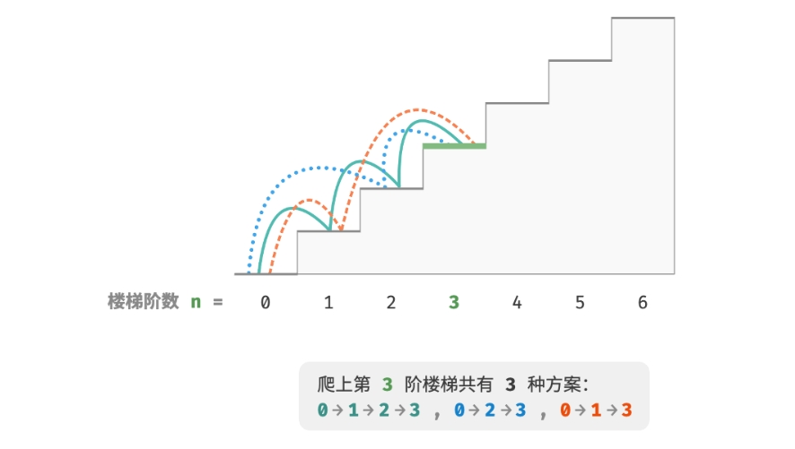

### 回溯算法

本题的目标是求解方案数量，可以考虑通过回溯来穷举所有可能性。具体来说，将爬楼梯想象为一个多轮选择的过程：
从地面出发，每轮选择上 1 阶或 2 阶，每当到达楼梯顶部时就将方案数量加 1，当越过楼梯顶部时就将其剪枝。

```python
# climbing_stairs_backtrack.py
# 深度优先搜索
from typing import List

def backtrack(choices: List[int], state: int, n: int, res: List[int]) -> int:
    """
    回溯

    Args:
        choices (List[int]): 每一步的选择，可以选择每步向上爬的阶数
        state (int): 当前状态，在第几阶
        n (int): 爬到第几层
        res (List[int]): 使用 res[0] 记录方案数量
    """
    # 当爬到第 n 阶时，方案数量加 1
    if state == n:
        res[0] += 1
    # 遍历所有选择
    for choice in choices:
        # 剪枝：不允许越过第 n 阶
        if state + choice > n:
            continue
        # 尝试：做出选择，更新状态
        backtrack(choices, state + choice, n, res)
        # 回退


def climbing_stairs_backtrack(n: int) -> int:
    """
    爬楼梯：回溯

    Args:
        n (int): 爬到第几层

    Returns:
        int: 爬楼梯到第 n 阶的方案数量
    """
    choices = [1, 2]  # 可以选择向上爬 1 阶或 2 阶
    state = 0  # 从第 0 阶开始爬
    res = [0]  # 使用 res[0] 记录方案数量
    backtrack(choices, state, n, res)

    return res[0]


# 测试代码 main 函数
def main():
    res = climbing_stairs_backtrack(3)
    print(res)
    
if __name__ == "__main__":
    main()
```

```
3
```

### 暴力搜索

回溯算法通常并不显式地对问题进行拆解，而是将求解问题看作一些列决策步骤，
通过试探和剪枝，搜索所有可能的解。

现在尝试从问题分解的角度分析这道题，设爬到第 `$i$` 阶共有 `$dp[i]$` 种方案，
那么 `$dp[i]$` 就是原问题，其子问题包括：

`$$dp[i-1], dp[i-2], \cdots, dp[2], dp[1]$$`

由于每轮只能上 1 阶或 2阶，因此当站在第 `$i$` 阶楼梯上时，上一轮只可能站在第 `$i-1$` 阶或第 `$i-2$` 阶上。
换句话说，只能从第 `$i-1$` 阶或第 `$i-2$` 阶迈向第 `$i$` 阶。
由此便可得出一个重要推论：爬到第 `$i-1$` 阶的方案树加上爬到第 `$i-2$` 阶的方案数就等于爬到第 `$i$` 阶的方案数。
公式如下：

`$$dp[i] = dp[i-1] +dp[i-2]$$`

这意味着在爬楼梯问题中，各个子问题之间存在递推关系，原问题的解可以由子问题的解构建得来。下图展示了该递推关系：

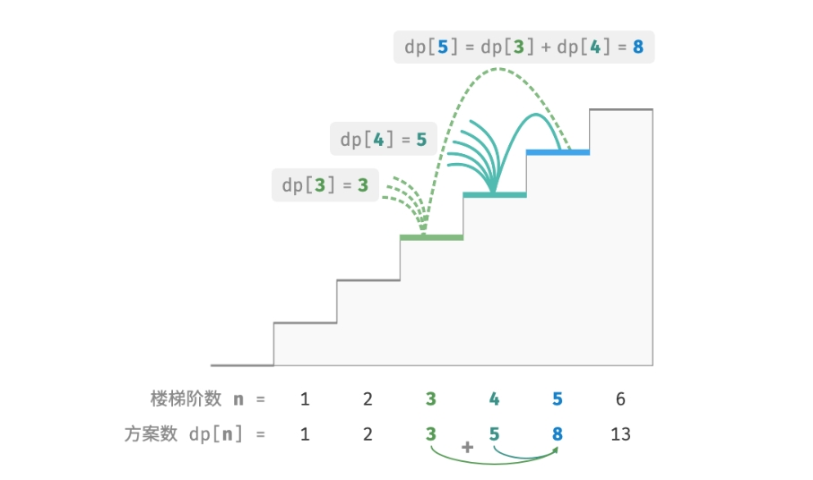

可以根据递推公式得到暴力搜索解法。以 `$dp[n]$` 为起始点，递归地将一个较大问题拆解为两个较小问题的和，
直至到达最小子问题 `$dp[1]$` 和 `$dp[2]$` 时返回。其中，最小子问题的解是已知的，即 `$dp[1]=1$`、`$dp[2]=2$`，
表示爬到第 1、2 阶分别有 1、2种方案。

```python
# climbing_stairs_dfs.py
# 深度优先搜索
def dfs(i: int) -> int:
    """
    搜索

    Args:
        i (int): 目标楼梯阶数

    Returns:
        int: 爬楼梯方案数
    """
    # 已知 dp[1] 和 dp[2]，返回
    if i == 1 or i == 2:
        return i
    # dp[i] = dp[i-1] + dp[i-2]
    count = dfs(i - 1) + dfs(i - 2)

    return count


def climbing_stairs_dfs(n: int) -> int:
    """
    爬楼梯：搜索

    Args:
        n (int): 目标楼梯阶数

    Returns:
        int: 爬楼梯方案数
    """
    return dfs(n)


# 测试代码 main 函数
def main():
    res = climbing_stairs_dfs(3)
    print(res)

if __name__ == "__main__":
    main()
```

```
3
```

> 下图展示了暴力搜索形成的递归树。对于问题 `$dp[n]$`，其递归树的深度为 `$n$`，时间复杂度为 `$O(2^{n})$`。
> 指数阶属于爆炸式增长，如果我们输入一个比较大的 `$n$`，则会陷入漫长的等待之中。
> 
> 
> 
> **指数阶的时间复杂度是 “重叠子问题” 导致的**。例如 `$dp[9]$` 被分解为 `$dp[8]$` 和 `$dp[7]$`，
> `$dp[8]$` 被分解为 `$dp[7]$` 和 `$dp[6]$`，两者都包含子问题 `$dp[7]$`。
> 以此类推，子问题中包含更小的重叠子问题，子子孙孙无穷尽也。绝大部分计算资源浪费在这些重叠的子问题上。

### 记忆化搜索

为了提升算法效率，希望所有的重叠子问题都只被计算一次。为此，声明一个数组来记录每个子问题的解，
并在搜索过程中将重叠子问题剪枝。

1. 当首次计算 `$dp[i]$` 时，我们将其记录至 `$mem[i]$`，以便之后使用。
2. 当再次需要计算 `$dp[i]$` 时，我们便可直接从 `$mem[i]$` 中获取结果，从而避免重复计算该子问题。

```python
# climbing_stairs_dfs_mem.py
from typing import List

def dfs(i: int, mem: List[int]) -> int:
    """
    记忆化搜索

    Args:
        i (int): 目标楼梯阶数
        mem (List[int]): 记录每个子问题的解

    Returns:
        int: 爬楼梯方案数
    """
    # 已知 dp[1] 和 dp[2]，返回
    if i == 1 or i == 2:
        return i
    # 若存在记录 dp[i]，则直接返回
    if mem[i] != -1:
        return mem[i]
    # dp[i] = dp[i-1] + dp[i-2]
    count = dfs(i - 1, mem) + dfs(i - 2, mem)
    # 记录 dp[i]
    mem[i] = count
    
    return count


def climbing_stairs_dfs_mem(n: int) -> int:
    """
    爬楼梯：记忆化搜索

    Args:
        n (int): 目标楼梯阶数

    Returns:
        int: 爬楼梯方案数
    """
    mem = [-1] * (n + 1)

    return dfs(n, mem)


# 测试代码 main 函数
def main():
    res = climbing_stairs_dfs_mem(3)
    print(res)

if __name__ == "__main__":
    main()
```

> 经过记忆化处理后，所有重叠子问题都只需计算一次，时间复杂度优化至 `$O(n)$`，这是一个巨大的飞跃。
> 
> 

### 动态规划

记忆化搜索是一种 “从顶至底” 的方法：从原问题（根节点）开始，递归地将较大子问题分解为较小子问题，
直至解已知的最小子问题（叶节点）。之后，通过回溯逐层收集子问题的解，构建出原问题的解。

与之相反，<span style='border-bottom:1.5px dashed red;'>动态规划是一种“从底至顶”的方法：
从最小子问题的解开始，迭代地构建更大子问题的解，直至得到原问题的解。</span> 

由于动态规划不包含回溯过程，因此只需要使用循环迭代实现，无须使用递归。

```python
# climbing_stairs_dp.py
def climbing_stairs_dp(n: int) -> int:
    """
    爬楼梯：动态规划

    Args:
        n (int): 目标楼梯阶数

    Returns:
        int: 爬楼梯方案数
    """
    if n == 1 or n == 2:
        return n
    # 初始化 dp 表，用于存储子问题的解
    dp = [0] * (n + 1)
    # 初始状态：预设最小子问题的解
    dp[1], dp[2] = 1, 2
    # 状态转移：从较小子问题逐步求解较大子问题
    for i in range(3, n + 1):
        dp[i] = dp[i-1] + dp[i-2]
    
    return dp[n]


# 测试代码 main 函数
def main():
    res = climbing_stairs_dp(3)
    print(res)

if __name__ == "__main__":
    main()
```

> 下图模拟了以上代码的执行过程：
> 
> 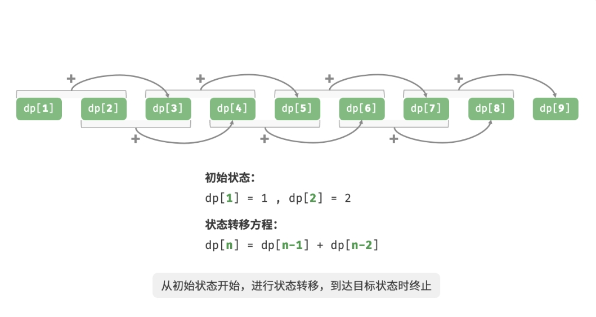
> 
> 与回溯算法一样，动态规划也使用“状态”概念来表示问题求解的特定阶段，每个状态都对应一个问题以及相应的局部最优解。
> 例如，爬楼梯问题的状态定义为当前所在楼梯阶数 `$i$`。
> 
> 根据以上内容，可以总结出动态规划的常用术语：
> 
> * 将数组 `dp` 称为 **dp 表**，`$dp[i]$` 表示状态 `$i$` 对应子问题的解。
> * 将最小子问题对应的状态（第 1 阶和第 2 阶楼梯）称为**初始状态**。
> * 将递推公式 `$dp[i] = dp[i-1] + dp[i-2]$` 称为**状态转移方程**。

### 空间优化的动态规划

由于 `$dp[i]$` 只与 `$dp[i-1]$` 和 `$dp[i-2]$` 有关，因此无须使用一个数组 `dp` 来存储所有子问题的解，
而只需两个变量滚动前进即可。

```python
def climbing_stairs_dp_comp(n: int) -> int:
    """
    爬楼梯：空间优化后的动态规划

    Args:
        n (int): 目标楼梯阶数

    Returns:
        int: 爬楼梯方案数
    """
    if n == 1 or n == 2:
        return n
    a, b = 1, 2
    for _ in range(3, n + 1):
        a, b = b, a + b
    
    return b
```

> 观察以上代码，由于省去了数组 `dp` 占用的空间，因此空间复杂度从 `$O(n)$` 降至 `$O(1)$`。
> 
> 在动态规划问题中，当前状态往往仅与前面有限个状态有关，这时我们可以只保留必要的状态，
> 通过“降维”来节省内存空间。这种空间优化技巧被称为“滚动变量”或“滚动数组”。

## 动态规划问题特性

在上一节中，介绍了动态规划是如何通过子问题分解来求解原问题的。实际上，
子问题分解是一种通用的算法思路，在分治、动态规划、回溯中的侧重点不同。

* **分治算法**递归地将原问题划分为多个相互独立的子问题，直至最小问题，并在回溯中合并子问题的解，
  最终得到原问题的解。
* **动态规划**也对问题进行递归分解，但与分治算法的主要区别是，动态规划中的子问题是相互依赖的，
  在分解过程中会出现许多重叠子问题。
* **回溯算法**在尝试和回退中穷举所有可能的解，并通过剪枝避免不必要的搜索分支。
  原问题的解由一系列决策步骤构成，可以将每个决策步骤之前的子序列看作一个子问题。

实际上，动态规划常用来求解最优化问题，他们不仅包含重叠子问题，还具有另外两大特性：最优子结构、
无后效性。

### 最优子结构

对爬楼梯问题稍作改动，使之更加适合展示最优子结构概念。

> 给定一个楼梯，每一步可以上 1 阶或者 2 阶，每一阶楼梯上都贴有一个非负整数，
> 表示你在该台阶所需要付出的代价。给定一个非负整数数组 `cost`，
> 其中 `cost[i]` 表示在第 `$i$` 个台阶需要付出的代价，`cost[0]` 为地面（起始点）。
> 请计算最少需要付出多少代价才能到达顶部？

如下图所示，若 1、2、3 阶的代价分别为 1、10、1，则从地面爬到第 3 阶的最小代价为 2。

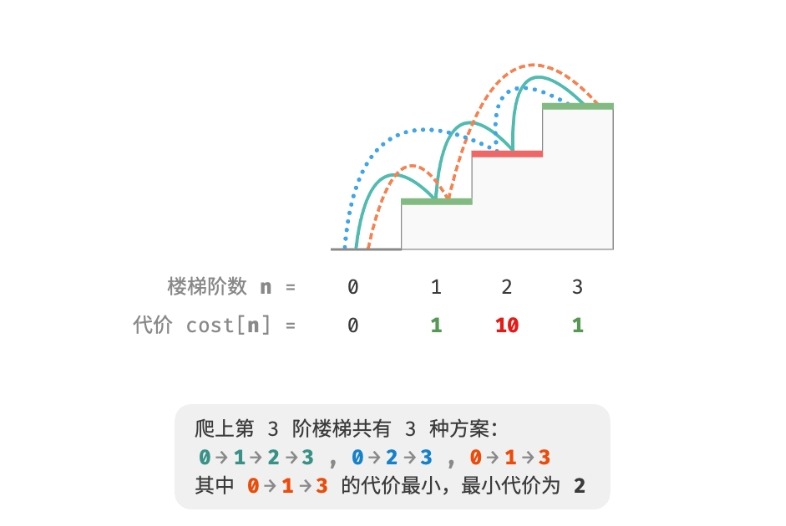

设 `$dp[i]$` 为爬到第 `$i$` 阶累计付出的代价，由于第 `$i$` 阶只可能从 `$i-1$` 阶或 `$i-2$` 阶走来，
因此 `$dp[i]$` 只可能等于 `$dp[i-1]+cost[i]$` 或 `$dp[i-2]+cost[i]$`。
为了尽可能减少代价，应该选择两者中较小的那一个：

`$$dp[i] = min(dp[i-1], dp[i-2]) + cost[i]$$`

这便可以引出最优子结构的含义：**原问题的最优解是从子问题的最优解构建得来的**。
本题显然具有最优子结构：从两个子问题最优解 `$dp[i-1]$` 和 `$dp[i-2]$` 中挑选出较优的那一个，
并用它构建出原问题 `$dp[i]$` 的最优解。

那么，上一节的爬楼梯题目有没有最优子结构呢？它的目标是求解方案数量，看似是一个计数问题，但如果换一种问法：
“求解最大方案数量”。我们意外地发现，虽然题目修改前后是等价的，但最优子结构浮现出来：
第 `$n$` 阶最大方案数量等于第 `$n-1$` 阶和第 `$n-2$` 阶最大方案数量之和。所以说，
最优子结构的解释方式比较灵活，在不同问题中会有不同的含义。

根据状态转移方程，以及初始状态 `$dp[1]=cost[1]$` 和 `$dp[2]=cost[2]$`，就可以得到动态规划代码：

```python
# min_cost_climbing_stairs_dp.py
from typing import List

def min_cost_climbing_stairs_dp(cost, List[int]) -> int:
    """
    爬楼梯最小代价：动态规划
    """
    n = len(cost) - 1
    if n == 1 or n == 2:
        return cost[n]
    # 初始化 dp 表，用于存储子问题的解
    dp = [0] * (n + 1)
    # 初始状态：预设最小子问题的解
    dp[1], dp[2] = cost[1], cost[2]
    # 状态转移：从较小子问题逐步求解较大子问题
    for i in range(3, n + 1):
        dp[i] = min(dp[i - 1], dp[i - 2]) + cost[i]
    
    return dp[n]
```

下图展示了以上代码的动态规划过程：

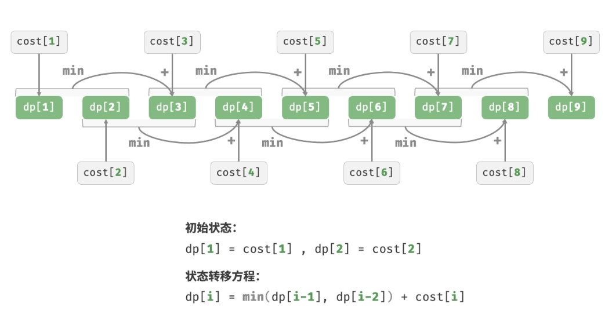

本题也可以进行空间优化，将一维压缩至零维，使得空间复杂度从 `$O(n)$` 降至 `$O(1)$`：

```python
# min_cost_climbing_stairs_dp.py
from typing import List

def min_cost_climbing_stairs_dp(cost, List[int]) -> int:
    """
    爬楼梯最小代价：动态规划
    """
    n = len(cost) - 1
    if n == 1 or n == 2:
        return cost[n]
    # 初始状态：预设最小子问题的解
    a, b = cost[1], cost[2]
    # 状态转移：从较小子问题逐步求解较大子问题
    for i in range(3, n + 1):
        a, b = b, min(a, b) + cost[i]
    
    return b
```

### 无后效性

无后效性是动态规划能够有效解决问题的重要特性之一，其定义为：**给定一个确定的状态，
它的未来发展只与当前状态有关，而与过去经历的所有状态无关**。

> 以爬楼梯问题为例，给定状态 `$i$`，它会发展出状态 `$i+1$` 和状态 `$i+2$`，分别对应跳 1 步和跳 2 步。
> 在做出这两种选择时，无须考虑状态 `$i$` 之前的状态，它们对状态 `$i$` 的未来没有影响。
> 
> 然而，如果我们给爬楼梯问题添加一个约束，情况就不一样了。
> 
> 带约束爬楼梯：
>
> 给定一个共有 `$n$` 阶的楼梯，每步可以上 1 阶或者 2 阶，但不能连续两轮跳 1 阶，
> 请问有多少种方案可以爬到楼顶？

如下图所示，爬上第 3 阶仅剩 2 种可行方案，其中连续三次跳 1 阶的方案不满足约束条件，因此被舍弃。

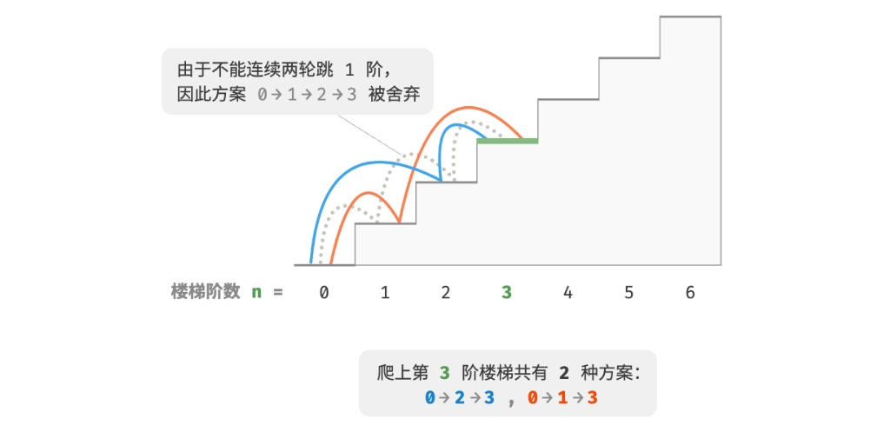

在该问题中，如果上一轮是跳 1 阶上来的，那么下一轮就必须跳 2 阶。
这意味着，下一步选择不能由当前状态（当前所在楼梯阶数）独立决定，
还和前一个状态（上一轮所在楼梯阶数）有关。

不难发现，此问题已不满足无后效性，状态转移方程 `$dp[i] = dp[i-1] + dp[i-2]$` 也失效了，
因为 `$dp[i-1]$` 代表本轮跳 1 阶，但其中包含了许多 “上一轮是跳 1 阶上来的” 方案，而为了满足约束，
我们就不能将 `$dp[i-1]$` 直接计入 `$dp[i]$` 中。

为此，我们需要扩展状态定义：状态 `$[i, j]$` 表示处在第 `$i$` 阶并且上一轮跳了 `$j$` 阶，
其中 `$j \in \{1, 2\}$`。此状态定义有效地区分了上一轮跳了 1 阶还是 2 阶，
我们可以据此判断当前状态是从何而来的。

* 当上一轮跳了 1 阶时，上上一轮只能选择跳 2 阶，
  即 `$dp[i, 1]$` 只能从 `$dp[i-1, 2]$` 转移过来。
* 当上一轮跳了 2 阶时，上上一轮可选择跳 1 阶或跳 2 阶，
  即 `$dp[i,2]$` 可以从 `$dp[i-2, 1]$` 或 `$dp[i-2, 2]$` 转移过来。

如下图所示，在该定义下，`$dp[i, j]$` 表示状态 `$[i, j]$` 对应的的方案数。
此时状态转移方程为：

`$$\begin{cases}
dp[i, 1] = dp[i-1, 2] \\\
dp[i, 2] = dp[i-2, 1] + dp[i-2, 2]
\end{cases}$$`

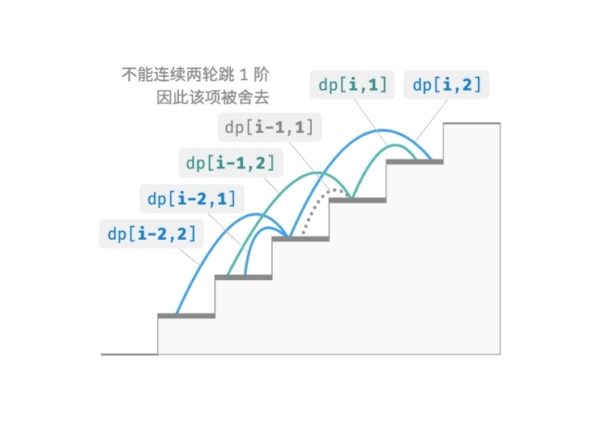

最终，返回 `$dp[n, 1] + dp[n, 2]$` 即可，两者之和代表爬到第 `$n$` 阶的方案总数：

```python
# climbing_stairs_constraint_dp.py

def climbing_stairs_constraint_dp(n: int) -> int:
    """
    带约束爬楼梯：动态规划
    """
    if n == 1 or n == 2:
        return 1
    # 初始化 dp 表，用于存储子问题的解
    dp = [[0] * 3 for _ in range(n + 1)]
    # 初始状态：预设最小子问题的解
    dp[1][1], dp[1][2] = 1, 0
    dp[2][1], dp[2][2] = 0, 1
    # 状态转移：从较小子问题逐步求解较大子问题
    for i in range(3, n + 1):
        dp[i][1] = dp[i - 1][2]
        dp[i][2] = dp[i - 2][1] + dp[i - 2][2]
    
    return dp[n][1] + dp[n][2]
```

在上面的案例中，由于仅需多考虑前面一个状态，因此我们仍然可以通过扩展状态定义，
使得问题重新满足无后效性。然而，某些问题具有非常严重的“有后效性”。

> 爬楼梯与障碍生成
> 
> 给定一个共有 `$n$` 阶的楼梯，你每步可以上 `$1$` 阶或者 `$2$` 阶。规定当爬到第 `$i$` 阶时，
> 系统自动会在第 `$2i$` 阶上放上障碍物，之后所有轮都不允许跳到第 `$2i$` 阶上。例如，
> 前两轮分别跳到了第 `$2$`、`$3$` 阶上，则之后就不能跳到第 `$4$`、`$6$` 阶上。
> 请问有多少种方案可以爬到楼顶？

在这个问题中，下次跳跃依赖过去所有的状态，因为每一次跳跃都会在更高的阶梯上设置障碍，
并影响未来的跳跃。对于这类问题，动态规划往往难以解决。

实际上，许多复杂的组合优化问题（例如旅行商问题）不满足无后效性。
对于这类问题，我们通常会选择使用其他方法，例如启发式搜索、遗传算法、
强化学习等，从而在有限时间内得到可用的局部最优解。

## 动态规划解题思路

对于一个问题：

1. 如何判断一个问题是不是动态规划问题？
2. 求解动态规划问题该从何处入手，完整步骤是什么？

### 问题判断

总的来说，如果一个问题包含重叠子问题、最优子结构，并满足无后效性，
那么它通常适合用动态规划求解。然而，我们很难从问题描述中直接提取出这些特性。
因此我们通常会放宽条件，先观察问题是否适合使用回溯（穷举）解决。

**适合用回溯解决的问题通常满足“决策树模型”**，这种问题可以使用树形结构来描述，
其中每一个节点代表一个决策，每一条路径代表一个决策序列。
换句话说，如果问题包含明确的决策概念，并且解是通过一系列决策产生的，
那么它就满足决策树模型，通常可以使用回溯来解决。

在此基础上，动态规划问题还有一些判断的 **“加分项”**。

* 问题包含最大（小）或最多（少）等最优化描述。
* 问题的状态能够使用一个列表、多维矩阵或树来表示，并且一个状态与其周围的状态存在递推关系。

相应地，也存在一些“减分项”。

* 问题的目标是找出所有可能的解决方案，而不是找出最优解。
* 问题描述中有明显的排列组合的特征，需要返回具体的多个方案。

**如果一个问题满足决策树模型，并具有较为明显的“加分项”，我们就可以假设它是一个动态规划问题，
并在求解过程中验证它。**

### 问题求解步骤

动态规划的解题流程会因问题的性质和难度而有所不同，但通常遵循以下步骤：

1. 描述决策
2. 定义状态
3. 建立 `$dp$` 表
4. 推导状态转移方程
5. 确定边界条件等

为了更形象地展示解题步骤，我们使用一个经典问题“最小路径和”来举例。

> 给定一个 `$n\times m$` 的二维网格 `grid`，网格中的每个单元格包含一个非负整数，
> 表示该单元格的代价。机器人以左上角单元格为起始点，每次只能向下或者向右移动一步，
> 直至到达右下角单元格。请返回从左上角到右下角的最小路径和。

下图展示了一个例子，给定网格的最小路径和为 13：

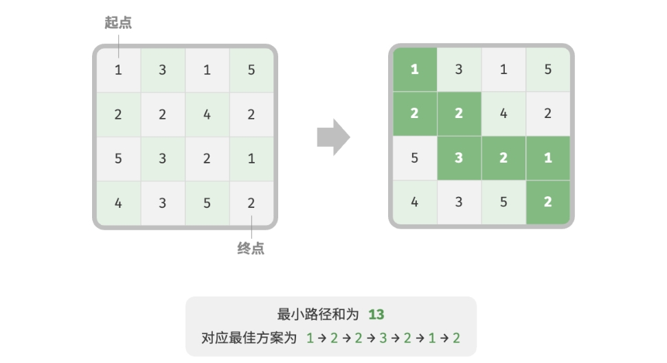

1. **第一步：思考每轮的决策，定义状态，从而得到 `$dp$` 表**

本题的每一轮的决策就是从当前格子向下或向右走一步。设当前格子的行列索引为 `$[i,j]$`，
则向下或向右走一步后，索引变为 `$[i+1,j]$` 或 `$[i, j+1]$`。
因此，状态应包含行索引和列索引两个变量，记为 `$[i,j]$`。
状态 `$[i,j]$` 对应的子问题为：从起始点 `$[0, 0]$` 走到 `$[i,j]$` 的最小路径和，
解记为 `$dp[i,j]$` 。

至此，我们就得到了下图所示的二维 `$dp$` 矩阵，其尺寸与输入网格 `$grid$` 相同。


> 动态规划和回溯过程可以描述为一个决策序列，而状态由所有决策变量构成。
> 它应当包含描述解题进度的所有变量，其包含了足够的信息，能够用来推导出下一个状态。
> 
> 每个状态都对应一个子问题，我们会定义一个 `$dp$` 表来存储所有子问题的解，
> 状态的每个独立变量都是 `$dp$` 表的一个维度。从本质上看，`$dp$` 表是状态和子问题的解之间的映射。

2. **第二步：找出最优子结构，进而推导出状态转移方程**

对于状态 `$[i,j]$`，它只能从上边格子 `$[i-1, j]$` 和左边格子 `$[i, j-1]$` 转移而来。因此最优子结构为：
到达 `$[i, j]$` 的最小路径和由 `$[i, j-1]$` 的最小路径和与 `$[i-1, j]$` 的最小路径和中较小的那一个决定。

根据以上分析，可推出下图所示的状态转移方程：

`$$dp[i, j] = \text{min}(dp[i-1, j], dp[i, j-1]) + \text{grid}[i,j]$$`


> 根据定义好的 `$dp$` 表，思考原问题和子问题的关系，
> 找出通过子问题的最优解来构造原问题的最优解的方法，即最优子结构。
> 
> 一旦我们找到了最优子结构，就可以使用它来构建出状态转移方程。

3. **第三步：确定边界条件和状态转移顺序**

在本题中，处在首行的状态只能从其左边的状态得来，
处在首列的状态只能从其上边的状态得来，
因此首行 `$i=0$` 和首列 `$j=0$` 是边界条件。

如下图所示，由于每个格子是由其左方格子和上方格子转移而来，
因此我们使用循环来遍历矩阵，外循环遍历各行，内循环遍历各列。

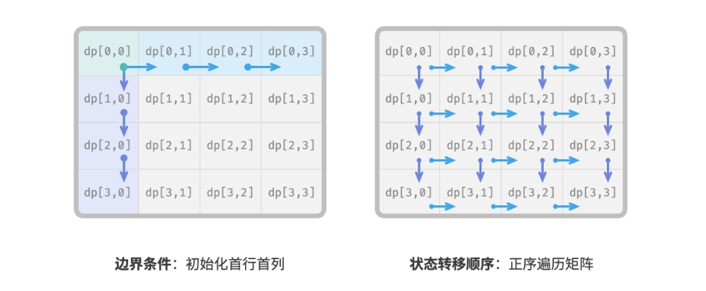

> 边界条件在动态规划中用于初始化 `$dp$` 表，在搜索中用于剪枝。
> 
> 状态转移顺序的核心是要保证在计算当前问题的解时，所有它依赖的更小子问题的解都已经被正确地计算出来。

根据以上分析，我们已经可以直接写出动态规划代码。然而子问题分解是一种从顶至底的思想，
因此按照“暴力搜索 `$\rightarrow$` 记忆化搜索 `$\rightarrow$` 动态规划”的顺序实现更加符合思维习惯。

#### 暴力搜索

从状态 `$[i, j]$` 开始搜索，不断分解为更小的状态 `$[i-1,j]$` 和 `$[i,j-1]$`，
递归函数包括以下要素：

* 递归参数：状态 `$[i,j]$`；
* 返回值：从 `$[0, 0]$` 到 `$[i, j]$` 的最小路径和 `$dp[i,j]$`；
* 终止条件：当 `$i=0$` 且 `$j=0$` 时，返回代价 `$\text{grid}[0,0]$`；
* 剪枝：当 `$i < 0$` 时或 `$j<0$` 时索引越界，此时返回代价 `$+\infty$`，代表不可行。

实现代码如下：

```python
# min_path_sum.py

def min_path_sum_dfs(grid: list[list[int]], i: int, j: int) -> int:
    """
    最小路径和：暴力搜索
    """
    # 若为左上角单元格，则终止搜索
    if i == 0 and j == 0:
        return grid[0][0]
    # 若行列索引越界，则返回 +∞ 代价
    if i < 0 or j < 0:
        return inf
    # 计算从左上角到 (i-1, j) 和 (i, j-1) 的最小路径代价
    up = min_path_sum_dfs(grid, i - 1, j)
    left = min_path_sum_dfs(grid, i, j - 1)
    # 返回从左上角到 (i, j) 的最小路径代价
    return min(left, up) + grid[i][j]
```

下图给出了以 `$dp[2, 1]$` 为根节点的递归树，其中包含一些重叠子问题，
其数量会随着网格 `grid` 的尺寸变大而急剧增多。

从本质上看，造成重叠子问题的原因为：存在多条路径可以从左上角到达某一单元格。


每个状态都有向下和向右两种选择，从左上角走到右下角总共需要 `$m+n-2$` 步，
所以最差时间复杂度为 `$O(2^{m+n})$`。请注意，这种计算方式未考虑临近网格边界的情况，
当到达网络边界时只剩下一种选择，因此实际的路径数量会少一些。

#### 记忆化搜索

我们引入一个和网格 `grid` 相同尺寸的记忆列表 `mem`，
用于记录各个子问题的解，并将重叠子问题进行剪枝：

```python
# min_path_sum.py

def min_path_sum_dfs_mem(
    grid: list[list[int]], mem: list[list[int]], i: int, j: int
) -> int:
    """
    最小路径和：记忆化搜索
    """
    # 若为左上角单元格，则终止搜索
    if i == 0 and j == 0:
        return grid[0][0]
    # 若行列索引越界，则返回 +∞ 代价
    if i < 0 or j < 0:
        return inf
    # 若已有记录，则直接返回
    if mem[i][j] != -1:
        return mem[i][j]
    # 左边和上边单元格的最小路径代价
    up = min_path_sum_dfs_mem(grid, mem, i - 1, j)
    left = min_path_sum_dfs_mem(grid, mem, i, j - 1)
    # 记录并返回左上角到 (i, j) 的最小路径代价
    mem[i][j] = min(left, up) + grid[i][j]
    return mem[i][j]
```

如下图所示(记忆化搜索递归树)，在引入记忆化后，所有子问题的解只需计算一次，因此时间复杂度取决于状态总数，
即网格尺寸 `$O(nm)$` 。


#### 动态规划

基于迭代实现动态规划解法，代码如下所示：

```python
# min_path_sum.py

def min_path_sum_dp(grid: list[list[int]]) -> int:
    """
    最小路径和：动态规划
    """
    n, m = len(grid), len(grid[0])
    # 初始化 dp 表
    dp = [[0] * m for _ in range(n)]
    dp[0][0] = grid[0][0]
    # 状态转移：首行
    for j in range(1, m):
        dp[0][j] = dp[0][j - 1] + grid[0][j]
    # 状态转移：首列
    for i in range(1, n):
        dp[i][0] = dp[i - 1][0] + grid[i][0]
    # 状态转移：其余行和列
    for i in range(1, n):
        for j in range(1, m):
            dp[i][j] = min(dp[i][j - 1], dp[i - 1][j]) + grid[i][j]
    return dp[n - 1][m - 1]
```

下图展示了最小路径和的状态转移过程，其遍历了整个网格，因此时间复杂度为 `$O(nm)$`。
数组 `dp` 大小为  `$n \times m$`，因此空间复杂度为 `$O(nm)$`。


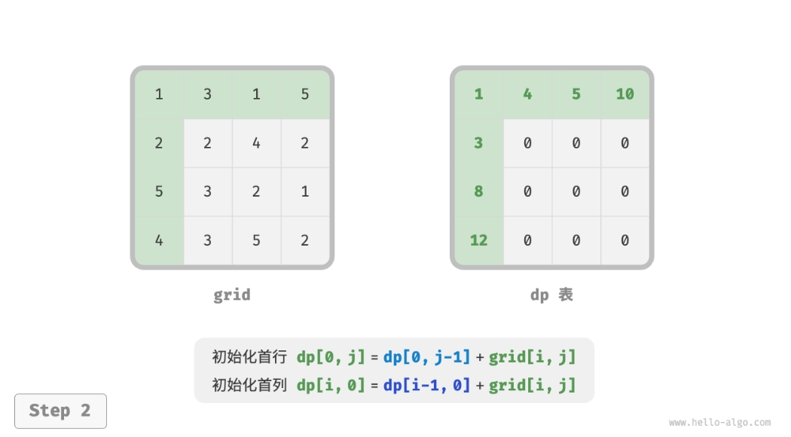

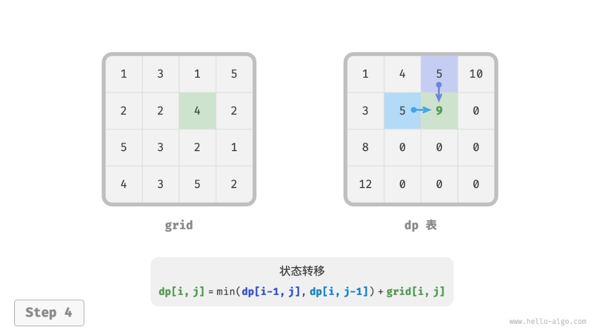

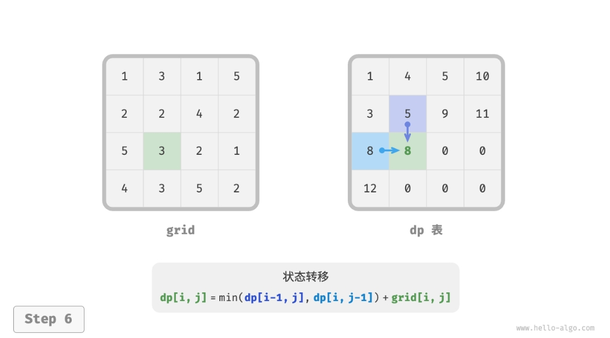
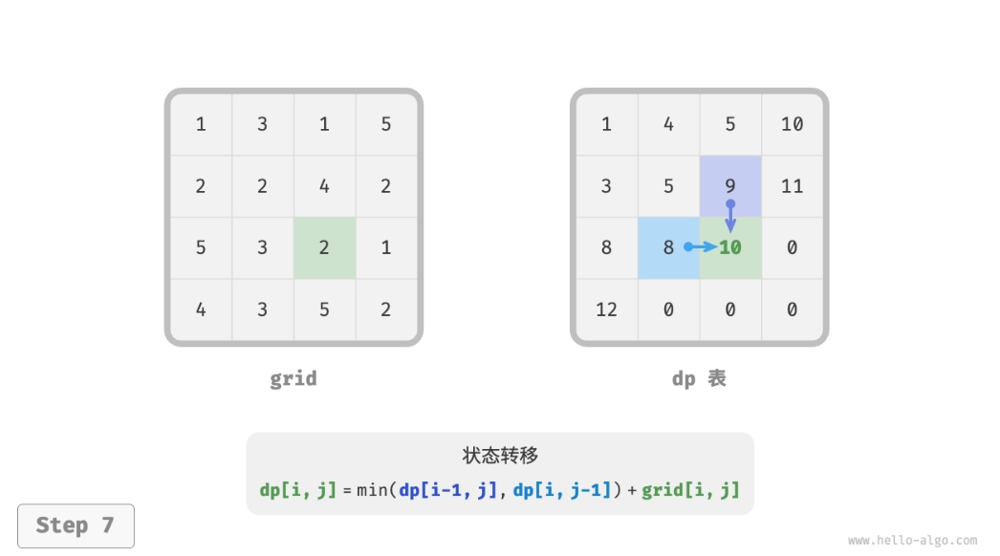
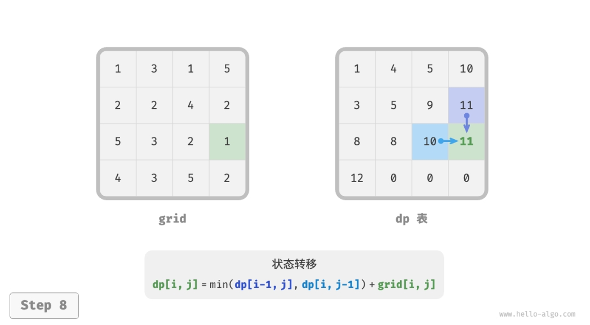
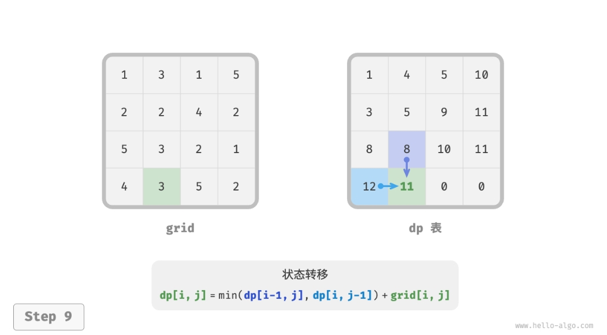
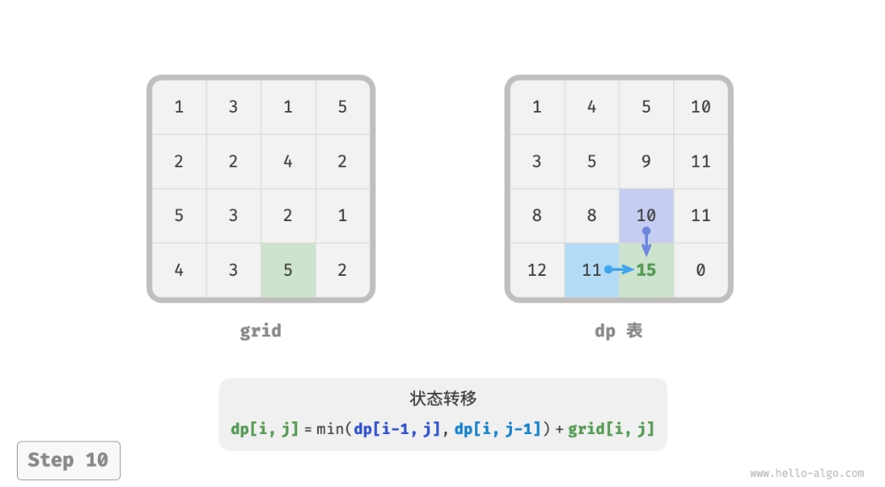
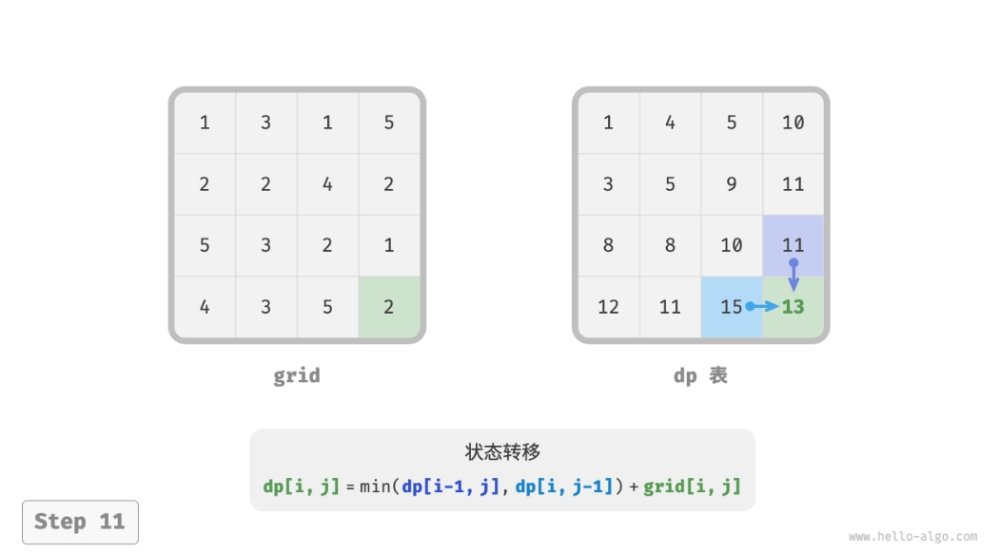


#### 空间优化动态规划

由于每个格子只与其左边和上边的格子有关，因此我们可以只用一个单行数组来实现 `$dp$` 表。

请注意，因为数组 `dp` 只能表示一行的状态，所以我们无法提前初始化首列状态，
而是在遍历每行时更新它：

```python
# min_path_sum.py

def min_path_sum_dp_comp(grid: list[list[int]]) -> int:
    """
    最小路径和：空间优化后的动态规划
    """
    n, m = len(grid), len(grid[0])
    # 初始化 dp 表
    dp = [0] * m
    # 状态转移：首行
    dp[0] = grid[0][0]
    for j in range(1, m):
        dp[j] = dp[j - 1] + grid[0][j]
    # 状态转移：其余行
    for i in range(1, n):
        # 状态转移：首列
        dp[0] = dp[0] + grid[i][0]
        # 状态转移：其余列
        for j in range(1, m):
            dp[j] = min(dp[j - 1], dp[j]) + grid[i][j]
    return dp[m - 1]
```

# 动态规划问题

## 运筹-最短路径问题

最短路径是一类经典的动态规划问题。如下图。给定一个网络，需要从 A 出发到达 D，
如何选择路径才能使总路程最短，显然这是一个 4 阶段决策问题。


先确定动态规划的几个变量，具体如下：

1. 阶段 `$k$`：此处的问题中 `$k = 1, 2, 3$`；
2. 状态 `$S_{k}$` 表示第 `$k$` 阶段可做的选择：

    `$$S_{1} = \{A\}$$`
    `$$S_{2} = \{B_{1}, B_{2}\}$$`
    `$$S_{3} = \{C_{1}, C_{2}\}$$`
    `$$S_{4} = \{D\}$$`

    其中，`$S_{1}$` 和 `$S_{4}$` 只有一个状态，其实没有选择。

3. 决策 `$x_{k}$`：表示第 `$k$` 阶段所做的下一步选择，即 `$x_{k}=S_{k+1},k=3,2,1$`；
4. 阶段指示函数 `$d_{k}(S_{k}, x_{k})$`：表示从 `$S_{k}$` 出发，采取决策 `$x_{k}$` 到达 `$S_{k+1}$` 所走的距离；
5. 最优指标函数 `$f_{k}(S_{k})$`：表示从第 `$k$` 阶段的 `$S_{k}$` 出发最终到达终点的最短距离；
6. 递推方程：根据动态规划的最优化原理，递推方程从后往前推导，终点是 `$D$`，所以递推方程如下：

    `$$f_{3}(S_{3}) = \underset{x_{3} \in D_{3}(S_{3})}{\text{min}}[d_{3}(S_{3}, x_{3})]$$`
    `$$f_{2}(S_{2}) = \underset{x_{2} \in D_{2}(S_{2})}{\text{min}}[d_{2}(S_{2}, x_{2}) + f_{3}(S_{3})]$$`
    `$$f_{1}(S_{1}) = \underset{x_{1} \in D_{1}(S_{1})}{\text{min}}[d_{1}(S_{1}, x_{1}) + f_{2}(S_{2})]$$`

    `$$f_{k}(S_{k}) = \underset{x_{k} \in D_{k}(S_{k})}{\text{min}}[d_{k}(S_{k}, x_{k}) + f_{k+1}(S_{k+1})], k=3,2,1$$`

### 动态规划

下面采用表格法演示从后往前的顺序递推求解最短路径。理解了最短路径的求解思路，其他的动态规划问题也是类似的解法。

由于最后一个阶段 `$D$` 是终点，因此我们从倒数第二个阶段开始往前递推。

1. `$k=3$` 有两个选择，可以从 `$C$` 到 `$D$`，由于 `$d_{3}(S_{3}, x_{3})$` 有两种情况，
   递推方程中 `$f_{3}(S_{3})$` 也就有两种可能，如果递推完毕，
   那么 `$f_{3}(S_{3}) = \underset{x_{3} \in \{C_{1}, C_{2}\}}{\text{min}}[d_{3}(S_{3}, x_{3})]$`，
   即是两者中的最小值，如下表：

   | `$S_{3}(X_{3})$` | `$d_{3}(S_{3}, x_{3})$` | `$f_{3}(S_{3})$` | `$X_{3}^{*}$` |
   |------------------|-------------------------|------------------|---------------|
   |                  | `$D$` |    |       |
   | `$C_{1}$`        | 20    | 20 | `$D$` |
   | `$C_{2}$`        | 10    | 10 | `$D$` |

2. 当 `$k=2$`，由于 `$f_{k+1}(S_{k+1})=d_{3}(S_{3}, x_{3})$` 已经确定，有两个不同的取值，
   在 `$B \rightarrow C$` 时，需要考虑 `$d_{3}(S_{3}, x_{3})$` 的两种状态对当前选择的影响，
   因此在状态转移方程中，`$d_{2}(S_{2}, x_{2}) + d_{3}(S_{3}, x_{3})$` 就有 4 种可能，
   如下表：

   | `$S_{2}(X_{2})$` | `$d_{2}(S_{2}, x_{2})+f_{3}(S_{3})$` |              | `$f_{2}(S_{2})$` | `$X_{2}^{*}$` |
   |------------------|--------------------------------------|--------------|------------------|---------------|
   |                  | `$C_{1}$`                            | `$C_{2}$`    |                  |           |
   | `$B_{1}$`        | `$30+20=50$`                         | `$10+10=20$` | `$20$`           | `$C_{2}$` |
   | `$B_{2}$`        | `$5+20=25$`                          | `$20+10=30$` | `$25$`           | `$C_{1}$` |

3. 继续递推，`$k=1$` 时，`$d_{1}(S_{1}, x_{1})$` 是起点，只有一种选择，而 `$d_{2}(S_{2}, x_{2})$` 有两种选择，
   因此总共有两种选择，如下表：

   | `$S_{1}(X_{1})$` | `$d_{1}(S_{1}, x_{1})+f_{2}(S_{2})$` |                  | `$f_{1}(S_{1})$` | `$X_{1}^{*}$` |
   |------------------|--------------------------------------|------------------|------------------|---------------|
   |                  | `$B_{1}$`                            | `$B_{2}$`        |        |           |
   | `$A$`            | `$10+20=30$`                         | `$20+25=45$`     | `$30$` | `$B_{1}$` |

4. 至此，所有的状态和阶段就已经递推完成，现在再从头开始查找最优路径，从上面的三个表中得到：
    - `$A$` 的最优决策 `$x_{1} = B_{1}$`
    - `$B_{1}$` 的最优决策 `$x_{2}=C_{2}$`
    - `$C_{2}$` 的最优决策是 `$x_{3}=D$`
    - 所以最短路径是：`$A \rightarrow B_{1} \rightarrow C_{2} \rightarrow D$`，即最短距离是 `$f_{1}(S_{1})=30$`

从上面的推导中需要记住以下三点：

1. 决策表是当前阶段 `$k$` 的状态数和下一阶段 `$k+1$` 的状态数的组合；
2. 下一阶段 `$k+1$` 的每个状态 `$S_{k}$` 到终点的最优决策是已经计算好的，
   当前阶段到下一阶段的决策只需从决策表中取递推方程的最小值即可。
3. 当前阶段的决策只受下一阶段的最优决策影响，下下阶段甚至后面的决策不影响当前阶段的决策，即无后效性。

```python
from typing import List

import numpy as np
import pandas as pd


def dp(df_from, df_to):
    """
    从 df_from 阶段到 df_to 阶段的动态规划求解
    """
    from_node = df_to.index
    f = pd.Series()
    g = []
    for j in from_node:
        m1 = df_to.loc[j]
        m2 = m1 + df_from
        m3 = m2.sort_values()
        f[j] = m3[0]
        g.append(m3.index[0])
    
    dc = pd.DataFrame()
    dc["v"] = f.values
    dc["n"] = g
    dc.index = f.index
    cv.append(dc)
    
    if len(start) > 0:
        df = start.pop()
        t = dp(dc["v"], df)
    else:
        return dc


# 测试代码 main 函数
def main():
    # 前后两个阶段的节点距离，使用 pd.DataFrame 存储
    # A->B 距离
    df1 = pd.DataFrame(
        np.array([[10, 20]]),
        index = ["A"],
        columns = ["B1", "B2"],
    )
    # B->C 距离
    df2 = pd.DataFrame(
        np.array([[30, 10], [5, 20]]),
        index = ["B1", "B2"],
        columns = ["C1", "C2"],
    )
    # C->D 距离
    df3 = pd.DataFrame(
        np.array([[20], [10]]),
        index = ["C1", "C2"],
        columns = ["D"],
    )
    
    global start  # 初始状态
    start = [df1]
    global cv  # 存储路径
    cv = []
    t1 = df3["D"]  # 初始状态
    h1 = dp(t1, df2)
    
    # 打印路径
    for m in range(len(cv)):
        xc = cv.pop()
        x1 = xc.sort_values(by = "v")
        print(x1["n"].values[0], end = "->")

if __name__ == "__main__":
    main()
```

### 整数规划

使用动态规划求解从起点到终点的最短路径，其实也可以看成是一个整数规划问题。

用 `$edge=(i, j, l)$` 表示从 `$i$` 点出发到达 `$j$` 节点距离为 `$l$` 的边，
对于非起点和终点，如 `$B_{1}$` 节点。

* 如果 `$B_{1}$` 节点被选中，则进来的边数等于出去的边数；
* 如果 `$B_{1}$` 节点没有被选中，则出去的边数和进来的边数都是 0。
* 对于起点，只有出去的边，没有进来的边；对于终点，则只有进来的边没有出去的边

将该问题可以建模成一个简单的 0-1 整数规划问题，即：

`$$min \sum l_{ij} x_{ij}$$`

`$$s.t. \begin{cases}
\sum_{j} x_{ji} - \sum_{j}x_{ij} = 0, i \notin \{A, D\} \\
\sum_{j} x_{ji} - \sum_{j}x_{ij} = 1, i \notin \{A\} \\
\sum_{j} x_{ji} - \sum_{j}x_{ij} = -1, i \notin \{D\} \\
x_{ij} = \{0, 1\}
\end{cases}$$`

用整数规划 MIP 解最短路径示例代码如下：

```python
import gurobipy as grb

# 定义边
edge = {
    ("V1", "A"): 0,
    ("A", "B1"): 10,
    ("A", "B2"): 20,
    ("B1", "C1"): 30,
    ("B1", "C2"): 10,
    ("B2", "C1"): 5,
    ("B2", "C2"): 20,
    ("C1", "D"): 20,
    ("C2", "D"): 10,
    ("D", "V2"): 0,
}

# 创建边和边长度的 Gurobi 常量
links, length = grb.multidict(edge)

# 创建模型
m = grb.Model()
x = m.addVars(links, obj = length, name = "flow")

# 添加约束
for i in ["A", "B1", "B2", "C1", "C2", "D"]:
    if i == "A":
        delta = 1
    elif i == "D":
        delta = -1
    else:
        delta = 0
    
    name = f"C_{i}"
    m.addConstrs(
        sum(x[i, j] for i, j in links.select(i, "*")) - sum(x[j, i] for j, i in links.select("*", i)) == delta, 
        name = name
    )
    # m.addConstrs(
    #     x.sum(i, "*") - x.sum("*", i) == delta, 
    #     name = name
    # )

# 求解并打印结果
m.optimize()

for i, j in links:
    if (x[i, j].x > 0):
        print(f"{i}->{j}: {edge[(i, j)]}")


# 测试代码 main 函数
def main():
    pass

if __name__ == "__main__":
    main()
```


```
Restricted license - for non-production use only - expires 2024-10-28
Gurobi Optimizer version 10.0.2 build v10.0.2rc0 (win64)

CPU model: 13th Gen Intel(R) Core(TM) i7-13700K, instruction set [SSE2|AVX|AVX2]
Thread count: 16 physical cores, 24 logical processors, using up to 24 threads

Optimize a model with 6 rows, 10 columns and 18 nonzeros
Model fingerprint: 0x2edb9c0e
Coefficient statistics:
  Matrix range     [1e+00, 1e+00]
  Objective range  [5e+00, 3e+01]
  Bounds range     [0e+00, 0e+00]
  RHS range        [1e+00, 1e+00]
Presolve removed 4 rows and 6 columns
Presolve time: 0.00s
Presolved: 2 rows, 4 columns, 8 nonzeros

Iteration    Objective       Primal Inf.    Dual Inf.      Time
       0    0.0000000e+00   2.000000e+00   0.000000e+00      0s
       1    3.0000000e+01   0.000000e+00   0.000000e+00      0s

Solved in 1 iterations and 0.00 seconds (0.00 work units)
Optimal objective  3.000000000e+01
A->B1: 10
B1->C2: 10
C2->D: 10
```

### 一对多最短路问题

> 贝尔曼-福特算法

### 多对多最短路问题

> 弗洛伊德-瓦尔肖算法

### 无负权一对多最短路问题

> 迪杰斯特拉算法

### 一对多无环图最短路问题

## 运筹-背包问题

动态规划的一个常见例子是背包问题，一个背包最多能放 `$n$`kg 的物品，每个物品的重量和价值都已经知道，
那要选择哪些物品才能使背包内的物品总价值最大。背包问题可以看成是一个多阶段规划问题，如果选择物品 A，
占用的空间将使得其他可供选择的物品减少。

背包问题是学习动态规划的经典例题，虽然是多阶段决策问题，但不像解最短路径问题那样直观。
最短路径问题的不同阶段、状态、决策、收益是固定而明显的，而背包问题的状态、决策则需要通过动态规划表来表达。

背包问题根据物品的数量分为不同的类型：

* 如果每种物品只有一件，则成为 **0-1 背包问题**，可以看成是 **0-1 整数规划问题**；
* 如果每种物品有多件，则背包问题可以看成是**普通的整数规划问题**；
* 如果某件物品具有两种不同的费用，选择这件物品必须同时付出这两种代价，那么每种代价都有一个可付出的最大值；
  这种情况是**二维费用的背包问题**；
* 如果物品之间有冲突，选择 A 物品则不能选 B 物品，这种情况是**分组背包问题**；
* 如果物品之间有依赖，选择 A 物品则必须同时选择 B 物品，这种情况是**有依赖的背包问题**。

虽然简单背包问题可以用**整数规划**方法求解，但是用**动态规划**方法求解更为高效。

### 0-1 背包问题

假设背包中已经有 A、B、C 三件物品，还有 D、E 没有放进背包中，此时，以某种规则（如选择价值最大的）从备选物品中选择一件物品，
比如 D，此时存在两种情况：

* 第一种情况是，背包剩余容量能放进 D，则将 D 放入背包中；
* 第二种情况是，背包剩余容量不足以装载 D，则需要从 A、B、C 选择一件物品拿出来才能将 D 放进去，
  此时需要比较前后背包总价值是否变大。

用数学表达式表示如下：

设 `$V(i, j)$` 表示将前 `$i$` 个物品放入容量为 `$j$` 的背包中所获得的最大价值（`$i$` 不是原始物品编号）。
当前阶段的前一个状态用 `$V(i-1, j)$` 表示，对于下一个状态，即对于物品 `$i$`，有两种情况：

1. 第一种情况是，背包总容量不足以装入物品 `$i$`，背包物品不做替换，背包的总价值等于前 `$i-1$` 个物品的总价值，
   即 `$V(i,j)=V(i-1, j)$`；
2. 第二种情况是，背包容量能够装入物品 `$i$`，
    - 如果把第 `$i$` 个物品装入背包，
      则背包中物品的价值等于把前 `$i-1$` 个物品装入容量为 `$j-w_{i}$`（其中 `$w_{i}$` 值第 `$i$` 个物品的容量）的背包中的价值加上第 `$i$` 个物品的价值 `$v_{i}$`；
    - 如果第 `$i$` 个物品没有装入背包，则背包中的物品的价值等于把前 `$i-1$` 个物品装入容量为 `$j$` 的背包中的价值
    - 显然，取上述二者中价值较大的作为前 `$i$` 个物品装入容量为 `$j$` 的背包中的最优解，递推方程如下：

    `$$V(i, j)=\begin{cases}
    V(i-1, j), j < w_{i} \\
    \text{max}\space\{V(i-1, j), V(i-1, j-w_{i}) + v_{i}\},j\geq w_{i}
    \end{cases}$$`

```python
def dp(weight, count, weights, costs):
    """
    动态规划求解 0-1 背包问题

    Args:
        weight (_type_): _description_
        count (_type_): _description_
        weights (_type_): _description_
        costs (_type_): _description_
    """
    preline, curline = [0] * (weight + 1), [0] * (weight + 1)
    for i in range(count):
        for j in range(weight + 1):
            if weights[i] <= j:
                curline[j] = max(preline[j], costs[i] + preline[j - weights[i]])
        preline = curline[:]
        
    return curline[weight]


# 测试代码 main 函数
def main():
    count = 5  # 物品数量
    weight = 10  # 背包总重量
    costs = [6, 3, 5, 4, 6]  # 每件物品的价值
    weights = [2, 2, 6, 5, 4]  # 每件物品的重量
    print(dp(weight, count, weights, costs))

if __name__ == "__main__":
    main()
```

## 算法-0-1 背包问题

背包问题是一个非常好的动态规划入门问题，是动态规划中最常见的问题形式。
其具有很多变种，例如：0-1 背包问题、完全背包问题、多重背包问题等。

> 问题如下：
>
> 给定 `$n$` 个物品，第 `$i$` 个物品的重量为 `$wgt[i-1]$`、价值为 `$val[i-1]$`，
> 和一个容量为 `$cap$` 的背包。每个物品只能选择一次，问在限定背包容量下能放入物品的最大价值。
> 
> 观察下图，由于物品编号 `$i$` 从 `$1$` 开始计数，数组索引从 0 开始计数，
> 因此物品 `$i$` 对应重量 `$wgt[i-1]$` 和价值 `$val[i-1]$`
> 
> 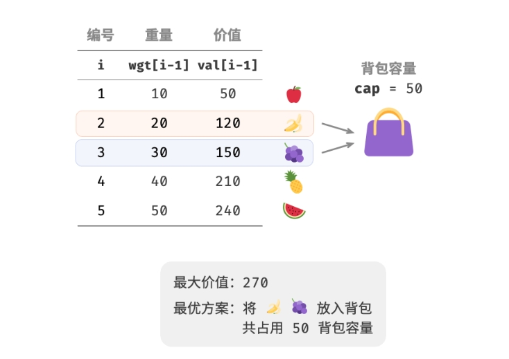

### 暴力搜索

### 记忆化搜索

### 动态规划

### 空间优化动态规划

## 算法-完全背包问题

### 动态规划思路

### 代码实现

### 空间优化

## 算法-零钱兑换问题

### 动态规划思路

### 代码实现

### 空间优化

## 算法-零钱兑换问题 II

### 动态规划思路

### 代码实现

### 空间优化

## 算法-编辑距离问题

### 动态规划思路

### 代码实现

### 空间优化

# 参考

* [什么是动态规划](https://www.zhihu.com/question/23995189/answer/35324479)
* [Hello 算法-动态规划](https://www.hello-algo.com/chapter_dynamic_programming/)
