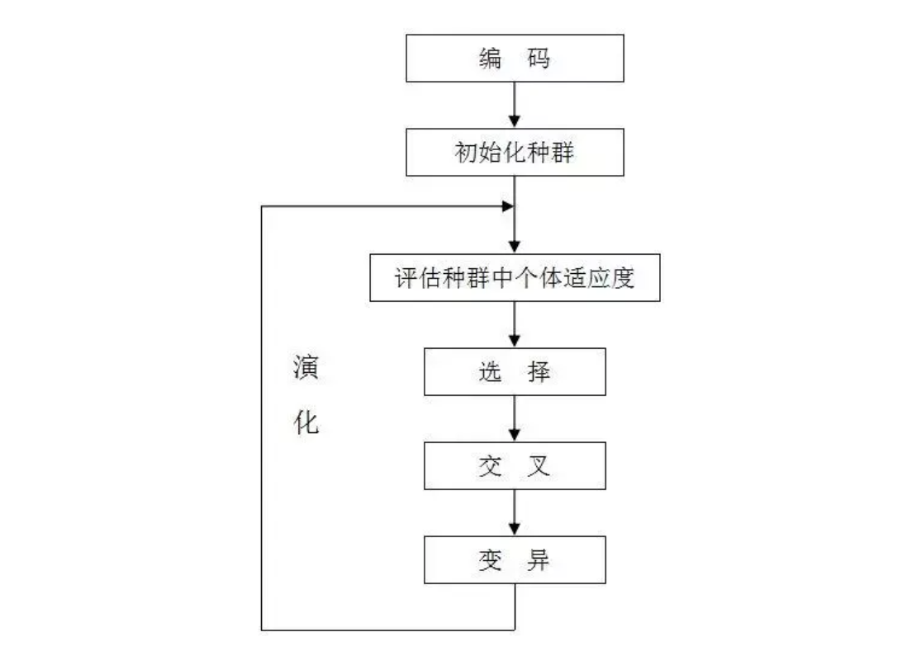

目录

- [遗传算法](#遗传算法)
  - [遗传算法](#遗传算法-1)
  - [遗传算法定义](#遗传算法定义)
  - [遗传算法执行过程](#遗传算法执行过程)
  - [遗传算法概念](#遗传算法概念)
  - [遗传算法搜索的解编码](#遗传算法搜索的解编码)

# 遗传算法

遗传算法通过组合群体中不同成员的解演化出更好的启发式优化解

> 达尔文名言：能够生存下来的往往不是***大的物种，也不是最聪明的物种，而是最能适应环境的物种

## 遗传算法

1. 编码
2. 计算适应度
3. 选择淘汰
4. 基因交叉
5. 基因突变
6. 不断进化

遗传算法是从代表问题可能潜在的解集的一个种群(population)开始的，
而一个种群则由经过基因(gene)编码(encoding)的一定数目的个体(individual)组成。
每个个体实际上是染色体(chromosome)带有特征的实体

染色体作为遗传物质的主要载体，即多个基因的集合，其内部表现(即基因型)是某种基因组合，它决定了个体的形状的外部表现，
如黑头发的特征是由染色体中控制这一特征的某种基因组合决定的。因此，在一开始需要实现从表现型到基因型的映射即编码工作。
由于仿照基因编码的工作很复杂，我们往往进行简化，如二进制编码

初代种群产生之后，按照适者生存和优胜劣汰的原理，逐代(generation)演化产生出越来越好的近似解，
在每一代，根据问题域中个体的适应度(fitness)大小选择(selection)个体，
并借助于自然遗传学的遗传算子(genetic operators)进行组合交叉(crossover，形象点就是种群个体之间进行交配)和变异(mutation，基因变异)，
产生出代表新的解集的种群

这个过程将导致种群像自然进化一样的后生代种群比前代更加适应于环境，
末代种群中的最优个体经过解码(decoding)，可以作为问题近似最优解

## 遗传算法定义

遗传算法(Genetic Algorithm, GA)是模拟达尔文生物进化论的自然选择和遗传学机理的生物进化过程的计算模型，
是一种通过模拟自然进化过程搜索最优解的方法

其主要特点是：

* 直接对结构对象进行操作，不存在求导和函数连续性的限定
* 具有内在的隐并行性和更好的全局寻优能力
* 采用概率化的寻优方法，不需要确定的规则就能自动获取和指导优化的搜索空间，自适应地调整搜索方向

遗传算法以一种群体中的所有个体为对象，并利用随机化技术指导对一个被编码的参数空间进行高效搜索。
其中，选择、交叉和变异构成了遗传算法的遗传操作；参数编码、初始群体的设定、适应度函数的设计、遗传操作设计、
控制参数设定五个要素组成了遗传算法的核心内容

## 遗传算法执行过程

遗传算法是从代表问题可能潜在的解集的一个种群(population)开始的，而一个种群则由经过基因(gene)编码的一定数目的个体(individual)组成。
每个个体实际上是染色体(chromosome)带有特征的实体

染色体作为遗传物质的主要载体，即多个基因的集合，其内部表现(即基因型)是某种基因组合，它决定了个体的形状的外部表现，
如黑头发的特征是由染色体中控制这一特征的某种基因组合决定的。因此，在一开始需要实现从表现型到基因型的映射即编码工作。
由于仿照基因编码的工作很复杂，我们往往进行简化，如二进制编码

初代种群产生之后，按照适者生存和优胜劣汰的原理，逐代(generation)演化产生出越来越好的近似解，
在每一代，根据问题域中个体的适应度(fitness)大小选择(selection)个体，
并借助于自然遗传学的遗传算子(genetic operators)进行组合交叉(crossover)和变异(mutation)，
产生出代表新的解集的种群

这个过程将导致种群像自然进化一样的后生代种群比前代更加适应于环境，末代种群中的最优个体经过解码(decoding)，可以作为问题近似最优解

## 遗传算法概念 

* 交配操作
* 精英、移民、突变和交叉

## 遗传算法搜索的解编码