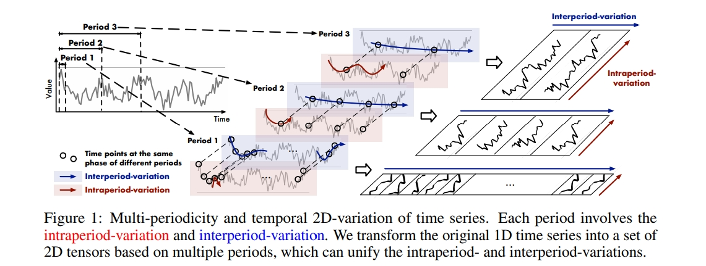
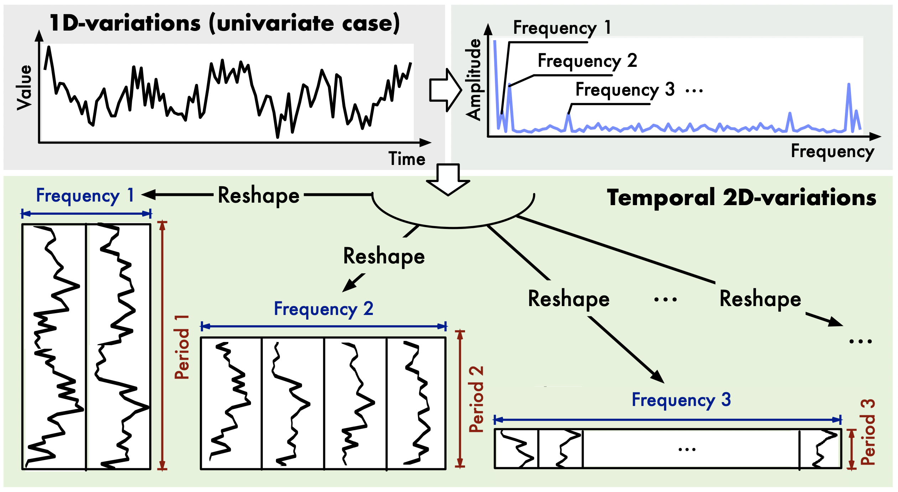
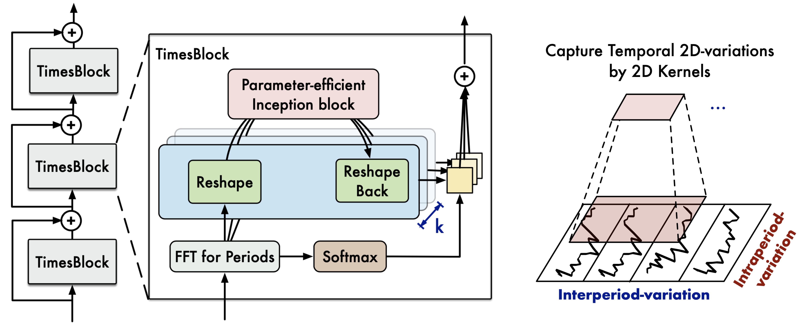
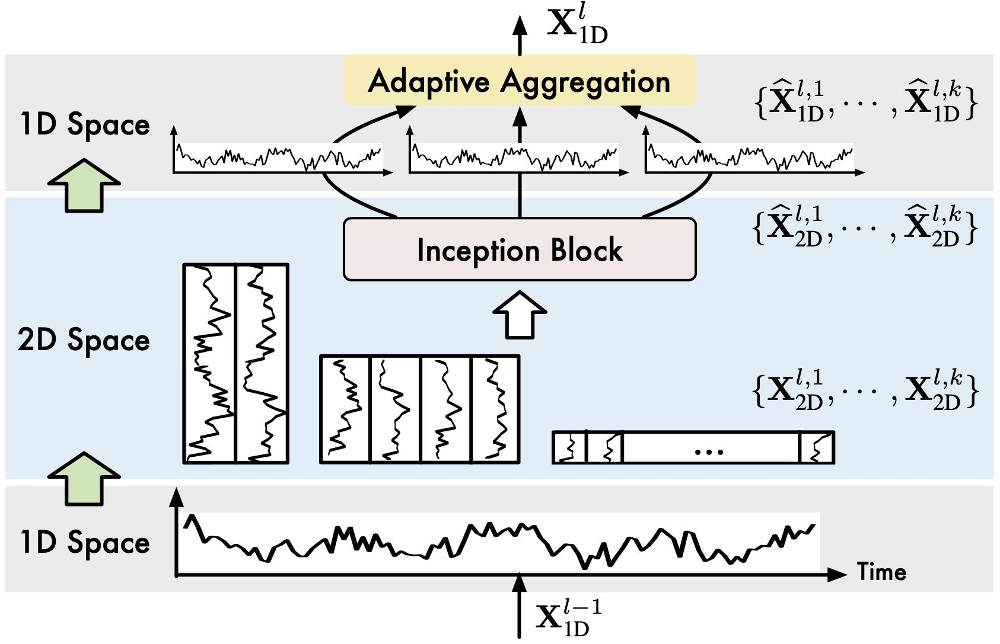

目录

- [论文信息](#论文信息)
- [背景介绍](#背景介绍)
- [设计思路](#设计思路)
- [TimeNet](#timenet)
  - [时序变化: 从一维至二维](#时序变化-从一维至二维)
  - [TimesBlock](#timesblock)
- [总结](#总结)
- [参考](#参考)

# 论文信息

* 论文名称：TimesNet: Temporal 2D-Variation Modeling for General Time Series Analysis
* 论文地址：[https://openreview.net/pdf?id=ju_Uqw384Oq](https://openreview.net/pdf?id=ju_Uqw384Oq)
* 论文代码：[https://github.com/thuml/Time-Series-Library](https://github.com/thuml/Time-Series-Library)

# 背景介绍

不同于自然语言、视频等序列数据，时间序列中单个时刻仅保存了一些标量，
其关键信息更多地被蕴含在时序变化（Temporal Variation）中。
因此，建模时序变化是各类时序分析任务共同的核心问题。

本文即围绕时序变化建模展开，设计提出了时序基础模型 TimesNet，
在长时、短时预测、缺失值填补、异常检测、分类五大任务上实现了全面领先。

# 设计思路

近年来，深度模型被广泛用于时序分析任务中，例如循环神经网络（RNN）、
时序卷积网络（TCN）和变换器网络（Transformer）。
然而，前两类方法主要关注捕捉临近时刻之间的变化，在长期依赖上建模能力不足。
Transformer 虽然在建模长期依赖上具有天然优势，但是由于现实世界的时序变化极其复杂，
仅仅依靠离散时间点之间的注意力（Attention）难以挖掘出可靠的时序依赖。

为此，本文从一个全新的 **多周期(multi-periodicity)** 视角分析时序变化，
如上图所示，我们观察到：

* 现实世界的时序数据往往是多种过程叠加，如交通数据的日变化和周变化，天气数据的日变化和年变化等。
  这种内在的多周期属性使得时序变化极其复杂。
* 对于某一特定周期过程，其内部每个时间点的时序变化不仅仅与临近时刻有关，也与邻近周期高度相关，
  即呈现 **周期内(Intraperiod-)** 与 **周期间(Interperiod-)** 两种时序变化。
  其中周期内变化对应着一个周期内的短期过程，周期间变化则可以反应连续周期间的长期趋势。

> 注：如果数据没有明显的周期性，则时序变化被周期内变化主导，等价于周期长度无穷大的情况。

基于上述观察，多周期属性自然地启发了一个模块化（Modular）的设计思路，
即一个模块捕捉由某一特定周期主导的时序变化。
这种模块化的设计思路可以将复杂的时间变化分解开，
从而有利于后续建模。但是，受限于时间序列的固有的一维结构，
原始序列难以同时表现出周期内与周期间两种不同的时序变化。

本文创新性地**将一维时序数据扩展至二维空间**进行分析。
如上图所示，将一维时间序列基于多个周期进行折叠，可以得到多个二维张量（2D tensors），
每个二维张量的列和行分别反应了周期内与周期间的时序变化，
即得到了**二维时序变化（Temporal 2D-variations）**。

# TimeNet

本文提出了 TimesNet 模型，通过模块化结构将复杂时序变化分解至不同周期，
并通过将原始一维时间序列转化至二维空间实现了**周期内与周期间变化的统一建模**。

## 时序变化: 从一维至二维

为了统一表示周期内与周期间的时序变化，首先需要发掘**时间序列的周期性**。

对于一个时间长度为 `$T$`，通道维度为 `$C$` 的一维时间序列 `$\mathbf{X}_{1D} \in \mathbb{R}^{T\times C}$`，
其周期性可以由时间维度的快速傅里叶变换(FFT)计算得到，即：

`$$\mathbf{A}=Avg(Amp(FFT(\mathbf{X}_{1D})))$$`
`$$f_{1},\cdots,f_{k}=\underset{f_{*}\in\{1,\cdots,\big[\frac{T}{2}\big]\}}{arg} \text{ }Topk(\mathbf{A})$$`
`$$p_{1},\cdots,p_{k}=\Bigg[\frac{T}{f_{1}}\Bigg],\cdots,\Bigg[\frac{T}{f_{k}}\Bigg]$$`

其中 `$\mathbf{A}\in \mathbb{R}^{T}$` 代表了 `$\mathbf{X}_{1D}$` 中每个频率分量的强度，强度最大的 `$k$` 个频率 `$\{f_{1},\cdots,f_{k}\}$` 对应着最显著的 `$k$` 个周期长度 `$\{p_{1},\cdots,p_{k}\}$`。

上述过程简记为：

`$$\mathbf{A},\{f_{1},\cdots,f_{k}\}\{p_{1},\cdots,p_{k}\}=Period(\mathbf{X}_{1D})$$`

接下来，如上图所示，可以基于选定的周期对原始的一维时间序列 `$\mathbf{X}_{1D}$` 进行折叠，
该过程可以形式化为：

`$$\mathbf{X}_{2D}^{i}=Reshape_{p_{i},f_{i}}(Padding(\mathbf{X}_{1D})), i\in \{1,\cdots,k\}$$`

其中 `$Padding(\cdot)$` 为在序列末尾补 `$0$`，使得序列长度可以被 `$p_{i}$` 整除。

通过上述操作，得到了一组二维张量 `$\{\mathbf{X}_{2D}^{1},\mathbf{X}_{2D}^{2},\cdot,\mathbf{X}_{2D}^{k}\}$`，
`$\mathbf{X}_{2D}^{i}$` 对应着由周期 `$p_{i}$` 主导的二维时序变化。

对于上述二维向量，其每列与每行分别对应着相邻的时刻与相邻的周期，
而临近的时刻与周期往往蕴含着相似的时序变化。
因此，上述二维张量会表现出 **二维局部性（2D locality）**，
从而可以很容易通过 2D 卷积捕捉信息。

## TimesBlock

如上图所示，TimesNet 由堆叠的 TimesBlock 组成。
输入序列首先经过**嵌入层**得到深度特征 `$\mathbf{X}_{1D}^{0}\in\mathbb{R}^{T\times d_{model}}$`。
对于第 `$l$` 层 TimesBlock，其输入为 `$\mathbf{X}_{1D}^{l-1}\in \mathbb{R}^{T\times d_{model}}$`，
之后通过 2D 卷积提取二维时序变化：

`$$\mathbf{X}_{1D}^{l}=TimesBlock(\mathbf{X}_{1D}^{l-1})+\mathbf{X}_{1D}^{l-1}$$`

具体地，如下图所示，TimesBlock 包含以下子过程：

1. **一维变换至二维**：首先对输入的一维时序特征 `$\mathbf{X}_{1D}^{l-1}$` 提取周期，
   并将之转换成二维张量来表示二维时序变化，即在上一节中所描述的过程：

   `$$\mathbf{A}^{l-1},\{f_{1},\cdots,f_{k}\}\{p_{1},\cdots,p_{k}\}=Period(\mathbf{X}_{1D}^{l-1})$$`
   `$$\mathbf{X}_{2D}^{l,i}=Reshape_{p_{i},f_{i}}(Padding(\mathbf{X}_{1D}^{l-1})), i\in \{1,\cdots,k\}$$`

2. **提取二维时序变化特征**：
   对于二维张量 `$\{\mathbf{X}_{2D}^{l,1},\cdots,\mathbf{X}_{2D}^{l,k}\}$`，
   由于其具有二维局部性，因此可以使用 2D 卷积提取信息。在这里选取了经典的 Inception 模型，即：

   `$\hat{\mathbf{X}}_{2D}^{l,i}=Inception(\mathbf{X}_{2D}^{l,i})$`

3. **二维变换至一维**：对于提取的时序特征，将其转化回一维空间以便进行信息聚合：

    `$$\hat{\mathbf{X}}_{1D}^{l,i}=Trunc(Reshape_{1,(p_{i}\times f_{i})}(\hat{\mathbf{X}}_{2D}^{l,i})),i\in\{1,\cdots,k\}$$`

    其中 `$\hat{\mathbf{X}}_{1D}^{l,i}\in \mathbb{R}^{T\times d_{model}}$`，
    `$Trunc(\cdot)$` 表示将步骤 1 中的 `$Padding(\cdot)$` 操作补充的 `$0$` 去除。

4. **自适应融合**：类似 Autoformer 中的设计，
   将得到的一维表征 `$\{\hat{\mathbf{X}}^{l,1},\cdots,\hat{\mathbf{X}}^{l,k}\}$` 以其对应频率的强度进行加权求和，得到最终输出。

   `$$\hat{\mathbf{A}}_{f_{1}}^{l-1},\cdots,\hat{\mathbf{A}}_{f_{k}}^{l-1}=Softmax(\mathbf{A}_{f_{1}}^{l-1},\cdots,\mathbf{A}_{f_{k}}^{l-1})$$`
   `$$\mathbf{X}_{1D}^{l}=\sum_{i=1}^{k}\hat{\mathbf{A}}_{f_{i}}^{l-1}\times\hat{\mathbf{X}}_{1D}^{l,i}$$`

通过上述设计，TimesNet 完成了“多个周期分别提取二维时序变化，再进行自适应融合”的时序变化建模过程。
注意，由于 TimesNet 将一维时序特征转换为二维张量进行分析，因此可以直接采用先进的视觉骨干网络进行特征提取，
例如 Swin Transformer、ResNeXt、ConvNeXt等。这种设计也使得时序分析任务可以直接受益于蓬勃发展的视觉骨干网络。

# 总结

围绕时序变化建模这一关键问题，本文创新地将一维时间序列转化至二维空间进行分析，
并进一步提出了任务通用的时序基础模型——TimesNet，
在长时、短时预测、缺失值填补、异常检测、分类五大主流时序分析任务上实现了全面领先。

同时，得益于在 2D 空间中分析时序变化的设计，
TimesNet 使得时序分析任务可以直接受益于蓬勃发展的视觉骨干网络，
对于后续深度时序模型研究具有良好的启发意义。

# 参考

* [知乎介绍](https://zhuanlan.zhihu.com/p/606575441)
* [Paper](https://openreview.net/pdf?id=ju_Uqw384Oq)
