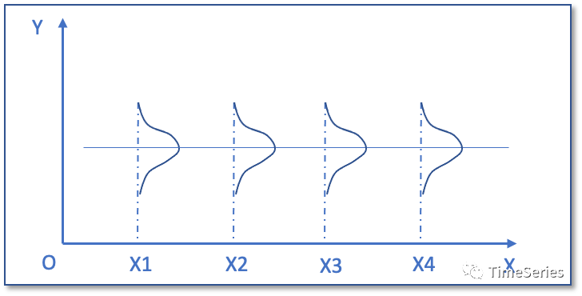

<style>
details {
    border: 1px solid #aaa;
    border-radius: 4px;
    padding: .5em .5em 0;
}
summary {
    font-weight: bold;
    margin: -.5em -.5em 0;
    padding: .5em;
}
details[open] {
    padding: .5em;
}
details[open] summary {
    border-bottom: 1px solid #aaa;
    margin-bottom: .5em;
}
</style>

<details><summary>目录</summary><p>

- [时间序列介绍](#时间序列介绍)
  - [时间序列的定义](#时间序列的定义)
  - [时间序列的研究领域](#时间序列的研究领域)
  - [时间序列的类型](#时间序列的类型)
- [时间序列的预处理](#时间序列的预处理)
  - [异常值检测和处理](#异常值检测和处理)
  - [缺失值检测和处理](#缺失值检测和处理)
  - [时间序列平滑](#时间序列平滑)
  - [数据采样](#数据采样)
  - [对时间序列数据建立机器学习模型的数据处理方法](#对时间序列数据建立机器学习模型的数据处理方法)
  - [时间序列降噪](#时间序列降噪)
    - [移动平均](#移动平均)
    - [傅里叶变换](#傅里叶变换)
  - [小波分析](#小波分析)
  - [滤波](#滤波)
- [时间序列数据观察](#时间序列数据观察)
  - [X 轴和 Y 轴](#x-轴和-y-轴)
  - [起点和终点](#起点和终点)
  - [极值](#极值)
  - [转折点](#转折点)
  - [周期性](#周期性)
  - [波动性](#波动性)
  - [数据与参考线对比](#数据与参考线对比)
- [一些经验与思考](#一些经验与思考)
- [面试题目](#面试题目)
- [时间序列分析-baseline](#时间序列分析-baseline)
  - [baseline 特点](#baseline-特点)
  - [baseline 数据](#baseline-数据)
    - [数据读取](#数据读取)
    - [数据查看](#数据查看)
  - [baseline 模型](#baseline-模型)
    - [数据转换](#数据转换)
    - [建立训练集和测试集](#建立训练集和测试集)
    - [算法](#算法)
    - [预测并评估预测结果](#预测并评估预测结果)
    - [预测结果可视化](#预测结果可视化)
- [参考资料](#参考资料)
</p></details><p></p>

# 时间序列介绍

## 时间序列的定义

时间序列(Time Series, TS) 是一组按照时间发生先后顺序进行排列的数据点序列. 
通常一组时间序列的时间间隔为一恒定值(如 1s, 5s, 1min, 1h, 1d 等). 
因此时间序列亦可作为离散时间数据进行分析处理

按照时间的顺序把随机事件变化发展的过程记录下来就构成了一个时间序列。
在统计研究中，常用按时间顺序排列的一组随机变量 `$\{\ldots, X_{1}, X_{2}, \ldots, X_{t}, \ldots\}$` 来表示一个随机事件的序列，
间记为 `$\{X_{t}, t \in T\}$`。用 `$\{x_{1}, x_{2}, \ldots, x_{N}\}$` 或 `$\{x_{t}, t = 1, 2, \ldots, N\}$` 表示该随机序列的 `$N$` 个有序观测值

经常认为这些观测值序列是来自一个时间序列随机过程的有限样本，
这个过程从无限远的过去开始并将持续到不确定的未来：


时间序列的每个元素都被认为是一个具有概率分布的随机变量，
这里 `$x_{1}$` 可以认为是一个随机变量的一个取值，
`$x_{2}$` 等也均是具有某种分布的随机变量的一个取值(每个变量的分布可能相同也可能不同)

比如我们这里有一个时间序列数据 `$\{1, 3, 5, 7, 2, 6, 9\}$`，更准确的叫法应该是一个观测值序列。
虽说这里 `$t_{t}$` 时刻只有一个取值 `$1$`，`$t_{2}$` 时刻也只有一个取值 `$3$`，
但我们不防认为 `$t_{1}$` 时刻对应的是一个变量 `$X_{1}$`，`$t_{2}$` 时刻对应的也是一个变量 `$X_{2}$`，
变量 `$X_{1}, X_{2}$` 可能有多个取值的同时也有它们自己的概率分布，
只是在这一次的观测中分别取值 `$1$` 和 `$3$` 而已


假如序列中每个元素的分布具有共同的参数，比如每个 `$x_{t}$` 的方差相同，
并且每对相邻元素 `$Cov(x_{t}, x_{t-1})$` 之间的协方差也相同。
如果对于任意 `$t \in [1, N]$`，`$x_{t}$` 的分布都相同，
则认为序列是平稳的



## 时间序列的研究领域

* 时间序列异常检测(timeseries anomaly detection)
    - 从时间序列中识别异常的事件或行为
    - 异常检测算法目前广泛应用于众多领域中, 例如量化交易, 网络入侵检测、智能运维等
* 时间序列预测(timeseries forcasting)

## 时间序列的类型

在实际场景中, 不同的业务通常会对应不同类型的时间序列模式, 
一般可以划分为几种类型: 趋势性、周期性、随机性、综合性

下图中展示了几种常见的时间序列的类型: 


* smooth(stationary) 
* multi model
* irregular sampling
* sparse
* discrete
* step


# 时间序列的预处理

## 异常值检测和处理

[介绍](../2022-04-25-timeseries-detection-cyclical)

## 缺失值检测和处理

最常用的处理缺失值的方法包括填补(imputation) 和删除(deletion)两种

常见的数据填补(imputation)方法:

* forward fill 和 backward fill
    - 根据缺失值前/后的最近时间点数据填补当前缺失值
* moving average
* interpolation
    - 插值方法要求数据和邻近点之间满足某种拟合关系, 
      因此插值法是一种先验方法且需要代入一些业务经验

## 时间序列平滑

数据平滑通常是为了消除一些极端值或测试误差. 即使有些极端值本身是真实的, 
但是并没有反映出潜在的数据模式, 仍需处理

常用的数据平滑方法如下:

* 移动平均(weighted averaging, moving average)
    - 既可以给定时间窗口内样本点相同权重, 或邻近点指定更高权重
* 指数平滑(exponential smoothing)
    - 所有的指数平滑法都要更新上一时间步长的计算结果, 
      并使用当前时间步长的数据中包含的新信息. 通过"混合"新信息和旧信息来实现, 
      而相关的新旧信息的权重由一个可调整的参数来控制
    - 一次指数平滑(exponential smoothing)
        - 从最邻近到最早的数据点的权重呈现指数型下降的规律, 针对没有趋势和季节性的序列
    - 二次指数平滑(Holt exponential smoothing)
        - 通过引入一个额外的系数来解决指数平滑无法应用于具有趋势性数据的问题, 针对有趋势但没有季节性的序列
    - 三次指数平滑(Holt-Winters exponential smoothing)
        - 通过再次引入一个新系数的方式同时解决了二次平滑无法解决具有季节性变化数据的不足
* 差分运算
* 时间序列分解
* 日历调增
* 数学变换

## 数据采样

通常来自不同数据源的时间轴常常无法一一对应, 此时就要用到改变时间频率的方法进行数据处理. 
由于无法改变实际测量数据的频率, 我们能做的是改变数据收集的频率
    
- 上采样(up sampling): 在某种程度上是凭空获得更高频率数据的方式, 不增加额外的信息
- 下采样(down sampling): 减少数据收集的频率, 也就是从原始数据中抽取子集的方式

## 对时间序列数据建立机器学习模型的数据处理方法

- 特征构建
    - 基本日期时间特征
    - Lagging 特征
    - Window 特征
- 交叉验证数据分割
    - Train-Test split
    - Multiple Train-Test split
    - Walk-Forward Validation

## 时间序列降噪

### 移动平均

滚动平均值是先前观察窗口的平均值，其中窗口是来自时间序列数据的一系列值。
为每个有序窗口计算平均值。这可以极大地帮助最小化时间序列数据中的噪声

### 傅里叶变换

傅里叶变换可以通过将时间序列数据转换到频域去除噪声，可以过滤掉噪声频率，
然后应用傅里叶变换得到滤波后的时间序列

## 小波分析

## 滤波

# 时间序列数据观察

## X 轴和 Y 轴

任何图表观察都要从图表元素开始，时间序列图也不会例外

通过观察两个坐标轴，能知道

* 数据的时间范围有多长
* 数据颗粒度有多细(小时、天、周、月等)
* 指标的大小如何(最大值、最小值、单位等)

但也别忘了其他图表元素

## 起点和终点

观察时间序列的起点和终点，在不观察细节的情况下，就能大体知道总体趋势是怎么走的

比如：如果起点与终点数值差不多，那么我们知道，不管中间指标变化多么波澜壮阔，
至少一头一尾说明忙活了很长时间后指标是在原地踏步

## 极值

极值就是序列中比较大的值和比较小的值，当然包括最大值和最小值。
极值的观察是确定数据阶段的重要依据

## 转折点

转折点往往有两类:

* 一类是绝对数值的转折点，一般就是指最大值和最小值
* 另一类是波动信息的转折点。例如:
    - 在该点前后的波动幅度差别显著
    - 在该点前后波动周期有差别
    - 在该点前后数据的正负值出现变化等

## 周期性

需要观察数据的涨跌是不是有规律可循。在实际业务中，很多数据是会有周期性的，尤其是周末和周中，会有明显的不同。
这种不同有时出现在数值的高低上(打车数一般周一早上和周五晚较高，周末较低)，
有时出现在数据的结构上(外卖订单数量在工作日和周末差别不大，但在送达地点和送达时间上差别巨大)

## 波动性

在某些阶段，数值波动剧烈；某些阶段则平稳。这也是在观察中需要注意的信息。
从统计学的角度分析，方差大的阶段，往往涵盖的信息较多，需要更加关注

## 数据与参考线对比

参考线有许多，例如均值线、均值加减标准差线、KPI目标线、移动平均线等。
每种参考线都有分析意义，但需要注意顺序，建议先对比均值线，然后是移动平均线，
之后才是各种自定义的参考线


# 一些经验与思考

1. 训练测试数据的划分
    - 和其他机器学习场景不同, 时间序列预测的数据是带有前后顺序的序列数据, 因此在做训练测试数据的划分时, 
      要注意不能泄露测试数据给模型, 因此在做训练测试数据划分时, 需要让测试数据全都在训练数据的时间戳之后. 
2. 一线业务人员经验的使用
    - 在做一些时间序列预测场景时, 我们发现一线业务人员经验是极其宝贵的, 比如说一些抚平/剔除业务异常数据的经验, 
      他们会知道在历史数据里哪些时间段的数据是异常的原因是什么, 比如各种事件会对不同的业务线产生什么样的影响、
      一些预测偏差较大的原因可能是什么. 这些宝贵的经验可以转化成时间序列历史数据清洗的规则,
      或者是一些时间序列数据校准的 Knowledge Base. 
3. 利用能反映未来的信息
    - 当我们在做时间序列预测时, 本质我们是在利用历史数据来预测未来, 那么如果我们能够拿到更多关于未来的信息, 
      则可以帮助我们预测的更准. 什么是关于未来的信息呢？比如说: 用户的预订信息, 用户的浏览数据, 
      这些数据能够侧面反映用户对于未来某天的兴趣值, 从而帮助我们窥探未来. 
4. 如何保证输出结果的稳定性
    - 在使用黑盒模型时, 我们会发现有时模型输出会存在一些异常点, 这可能是由于历史数据中存在一些没有被剔除的噪音, 
      因此我们需要构建多种可解释性强的预测尺度范围, 来校准最后的输出结果, 从而提高模型输出的稳定性, 
      生产中这样的校准有时也可以提高一定的准确率. 
5. 重新训练模型的频率
    - 通常, 当有新数据获得时, 重新训练模型来进行预测, 整体来说在每个时间戳能给出更好的预测结果. 
      如果生产上准备采取这种思路的话, 在训练的时候也要用相同的重新训练的方法, 来评估哪种模型效果最好, 
      即采用sliding window / expanding window 的方法去在每个时间戳重新训练预测和记录误差来进行模型评估. 
      当然这样计算量会比较大, 比较适合单一产线并且对准确率较为看中的场景. 
6. 如何评估模型的好坏
    - 对于不同的项目, 评判时序预测模型好坏的标准是不同的, 整体来说, 要针对不同的项目场景, 
      综合模型准确率、可维护性、可解释性、稳定性等多方面去评估一个预测模型或者一个预测框架的合理性和实用性. 
7. 历史数据该相信多少
    - 事物是不断发展变化的, 比如随着智能客服智能化程度的提高, 需要人工客服处理的订单会逐渐变少, 
      因此人工客服相关的时间序列数据的性质会处于不断变化之中, 那么我们对于越久远的历史数据的信任度应该是要逐渐下降的. 
      处理的方法是一方面我们可以通过分析来判断训练应该取多久内的时间序列数据, 
      另一方面我们在训练时可以赋予越近的数据更高的权重. 

# 面试题目

* 预处理时间序列数据的方法有哪些，与标准插补方法有何不同？
* 时间序列窗口是什么意思？
* 你听说过孤立森林吗？如果是，那么你能解释一下它是如何工作的吗？
* 什么是傅立叶变换，我们为什么需要它？
* 填充时间序列数据中缺失值的不同方法是什么？


# 时间序列分析-baseline

## baseline 特点

* Simple: A method that requires little or no training or intelligence.
* Fast: A method that is fast to implement and computationally trivial to make a prediction.
* Repeatable: A method that is deterministic, 
  meaning that it produces an expected output given the same input.

## baseline 数据

```python
import pandas as pd 
import matplotlib.pyplot as plt
```

### 数据读取

```python
series = pd.read_csv(
    "https://raw.githubusercontent.com/jbrownlee/Datasets/master/shampoo.csv",
    header = 0,
    parse_dates = [0],
    index_col = 0,
    squeeze = True,
    date_parser = lambda dates: pd.datetime.strptime("190" + dates, "%Y-%m")
)
```

### 数据查看

```python
print(series.head())
```

```
Month
1901-01-01    266.0
1901-02-01    145.9
1901-03-01    183.1
1901-04-01    119.3
1901-05-01    180.3
Name: Sales, dtype: float64
```

```python
series.plot()
plt.show()
```


## baseline 模型

* 将单变量时间序列数据转换为监督学习问题
* 建立训练集和测试集
* 定义持久化模型
* 进行预测并建立 baseline 性能
* 查看完整的示例并绘制输出

### 数据转换

```python
# Create lagged dataset
values = pd.DataFrame(series.values)
df = pd.concat([values.shift(1), values], axis = 1)
df.columns = ["t-1", "t+1"]
print(df.head())
```

### 建立训练集和测试集

```python
# split into train and test sets
X = df.values
train_size = int(len(X) * 0.66)
train, test = X[1:train_size], X[train_size:]
train_X, train_y = train[:, 0], train[:, 1]
test_X, test_y = test[:, 0], test[:, 1]
```

### 算法

```python
# persistence model
def model_persistence(x):
    return x
```

### 预测并评估预测结果

```python
from sklearn.metrics import mean_squared_error

# walk-forward validation
predictions = list()
for x in test_X:
    yhat = model_persistence(x)
    predictions.append(yhat)
test_score = mean_squared_error(test_y, predictions)
print("Test MSE: %.3f" % test_score)
```

### 预测结果可视化

```python
# plot predictions and expected results
plt.plot(train_y)
plt.plot([None for i in train_y] + [x for x in test_y])
plt.plot([None for i in train_y] + [x for x in predictions])
plt.show()
```


# 参考资料

- [R package forecast](https://cran.r-project.org/web/packages/forecast/)
- [从数据中提取季节性和趋势](https://anomaly.io/seasonal-trend-decomposition-in-r/index.html)
- [正态分布异常值检测](https://anomaly.io/anomaly-detection-normal-distribution/index.html)
- [季节性地调整时间序列](https://anomaly.io/seasonally-adjustement-in-r/index.html)
- [检测相关时间序列中的异常](https://anomaly.io/detect-anomalies-in-correlated-time-series/index.html)
- [用移动中位数分解检测异常](https://anomaly.io/anomaly-detection-moving-median-decomposition/index.html)

