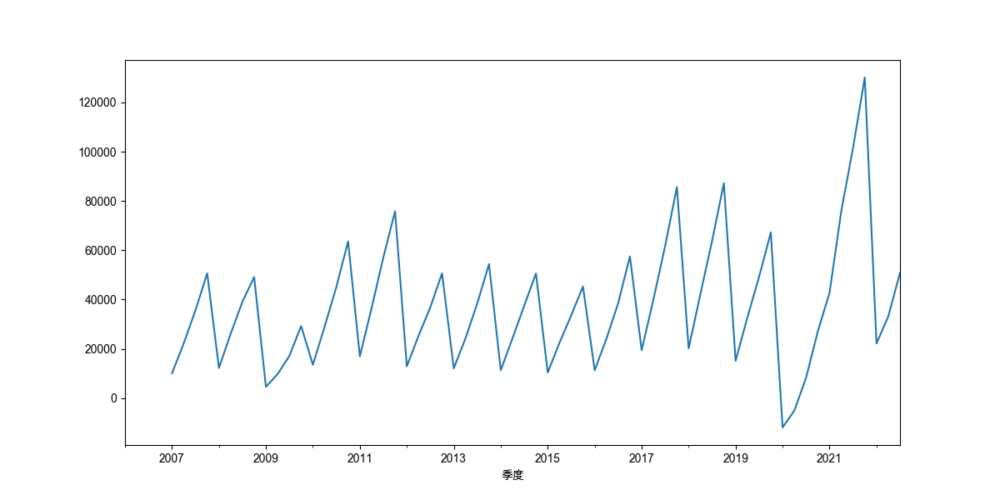

<style>
details {
    border: 1px solid #aaa;
    border-radius: 4px;
    padding: .5em .5em 0;
}
summary {
    font-weight: bold;
    margin: -.5em -.5em 0;
    padding: .5em;
}
details[open] {
    padding: .5em;
}
details[open] summary {
    border-bottom: 1px solid #aaa;
    margin-bottom: .5em;
}
</style>

<details><summary>目录</summary><p>

- [时间序列介绍](#时间序列介绍)
  - [时间序列的定义](#时间序列的定义)
  - [时间序列的研究领域](#时间序列的研究领域)
  - [时间序列的类型](#时间序列的类型)
- [时间序列平稳性](#时间序列平稳性)
  - [时间序列平稳性](#时间序列平稳性-1)
    - [严平稳](#严平稳)
    - [宽平稳](#宽平稳)
    - [严平稳与宽平稳的关系](#严平稳与宽平稳的关系)
  - [平稳时间序列](#平稳时间序列)
    - [白噪声](#白噪声)
    - [非白噪声](#非白噪声)
  - [非平稳时间序列](#非平稳时间序列)
  - [时间序列平稳性检验](#时间序列平稳性检验)
  - [时间序列平稳性转换](#时间序列平稳性转换)
- [时间序列数据观察](#时间序列数据观察)
  - [X 轴和 Y 轴](#x-轴和-y-轴)
  - [起点和终点](#起点和终点)
  - [极值](#极值)
  - [转折点](#转折点)
  - [周期性](#周期性)
  - [波动性](#波动性)
  - [数据与参考线对比](#数据与参考线对比)
- [时间序列分析-baseline](#时间序列分析-baseline)
  - [baseline 特点](#baseline-特点)
  - [baseline 数据](#baseline-数据)
    - [数据读取](#数据读取)
    - [数据查看](#数据查看)
  - [baseline 模型](#baseline-模型)
    - [数据转换](#数据转换)
    - [建立训练集和测试集](#建立训练集和测试集)
    - [算法](#算法)
    - [预测并评估预测结果](#预测并评估预测结果)
    - [预测结果可视化](#预测结果可视化)
- [参考资料](#参考资料)
</p></details><p></p>

# 时间序列介绍

## 时间序列的定义

时间序列(Time Series) 是一组按照时间发生先后顺序进行排列的数据点序列. 
通常一组时间序列的时间间隔为一恒定值(如 1s, 5s, 1min, 1h, 1d 等). 
因此时间序列亦可作为离散时间数据进行分析处理

按照时间的顺序把随机事件变化发展的过程记录下来就构成了一个时间序列。
在统计研究中，常用按时间顺序排列的一组随机变量 `$\{\ldots, X_{1}, X_{2}, \ldots, X_{t}, \ldots\}$` 来表示一个随机事件的序列，
间记为 `$\{X_{t}, t \in T\}$`。
用 `$\{x_{1}, x_{2}, \ldots, x_{N}\}$` 或 `$\{x_{t}, t = 1, 2, \ldots, N\}$` 表示该随机序列的 `$N$` 个有序观测值。
经常认为这些观测值序列是来自一个时间序列随机过程的有限样本，这个过程从无限远的过去开始并将持续到不确定的未来：


时间序列的每个元素都被认为是一个具有概率分布的随机变量，
这里 `$x_{1}$` 可以认为是一个随机变量的一个取值，
`$x_{2}$` 等也均是具有某种分布的随机变量的一个取值(每个变量的分布可能相同也可能不同)

比如这里有一个时间序列数据 `$\{1, 3, 5, 7, 2, 6, 9\}$`，更准确的叫法应该是一个观测值序列。
虽说这里 `$t_{t}$` 时刻只有一个取值 `$1$`，`$t_{2}$` 时刻也只有一个取值 `$3$`，
但不防认为 `$t_{1}$` 时刻对应的是一个变量 `$X_{1}$`，`$t_{2}$` 时刻对应的也是一个变量 `$X_{2}$`，
变量 `$X_{1}, X_{2}$` 可能有多个取值的同时也有它们自己的概率分布，
只是在这一次的观测中分别取值 `$1$` 和 `$3$` 而已


假如序列中每个元素的分布具有共同的参数，比如每个 `$x_{t}$` 的方差 `$Var(x_{t})$` 相同，
并且每对相邻元素之间的协方差 `$Cov(x_{t}, x_{t-1})$` 也相同。
如果对于任意 `$t \in [1, N]$`，`$x_{t}$` 的分布都相同，
则认为序列是平稳的


## 时间序列的研究领域

* 时间序列异常检测(timeseries anomaly detection)
    - 从时间序列中识别异常的事件或行为
    - 异常检测算法目前广泛应用于众多领域中, 例如量化交易, 网络入侵检测、智能运维等
* 时间序列预测(timeseries forcasting)
* 时间序列分类(timeseries classification)
* 时间序列聚类(timeseries clustering)

## 时间序列的类型

在实际场景中, 不同的业务通常会对应不同类型的时间序列模式, 
一般可以划分为几种类型: 趋势性、周期性、随机性、综合性

下图中展示了几种常见的时间序列的类型: 


# 时间序列平稳性

> 时间序列分析中的许多方法，如 ARMA、ARIMA、Granger 因果检验等时序预测和分析方法，
> 都需要时间序列具备平稳性。那么什么是时间序列的平稳性呢？
> 什么序列是平稳时间序列，什么序列又是非平稳时间序列？

## 时间序列平稳性

时间序列的平稳性是指在一组时间数据看起来平坦，
各阶统计特性，如：均值、方差、协方差等不随时间时间的变化而变化。
其数学定义又分为严平稳和宽平稳

### 严平稳

给定随机过程 `$X(t), t \in T$`，如果对任意 `$n \geq 1$`，
`$t_{1}, t_{2}, \ldots, t_{n} \in T$` 和实数 `$\tau$`，
当 `$t_{1+\tau}, t_{2+\tau}, \ldots, t_{n+\tau}$` 时，
随机变量 `$(X(t_{1}), X(t_{2}), \ldots, X(t_{n}))$` 与 
`$(X(t_{1+\tau}), X(t_{2+\tau}), \ldots, X(t_{n+\tau}))$` 有相同的联合分布函数。
即 

`$$F_{t_{1}, t_{2}, \ldots, t_{n}}(x_{1}, x_{2}, \ldots, x_{m})=F_{t_{1+\tau}, t_{2+\tau}, \ldots, t_{n+\tau}}(x_{1}, x_{2}, \ldots, x_{m})$$`

则称随机过程 `$X_{t}, t \in T$` 是严平稳过程

简单点来说严平稳是一种条件比较苛刻的平稳性定义，
它认为只有当序列所有的统计性质都不会随着时间的推移而发生变化时，该序列才能被认为平稳

### 宽平稳

假定某个时间序列是由某一随机过程生成的，如果满足下列条件：

1. 均值 `$E(X_{t}) = \mu$` 是与时间 `$t$` 无关的常数
2. 方差 `$Var(X_{t}) = \sigma^{2}$` 是与时间无关的常数
3. 协方差 `$Cov(X_{t}, X_{t+k}) = \gamma_{k}$` 是只与时间间隔 `$k$` 有关，与时间 `$t$` 无关的常数

则该时间序列是宽平稳的，该随机过程是平稳随机过程

平稳性的定义在不同文章中描述略有不同，但它们的意思都是一样的。
比如一些定义中会强调二阶矩存在，而当前的这个定义中没有强调，
原因在于均值、方差为常数既已表示一阶矩、二阶矩存在

宽平稳序列具有均值、方差和自相关结构不随时间变化的特性。
简单理解就是一个看起来平坦的序列，没有趋势，随时间变化的方差不变，
随时间变化的自相关结构不变，也没有定期波动（季节性）


### 严平稳与宽平稳的关系

严平稳比宽平稳的要求更严格，但两者并没有包含关系

* 通常情况下，低阶矩存在的严平稳能推出宽平稳成立，而宽平稳序列不能反推严平稳成立
* 即便严平稳也不一定宽平稳。不存在低阶矩的严平稳序列不满足宽平稳条件，
  例如服从柯西分布的严平稳序列就不是宽平稳序列（柯西分布的一阶矩、二阶矩都不存在）
* 当序列服从多元正态分布时，宽平稳可以推出严平稳。
  因为正态过程的概率密度是由均值函数和自相关函数完全确定的，
  宽平稳则均值函数和自相关函数不随时间的推移而变化，
  那么正态过程的概率密度函数也就不会随时间的推移而变化，
  所以说一个宽平稳的正态过程必定是严平稳的


> * 宽平稳，因其定义，又叫二阶平稳，或者协方差平稳
> * 平稳序列，一般是指宽平稳序列，也称弱平稳序列
> * 严平稳序列，也可以叫做强平稳序列

## 平稳时间序列

### 白噪声

一种最简单的平稳时间序列就是白噪声，白噪声时间序列是具有零均值、同方差的独立同分布序列，
记作 `$\{\varepsilon_{t}\}$`。当 `$\varepsilon_{t}$` 服从均值为 0 的正态分布时，
称 `$\{\varepsilon_{t}\}$` 为高斯白噪声或正态白噪声

对于任意 `$t \in T$`，`$X_{t}$` 均值相同、方差相同，独立则协方差为 0，所以白噪声序列是平稳的

```python
import numpy as np
import matplotlib.pyplot as plt

# 白噪声序列
white_noise = np.random.standard_normal(size = 1000)

# plot
plt.figure(figsize = (12, 6))
plt.plot(white_noise)
plt.show()
```


当一个序列为白噪声时，表示序列前后没有任何相关关系。过去的行为对将来的发展没有丝毫影响，
从统计分析的角度而言，已没有任何分析建模的价值。未来的趋势亦无法预测，
因为白噪声的取值是完全随机的。此时未来预测为均值就是残差最小的选择。
**只有当序列平稳且非白噪声时，应用 ARMA 等分析方法才有意义**

通常在对时间序列建模之后，还会对残差序列进行白噪声检验，
如果残差序列是白噪声，那么就说明原序列中所有有价值的信息已经被模型所提取，
如果非白噪声就要检查模型的合理性了


### 非白噪声

平稳时间序列可不止白噪声，生活中也会有平稳的时间序列，但却是很少。
很多序列是可以经过简单处理后变为平稳的非白噪声序列

```python
# 我国06年以来的季度GDP数据季节差分后，就可以认为是一个平稳的时间序列
import numpy as np
import pandas as pd
import akshare as ak
import matplotlib.pyplot as plt
import matplotlib as mpl

font_name = ["Arial Unicode MS"]
mpl.rcParams["font.sans-serif"] = font_name
mpl.rcParams["axes.unicode_minus"] = False


# data
df = ak.macro_china_gdp()
df = df.set_index("季度")
df.index = pd.to_datetime(df.index)
print(df.head())
print(df.shape)

# 原始数据
gdp = df["国内生产总值-绝对值"][::-1].astype("float")
print(gdp)
# 差分
gdp_diff = gdp.diff(4)
print(gdp_diff)

plt.figure(figsize = (12, 6))
gdp_diff.plot()
plt.show()

```



## 非平稳时间序列


## 时间序列平稳性检验

* Augmented DIckey Fuller Test(ADF test)
    - `$p>0$`, 过程不是平稳的
    - `$p=0$`, 过程是平稳的
* Kwiatkowski-Phillips-Schmidt-Shin Test(KPSS test)

## 时间序列平稳性转换

理想情况下,需要一个用于建模的固定时间序列. 当然, 不是所有的时间序列都是平稳的, 
但是可以通过做不同的变换使它们保持平稳

对于非平稳的时间序列, 可以通过 **差分**、**log 变换**、**平方根变换** 转化为平稳序列

# 时间序列数据观察

## X 轴和 Y 轴

任何图表观察都要从图表元素开始，时间序列图也不会例外

通过观察两个坐标轴，能知道

* 数据的时间范围有多长
* 数据颗粒度有多细(小时、天、周、月等)
* 指标的大小如何(最大值、最小值、单位等)

但也别忘了其他图表元素

## 起点和终点

观察时间序列的起点和终点，在不观察细节的情况下，就能大体知道总体趋势是怎么走的

比如：如果起点与终点数值差不多，那么知道，不管中间指标变化多么波澜壮阔，
至少一头一尾说明忙活了很长时间后指标是在原地踏步

## 极值

极值就是序列中比较大的值和比较小的值，当然包括最大值和最小值。
极值的观察是确定数据阶段的重要依据

## 转折点

转折点往往有两类:

* 一类是绝对数值的转折点，一般就是指最大值和最小值
* 另一类是波动信息的转折点。例如:
    - 在该点前后的波动幅度差别显著
    - 在该点前后波动周期有差别
    - 在该点前后数据的正负值出现变化等

## 周期性

需要观察数据的涨跌是不是有规律可循。在实际业务中，很多数据是会有周期性的，尤其是周末和周中，会有明显的不同。
这种不同有时出现在数值的高低上(打车数一般周一早上和周五晚较高，周末较低)，
有时出现在数据的结构上(外卖订单数量在工作日和周末差别不大，但在送达地点和送达时间上差别巨大)

## 波动性

在某些阶段，数值波动剧烈；某些阶段则平稳。这也是在观察中需要注意的信息。
从统计学的角度分析，方差大的阶段，往往涵盖的信息较多，需要更加关注

## 数据与参考线对比

参考线有许多，例如均值线、均值加减标准差线、KPI目标线、移动平均线等。
每种参考线都有分析意义，但需要注意顺序，建议先对比均值线，然后是移动平均线，
之后才是各种自定义的参考线

# 时间序列分析-baseline

## baseline 特点

* Simple: A method that requires little or no training or intelligence.
* Fast: A method that is fast to implement and computationally trivial to make a prediction.
* Repeatable: A method that is deterministic, 
  meaning that it produces an expected output given the same input.

## baseline 数据

```python
import pandas as pd 
import matplotlib.pyplot as plt
```

### 数据读取

```python
series = pd.read_csv(
    "https://raw.githubusercontent.com/jbrownlee/Datasets/master/shampoo.csv",
    header = 0,
    parse_dates = [0],
    index_col = 0,
    squeeze = True,
    date_parser = lambda dates: pd.datetime.strptime("190" + dates, "%Y-%m")
)
```

### 数据查看

```python
print(series.head())
```

```
Month
1901-01-01    266.0
1901-02-01    145.9
1901-03-01    183.1
1901-04-01    119.3
1901-05-01    180.3
Name: Sales, dtype: float64
```

```python
series.plot()
plt.show()
```


## baseline 模型

* 将单变量时间序列数据转换为监督学习问题
* 建立训练集和测试集
* 定义持久化模型
* 进行预测并建立 baseline 性能
* 查看完整的示例并绘制输出

### 数据转换

```python
# Create lagged dataset
values = pd.DataFrame(series.values)
df = pd.concat([values.shift(1), values], axis = 1)
df.columns = ["t-1", "t+1"]
print(df.head())
```

### 建立训练集和测试集

```python
# split into train and test sets
X = df.values
train_size = int(len(X) * 0.66)
train, test = X[1:train_size], X[train_size:]
train_X, train_y = train[:, 0], train[:, 1]
test_X, test_y = test[:, 0], test[:, 1]
```

### 算法

```python
# persistence model
def model_persistence(x):
    return x
```

### 预测并评估预测结果

```python
from sklearn.metrics import mean_squared_error

# walk-forward validation
predictions = list()
for x in test_X:
    yhat = model_persistence(x)
    predictions.append(yhat)
test_score = mean_squared_error(test_y, predictions)
print("Test MSE: %.3f" % test_score)
```

### 预测结果可视化

```python
# plot predictions and expected results
plt.plot(train_y)
plt.plot([None for i in train_y] + [x for x in test_y])
plt.plot([None for i in train_y] + [x for x in predictions])
plt.show()
```


# 参考资料

- [R package forecast](https://cran.r-project.org/web/packages/forecast/)
- [从数据中提取季节性和趋势](https://anomaly.io/seasonal-trend-decomposition-in-r/index.html)
- [正态分布异常值检测](https://anomaly.io/anomaly-detection-normal-distribution/index.html)
- [季节性地调整时间序列](https://anomaly.io/seasonally-adjustement-in-r/index.html)
- [检测相关时间序列中的异常](https://anomaly.io/detect-anomalies-in-correlated-time-series/index.html)
- [用移动中位数分解检测异常](https://anomaly.io/anomaly-detection-moving-median-decomposition/index.html)

