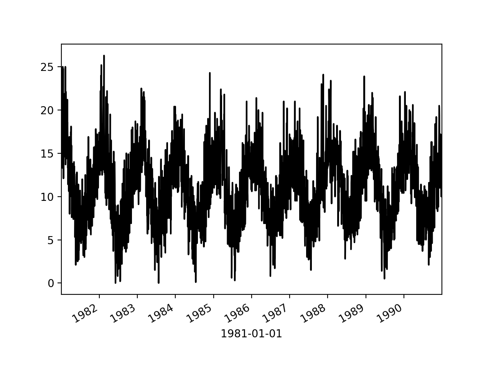
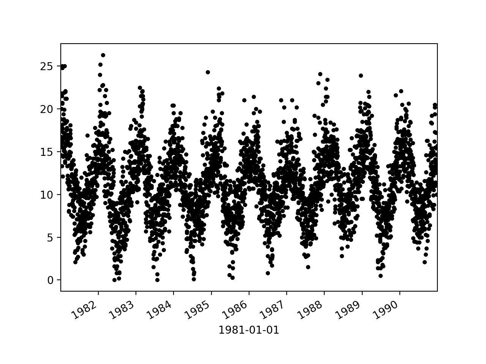
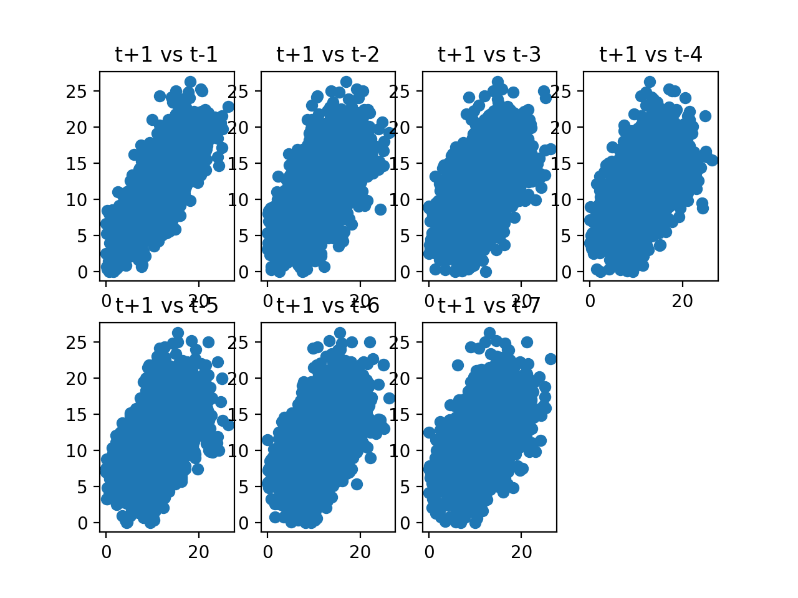

<style>
details {
    border: 1px solid #aaa;
    border-radius: 4px;
    padding: .5em .5em 0;
}
summary {
    font-weight: bold;
    margin: -.5em -.5em 0;
    padding: .5em;
}
details[open] {
    padding: .5em;
}
details[open] summary {
    border-bottom: 1px solid #aaa;
    margin-bottom: .5em;
}
</style>

<details><summary>目录</summary><p>

- [时间序列图形](#时间序列图形)
- [时间序列数据](#时间序列数据)
- [时间序列折线图(line plot)](#时间序列折线图line-plot)
- [时间序列直方图和密度图(line plot)](#时间序列直方图和密度图line-plot)
- [时间序列箱型图和晶须图](#时间序列箱型图和晶须图)
- [时间序列热图](#时间序列热图)
- [时间序列滞后散点图](#时间序列滞后散点图)
- [时间序列自相关图](#时间序列自相关图)
</p></details><p></p>

# 时间序列图形

* 时间序列的时间结构 
    - Line Plots
    - Lag Plots or Scatter Plots
    - Autocorrelation Plots
* 时间序列的分布
    - Histograms and Density Plots
* 时间序列间隔上分布
    - Box and Whisker Plots
    - Heat Maps

# 时间序列数据

- [澳大利亚墨尔本市10年(1981-1990年)内的最低每日温度](https://raw.githubusercontent.com/jbrownlee/Datasets/master/daily-min-temperatures.csv)

```python
import pandas as pd 
import matplotlib.pyplot as plt 

series = pd.read_csv(
    "https://raw.githubusercontent.com/jbrownlee/Datasets/master/daily-min-temperatures.csv",
    header = 0,
    index_col = 0,  # or "ts_col"
    parse_dates = True,  # or ["ts_col"]
    date_parser = lambda dates: pd.to_datetime(dates, format = '%Y-%m-%d'),
    squeeze = True,
)
print(series.head())
```

```
Date,Temp
1981-01-01,20.7
1981-01-02,17.9
1981-01-03,18.8
1981-01-04,14.6
1981-01-05,15.8
1981-01-06,15.8
```

# 时间序列折线图(line plot)

> * `$x$` 轴: timestamp
> * `$y$` 轴: timeseries

```python
series.plot()
plt.show()
```


 

```python
series.plot(style = "k-")
plt.show()
```


 
```python
series.plot(style = "k.")
plt.show()
```



```python
groups = series.groupby(pd.Grouper(freq = "A"))
years = pd.DataFrame()
for name, group in groups:
    years[name.year] = group.values

years.plot(subplots = True, legend = False)
plt.show()
```


# 时间序列直方图和密度图(line plot)

> * 时间序列值本身的分布, 没有时间顺序的值的图形

```python
series.hist()
# or 
series.plot(kind = "hist")
plt.show()
```


```python
series.plot(kind = "kde")
plt.show()
```


 
# 时间序列箱型图和晶须图

> * 在每个时间序列(例如年、月、天等)中对每个间隔进行比较

```python
groups = series.groupby(pd.Grouper(freq = "A"))
years = pd.DataFrame()
for name, group in groups:
    years[name.year] = group.values

years.boxplot()
plt.plot()
```


```python
one_year = series["1990"]
groups = one_year.groupby(pd.Grouper(freq = "M"))
months = pd.concat(
    [pd.DataFrame(x[1].values) for x in groups], 
    axis = 1
)
months = pd.DataFrame(months)
months.columns = range(1, 13)

months.boxplot()
plt.show()
```


# 时间序列热图

- 用较暖的颜色(黄色和红色)表示较大的值, 用较冷的颜色(蓝色和绿色)表示较小的值

```python
groups = series.groupby(pd.Grouper(freq = "A"))
years = pd.DataFrame()
for name, group in groups:
    years[name.year] = group.values
years = years.T

plt.matshow(years, interpolation = None, aspect = "auto")
plt.show()
```


 
```python
one_year = series["1990"]
groups = one_year.groupby(pd.Grouper(freq = "M"))
months = pd.concat(
    [pd.DataFrame(x[1].values) for x in groups], 
    axis = 1
)
months = pd.DataFrame(months)
months.columns = range(1, 13)

plt.matshow(months, interpolation = None, aspect = "auto")
plt.show()
```


 

# 时间序列滞后散点图

时间序列中的先前观测值称为 lag, 先前时间步长的观测值称为 lag1, 
两个时间步长之前的观测值称为 lag2, 依此类推

Pandas 具有内置散点图功能, 称为延迟图(lag plot). 它在 x 轴上绘制在时间 t 处的观测值, 
在 y 轴上绘制 lag1(t-1) 处的观测值

如果这些点沿从图的左下角到右上角的对角线聚集, 则表明存在正相关关系. 
如果这些点沿从左上角到右下角的对角线聚集, 则表明呈负相关关系. 由于可以对它们进行建模, 
因此任何一种关系都很好. 越靠近对角线的点越多, 则表示关系越牢固, 而从对角线扩展的越多, 
则关系越弱.中间的球比较分散表明关系很弱或没有关系

```python
from pandas.plotting import lag_plot

lag_plot(series)
plt.show()
```


```python
values = pd.DataFrame(series.values)

lags = 7

columns = [values]
for i in range(1, (lags + 1)):
    columns.append(values.shift(i))

dataframe = pd.concat(columns, axis = 1)
columns = ["t+1"]
for i in range(1, (lags + 1)):
    columns.append("t-" + str(i))
dataframe.columns = columns

plt.figure(1)
for i in range(1, (lags + 1)):
    ax = plt.subplot(240 + i)
    ax.set_title(f"t+1 vs t-{str(i)}")
    plt.scatter(
        x = dataframe["t+1"].values, 
        y = dataframe["t-" + str(i)].values
    )
plt.show()
```


 
# 时间序列自相关图

量化观察值与滞后之间关系的强度和类型. 在统计中, 这称为相关, 
并且根据时间序列中的滞后值进行计算时, 称为自相关

```python
from pandas.plotting import autocorrelation_plot

autocorrelation_plot(series)
plt.show()
```


