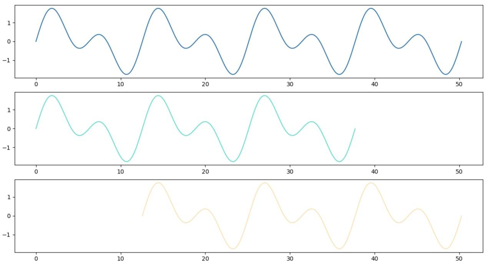

目录

- [周期性检测简介](#周期性检测简介)
- [傅里叶变换](#傅里叶变换)
- [自相关系数](#自相关系数)
- [周期性检测流程](#周期性检测流程)
  - [检测流程](#检测流程)
  - [实例分析](#实例分析)
- [周期性检测实践](#周期性检测实践)

# 周期性检测简介

任何事物在两个不同时刻都不可能保持完全相同的状态, 但很多变化往往存在着一定的规律, 
例如 24 小时日出日落, 潮起潮落, 这些现象通常称为周期.

周期性指时间序列中呈现出来的围绕长期趋势的一种波浪形或震荡式变动. 准确提取周期信息, 
不仅能反映当前数据的规律, 应用于相关场景, 还可以预测未来数据变化趋势. 
这是时间序列研究的基本要素.通过肉眼观察时序图, 可以很容易地判断数据是否满足周期性, 
但无法知道准确的周期时长, 且当数据组数达到一定数量时, 这种方式就不再适用了.

一般而言, 时间序列周期性分为三种: 

- 符号性周期: 表示只有一个以上的符号是周期性的, 并且部分地出现
    - 例如序列 `f` bcn `f` kgb `f` ops 中的 `f` 有周期性, 它的周期是 4, 可以用 CONV 方法检测
- 部分周期性: 表示有一个以上的符号是周期性的, 并且部分地出现
    - 例如序列 ansd `cd` mn `cd` ca `cd` as `cd` mc 中 `cd` 具有周期性, 周期从位置 4 开始, 可以用 PARPER 方法检测
- 分段周期性: 整个序列被表示为一个周期模式

# 傅里叶变换

傅里叶变换是一种将 **时域**、 **空域** 数据转化为 **频域** 数据的方法, 
任何波形(时域)都可以看做是不同振幅、不同相位(频域)正弦波的叠加. 
比如下面最前方的图形就是它后面所有正弦波的总和.

对于一条具备周期性的时间序列, 它本身就很接近正弦波, 所以它的组成里一定包含一个显著的正弦波, 
周期就是该正弦波的周期, 而这个正弦波可以通过傅里叶变换找到, 它将时序数据展开成
三角函数的线性组合, 得到每个展开项的系数, 就是傅里叶系数. 
傅里叶系数越大, 表明它所对应的正弦波的周期就越有可能是这份数据的周期. 

- [An Interactive Guide To The Fourier Transform](https://betterexplained.com/articles/an-interactive-guide-to-the-fourier-transform/)

# 自相关系数

自相关系数(Autocorrelation Function) 度量的是同一件事不同时间的相关程度.

比如有一个序列 `$X = [1, 2, 3, 5, 7, 9, 13, 14, 17, 19]$`, 求不同相位差的自相关系数

- 相位差为 1 时, 比较的序列是 `$[1, 2, 3, 5, 7, 9, 13, 14, 17]$` 和 `$[2, 3, 5, 7, 9, 13, 14, 17, 19]$`
- 相位差为 2 时, 比较的序列是 `$[1, 2, 3, 5, 7, 9, 13, 14]$` 和 `$[3, 5, 7, 9, 13, 14, 17, 19]$`

不同相位差(lag)序列间的自相关系数可以用 Pearson 相关系数计算:

`$$\begin{align} autocorr(X, t) &= corr[X, lag(X, t)] \\
                              &= \frac{cov[X, lag(X, t)]}{std[X]std[lag(X, t)]} \\
                              &= \frac{cov[X, lag(X, t)]}{var(X)} \\
                              &= \frac{\sum^{N}_{i=1}[X_{i} - mean(X)][X_{i-t} - mean(X)]}{\sum{N}_{i=1}[X_{i} - mean(X)]^{2}}
\end{align}$$`

其中 `$lag(X_{i}, t)=X_{i-1}$` 表示相位 `$t$` 的数据延迟 lag operator

当序列存在周期性时, 遍历足够多的相位差, 一定可以找到至少一个足够大的相关系数, 而它对应的相位差就是周期.

所以对于检测时序周期来说, 只需找到两个自相关系数达到一定阈值的子序列, 反映在时序图上, 就是两段很相似的数据,
它们起始时间的差值就是我们需要的周期. 比如下面的第二张图和第三张图, 它们的序列自相关系数为 1, 起始时间间隔是 12.57, 
正好是第一张图的周期.

# 周期性检测流程

## 检测流程

为了保证结果的可靠性, 可以将傅里叶变换和自相关系数结合起来判断周期性. 
主要思路是:

1. 先通过傅里叶变换找到可能的周期
2. 再用自相关系数做排除, 从而得到最可能的周期

## 实例分析

# 周期性检测实践

- 见 `src/timeseries/timeseries_cyclical_detection.py`

