<style>
details {
    border: 1px solid #aaa;
    border-radius: 4px;
    padding: .5em .5em 0;
}
summary {
    font-weight: bold;
    margin: -.5em -.5em 0;
    padding: .5em;
}
details[open] {
    padding: .5em;
}
details[open] summary {
    border-bottom: 1px solid #aaa;
    margin-bottom: .5em;
}
</style>

<details><summary>目录</summary><p>

- [TODO](#todo)
- [时间序列特征](#时间序列特征)
  - [离散时间特征](#离散时间特征)
    - [基础周期特征](#基础周期特征)
    - [特殊周期特征](#特殊周期特征)
  - [连续时间特征](#连续时间特征)
- [基础周期特征](#基础周期特征-1)
  - [日期时间特征](#日期时间特征)
    - [日期特征](#日期特征)
    - [时间特征](#时间特征)
- [特殊周期特征](#特殊周期特征-1)
  - [月份特征](#月份特征)
  - [星期特征](#星期特征)
  - [节假日特征](#节假日特征)
  - [组合特征](#组合特征)
- [连续时间特征](#连续时间特征-1)
  - [持续时间](#持续时间)
  - [间隔时间](#间隔时间)
- [动态特征](#动态特征)
  - [滞后特征](#滞后特征)
    - [创建滞后特征](#创建滞后特征)
  - [窗口特征](#窗口特征)
    - [滚动窗口特征](#滚动窗口特征)
    - [扩展窗口特征](#扩展窗口特征)
  - [历史统计特征](#历史统计特征)
    - [峰值特征](#峰值特征)
    - [Python API](#python-api)
  - [滞后窗口统计特征](#滞后窗口统计特征)
- [静态特征](#静态特征)
  - [类别型特征](#类别型特征)
  - [数值型特征](#数值型特征)
- [交叉特征](#交叉特征)
  - [类别特征与类别特征](#类别特征与类别特征)
  - [连续特征与类别特征](#连续特征与类别特征)
  - [连续特征与连续特征](#连续特征与连续特征)
  - [Python API](#python-api-1)
- [隐蔽特征](#隐蔽特征)
  - [基于线性模型的特征](#基于线性模型的特征)
    - [线性模型的系数特征](#线性模型的系数特征)
    - [线性模型的残差特征](#线性模型的残差特征)
  - [基于其他模型的特征](#基于其他模型的特征)
- [元特征](#元特征)
  - [元特征抽取](#元特征抽取)
  - [元特征预测](#元特征预测)
- [转换特征](#转换特征)
  - [统计转换特征](#统计转换特征)
  - [高维空间转换特征](#高维空间转换特征)
    - [格拉姆角场](#格拉姆角场)
    - [马尔科夫随机场](#马尔科夫随机场)
    - [时频分析](#时频分析)
  - [降维转化特征](#降维转化特征)
- [基于神经网络的特征工程](#基于神经网络的特征工程)
- [时间序列预处理](#时间序列预处理)
  - [时间序列示例数据](#时间序列示例数据)
  - [标准化和中心化](#标准化和中心化)
    - [标准化](#标准化)
    - [中心化](#中心化)
  - [归一化](#归一化)
    - [归一化](#归一化-1)
    - [平均归一化](#平均归一化)
    - [什么时候用归一化？什么时候用标准化？](#什么时候用归一化什么时候用标准化)
  - [定量特征二值化](#定量特征二值化)
- [时间序列分类特征](#时间序列分类特征)
  - [字典特征](#字典特征)
  - [形态特征(Shapelet)](#形态特征shapelet)
- [参考](#参考)
</p></details><p></p>

# TODO

* [多元时间序列特征工程的指南](https://mp.weixin.qq.com/s/D79CaZyQLB0ILqid7qgxsg)

# 时间序列特征

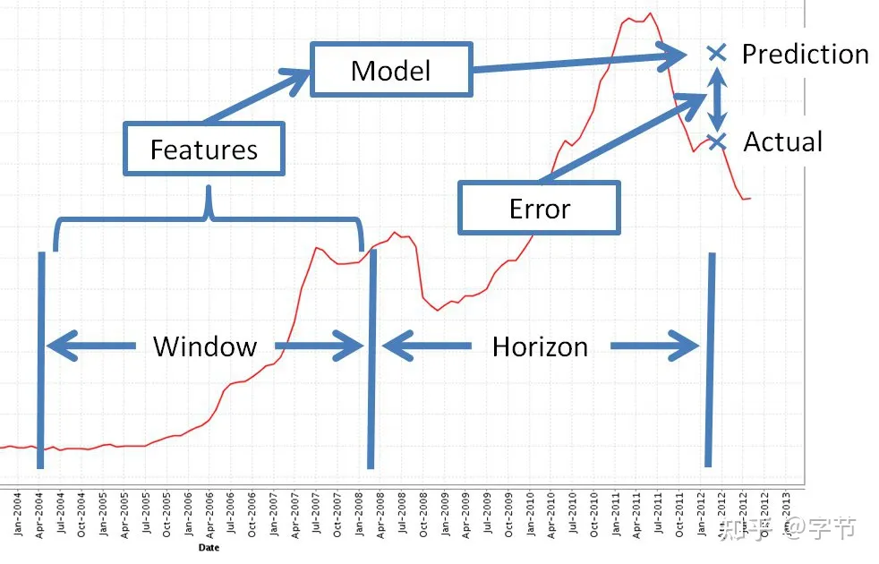

时间序列特征构造基本准则：

* 构造时序特征时一定要算好时间窗口，特别是在工作的时候，需要自己去设计训练集和测试集，
   千万不要出现数据泄露的情况(比如说预测明天的数据时，是拿不到今天的特征的)
* 针对上面的情况，可以尝试将今天的数据进行补齐
* 有些特征加上去效果会变差，大概率是因为过拟合了
* 有些特征加上去效果出奇好，第一时间要想到是不是数据泄露了
* 拟合不好的时间(比如说双休日)可以分开建模
* Ont-Hot 对 XGBoost 效果的提升很显著
* 离散化对 XGBoost 效果的提升也很显著
* 对标签做个平滑效果可能会显著提升
* 多做数据分析, 多清洗数据

## 离散时间特征

### 基础周期特征

- 年特征
    - 年
    - 年初
    - 年末
    - 是否是闰年
- 季度特征
    - 季度
    - 季节
    - 业务季度
- 月份特征
    - 月
    - 月初
    - 月末
    - 每个月的天数 
    - 每个月中的工作日天数
    - 每个月中的休假天数
    - 夏时制与否
- 日(天)特征
    - 日
    - 一天过去了几分钟
    - 节假日特征
        - 是否周末
        - 是否放假
        - 是否调休
- 时、分、秒、毫秒等特征
    - 小时
    - 分钟
    - 秒
    - 一天的哪个时间段
        - 上午
        - 中午
        - 下午
        - 傍晚
        - 晚上
        - 深夜
        - 凌晨
    - 是否高峰时段
    - 是否上班
    - 是否营业

> - 如果用 Xgboost 模型可以进行 One-Hot 编码
> - 如果类别比较多, 可以尝试平均数编码(Mean Encoding)
> - 或者取 cos/sin 将数值的首位衔接起来, 比如说 23 点与 0 点很近, 星期一和星期天很近

### 特殊周期特征

- 星期特征
    - 一周中的星期几
    - 一个月中的第几个星期
    - 一年中的哪个星期
    - 周中(工作日)
    - 周末
- 节假日特征
    - 是否节假日
    - 节假日连续天数
    - 节假日前第 n 天
    - 节假日第 n 天
    - 节假日后 n 天
    - 不放假的人造节假日
- 组合特征
    - 月和星期
    - 节假日和星期

> - 数据可能会随着节假日的持续而发生变化, 比如说递减
> - 节假日前/后可能会出现数据波动
> - 不放假的人造节日如 5.20、6.18、11.11 等也需要考虑一下

## 连续时间特征

> 时间差

* 持续时间
    - 时长，比如：单页面浏览时长
* 间隔时间
    - 距离假期的前后时长(节假日前、后可能出现明显的数据波动)
    - 上次购买距离现在购买的时间间隔

# 基础周期特征

几乎所有的日期时间都可以被拆解为：年-月-日-小时-分钟-秒-毫秒 的形式。
虽然拆解很简单，但是里面会含有非常多的潜在重要信息，如果直接对时间信息进行 Label 编码，
然后使用梯度提升树模型进行训练预测，是极难挖掘到此类信息的，
但是拆解之后却可以极大的帮助到梯度提升树模型发现此类信息

* 在处理时序特征时，可以根据历史数据提取出工作日和周末信息，
  拥有关于日、月、年等的信息对于预测值非常有用
* 如果有时间戳，可以类似地提取更细粒度的特征。例如，
  可以确定记录数据的当天的小时或分钟，并比较营业时间和非营业时间之间的趋势

在大多数情况中，拆解之后的数据往往存在某些潜在规律的，比如：

* 对某个城市的旅游人数进行预估，旅游是存在旺季和淡季的，这个时候拆分之后得到的月份就非常重要
* 预估店铺每天的销量，因为很多公司都会在月末发工资，这个时候拆解得到的天信息就会比较重要
* 预估用户是否会下单，那么小时特征可能就比较重要，比如这个时候已经是晚上 11 点了，
  用户在搜索旅馆的信息，那么大概率可能就会下单，相反如果是中午在搜索，那么该用户可能并不是很急，
  所以下单的概率就会小一些，这个时候拆解得到的小时信息就回比较重要
* 预估地铁的每个小时的流量，那么早上 7 点到 8 点，晚上 5 点到 7 点，这些上下班的高峰期，流量一般就会大一些

以下是可以生成的完整功能列表：

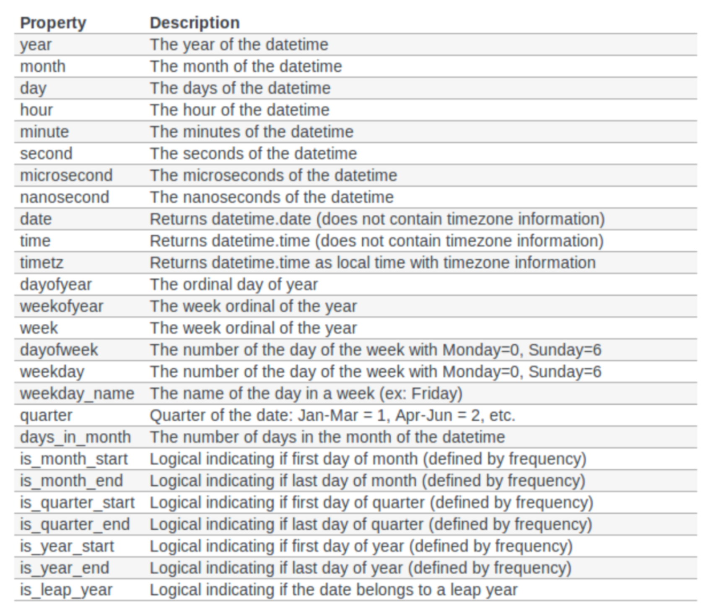

## 日期时间特征

### 日期特征

```python
import pandas as pd


data = pd.read_csv('Train_SU63ISt.csv')
data['Datetime'] = pd.to_datetime(data['Datetime'],format='%d-%m-%Y %H:%M')

data['year']=data['Datetime'].dt.year 
data['month']=data['Datetime'].dt.month 
data['day']=data['Datetime'].dt.day

data['dayofweek_num']=data['Datetime'].dt.dayofweek  
data['dayofweek_name']=data['Datetime'].dt.weekday_name

data.head()
```

### 时间特征

```python
import pandas as pd


data = pd.read_csv('Train_SU63ISt.csv')
data['Datetime'] = pd.to_datetime(data['Datetime'],format='%d-%m-%Y %H:%M')

data['Hour'] = data['Datetime'].dt.hour 
data['minute'] = data['Datetime'].dt.minute 

data.head()
```

# 特殊周期特征

特殊周期特征指比如对月、星期、节假日等的特征：

* 月份、星期特征
    - 年月日特征拆解可以帮我们得到最基础的时间周期特征。那么肯定就就会联想到其它的时间周期特征，
      例如星期等信息。这个也较为容易理解，比如：需要预测某些餐馆的人流量，那么热闹的大餐馆周六周日的人流量就会比平时多一些；
      而一些靠近互联网大公司附近的商场可能周末人会少很多，因为平时工作日忙，就会在附近商场吃饭，
      但是到了周日了，不用上班了，周围的人流量大大下降，反而使得商场附近餐馆的人流量大大下降了
* 节假日特征
    - 节假日这个不仅包含国家的法定节假日，依据问题的不同，还有非常多特殊的日期，例如：
      如果问题是预测各大电商的日 GMV，那么每年的双 11 等特殊日期就尤为重要；
      如果问题是预测旅游景点的客流量，那么五一、十一等节假日的日期就尤为重要
* 组合特征
    - 月和星期组合特征
        - 有些时候，还会将星期特征和月份特征结合，构成简单的组合特征，举个例子：
          需要预测某些餐馆的销售额，知道一般公司会在月末发放工资，
          所以每个月的最后一个周末的餐馆的销售额可能就会比平常的周末大一些
    - 节假日和星期组合特征
        - 节假日和星期的组合也是非常强的组合特征，在有些问题中，又是重要节日又是周末会是非常强的信息，
          在另外一些问题中，节假日如果是连着周六周日的，那么这些信息也都是非常重要的组合特征，
          因为这意味着我们的假期可能延长了，所以会是一种较强的信号

## 月份特征

该特征经常适用于关于以月为单位的预估问题，例如预估某个公司每个月的产值，某个景点的旅游人数，
这个时候每个月中工作日的天数以及休假的天数就是非常重要的信息。比如：

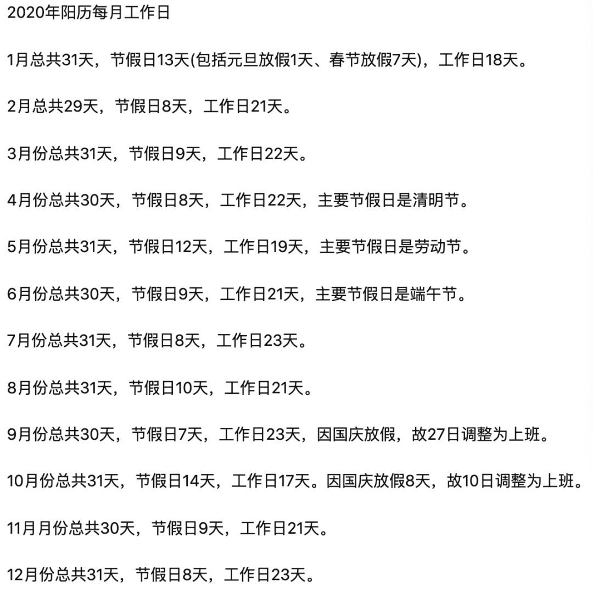

## 星期特征

## 节假日特征

## 组合特征


# 连续时间特征

> 相邻时间差

该特征顾明思议，就是相邻两个时间戳之间的差值，在有些问题中，
例如用户浏览每个视频的开始时间戳，相邻两个时间戳的差值一般就是用户浏览视频的差值，
如果差值越大，那么该用户可能对上一个视频的喜好程度往往越大，此时，相邻时间戳的差值就是非常有价值的特征

该特征往往适合相邻时间差互补的一个特征，可以帮助更好地挖掘一些内在的信息，
例如有些自律的用户在会控制自己的休闲与工作的时长，在统计用户的生活习惯时，
发现出现大量的相邻时间差时 10 分钟和 60 分钟的，原来是该用户喜欢工作 60 分钟就休息 10 分钟，
此时相邻时间差频率编码就可以协助发现此类信息

## 持续时间

## 间隔时间

# 动态特征

Lag 特征、日期时间衍生特征这类属于动态特征。随着时间变化会发生改变。这其中又可以分成两类：

* 一类是在预测时无法提前获取到的信息，例如预测值本身，跟预测值相关的不可知信息，如未来的客流量，点击量等
    - 对于这类信息，只能严格在历史窗口范围内做各种特征构建的处理，一般以 lag 为主
* 另一类则是可以提前获取到的信息，例如有明确的定价计划，可以预知在 T+1 时计划售卖的商品价格是多少
    - 对于这类特征，则可以直接像静态特征那样直接加入对应时间点的信息进去

将时间序列在时间轴上划分窗口是一个常用且有效的方法，
包括滑动窗口（根据指定的单位长度来框住时间序列，每次滑动一个单位），
与滚动窗口（根据指定的单位长度来框住时间序列，每次滑动窗口长度的多个单位）

窗口分析对平滑噪声或粗糙的数据非常有用，比如移动平均法等，这种方式结合基础的统计方法，
即按照时间的顺序对每一个时间段的数据进行统计，从而可以得到每个时间段内目标所体现的特征，
进而从连续的时间片段中，通过对同一特征在不同时间维度下的分析，得到数据整体的变化趋势

## 滞后特征

> Lag Features

为了便于理解，可以假设预测的 horizon 长度仅为 1 天，而历史的特征 window 长度为 7 天，
那么可以构建的最基础的特征即为过去 7 天的每天的历史值，来预测第 8 天的值。
这个历史 7 天的值，在机器学习类方法中，一般被称为 lag 特征

### 创建滞后特征

```python
import pandas as pd 

def series_to_supervised(data, n_lag = 1, n_fut = 1, selLag = None, selFut = None, dropnan = True):
    """
    Converts a time series to a supervised learning data set by adding time-shifted prior and future period
    data as input or output (i.e., target result) columns for each period
    :param data:  a series of periodic attributes as a list or NumPy array
    :param n_lag: number of PRIOR periods to lag as input (X); generates: Xa(t-1), Xa(t-2); min= 0 --> nothing lagged
    :param n_fut: number of FUTURE periods to add as target output (y); generates Yout(t+1); min= 0 --> no future periods
    :param selLag:  only copy these specific PRIOR period attributes; default= None; EX: ['Xa', 'Xb' ]
    :param selFut:  only copy these specific FUTURE period attributes; default= None; EX: ['rslt', 'xx']
    :param dropnan: True= drop rows with NaN values; default= True
    :return: a Pandas DataFrame of time series data organized for supervised learning
    
    NOTES:
    (1) The current period's data is always included in the output.
    (2) A suffix is added to the original column names to indicate a relative time reference: e.g., (t) is the current
        period; (t-2) is from two periods in the past; (t+1) is from the next period
    (3) This is an extension of Jason Brownlee's series_to_supervised() function, customized for MFI use
    """
    n_vars = 1 if type(data) is list else data.shape[1]
    df = pd.DataFrame(data)
    origNames = df.columns
    cols, names = list(), list()
    # include all current period attributes
    cols.append(df.shift(0))
    names += [("%s" % origNames[j]) for j in range(n_vars)]
    # lag any past period attributes (t-n_lag, ..., t-1)
    n_lag = max(0, n_lag) # force valid number of lag periods
    # input sequence (t-n, ..., t-1)
    for i in range(n_lag, 0, -1):
        suffix = "(t-%d)" % i
        if (None == selLag):
        cols.append(df.shift(i))
        names += [("%s%s" % (origNames[j], suffix)) for j in range(n_vars)]
        else:
        for var in (selLag):
                cols.append(df[var].shift(i))
                names += [("%s%s" % (var, suffix))]
    # include future period attributes (t+1, ..., t+n_fut)
    n_fut = max(n_fut, 0)
    # forecast sequence (t, t+1, ..., t+n)
    for i in range(0, n_fut + 1):
        suffix = "(t+%d)" % i
        if (None == selFut):
        cols.append(df.shift(-i))
        names += [("%s%s" % (origNames[j], suffix)) for j in range(n_vars)]
        else:
        for var in (selFut):
                cols.append(df[var].shift(-i))
                names += [("%s%s" % (var, suffix))]
    # put it all together
    agg = pd.concat(cols, axis = 1)
    agg.columns = names
    # drop rows with NaN values
    if dropnan:
        agg.dropna(inplace = True)

    return agg
```

示例：

```python
import pandas as pd
data = pd.read_csv('Train_SU63ISt.csv')
data['Datetime'] = pd.to_datetime(data['Datetime'],format='%d-%m-%Y %H:%M')

data['lag_1'] = data['Count'].shift(1)
data['lag_2'] = data['Count'].shift(2)
data['lag_3'] = data['Count'].shift(3)
data['lag_4'] = data['Count'].shift(4)
data['lag_5'] = data['Count'].shift(5)
data['lag_6'] = data['Count'].shift(6)
data['lag_7'] = data['Count'].shift(7)

data = data[['Datetime', 'lag_1', 'lag_2', 'lag_3', 'lag_4', 'lag_5', 'lag_6', 'lag_7', 'Count']]
data.head(10)
```

## 窗口特征

> * 滑动、滚动窗口时间聚合特征
> * 扩展窗口

Lag 的基本属于直接输入的信息，基于这些信息，我们还可以进一步做各种复杂的衍生特征。
例如在 lag 的基础上，我们可以做各种窗口内的统计特征，比如过去 n 个时间点的平均值，最大值，最小值，标准差等。
进一步，还可以跟之前的各种维度信息结合起来来计算，比如某类商品的历史均值，某类门店的历史均值等。
也可以根据自己的理解，做更复杂计算的衍生，例如过去 7 天中，销量连续上涨的天数，
过去 7 天中最大销量与最低销量之差等等


### 滚动窗口特征

如何根据过去的值计算一些统计值？这种方法称为滚动窗口方法，因为每个数据点的窗口都不同

由于这看起来像一个随着每个下一个点滑动的窗口，因此使用此方法生成的特征称为 “滚动窗口” 特征。
我们将选择一个窗口大小，取窗口中值的平均值，并将其用作特征。让我们在 Python 中实现它

示例 1：

```python
import pandas as pd
data = pd.read_csv('Train_SU63ISt.csv')
data['Datetime'] = pd.to_datetime(data['Datetime'],format='%d-%m-%Y %H:%M')

data['rolling_mean'] = data['Count'].rolling(window=7).mean()
data = data[['Datetime', 'rolling_mean', 'Count']]
data.head(10)
```

示例 2：

```python
temps = pd.DataFrame(series.values)

shifted = temps.shift(1)
window = shifted.rolling(window = 2)
means = window.mean()

df = pd.concat([mean, temps], axis = 1)
df.columns = ["mean(t-2,t-1)", "t+1"]

print(df.head())
```

```
   mean(t-2,t-1)   t+1
0            NaN  17.9
1            NaN  18.8
2          18.35  14.6
3          16.70  15.8
4          15.20  15.8
```

示例 3：

```python
temps = pd.DataFrame(series.values)

width = 3
shifted = temps.shift(width - 1)
window = shifted.rolling(windon = width)

df = pd.concat([
    window.min(), 
    window.mean(), 
    window.max(), 
    temps
], axis = 1)
df.columns = ["min", "mean", "max", "t+1"]

print(df.head())
```

```
    min  mean   max   t+1
0   NaN   NaN   NaN  17.9
1   NaN   NaN   NaN  18.8
2   NaN   NaN   NaN  14.6
3   NaN   NaN   NaN  15.8
4  14.6  17.1  18.8  15.8
```

### 扩展窗口特征

在滚动窗口的情况下，窗口的大小是恒定的，扩展窗口功能背后的想法是它考虑了所有过去的值。
每一步，窗口的大小都会增加 1，因为它考虑了系列中的每个新值

示例 1：

```python
import pandas as pd
data = pd.read_csv('Train_SU63ISt.csv')
data['Datetime'] = pd.to_datetime(data['Datetime'],format='%d-%m-%Y %H:%M')

data['expanding_mean'] = data['Count'].expanding(2).mean()
data = data[['Datetime','Count', 'expanding_mean']]
data.head(10)
```

实例 2：

```python
temps = pd.DataFrame(series.values)

window = temps.expanding()

df = pd.concat([
    window.min(), 
    window.mean(), 
    window.max(), 
    temps.shift(-1)
], axis = 1)
df.columns = ["min", "mean", "max", "t+1"]

print(df.head())
```

``` 
    min    mean   max   t+1
0  17.9  17.900  17.9  18.8
1  17.9  18.350  18.8  14.6
2  14.6  17.100  18.8  15.8
3  14.6  16.775  18.8  15.8
4  14.6  16.580  18.8  15.8
```

## 历史统计特征

> 统计特征

对时间序列进行统计分析是最容易想到的特征提取方法。基于历史数据构造长中短期的统计值，
包括前 n 天/周期内的

* 简单特征
    - 均值
    - 标准差
    - 分位数
        - 四分位数
        - 中位数 
    - 偏度、峰度：挖掘数据的偏离程度和集中程度
    - 离散系数：挖掘离散程度
    - 尖峰(峰值)个数
    - 缺失个数
    - 偏差
* 高级特征
    - 自相关性：挖掘出周期性
    - 周期性
    - 趋势(斜率)
    - 频率
    - 随机噪声
* 同期值： 前 n 个周期/天/月/年的同期值

### 峰值特征

序列中峰值的个数，序列中峰值的个数可以间接反映序列的波动情况，
这在非常多的问题中都有着非常强的物理意义，例如：

* 在股票价格序列，多峰能反映多方和空方的博弈情况
* 在上下波动的序列中能反应心跳的跳动快慢等

可以使用`scipy.signal` 进行峰值个数特征的构建，捕捉到以下这些峰值的情况：

* 峰值的个数
* 相邻峰值之间的差值和对应的统计特征，例如相邻最近的峰值的差值，最远的峰值的差值等
* 第一个峰值的位置
* 最后一个峰值的位置

峰值的个数：

```python
import matplotlib.pyplot as plt
from scipy.misc import electrocardiogram
from scipy.signal import find_peaks
import numpy as np

x = electrocardiogram()[2000:4000]
peaks, _ = find_peaks(x, height = 0)
plt.plot(x)
plt.plot(peaks, x[peaks], "x")
plt.plot(np.zeros_like(x), "--", color = "gray")
plt.show()
```

较大距离的峰值：

```python
peaks, _ = find_peaks(x, distance = 150)
np.diff(peaks)

plt.plot(x)
plt.plot(peaks, x[peaks], "x")
plt.show()
```

### Python API

```python
from pandas.plotting import autocorrelation_plot

# 自相关性系数图
autocorrelation_plot(data['value'])

# 构造过去 n 天的统计数据
def get_statis_n_days_num(data, col, n):
    temp = pd.DataFrame()
    for i in range(n):
        temp = pd.concat([temp, data[col].shift((i + 1) * 24)], axis = 1)
        data['avg_' + str(n) + '_days_' + col] = temp.mean(axis = 1)
        data['median_' + str(n) + '_days_' + col] = temp.median(axis = 1)
        data['max_' + str(n) + '_days_' + col] = temp.max(axis = 1)
        data['min_' + str(n) + '_days_' + col] = temp.min(axis = 1)
        data['std_' + str(n) + '_days_' + col] = temp.std(axis = 1)
        data['mad_' + str(n) + '_days_' + col] = temp.mad(axis = 1)
        data['skew_' + str(n) + '_days_' + col] = temp.skew(axis = 1)
        data['kurt_' + str(n) + '_days_' + col] = temp.kurt(axis = 1)
        data['q1_' + str(n) + '_days_' + col] = temp.quantile(q = 0.25, axis = 1)
        data['q3_' + str(n) + '_days_' + col] = temp.quantile(q = 0.75, axis = 1)
        data['var_' + str(n) + '_days_' + col] = data['std' + str(n) + '_days_' + col] / data['avg_' + str(n) + '_days_' + col]

    return data

data_df = get_statis_n_days_num(data_df, 'num_events', n = 7)
data_df = get_statis_n_days_num(data_df, 'num_events', n = 14)
data_df = get_statis_n_days_num(data_df, 'num_events', n = 21)
data_df = get_statis_n_days_num(data_df, 'num_events', n = 28)
```

* 同期值

```python
# n个星期前的同期特征
data_df['ago_7_day_num_events'] = data_df['num_events'].shift(7 * 24)
data_df['ago_14_day_num_events'] = data_df['num_events'].shift(14 * 24)
data_df['ago_21_day_num_events'] = data_df['num_events'].shift(21 * 24)
data_df['ago_28_day_num_events'] = data_df['num_events'].shift(28 * 24)

# 昨天的同期特征
data_df['ago_7_day_num_events'] = data_df['num_events'].shift(1 * 24)
```

## 滞后窗口统计特征


# 静态特征

静态特征即随着时间的变化，不会发生变化的信息

除了最细粒度的唯一键，还可以加入其它形式的静态特征

* 例如商品属于的大类、中类、小类，门店的地理位置特性，股票所属的行业等等
* 除了类别型，静态特征也可能是数值型，例如商品的重量，规格，一般是保持不变的

## 类别型特征

另外一类最常见的基础特征，就是区分不同序列的类别特征，
例如不同的门店，商品，或者不同的股票代码等

通过加入这个类别特征，就可以把不同的时间序列数据放在一张大表中统一训练了。
模型理论上来说可以自动学习到这些类别之间的相似性，提升泛化能力

## 数值型特征

* 商品重量
* 商品规格

# 交叉特征

特征交叉一般从重要特征下手, 慢工出细活

## 类别特征与类别特征

类别特征间组合构成新特征

* 笛卡尔积
    - 比如星期和小时: Mon_10(星期一的十点)

## 连续特征与类别特征

- 连续特征分桶后进行笛卡尔积
- 基于类别特征进行 groupby 操作, 类似聚合特征的构造

## 连续特征与连续特征

- 一阶差分(同比、环比): 反应同期或上一个统计时段的变换大小
- 二阶差分: 反应变化趋势
- 比值

## Python API

```python
# 一阶差分
data_df['ago_28_21_day_num_trend'] = data_df['ago_28_day_num_events'] - data_df['ago_21_day_num_events']
data_df['ago_21_14_day_num_trend'] = data_df['ago_21_day_num_events'] - data_df['ago_14_day_num_events']
data_df['ago_14_7_day_num_trend'] = data_df['ago_14_day_num_events'] - data_df['ago_7_day_num_events']
data_df['ago_7_1_day_num_trend'] = data_df['ago_7_day_num_events'] - data_df['ago_1_day_num_events']
```

# 隐蔽特征

在时间序列问题中，经常习惯做非常多的手工统计特征，包括一些序列的近期的情况、
序列的趋势信息、周期信息等等。除了手动构建特征之外，其实还存在许多非常隐蔽的特征，
这些特征是直接通过模型产出的，这里介绍基于线性模型的特征

## 基于线性模型的特征

### 线性模型的系数特征

通过线性回归的系数来表示近期的趋势特征

```python
from sklearn import linear_model

reg = linear_model.LinearRegression()
reg.fit(X, y)
reg.coef_
```

### 线性模型的残差特征

直接计算线性回归的预测结果与真实值差值(残差), 并计算所有差值的均值作为残差特征

```python
import numpy as np
from sklearn import linear_model

reg = linear_model.LinearRegression()
reg.fit(X, y)
preds = reg.predict(X)
residual = np.mean(np.abs(y - preds))
```

## 基于其他模型的特征

# 元特征

在时间序列等相关的问题中，除了许多传统的时间序列相关的统计特征之外，
还有一类非常重要的特征，这类特征并不是基于手工挖掘的，而是由机器学习模型产出的，
但更为重要的是，它往往能为模型带来巨大的提升

对时间序列抽取元特征，一共需要进行两个步骤：

* 抽取元特征
* 将元特征拼接到一起重新训练预测得到最终预测的结果

## 元特征抽取

元特征抽取部分，操作如下：

* 先把数据按时间序列分为两块
* 使用时间序列的第一块数据训练模型得到模型 1
* 使用时间序列的第二块数据训练模型得到模型 2
* 使用模型 1 对第二块的数据进行预测得到第二块数据的元特征
* 使用模型 2 对测试集进行预测得到测试集的元特征


## 元特征预测

将元特征作为新的特征，与原来的数据进行拼接，重新训练新的模型，
并用新训练的模型预测得到最终的结果

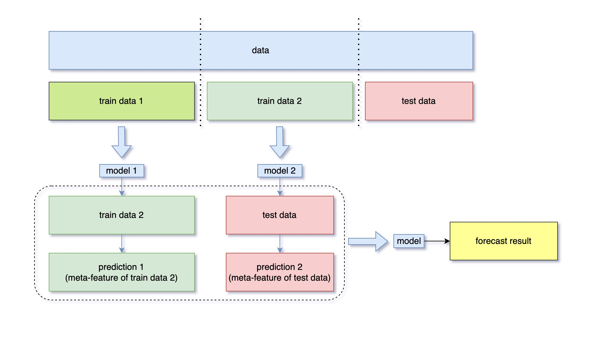


# 转换特征

对时序数据进行分析的时候，常常会发现数据中存在一些问题，
使得不能满足一些分析方法的要求（比如：正态分布、平稳性等），
其常常需要我们使用一些变换方法对数据进行转换；
另一方面，人工的特征分析方法局限于人的观察经验，
许多高维且隐秘的特征单单靠人力难以发现。
因此，许多工作尝试对时序数据进行转换，从而捕捉更多的特征

## 统计转换特征

1964 年提出的 Box-Cox 变换可以使得线性回归模型满足线性、独立性、方差齐次性和正态性的同时又不丢失信息，
其变换的目标有两个：

* 一个是变换后，可以一定程度上减小不可观测的误差和预测变量的相关性。
  主要操作是使得变换后的因变量与回归自变量具有线性相依关系，误差也服从正态分布，
  误差各分量是等方差且相互独立
* 第二个是用这个变换来使得因变量获得一些性质，比如在时间序列分析中的平稳性，
  或者使得因变量分布为正态分布

## 高维空间转换特征

高维空间转换特征直白点说就是把一维的时序转化到高维。这个高维可能是二维（例如图片），
或者更高维（例如相空间重构）。这种转换可以使得时序的信息被放大，从而暴露更多的隐藏信息。
同时，这种方法增加了数据分析的计算量，一般不适用于大规模的时序分析

### 格拉姆角场

> 格拉姆角场，GAF

该转化在笛卡尔坐标系下，将一维时间序列转化为极坐标系表示，再使用三角函数生成 GAF 矩阵。
计算过程：

* 数值缩放：将笛卡尔坐标系下的时间序列缩放到 `$[0,1]$` 或 `$[-1,1]$` 区间
* 极坐标转换：使用坐标变换公式，将笛卡尔坐标系序列转化为极坐标系时间序列
* 角度和/差的三角函数变换：若使用两角和的 `$cos$` 函数则得到 GASF，
  若使用两角差的 `$cos$` 函数则得到 GADF

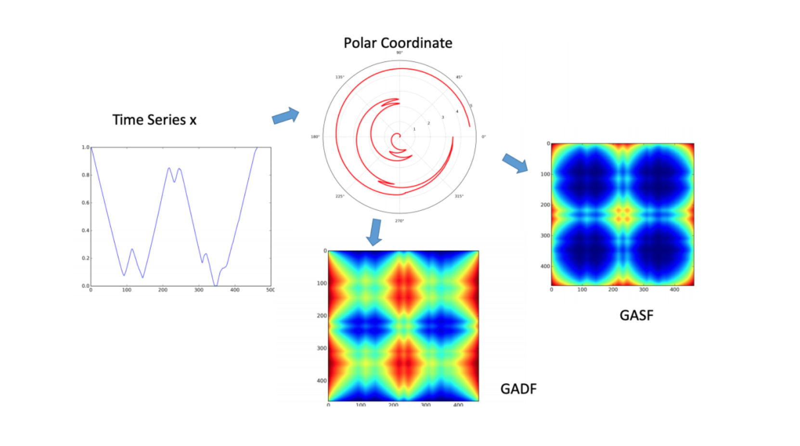

### 马尔科夫随机场

> 马尔科夫随机场，MRF

MRF 的基本思想是将时间序列的值状态化，然后计算时序的转化概率，
其构建的是一个概率图(Graph)，一种无向图的生成模型，主要用于定义概率分布函数

这里用到了时序窗口分析方法先构建随机场。随机场是由若干个位置组成的整体，
当给每一个位置中按照某种分布随机赋予一个值之后，其全体就叫做随机场

举个例子，假如时序划分片段，所有的片段聚成若干的状态，将时序映射回这些状态上，
我们便得到了一个随机场。有关这个例子可以参考文章《AAAI 2020 | 时序转化为图用于可解释可推理的异常检测》

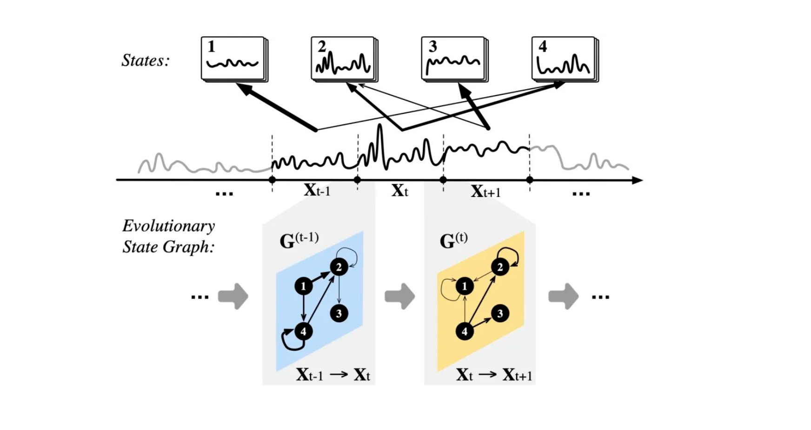

马尔科夫随机场是随机场的特例，它假设随机场中某一个位置的赋值仅仅与和它相邻的位置的赋值有关，
与其不相邻的位置的赋值无关。例如时序片段与有关，与没有关系。

构建马尔科夫随机场，可以更清晰的展现时序分布的转化过程，捕捉更精确的分布变化信息

### 时频分析

时频分析是一类标准方法，常用在通信领域信号分析中，包括傅里叶变换，
短时傅里叶变换，小波变换等，逐步拟合更泛化的时间序列

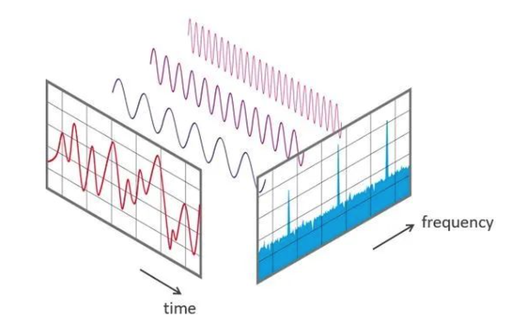

傅里叶变换是一种线性的积分变换，常在将信号在时域（或空域）和频域之间变换时使用。
其主要处理平稳的时间序列。当时序数据非平稳时，一般的傅里叶变换便不再适用，
这里便有了短时傅里叶变换方法，其主要通过窗口分析，
把整个时域过程分解成无数个等长的小过程，每个小过程近似平稳，再傅里叶变换，
就知道在哪个时间点上出现了什么频率。然而，我们无法保证所有等长的窗口都是平稳的，
手动调整窗口的宽窄成本大，耗费人力。小波分解尝试解决这个问题，
其直接把傅里叶变换的基换了——将无限长的三角函数基换成了有限长的会衰减的小波基。
这样不仅能够获取频率，还可以定位到时间

## 降维转化特征

与高维空间转换特征相反，提取时间序列的降维特征常出现在多维时间序列分析方面，
其主要是更快捕捉复杂时间序列中的主要特征，提高分析效率与速度，
包括主成分分析（PCA），tSNE，张量分解等等，可以帮助我们从相关因素的角度来理解时间序列

主成分分析是一种分析、简化数据集的技术。其通过保留低阶主成分，忽略高阶主成分做到的。
这样低阶成分往往能够保留住数据的最重要方面。但这也不是一定的，要视具体应用而定。更多可以参考《主成分分析》

张量分解从本质上来说是矩阵分解的高阶泛化，常出现在推荐系统中。在实际应用中，
特征张量往往是一个稀疏矩阵，即很多位置上的元素是空缺的，或者说根本不存在。
举个例子，如果有10000个用户，同时存在10000部电影，我们以此构造一个用户评分行为序列的张量，
这里不经想问：难道每个用户都要把每部电影都看一遍才知道用户的偏好吗？
其实不是，我们只需要知道每个用户仅有的一些评分就可以利用矩阵分解来估计用户的偏好，
并最终推荐用户可能喜欢的电影

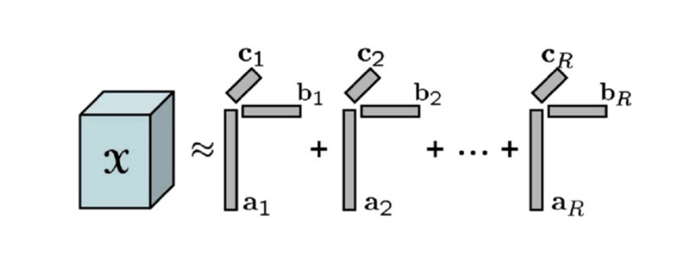

# 基于神经网络的特征工程

还有一种转换特征便是通过神经网络的方式自抽取特征表达。
这种方式通常特征的解释性差，但效果好。一般来说，训练好的网络中间层输出可以被当做特征，
例如自编码器模型 “Encoder-Decoder”，如果输入输出是时间序列的话，
Encoder 的输出可以当做一个输入被“压缩”的向量，那么当网络效果得还不错的时候，
可以简单看做这个向量具备了这个时序的特征

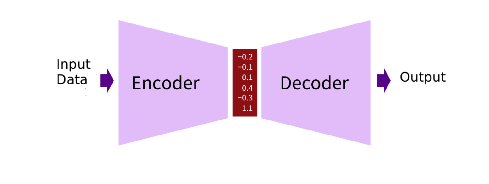


# 时间序列预处理

一般来说，真实世界的时间序列常常取值范围多样，长短不一，形态各异。
如果要做统一的分析，需要我们进行初步的处理，将时间序列整合到统一的范畴下，进行分析。
这里基本的方法有：标准化、归一化、定量特征二值化

## 时间序列示例数据

[澳大利亚墨尔本市10年(1981-1990年)内的最低每日温度](https://raw.githubusercontent.com/jbrownlee/Datasets/master/daily-min-temperatures.csv)

```python
import pandas as pd 
from pandas import Grouper
import matplotlib.pyplot as plt 

series = pd.read_csv(
    "https://raw.githubusercontent.com/jbrownlee/Datasets/master/daily-min-temperatures.csv",
    header = 0,
    index_col = 0, 
    parse_dates = True,
    date_parser = lambda dates: pd.to_datetime(dates, format = '%Y-%m-%d'),
    squeeze = True
)
print(series.head())
```

```
Date
1981-01-01    20.7
1981-01-02    17.9
1981-01-03    18.8
1981-01-04    14.6
1981-01-05    15.8
Name: Temp, dtype: float64
```

```python
series.plot()
plt.show()
```


```python
series.hist()
plt.show()
```


## 标准化和中心化

### 标准化

标准化是使时间序列中的数值符合平均值为 0，标准差为 1。具体来说，
对于给定的时间序列 `$\{x_{1}, x_{2}, \ldots, x_{t}, \ldots, x_{T}\}$`，
有如下公式：

`$$\hat{x}_{t} = \frac{x_{t} - mean(\{x_{t}\}_{t}^{T})}{std(\{x_{t}\}_{t}^{T})}$$`

```python
from pandas import read_csv
from sklearn.preprocessing import StandarScaler
from math import sqrt

# Data
series = pd.read_csv(
    "daily-minimum-temperatures-in-me.csv", 
    header = 0,
    index_col = 0
)
print(series.head())
values = series.values
values = values.reshape((len(values), 1))

# Standardization
scaler = StandardScaler()
scaler = scaler.fit(values)
print("Mean: %f, StandardDeviation: %f" % (scaler.mean_, sqrt(scaler.var_)))

# 标准化
normalized = scaler.transform(values)
for i in range(5):
    print(normalized[i])

# 逆变换
inversed = scaler.inverse_transform(normalized)
for i in range(5):
    print(inversed[i])
```

```python
normalized.plot()
```


```python
inversed.plot()
```


### 中心化

标准化的目标是将原始数据分布转换为标准正态分布，它和整体样本分布有关，
每个样本点都能对标准化产生影响。这里，如果只考虑将均值缩放到 0，
不考虑标准差的话，为数据中心化处理：

`$$\hat{x}_{t} = x_{t} - mean(\{x_{t}\}_{t}^{T})$$`

## 归一化

归一化是将样本的特征值转换到同一范围（量纲）下，把数据映射到 `$[0, 1]$` 或 `$[-1, 1]$` 区间内，
它仅由变量的极值所决定，其主要是为了数据处理方便而提出来的

```python
import pandas as pd 
from sklearn.preprocessing import MinMaxScaler

# Data
series = pd.read_csv(
    "daily-minimum-temperautures-in-me.csv", 
    header = 0, 
    index_col = 0
)
print(series.head())
values = series.values
values = values.reshape((len(values), 1))

# Normalization
scaler = MinMaxScaler(feature_range = (0, 1))
scaler = scaler.fit(values)
print("Min: %f, Max: %f" % (scaler.data_min_, scaler.data_max_))

# 正规化
normalized = scaler.transform(values)
for i in range(5):
    print(normalized[i])

# 逆变换
inversed = scaler.inverse_transform(normalized)
for i in range(5):
    print(inversed[i])
```

``` 
            Temp
Date            
1981-01-02  17.9
1981-01-03  18.8
1981-01-04  14.6
1981-01-05  15.8
1981-01-06  15.8
Min: 0.000000, Max: 26.300000

[0.68060837]
[0.7148289]
[0.55513308]
[0.60076046]
[0.60076046]
[17.9]
[18.8]
[14.6]
[15.8]
[15.8]
```

```python
normalized.plot()
```

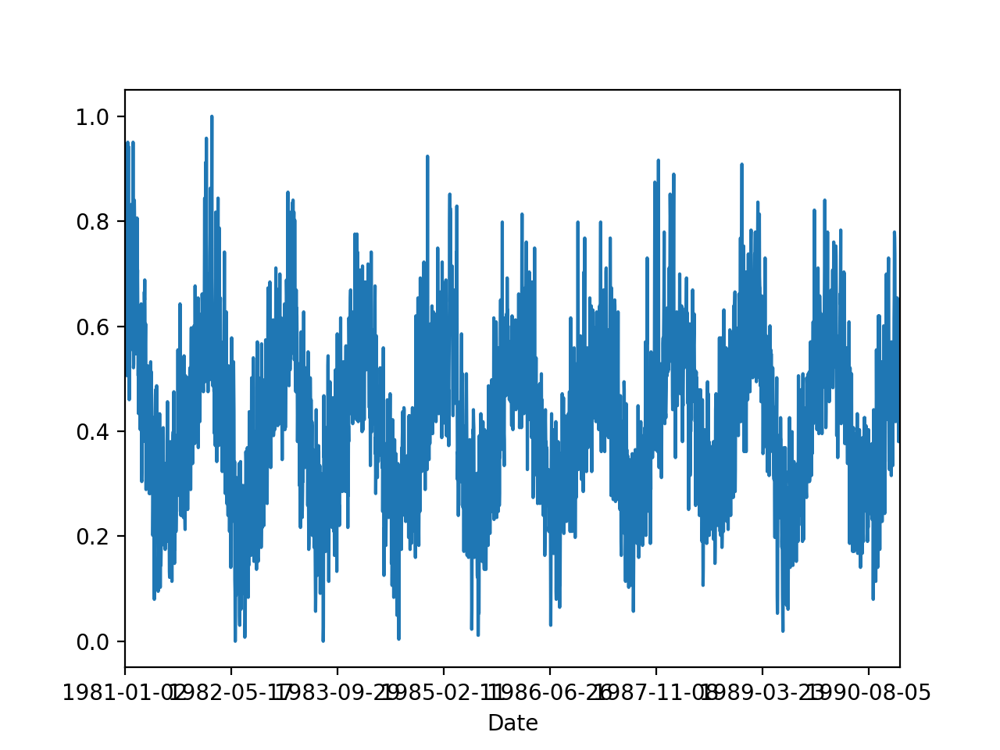


```python
inversed.plot()
```

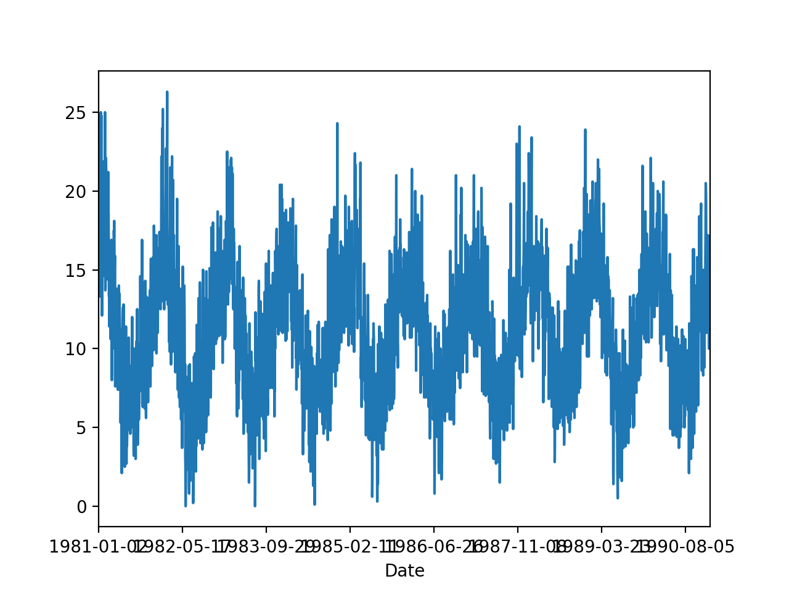


### 归一化

把数据映射到 `$[0, 1]$` 范围之内进行处理，可以更加便捷快速。具体公式如下：

`$$\hat{x}_{t} = \frac{x_{t} - min(\{x_{t}\}_{t}^{T})}{max(\{x_{t}\}_{t}^{T}) - min(\{x_{t}\}_{t}^{T})}$$`

### 平均归一化

`$$\hat{x}_{t} = \frac{x_{t} - mean(\{x_{t}\}_{t}^{T})}{max(\{x_{t}\}_{t}^{T}) - min(\{x_{t}\}_{t}^{T})}$$`

### 什么时候用归一化？什么时候用标准化？

* 如果对输出结果范围有要求，用归一化
* 如果数据较为稳定，不存在极端的最大最小值，用归一化
* 如果数据存在异常值和较多噪音，用标准化，可以间接通过中心化避免异常值和极端值的影响

## 定量特征二值化

如果不需要数据的连续信息，只需要对定量的特征进行“好与坏”的划分，
可以使用定量特征二值化来剔除冗余信息

举个例子，银行对 5 名客户的征信进行打分，分别为 50，60，70，80，90。
现在，不在乎一个人的征信多少分，只在乎他的征信好与坏（如大于 90 为好，低于 90 就不好）；
再比如学生成绩，大于 60 及格，小于 60 就不及格。这种“好与坏”、
“及格与不及格”的关系可以转化为 0-1 变量，这就是二值化。变化方式如下所示：

`$$\begin{cases}
\hat{x}_{t} = 1, x_{t} > threshold \\
\hat{x}_{t} = 0, x_{t} \leq threshold
\end{cases}$$`

也可以设计更多的规则，进行多值化的处理


# 时间序列分类特征

分类特征一般结合具体的任务，比如时序预测，时序分类等，常常有标签（Label）信息来引导，
其分析的特征也为具体的任务所服务，是一类常用的特征分析方法，
一般通过机器学习中的有监督方式进行抽取

## 字典特征

> BoP

字典方法旨在将时间序列通过变换，找到划分的阈值，进而将每个时序实值划分开，
对应到某个字母表中。其通过滑动窗提取不同“单词”的出现频率，作为分类依据。
这种方法的优势在于速度很快，而且抗噪效果好，缺点在于会损失很多有效的时序信息，
只能进行粗粒度的时序分类分析


## 形态特征(Shapelet)

形态方法旨在捕捉时间序列分类任务中作为分类依据的有代表性的子序列形状。
2012 年提出的 Shapelet 方法就是搜索这些候选的子序列形状以找到分类的依据，
因为在真实世界中的时间序列往往存在有特征明显的形状，
例如心电图数据一次正常心跳简化一下就是前后两个小的峰中间加一个高峰，
那么如果其中缺了一块形状的话，可能就是作为鉴别异常心跳的依据

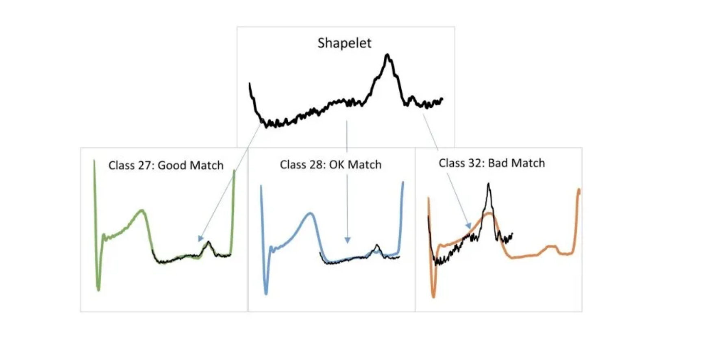


# 参考

* [时间序列特征工程](https://mp.weixin.qq.com/s?__biz=Mzg3NDUwNTM3MA==&mid=2247485154&idx=1&sn=e2b24a279902b6ddee1c3b83a9e3dd56&chksm=cecef317f9b97a01b86245fc7a8797b7618d752fdf6a589733bef3ddd07cb70a30f78b538899&cur_album_id=1588681516295979011&scene=189#wechat_redirect)
* [主成分分析](https://mp.weixin.qq.com/s?__biz=MjM5MjAxMDM4MA==&mid=2651890105&idx=1&sn=3c425c538dacd67b1732948c5c015b46&scene=21#wechat_redirect)
* [单时间变量特征](https://mp.weixin.qq.com/s?__biz=Mzk0NDE5Nzg1Ng==&mid=2247494531&idx=1&sn=da6bf51fa17b4d24bf568d1c21c56ffa&chksm=c32af20cf45d7b1ab7d11ef9649b0af8d72ae5f34814a5ebd7cb00210c3d70d36d66d2fc4b0b&scene=21#wechat_redirect)
* [时间序列之峰值特征](https://mp.weixin.qq.com/s?__biz=Mzk0NDE5Nzg1Ng==&mid=2247502097&idx=1&sn=6ee594a0d6d706d865cd0609f9ee353b&chksm=c32ad09ef45d598815973158782708cb1640294168664b298a18cf4c66d59c87e16f0dba041b&scene=178&cur_album_id=1698941448517173254#rd)
* [scipy.signal.find_peaks](https://docs.scipy.org/doc/scipy/reference/generated/scipy.signal.find_peaks.html)

