<style>
details {
    border: 1px solid #aaa;
    border-radius: 4px;
    padding: .5em .5em 0;
}
summary {
    font-weight: bold;
    margin: -.5em -.5em 0;
    padding: .5em;
}
details[open] {
    padding: .5em;
}
details[open] summary {
    border-bottom: 1px solid #aaa;
    margin-bottom: .5em;
}
img {
    pointer-events: none;
}
</style>

<details><summary>目录</summary><p>

- [传统时序预测方法的问题](#传统时序预测方法的问题)
- [时间序列的机器学习预测](#时间序列的机器学习预测)
- [时间序列初始数据集](#时间序列初始数据集)
  - [单变量序列](#单变量序列)
  - [多变量序列](#多变量序列)
- [时间序列数据集处理](#时间序列数据集处理)
  - [截面数据](#截面数据)
  - [时间序列数据](#时间序列数据)
- [时间序列特征工程](#时间序列特征工程)
  - [滞后特征](#滞后特征)
  - [时间特征](#时间特征)
  - [滑动窗口统计特征](#滑动窗口统计特征)
  - [扩展窗口统计特征](#扩展窗口统计特征)
  - [静态特征](#静态特征)
- [时间序列交叉验证](#时间序列交叉验证)
  - [滑动窗口](#滑动窗口)
  - [扩展窗口](#扩展窗口)
- [时间序列模型构建](#时间序列模型构建)
- [预测方法介绍](#预测方法介绍)
- [模型参数](#模型参数)
- [按输入变量区](#按输入变量区)
  - [单变量预测](#单变量预测)
  - [多变量预测](#多变量预测)
    - [独立的多序列预测](#独立的多序列预测)
    - [相关多序列预测](#相关多序列预测)
- [按预测步长](#按预测步长)
  - [单步预测](#单步预测)
  - [多步预测](#多步预测)
    - [直接多输出预测](#直接多输出预测)
    - [递归多步预测](#递归多步预测)
    - [直接多步预测](#直接多步预测)
      - [只使用一个模型](#只使用一个模型)
      - [使用 n 个模型](#使用-n-个模型)
      - [使用 1~n 个模型](#使用-1n-个模型)
    - [直接递归混合预测](#直接递归混合预测)
      - [混合一](#混合一)
      - [混合二](#混合二)
      - [混合三](#混合三)
    - [Seq2Seq 多步预测](#seq2seq-多步预测)
- [按目标个数](#按目标个数)
  - [一元预测](#一元预测)
  - [多元预测](#多元预测)
  - [递归多元预测](#递归多元预测)
  - [多重预测](#多重预测)
- [回测预测模型](#回测预测模型)
  - [重新拟合并增加训练规模](#重新拟合并增加训练规模)
  - [重新拟合并固定训练规模](#重新拟合并固定训练规模)
  - [不重新拟合](#不重新拟合)
  - [重新拟合并带有间隙](#重新拟合并带有间隙)
- [参考文章](#参考文章)
</p></details><p></p>

# 传统时序预测方法的问题

1. 对于时序本身有一些性质上的要求，需要结合预处理来做拟合，不是端到端的优化
2. 需要对每条序列做拟合预测，性能开销大，数据利用率和泛化能力堪忧，无法做模型复用
3. 较难引入外部变量，例如影响销量的除了历史销量，还可能有价格，促销，业绩目标，天气等等
4. 通常来说多步预测能力比较差

正因为这些问题，实际项目中一般只会用传统方法来做一些 baseline，
主流的应用还是属于下面要介绍的机器学习方法

# 时间序列的机器学习预测

做时间序列预测，传统模型最简便，比如 Exponential Smoothing 和 ARIMA。
但这些模型一次只能对一组时间序列做预测，比如预测某个品牌下某家店的未来销售额。
而现实中需要面对的任务更多是：预测某个品牌下每家店的未来销售额。
也就是说，如果这个品牌在某个地区一共有 100 家店，那我们就需要给出这100家店分别对应的销售额预测值。
这个时候如果再用传统模型，显然不合适，毕竟有多少家店就要建多少个模型

而且在大数据时代，我们面对的数据往往都是高维的，如果仅使用这些传统方法，很多额外的有用信息可能会错过

所以，如果能用机器学习算法对这 “100家店” 一起建模，那么整个预测过程就会高效很多。
但是，用机器学习算法做时间序列预测，处理的数据会变得很需要技巧。
对于普通的截面数据，在构建特征和分割数据（比如做 K-fold CV）的时候不需要考虑时间窗口。
而对于时间序列，时间必须考虑在内，否则模型基本无效。因此在数据处理上，后者的复杂度比前者要大

时间序列数据转换为监督学习数据：


# 时间序列初始数据集


对于时间序列数据来说，训练集即为历史数据，测试集即为新数据。历史数据对应的时间均在时间分割点之前，
新数据对应的时间均在分割点之后。历史数据和新数据均包含 `$N$` 维信息（如某品牌每家店的地理位置、销售的商品信息等），
但前者比后者多一列数据：预测目标变量(Target/Label)，即要预测的对象(如销售额)

基于给出的数据，预测任务是：根据已有数据，预测测试集的 Target（如，
根据某品牌每家店 2018 年以前的历史销售情况，预测每家店 2018 年 1 月份头 15 天的销售额）

## 单变量序列

> 自回归

## 多变量序列

> 协变量

# 时间序列数据集处理

在构建预测特征上，截面数据和时间序列数据遵循的逻辑截然不同

## 截面数据

首先来看针对截面数据的数据处理思路：


对于截面数据来说，训练集数据和测试集数据在时间维度上没有区别，
二者唯一的区别是前者包含要预测的目标变量，而后者没有该目标变量

一般来说，在做完数据清洗之后，用 “N 维数据” 来分别给训练集、测试集构建预测特征，
然后用机器学习算法在训练集的预测特征和 Target 上训练模型，
最后通过训练出的模型和测试集的预测特征来计算预测结果（测试集的 Target）。
此外，为了给模型调优，一般还需要从训练集里面随机分割一部分出来做验证集

## 时间序列数据

时间序列的处理思路则有所不同，时间序列预测的核心思想是：用过去时间里的数据预测未来时间里的 Target：


所以，在构建模型的时候，首先，将所有过去时间里的数据，即训练集里的 N 维数据和 Target 都应该拿来构建预测特征。
而新数据本身的 N 维数据也应该拿来构建预测特征。前者是历史特征（对应图上的预测特征 A），后者是未来特征（对应图上的预测特征 B），
二者合起来构成总预测特征集合。最后，用预测模型和这个总的预测特征集合来预测未来 Target

看到这里，一个问题就产生了：既然所有的数据都拿来构建预测特征了，那预测模型从哪里来？没有 Target 数据，模型该怎么构建？

你可能会说，那就去找 Target 呗。对，没有错。但这里需要注意，我们要找的不是未来时间下的 Target（毕竟未来的事还没发生，根本无从找起），
而是从过去时间里构造 “未来的” Target，从而完成模型的构建。这是在处理时间序列上，逻辑最绕的地方

# 时间序列特征工程

## 滞后特征

> Lags Features

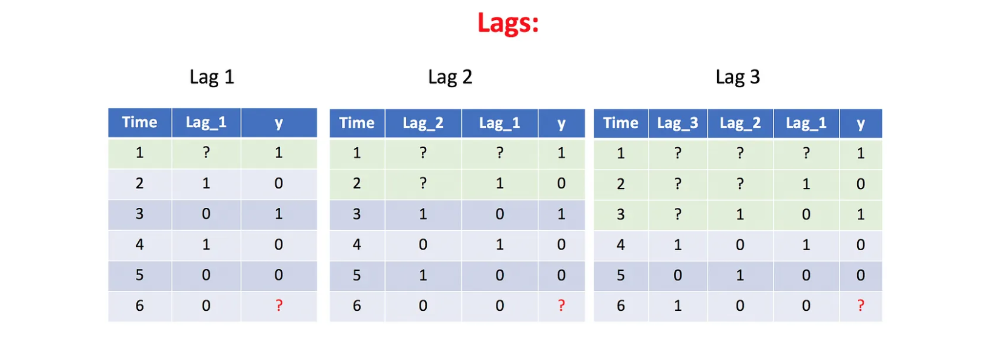

## 时间特征

## 滑动窗口统计特征

## 扩展窗口统计特征

## 静态特征

# 时间序列交叉验证


## 滑动窗口

> Sliding Window

## 扩展窗口

> Forward Chaining

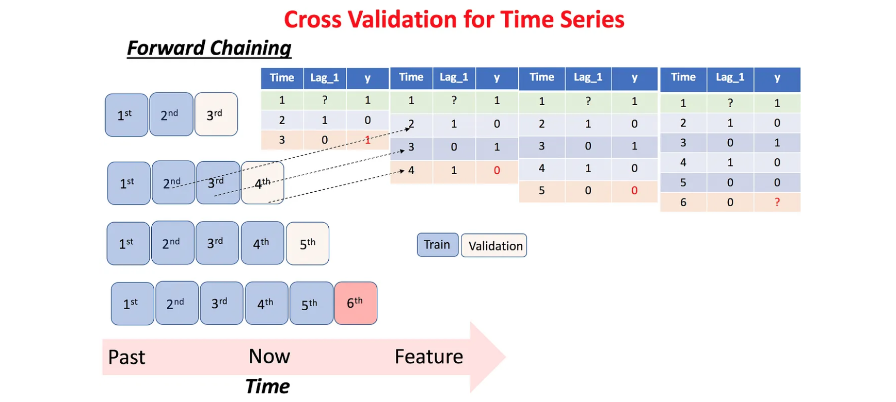

# 时间序列模型构建

用机器学习算法构造时间序列预测模型，关键的思路在于，通过时间滑窗，人为地构造 “未来” Target，来给算法进行学习

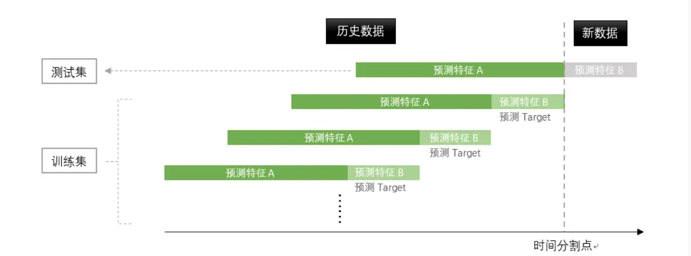

和之前一样，从时间的角度上来看，有历史数据和新数据。但这里，不能简单地把历史数据作为训练集、把新数据作为测试集

1. 首先，在历史数据上，通过截取不同时间窗口的数据来构造一组或几组数据
    - 比如，历史数据是 2017 年 1 月到 12 月每家店每天的销售数据，那么可以截取 3 组数据（见上图的深绿、浅绿部分）：
        - 2017 年 1 月到 10 月的数据
        - 2017 年 2 月到 11 月的数据
        - 2017 年 3 月到 12 月的数据
2. 然后，人为地给每组数据划分历史窗口（对应上图的深绿色部分）和未来窗口（对应上图的浅绿色部分）
    - 比如，对于 2017 年 1 月到 10 月的数据，把 1 月到 9 月作为历史窗口，10 月作为未来窗口，以此类推
3. 接着，分别给每组数据构建预测特征，包括历史特征（预测特征 A）和未来特征（预测特征 B）。
   而此时，每组数据还有预测 Target

这个时候，把得到的所有预测特征（例子里是三组预测特征）都合并起来作为训练集特征、
把所有预测 Target（例子里是三组预测 Target）合并起来作为训练集 Target，之后就可以构建机器学习模型了

有了训练集和训练模型，还差测试集。测试集的构建遵循之前的数据处理逻辑，拿历史数据构建历史特征，
拿新数据构建未来特征，然后把这些特征加入到从训练集上训练出的预测模型中去，即可得到任务需要的最终预测值。
这里需要注意，划多少个时间窗口因数据而异。此外，数据的历史窗口（图上深绿部分）和未来窗口（图上浅绿部分）可以是定长也可以是变长，
看具体情况


# 预测方法介绍

机器学习方法处理时间序列问题的基本思路就是吧时间序列切分成一段历史训练窗口和未来的预测窗口，
对于预测窗口中的每一条样本，基于训练窗口的信息来构建特征，转化为一个表格类预测问题来求解

也会看到一些额外加入时序预处理步骤的方法，比如先做 STL 分解再做建模预测。
尝试下来这类方法总体来说效果并不明显，但对于整个 pipeline 的复杂度却有较大的增加，
对于 AutoML、模型解释等工作都造成了一定的困扰，所以实际项目中应用的也比较少


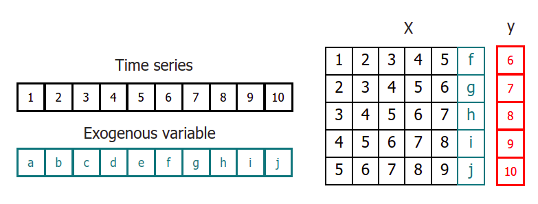


# 模型参数

实际场景中，一般需要确定几个参数：

1. 历史窗口的大小(history length)
    - 即预测未来时，要参考过去多少时间的信息作为输入。太少可能信息量不充分，
      太多则会引入早期不相关的信息(比如疫情前的信息可能目前就不太适用了)
2. 预测点间隔的大小(predict gap)
    - 即预测未来时，是从 T+1 开始预测，还是 T+2，T+3，这与现实的业务场景有关。
      例如像补货场景，预测 T+1 的销量，可能已经来不及下单补货了，
      所以需要扩大这个提前量，做 T+3 甚至更多提前时间的预测
3. 预测窗口的大小(predict length)
    - 即需要连续预测多长的未来值。比如从 T+1 开始一直到 T+14 都需要预测输出。
      这一点也跟实际的业务应用场景有关

# 按输入变量区

## 单变量预测

> 自回归预测

在单变量时间序列预测中，单个时间序列被建模为其滞后的线性或非线性组合，其中该序列的过去值用于预测其未来

* ARIMA
* ...

## 多变量预测

> Multi-time series forecasting

多元时间序列，即每个时间有多个观测值：

`$$\{X_{t} = (x_{t}^{a}, x_{t}^{b}, x_{t}^{c}, \ldots)\}_{t}^{T}$$`

这意味着通过不同的测量手段得到了多种观测值，并且希望预测其中的一个或几个值。
例如，可能有两组时间序列观测值 `$\{x_{t-1}^{a}, x_{t-2}^{a}, \ldots\}$`，
`$\{x_{t-1}^{b}, x_{t-2}^{b}, \ldots\}$`，希望分析这组多元时间序列来预测 `$x_{t}^{a}$` 

基于以上场景，许多监督学习的方法可以应用在时间序列的预测中，
在运用机器学习模型时，可以把时间序列模型当成一个回归问题来解决，
比如 svm/xgboost/逻辑回归/回归树/...

在多序列预测中，两个或多个时间序列使用单个模型一起建模。多系列预测有两种不同的策略

### 独立的多序列预测

> Independent Multi-Series Forecasting

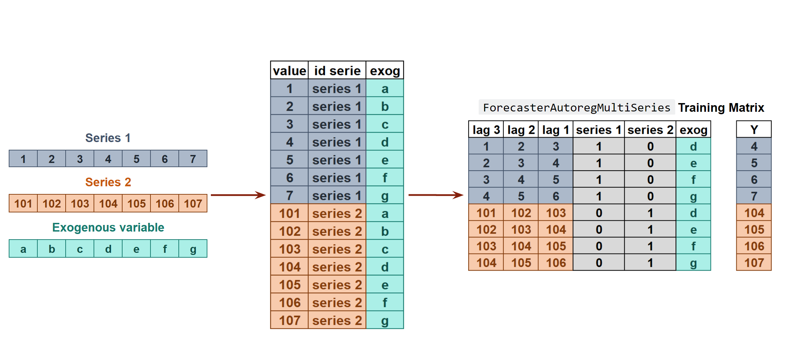

为了预测未来的 `$n$` 步，应该用递归多步预测策略

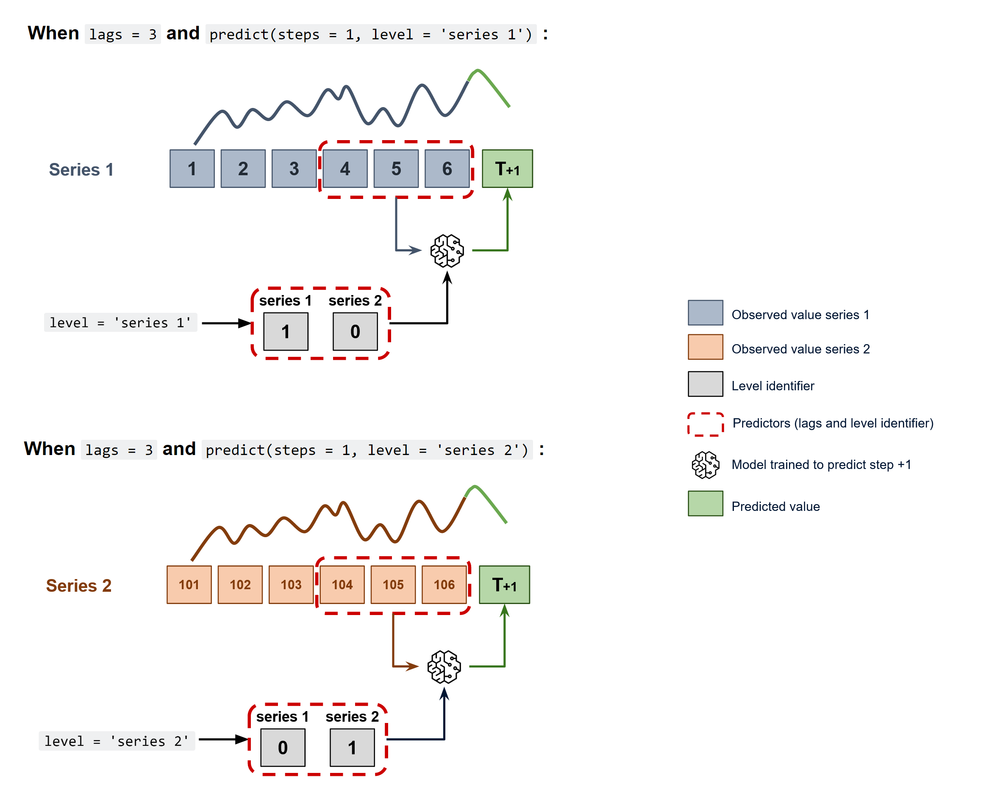

### 相关多序列预测

> Dependent Multi-Series Forecasting(Multivariate time series)

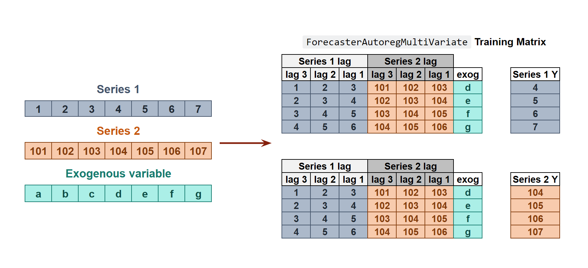


# 按预测步长

## 单步预测

所谓单步预测，就是每一次预测的时候输入窗口只预测未来的一个值。
在时间序列预测中的标准做法是使用滞后的观测值 `$x_{t}$` 作为输入变量来预测当前的时间的观测值 `$x_{t+1}$`

单步预测的两个策略：

* 滑动窗口(推荐)
* 扩展窗口

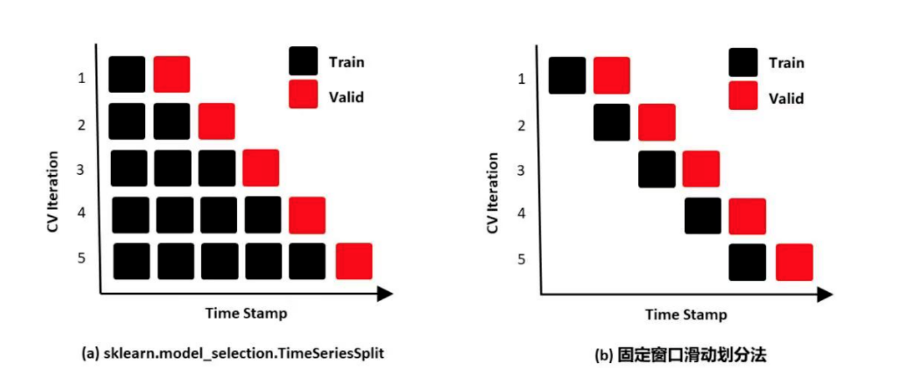


## 多步预测

大多数预测问题都被定义为单步预测，根据最近发生的事件预测系列的下一个值。
时间序列多步预测需要预测未来多个值，提前预测许多步骤具有重要的实际优势，
多步预测减少了长期的不确定性。但模型试图预测更远的未来时，模型的误差也会逐渐增加

所谓多步预测就是利用过去的时间数据来预测未来多个状态的时序数据，举个例子就是利用过去 30 天的数据来预测未来 2 天的数据

对于时间序列多步预测常用的解决方案有 5 种：

* 直接多输出预测
* 递归多步预测(单步滚动预测)
    - 扩展窗口
    - 滑动窗口(推荐)
* 直接多步预测(多模型单步预测)
* 直接递归混合预测(多模型滚动预测)
* Seq2Seq 多步预测

为了方便讲解不同的多步预测策略，假设原始时间序列数据位 `$\{t1, t2, t3, t4, t5\}$`，这是已知的数据，
需要预测未来两天的状态 `$\{t6, t7\}$`

### 直接多输出预测

> Direct Multi-Output Forecasting

某些机器学习模型，例如长短期记忆（LSTM）神经网络，可以同时预测一个序列的多个值（一次性预测）。
对于这个策略是比较好理解与实现的，就是训练一个模型，对于深度学习，只不过需要在模型最终的线性层设置为两个输出神经元即可。
而对于机器学习，需要在预测时连续预测两个值

正常单输出预测，预测未来一个时刻的模型最终的输出层为 `Linear(hidden_size, 1)`，
对于直接多步预测修改输出层为 `Linear(hidden_size, 2)` 即可，最后一层的两个神经元分别预测 `$\{t6, t7\}$`


定义的模型结构状态为：

`$$\{t1, t2, t3, t4, t5\} \Rightarrow \{t6, t7\}$$` 

对于这种策略优点就是预测 `$t6$` 和 `$t7$` 是独立的，不会造成误差累积，因为两个预测状态会同时通过线性层进行预测，
`$t7$` 的预测状态不会依赖 `$t6$`；

那么缺点也很显然，就是两个状态独立了，但是现实是因为这是时序预测问题，
`$t7$` 的状态会受到 `$t6$` 的状态所影响，如果分别独立预测，`$t7$` 的预测状态会受影响，造成信息的损失

### 递归多步预测

> Recursive Multi-Step Forecasting

递归多步预测就是利用递归方式进行预测未来状态，该策略会训练一个模型，然后依次按照时序递归进行预测，
先利用已知时序数据预测 `$t6$`，然后再滑动一个窗口，利用刚刚预测出的 `$t6$` 去预测 `$t7$` 的状态

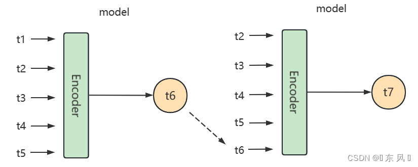


定义的模型结构状态为：

`$$\{t1, t2, t3, t4, t5\} \Rightarrow \{t6\}$$`
`$$\{t2, t3, t4, t5, t6\} \Rightarrow \{t7\}$$`

这种实现策略的优点就是解决了上个策略中 `$t6$` 和 `$t7$` 的独立性，再预测 `$t7$` 的状态时考虑到了 `$t6$` 的状态信息

但是这种策略也会存在缺点就是因为是递归预测，会导致误差累积，举个例子，如果模型在预测 `$t6$` 的过程中出现了偏差，
导致 `$t6$` 的预测结果异常，然后模型会拿着 `$t6$` 的值去预测 `$t7$`，这就会导致 `$t7$` 的预测结果进一步产生误差，
也就是会导致误差累积效应。

还有一个缺点就是该种实现策略利用递归策略，不断滑动窗口拿着刚刚预测出来的值预测下一个值，
会导致性能降低，无法同时预测 `$t6$` 和 `$t7$` 的状态

### 直接多步预测

> Direct Multi-Step Forecasting

直接多步预测意如其名，就是直接输出未来两天的状态，注意一下，不要与直接多输出预测混淆，不同于直接多输出预测，
该策略会同时训练两个模型，其中一个模型用于预测 `$t6$`，另一个模型用于预测 `$t7$`，也就是要预测多个未来状态，就需要训练多个模型


定义的模型结构状态为：

`model_t6`：`$$\{t1, t2, t3, t4, t5\} \Rightarrow \{t6\}$$`
`model_t7`：`$$\{t1, t2, t3, t4, t5\} \Rightarrow \{t7\}$$`

这种实现策略会有一定的缺点，由于是要多步预测，那么就需要训练对应输出数目的模型，如果要预测未来 10 个时刻的状态，
那么就需要训练 10 个模型，会导致计算资源消耗严重；

第二个缺点就是没有考虑到 `$t6$` 和 `$t7$` 的时序相关性，因为 `$t7$` 的状态会受到 `$t6$` 的状态影响，
这种实现策略会独立训练两个模型，所以预测 `$t7$` 的模型缺少了 `$t6$` 的信息状态，造成信息损失

#### 只使用一个模型

举个例子，现有 7 月 10 号到 7 月 14 号的数据，需要预测未来 3 天的销量，那么，就不能用 lag1 和 lag2 作为特征，
但是可以用 lag3，所以就用 lag3 作为特征构建一个模型：


这种是只使用一个模型来预测的，但是呢，缺点是特征居然要构造到 lag3，lag1 和 lag2 的信息完全没用到，
所以就有人提出了一种思路，就是对于每一天都构建一个模型

#### 使用 n 个模型

这个的思路呢，就是想能够尽可能多的用到 lag 的信息，所以，对于每一天都构建一个模型，比如对于 15 号，构建模型 1，
使用了 lag1、lag2 和 lag3 作为特征来训练，然后对于 16 号，因为不能用到 lag1 的信息了，但是 lag2 和 lag3 还是能用到的，
所以就用 lag2 和 lag3 作为特征，再训练一个模型 2，17 号的话，就只有 lag3 能用了，所以就直接用 lag3 作为特征来训练一个模型 3，
然后模型 1、模型 2、模型 3 分别就可以输出每一天的预测值了


这种方法的优势是最大可能的用到了 lag 的信息，但是缺陷也非常明显，就是因为对于每一天都需要构建一个模型的话，
那预测的天数一长，数据一多，那计算量是没法想象的，所以也有人提出了一个这种的方案，就不是对每一天构建一个模型了，
而是每几天构建一个模型

#### 使用 1~n 个模型

还是上面那个例子，这次把数据改变一下，预测四天吧，有 10 号到 14 号的数据，构建了 lag1-5 的特征，
需要预测 16 号到 19 号的数据，那么我们知道 16 号和 17 号是都可以用到 lag2、lag3、lag4 和 lag5 的特征的，
那么为这两天构建一个模型 1，而 18 号和 19 号是只能用到 lag4 和 lag5 的特征的，那么为这两天构建一个模型 2，
所以最后就是模型 1 输出 16 号和 17 号的预测值，模型 2 输出 18 号和 19 号的值


可以发现，这样的话，我们虽然没有尽最大可能的去使用 lag 特征，但是，计算量相比于使用 n 个模型直接小了一半

### 直接递归混合预测

> Direct Recursive Hybrid Forecasting

直接递归混合预测策略融合了递归多步预测和直接多步预测两种策略，它会分别训练两个模型，分别用于预测 `$t6$`、`$t7$`，
与直接多步预测不同的是在预测 `$t7$` 利用到了预测 `$t6$` 模型的输出结果，即 `$t6$` 的预测结果

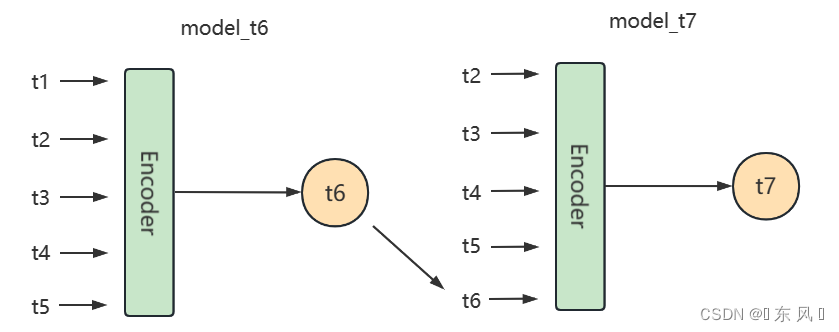

定义的模型结构状态为：

`model_t6`：`$$\{t1, t2, t3, t4, t5\} \Rightarrow \{t6\}$$`
`model_t7`：`$$\{t1, t2, t3, t4, t5\} \Rightarrow \{t7\}$$`

这种方式的优点就是解决了直接多步预测的信息独立问题，在预测 `$t7$` 的过程中考虑到了 `$t6$` 的状态，
但缺点跟直接多步预测策略一样，由于是要多步预测，那么就需要训练对应输出数目的模型，如果要预测未来 10 个时刻的状态，
那么就需要训练 10 个模型，会导致计算资源消耗严重

#### 混合一

同时使用直接法和递归法，分别得出一个预测值，然后做个简单平均，这个思路也就是采用了模型融合的平均法的思想，
一个高方差，一个高偏差，那么我把两个合起来取个平均方差和偏差不就小了吗

#### 混合二

这种方法是这篇论文提出的：《Recursive and direct multi-step forecasting: the best of both worlds》，有兴趣可以自己去读下，
大概说的就是先使用递归法进行预测，然后再用直接法去训练递归法的残差，有点像 boosting 的思想，论文花了挺大篇幅说了这种方法的无偏性，
不过，这种方法也就是存在论文中，暂时没见到人使用，具体效果还不知道

#### 混合三

简单来说就是使用到了所有的 lag 信息，同时也建立了很多模型，还是这个例子，首先用 10 号到 14 号的数据训练模型 1，
得到 15 号的预测值，然后将 15 号的预测值作为 16 号的特征，同时用 10 号到 15 号的数据训练模型 2，得到 16 号的预测值，
最后使用 16 号的预测值作为 17 号的特征，使用 10 号到 16 号的数据训练模型 3，得到 17 号的预测值


这种方法说实话还不知道他的好处在哪，相比于递归预测法，不就是训练时多了几条数据吗？还是会有误差累计的问题吧

### Seq2Seq 多步预测

> Seq2Seq Multi-Step Forecasting

Seq2Seq 实现策略与直接多输出预测一致，不同之处就是这种策略利用到了 Seq2Seq 这种模型结果，
Seq2Seq 实现了序列到序列的预测方案，由于多步预测的预测结果也是多个序列，所以问题可以使用这种模型架构


定义的模型结构状态为：

`$$\{t1, t2, t3, t4, t5\} \Rightarrow \{t6, t7\}$$` 

对于这种模型架构相对于递归预测效率会高一点，因为可以并行同时预测 `$t6$` 和 `$t7$` 的结果，
而且对于这种模型架构可以使用更多高精度的模型，例如：Bert、Transformer、Attention 等多种模型作为内部的组件

# 按目标个数

## 一元预测

## 多元预测

多目标回归为每一个预测结果构建一个模型，如下是一个使用案例：

```python
from sklearn.multioutput import MultiOutputRegressor

direct = MultiOutputRegressor(LinearRegression())
direct.fit(X_tr, Y_tr)
direct.predict(X_test)
```

scikit-learn 的 `MultiOutputRegressor` 为每个目标变量复制了一个学习算法。
在这种情况下，预测方法是 `LinearRegression`。此种方法避免了递归方式中错误传播，
但多目标预测需要更多的计算资源。此外多目标预测假设每个点是独立的，这是违背了时序数据的特点

## 递归多元预测

递归多目标回归结合了多目标和递归的思想。为每个点建立一个模型。
但是在每一步的输入数据都会随着前一个模型的预测而增加

```python
from sklearn.multioutput import RegressorChain

dirrec = RegressorChain(LinearRegression())
dirrec.fit(X_tr, Y_tr)
dirrec.predict(X_test)
```

这种方法在机器学习文献中被称为 chaining。scikit-learn 通过 `RegressorChain` 类为其提供了一个实现

## 多重预测

# 回测预测模型

在时间序列预测中，回测是指使用历史数据验证预测模型的过程。该技术涉及逐步向后移动，
以评估如果在该时间段内使用模型进行预测，该模型的表现如何。回溯测试是一种交叉验证形式，
适用于时间序列中的先前时期。

回测的目的是评估模型的准确性和有效性，并确定任何潜在问题或改进领域。通过在历史数据上测试模型，
可以评估它在以前从未见过的数据上的表现如何。这是建模过程中的一个重要步骤，因为它有助于确保模型稳健可靠。

回测可以使用多种技术来完成，例如简单的训练测试拆分或更复杂的方法，如滚动窗口或扩展窗口。
方法的选择取决于分析的具体需要和时间序列数据的特点。

总的来说，回测是时间序列预测模型开发中必不可少的一步。通过在历史数据上严格测试模型，
可以提高其准确性并确保其有效预测时间序列的未来值。

## 重新拟合并增加训练规模

> 扩展窗口
> 
> Backtesting with refit and increasing training size (fixed origin)

在这种方法中，模型在每次做出预测之前都经过训练，并且在训练过程中使用到该点的所有可用数据。
这不同于标准交叉验证，其中数据随机分布在训练集和验证集之间。

这种回测不是随机化数据，而是按顺序增加训练集的大小，同时保持数据的时间顺序。
通过这样做，可以在越来越多的历史数据上测试模型，从而更准确地评估其预测能力


## 重新拟合并固定训练规模

> 滚动窗口
> 
> Backtesting with refit and fixed training size (rolling origin)

在这种方法中，模型是使用过去观察的固定窗口进行训练的，测试是在滚动的基础上进行的，训练窗口会及时向前移动。
训练窗口的大小保持不变，允许在数据的不同部分测试模型。当可用数据量有限或数据不稳定且模型性能可能随时间变化时，
此技术特别有用。也称为时间序列交叉验证或步进验证


## 不重新拟合

> Backtesting without refit

没有重新拟合的回测是一种策略，其中模型只训练一次，并且按照数据的时间顺序连续使用而不更新它。
这种方法是有利的，因为它比其他每次都需要重新训练模型的方法快得多。
然而，随着时间的推移，该模型可能会失去其预测能力，因为它没有包含最新的可用信息


## 重新拟合并带有间隙

> Backtesting including gap

这种方法在训练集和测试集之间引入了时间间隔，复制了无法在训练数据结束后立即进行预测的场景。

例如，考虑预测 D+1 日 24 小时的目标，但需要在 11:00 进行预测以提供足够的灵活性。
D 天 11:00，任务是预测当天的 [12-23] 小时和 D+1 天的 [0-23] 小时。
因此，必须预测未来总共 36 小时，只存储最后 24 小时

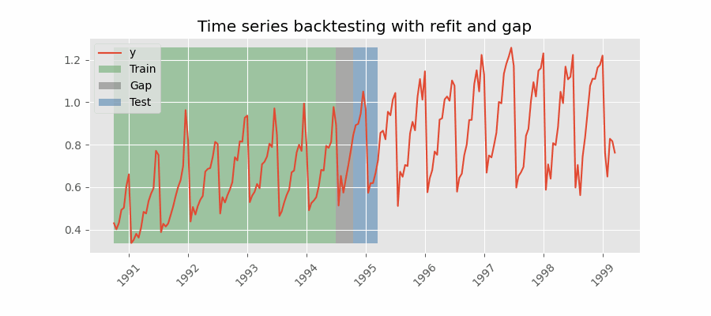

# 参考文章

* [机器学习多步时间序列预测解决方案](https://aws.amazon.com/cn/blogs/china/machine-learning-multi-step-time-series-prediction-solution/)
* [时间序列多步预测经典方法总结](https://weibaohang.blog.csdn.net/article/details/128754086)
* [时间序列的多步预测方法总结](https://zhuanlan.zhihu.com/p/390093091)
* [skforecast 时序预测库](https://mp.weixin.qq.com/s/61MUqOZvQcNHtFnjyQMaQg)
* [sktime 时序预测库](https://github.com/sktime/sktime)
* [Time Series Forecasting as Supervised Learning](https://machinelearningmastery.com/time-series-forecasting-supervised-learning/)
* [How to Convert a Time Series to a Supervised Learning Problem in Python](https://machinelearningmastery.com/convert-time-series-supervised-learning-problem-python/)
* [How To Resample and Interpolate Your Time Series Data With Python](https://machinelearningmastery.com/resample-interpolate-time-series-data-python/)
* [Multistep Time Series Forecasting with LSTMs in Python](https://machinelearningmastery.com/multi-step-time-series-forecasting-long-short-term-memory-networks-python/)
* [Machine Learning Strategies for Time Series Forecasting](https://link.springer.com/chapter/10.1007%2F978-3-642-36318-4_3)
* [Machine Learning Strategies for Time Series Forecasting. Slide](http://di.ulb.ac.be/map/gbonte/ftp/time_ser.pdf)
* [Machine Learning for Sequential Data: A Review](http://web.engr.oregonstate.edu/~tgd/publications/mlsd-ssspr.pdf)
* [如何用Python将时间序列转换为监督学习问题](https://cloud.tencent.com/developer/article/1042809)
* [时间序列预测](https://mp.weixin.qq.com/s?__biz=Mzg3NDUwNTM3MA==&mid=2247484974&idx=1&sn=d841c644fd9289ad5ec8c52a443463a5&chksm=cecef3dbf9b97acd8a9ededc069851afc00db422cb9be4d155cb2c2a9614b2ee2050dc7ab4d7&scene=21#wechat_redirect)
* [机器学习与时间序列预测](https://www.jianshu.com/p/e81ab6846214)
* [sktime.RecursiveTimeSeriesRegressionForecaster](https://www.sktime.org/en/stable/api_reference/auto_generated/sktime.forecasting.compose.RecursiveTimeSeriesRegressionForecaster.html)
* [机器学习多步时间序列预测解决方案](https://aws.amazon.com/cn/blogs/china/machine-learning-multi-step-time-series-prediction-solution/)
* [时间序列的多步预测方法总结](https://zhuanlan.zhihu.com/p/390093091)
