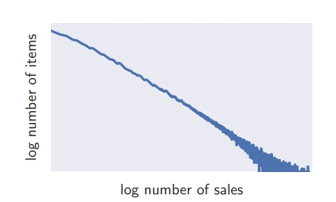
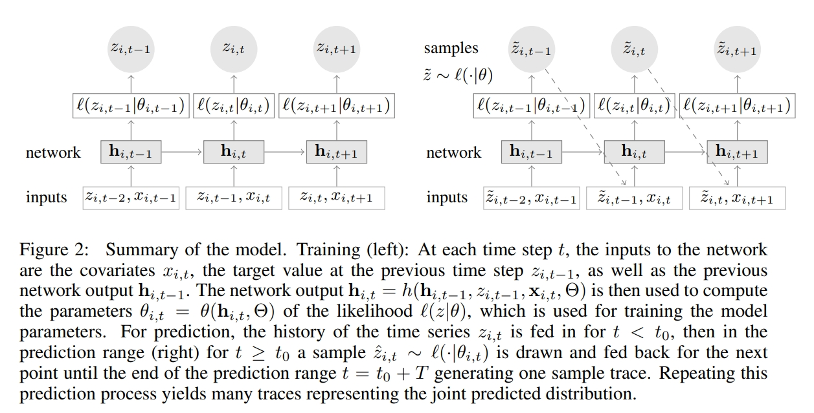

目录

- [论文简介](#论文简介)
- [历史研究和瓶颈](#历史研究和瓶颈)
- [论文贡献](#论文贡献)
- [模型定义](#模型定义)
- [总结](#总结)
- [资料](#资料)

# 论文简介

> * 题目：DeepAR: Probabilistic Forecasting with Autoregressive Recurrent Networks
> * 作者：亚马逊
> * 代码：https://github.com/husnejahan/DeepAR-pytorch
> * 简介：一种使用自回归 RNN 预测时序分布的模型 DeepAR，
>   它有效解决了多时序间尺度不一致问题，并基于数据特征选择似然函数预测时序概率分布。

# 历史研究和瓶颈

很多时候我们需要的并不是预测单条或少量的时间序列，而是要预测成千上万条时间序列，
例如对于 Amazon 来说，想预测它提供的各种产品的需求量。

* 一方面，如果用传统的方法如 ARIMA 模型一条条去建模预测的话会费时费力，
  那我们能否利用与某条时间序列类似的、相关的时间序列来辅助进行预测，从而节约时间和成本呢？
* 另一方面，在进行时间序列预测时，我们不仅仅需要未来时刻的一个点预测值，还需要一个预测概率。
  以商品销量为例，如果能告诉商家，下个月某产品的销量在 150~200 之间的概率超过 80%，
  显然比只提供某一个月销量的预测值更有意义。因此如果能提供概率预测，将能更好地满足现实需求。

此外，碰到大量时间序列数据需要建模预测时，常见的方法是通过人工分组的方式，
将量级相同的时间序列看作一组，然后分组拟合模型提供预测。
但是如果不同时间序列的量级相差很大时，分组将需要耗费大量的人工操作。
例如，下图显示了亚马逊的数百万件商品平均每周销量的分布，
可以明显看到不同商品的周销量近似服从幂律分布，有的商品销量非常高，但是有的商品销量很低。
对于这种百万数量级的时间序列进行人工分组，无疑工作量巨大。

> 有时，多条时间序列的幅度差异很大，
> 而且幅度分布可能强烈有偏（skew distribution）。由于幅度难找到分组标准，导致时序很难被分组建模。
> 历史有些 Normalization 做法，例如输入标准化或 Batch Normalizaiton，但效率不高。

比如，下图的销售量和销售额的幂律函数（一个量的相对变化会导致另一个量的相应幂次比例的变化）的双对数形式，
就有长尾表现：

# 论文贡献

DeepAR 提出一种方法解决时序幅度分布大的算法框架。相比于传统模型，DeepAR 的好处：

1. 引入协变量，通过学习季节性行为以及时间序列与协变量的依赖关系。减少人工特征工程去挖掘负责的组间依赖行为； 
2. 使用蒙特卡洛采样能估计未来概率分布的分位数，提供概率预测；
3. 通过学习相似走势，为历史数据量较少或根本没有历史数据的个体进行未来预测；
4. 噪声并不限制为高斯噪声，允许用户选择一个适合数据统计属性的噪声分布；
5. 允许基于数据统计性质，选择不同的似然函数。

DeepAR 的主要特色是：预测未来时序的分布和处理多条序列之间振幅对模型的影响，从而提高准确性。

# 模型定义

如果一句话概括 DeepAR, 可以认为它是**一个基于循环神经网络并能同时处理多条时间序列，
并以概率分布的方式提供预测的预测模型**。
用 `$z_{i,t}$` 表示第 `$i$` 条时间序列在时刻 `$t$` 的取值，目标是建立如下条件分布模型：

`$$P(\mathbb{z}_{i,t_{0}:T}|\mathbb{z}_{i,1:t_{0}-1}, \mathbb{x}_{i,1:T})$$`

其中：

* `$i$` 为时序 id
* `$t_{0}$` 为训练集和测试集的分割时间点，表示第一个需要预测的时刻；
* `$\mathbb{x}_{i, 1:T}$` 是时序的协变量。协变量要求已知，它可以是时间相关的，比如哪一年的第几个星期；
  也可以是与建模对象相关的，比如家庭用电量的每户家庭常住人口；
  还可以是与时间和建模对象都相关的，比如商品月销量数据对应的月份是否开展过促销活动。
* `$\mathbb{z}_{i,1:t_{0}-1} := [\mathbb{z}_{i,1}, \mathbb{z}_{i,2},\cdots,\mathbb{z}_{i,t_{0}-1}]$` 是 condition range(历史 1 到 `$t_{0}-1$`)的目标值
* `$\mathbb{z}_{i, t_{0}:T} := [\mathbb{z}_{i,t_{0}}, \mathbb{z}_{i,t_{0}+1},\cdots,\mathbb{z}_{i,T}]$` 是 prediction range(未来 `$t_{0}$` 到 `$T$` 时期)的目标值

给定时序 `$z_{i,t}$` 过去 `$t_{0}-1$` 个时刻的观测值 `$\mathbb{z}_{i,1:t_{0}-1}$`，
以及协变量 `$x_{i, 1:T}$`，我们想知道时间序列从 `$t_{0}$` 到 `$T$` 时刻的取值的概率。

DeepAR 的模型是自回归循环网络(autoregressive recurrent network)结构，
下图是 DeepAR 的 Encoder 和 Decoder(共享模型结构和参数)：

上图左边是训练过程，右边是预测过程，结构大致相同，唯一区别是预测阶段由于没有对应点的观察值，
需要把上一个时刻的预测值作为下一个时刻的输入值。

在上述过程中，`$h_{i,t} = \varphi(h_{i,t-1}, z_{i,t-1}, x_{i,t})$` 表示网络的隐藏状态，
`$\varphi$` 是由具有 LSTM 单元的多层递归神经网络实现的函数。
`$h_{i,0}$` 初始化为 0，`$z_{i,0}$` 也初始化为 0。可以看到，这个模型是自回归的，
这表现在 `$h_{i,t-1}$` 与 `$h_{i,t}$` 有关，`$z_{i,t}$` 也与 `$z_{i,t-1}$` 有关。

DeepAR 假设：

`$$\begin{align} 
P_{\theta}(z_{i,t_{0}:T} | z_{i,1:t_{0}-1}, x_{i,1:T}) 
&= \prod_{t=t_{0}}^{T}P_{\theta}(z_{i,t}|z_{i,1:t-1}, x_{i,1:T}) \\
&= \prod_{t=t_{0}}^{T}l(z_{i,t} | \theta(h_{i,t}, \Theta))
\end{align}$$`

即认为，每个时刻的数据都服从某种类型的分布，
当参数 `$\theta$` 由网络输出 `$h_{i,t}$` 的函数 `$\theta(h_{i,t}, \theta)$` 给出后，
似然函数 `$l(z_{i,t} | \theta(h_{i,t}, \theta))$` 就对应一个参数为 `$\theta$` 的固定分布中取值为 `$z_{i,t}$` 的概率或者概率密度。这个分布的选取要求匹配数据的统计学性质，文章中选择了两种分布：

* 对于连续型数据，比如居民用电量，可以认为它来自正态分布。
  当确定正态分布后，只需要给出均值 `$\mu$` 和方差 `$\sigma^{2}$` 即：

  `$$\mu(h_{i,t}) = w_{\mu}^{T}h_{i,t} + b_{\mu}\sigma(h_{i,t}) = ln(1+\text{exp}(w_{\sigma}^{T}h_{i,t} + b_{\sigma}))$$`

  进一步可以写出此时的似然函数为：

  `$$l_{\text{Norm}}(z_{i,t}|\theta(h_{i,t})) = (2 \pi \sigma^{2})^{-\frac{1}{2}} \text{exp}(-(z_{i,t}-\mu)^{2} / (2\sigma^{2}))$$`

* 对于计数型数据，比如商品销量这种非负整数值序列，可以认为它服从负二项分布。
  假设负二项分布为：`$X \sim \text{NB}(r,p)$`，`$r$` 为正整数，即伯努利试验第 `$r$` 次成功前失败的次数，
  `$p$` 为每次伯努利试验的成功概率。因此有 `$E(X) = \frac{r(1-p)}{p}$`，`$\text{Var}(X)=\frac{r(1-p)^{2}}{p}$`。
  对于 `$k=0,1,2,\cdots$`，可以写出 `$X$` 的概率为：`$P(X = k)=C_{r+k-1}^{k}p^{r}(1-p)^{k}$`。
  文章通过给出均值 `$\mu$` 和“形状参数” `$\alpha$` 来确定负二项分布。其中：

  `$$\mu(h_{i,t}) = \text{ln}(1+\text{exp}(w_{\mu}^{T} h_{i,t} + b_{\mu}))$$`
  `$$\alpha(h_{i,t}) = \text{ln}(1+\text{exp}(w_{\alpha}^{T}h_{i,t} + b_{\alpha}))$$`

为什么选择 `$\alpha$` 这个参数？文中解释是实验发现，相对而言这个参数收敛很快。
进一步可以得到此时的似然函数为：

`$$l_{\text{NB}}(z_{i,t} | \theta(h_{i,t})) = \frac{\Gamma(z_{i,t} + \frac{1}{\alpha})}{\Gamma(z_{i,t} + 1)\Gamma(\frac{1}{\alpha})}\Big(\frac{1}{1+\alpha\mu}\Big)^{1/ \alpha}\Big(\frac{\alpha \mu}{1+\alpha \mu}\Big)^{z_{i,t}}$$`

模型训练时的目标函数就是最大化对数似然：

`$$L = \sum_{i=1}^{N}\sum_{t=1}^{t_{0}-1}\text{ln}l(z_{i,t} | \theta(h_{i,t}))$$`

或者说需要极小化的损失函数就是 `$-L_{o}$`。注意 `$h_{i,t}=\varphi(h_{i,t-1}, z_{i,t-1}, x_{i,t}, \theta)$`, 
因此除去神经网络中计算 `$h_{i,t}$` 所需的参数和 `$\Theta$` 以外，所有信息都是可以观测到的，
因此极小化损失函数可以通过梯度下降法实现，得到合适的参数值。

另外，之前提到 DeepAR 可以处理存在规模量级差异的时间序列数据集, 文章主要采用了两个操作:

* 操作 1: 对于存在数据不平衡的情况。训练时如果均匀采样, 可能导致欠拟合。在需求预测等背景下, 
  这是一个很严重的问题, 因为规模大的数据对于实现特定的业务目标可能更加重要。
  于是第一个操作是训练时不均匀采样, 要求选取不同规模的时间序列的概率与其 scale factor `$v_{i}$` 成比例。
  记抽取的第 `$i$` 条时序的概率为 `$p_{i}$`, 则 `$p_{i} = \frac{v_{i}}{\sum_{i}v_{i}}$`。
  这个策略很简单, 但是能有效补偿数据的不平衡性。
* 操作 2: 由于模型的输入 `$z_{i,t}$`  以及输出的参数(例如 `$\mu$`)都与观察值成比例, 
  在不改变模型的情况下, 尝试把网络的输入缩放到一个合适的范围, 输出时再进行逆向变换。
  文章的解决方式是将输入 `$z_{i,t}$` 除以一个依赖于 `$i$` 的 scale factor `$v_{i}$`, 
  输出的似然参数再做逆向变换。例如对负二项分布，`$\mu = v_{i} \text{ln}(1+\text{exp}(o_{\mu}))$`，
  `$\alpha = \text{ln}(1+\text{exp}(o_{\alpha})) / \sqrt{v_{i}}$`。
  如何选择合适的 `$v_{i}$` 是一个有挑战性的问题, 
  文章的选择是 `$v_{i} = 1+\frac{1}{t_{0}-1}\sum_{i=1}^{t_{0}-1}z_{i,t}$`, 
  虽然很简单, 但是实验效果不错。

# 总结

本文介绍了一个基于深度学习的时间序列预测方法 DeepAR。DeepAR 的文章发表距今已有 3 年，
事实上早在 2017 年，亚马逊内部就已经开始使用这个模型。由于机器学习相关的研究发展非常迅猛，
后续也出现了处理同样问题的新方法，因此，现在 DeepAR 可能主要是一个用于做 baseline 的常用模型。
但它作为一个经典的方法，依然有值得我们学习了解的地方

# 资料

* [亚马逊：DeepAR Forecasting Algorithm](https://docs.aws.amazon.com/sagemaker/latest/dg/deepar.html)
* [DeepAR: 自回归 RNN 预测时序概率分布](https://mp.weixin.qq.com/s?__biz=MzUyNzA1OTcxNg==&mid=2247486573&idx=1&sn=6033360211bb24b125843058cbe6c3d2&chksm=fa041206cd739b101e0bac9aa531a9fdd117413d3602003dbd21fb554e70353615d13a06192f&cur_album_id=2217041786139623427&scene=189#wechat_redirect)
* [深度学习中的时间序列模型：DeepAR](https://mp.weixin.qq.com/s/58ZxgFiXqT4efdfygm_t9g)
