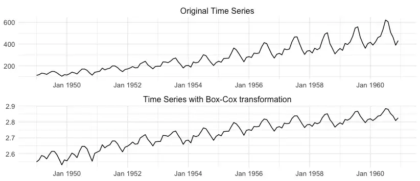

目录

- [趋势](#趋势)
- [季节性和周期性模式](#季节性和周期性模式)
- [残差](#残差)
- [平稳性](#平稳性)
- [自相关](#自相关)
- [异方差性](#异方差性)
- [规律性和间歇性](#规律性和间歇性)
- [频率](#频率)
- [自反性](#自反性)
- [异常值](#异常值)
- [Regimes and Change Detection](#regimes-and-change-detection)
- [维度](#维度)
- [X 轴和 Y 轴](#x-轴和-y-轴)
- [起点和终点](#起点和终点)
- [极值](#极值)
- [转折点](#转折点)
- [波动性](#波动性)
- [数据与参考线对比](#数据与参考线对比)
- [参考](#参考)

# 趋势

> Trend

趋势是时间序列的基本组成部分之一。它表示数据均值的长期变化，如图 1 所示。
此图显示了一个示例时间序列，表示一家航空公司随时间变化的每月乘客数量。
时间序列的平均水平随时间增加，代表明显的上升趋势

一些学习算法难以处理时间序列的趋势分量。因此，通常建议将其删除以获得时间序列的最佳建模。
您可以使用差分运算来执行此操作。差分只是意味着取当前观察值与前一个观察值之间的差值。
图 2 为差分去除趋势后的航空旅客时间序列；在此过程之后，系列的平均水平变得稳定

# 季节性和周期性模式

> Seasonality and Cyclic Patterns

如果时间序列在固定时期（例如每个月）经历有规律且可预测的变化，则它具有季节性成分。
航空旅客时间序列显示出每月的季节性，这从反复振荡中可以明显看出

与趋势类似，季节性成分也打破了平稳性，通常建议将其删除。
也可以通过差分来做到这一点，但不是从当前观察值中减去先前值，而是从同一季节中减去先前观察值

季节性差异减轻了可预测的波动，这也稳定了序列的平均水平。
去除季节性成分后，时间序列称为 季节性调整的(seasonal adjusted)

除了季节性影响之外，时间序列还可以通过其他没有固定周期的可预测振荡来表征。
这种类型的变化是一种循环模式。循环模式的典型例子是经济周期，其中经济经历增长期和衰退期

# 残差

> Residuals

从时间序列中去除上述三个成分（趋势、季节性、循环模式）后，
剩下的部分称为不规则成分或残差。下图显示了一个示例。
残差不能用任何趋势、季节性或周期性行为来解释，
但仍然会对时间序列的动态产生影响

# 平稳性 

> Stationarity

趋势或季节性等因素打破了时间序列的平稳性。
如果时间序列的属性不依赖于观察数据的时间，则时间序列是平稳的

更正式地说，如果均值或方差没有系统性变化，
并且周期性变化已被移除，则时间序列被认为是平稳的

许多时间序列技术在时间序列是平稳的假设下工作。
如果不是，则使用差分等操作使其平稳

# 自相关

> Autocorrelation

时间序列的概念意味着在某种程度上依赖于历史数据——我们今天观察到的东西取决于过去发生的事情。
时间序列的自相关根据每个观察值与其过去值的相关性来量化这种依赖性。
此属性提供有关该系列的重要结构信息。如果一个时间序列在所有滞后上都显示出低自相关性，
则它被称为白噪声

# 异方差性

> Heteroskedasticity

如果时间序列的方差不是恒定的并且随时间变化，则称时间序列是异方差的，而不是同方差的。
在航空旅客示例中，很明显数据的可变性随时间增加。这种方差变化与数据平均水平的变化同时发生是很常见的——对于更高的平均值，
方差通常更高。异方差性在数据建模过程中提出了一个问题，并且有一些方法可以解决它。
幂变换，例如取对数，或者更一般地说，Box-Cox 变换，通常用于稳定方差。下图显示了将 Box-Cox 方法应用于时间序列的示例

# 规律性和间歇性

> Regularity and Intermittency

时间序列通常以有规律的时间间隔收集，例如，每天或每小时。这些被称为规则时间序列，
大多数时间序列方法都在规则假设下工作。然而，有许多应用程序的时间序列本质上是不规则的。
例如自然灾害（如地震）或特定零售产品的销售，这些事件以不规则的时间间隔发生

通常对时间序列的不规则性进行插值处理，使序列具有规律性。例如，
与产品销售相关的时间序列可以转换为某个时期的销售计数（例如每小时产品销售）。
此插值过程可能会导致稀疏或间歇的时间序列，其中有多个观测值以常数零作为值（例如，在给定的小时内没有产品销售）。
这种间歇性是库存计划时间序列预测中的一个常见障碍，其中某些产品销售不频繁

# 频率

> Frequency

时间序列的采样频率表示收集它的规律性，例如每天或每月。具有不同频率的时间序列带来不同的挑战。
对于更高频率的时间序列，季节性成分可能更难捕获。每日或次日时间序列通常包含多个季节性模式，
捕捉起来并非易事

使用低频时间序列在季节性方面更简单。但是，可能还有其他问题需要考虑。
相对于高频数据集，低频数据集通常包含较小的样本量。经典的时间序列模型，
例如 ARIMA 或指数平滑，可以很好地处理这个问题，因为它们的参数数量很少。
具有更多参数的学习算法可能容易过度拟合

# 自反性

> Reflexivity

如果预测影响事件的展开，则时间序列是自反的。自反时间序列的经典示例是股票市场数据。
预测股价上涨会吸引投资者，从而创造需求并推动股价上涨。然后预测是自我实现的。
另一方面，由于投资者的恐慌，对市场崩盘的预测本身可能会导致市场崩盘。
还有自我挫败的反身系统，其中预测给定事件会降低它的可能性。

自反性可能会导致意想不到的后果。从业者应该确定它如何在他们的时间序列中出现，
并以某种方式将响应纳入他们的预测系统

# 异常值

> Outliers

离群值或异常是与其他观察结果有显着偏差的罕见事件。这些实例对于所有类型的数据都是通用的，
而不仅仅是时间序列。尽管如此，在时间序列中，由于观察之间的时间依赖性，异常值构成了额外的挑战

时间序列异常值可能仅出现在单个实例中（点异常值），或跨越多个时间步长（子序列异常值）。
在搜索异常时考虑上下文通常很重要。例如，0º 的温度在冬天可能很常见，但在夏天却异常

处理异常值的最合适方法取决于它们的性质。由于错误的数据收集或传感器故障，可能会出现异常值。
这种异常值代表不需要的数据，这些数据不遵循生成观察值的分布。然而，时间序列异常值本身就是感兴趣的事件。
这方面的例子包括股市崩盘或欺诈检测，其目标是预测或减轻这些罕见事件的影响

# Regimes and Change Detection

当时间序列的分布发生变化时，就会发生变化点，也称为概念漂移。
变化可以重复发生；一个时间序列可能具有不同的制度或概念，
并且数据分布在这些制度中发生变化。机制转换模型是解决此类问题的常用方法

变化也可以是永久性的。这些被称为结构中断。这些变化对学习算法提出了挑战，
学习算法必须能够检测到它们并及时做出相应调整

重要的是不要将变化检测与异常值检测混淆。
第一个是关于检测管理时间序列的制度的变化。
当制度改变时，观测值的分布也会相应改变。另一方面，
离群值表示明显偏离典型行为的观察（或观察的子序列），
其中典型行为的特征在于当前的潜在制度

# 维度

> Dimensionality

维度表示变量数。因此，这些时间序列被称为单变量。
然而，有时时间序列包含额外的维度，
因此被称为多元时间序列。在对时间序列的特定目标变量建模时，
多元时间序列中的附加变量可以用作解释变量

# X 轴和 Y 轴

任何图表观察都要从图表元素开始，时间序列图也不会例外。
通过观察两个坐标轴，能知道以下信息，但也别忘了其他图表元素：

* 数据的时间范围有多长
* 数据颗粒度有多细(小时、天、周、月等)
* 指标的大小如何(最大值、最小值、单位等)

# 起点和终点

观察时间序列的起点和终点，在不观察细节的情况下，就能大体知道总体趋势是怎么走的。
比如：如果起点与终点数值差不多，那么知道，不管中间指标变化多么波澜壮阔，
至少一头一尾说明忙活了很长时间后指标是在原地踏步

# 极值

极值就是序列中比较大的值和比较小的值，当然包括最大值和最小值。
极值的观察是确定数据阶段的重要依据

# 转折点

转折点往往有两类:

* 一类是绝对数值的转折点，一般就是指最大值和最小值
* 另一类是波动信息的转折点。例如:
    - 在该点前后的波动幅度差别显著
    - 在该点前后波动周期有差别
    - 在该点前后数据的正负值出现变化等

# 波动性

在某些阶段，数值波动剧烈；某些阶段则平稳。这也是在观察中需要注意的信息。
从统计学的角度分析，方差大的阶段，往往涵盖的信息较多，需要更加关注

# 数据与参考线对比

参考线有许多，例如均值线、均值加减标准差线、KPI 目标线、移动平均线等。
每种参考线都有分析意义，但需要注意顺序，建议先对比均值线，然后是移动平均线，
之后才是各种自定义的参考线

# 参考

* [关于时间序列你应该知道的 12 件事](https://towardsdatascience.com/12-things-you-should-know-about-time-series-975a185f4eb2)
