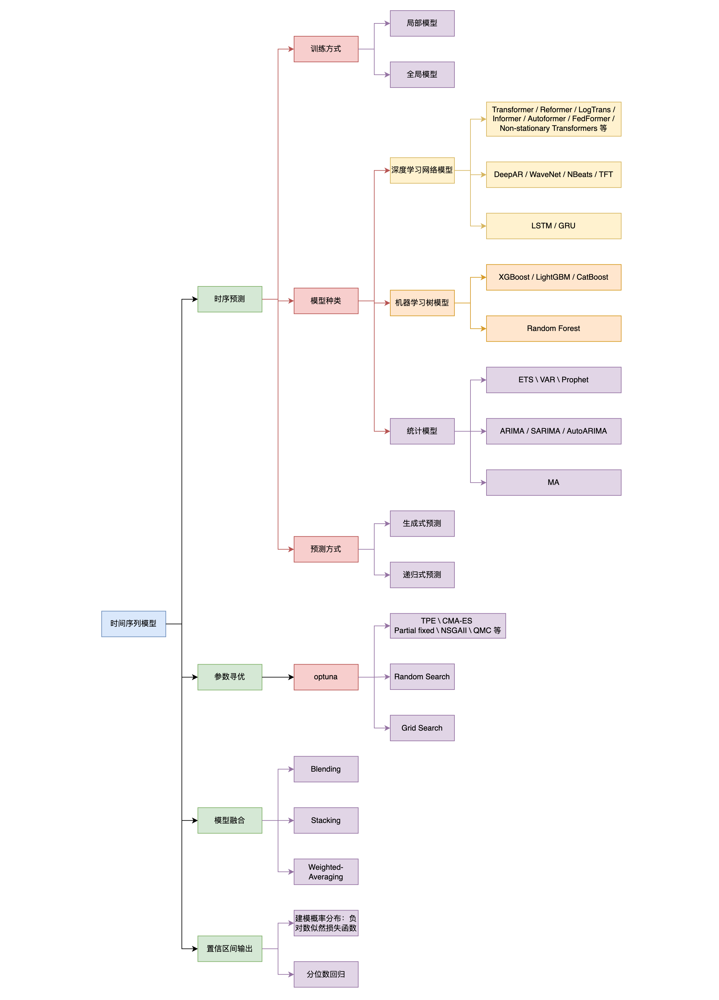
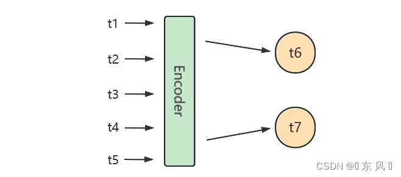
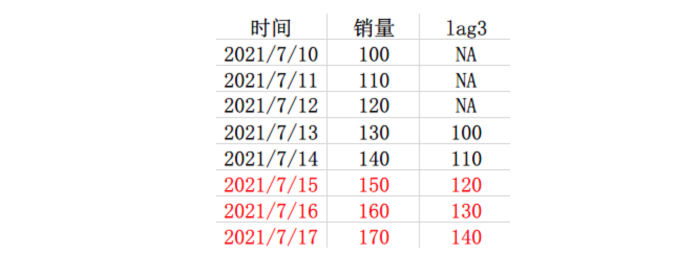
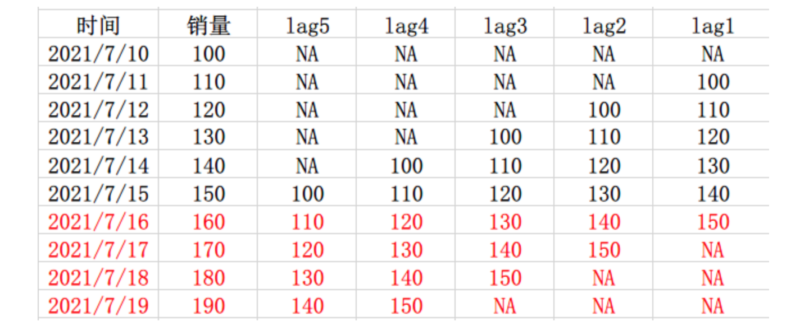
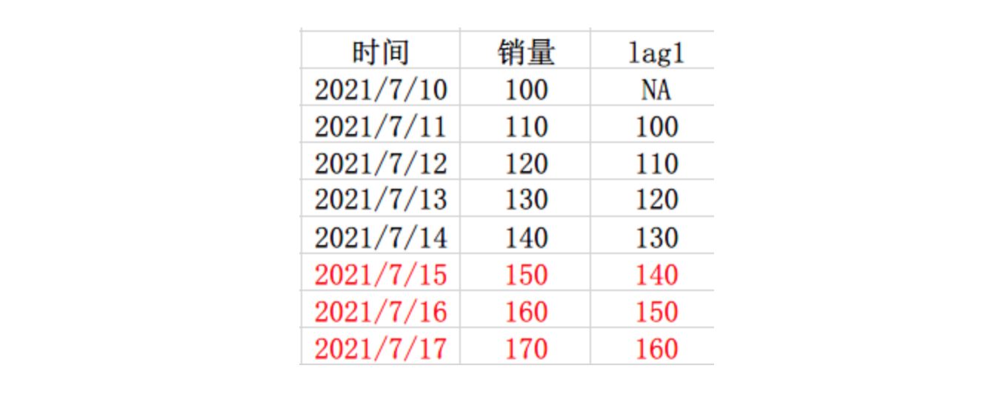
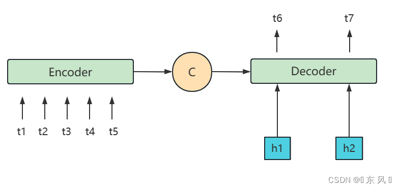
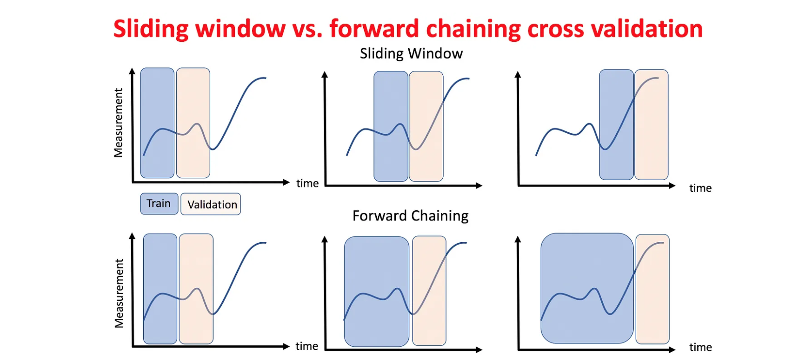

<style>
details {
    border: 1px solid #aaa;
    border-radius: 4px;
    padding: .5em .5em 0;
}
summary {
    font-weight: bold;
    margin: -.5em -.5em 0;
    padding: .5em;
}
details[open] {
    padding: .5em;
}
details[open] summary {
    border-bottom: 1px solid #aaa;
    margin-bottom: .5em;
}
img {
    pointer-events: none;
}
</style>

<details><summary>目录</summary><p>

- [为什么时间序列预测很难](#为什么时间序列预测很难)
    - [时间序列预测很难](#时间序列预测很难)
    - [样本量与模型精度](#样本量与模型精度)
- [预测方法](#预测方法)
    - [均值预测法](#均值预测法)
    - [朴素预测法](#朴素预测法)
    - [移动平均法](#移动平均法)
    - [指数平滑法](#指数平滑法)
    - [模型预测法](#模型预测法)
- [预测模型](#预测模型)
    - [预测模型类型](#预测模型类型)
    - [预测模型构建](#预测模型构建)
    - [预测模型介绍](#预测模型介绍)
    - [预测模型参数](#预测模型参数)
    - [预测模型数据](#预测模型数据)
        - [训练数据](#训练数据)
        - [测试数据](#测试数据)
- [按输入变量](#按输入变量)
    - [单变量预测](#单变量预测)
    - [多变量预测](#多变量预测)
        - [独立的多序列预测](#独立的多序列预测)
        - [相关多序列预测](#相关多序列预测)
- [按预测步长](#按预测步长)
    - [单步预测](#单步预测)
    - [多步预测](#多步预测)
        - [直接多输出预测](#直接多输出预测)
        - [递归多步预测](#递归多步预测)
        - [直接多步预测](#直接多步预测)
            - [只使用一个模型](#只使用一个模型)
            - [使用 n 个模型](#使用-n-个模型)
            - [使用 1~n 个模型](#使用-1n-个模型)
        - [直接递归混合预测](#直接递归混合预测)
            - [混合一](#混合一)
            - [混合二](#混合二)
            - [混合三](#混合三)
        - [Seq2Seq 多步预测](#seq2seq-多步预测)
- [按目标个数](#按目标个数)
    - [一元预测](#一元预测)
    - [多元预测](#多元预测)
    - [递归多元预测](#递归多元预测)
    - [多重预测](#多重预测)
- [回测预测模型](#回测预测模型)
    - [重新拟合并增加训练规模](#重新拟合并增加训练规模)
    - [重新拟合并固定训练规模](#重新拟合并固定训练规模)
    - [不重新拟合](#不重新拟合)
    - [重新拟合并带有间隙](#重新拟合并带有间隙)
- [参考](#参考)
</p></details><p></p>

# 为什么时间序列预测很难

机器学习和深度学习已越来越多应用在时序预测中。ARIMA 或指数平滑等经典预测方法正在被 XGBoost、
高斯过程或深度学习等机器学习回归算法所取代。

尽管时序模型越来越复杂，但人们对时序模型的性能表示怀疑。
有研究表明，复杂的时序模型并不一定会比时序分解模型有效。

时间序列是按时间排序的值，但时序预测具有很大的挑战性。从模型难度和精度角度考虑，
时序模型的确比常规的回归和分类任务更难。

## 时间序列预测很难

**原因 1：序列是非平稳的**

* 平稳性是时间序列的核心概念，如果时间序列的趋势（例如平均水平）不随时间变化，则该时间序列是平稳的。
  许多现有方法都假设时间序列是平稳的，但是趋势或季节性会打破平稳性。

**原因 2：依赖外部数据**

* 除了时间因素之外，时间序列通常还有额外的依赖性。时空数据是一个常见的例子，每个观察值都在两个维度上相关，
  因此数据具有自身的滞后（时间依赖性）和附近位置的滞后（空间依赖性）。

**原因 3：噪音和缺失值**

* 现实世界受到噪音和缺失值的困扰，设备故障可能会产生噪音和缺失值。
  传感器故障导致数据丢失，或者存在干扰，都会带来数据噪音。

**原因 4：样本量有限**

* 时间序列往往都只包含少量的观察值，可能没有足够的数据来构建足够的模型。
  数据采集的频率影响了样本量，同时也会遇到数据冷启动问题。

## 样本量与模型精度

时序模型往往无法进行完美预测，这可能和时序数据的样本量相关。在使用较大的训练集时，
具有大量参数的模型往往比参数较少的模型表现更好。在时序序列长度小于 1000 时，
深度模型往往并不会比时序分类模型更好。

下面对比了模型精度与样本个数的关系，这里尝试了五种经典方法（ARIMA、ETS、TBATS、Theta 和 Naive）、
五种机器学习方法（高斯过程、M5、LASSO、随机森林和 MARS）。预测任务是来预测时间序列的下一个值。
结果如下图所示，轴表示训练样本大小，即用于拟合预测模型的数据量。
轴表示所有时间序列中每个模型的平均误差，使用交叉验证计算得出。


当只有少数观测值可用时，基础方法表现出更好的性能。
然而，随着样本量的增加，机器学习方法优于经典方法。

进一步可以得出以下结论：

* 机器学习方法拥有很强的预测能力，前提是它们具有足够大的训练数据集；
* 当只有少量观测值可用时，推荐首选 ARIMA 或指数平滑等经典方法；
* 可以将指数平滑等经典方法与机器学习相结合可以提高预测准确性。

# 预测方法

时间序列分析的一个目标是借助历史数据反映出的客观规律，对序列的未来观测值进行预测。下面简单介绍常用的预测方法，
用 `$\hat{y}_{T+h|T}$` 表示基于 `$T$` 时刻的信息构造的对 `$h$` 时刻后(即 `$T+h$` 时刻)的 `$y$` 的预测值。

## 均值预测法

均值(average 或 mean)预测是指采用历史数据的平均值作为未来观测值的预测值。
其中，简单均值(simple average)预测是均值预测的一种，是指采用历史数据的等权重平均值预测，
即：

`$$\hat{y}_{T+h|T} = \frac{1}{T}\sum_{t=1}^{T}y_{t}$$`

其中，`$h$` 为预测的步长。

## 朴素预测法

朴素(naive)预测是指采用当前的观测值作为未来观测值的预测值，即：

`$$\hat{y}_{T+h|T} = y_{T}$$`

在序列具有随机游走特征时，该预测是最优预测。另外，
该预测也是对复杂数据进行预测时常用的预测方法。

## 移动平均法

> 不是 `$\text{MA}(q)$` 模型

移动平均法是指采用滑动窗口对窗口内的数据采用等权重进行预测，即：

`$$\begin{align}
\hat{y}_{T+h|T}&=\frac{1}{k}\sum_{t=T-k+1}^{T}y_{t}  \\
&=\frac{1}{k}(y_{T-(k-1)} + y_{T-(k-2)} + \ldots + y_{T-0})
\end{align}$$`

其中，`$k$` 为滑窗窗口长度。

该预测的预测值表达式类似于简单的自回归模型（`$\text{MA}(p)$`）表达式，
不同之处在于自回归模型表达式的系数一般基于数据来估计。
该预测也是处理具有多个时间序列数据特征(如周期性、时间趋势性)的数据时常用的方法。

## 指数平滑法

指数平滑(Exponential Smoothing)法是结合了简单均值预测法、朴素预测法和移动平均法的一种预测方法。

* 简单均值预测法的缺陷是为所有历史数据赋予相同的权重
* 朴素预测法则将所有权重赋给最近的观测值
* 移动平均预测法只为最近的一系列数据赋予相同的非零权重，完全忽略较早时间的观测数据

指数平滑法的表达式为：

`$$\begin{align}
\hat{y}_{T+1|T} &=\alpha y_{T} + \alpha(1-\alpha)y_{T-1}+\alpha(1-\alpha)^{2}y_{T-2}+\ldots \\
&=\alpha y_{T} + (1-\alpha)\hat{y}_{T|T-1}
\end{align}$$`

其中，`$\alpha$` 可以通过最小二乘法来选取。

该预测方法对所有历史观测值进行加权平滑，平滑的权重的大小随着时间的推移呈指数衰减，因而得名指数平滑法。易见，
下一期的预测值 `$\hat{y}_{T+1|T}$` 可以表示为当期观测值 `$y_{T}$` 和当期预测值 `$\hat{y}_{T|T-1}$` 的加权平均。

## 模型预测法

上面的预测方法都不需要任何时间序列模型的假设。如果通过建模能够找到适合数据的时间序列模型，
则可以基于模型构造预测值。

模型(model)预测法则为基于模型构造预测的预测方法。
例如，对于符合自回归模型 `$y_{t} = 0.5y_{t-1}+\varepsilon_{t}$` 的序列，
可以与该模型在最小平方损失函数(MSE)下推出其最优预测值为 `$\hat{y}_{T+1|T}=0.5y_{T}$`。

在基于模型的预测构建过程中，最为关键的问题就是如何通过历史数据确定预测需要构建的计量模型。

# 预测模型

时间序列预测技术是指基于历史数据和时间变化规律，通过数学模型和算法对未来发展趋势进行预测的一种技术。
时间序列预测技术广泛应用于经济、金融、交通、气象等领域，以帮助人们做出更加准确的决策。

## 预测模型类型

时间序列从不同角度看有不同分类：

* 从**实现原理**角度，可以分为：
    - 传统统计学
    - 机器学习(非深度学习)
    - 深度学习
* 按**输入变量**区分，可以分为：
    - 自回归预测
    - 使用协变量预测
* 按**预测步长**区分，可以分为：
    - 单步预测
    - 多步预测
* 按**目标个数**区分，可以分为：
    - 一元预测
    - 多元预测
    - 多重预测
* 按**输出结果**区分，可以分为：
    - 点预测
    - 概率预测

这些分类是不同角度下的分类，同一种算法往往只能是分类中的一种，
例如传统的统计学模型只适合做自回归预测而不适合协变量预测。

## 预测模型构建



## 预测模型介绍

| 模型(model)                       | 单变量/自回归               | 多变量/协变量               | 一元预测            | 多元预测                  | 多重预测             | 点预测              | 概率预测            |             |
|----------------------------------|---------------------------|---------------------------|--------------------|--------------------------|--------------------|--------------------|--------------------|-------------|
| Naive Baselines                  | :white_check_mark:        |                           | :white_check_mark: |                          |                    | :white_check_mark: | :white_check_mark: | [模型介绍]() |
| AR                               | :white_check_mark:        |                           | :white_check_mark: |                          |                    | :white_check_mark: | :white_check_mark: | [模型介绍]() |
| MA                               | :white_check_mark:        |                           | :white_check_mark: |                          |                    | :white_check_mark: | :white_check_mark: | [模型介绍]() |
| ARMA                             | :white_check_mark:        |                           | :white_check_mark: |                          |                    | :white_check_mark: | :white_check_mark: | [模型介绍]() |
| ARIMA                            | :white_check_mark:        |                           | :white_check_mark: |                          |                    | :white_check_mark: | :white_check_mark: | [模型介绍]() |
| AutoARIMA                        | :white_check_mark:        |                           | :white_check_mark: |                          |                    | :white_check_mark: | :white_check_mark: | [模型介绍]() |
| VARIMA                           | :white_check_mark:        | :white_check_mark:        | :white_check_mark: |                          |                    | :white_check_mark: | :white_check_mark: | [模型介绍]() |
| VAR                              | :white_check_mark:        |                           | :white_check_mark: |                          |                    | :white_check_mark: | :white_check_mark: | [模型介绍]() |
| ExponentialSmoothing             | :white_check_mark:        |                           | :white_check_mark: |                          |                    | :white_check_mark: | :white_check_mark: | [模型介绍]() |
| Theta                            | :white_check_mark:        |                           | :white_check_mark: |                          |                    | :white_check_mark: | :white_check_mark: | [模型介绍]() |
| TBATS                            | :white_check_mark:        |                           | :white_check_mark: |                          |                    | :white_check_mark: | :white_check_mark: | [模型介绍]() |
| FourTheta                        | :white_check_mark:        |                           | :white_check_mark: |                          |                    | :white_check_mark: | :white_check_mark: | [模型介绍]() |
| Prophet                          | :white_check_mark:        |                           | :white_check_mark: |                          |                    | :white_check_mark: | :white_check_mark: | [模型介绍]() |
| Fast Fourier Transform(FFT)      | :white_check_mark:        |                           | :white_check_mark: |                          |                    | :white_check_mark: | :white_check_mark: | [模型介绍]() |
| LinearRegressionModel            | :white_check_mark:        | :white_check_mark:        | :white_check_mark: | :white_check_mark:       | :white_check_mark: | :white_check_mark: |                    | [模型介绍]() |
| RandomForest                     | :white_check_mark:        | :white_check_mark:        | :white_check_mark: | :white_check_mark:       | :white_check_mark: | :white_check_mark: |                    | [模型介绍]() |
| XGBoost                          | :white_check_mark:        | :white_check_mark:        | :white_check_mark: | :white_check_mark:       | :white_check_mark: | :white_check_mark: |                    | [模型介绍]() |
| LightGBM                         | :white_check_mark:        | :white_check_mark:        | :white_check_mark: | :white_check_mark:       | :white_check_mark: | :white_check_mark: |                    | [模型介绍]() |
| CatBoost                         | :white_check_mark:        | :white_check_mark:        | :white_check_mark: | :white_check_mark:       | :white_check_mark: | :white_check_mark: |                    | [模型介绍]() |
| LSTM(rnn)                        | :white_check_mark:        | :white_check_mark:        | :white_check_mark: | :white_check_mark:       | :white_check_mark: | :white_check_mark: | :white_check_mark: | [模型介绍]() |
| GRU(rnn)                         | :white_check_mark:        | :white_check_mark:        | :white_check_mark: | :white_check_mark:       | :white_check_mark: | :white_check_mark: | :white_check_mark: | [模型介绍]() |
| DeepAR(rnn)                      | :white_check_mark:        | :white_check_mark:        | :white_check_mark: | :white_check_mark:       | :white_check_mark: | :white_check_mark: | :white_check_mark: | [模型介绍]() |
| BlockRNNModel(LSTM, GRU)         | :white_check_mark:        | :white_check_mark:        | :white_check_mark: | :white_check_mark:       | :white_check_mark: | :white_check_mark: | :white_check_mark: | [模型介绍]() |
| NBeats                           | :white_check_mark:        | :white_check_mark:        | :white_check_mark: | :white_check_mark:       | :white_check_mark: | :white_check_mark: | :white_check_mark: | [模型介绍]() |
| TCNModel                         | :white_check_mark:        | :white_check_mark:        | :white_check_mark: | :white_check_mark:       | :white_check_mark: | :white_check_mark: | :white_check_mark: | [模型介绍]() |
| Transformer                      | :white_check_mark:        | :white_check_mark:        | :white_check_mark: | :white_check_mark:       | :white_check_mark: | :white_check_mark: | :white_check_mark: | [模型介绍]() |
| Informer                         | :white_check_mark:        | :white_check_mark:        | :white_check_mark: | :white_check_mark:       | :white_check_mark: | :white_check_mark: | :white_check_mark: | [模型介绍]() |
| Autoformer                       | :white_check_mark:        | :white_check_mark:        | :white_check_mark: | :white_check_mark:       | :white_check_mark: | :white_check_mark: | :white_check_mark: | [模型介绍]() |
| TFT(Temporal Fusion Transformer) | :white_check_mark:        | :white_check_mark:        | :white_check_mark: | :white_check_mark:       | :white_check_mark: | :white_check_mark: | :white_check_mark: | [模型介绍]() |

## 预测模型参数

实际场景中，一般需要确定几个参数：

1. 历史窗口的大小(history length)
    - 即预测未来时，要参考过去多少时间的信息作为输入。太少可能信息量不充分，
      太多则会引入早期不相关的信息(比如疫情前的信息可能目前就不太适用了)。
2. 预测点间隔的大小(predict gap)
    - 即预测未来时，是从 T+1 开始预测，还是 T+2，T+3，这与现实的业务场景有关。
      例如像补货场景，预测 T+1 的销量，可能已经来不及下单补货了，
      所以需要扩大这个提前量，做 T+3 甚至更多提前时间的预测。
3. 预测窗口的大小(predict length)
    - 即需要连续预测多长的未来值。比如从 T+1 开始一直到 T+14 都需要预测输出。
      这一点也跟实际的业务应用场景有关。

## 预测模型数据

用机器学习算法构造时间序列预测模型，关键的思路在于，通过时间滑窗，
人为地构造 “未来” Target，来给算法进行学习。

从时间的角度上来看，有历史数据和新数据。但这里，不能简单地把历史数据作为训练集、把新数据作为测试集。


### 训练数据

1. 首先，在历史数据上，通过截取不同时间窗口的数据来构造一组或几组数据
    - 比如，历史数据是 2017 年 1 月到 12 月每家店每天的销售数据，那么可以截取 3 组数据（见上图的深绿、浅绿部分）：
        - 2017 年 1 月到 10 月的数据
        - 2017 年 2 月到 11 月的数据
        - 2017 年 3 月到 12 月的数据
2. 然后，人为地给每组数据划分历史窗口（对应上图的深绿色部分）和未来窗口（对应上图的浅绿色部分）
    - 比如，对于 2017 年 1 月到 10 月的数据，把 1 月到 9 月作为历史窗口，10 月作为未来窗口，以此类推
3. 接着，分别给每组数据构建预测特征，包括历史特征（预测特征 A）和未来特征（预测特征 B）。
   而此时，每组数据还有预测 Target

这个时候，把得到的所有预测特征（例子里是三组预测特征）都合并起来作为训练集特征、
把所有预测 Target（例子里是三组预测 Target）合并起来作为训练集 Target，之后就可以构建机器学习模型了。

### 测试数据

测试集的构建遵循之前的数据处理逻辑，拿历史数据构建历史特征，拿新数据构建未来特征，
然后把这些特征加入到从训练集上训练出的预测模型中去，即可得到任务需要的最终预测值。

这里需要注意，划多少个时间窗口因数据而异。此外，
数据的历史窗口（图上深绿部分）和未来窗口（图上浅绿部分）可以是定长也可以是变长，看具体情况。

# 按输入变量

## 单变量预测

> 自回归预测

在单变量时间序列预测中，单个时间序列被建模为其滞后的线性或非线性组合，
其中该序列的过去值用于预测其未来。

## 多变量预测

> Multi-time series forecasting

多元时间序列，即每个时间有多个观测值：

`$$\{X_{t} = (x_{t}^{a}, x_{t}^{b}, x_{t}^{c}, \ldots)\}_{t}^{T}$$`

这意味着通过不同的测量手段得到了多种观测值，并且希望预测其中的一个或几个值。
例如，可能有两组时间序列观测值 `$\{x_{t-1}^{a}, x_{t-2}^{a}, \ldots\}$`，
`$\{x_{t-1}^{b}, x_{t-2}^{b}, \ldots\}$`，希望分析这组多元时间序列来预测 `$x_{t}^{a}$` 

基于以上场景，许多监督学习的方法可以应用在时间序列的预测中，
在运用机器学习模型时，可以把时间序列模型当成一个回归问题来解决，
比如 svm/xgboost/逻辑回归/回归树/...

在多序列预测中，两个或多个时间序列使用单个模型一起建模。多系列预测有两种不同的策略

### 独立的多序列预测

> Independent Multi-Series Forecasting


为了预测未来的 `$n$` 步，应该用递归多步预测策略


### 相关多序列预测

> Dependent Multi-Series Forecasting(Multivariate time series)


# 按预测步长

## 单步预测

所谓单步预测，就是每一次预测的时候输入窗口只预测未来的一个值。
在时间序列预测中的标准做法是使用滞后的观测值 `$x_{t}$` 作为输入变量来预测当前的时间的观测值 `$x_{t+1}$`

单步预测的两个策略：

* 滑动窗口(推荐)
* 扩展窗口


## 多步预测

大多数预测问题都被定义为单步预测，根据最近发生的事件预测系列的下一个值。
时间序列多步预测需要预测未来多个值，提前预测许多步骤具有重要的实际优势，
多步预测减少了长期的不确定性。但模型试图预测更远的未来时，模型的误差也会逐渐增加

所谓多步预测就是利用过去的时间数据来预测未来多个状态的时序数据，举个例子就是利用过去 30 天的数据来预测未来 2 天的数据

对于时间序列多步预测常用的解决方案有 5 种：

* 直接多输出预测
* 递归多步预测(单步滚动预测)
    - 扩展窗口
    - 滑动窗口(推荐)
* 直接多步预测(多模型单步预测)
* 直接递归混合预测(多模型滚动预测)
* Seq2Seq 多步预测

为了方便讲解不同的多步预测策略，假设原始时间序列数据位 `$\{t1, t2, t3, t4, t5\}$`，这是已知的数据，
需要预测未来两天的状态 `$\{t6, t7\}$`

### 直接多输出预测

> Direct Multi-Output Forecasting

某些机器学习模型，例如长短期记忆（LSTM）神经网络，可以同时预测一个序列的多个值（一次性预测）。
对于这个策略是比较好理解与实现的，就是训练一个模型，对于深度学习，只不过需要在模型最终的线性层设置为两个输出神经元即可。
而对于机器学习，需要在预测时连续预测两个值

正常单输出预测，预测未来一个时刻的模型最终的输出层为 `Linear(hidden_size, 1)`，
对于直接多步预测修改输出层为 `Linear(hidden_size, 2)` 即可，最后一层的两个神经元分别预测 `$\{t6, t7\}$`



定义的模型结构状态为：

`$$\{t1, t2, t3, t4, t5\} \Rightarrow \{t6, t7\}$$` 

对于这种策略优点就是预测 `$t6$` 和 `$t7$` 是独立的，不会造成误差累积，因为两个预测状态会同时通过线性层进行预测，
`$t7$` 的预测状态不会依赖 `$t6$`；

那么缺点也很显然，就是两个状态独立了，但是现实是因为这是时序预测问题，
`$t7$` 的状态会受到 `$t6$` 的状态所影响，如果分别独立预测，`$t7$` 的预测状态会受影响，造成信息的损失

### 递归多步预测

> Recursive Multi-Step Forecasting

递归多步预测就是利用递归方式进行预测未来状态，该策略会训练一个模型，然后依次按照时序递归进行预测，
先利用已知时序数据预测 `$t6$`，然后再滑动一个窗口，利用刚刚预测出的 `$t6$` 去预测 `$t7$` 的状态


定义的模型结构状态为：

`$$\{t1, t2, t3, t4, t5\} \Rightarrow \{t6\}$$`
`$$\{t2, t3, t4, t5, t6\} \Rightarrow \{t7\}$$`

这种实现策略的优点就是解决了上个策略中 `$t6$` 和 `$t7$` 的独立性，再预测 `$t7$` 的状态时考虑到了 `$t6$` 的状态信息

但是这种策略也会存在缺点就是因为是递归预测，会导致误差累积，举个例子，如果模型在预测 `$t6$` 的过程中出现了偏差，
导致 `$t6$` 的预测结果异常，然后模型会拿着 `$t6$` 的值去预测 `$t7$`，这就会导致 `$t7$` 的预测结果进一步产生误差，
也就是会导致误差累积效应。

还有一个缺点就是该种实现策略利用递归策略，不断滑动窗口拿着刚刚预测出来的值预测下一个值，
会导致性能降低，无法同时预测 `$t6$` 和 `$t7$` 的状态

### 直接多步预测

> Direct Multi-Step Forecasting

直接多步预测意如其名，就是直接输出未来两天的状态，注意一下，不要与直接多输出预测混淆，不同于直接多输出预测，
该策略会同时训练两个模型，其中一个模型用于预测 `$t6$`，另一个模型用于预测 `$t7$`，也就是要预测多个未来状态，就需要训练多个模型


定义的模型结构状态为：

`model_t6`：`$$\{t1, t2, t3, t4, t5\} \Rightarrow \{t6\}$$`
`model_t7`：`$$\{t1, t2, t3, t4, t5\} \Rightarrow \{t7\}$$`

这种实现策略会有一定的缺点，由于是要多步预测，那么就需要训练对应输出数目的模型，如果要预测未来 10 个时刻的状态，
那么就需要训练 10 个模型，会导致计算资源消耗严重；

第二个缺点就是没有考虑到 `$t6$` 和 `$t7$` 的时序相关性，因为 `$t7$` 的状态会受到 `$t6$` 的状态影响，
这种实现策略会独立训练两个模型，所以预测 `$t7$` 的模型缺少了 `$t6$` 的信息状态，造成信息损失

#### 只使用一个模型

举个例子，现有 7 月 10 号到 7 月 14 号的数据，需要预测未来 3 天的销量，那么，就不能用 lag1 和 lag2 作为特征，
但是可以用 lag3，所以就用 lag3 作为特征构建一个模型：



这种是只使用一个模型来预测的，但是呢，缺点是特征居然要构造到 lag3，lag1 和 lag2 的信息完全没用到，
所以就有人提出了一种思路，就是对于每一天都构建一个模型

#### 使用 n 个模型

这个的思路呢，就是想能够尽可能多的用到 lag 的信息，所以，对于每一天都构建一个模型，比如对于 15 号，构建模型 1，
使用了 lag1、lag2 和 lag3 作为特征来训练，然后对于 16 号，因为不能用到 lag1 的信息了，但是 lag2 和 lag3 还是能用到的，
所以就用 lag2 和 lag3 作为特征，再训练一个模型 2，17 号的话，就只有 lag3 能用了，所以就直接用 lag3 作为特征来训练一个模型 3，
然后模型 1、模型 2、模型 3 分别就可以输出每一天的预测值了


这种方法的优势是最大可能的用到了 lag 的信息，但是缺陷也非常明显，就是因为对于每一天都需要构建一个模型的话，
那预测的天数一长，数据一多，那计算量是没法想象的，所以也有人提出了一个这种的方案，就不是对每一天构建一个模型了，
而是每几天构建一个模型

#### 使用 1~n 个模型

还是上面那个例子，这次把数据改变一下，预测四天吧，有 10 号到 14 号的数据，构建了 lag1-5 的特征，
需要预测 16 号到 19 号的数据，那么我们知道 16 号和 17 号是都可以用到 lag2、lag3、lag4 和 lag5 的特征的，
那么为这两天构建一个模型 1，而 18 号和 19 号是只能用到 lag4 和 lag5 的特征的，那么为这两天构建一个模型 2，
所以最后就是模型 1 输出 16 号和 17 号的预测值，模型 2 输出 18 号和 19 号的值



可以发现，这样的话，我们虽然没有尽最大可能的去使用 lag 特征，但是，计算量相比于使用 n 个模型直接小了一半

### 直接递归混合预测

> Direct Recursive Hybrid Forecasting

直接递归混合预测策略融合了递归多步预测和直接多步预测两种策略，它会分别训练两个模型，分别用于预测 `$t6$`、`$t7$`，
与直接多步预测不同的是在预测 `$t7$` 利用到了预测 `$t6$` 模型的输出结果，即 `$t6$` 的预测结果


定义的模型结构状态为：

`model_t6`：`$$\{t1, t2, t3, t4, t5\} \Rightarrow \{t6\}$$`
`model_t7`：`$$\{t1, t2, t3, t4, t5\} \Rightarrow \{t7\}$$`

这种方式的优点就是解决了直接多步预测的信息独立问题，在预测 `$t7$` 的过程中考虑到了 `$t6$` 的状态，
但缺点跟直接多步预测策略一样，由于是要多步预测，那么就需要训练对应输出数目的模型，如果要预测未来 10 个时刻的状态，
那么就需要训练 10 个模型，会导致计算资源消耗严重

#### 混合一

同时使用直接法和递归法，分别得出一个预测值，然后做个简单平均，这个思路也就是采用了模型融合的平均法的思想，
一个高方差，一个高偏差，那么我把两个合起来取个平均方差和偏差不就小了吗

#### 混合二

这种方法是这篇论文提出的：《Recursive and direct multi-step forecasting: the best of both worlds》，有兴趣可以自己去读下，
大概说的就是先使用递归法进行预测，然后再用直接法去训练递归法的残差，有点像 boosting 的思想，论文花了挺大篇幅说了这种方法的无偏性，
不过，这种方法也就是存在论文中，暂时没见到人使用，具体效果还不知道

#### 混合三

简单来说就是使用到了所有的 lag 信息，同时也建立了很多模型，还是这个例子，首先用 10 号到 14 号的数据训练模型 1，
得到 15 号的预测值，然后将 15 号的预测值作为 16 号的特征，同时用 10 号到 15 号的数据训练模型 2，得到 16 号的预测值，
最后使用 16 号的预测值作为 17 号的特征，使用 10 号到 16 号的数据训练模型 3，得到 17 号的预测值



这种方法说实话还不知道他的好处在哪，相比于递归预测法，不就是训练时多了几条数据吗？还是会有误差累计的问题吧

### Seq2Seq 多步预测

> Seq2Seq Multi-Step Forecasting

Seq2Seq 实现策略与直接多输出预测一致，不同之处就是这种策略利用到了 Seq2Seq 这种模型结果，
Seq2Seq 实现了序列到序列的预测方案，由于多步预测的预测结果也是多个序列，所以问题可以使用这种模型架构



定义的模型结构状态为：

`$$\{t1, t2, t3, t4, t5\} \Rightarrow \{t6, t7\}$$` 

对于这种模型架构相对于递归预测效率会高一点，因为可以并行同时预测 `$t6$` 和 `$t7$` 的结果，
而且对于这种模型架构可以使用更多高精度的模型，例如：Bert、Transformer、Attention 等多种模型作为内部的组件

# 按目标个数

## 一元预测

## 多元预测

多目标回归为每一个预测结果构建一个模型，如下是一个使用案例：

```python
from sklearn.multioutput import MultiOutputRegressor

direct = MultiOutputRegressor(LinearRegression())
direct.fit(X_tr, Y_tr)
direct.predict(X_test)
```

scikit-learn 的 `MultiOutputRegressor` 为每个目标变量复制了一个学习算法。
在这种情况下，预测方法是 `LinearRegression`。此种方法避免了递归方式中错误传播，
但多目标预测需要更多的计算资源。此外多目标预测假设每个点是独立的，这是违背了时序数据的特点

## 递归多元预测

递归多目标回归结合了多目标和递归的思想。为每个点建立一个模型。
但是在每一步的输入数据都会随着前一个模型的预测而增加

```python
from sklearn.multioutput import RegressorChain

dirrec = RegressorChain(LinearRegression())
dirrec.fit(X_tr, Y_tr)
dirrec.predict(X_test)
```

这种方法在机器学习文献中被称为 chaining。scikit-learn 通过 `RegressorChain` 类为其提供了一个实现

## 多重预测

# 回测预测模型

在时间序列预测中，回测是指使用历史数据验证预测模型的过程。该技术涉及逐步向后移动，
以评估如果在该时间段内使用模型进行预测，该模型的表现如何。回溯测试是一种交叉验证形式，
适用于时间序列中的先前时期。

回测的目的是评估模型的准确性和有效性，并确定任何潜在问题或改进领域。通过在历史数据上测试模型，
可以评估它在以前从未见过的数据上的表现如何。这是建模过程中的一个重要步骤，因为它有助于确保模型稳健可靠。

回测可以使用多种技术来完成，例如简单的训练测试拆分或更复杂的方法，如滚动窗口或扩展窗口。
方法的选择取决于分析的具体需要和时间序列数据的特点。

总的来说，回测是时间序列预测模型开发中必不可少的一步。通过在历史数据上严格测试模型，
可以提高其准确性并确保其有效预测时间序列的未来值。



## 重新拟合并增加训练规模

> 扩展窗口
> 
> Backtesting with refit and increasing training size (fixed origin)

在这种方法中，模型在每次做出预测之前都经过训练，并且在训练过程中使用到该点的所有可用数据。
这不同于标准交叉验证，其中数据随机分布在训练集和验证集之间。

这种回测不是随机化数据，而是按顺序增加训练集的大小，同时保持数据的时间顺序。
通过这样做，可以在越来越多的历史数据上测试模型，从而更准确地评估其预测能力


## 重新拟合并固定训练规模

> 滚动窗口
> 
> Backtesting with refit and fixed training size (rolling origin)

在这种方法中，模型是使用过去观察的固定窗口进行训练的，测试是在滚动的基础上进行的，训练窗口会及时向前移动。
训练窗口的大小保持不变，允许在数据的不同部分测试模型。当可用数据量有限或数据不稳定且模型性能可能随时间变化时，
此技术特别有用。也称为时间序列交叉验证或步进验证


## 不重新拟合

> Backtesting without refit

没有重新拟合的回测是一种策略，其中模型只训练一次，并且按照数据的时间顺序连续使用而不更新它。
这种方法是有利的，因为它比其他每次都需要重新训练模型的方法快得多。
然而，随着时间的推移，该模型可能会失去其预测能力，因为它没有包含最新的可用信息


## 重新拟合并带有间隙

> Backtesting including gap

这种方法在训练集和测试集之间引入了时间间隔，复制了无法在训练数据结束后立即进行预测的场景。

例如，考虑预测 D+1 日 24 小时的目标，但需要在 11:00 进行预测以提供足够的灵活性。
D 天 11:00，任务是预测当天的 [12-23] 小时和 D+1 天的 [0-23] 小时。
因此，必须预测未来总共 36 小时，只存储最后 24 小时


# 参考

* [机器学习多步时间序列预测解决方案](https://aws.amazon.com/cn/blogs/china/machine-learning-multi-step-time-series-prediction-solution/)
* [时间序列多步预测经典方法总结](https://weibaohang.blog.csdn.net/article/details/128754086)
* [时间序列的多步预测方法总结](https://zhuanlan.zhihu.com/p/390093091)
* [skforecast 时序预测库](https://mp.weixin.qq.com/s/61MUqOZvQcNHtFnjyQMaQg)
* [sktime 时序预测库](https://github.com/sktime/sktime)
* [Time Series Forecasting as Supervised Learning](https://machinelearningmastery.com/time-series-forecasting-supervised-learning/)
* [How to Convert a Time Series to a Supervised Learning Problem in Python](https://machinelearningmastery.com/convert-time-series-supervised-learning-problem-python/)
* [How To Resample and Interpolate Your Time Series Data With Python](https://machinelearningmastery.com/resample-interpolate-time-series-data-python/)
* [Multistep Time Series Forecasting with LSTMs in Python](https://machinelearningmastery.com/multi-step-time-series-forecasting-long-short-term-memory-networks-python/)
* [Machine Learning Strategies for Time Series Forecasting](https://link.springer.com/chapter/10.1007%2F978-3-642-36318-4_3)
* [Machine Learning Strategies for Time Series Forecasting. Slide](http://di.ulb.ac.be/map/gbonte/ftp/time_ser.pdf)
* [Machine Learning for Sequential Data: A Review](http://web.engr.oregonstate.edu/~tgd/publications/mlsd-ssspr.pdf)
* [如何用Python将时间序列转换为监督学习问题](https://cloud.tencent.com/developer/article/1042809)
* [时间序列预测](https://mp.weixin.qq.com/s?__biz=Mzg3NDUwNTM3MA==&mid=2247484974&idx=1&sn=d841c644fd9289ad5ec8c52a443463a5&chksm=cecef3dbf9b97acd8a9ededc069851afc00db422cb9be4d155cb2c2a9614b2ee2050dc7ab4d7&scene=21#wechat_redirect)
* [机器学习与时间序列预测](https://www.jianshu.com/p/e81ab6846214)
* [sktime.RecursiveTimeSeriesRegressionForecaster](https://www.sktime.org/en/stable/api_reference/auto_generated/sktime.forecasting.compose.RecursiveTimeSeriesRegressionForecaster.html)
* [机器学习多步时间序列预测解决方案](https://aws.amazon.com/cn/blogs/china/machine-learning-multi-step-time-series-prediction-solution/)
* [时间序列的多步预测方法总结](https://zhuanlan.zhihu.com/p/390093091)
* [为什么时序预测很难](https://mp.weixin.qq.com/s/K0VVbZBcFJB5ctKWeMHUgQ)
