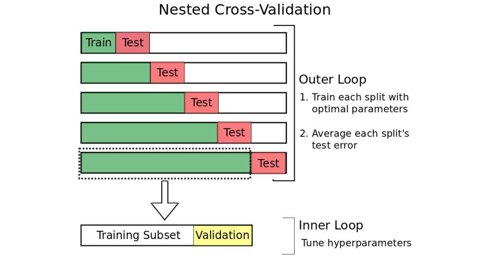
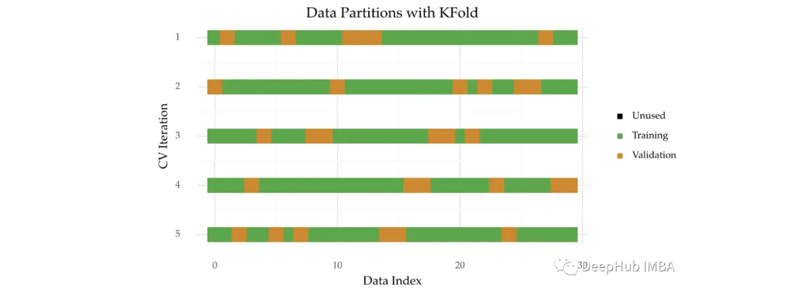
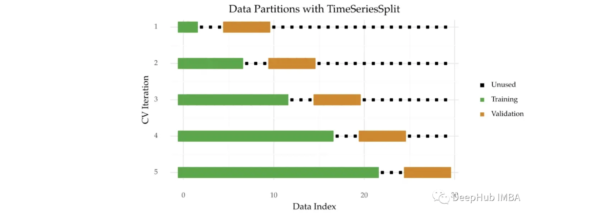
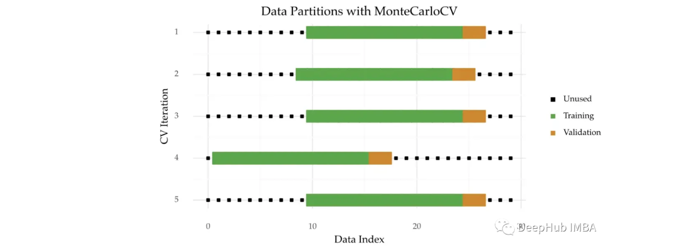

<style>
details {
    border: 1px solid #aaa;
    border-radius: 4px;
    padding: .5em .5em 0;
}
summary {
    font-weight: bold;
    margin: -.5em -.5em 0;
    padding: .5em;
}
details[open] {
    padding: .5em;
}
details[open] summary {
    border-bottom: 1px solid #aaa;
    margin-bottom: .5em;
}
img {
    pointer-events: none;
}
</style>

<details><summary>目录</summary><p>

- [传统交叉验证](#传统交叉验证)
- [单时序嵌套交叉验证](#单时序嵌套交叉验证)
  - [预测后一半嵌套交叉验证](#预测后一半嵌套交叉验证)
  - [日间隔前向链接嵌套交叉验证](#日间隔前向链接嵌套交叉验证)
- [多时序嵌套交叉验证](#多时序嵌套交叉验证)
  - [常规嵌套交叉验证](#常规嵌套交叉验证)
  - [群体知情嵌套交叉验证](#群体知情嵌套交叉验证)
- [Hold Out](#hold-out)
  - [Hold Out 介绍](#hold-out-介绍)
  - [Hold Out 应用](#hold-out-应用)
- [K-Fold 交叉验证](#k-fold-交叉验证)
  - [K-Fold](#k-fold)
  - [Blocked K-Fold](#blocked-k-fold)
  - [hv-Blocked K-Fold](#hv-blocked-k-fold)
  - [改进的 K-Fold](#改进的-k-fold)
- [时间序列分割](#时间序列分割)
  - [Time Series Split](#time-series-split)
    - [介绍](#介绍)
    - [优缺点](#优缺点)
    - [应用](#应用)
  - [带间隙的 Time Series Split](#带间隙的-time-series-split)
    - [介绍](#介绍-1)
    - [应用](#应用-1)
  - [滑动 Time Series Split](#滑动-time-series-split)
    - [介绍](#介绍-2)
    - [应用](#应用-2)
- [蒙特卡洛交叉验证](#蒙特卡洛交叉验证)
  - [MonteCarloCV 介绍](#montecarlocv-介绍)
  - [MonteCarloCV 实现](#montecarlocv-实现)
  - [MonteCarloCV 使用](#montecarlocv-使用)
- [Sktime 时间序列交叉验证](#sktime-时间序列交叉验证)
  - [单个窗口拆分](#单个窗口拆分)
    - [Single Window 分割](#single-window-分割)
  - [滑动窗口拆分](#滑动窗口拆分)
    - [不指定初始窗口](#不指定初始窗口)
    - [指定初始窗口](#指定初始窗口)
  - [扩展窗口拆分](#扩展窗口拆分)
  - [指定分割点多次分割](#指定分割点多次分割)
  - [模型选择](#模型选择)
- [参考](#参考)
</p></details><p></p>

> * 嵌套检查验证(Nested Cross-Validation)

# 传统交叉验证

交叉验证（Cross Validation, CV）是一项很流行的技术，用于调节超参数，是一种具备鲁棒性的模型性能评价技术。
两种最常见的交叉验证方式分别是：

1. k 折交叉验证
2. hold-out 交叉验证

由于文献中术语的不同，本文中我们将明确定义交叉验证步骤：

1. 首先，将数据集分割为两个子集：训练集和测试集。如果有需要被调整的参数，我们将训练集分为训练子集和验证集
2. 模型在训练子集上进行训练，在验证集上将误差最小化的参数将最终被选择
3. 最后，模型使用所选的参数在整个训练集上进行训练，并且记录测试集上的误差


> 图 1：hold-out 交叉验证的例子。数据被分为训练集和测试集。然后训练集进一步进行分割：
> 一部分用来调整参数（训练子集），另一部分用来验证模型（验证集）

# 单时序嵌套交叉验证

为什么时序数据的交叉验证会有所不同？在处理时序数据时，
不应该使用传统的交叉验证方法（如 k 折交叉验证），原因在下面分析

1. 时序依赖
    - 为了避免数据泄露，要特别注意时间序列数据的分割。为了准确地模拟我们现在所处、预测未来的真实预测环境（Tashman 2000），
      预测者必须保留用于拟合模型的事件之后发生的事件的数据。因此，对于时间序列数据而言，我们没有使用 k 折交叉验证，
      而是使用 hold-out 交叉验证，其中一个数据子集（按照时间顺序分割）被保留下来用于验证模型性能。
      例如，图 1 中的测试集数据在时间顺序上是位于训练数据之后的。类似地，验证集也在训练集之后
2. 任意选择测试集
    - 注意，图 1 中测试集的选择是相当随意的，这种选择也意味着测试集误差是在独立测试集上不太好的误差估计
    - 为了解决这个问题，使用了一种叫做 **嵌套交叉验证（Nested Cross-Validation）** 的方法。
      嵌套交叉验证包含一个用于误差估计的外循环，以及一个用于调参的内循环（如图 2 所示）。
      内循环所起的作用和之前谈到的一样：训练集被分割成一个训练子集和一个验证集，模型在训练子集上训练，
      然后选择在验证集上能够使误差最小化的参数。但是，现在我们增加了一个外循环，
      它将数据集分割成多个不同的训练集和测试集，为了计算模型误差的鲁棒估计，对每一次分割的误差求平均值。
      这样做是有优势的：嵌套交叉验证过程可以提供一个几近无偏的真实误差估计(Varma and Simon 2006)。


> 图 2： 嵌套交叉验证示例

下面推荐两种嵌套交叉验证的方法，来处理仅具有一个时间序列的数据：

## 预测后一半嵌套交叉验证

> Predict Second Half


第一种方法预测后一半，这是嵌套交叉验证的基本情况，只有一次训练/测试分割。它的优势是这种方法易于实现；
然而，它仍然面临着任意选择测试集的局限性。前一半数据（按照时间分割的）作为训练集，后一半数据成为测试集。
验证集的大小可以根据给定问题的不同而变化（例如图 3 中的例子用一天的数据作为验证集），
但是保证验证集的时间顺序在训练子集后面是非常重要的


## 日间隔前向链接嵌套交叉验证

> Day Forward-Chaining

预测后一半嵌套交叉验证方法的一个缺陷是 hold-out 测试集的任意选择会导致在独立测试集上预测误差的有偏估计。
为了生成对模型预测误差的更好估计，一个常用的方法就是进行多次训练/测试分割，然后计算这些分割上的误差平均值。


日间隔前向链接技术是一种基于前向链（Forward-Chaining）的方法（在文献中也被称为 rolling-origin evaluation（Tashman，2000）和 rolling-origin-recalibration evaluation（Bergmeir & Benitez，2012））。
利用这种方法，将每天的数据作为测试集，并将以前的所有数据分配到训练集中。例如，如果数据集有五天，
那么将生成三个不同的训练和测试分割，如图 4 所示。请注意，在本示例中，我们有三次拆分，
而不是五次拆分，因为我们需要确保至少有一天的训练和验证数据可用。该方法产生许多不同的训练/测试分割，
并且对每个分割上的误差求平均，以计算模型误差的鲁棒估计

注意，在这个例子中使用日前向链，但是也可以在每个数据点上进行迭代，而不是按天迭代（但这明显意味着更多的拆分）


# 多时序嵌套交叉验证

如何处理具有多个不同时间序列的数据集。同样，使用两种方法

## 常规嵌套交叉验证

常规嵌套交叉验证（regular nested cross-validation）的训练集／验证集／测试集分割基本思路和之前的描述是一样的。
唯一的变化是现在的分割包含了来自数据集中不同参与者的数据。如果有两个参与者 A 和 B，
那么训练集将包含来自参与者 A 的前半天的数据和来自参与者 B 的前半天的数据。同样，测试集将包含每个参与者的后半天数据

## 群体知情嵌套交叉验证

对于群体知情嵌套交叉验证方法而言，我们利用了不同参与者数据之间的独立性。
这使得我们打破严格的时间顺序，至少在个人数据之间（在个人数据内打破严格时序仍然是必要的）。
由于这种独立性，我们可以稍微修改常规嵌套交叉验证算法。
现在，测试集和验证集仅包含来自一个参与者（例如参与者 A）的数据，
并且数据集中所有其他参与者的所有数据都被允许存在于训练集中。


图 5 描述了这种方法是如何适用于群体知情的日前向链嵌套交叉验证的。
该图显示，参与者 A 第 18 天的数据是测试集（红色），之前三天是验证集（黄色），
训练集（绿色）包含参与者 A 的所有先前数据以及其他参与者（本例中为 B、C、D 和 E）的所有数据。
需要强调的一点是，由于其他参与者的时间序列的独立性，使用这些参与者的未来观测不会造成数据泄漏

> 评估性能对预测模型的开发至关重要。交叉验证是一种流行的技术，但是在处理时间序列时，
> 应该确保交叉验证处理了数据的时间依赖性质，要防止数据泄漏和获得可靠的性能估计。
> 在时序问题上，需要特别注意不能做随机分割，而需要在时间维度上做前后的分割，
> 以保证与实际预测应用时的情况一致
> 
> 对于方法的采用建议如下：
> 
> * 首选技术是蒙特卡洛交叉验证
> * 其次，时间序列分割(及其变体)是一个很好的选择
> * 如果时间序列数据较大，通常直接使用 Holdout，因为评估过程更快


最后，总结了不同嵌套交叉验证方法的优缺点，特别是独立测试集误差估计的计算时间和偏差。
分割的次数假定数据集包含 `$p$` 个参与者，以及每个参与者共有 `$d$` 天的数据


# Hold Out

> Hold Out 验证，样本外验证

## Hold Out 介绍

Hold Out 是估计预测效果最简单的方法。工作原理是进行一次分割，该序列的第一部分数据集用于训练模型，
在保留的数据集中进行验证。一般情况下训练集的大小设置为总数据集的 `$70\%$`，如果时间序列数据集不大，
使用单个分割可能会导致不可靠的估计


## Hold Out 应用

可以使用 scikit-learn 中的 `train_test_split` 函数应用 Hold Out 验证

```python
from sklearn.model_selection import train_test_split

tts = train_test_split()
```

# K-Fold 交叉验证

## K-Fold

K-Fold 交叉验证是一种用于评估模型性能的流行技术。它的工作原理是变换观测数据，
并将它们分配给 K 个相等大小的折，然后每折都被用作验证而剩下的其他数据用作模型训练。
这种方法的主要优点是所有的观测数据都在某个时刻被用于验证，
但是整个过程是在观测是独立的假设下进行的，这对时间序列来说是不成立的，
所以最好选择一种尊重观察的时间顺序的交叉验证方法

但是在某些情况下，K-Fold 交叉验证对时间序列是有用的。
例如，当时间序列是平稳的或样本量很小时



## Blocked K-Fold

一些专门设计的技术用于扩展时间序列的 K-Fold 交叉验证。其中一种方法是阻塞 K-Fold 交叉验证。
这个过程与之前相似，但是没有了打乱的部分。观察的顺序在每个块内保持不变，但在它们之间的关系被打破了。
这种方法对于平稳时间序列是很方便的


## hv-Blocked K-Fold

可以尝试通过在两个样本之间引入间隔来增加训练和验证之间的独立性。
这就是一种称为 hv-Blocked K-Fold 交叉验证的方法


## 改进的 K-Fold

改进的 K-Fold 交叉验证保留了过程中的打乱部分。但是它删除了接近验证样本的任何训练观察值

改进的 K-Fold 交叉验证依赖于创造间隙而不是阻塞。但是这种技术的主要问题是许多训练观察被删除了。
这可能会导致拟合不足的问题


# 时间序列分割

## Time Series Split

### 介绍

对时间序列进行多次拆分是个好主意，这样做可以在时间序列数据的不同部分上测试模型。
在时间序列分割中，时间序列被分成 `$k+1$` 个连续的大小相等的数据块，前 `$k$` 个块为训练数据，
第 `$k+1$` 个块为测试数据

下面是该技术的可视化描述:


### 优缺点

使用时间序列分割的主要好处如下:

* 保持了观察的顺序
    - 这个问题在有序数据集(如时间序列)中非常重要
* 生成了很多拆分，几次拆分后可以获得更稳健的评估
    - 如果数据集不大，这一点尤其重要

主要缺点是跨折叠的训练样本量是不一致的：

* 假设将该方法应用于上图所示的 5 次分折。在第一次迭代中，所有可用观测值的 20% 用于训练，
  但是，这个数字在最后一次迭代中是 80%。因此，初始迭代可能不能代表完整的时间序列，这个问题会影响性能估计。
  可以使用蒙特卡洛交叉验证结局这个问题

### 应用

时间序列分割就是 scikit-learn 中 `TimeSeriesSplit` 实现

```python
import numpy as np
from sklearn.model_selection import TimeSeriesSplit


X = np.array([
    [1, 2],
    [3, 4],
    [1, 2],
    [3, 4],
    [1, 2],
    [3, 4],
])
y = np.array([1, 2, 3, 4, 5, 6])

tscv = TimeSeriesSplit(n_splits = 5, max_train_size = None, test_size = None, gap = 0)

for i, (train_index, test_index) in enumerate(tscv.split(X)):
    print(f"Fold {i}:")
    print(f"  Train: index={train_index}")
    print(f"  Test: index={test_index}")
```

```
Fold 0:
  Train: index=[0]
  Test:  index=[1]
Fold 1:
  Train: index=[0 1]
  Test:  index=[2]
Fold 2:
  Train: index=[0 1 2]
  Test:  index=[3]
Fold 3:
  Train: index=[0 1 2 3]
  Test:  index=[4]
Fold 4:
  Train: index=[0 1 2 3 4]
  Test:  index=[5]
```

## 带间隙的 Time Series Split

### 介绍

可以在上述技术中增加训练和验证之间的间隙。这有助于增加两个样本之间的独立性



### 应用

使用 `TimeSeriesSplit` 类中的 `gap` 参数引入这个间隙

```python
import numpy as np
from sklearn.model_selection import TimeSeriesSplit


X = np.array([
    [1, 2],
    [3, 4],
    [1, 2],
    [3, 4],
    [1, 2],
    [3, 4],
])
y = np.array([1, 2, 3, 4, 5, 6])

tscv = TimeSeriesSplit(n_splits = 3, test_size = 2, gap = 2)

for i, (train_index, test_index) in enumerate(tscv.split(X)):
    print(f"Fold {i}:")
    print(f"  Train: index={train_index}")
    print(f"  Test: index={test_index}")
```

```
Fold 0:
  Train: index=[0 1 2 3]
  Test:  index=[6 7]
Fold 1:
  Train: index=[0 1 2 3 4 5]
  Test:  index=[8 9]
Fold 2:
  Train: index=[0 1 2 3 4 5 6 7]
  Test:  index=[10 11]
```

## 滑动 Time Series Split 

### 介绍

另一种应用时间序列分割的方法是滑动窗口，即在迭代之后老的数据块被丢弃。
这种方法可能在两种情况下有用：

* 数据量巨大
* 旧的观察已经过时了

这种变体也可以应用于训练样本和验证样本之间的间隙


### 应用

```python
# TODO
```

# 蒙特卡洛交叉验证

## MonteCarloCV 介绍

蒙特卡罗交叉验证(MonteCarloCV)是一种可以用于时间序列的方法。与时间序列分割(Time Series Split)不同，
每个迭代中的验证原点是随机选择的，即在不同的随机起点来获取一个时间周期的数据

下图是这种技术的直观图示：



像 TimeSeriesSplit 一样，MonteCarloCV 也保留了观测的时间顺序。它还会保留多次重复估计过程。

MonteCarloCV 与 TimeSeriesSplit 的区别主要有两个方面：

* 对于训练和验证样本量，使用 TimeSeriesSplit 时训练集的大小会增加。在 MonteCarloCV 中，
  训练集的大小在每次迭代过程中都是固定的，这样可以防止训练规模不能代表整个数据
* 随机的分折，在 MonteCarloCV 中，验证原点是随机选择的。这个原点标志着训练集的结束和验证的开始。
  在 TimeSeriesSplit 的情况下，这个点是确定的。它是根据迭代次数预先定义的

经过详细研究 MonteCarloCV，这包括与 TimeSeriesSplit 等其他方法的比较。
MonteCarloCV 可以获得更好的估计

## MonteCarloCV 实现

不幸的是，scikit-learn 不提供 MonteCarloCV 的实现。所以，需要手动实现它：

```python
from typing import List, Generator
import numpy as np
from sklearn.model_selection._split import _BaseKFold
from sklearn.utils.validation import indexable, _num_samples

 
class MonteCarloCV(_BaseKFold):
 
    def __init__(self, 
                 n_splits: int, 
                 train_size: float, 
                 test_size: float, 
                 gap: int = 0):
        """
        Monte Carlo Cross-Validation
 
        Holdout applied in multiple testing periods
        Testing origin (time-step where testing begins) is randomly chosen according to a monte carlo simulation
 
        Parameters
        ----------
        n_splits: (int) Number of monte carlo repetitions in the procedure
        train_size: (float) Train size, in terms of ratio of the total length of the series
        test_size: (float) Test size, in terms of ratio of the total length of the series
        gap: (int) Number of samples to exclude from the end of each train set before the test set.
        """
        self.n_splits = n_splits
        self.n_samples = -1
        self.gap = gap
        self.train_size = train_size
        self.test_size = test_size
        self.train_n_samples = 0
        self.test_n_samples = 0 
        self.mc_origins = []
 
    def split(self, X, y = None, groups = None) -> Generator:
        """
        Generate indices to split data into training and test set.

        Parameters
        ----------
        X : array-like of shape (n_samples, n_features)
            Training data, where `n_samples` is the number of samples
            and `n_features` is the number of features.
        y : array-like of shape (n_samples,)
            Always ignored, exists for compatibility.
        groups : array-like of shape (n_samples,)
            Always ignored, exists for compatibility.
        
        Yields
        ------
        train : ndarray
            The training set indices for that split.
        test : ndarray
            The testing set indices for that split.
        """
        X, y, groups = indexable(X, y, groups)
        self.n_samples = _num_samples(X)
 
        self.train_n_samples = int(self.n_samples * self.train_size) - 1
        self.test_n_samples = int(self.n_samples * self.test_size) - 1
 
        # Make sure we have enough samples for the given split parameters
        if self.n_splits > self.n_samples:
            raise ValueError(
                f'Cannot have number of folds={self.n_splits} greater'
                f' than the number of samples={self.n_samples}.'
            )
        if self.train_n_samples - self.gap <= 0:
            raise ValueError(
                f'The gap={self.gap} is too big for number of training samples'
                f'={self.train_n_samples} with testing samples={self.test_n_samples} and gap={self.gap}.'
            )
 
        indices = np.arange(self.n_samples)
        selection_range = np.arange(self.train_n_samples + 1, self.n_samples - self.test_n_samples - 1)
 
        self.mc_origins = np.random.choice(
            a = selection_range,
            size = self.n_splits,
            replace = True
        )
        for origin in self.mc_origins:
            if self.gap > 0:
                train_end = origin - self.gap + 1
            else:
                train_end = origin - self.gap
            train_start = origin - self.train_n_samples - 1
            test_end = origin + self.test_n_samples

            yield (
                indices[train_start:train_end],
                indices[origin:test_end],
            )
 
    def get_origins(self) -> List[int]:
        return self.mc_origins
```

MonteCarloCV 接受四个参数：

* `n_splitting`：分折或迭代的次数。这个值趋向于 10
* `training_size`：每次迭代时训练集的大小与时间序列大小的比值
* `test_size`：类似于 `training_size`，但用于验证集
* `gap`：分离训练集和验证集的观察数。与 TimeSeriesSplits 一样，此参数的值默认为 0(无间隙)

每次迭代的训练和验证大小取决于输入数据。发现一个 0.6/0.1 的分区工作得很好。
也就是说，在每次迭代中，60% 的数据被用于训练，10% 的观察结果用于验证

## MonteCarloCV 使用

```python
from sklearn.datasets import make_regression
from src.mccv import MonteCarloCV

X, y = make_regression(n_samples = 120)

mccv = MonteCarloCV(
    n_splits = 5, 
    train_size = 0.6, 
    test_size = 0.1, 
    gap = 0
)

for train_index, test_index in mccv.split(X):
    print("TRAIN:", train_index, "TEST:", test_index)
    X_train, X_test = X[train_index], X[test_index]
    y_train, y_test = y[train_index], y[test_index]
```

该实现也与 scikit-learn 兼容。以下是如何结合 GridSearchCV：

```python
from sklearn.ensemble import RandomForestRegressor
from sklearn.model_selection import GridSearchCV

model = RandomForestRegressor()
param_search = {
    'n_estimators': [10, 100]
}

gsearch = GridSearchCV(
    estimator = model, 
    cv = mccv, 
    param_grid = param_search
)
gsearch.fit(X, y)
```


# Sktime 时间序列交叉验证

Sktime 提供了相应的类“窗口拆分器”，窗口拆分器有两个可配置的参数：

* `window_length`：每个折的训练窗口长度
* `fh`：预测范围(forecasting horizon, fh)。指定训练窗口后要包含在测试数据中的值。
  可以是整数、整数列表或 Sktime `ForecastingHorizon` 对象
* `initial_window`：第一个折的训练窗口长度。如果未设置，`window_length` 将用作第一个折的长度
* `step_length`：折之间的步长。默认值为 1 步

导入 Python 依赖库：

```python
from warnings import simplefilter

import numpy as np
import seaborn as sns
from matplotlib.ticker import MaxNLocator

from sktime.datasets import load_airline
from sktime.forecasting.base import ForecastingHorizon
from sktime.forecasting.model_selection import (
    CutoffSplitter,
    ExpandingWindowSplitter,
    SingleWindowSplitter,
    SlidingWindowSplitter,
    temporal_train_test_split,
)
from sktime.utils.plotting import plot_series

from plot_windows import plot_windows
from plot_windows import get_windows
```

工具函数：

```python
def get_windows(y, cv):
    """
    Generate windows

    Args:
        y (_type_): _description_
        cv (_type_): _description_
    """
    train_windows = []
    test_windows = []
    for i, (train, test) in enumerate(cv.split(y)):
        train_windows.append(train)
        test_windows.append(test)
    
    return train_windows, test_windows


def plot_windows(y, train_windows, test_windows, title = ""):
    """
    Visualize training and test windows
    """
    simplefilter("ignore", category = UserWarning)

    def get_y(length, split):
        """
        Create a constant vecotr based on the split for y-axis.
        """
        return np.ones(length) * split
    
    # split params
    n_splits = len(train_windows)
    n_timepoints = len(y)
    len_test = len(test_windows[0])

    # plot params
    train_color, test_color = sns.color_palette("colorblind")[:2]
    fig, ax = plt.subplots(figsize = plt.figaspect(0.3))

    for i in range(n_splits):
        train = train_windows[i]
        test = test_windows[i]

        ax.plot(np.arange(n_timepoints), get_y(n_timepoints, i), marker = "o", c = "lightgray")
        ax.plot(train, get_y(len(train), i), marker = "o", c = train_color, label = "Window")
        ax.plot(test, get_y(len_test, i), marker = "o", c = test_color, label = "Forecasting horizon")

        ax.invert_yaxis()
        ax.yaxis.set_major_locator(MaxNLocator(integer = True))
        ax.set(
            title = title,
            ylabel = "Window number",
            xlabel = "Time",
            xticklabels = y.index,
        )
        # remove duplicate labels/handlers
        handles, labels = [(leg[:2]) for leg in ax.get_legend_handles_labels()]
        ax.legend(handles, labels);
```

数据：

```python
y = load_airline().iloc[:30]
print(y.head())
print(y.shape)
print(y.name)
fig, ax = plot_series(y)
```

```
Period
1949-01    112.0
1949-02    118.0
1949-03    132.0
1949-04    129.0
1949-05    121.0
Freq: M, Name: Number of airline passengers, dtype: float64

(30,)

Number of airline passengers
```


## 单个窗口拆分

> single train-test split

初始化后，窗口拆分器可以与 KFold 验证类相同的方式使用，为每个数据拆分提供训练和测试索引：

```python
y_train, y_test = temporal_train_test_split(y = y, test_size = 0.25)
fig, ax = plot_series(y_train, y_test, labels = ["y_train", "y_test"])
```


```python
fh = ForecastingHorizon([1, 2, 3, 4, 5])
y_train, y_test = temporal_train_test_split(y, fh = fh)
fig, ax = plot_series(y_train, y_test, labels  = ["y_train", "y_test"])
```


### Single Window 分割

```python
# splitter parameters
window_length = 5
fh = ForecastingHorizon([1, 2, 3])
# split
cv = SingleWindowSplitter(window_length = window_length, fh = fh)
n_splits = cv.get_n_splits(y)
print(f"Number of Folds: {n_splits}")

# split windows and split datasets
train_windows, test_windows = get_windows(y, cv)
print(f"train windows:\n {train_windows} \ntrain data:\n {y.iloc[train_windows[0]]}")
print(f"test windows:\n {test_windows} \ntest data:\n {y.iloc[test_windows[0]]}")

# plotting windows
plot_windows(y, train_windows, test_windows)
```

```
Number of Folds: 1
train windows:
 [array([22, 23, 24, 25, 26])] 
train data:
 1950-11    114.0
1950-12    140.0
1951-01    145.0
1951-02    150.0
1951-03    178.0
Freq: M, Name: Number of airline passengers, dtype: float64
test windows:
 [array([27, 28, 29])] 
test data:
 1951-04    163.0
1951-05    172.0
1951-06    178.0
Freq: M, Name: Number of airline passengers, dtype: float64
```


## 滑动窗口拆分

此拆分器会随着时间的推移在滑动窗口上生成折。每个折的训练数据和测试数据的大小是恒定的

### 不指定初始窗口

```python
# splitter parameters
window_length = 5
fh = ForecastingHorizon([1, 2, 3])

# split
cv = SlidingWindowSplitter(window_length = window_length, fh = fh)
n_splits = cv.get_n_splits(y)
print(f"Number of Folds: {n_splits}")

# split windows and split datasets
train_windows, test_windows = get_windows(y, cv)
print(f"train windows:\n {train_windows}")
print(f"test windows:\n {test_windows}")

# plotting windows
plot_windows(y, train_windows, test_windows)
```

```
Number of Folds: 23
train windows:
 [array([0, 1, 2, 3, 4]), array([1, 2, 3, 4, 5]), array([2, 3, 4, 5, 6]), array([3, 4, 5, 6, 7]), array([4, 5, 6, 7, 8]), array([5, 6, 7, 8, 9]), array([ 6,  7,  8,  9, 10]), array([ 7,  8,  9, 10, 11]), array([ 8,  9, 10, 11, 12]), array([ 9, 10, 11, 12, 13]), array([10, 11, 12, 13, 14]), array([11, 12, 13, 14, 15]), array([12, 13, 14, 15, 16]), array([13, 14, 15, 16, 17]), array([14, 15, 16, 17, 18]), array([15, 16, 17, 18, 19]), array([16, 17, 18, 19, 20]), array([17, 18, 19, 20, 21]), array([18, 19, 20, 21, 22]), array([19, 20, 21, 22, 23]), array([20, 21, 22, 23, 24]), array([21, 22, 23, 24, 25]), array([22, 23, 24, 25, 26])]
test windows:
 [array([5, 6, 7]), array([6, 7, 8]), array([7, 8, 9]), array([ 8,  9, 10]), array([ 9, 10, 11]), array([10, 11, 12]), array([11, 12, 13]), array([12, 13, 14]), array([13, 14, 15]), array([14, 15, 16]), array([15, 16, 17]), array([16, 17, 18]), array([17, 18, 19]), array([18, 19, 20]), array([19, 20, 21]), array([20, 21, 22]), array([21, 22, 23]), array([22, 23, 24]), array([23, 24, 25]), array([24, 25, 26]), array([25, 26, 27]), array([26, 27, 28]), array([27, 28, 29])]
```


### 指定初始窗口

```python
# splitter parameters
window_length = 5
fh = ForecastingHorizon([1, 2, 3])
initial_window = 10

# split
cv = SlidingWindowSplitter(window_length = window_length, fh = fh, initial_window = initial_window)
n_splits = cv.get_n_splits(y)
print(f"Number of Folds: {n_splits}")

# split windows and split datasets
train_windows, test_windows = get_windows(y, cv)
print(f"train windows:\n {train_windows}")
print(f"test windows:\n {test_windows}")

# plotting windows
plot_windows(y, train_windows, test_windows)
```

```
Number of Folds: 18
train windows:
 [array([0, 1, 2, 3, 4, 5, 6, 7, 8, 9]), array([ 6,  7,  8,  9, 10]), array([ 7,  8,  9, 10, 11]), array([ 8,  9, 10, 11, 12]), array([ 9, 10, 11, 12, 13]), array([10, 11, 12, 13, 14]), array([11, 12, 13, 14, 15]), array([12, 13, 14, 15, 16]), array([13, 14, 15, 16, 17]), array([14, 15, 16, 17, 18]), array([15, 16, 17, 18, 19]), array([16, 17, 18, 19, 20]), array([17, 18, 19, 20, 21]), array([18, 19, 20, 21, 22]), array([19, 20, 21, 22, 23]), array([20, 21, 22, 23, 24]), array([21, 22, 23, 24, 25]), array([22, 23, 24, 25, 26])]
test windows:
 [array([10, 11, 12]), array([11, 12, 13]), array([12, 13, 14]), array([13, 14, 15]), array([14, 15, 16]), array([15, 16, 17]), array([16, 17, 18]), array([17, 18, 19]), array([18, 19, 20]), array([19, 20, 21]), array([20, 21, 22]), array([21, 22, 23]), array([22, 23, 24]), array([23, 24, 25]), array([24, 25, 26]), array([25, 26, 27]), array([26, 27, 28]), array([27, 28, 29])]
```


## 扩展窗口拆分

与滑动窗口拆分器一样，扩展窗口拆分会随着时间的推移在滑动窗口上生成折。
但是，训练序列的长度会随着时间的推移而增长，每个后续折都会保留完整序列历史。
每个折的测试序列长度是恒定的

```python
# splitter parameters
initial_window = 5
fh = ForecastingHorizon([1, 2, 3])

# split
cv = ExpandingWindowSplitter(initial_window = initial_window, fh = fh)
n_splits = cv.get_n_splits(y)
print(f"Number of Folds: {n_splits}")

# split windows and split datasets
train_windows, test_windows = get_windows(y, cv)
print(f"train windows:\n {train_windows}")
print(f"test windows:\n {test_windows}")

# plotting windows
plot_windows(y, train_windows, test_windows)
```

```
Number of Folds: 23
train windows:
 [array([0, 1, 2, 3, 4]), array([0, 1, 2, 3, 4, 5]), array([0, 1, 2, 3, 4, 5, 6]), array([0, 1, 2, 3, 4, 5, 6, 7]), array([0, 1, 2, 3, 4, 5, 6, 7, 8]), array([0, 1, 2, 3, 4, 5, 6, 7, 8, 9]), array([ 0,  1,  2,  3,  4,  5,  6,  7,  8,  9, 10]), array([ 0,  1,  2,  3,  4,  5,  6,  7,  8,  9, 10, 11]), array([ 0,  1,  2,  3,  4,  5,  6,  7,  8,  9, 10, 11, 12]), array([ 0,  1,  2,  3,  4,  5,  6,  7,  8,  9, 10, 11, 12, 13]), array([ 0,  1,  2,  3,  4,  5,  6,  7,  8,  9, 10, 11, 12, 13, 14]), array([ 0,  1,  2,  3,  4,  5,  6,  7,  8,  9, 10, 11, 12, 13, 14, 15]), array([ 0,  1,  2,  3,  4,  5,  6,  7,  8,  9, 10, 11, 12, 13, 14, 15, 16]), array([ 0,  1,  2,  3,  4,  5,  6,  7,  8,  9, 10, 11, 12, 13, 14, 15, 16,
       17]), array([ 0,  1,  2,  3,  4,  5,  6,  7,  8,  9, 10, 11, 12, 13, 14, 15, 16,
       17, 18]), array([ 0,  1,  2,  3,  4,  5,  6,  7,  8,  9, 10, 11, 12, 13, 14, 15, 16,
       17, 18, 19]), array([ 0,  1,  2,  3,  4,  5,  6,  7,  8,  9, 10, 11, 12, 13, 14, 15, 16,
       17, 18, 19, 20]), array([ 0,  1,  2,  3,  4,  5,  6,  7,  8,  9, 10, 11, 12, 13, 14, 15, 16,
       17, 18, 19, 20, 21]), array([ 0,  1,  2,  3,  4,  5,  6,  7,  8,  9, 10, 11, 12, 13, 14, 15, 16,
       17, 18, 19, 20, 21, 22]), array([ 0,  1,  2,  3,  4,  5,  6,  7,  8,  9, 10, 11, 12, 13, 14, 15, 16,
       17, 18, 19, 20, 21, 22, 23]), array([ 0,  1,  2,  3,  4,  5,  6,  7,  8,  9, 10, 11, 12, 13, 14, 15, 16,
       17, 18, 19, 20, 21, 22, 23, 24]), array([ 0,  1,  2,  3,  4,  5,  6,  7,  8,  9, 10, 11, 12, 13, 14, 15, 16,
       17, 18, 19, 20, 21, 22, 23, 24, 25]), array([ 0,  1,  2,  3,  4,  5,  6,  7,  8,  9, 10, 11, 12, 13, 14, 15, 16,
       17, 18, 19, 20, 21, 22, 23, 24, 25, 26])]
test windows:
 [array([5, 6, 7]), array([6, 7, 8]), array([7, 8, 9]), array([ 8,  9, 10]), array([ 9, 10, 11]), array([10, 11, 12]), array([11, 12, 13]), array([12, 13, 14]), array([13, 14, 15]), array([14, 15, 16]), array([15, 16, 17]), array([16, 17, 18]), array([17, 18, 19]), array([18, 19, 20]), array([19, 20, 21]), array([20, 21, 22]), array([21, 22, 23]), array([22, 23, 24]), array([23, 24, 25]), array([24, 25, 26]), array([25, 26, 27]), array([26, 27, 28]), array([27, 28, 29])]
```


## 指定分割点多次分割

```python
# splitter parameters
window_length = 5
fh = ForecastingHorizon([1, 2, 3])
cutoffs = np.array([10, 13, 15, 25])  # Specify cutoff points (by array index).

cv = CutoffSplitter(cutoffs = cutoffs, window_length = window_length, fh = fh)

n_splits = cv.get_n_splits(y)
print(f"Number of Folds = {n_splits}")

# split windows and split datasets
train_windows, test_windows = get_windows(y, cv)
print(f"train windows:\n {train_windows}")
print(f"test windows:\n {test_windows}")

# plotting windows
plot_windows(y, train_windows, test_windows)
```

```
Number of Folds = 4
train windows:
 [array([ 6,  7,  8,  9, 10]), array([ 9, 10, 11, 12, 13]), array([11, 12, 13, 14, 15]), array([21, 22, 23, 24, 25])]
test windows:
 [array([11, 12, 13]), array([14, 15, 16]), array([16, 17, 18]), array([26, 27, 28])]
```


## 模型选择

Sktime 提供了两个类，它们使用交叉验证来搜索预测模型的最佳参数：

* `ForecastingGridSearchCV`： 评估所有可能的参数组合
* `ForecastingGrandomizedSearchCV`：随机选择要评估的超参数

这些类通过反复拟合和评估同一个模型来工作。这两个类类似于 scikit learn 中的交叉验证方法，并遵循类似的界面

* 要调整的预测器
* 交叉验证构造函数（例如Sliding Window Splitter）
* 参数网格（例如{'window_length'：[1,2,3]}）
* 参数
* 评估指标（可选）

在下面的示例中，跨时间滑动窗口使用带交叉验证的网格搜索来选择最佳模型参数。
参数网格指定模型参数 `sp`（季节周期数）和 `seasonal`（季节分量类型）的哪些值

预测器拟合 60 个时间步长初始窗口的数据。后续窗口的长度为 20。预测范围设置为 1，
这意味着测试窗口仅包含在训练窗口之后出现的单个值

```python
from sktime.forecasting.exp_smoothing import ExponentialSmoothing
from sktime.forecasting.model_selection import ForecastingGridSearchCV, SlidingWindowSplitter

# model
forecaster = ExponentialSmoothing()

# params
param_grid = {
    "sp": [1, 6, 12], 
    'seasonal': ['add', 'mul']
}

# cv
cv = SlidingWindowSplitter(
    initial_window = 60, 
    window_length = 20, 
    fh = 1
)

# model selection
gscv = ForecastingGridSearchCV(
    forecaster, 
    strategy = "refit", 
    cv = cv, 
    param_grid = param_grid
)

cscv.fit(y_train)
y_pred = gscv.predict([1, 2])

print(gscv.best_params_)
print(gscv.best_forecaster_)
```

# 参考

* [时间序列分割方法的介绍和对比](https://mp.weixin.qq.com/s/JpZV2E102FU94_aj-b-sOA)
* [时间序列的蒙特卡罗交叉验证](https://mp.weixin.qq.com/s/n4Ghl67_-r_NN29Jd5E5SA)
* [时间序列交叉验证](https://lonepatient.top/2018/06/10/time-series-nested-cross-validation)
* [样本组织](https://mp.weixin.qq.com/s?__biz=Mzk0NDE5Nzg1Ng==&mid=2247492305&idx=1&sn=c4c9783ee3ab85a8f7a813e803f15177&chksm=c32afb5ef45d7248d539aca50cff13a840ff53bb2400166ea146256675b08b93419be3f8fadc&scene=21#wechat_redirect)
* [Cross validation of time series data](https://scikit-learn.org/stable/modules/cross_validation.html)
* [样本组织篇](https://mp.weixin.qq.com/s?__biz=Mzk0NDE5Nzg1Ng==&mid=2247492305&idx=1&sn=c4c9783ee3ab85a8f7a813e803f15177&chksm=c32afb5ef45d7248d539aca50cff13a840ff53bb2400166ea146256675b08b93419be3f8fadc&scene=21#wechat_redirect)

