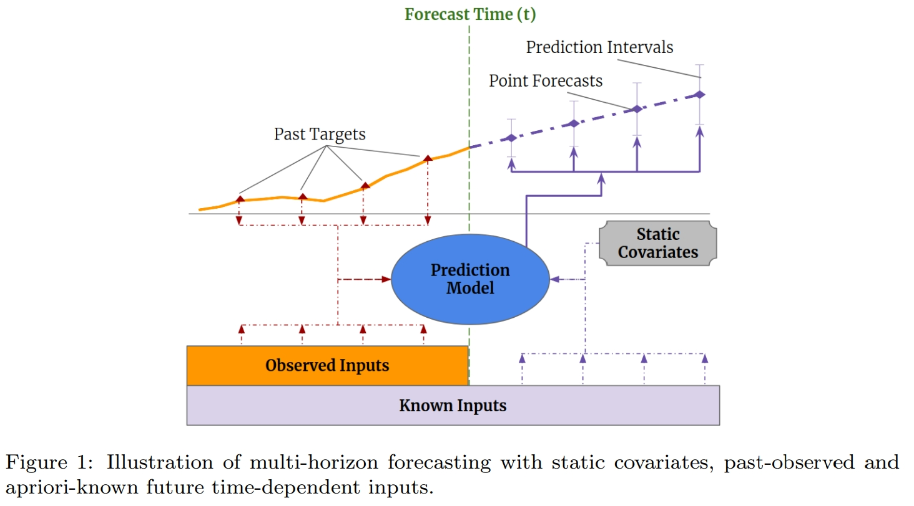
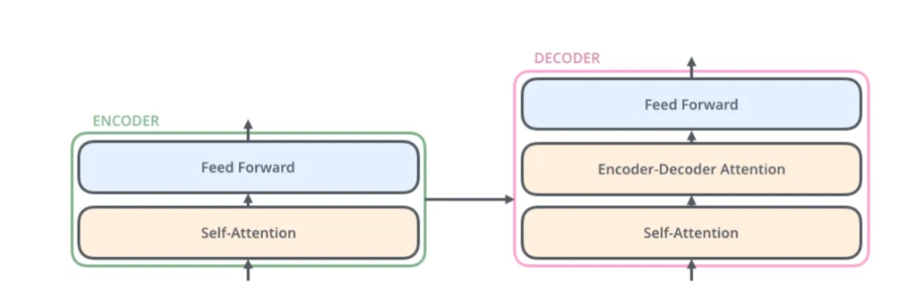

目录

- [论文简介](#论文简介)
- [历史研究和瓶颈](#历史研究和瓶颈)
    - [如何利用多个数据源](#如何利用多个数据源)
    - [如何解释模型的预测结果](#如何解释模型的预测结果)
- [论文贡献](#论文贡献)
- [问题定义](#问题定义)
- [模型定义](#模型定义)
    - [GRN](#grn)
    - [VSN](#vsn)
    - [SCE](#sce)
    - [TFD](#tfd)
        - [SEL](#sel)
        - [TSL](#tsl)
        - [PFL](#pfl)
- [实验结果](#实验结果)
- [总结](#总结)
- [资料](#资料)

# 论文简介

> * 论文：Temporal Fusion Transformers for Interpretable Multi-horizon Time Series Forecasting
> * 作者：牛津大学和谷歌云AI
> * 代码：https://github.com/google-research/google-research/tree/master/tft
> * 简介：TFT （Temporal Fusion Transformers）是针对多步预测任务的一种 Transformer 模型，并且具有很好的可解释性。

# 历史研究和瓶颈

在时序多步预测任务中，DNN（深度神经网络模型）面临以下两个挑战：

1. 如何利用多个数据源？
2. 如何解释模型的预测结果？

## 如何利用多个数据源

在时序任务中，有 2 类数据源，见下图所示：

1. 静态变量（Static Covariates）：不会随时间变化的变量，例如商店位置;
2. 时变变量（Time-dependent Inputs）：随时间变化的变量;
    - 过去观测的时变变量（Past-observed Inputs）：过去可知，但未来不可知，例如历史客流量
    - 先验已知未来的时变变量（Apriori-known Future Inputs）：过去和未来都可知，例如节假日；

多步预测时利用的异质数据源：

很多 RNN 结构的变体模型，还有 Transformer 的变体模型，很少在多步预测任务上，
认真考虑怎么去利用不同数据源的输入，只是简单把静态变量和时变变量合并在一起，
但其实针对不同数据源去设计网络，会给模型带来提升。

## 如何解释模型的预测结果

除了不考虑常见的多步预测输入的异质性之外，大多数当前架构都是" 黑盒" 模型，
预测结果是由许多参数之间的复杂非线性相互作用控制而得到的。
这使得很难解释模型如何得出预测，进而让使用者难以信任模型的输出，
并且模型构建者也难对症下药去 Debug 模型。

不幸的是，DNN 常用的可解释性方法不适合应用于时间序列。在它们的传统方法中，
事后方法（Post-hoc Methods），例如 LIME 和 SHAP 不考虑输入特征的时间顺序。

另一方面，像 Transformer 架构，它的自相关模块更多是能回答“哪些时间点比较重要？”，
而很难回答“该时间点下，哪些特征更重要？”。

# 论文贡献

TFT 模型有如下贡献：

1. 静态协变量编码器：可以编码上下文向量，提供给网络其它部分；
2. 门控机制和样本维度的特征选择：最小化无关输入的贡献；
3. sequence-to-sequence 层：局部处理时变变量（包括过去和未来已知的时变变量）；
4. 时间自注意解码器：用于学习数据集中存在的长期依赖性。这也有助于模型的可解释性，
   TFT 支持三种有价值的可解释性用例，帮助使用者识别：
    - 全局重要特征
    - 时间模式
    - 重要事件

# 问题定义

TFT 支持分位数预测，
对于多步预测问题的定义，可以简化为如下的公式：

`$$\hat{y}_{i}(q, t, \tau) = f_{q}(\tau, y_{i, t-k:t}, z_{i,t-k:t}, x_{i, t-k:t+\tau}, s_{i})$$`

其中：

* `$\hat{y}_{i}(q, t, \tau)$`：在时间点 `$t$` 下，预测未来第 `$\tau$` 步下的 `$q$` 分位数值；
* `$f_{q}(\cdot)$`：预测模型；
* `$y_{i, t-l:t}$`：历史目标变量；
* `$z_{i, t-k:t}$`：过去可观测，但未来不可知的时变变量(Past-observed Inputs)；
* `$x_{i, t-k:t+\tau}$`：先验已知未来的时变变量(Apriori-known Future Inputs)；
* `$s_{i}$`：静态协变量(Static Covariates)。

那怎么实现预测分位数呢？除了像 DeepAR 预测均值和标准差，
然后对预测目标做高斯采样后，做分位数统计。TFT 用了另外的方法，设计分位数损失函数，
我们先看下它损失函数的样子： 

`$$\mathcal{L}(\Omega, \mathit{W}) = \sum_{y_{t} \in \Omega}\sum_{q \in \mathcal{Q}}\sum_{\tau=1}^{\tau_{max}}\frac{QL(y_{t}, \hat{y}(q, t-\tau, \tau), q)}{M \tau_{max}}$$`

`$$QL(y, \hat{y}, q) = q(y - \hat{y})_{+} + (1-q)(\hat{y} - y)_{+}$$`

其中：

* `$\mathcal{L}(\Omega, \mathit{W})$` 是平均单条时序且平均预测点下的分位数 `$q$` 的损失
* `$\Omega$` 是包含样本的训练数据域
* `$\mathit{W}$` 表示 TFT 的权重
* `$y_{t}$` 是时序数据
* `$\mathcal{Q}$` 是输出分位数的集合，在实验中使用 `$\mathcal{Q}={0.1, 0.5, 0.9}$`
* `$QL(y, \hat{y}, q)$`：在此公式中，
  `$(\cdot)_{+} = max(0, \cdot)$`，由于 `$y-\hat{y}$` 和 `$\hat{y}-y$` 几乎会一正一负，所以公式可以转换成：
    `$$QL(y, \hat{y, q}) = max(q(y, \hat{y}), (1-q)(\hat{y} - y))$$`

假设我们现在拟合分位数 0.9 的目标值，代入上述公式便是：

`$$QL(y, \hat{y}, q=0.9) = max(0.9 \times (y-\hat{y}), 0.1 \times (\hat{y} - y))$$`

此时会有两种情况：

1. 若 `$y-\hat{y} > 0$`，即模型预测偏小，损失增加会更多
2. 若 `$\hat{y} -y > 0$`，即模型预测偏大，损失增加会更少

由于权重是 `$(y-\hat{y}):(\hat{y}-y) = 9:1$`，所以训练时，
模型会越来越趋向于预测出大的数字，这样损失下降得更快，
则模型的整个拟合的超平面会向上移动，这样便能很好地拟合出目标变量的 90% 分位数值。

为了避免不同预测点下的预测量纲不一致的问题，作者还做了正则化处理。
另外的原因是这边只关注 P50 和 P90 两个分位数：

`$$q - Risk = \frac{2\sum_{y_{t}\in \tilde{\Omega}}\sum_{\tau=1}^{\tau_{max}}QL(y_{t}, \hat{y}(q, t-\tau, \tau), q)}{\sum_{y_{t} \in \tilde{\Omega}}\sum_{\tau = 1}^{\tau_{max}}|y_{t}|}$$`

# 模型定义

TFT 模型完整结构如下图所示：

看起来的挺复杂的，这里先简要了解下里面各模块的功能后，我们再详细展开了解各模块细节。

1. GRN（Gated Residual Network）：通过 Residual Connections 和 Gating layers 确保有效信息的流动；
2. VSN（Variable Selection Network）：基于输入，明智地选择最显著的特征；
3. SCE（Static Covariate Encoders）：编码静态协变量上下文向量；
4. TFD（Temporal Fusion Decoder）：学习数据集中的时间关系，里面主要有以下 3 大模块：
    - SEL（Static Enrichment Layer）：用静态元数据增强时间特征；
    - TSL（Temporal Self-Attention Layer）：学习时序数据的长期依赖关系并提供为模型可解释性；
    - PFL（Position-wise Feed-forward Layer）：对自关注层的输出应用额外的非线性处理。

如果拿 Transformer 的示意图来对比，
我们其实能看到 TFT 的 Variable Selection 类似 Transformer 的 Self-Attention，
而 Temporal Self-Attention Layer 类似 Encoder-Decoder Attention，
这样类比 Transformer 去看 TFT 的结构，可能对理解有些帮助。Transformer 的结构示意图如下：

## GRN

> GRN: Gated Residual Network

## VSN

> VSN: Variable Selection Network

## SCE

> SCE: Static Covariate Encoders

## TFD

> TFD: Temporal Fusion Decoder

### SEL

> SEL: Static Enrichment Layer

### TSL

> TSL: Temporlal Self-Attention Layer

### PFL

> PFL: Position-wise Feed-forward Layer

# 实验结果

# 总结

在特征选择上，TFT有点TabNet的影子。另外对静态数据、历史和未来数据的利用，也挺好的。
听不少人说 TFT 效果还不错。

# 资料

* [TFT：Temporal Fusion Transformers](https://mp.weixin.qq.com/s?__biz=MzUyNzA1OTcxNg==&mid=2247486809&idx=1&sn=dc7a1da5583790977c0ffa45e5b1b1e7&scene=19#wechat_redirect)
* [论文：https://arxiv.org/abs/1912.09363](https://arxiv.org/abs/1912.09363)
* [TFT GitHub](https://github.com/google-research/google-research/tree/master/tft)