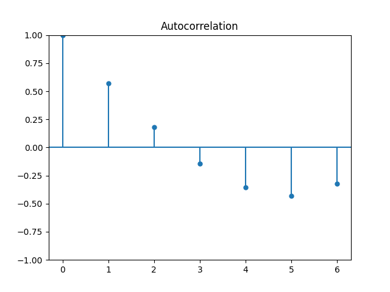

<style>
details {
    border: 1px solid #aaa;
    border-radius: 4px;
    padding: .5em .5em 0;
}
summary {
    font-weight: bold;
    margin: -.5em -.5em 0;
    padding: .5em;
}
details[open] {
    padding: .5em;
}
details[open] summary {
    border-bottom: 1px solid #aaa;
    margin-bottom: .5em;
}
</style>

<details><summary>目录</summary><p>

- [Install](#install)
  - [依赖](#依赖)
  - [PyPI](#pypi)
  - [Conda](#conda)
  - [常规使用方式](#常规使用方式)
- [快速开始](#快速开始)
  - [创建 Array](#创建-array)
  - [ACF 和 PACF](#acf-和-pacf)
  - [Auto-ARIMA](#auto-arima)
  - [载入依赖库](#载入依赖库)
    - [数据](#数据)
    - [训练模型](#训练模型)
  - [查看模型信息](#查看模型信息)
  - [序列化模型](#序列化模型)
    - [pickle](#pickle)
    - [joblib](#joblib)
    - [对比 pickle 和 joblib 结果](#对比-pickle-和-joblib-结果)
  - [使用新的观测样本更新模型](#使用新的观测样本更新模型)
- [参考](#参考)
</p></details><p></p>

# Install

## 依赖

* Numpy (>=1.17.3)
* SciPy (>=1.3.2)
* Scikit-learn (>=0.22)
* Pandas (>=0.19)
* Statsmodels (>=0.11)

## PyPI

```bash
$ pip install pmdarima
```

## Conda

```bash
$ conda config --add channels conda-forge
$ conda config --set channel_priority strict
$ conda install pmdarima
```

## 常规使用方式

```python
import pmdarima as pm
from pmdarima.arima import auto_arima
```

# 快速开始

## 创建 Array

```python
import pmdarima as pm

# array like vector in R
x = pm.c(1, 2, 3, 4, 5, 6, 7)
print(x)
```

```
[1 2 3 4 5 6 7]
```

## ACF 和 PACF

```python
import pmdarima as pm

x_acf = pm.acf(x)
print(x_acf)
```

```
[ 1.          0.57142857  0.17857143 -0.14285714 -0.35714286 -0.42857143 -0.32142857]
```

```python
import pmdarima as pm

pm.plot_acf()
```



## Auto-ARIMA

## 载入依赖库

```python
import numpy as np
import pmdarima as pm
from pmdarima.datasets import load_wineind
```

### 数据

```python
# data
wineind = load_wineind().astype(np.float64)
```

### 训练模型

```python
# 拟合 stepwise auto-ARIMA
stepwise_fit = pm.auto_arima(
    y = wineind,
    start_p = 1,
    start_q = 1,
    max_p = 3,
    max_q = 3,
    seasonal = True,
    d = 1,
    D = 1,
    trace = True,
    error_action = "ignore",
    suppress_warnings = True,  # 收敛信息
    stepwise= True,
)
```

```
Performing stepwise search to minimize aic
 ARIMA(1,1,1)(0,0,0)[0] intercept   : AIC=3508.854, Time=0.17 sec
 ARIMA(0,1,0)(0,0,0)[0] intercept   : AIC=3587.776, Time=0.01 sec
 ARIMA(1,1,0)(0,0,0)[0] intercept   : AIC=3573.940, Time=0.01 sec
 ARIMA(0,1,1)(0,0,0)[0] intercept   : AIC=3509.903, Time=0.06 sec
 ARIMA(0,1,0)(0,0,0)[0]             : AIC=3585.787, Time=0.00 sec
 ARIMA(2,1,1)(0,0,0)[0] intercept   : AIC=3500.610, Time=0.09 sec
 ARIMA(2,1,0)(0,0,0)[0] intercept   : AIC=3540.400, Time=0.02 sec
 ARIMA(3,1,1)(0,0,0)[0] intercept   : AIC=3502.598, Time=0.14 sec
 ARIMA(2,1,2)(0,0,0)[0] intercept   : AIC=3503.442, Time=0.15 sec
 ARIMA(1,1,2)(0,0,0)[0] intercept   : AIC=3505.978, Time=0.19 sec
 ARIMA(3,1,0)(0,0,0)[0] intercept   : AIC=3516.118, Time=0.04 sec
 ARIMA(3,1,2)(0,0,0)[0] intercept   : AIC=3504.888, Time=0.10 sec
 ARIMA(2,1,1)(0,0,0)[0]             : AIC=3500.251, Time=0.04 sec
 ARIMA(1,1,1)(0,0,0)[0]             : AIC=3509.015, Time=0.04 sec
 ARIMA(2,1,0)(0,0,0)[0]             : AIC=3538.500, Time=0.02 sec
 ARIMA(3,1,1)(0,0,0)[0]             : AIC=3502.238, Time=0.09 sec
 ARIMA(2,1,2)(0,0,0)[0]             : AIC=3503.042, Time=0.10 sec
 ARIMA(1,1,0)(0,0,0)[0]             : AIC=3571.973, Time=0.01 sec
 ARIMA(1,1,2)(0,0,0)[0]             : AIC=3508.438, Time=0.05 sec
 ARIMA(3,1,0)(0,0,0)[0]             : AIC=3514.328, Time=0.03 sec
 ARIMA(3,1,2)(0,0,0)[0]             : AIC=3504.226, Time=0.12 sec

Best model:  ARIMA(2,1,1)(0,0,0)[0]          
Total fit time: 1.478 seconds
```

## 查看模型信息

```python
import pmdarima as pm

print(pm.show_versions())
print(stepwise_fit.summary())
```

```
System:
    python: 3.7.10 (default, Mar  6 2021, 16:49:05)  [Clang 12.0.0 (clang-1200.0.32.29)]
executable: /Users/zfwang/.pyenv/versions/3.7.10/envs/ts/bin/python
   machine: Darwin-22.1.0-x86_64-i386-64bit

Python dependencies:
        pip: 22.2.2
 setuptools: 47.1.0
    sklearn: 1.0.2
statsmodels: 0.13.2
      numpy: 1.21.6
      scipy: 1.7.3
     Cython: 0.29.30
     pandas: 1.3.5
     joblib: 1.1.0
   pmdarima: 1.8.5
```

```
                               SARIMAX Results                                
==============================================================================
Dep. Variable:                      y   No. Observations:                  176
Model:               SARIMAX(2, 1, 1)   Log Likelihood               -1746.125
Date:                Sun, 13 Nov 2022   AIC                           3500.251
Time:                        00:19:45   BIC                           3512.910
Sample:                             0   HQIC                          3505.386
                                - 176                                         
Covariance Type:                  opg                                         
==============================================================================
                 coef    std err          z      P>|z|      [0.025      0.975]
------------------------------------------------------------------------------
ar.L1          0.1420      0.109      1.307      0.191      -0.071       0.355
ar.L2         -0.2572      0.125     -2.063      0.039      -0.502      -0.013
ma.L1         -0.9074      0.052    -17.526      0.000      -1.009      -0.806
sigma2      2.912e+07   1.19e-09   2.44e+16      0.000    2.91e+07    2.91e+07
===================================================================================
Ljung-Box (L1) (Q):                   0.01   Jarque-Bera (JB):                 0.48
Prob(Q):                              0.92   Prob(JB):                         0.79
Heteroskedasticity (H):               1.37   Skew:                            -0.12
Prob(H) (two-sided):                  0.23   Kurtosis:                         2.92
===================================================================================

Warnings:
[1] Covariance matrix calculated using the outer product of gradients (complex-step).
[2] Covariance matrix is singular or near-singular, with condition number 2.74e+32. Standard errors may be unstable.
```

## 序列化模型

### pickle

```python
import pickle

# pickle serialize model
with open("arima.pkl", "wb") as pkl:
    pickle.dump(stepwise_fit, pkl)

# pickle load model
with open("arima.pkl", "rb") as pkl:
    pickle_preds = pickle.load(pkl).predict(n_periods = 5)
```

### joblib

```python
import joblib

# joblib serialize model
with open("arima.pkl", "wb") as pkl:
    joblib.dump(stepwise_fit, pkl)

# joblib load model
with open("arima.pkl", "rb") as pkl:
    joblib_preds = joblib.load(pkl).predict(n_periods = 5)
```

### 对比 pickle 和 joblib 结果

```python
import numpy as np

np.allclose(pickle_preds, joblib_preds)
```

## 使用新的观测样本更新模型

```python
import pickle

import pmdarima as pm
from pmdarima.datasets import load_wineind


# data
wineind = load_wineind().astype(np.float64)
train, test = wineind[:125], wineind[125:]

# 拟合 stepwise auto-ARIMA
stepwise_fit = pm.auto_arima(
    y = wineind,
    start_p = 1,
    start_q = 1,
    max_p = 3,
    max_q = 3,
    seasonal = True,
    d = 1,
    D = 1,
    trace = True,
    error_action = "ignore",
    suppress_warnings = True,  # 收敛信息
    stepwise= True,
)

# ARIMA model
arima = pm.ARIMA(order = (2, 1, 1), seasonal_order = (0, 0, 0, 0))
arima.fit(train)

# pickle serialize model
with open("arima.pkl", "wb") as pkl:
    pickle.dump(arima, pkl)

# pickle load model
with open("arima.pkl", "rb") as pkl:
    arima = pickle.load(pkl)
    pickle_preds = pickle.load(pkl).predict(n_periods = 5)

# 更新模型
arima.update(test)

# pickle serialize model
with open("arima.pkl", "wb") as pkl:
    pickle.dump(arima, pkl)
```

# 参考

* [Doc](http://alkaline-ml.com/pmdarima/index.html)
* [Doc Examples](http://alkaline-ml.com/pmdarima/auto_examples/index.html)

