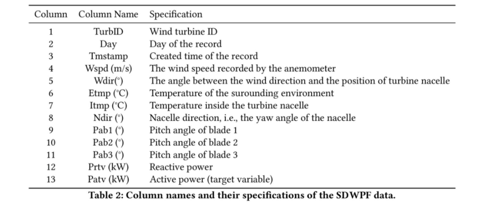

目录

- [风力发电机功率预测问题](#风力发电机功率预测问题)
  - [任务定义](#任务定义)
  - [风力发电机简介](#风力发电机简介)
  - [数据概况](#数据概况)
  - [评价指标](#评价指标)
- [参考](#参考)

# 风力发电机功率预测问题

## 任务定义

2022 年 kdd cup 提供了龙源电力集团有限公司独特的空间动态风力预测数据集：SDWPF，
其中包括：风力涡轮机的空间分布，以及时间、天气和涡轮机内部状态等动态背景因素。
预测目标是 134 个风机各自在未来 288 个时刻(共 2 天)下的输出功率

需要在 48 小时之前解决空间动态风力发电预测问题。例如，在今天上午 06:00:00 给出，
根据风电场和相关风力涡轮机的一系列历史记录，需要有效地预测从上午 06:00 到后天上午 05:50 的风力发电。
需要每10 分钟输出一次预测值。具体而言，在一个时间点，需要预测未来的长度 288（48 小时 * 60 分钟 / 10 分钟）风力发电时间序列

## 风力发电机简介

风力涡轮机结构：

风力涡轮机结构组件：

* Tower
    - yaw motor
    - yaw driver：
* Rotor
    - wind direction
    - blades
    - pitch
* Nacelle
    - brake
    - lowe-speed shaft
    - gear box
    - generator
    - high-speed shaft
    - controller
    - anemometer
    - wind vane

## 数据概况

* SDWPF：龙源电力集团有限公司独特的空间动态风力预测数据集
* SDWFP 数据概况信息：

    | Days | Interval | Num of columns | Num of turbines | Num of records |
    |----|----|----|----|----|
    | 245 | 10 minutes | 13 | 134 | 4,727,520 |

* SDWPF 特征信息：

    

    - 预测特征：
        - 风力涡轮机编号
        - 日期时间
            - 日期 
            - 时间
        - 风速计记录的风速，m/s
        - 风向与涡轮机舱位置的角度，°
        - 周边环境的温度，℃
        - 涡轮机内部状态
            - 涡轮机舱内部温度，℃
            - 1# 桨距角，°
            - 2# 桨距角，°
            - 3# 桨距角，°
        - 无功功率，kW
        - #TODO 风力涡轮机的空间分布（相对位置）：用于建模风力涡轮机之间的空间相关性 
    - 预测目标：
        - 有功功率，kW
* 在数据使用时，要注意：
    1. 零值：有一些有功功率和无功功率小于零。我们会将小于 0 的所有值视为 0
    2. 缺失值：由于某些原因，某些时间的某些值不是从 SCADA 系统收集的。这些缺失值将不用于评估模型。
       例如：如果 `$p_{t_{0} + j}$` 是缺失值，则我们会设  `$|p_{t_{0}+j} - \hat{p}_{t_{0}+j}| = 0$`，而不管预测值是多少
    3. 未知值：在某些时候，风力涡轮机由于外部原因而停止发电，例如风力涡轮机翻新和/或主动调度动力以避免电网过载。
       在这些情况下，风力涡轮机的实际发电功率是未知的。这些未知值也将不用于评估模型。与缺失值类似，忽略它们。
       任意满足以下两种情况之一，便能判断出目标变量(`Patv`)是未知的：
        - 如果时间 `$t$` 下， `$Patv \leq 0$` kW 且 `$Wspd>2.5$` m/s
        - 如果时间 `$t$` 下，`$Pab1>89°$` 或 `$Pab2>89°$` 或 `$Pab3>89°$`
    4. 异常值：当某样本数据存在异常记录时，不用它于评估模型，即我们会设 `$|p_{t_{0}+j} - \hat{p}_{t_{0}+j}| = 0$`，判断异常值的规则有两种：
        - `Ndir` 的合理范围是 `$[-720°,720°]$`，因为涡轮机系统允许机舱在一个方向上最多旋转两轮，
          否则将强制机舱返回原始位置。因此，超出范围的记录可以看作是记录系统引起的异常值
        - `Wdir` 的合理范围是 `$[-180°, 180°]$`。超出此范围的记录可以看作是记录系统引起的异常值
    5. 未来的气象数据(风速、温度等)都未知，且我们不能使用外部数据。除了发布数据外，组织方仍然私下持有几个月的数据来评估参与者提交的模型

## 评价指标

在这个任务中，用 RMSE(均方根误差)和 MAE(平均绝对误差) 的平均值评估每个风力涡轮机的预测结果，然后将预测分数相加作为模型的最终分数

在时间 `$t_{0}$` 下，假设真实的风力涡轮发电机的有功功率时间序列为：

`$$P = \{P_{t_{0} + 1}, P_{t_{0} + 2}, \ldots, P_{t_{0} + 288}\}$$`

假设预测的风力涡轮机发电有功功率时间序列为：

`$$P = \{\hat{P}_{t_{0} + 1}, \hat{P}_{t_{0} + 2}, \ldots, \hat{P}_{t_{0} + 288}\}$$`

则 `$s_{t_{0}}^{i}$` 定义为风力涡轮机 `$i$` 在时间 `$t_{0}$` 的评估分数：

`$$s_{t_{0}}^{i} = \frac{1}{2}(RMSE + MAE)$$`

其中：

`$$RMSE = \sqrt{\frac{1}{288} \sum_{j=1}^{288}(P_{t_{0}+j}^{i} - \hat{P}_{t_{0}+j}^{i})^{2}}$$`

`$$MAE = \frac{1}{288} \sum_{j=1}^{288}|P_{t_{0}+j}^{i} - \hat{P}_{t_{0}+j}^{i}|$$`

则总分 `$S_{t_{0}}$` 是所有风力涡轮机的预测分数之和，即：

`$$S_{t_{0}} = \sum_{i=1}^{134}s_{t_{0}}^{i}$$`

在预测时：

* 滑动窗口步长为 `$\Delta t$`
* 窗口大小为 `$L_{x} + 288$`
* 模型输入长度为 `$L_{x}$`
* 模型输出长度为 `$288$`

最后，对所有滑窗预测的结果做平均。假设用 `$K$` 个数据序列做模型评估，每个数据序列数为 `$k$`，会随机采样一个滑动窗口步数 `$\Delta t$`(比如范围 `$[10min, 100min]$`)，最后分数为：

`$$score = \frac{1}{K}\sum_{k=0}^{K}S_{t_{0} + \sum_{r=0}^{k}\Delta t_{r}}$$`

# 参考

* [Baidu KDD CUP 2022](https://aistudio.baidu.com/aistudio/competition/detail/152/0/introduction)
* [Baidu KDD Cup 2022 风电预测比赛总结](https://mp.weixin.qq.com/s?__biz=MzUyNzA1OTcxNg==&mid=2247487679&idx=1&sn=4c31e6f34b514bd497f8aebb640b447a&chksm=fa040ed4cd7387c21eb15b9b45036a25909101da80dcb3b30d1ebe000036ff621b08d7c3bbe5&scene=21#wechat_redirect)
* [龙源风电赛道全流程基线方案分享](https://mp.weixin.qq.com/s/gxoXA0EFHxuVowax1j9Njw)
