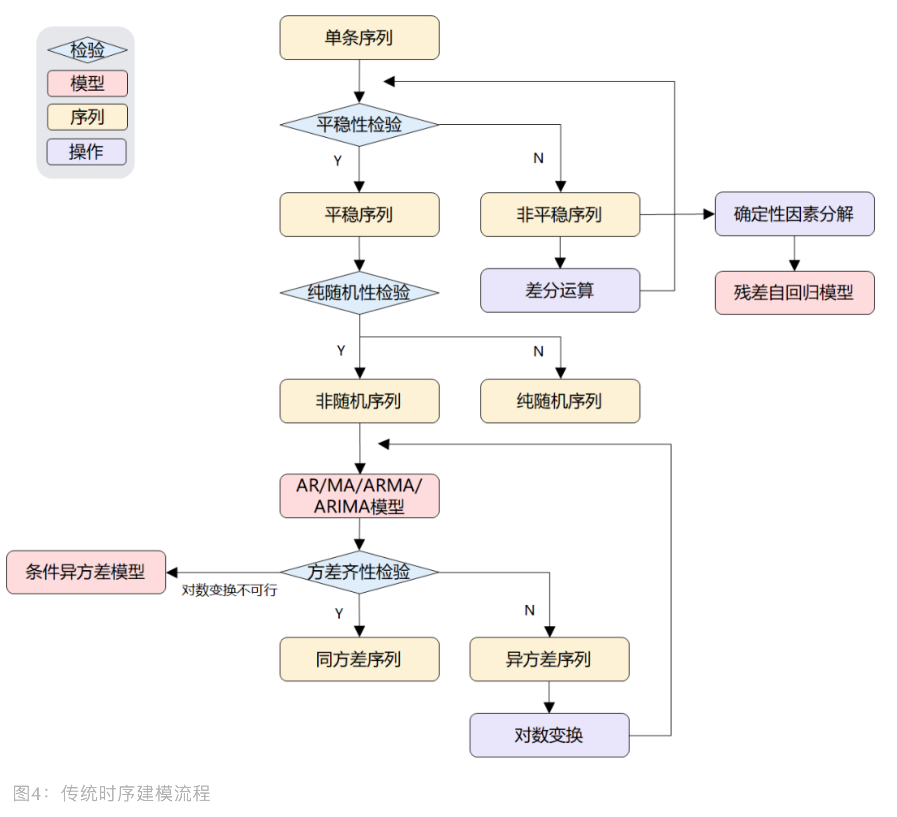

目录

- [时间序列分析](#时间序列分析)
- [时间序列预测问题](#时间序列预测问题)
  - [一般回归问题](#一般回归问题)
  - [自回归问题](#自回归问题)
- [时间序列建模方法](#时间序列建模方法)
- [优缺点及意义](#优缺点及意义)

# 时间序列分析

统计性时域分析主要是横向挖掘时序的内生相关关系，其中，
描述时序内生相关关系的两个重要统计指标是：自协方差函数和自相关系数

* 自协方差函数：就是协方差，只不过 `$X_{t_{1}}$` 和 `$X_{t_{2}}$` 对应的是时间序列 `$t_{1}$` 和 `$t_{1}$`。
  之所以前面有个”自“，是因为时间序列 `$t_{1}$` 和 `$t_{1}$` 是时间序列 `$T$` 下的子序列，
  只不过存在 lag（平移系数）的区别，因此是自己比较自己，形象地讲就是度量自己过去的行为对自己的影响

`$$cov(X_{t_{1}}, X_{t_{2}}) = E\big[(X_{t_{1}} - \mu_{t_{1}})(X_{t_{2}} - \mu_{t_{2}})\big]$$`

* 自相关系数：就是相关系数。分母为两个时间序列的标准差的乘积

`$$\rho(X_{t_{1}}, X_{t_{2}}) = \frac{cov(X_{t_{1}}, X_{t_{2}})}{\sigma_{t_{1}}\sigma_{t_{2}}}$$`

# 时间序列预测问题

统计性时域时间序列预测的问题，并不是普通的回归问题, 而是自回归

## 一般回归问题

一般的回归问题比如最简单的线性回归模型：

`$$Y=a X_{1} + b X_{2} + \epsilon$$`

讨论的是因变量 `$Y$` 关于两个自变量 `$X_1$` 和 `$X_2$` 的关系，
目的是找出最优的 `$a^{*}$` 和 `$b^{*}$`，
来使预测值 `$y=a^{*} X_{1} + b^{*} X_{2}$` 逼近真实值 `$Y$`

## 自回归问题

自回归模型中，自变量 `$X_1$` 和 `$X_2$` 都为 `$Y$` 本身，也就是说 

`$$Y(t)=a Y(t-1)+ b Y(t-2) + \epsilon$$`

其中：

* `$Y(t-1)$` 为 `$Y$` 在 `$t-1$` 时刻的值
* `$Y(t-2)$` 为 `$Y$` 在 `$t-2$` 时刻的值
  
换句话说，现在的 `$Y$` 值由过去的 `$Y$` 值决定，因此自变量和因变量都为自身，因此这种回归叫自回归

自回归模型都有着严格理论基础，讲究时间的平稳性，需要对时间序列进行分析才能判断是否能使用此类模型。
这些模型对质量良好的时间序列有比较高的精度。传统的自回归模型有：

* 自回归模型(AR, Auto Regressive)
* 移动平均模型(MA, Moving Average)
* 自回归移动平均模型(ARMA, Auto-Regressive Moving Average)
* 指数平滑(Exponential Smoothing)
* 差分自回归移动平均模型(ARIMA)

# 时间序列建模方法

传统时间序列预测模型，通常指用于时间序列分析/预测的统计学模型，
比如常用的有均值回归、ARIMA、指数平滑预测法等。传统的参数预测方法可以分为两种：

* 一种拟合标准时间序列的参数方法，包括移动平均，指数平均等
* 另一种是考虑多因素组合的参数方法，即 AR, MA, ARMA 等模型

这类方法比较适用于小规模，单变量的预测，比如某门店的销量预测等。总的来说，基于此类方法的建模步骤是：

1. 首先，需要对观测值序列进行平稳性检测，如果不平稳，则对其进行差分运算直到差分后的数据平稳
2. 在数据平稳后则对其进行白噪声检验，白噪声是指零均值常方差的随机平稳序列
3. 如果是平稳非白噪声序列就计算 ACF(自相关系数)、PACF(偏自相关系数)，进行 ARMA 等模型识别，
   对已识别好的模型，确定模型参数，最后应用预测并进行误差分析

这类方法一般是统计或者金融出身的人用的比较多，对统计学或者随机过程知识的要求比较高。
而在数据挖掘的场景中比较难适用，因为需要大量的参数化建模。
比如有一个连锁门店的销售数据，要预测每个门店的未来销量，
用这类方法的话就需要对每个门店都建立模型，这样就很难操作了

# 优缺点及意义

优点：

* 复杂度低、计算速度快

缺点：

* 由于真实应用场景的复杂多样性(现实世界的时间序列往往受到各种不同因素的限制与影响，而难以预测)，比如受到营销计划、自然灾害等的影响
* 传统的单一统计学模型的准确率相对来说会比机器学习差一些，而机器学习模型或者更复杂的 ensemble 集成模型会有更好的效果

传统时间序列预测模型也有其重要的意义，比如：

* 可以作为预测的 baseline model，为项目提供一个准确率的基准线，来帮助评估其他模型的提升
* 由于其较好的可解释性，可以用来对数据进行前置清洗，可以帮助剔除一些异常值，
  比如因服务器故障或者业务线逻辑调整产生的异常值
* 可以作为集成模型中的一块，参与时序集成模型的训练
* 可以提供一个预测结果的合理的范围，使用这个合理的范围，
  在黑盒模型最后输出结果时，帮忙进行后置校准，从而使预测系统更加稳定

