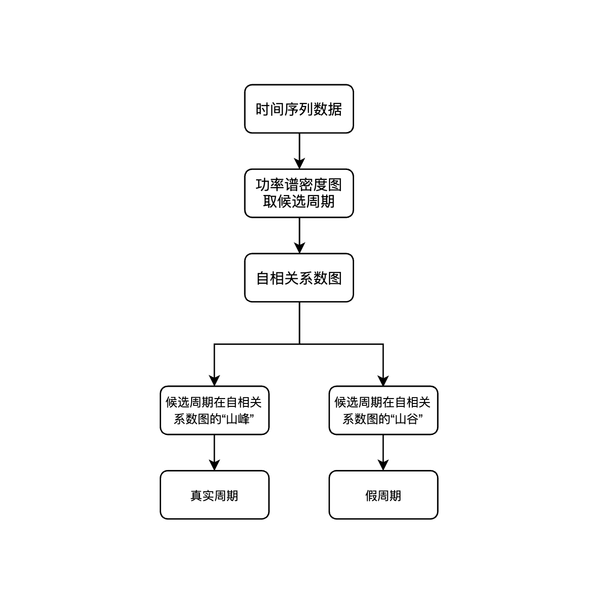
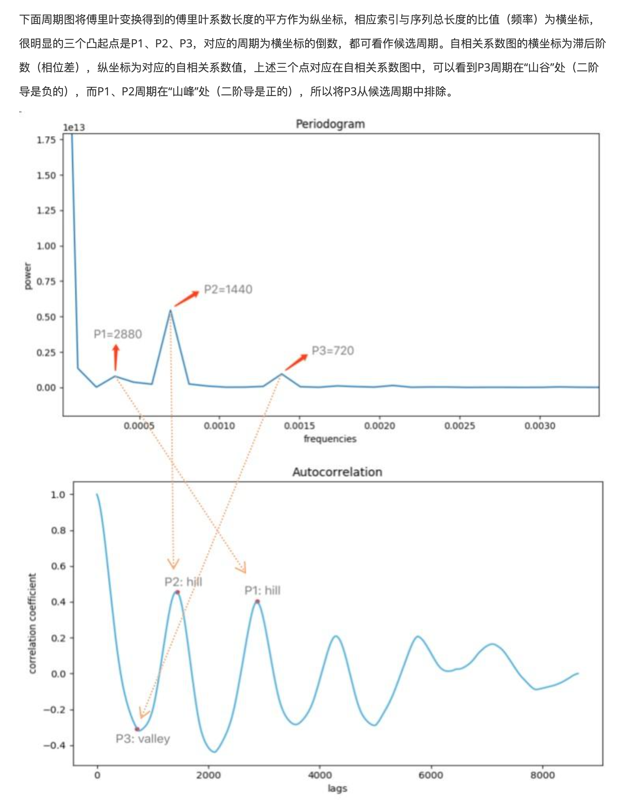

目录

- [时间序列趋势性检测](#时间序列趋势性检测)
    - [移动平均](#移动平均)
    - [时间回归法](#时间回归法)
- [时间序列周期性检测](#时间序列周期性检测)
    - [周期性检测简介](#周期性检测简介)
    - [傅里叶变换](#傅里叶变换)
    - [自相关系数](#自相关系数)
    - [周期性检测流程](#周期性检测流程)
        - [检测流程](#检测流程)
        - [实例分析](#实例分析)
- [参考](#参考)

# 时间序列趋势性检测

* 移动平均法
    - 在原时间序列内依次求连续若干期的平均数作为其某一期的趋势值，
      如此逐项递移求得一系列的移动平均数，形成一个平均数时间序列
* 时间回归法
    - 使用回归分析中的最小二乘法，以时间 `$t$` 或 `$t$` 的函数为自变量拟合趋势方程。常用的趋势方程如下
        - 一阶线性方程
        - 二次、多次方程曲线
        - 指数曲线

趋势其实就是非平稳, 包括均值、方差等的趋势

* 对均值或方差的趋势检验可以采用分组计算, 再结合游程检验的思路进行
* 如果有趋势, 则需要先提取趋势项再去掉趋势项
* 对趋势项可以采取滤波器消除
* 对于多项式趋势可以采用最小二乘法提取
* 对缓慢变化趋势可采用数据时间窗和最小二乘平滑进行处理

## 移动平均

## 时间回归法

# 时间序列周期性检测

分析序列中的周期性或准周期序列(如季节、星期等), 可通过直观比较得到周期性的定性结果:
    
- 周期序列的功率谱会产生尖峰
- 自相关系数是连续振荡波形
- 数据的概率密度直方图是下凸, 非周期是上凸

## 周期性检测简介

任何事物在两个不同时刻都不可能保持完全相同的状态, 但很多变化往往存在着一定的规律, 
例如 24 小时日出日落, 潮起潮落, 这些现象通常称为周期.

周期性指时间序列中呈现出来的围绕长期趋势的一种波浪形或震荡式变动. 准确提取周期信息, 
不仅能反映当前数据的规律, 应用于相关场景, 还可以预测未来数据变化趋势. 
这是时间序列研究的基本要素.通过肉眼观察时序图, 可以很容易地判断数据是否满足周期性, 
但无法知道准确的周期时长, 且当数据组数达到一定数量时, 这种方式就不再适用了.

一般而言, 时间序列周期性分为三种: 

* 符号性周期: 表示只有一个以上的符号是周期性的, 并且部分地出现
    - 例如序列 `f` bcn `f` kgb `f` ops 中的 `f` 有周期性, 它的周期是 4, 可以用 CONV 方法检测
* 部分周期性: 表示有一个以上的符号是周期性的, 并且部分地出现
    - 例如序列 ansd `cd` mn `cd` ca `cd` as `cd` mc 中 `cd` 具有周期性, 周期从位置 4 开始, 可以用 PARPER 方法检测
* 分段周期性: 整个序列被表示为一个周期模式

## 傅里叶变换

## 自相关系数

自相关系数(Autocorrelation Function) 度量的是同一件事不同时间的相关程度.

比如有一个序列 `$X = [1, 2, 3, 5, 7, 9, 13, 14, 17, 19]$`, 求不同相位差的自相关系数

- 相位差为 1 时, 比较的序列是 `$[1, 2, 3, 5, 7, 9, 13, 14, 17]$` 和 `$[2, 3, 5, 7, 9, 13, 14, 17, 19]$`
- 相位差为 2 时, 比较的序列是 `$[1, 2, 3, 5, 7, 9, 13, 14]$` 和 `$[3, 5, 7, 9, 13, 14, 17, 19]$`

不同相位差(lag)序列间的自相关系数可以用 Pearson 相关系数计算:

`$$\begin{align} autocorr(X, t) &= corr[X, lag(X, t)] \\
                              &= \frac{cov[X, lag(X, t)]}{std[X]std[lag(X, t)]} \\
                              &= \frac{cov[X, lag(X, t)]}{var(X)} \\
                              &= \frac{\sum^{N}_{i=1}[X_{i} - mean(X)][X_{i-t} - mean(X)]}{\sum{N}_{i=1}[X_{i} - mean(X)]^{2}}
\end{align}$$`

其中 `$lag(X_{i}, t)=X_{i-1}$` 表示相位 `$t$` 的数据延迟 lag operator

当序列存在周期性时, 遍历足够多的相位差, 一定可以找到至少一个足够大的相关系数, 而它对应的相位差就是周期.

所以对于检测时序周期来说, 只需找到两个自相关系数达到一定阈值的子序列, 反映在时序图上, 就是两段很相似的数据,
它们起始时间的差值就是我们需要的周期. 比如下面的第二张图和第三张图, 它们的序列自相关系数为 1, 起始时间间隔是 12.57, 
正好是第一张图的周期.

## 周期性检测流程

### 检测流程

为了保证结果的可靠性, 可以将傅里叶变换和自相关系数结合起来判断周期性. 
主要思路是:

1. 先通过傅里叶变换找到可能的周期
2. 再用自相关系数做排除, 从而得到最可能的周期

### 实例分析

# 参考
